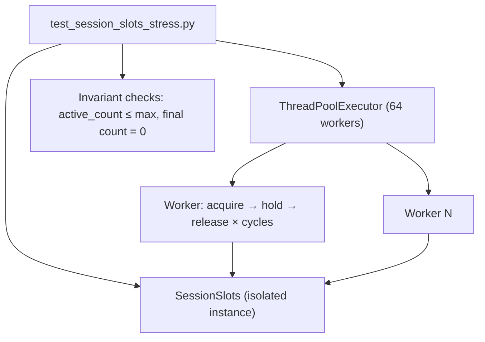

# PYPOST-1147: High-concurrency stress benchmark tests for SessionSlots

## Research

- **`SessionSlots`** (`pypost/core/websocket_session_policy.py`): thread-safe coordinator with `threading.Lock`, `acquire(session_id) -> SlotAcquireResult`, idempotent `release(session_id) -> bool`, and `reset()` for test isolation.
- **Existing coverage** (`tests/test_websocket_settings_and_limits_repro.py`): 20 workers, 8-thread pool, basic acquire/release invariant checks.
- **Gap** (PYPOST-1136 `60-tech-debt.md`): no 50+ worker extreme contention or rapid burst benchmarks.
- **Precedent** (`tests/test_storage_gateway_h3_stress.py`): dedicated `*_stress.py` module with module-level constants, explicit `pytestmark = pytest.mark.timeout(120)`, and architecture-documented cycle counts.

## Implementation Plan

1. **Add `tests/test_session_slots_stress.py`**:
   - Module constants: `STRESS_WORKER_COUNT = 64` (≥ 50), `STRESS_BURST_CYCLES = 50`, `STRESS_MAX_SLOTS = 8`.
   - `pytestmark = pytest.mark.timeout(60)` (stress tier per do-testing).
   - Use `ThreadPoolExecutor(max_workers=STRESS_WORKER_COUNT)` for true concurrent fan-out.

2. **Test scenarios** (Step 3 red → Step 4 green):

   | Test | Asserts |
   | ---- | ------- |
   | `test_session_slots_high_concurrency_acquire_release_burst` | 64 workers × 50 cycles; `active_count <= max_slots` always; final `active_count == 0`; 3,200 successful acquire/release pairs without deadlock |
   | `test_session_slots_sustained_ceiling_contention` | 8 holders pin ceiling while 56 contenders observe `reason="max_concurrent"` refusals; slots drain cleanly after release |
   | `test_session_slots_stress_completes_within_timeout` | Full burst completes (sanity that benchmark is bounded; uses `time.monotonic()` with generous ceiling) |

3. **Shared worker helper** (inline in test module):
   - `_run_burst_worker(slots, worker_id, cycles) -> BurstWorkerResult` dataclass with success/refusal counts.
   - Thread-safe `threading.Event` or atomic counters only where needed for cross-thread max tracking.

**Failing Repro (Step 3):** Add `tests/test_session_slots_stress.py` with tests importing `STRESS_BENCHMARKS_IMPLEMENTED` from the module itself defaulting to `False`, causing `pytest.fail("PYPOST-1147: stress benchmarks not implemented")`. Step 4 sets implementation flag / replaces stub with full burst logic. No production code changes.

## Architecture

### Module responsibilities

| Component | Change |
| --- | ------- |
| `tests/test_session_slots_stress.py` | New dedicated stress benchmark module |
| `pypost/core/websocket_session_policy.py` | **No change** (tests only) |
| `doc/dev/testing.md` | Document new stress module in WebSocket test strategy (Step 8) |

### Patterns

- **Isolated instances**: `SessionSlots(max_slots=STRESS_MAX_SLOTS)` per test — never mutate global singleton.
- **Executor sizing**: `max_workers=STRESS_WORKER_COUNT` matches worker count for maximum lock contention.
- **No sleeps for sync**: rely on `executor.map` / `as_completed` completion.
- **Burst cycles**: each worker uses unique `session_id` per cycle (`f"worker-{wid}-cycle-{c}"`) to exercise set add/remove churn.

## Q&A

**Q: Should stress tests use `get_session_slots()`?**
A: No — isolated instances prevent cross-test pollution and match existing unit test patterns.

**Q: Is a separate `tests/helpers/` module required?**
A: No — keep self-contained like `test_storage_gateway_h3_stress.py` unless helpers exceed ~80 lines.

**Q: What failure mode proves Step 3 red?**
A: Tests collect but fail with explicit `pytest.fail` until Step 4 implements burst workers and removes the stub gate.
