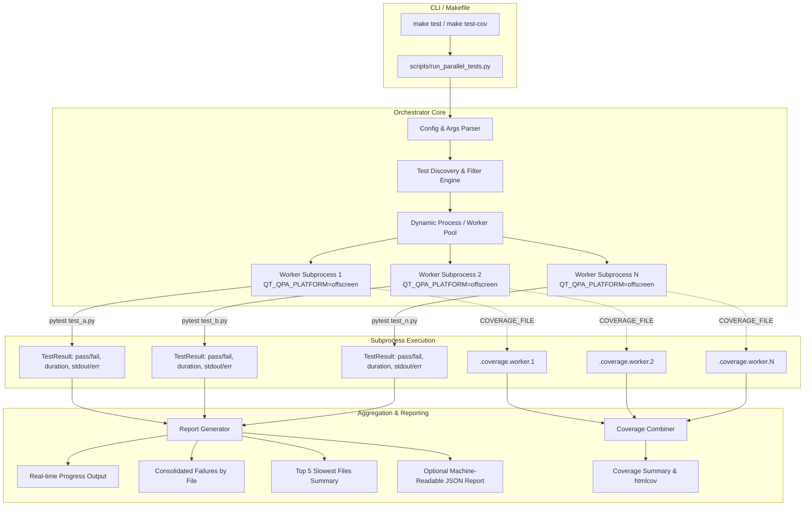

# PYPOST-1149: Implement Parallel Test Runner Orchestrator for make test and make test-cov

## Research

### Existing Test Suite & Invocation Analysis
1. **Test Suite Inventory**:
   - There are 100+ top-level `test_*.py` test files directly located in [`tests/`](file:///home/src/tests).
   - Additional helper modules and plugins reside in [`tests/helpers/`](file:///home/src/tests/helpers), [`tests/_pytest_plugins/`](file:///home/src/tests/_pytest_plugins), [`tests/conftest.py`](file:///home/src/tests/conftest.py), and [`tests/makefile_contract_helpers.py`](file:///home/src/tests/makefile_contract_helpers.py).
   - Each test file is standalone and designed to be run as an independent pytest execution unit.

2. **Current Makefile Targets ([`Makefile`](file:///home/src/Makefile))**:
   - `test`: Runs `QT_QPA_PLATFORM=offscreen $(BIN)/python -m pytest $(if $(PYTEST_ARGS),$(PYTEST_ARGS),tests/ -m "not slow")`.
   - `test-cov`: Runs `QT_QPA_PLATFORM=offscreen $(BIN)/python -m pytest $(if $(PYTEST_ARGS),$(PYTEST_ARGS),tests/ --cov=pypost --cov-report=term-missing --cov-report=html:htmlcov)`.
   - `Makefile` contract tests in [`tests/test_makefile.py`](file:///home/src/tests/test_makefile.py) verify that:
     - `test` excludes the `slow` marker by default (`-m "not slow"` in recipe body).
     - `PYTEST_ARGS` overrides/forwards arguments to the test runner.
     - Help comments match target definitions.

3. **Pytest and Coverage Configuration ([`pyproject.toml`](file:///home/src/pyproject.toml))**:
   - `[tool.pytest.ini_options]` configures `pythonpath = "."`, `addopts = ["-v", "--tb=short", "--cov-fail-under=70", "--strict-markers", "-m", "not slow"]`.
   - Markers defined: `timeout(seconds)`, `slow`, `live_jira`, `agent_e2e`.
   - Standard dependencies: `pytest>=8,<9`, `pytest-cov>=6,<7`, `pytest-timeout>=2,<3`. `coverage` is installed transitively via `pytest-cov`.

4. **Qt / QApp State & Process Isolation**:
   - Tests instantiate `QApplication` or Qt widgets (e.g. dialogs, editors, main window).
   - Running in-process parallel executors (such as thread-based or `pytest-xdist` with shared process space) causes severe Qt singleton and event loop conflicts.
   - Separate OS-level subprocess execution with `QT_QPA_PLATFORM=offscreen` is the only robust mechanism ensuring complete isolation between test modules.

5. **Coverage Aggregation Mechanics**:
   - `coverage` supports combining multiple coverage database files via `coverage combine` (or `Coverage.combine()`).
   - When each worker subprocess runs with a unique `COVERAGE_FILE` (e.g. `.coverage.worker.<id>.<pid>`), zero lock contention occurs during test execution.
   - Post-execution, the orchestrator invokes `coverage combine`, followed by terminal reporting (`coverage report --fail-under=70`) and HTML reporting (`coverage html -d htmlcov`).

---

## Architecture

### System Overview & Module Diagram



### Module Responsibilities

1. **[`scripts/run_parallel_tests.py`](file:///home/src/scripts/run_parallel_tests.py)** (CLI Entrypoint & Orchestrator):
   - **`CLIParser`**: Parses runner arguments (`--workers`, `--cov`, `--report-json`, `--timeout`, test paths) and separates pytest pass-through flags (`-k`, `-m`, `-s`, `-v`, `--tb`, etc.).
   - **`TestDiscovery`**: Discovers candidate test files under `tests/` (matching `test_*.py`, excluding directories and non-test helper modules). Resolves explicit file or directory targets when provided.
   - **`WorkerPool`**: Uses `ThreadPoolExecutor` managing isolated `subprocess.run` executions of `python -m pytest <test_file> <passthrough_args>`.
   - **`TestResult`**: Data class capturing per-file outcome (`PASSED`, `FAILED`, `SKIPPED`), returncode, elapsed duration, stdout, and stderr.
   - **`CoverageManager`**: Manages isolated `COVERAGE_FILE` environment per subprocess, temporary coverage directory lifecycle, executes `coverage combine`, `coverage report`, and `coverage html`.
   - **`ConsoleReporter`**: Thread-safe console output handling real-time single-line progress, consolidated failure tracebacks grouped by test file, and top 5 slowest files table.
   - **`JsonReporter`**: Serializes full run metadata and per-file results into structured JSON for CI ingestion.

### Interfaces & Data Structures

#### Data Models

```python
from dataclasses import dataclass, field
from enum import Enum
from pathlib import Path
from typing import Any, List, Optional

class TestStatus(str, Enum):
    PASSED = "passed"
    FAILED = "failed"
    SKIPPED = "skipped"  # Pytest exit code 5 (no tests collected due to -k/-m filter)

@dataclass(frozen=True)
class TestResult:
    test_file: str
    status: TestStatus
    exit_code: int
    duration_seconds: float
    stdout: str
    stderr: str

@dataclass
class RunSummary:
    total_files: int
    passed_files: int
    failed_files: int
    skipped_files: int
    total_wall_clock_seconds: float
    cumulative_duration_seconds: float
    worker_count: int
    slowest_files: List[tuple[str, float]]
    results: List[TestResult] = field(default_factory=list)

    @property
    def is_success(self) -> bool:
        return self.failed_files == 0
```

#### Core Components & APIs

```python
class RunnerConfig:
    workers: int
    enable_coverage: bool
    report_json_path: Optional[Path]
    test_targets: List[str]
    pytest_args: List[str]
    repo_root: Path
    python_bin: Path

class TestDiscovery:
    @staticmethod
    def discover_test_files(repo_root: Path, targets: List[str]) -> List[Path]:
        """Resolve list of test files from explicit targets or scanning tests/test_*.py."""
        ...

class SubprocessTestExecutor:
    def __init__(self, config: RunnerConfig, cov_dir: Optional[Path] = None):
        ...

    def run_test_file(self, test_file: Path, index: int, total: int) -> TestResult:
        """Execute a single test file in an isolated subprocess with QT_QPA_PLATFORM=offscreen."""
        ...

class CoverageManager:
    def __init__(self, repo_root: Path, cov_dir: Path):
        ...

    def prepare(self) -> None:
        """Create temporary coverage folder and clean existing .coverage artifacts."""
        ...

    def get_env_for_worker(self, worker_id: int) -> dict[str, str]:
        """Return env dict with unique COVERAGE_FILE."""
        ...

    def combine_and_report(self, fail_under: int = 70) -> tuple[bool, str]:
        """Combine coverage data files and produce terminal and HTML reports."""
        ...
```

### Concurrency Model & Work Distribution
- **Execution Engine**: `concurrent.futures.ThreadPoolExecutor(max_workers=workers)` dispatching blocking `subprocess.run` calls.
- **Dynamic Scheduling**: Worker threads consume test files from an iterator/queue as soon as they become free, avoiding idle time caused by slower test suites.
- **Worker Auto-detection & Configuration**:
  - Worker count is determined in order of precedence:
    1. CLI argument `--workers <N>`
    2. Environment variable `WORKERS` or `PYTEST_WORKERS`
    3. `os.cpu_count() or 4`
  - Fallback to 1 worker (sequential execution) preserves all aggregation, filtering, and reporting guarantees.

### Qt & Process Isolation Guarantee
- Each test file runs in its own distinct OS process (`subprocess.run([sys.executable, "-m", "pytest", ...])`).
- Environment variable `QT_QPA_PLATFORM=offscreen` is explicitly injected into every subprocess environment.
- Any Qt widget state, `QApplication` instance, or global C++ hook is fully reclaimed by the operating system upon subprocess termination, ensuring 0% cross-test pollution.

### Coverage Handling Mechanism
1. If `--cov` is passed:
   - A dedicated temporary directory `.coverage_parallel/` is created.
   - Each worker subprocess receives `COVERAGE_FILE=.coverage_parallel/.coverage.<worker_id>.<pid>`.
   - Subprocess runs `python -m pytest <test_file> --cov=pypost --cov-report=`.
2. After all test files complete:
   - Orchestrator executes `coverage combine` over all `.coverage.*` files.
   - Orchestrator generates terminal report (`coverage report -m --fail-under=70`) and HTML report (`coverage html -d htmlcov`).
   - If line coverage falls below the 70% gate, the run status is marked failed.

### Failure Aggregation & Reporting

1. **Live Progress**:
   - Single-line update as each test file finishes:
     ```text
     [  1/105] tests/test_about_dialog.py ... PASSED (0.24s)
     [  2/105] tests/test_code_editor.py ... PASSED (1.10s)
     [  3/105] tests/test_custom.py ... FAILED (0.45s)
     ```
2. **Consolidated Failures**:
   - At run conclusion, failures are printed in a grouped section:
     ```text
     =================================== FAILURES ===================================
     _________________________ FAILURES: tests/test_custom.py _________________________
     <captured stdout and stderr with full traceback>
     ================================================================================
     ```
3. **Slowest Files & Summary**:
   - Summary lists top 5 slowest files with wall-clock times:
     ```text
     ============================== TOP 5 SLOWEST FILES ==============================
     1. tests/test_agent_dialog_settle_teardown_stress.py (5.32s)
     2. tests/test_collection_import.py (3.14s)
     3. tests/test_code_editor_folding.py (2.05s)
     4. tests/test_keyring.py (1.89s)
     5. tests/test_alert_manager.py (1.42s)
     =================================== SUMMARY ====================================
     Total Files: 105 | Passed: 104 | Failed: 1 | Skipped: 0
     Wall-clock duration: 8.42s | Cumulative CPU duration: 32.15s (3.8x speedup)
     ```

### Machine-Readable JSON Report Schema (`--report-json <path>`)

```json
{
  "summary": {
    "total_files": 105,
    "passed_files": 104,
    "failed_files": 1,
    "skipped_files": 0,
    "wall_clock_seconds": 8.42,
    "cumulative_duration_seconds": 32.15,
    "workers": 8,
    "status": "failed"
  },
  "slowest_files": [
    { "file": "tests/test_agent_dialog_settle_teardown_stress.py", "duration_seconds": 5.32 },
    { "file": "tests/test_collection_import.py", "duration_seconds": 3.14 },
    { "file": "tests/test_code_editor_folding.py", "duration_seconds": 2.05 },
    { "file": "tests/test_keyring.py", "duration_seconds": 1.89 },
    { "file": "tests/test_alert_manager.py", "duration_seconds": 1.42 }
  ],
  "results": [
    {
      "file": "tests/test_about_dialog.py",
      "status": "passed",
      "exit_code": 0,
      "duration_seconds": 0.24,
      "stdout": "...",
      "stderr": ""
    },
    {
      "file": "tests/test_custom.py",
      "status": "failed",
      "exit_code": 1,
      "duration_seconds": 0.45,
      "stdout": "...",
      "stderr": "..."
    }
  ]
}
```

### Makefile Integration Contract

In [`Makefile`](file:///home/src/Makefile):
```makefile
WORKERS ?=

test: $(VENV_MARKER) venv-test venv-otel ## Run fast test suite (excludes slow integration tests)
	@if [ -f scripts/run_parallel_tests.py ]; then \
		QT_QPA_PLATFORM=offscreen $(BIN)/python scripts/run_parallel_tests.py \
			$(if $(WORKERS),--workers $(WORKERS)) \
			$(if $(PYTEST_ARGS),$(PYTEST_ARGS),-m "not slow"); \
	else \
		QT_QPA_PLATFORM=offscreen $(BIN)/python -m pytest \
			$(if $(PYTEST_ARGS),$(PYTEST_ARGS),tests/ -m "not slow"); \
	fi

test-cov: $(VENV_MARKER) venv-test venv-otel ## Run fast tests with coverage report
	@if [ -f scripts/run_parallel_tests.py ]; then \
		QT_QPA_PLATFORM=offscreen $(BIN)/python scripts/run_parallel_tests.py --cov \
			$(if $(WORKERS),--workers $(WORKERS)) \
			$(if $(PYTEST_ARGS),$(PYTEST_ARGS),-m "not slow"); \
	else \
		QT_QPA_PLATFORM=offscreen $(BIN)/python -m pytest \
			$(if $(PYTEST_ARGS),$(PYTEST_ARGS),tests/ \
			--cov=pypost --cov-report=term-missing --cov-report=html:htmlcov); \
	fi
```

---

## Implementation Plan

### High-Level Execution Phases
1. **Phase 1 (Step 3: Red Repro Test)**:
   - Create automated test suite [`tests/test_run_parallel_tests.py`](file:///home/src/tests/test_run_parallel_tests.py).
   - Verify it fails predictably on missing module/script.
2. **Phase 2 (Step 4: Script Implementation & Makefile Updates)**:
   - Implement [`scripts/run_parallel_tests.py`](file:///home/src/scripts/run_parallel_tests.py) with discovery, worker pool, Qt isolation, coverage combine, formatted output, and JSON export.
   - Update [`Makefile`](file:///home/src/Makefile) `test` and `test-cov` targets.
   - Run test suite to green status across all make quality gates.
3. **Phase 3 (Steps 5–8: Cleanup, Observability, Debt & Docs)**:
   - Step 5: Code cleanup and static analysis verification (`make lint`, `make typecheck`).
   - Step 6: Observability documentation in `50-observability.md`.
   - Step 7: Technical debt analysis in `60-tech-debt.md`.
   - Step 8: Dev documentation updates in `doc/dev/testing.md`.

### Mandatory — Failing Repro (Step 3)

- **Target test file**: [`tests/test_run_parallel_tests.py`](file:///home/src/tests/test_run_parallel_tests.py)
- **What it tests**:
  1. `test_parallel_runner_discovers_and_runs_passing_tests`: Runs isolated temporary passing test files across multiple workers, asserting exit code 0, all files executed, and duration recorded.
  2. `test_parallel_runner_captures_failure_and_exit_code`: Runs a mix of passing and failing test files, asserting overall exit code 1 and failure output containing traceback grouped under the failing test.
  3. `test_parallel_runner_forwards_pytest_filters`: Asserts `-k` and `-m` filters work, handling exit code 5 (no tests collected) as clean skipped.
  4. `test_parallel_runner_emits_json_report`: Validates schema, counts, and duration keys in the output JSON report file when `--report-json` is passed.
  5. `test_parallel_runner_top_5_slowest_reporting`: Validates top 5 slowest files extraction and sorting.
  6. `test_parallel_runner_coverage_combine`: Runs with `--cov`, asserting combined coverage report generation and HTML directory creation.
- **Isolation / No External Dependencies**: Tests run against self-contained temporary test directory fixtures created via `tmp_path`, with zero external network or service requirements.
- **Expected Failure Reason**: `FileNotFoundError` / `ModuleNotFoundError` during Step 3 because [`scripts/run_parallel_tests.py`](file:///home/src/scripts/run_parallel_tests.py) does not exist prior to Step 4 development.
- **Sequencing**:
  - Step 2: Architecture approved
  - Step 3: Write red test [`tests/test_run_parallel_tests.py`](file:///home/src/tests/test_run_parallel_tests.py) and confirm failure
  - Step 4: Implement script and Makefile targets until green

---

## Q&A

**Q: Why use `ThreadPoolExecutor` managing `subprocess.run` instead of `multiprocessing` or `concurrent.futures.ProcessPoolExecutor`?**
A: `subprocess.run` creates a fresh, separate OS process for each test file, which is essential for C-extension and Qt (`PySide6`) isolation. Using `ThreadPoolExecutor` in the parent process merely orchestrates the execution of these child OS processes without the memory duplication overhead or fork hazards of `multiprocessing`.

**Q: How are pytest exit code 5 (no tests matched) handled during filtered runs?**
A: When filtering by `-k <expression>` or `-m <marker>`, some test files will have zero matching test cases. Pytest returns exit code 5 in this case. The orchestrator classifies exit code 5 as `TestStatus.SKIPPED` with 0 failures, ensuring filtered runs exit with code 0 as long as all matching tests pass.

**Q: How does `make test` maintain backwards compatibility with existing `PYTEST_ARGS` overrides?**
A: The orchestrator parses known flags (`--workers`, `--cov`, `--report-json`) and forwards all other positional and option arguments (including `-k`, `-m`, `-s`, `-v`, `--tb`, or explicit file paths) directly to each pytest subprocess invocation.

**Q: How is coverage fail-under enforced across parallel workers?**
A: Individual worker subprocesses collect raw `.coverage.*` data files. Once all workers finish, `coverage combine` combines them, and `coverage report --fail-under=70` validates the unified codebase coverage percentage against the project's 70% threshold. If the total coverage falls below 70%, the overall orchestrator exits with a non-zero status.
