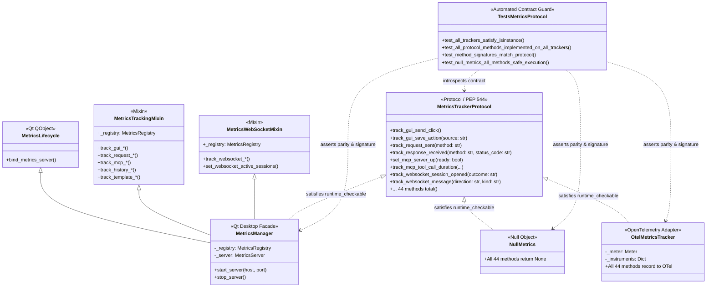

# PYPOST-1150: Fix test_metrics_protocol tracker protocol isinstance failure and establish protocol conformance

## Research

### Historical Root Cause Analysis

During investigation into the test failure recorded in `ai-tasks/PYPOST-1149/60-tech-debt.md`:
- **Node**: `tests/test_metrics_protocol.py::test_metrics_manager_satisfies_tracker_protocol`
- **Symptom**: `MetricsManager` failed runtime protocol compliance (`isinstance(MetricsManager(), MetricsTrackerProtocol)` returned `False`).

Analysis of the repository git history uncovered the exact evolutionary trajectory of this defect:

1. **Commit `ce954eb9` (PYPOST-1136 — WS-10 Settings, session ceiling, metrics and logging)**:
   - Added 9 new WebSocket metrics methods (`track_websocket_session_opened`, `track_websocket_session_closed`, `track_websocket_message`, `track_websocket_message_bytes`, `track_websocket_stream_entries_dropped`, `track_websocket_reconnect_attempt`, `set_websocket_active_sessions`, `track_websocket_session_start_refused`, `track_websocket_probe_duration`) to `MetricsTrackerProtocol` and `NullMetrics` in `pypost/core/metrics_protocol.py`.
   - In `MetricsRegistry` (`pypost/core/metrics_registry.py`), the Prometheus instruments and corresponding tracking methods were implemented.
   - However, in `MetricsManager` (`pypost/core/qt/metrics.py`), to circumvent file size and line length limits, dynamic delegation was introduced instead of explicit methods:
     ```python
     def __getattr__(self, name: str):
         return getattr(self._registry, name)
     ```
   - **Mechanism of Failure**: In Python, `@runtime_checkable` on a `typing.Protocol` uses `_ProtocolMeta.__instancecheck__`. This implementation checks `hasattr(type(obj), attr)` across the class MRO and dictionary, ignoring instance-level `__getattr__` hooks. Because the new methods were not explicitly declared on `MetricsManager` or its base classes, `isinstance(MetricsManager(), MetricsTrackerProtocol)` failed immediately at runtime.

2. **Commit `70341e01` (PYPOST-1146 — modularize MetricsManager delegation)**:
   - Refactored `MetricsManager` to eliminate dynamic `__getattr__` delegation.
   - Decomposed tracking methods into explicit mixins:
     - `pypost/core/qt/metrics_tracking.py`: `MetricsTrackingMixin` (35 tracking methods for GUI, HTTP, MCP, history, templates, and encryption).
     - `pypost/core/qt/metrics_websocket.py`: `MetricsWebSocketMixin` (9 WebSocket metrics methods).
   - In `pypost/core/qt/metrics.py`, `MetricsManager` inherits from `MetricsLifecycle`, `MetricsTrackingMixin`, and `MetricsWebSocketMixin`.
   - This architectural modularization placed all 44 methods back onto the class definition / MRO of `MetricsManager`. Consequently, `isinstance(MetricsManager(), MetricsTrackerProtocol)` now evaluates to `True` on the current `main` codebase.

### Current Codebase State

Inspection of the current production codebase confirms:
- `isinstance(MetricsManager(), MetricsTrackerProtocol)`: **PASSES** (evaluated in 1.06s via `make test PYTEST_ARGS="tests/test_metrics_protocol.py -v"`).
- `isinstance(NullMetrics(), MetricsTrackerProtocol)`: **PASSES**.
- `isinstance(OtelMetricsTracker(), MetricsTrackerProtocol)`: **PASSES** (verified in `tests/test_metrics_otel.py`).

### Architectural Gap

While `MetricsManager` currently passes basic smoke tests, an architectural deficiency exists in the testing harness:
1. **Shallow Smoke Tests**: `tests/test_metrics_protocol.py` only tests basic `isinstance` checks and invokes 5 hard-coded methods on `NullMetrics` out of 44 total protocol methods.
2. **Lack of Cross-Implementation Parity**: There is no automated contract test verifying that all concrete implementations (`MetricsManager`, `NullMetrics`, `OtelMetricsTracker`) implement 100% of the methods declared in `MetricsTrackerProtocol`.
3. **Signature Drift Risk**: `@runtime_checkable` only verifies that an attribute exists and is callable; it does not inspect parameter count, parameter names, or default arguments. A method could have an incompatible signature (e.g. missing arguments or flipped order) and still pass `isinstance`.
4. **Vulnerability to Future Silent Drift**: If an engineer adds a new tracking method to `MetricsTrackerProtocol` and `MetricsManager` but forgets `NullMetrics` or `OtelMetricsTracker`, CI will not catch it until runtime callers in headless or OpenTelemetry environments fail with `AttributeError` or `TypeError`.

---

## Implementation Plan

### High-Level Strategy

This task falls under **Branch C: Non-reproduction / already resolved on production code**.
- The original defect (`isinstance(MetricsManager(), MetricsTrackerProtocol)` failing) was already resolved on production code by commit `70341e01` (PYPOST-1146).
- The solution does not require modifying production tracking code in `pypost/core/qt/` or `pypost/core/metrics_protocol.py`.
- Instead, the architectural solution implements **automated protocol parity regression guards** in `tests/test_metrics_protocol.py`. These tests systematically enforce complete method parity and signature compatibility across `MetricsTrackerProtocol`, `MetricsManager`, `NullMetrics`, and `OtelMetricsTracker`.

### Mandatory — Failing Repro (Next Step 3)

**Strategy**: `N/A — no production behavioral change`.

**Rationale**:
The production runtime bug reported in PYPOST-1149 (`isinstance` check failure on `MetricsManager`) has already been resolved on `main` by commit `70341e01` via mixin modularization (`MetricsTrackingMixin` and `MetricsWebSocketMixin`). Running `make test PYTEST_ARGS="tests/test_metrics_protocol.py -v"` on the current working tree already passes. Because there is no broken production behavior to reproduce or modify, creating a synthetic failing production test for a pre-resolved issue is inapplicable. In accordance with top-down workflow rules for Branch C, Step 3 will be marked as `N/A — no production behavioral change`, and Step 4 will introduce the automated protocol parity contract tests and update documentation.

### Step 4 Development Plan

1. **Protocol Reflection Infrastructure in `tests/test_metrics_protocol.py`**:
   - Extract all public methods declared on `MetricsTrackerProtocol` using `inspect.getmembers()` (filtering out dunder/special attributes).
   - Ensure the list reflects all 44 tracking and gauge methods.

2. **Automated Method Completeness Contract**:
   - Verify that for every method `m` in `MetricsTrackerProtocol`:
     - `hasattr(MetricsManager, m)` and `callable(getattr(MetricsManager, m))`
     - `hasattr(NullMetrics, m)` and `callable(getattr(NullMetrics, m))`
     - `hasattr(OtelMetricsTracker, m)` and `callable(getattr(OtelMetricsTracker, m))`
   - Any missing method immediately fails with a descriptive error detailing which tracker is lacking which method.

3. **Strict Signature Parity Contract**:
   - For every method `m` in `MetricsTrackerProtocol`:
     - Inspect `inspect.signature(getattr(MetricsTrackerProtocol, m))`.
     - Inspect signatures on `MetricsManager`, `NullMetrics`, and `OtelMetricsTracker`.
     - Verify parameter names, parameter kinds (positional vs keyword), and default values match between the protocol and each implementation (ignoring `self`).

4. **Exhaustive `NullMetrics` Safe Invocation**:
   - Verify that all 44 methods on `NullMetrics` can be called safely without exceptions.
   - Use reflection and inspect signatures to dynamically supply default/dummy arguments (e.g. `""` for `str`, `0` for `int`, `0.0` for `float`, `True` for `bool`, `ErrorCategory.NETWORK` for `ErrorCategory`, `{}` for `Mapping`), asserting each call returns `None`.

5. **Runtime Conformance Suite**:
   - Retain and solidify `isinstance(..., MetricsTrackerProtocol)` tests for `MetricsManager`, `NullMetrics`, `NULL_METRICS`, and `OtelMetricsTracker`.
   - Maintain `resolve_metrics` helper tests.

6. **Technical Debt Ledger Reconciliation**:
   - Cross-reference the resolution of this issue in `ai-tasks/PYPOST-1149/60-tech-debt.md` to indicate that PYPOST-1150 validated the mixin resolution from PYPOST-1146 and established permanent automated parity regression guards.

---

## Architecture

### System Component Diagram



### Module Responsibilities

| Module | Location | Responsibility |
| --- | --- | --- |
| `MetricsTrackerProtocol` | `pypost/core/metrics_protocol.py` | Defines abstract structural contract for all metrics tracking across PyPost domains (PEP 544 `@runtime_checkable`). |
| `NullMetrics` / `NULL_METRICS` | `pypost/core/metrics_protocol.py` | Null Object implementation providing safe no-op handling for all 44 tracking methods when telemetry is disabled or during tests. |
| `MetricsManager` | `pypost/core/qt/metrics.py` | PySide6-compatible desktop facade composing lifecycle, tracking, and WebSocket mixins; adapts application calls to `MetricsRegistry` for Prometheus scraping. |
| `MetricsTrackingMixin` | `pypost/core/qt/metrics_tracking.py` | Explicit class-level delegation for 35 non-WebSocket tracking methods to `self._registry`. |
| `MetricsWebSocketMixin` | `pypost/core/qt/metrics_websocket.py` | Explicit class-level delegation for 9 WebSocket tracking methods to `self._registry`. |
| `OtelMetricsTracker` | `pypost/core/metrics_otel.py` | Adapter translating `MetricsTrackerProtocol` calls into OpenTelemetry meters, counters, histograms, and observable gauges. |
| Contract Test Suite | `tests/test_metrics_protocol.py` | Automated test suite enforcing runtime protocol compliance, 100% method completeness, signature fidelity, and safe no-op execution across all trackers. |

### Architectural Patterns

1. **Protocol / Structural Subtyping (PEP 544)**:
   - Application components depend on `MetricsTrackerProtocol` via duck typing with static type checker verification and runtime `@runtime_checkable` enforcement.
2. **Dependency Inversion Principle**:
   - High-level domains (request sender, MCP client/server, template service, WebSocket engine) depend on the abstract protocol rather than concrete Prometheus or OpenTelemetry classes.
3. **Automated Contract Testing (Parity Regression Guards)**:
   - Rather than relying on sporadic manual unit tests, reflection (`inspect`) dynamically audits all classes against the protocol definition at test execution time.
4. **Null Object Pattern (`NullMetrics`)**:
   - Provides default, no-op behavior to avoid defensive `if metrics is not None:` null checks throughout the codebase.
5. **Mixin Composition**:
   - Combines focused behavioral units (`MetricsTrackingMixin`, `MetricsWebSocketMixin`) into `MetricsManager` to keep modules maintainable while preserving explicit class-level method definitions.
6. **Adapter Pattern (`OtelMetricsTracker`)**:
   - Adapts the application-specific metrics interface to standard OpenTelemetry API instruments without altering domain call sites.

### Main Interfaces and Method Categories

`MetricsTrackerProtocol` declares 44 methods organized into the following functional domains:

1. **GUI Interactions (9 methods)**:
   - `track_gui_send_click() -> None`
   - `track_gui_save_action(source: str) -> None`
   - `track_gui_save_as_action(source: str) -> None`
   - `track_gui_new_tab_action(source: str, protocol: str = "unknown") -> None`
   - `track_gui_copy_curl_action() -> None`
   - `track_gui_collection_delete_action(item_type: str, status: str) -> None`
   - `track_gui_collection_rename_action(item_type: str, status: str) -> None`
   - `track_gui_response_search_action(source: str, has_matches: bool) -> None`
   - `track_gui_method_body_autoswitch(method: str) -> None`

2. **HTTP Transport & Lifecycle (5 methods)**:
   - `track_request_sent(method: str) -> None`
   - `track_response_received(method: str, status_code: str) -> None`
   - `track_response_body_truncated(method: str) -> None`
   - `track_retry_attempt(method: str, status_category: str) -> None`
   - `track_request_retry_exhaustion(endpoint: str) -> None`

3. **MCP Server & Client (10 methods)**:
   - `track_mcp_request_received(method: str) -> None`
   - `track_mcp_response_sent(method: str, status: str) -> None`
   - `set_mcp_server_up(ready: bool) -> None`
   - `set_mcp_server_instance_counts(counts: Mapping[str, int]) -> None`
   - `track_mcp_tool_call_duration(method: str, status: str, duration_seconds: float) -> None`
   - `track_mcp_active_env_changed() -> None`
   - `track_mcp_param_default_applied(method: str) -> None`
   - `track_mcp_client_connect(result: str) -> None`
   - `track_mcp_client_list_tools(result: str, operation: str) -> None`
   - `track_mcp_client_call_tool(result: str) -> None`

4. **History & Errors (5 methods)**:
   - `track_history_entry_appended(method: str) -> None`
   - `track_history_load_into_editor() -> None`
   - `track_request_error(category: ErrorCategory) -> None`
   - `track_yaml_to_json_conversion_failed() -> None`
   - `track_history_record_error() -> None`

5. **Template & Variable Processing (6 methods)**:
   - `track_hidden_value_mask_applied(surface: str) -> None`
   - `track_template_expression_render_attempt(render_path: str, outcome: str) -> None`
   - `track_template_expression_validation_failure(render_path: str, code: str, function_name: str | None = None) -> None`
   - `track_template_expression_render_duration(render_path: str, duration_seconds: float) -> None`
   - `track_variable_validation(result: str) -> None`
   - `track_variable_validation_failure(reason: str) -> None`

6. **Environment Encryption (3 methods)**:
   - `track_environment_value_encryption() -> None`
   - `track_environment_value_decryption() -> None`
   - `track_environment_encryption_error(stage: str, reason: str) -> None`

7. **WebSocket Sessions & Messaging (9 methods)**:
   - `track_websocket_session_opened(outcome: str) -> None`
   - `track_websocket_session_closed(reason: str) -> None`
   - `track_websocket_message(direction: str, kind: str) -> None`
   - `track_websocket_message_bytes(direction: str, byte_count: int) -> None`
   - `track_websocket_stream_entries_dropped(reason: str, count: int = 1) -> None`
   - `track_websocket_reconnect_attempt(outcome: str) -> None`
   - `set_websocket_active_sessions(count: int) -> None`
   - `track_websocket_session_start_refused(reason: str) -> None`
   - `track_websocket_probe_duration(outcome: str, duration_seconds: float) -> None`

---

## Q&A

**Q1: Why does Branch C apply to this task?**  
**A1:** Branch C applies because the defect identified during PYPOST-1149 (`MetricsManager` failing `isinstance` checks against `MetricsTrackerProtocol`) was caused by dynamic `__getattr__` delegation introduced in PYPOST-1136, which was subsequently eliminated in PYPOST-1146 via mixin refactoring. The production code on the current working tree already compiles and passes `isinstance(MetricsManager(), MetricsTrackerProtocol)`. Therefore, no production code change is needed to fix the original failure; rather, this ticket provides the definitive audit, contract verification, and automated regression guards to guarantee no protocol drift occurs going forward.

**Q2: Why is testing `isinstance` alone insufficient for protocol conformance?**  
**A2:** Python's `@runtime_checkable` on `Protocol` classes checks only the existence of attribute names on the class MRO and whether they are callable. It does not check:
1. Whether the arguments and parameter names match.
2. Whether required parameters vs default values match.
3. Whether calling the method with valid arguments succeeds or fails.
Automated contract tests using Python's `inspect.signature` bridge this gap by asserting exact parameter parity across all concrete implementations.

**Q3: How will OpenTelemetry tracker testing be handled in environments where OpenTelemetry is optional?**  
**A3:** In standard test runs where OpenTelemetry is installed (such as `make test`, which depends on `venv-otel`), `OtelMetricsTracker` is verified directly alongside `MetricsManager` and `NullMetrics`. If `opentelemetry` is not installed, tests use conditional guards (`pytest.importorskip("opentelemetry")` or `try/except ImportError`) to gracefully skip OTel-specific tests without failing the general suite.

**Q4: How does the contract test ensure `NullMetrics` remains a safe default?**  
**A4:** The test will programmatically iterate over all methods defined in `MetricsTrackerProtocol`, generate valid dummy parameters based on parameter types/names, execute each method against a `NullMetrics()` instance, and assert that the method completes without raising any exception and returns `None`. This guarantees that any component calling telemetry via `NullMetrics` will never crash.
