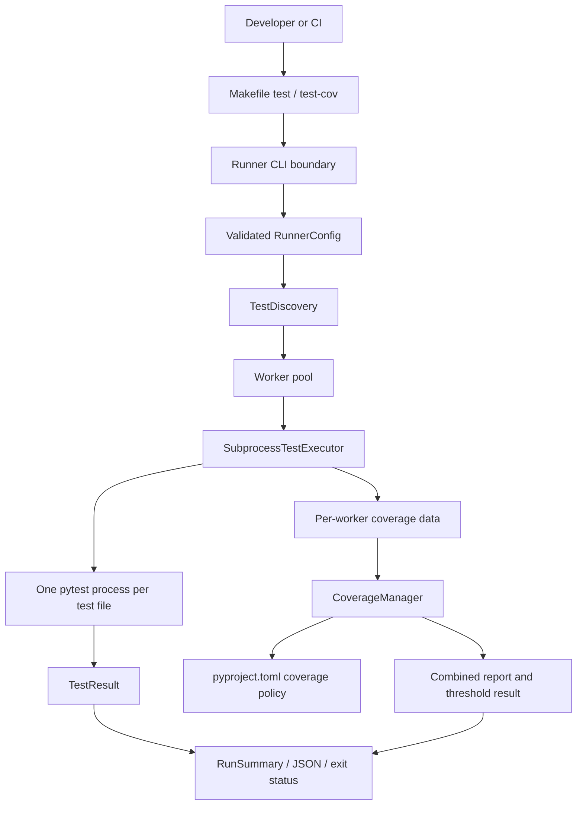

# PYPOST-1153: Parallel test runner maintainability follow-ups

## Research

This design is based on the accepted requirements in
[`10-requirements.md`](10-requirements.md) and the current repository surfaces.

### Current implementation evidence

| Surface | Current responsibility | Architectural implication |
| --- | --- | --- |
| `Makefile` | Defines `WORKERS`, `WORKER_TIMEOUT`, `PYTEST_ARGS`, and the `test` and
  `test-cov` recipes. | Keep Make as the stable developer/CI entry point and lock its
  command wiring with contract tests. |
| `scripts/run_parallel_tests.py` | Parses runner flags, discovers files, schedules a
  `ThreadPoolExecutor`, starts one pytest subprocess per file, groups results, and exits
  non-zero on failure. | Preserve file-level OS isolation; make parsing, validation, execution,
  and reporting explicit boundaries. |
| `SubprocessTestExecutor` | Sets `QT_QPA_PLATFORM=offscreen`, adds the repository to
  `PYTHONPATH`, captures output, and kills a process group after a timeout. | Keep timeout
  cleanup at the subprocess boundary so a timed-out child cannot hold up pool shutdown. |
| `CoverageManager` | Creates `.coverage_parallel/`, combines the data files produced by
  workers, and runs terminal and HTML reports. The executor currently assigns each worker
  data file. | Keep lifecycle and aggregation here, remove the unused
  `get_env_for_worker()` API, and make the aggregate report the only threshold decision. |
| `pyproject.toml` | Registers pytest options, including `--cov-fail-under=70`, and owns the
  development dependencies. | Move coverage policy to the coverage configuration section so
  worker pytest invocations do not enforce a partial result. |
| `tests/test_run_parallel_tests.py` and
  `tests/test_makefile_recipes.py` | Cover parser behavior, worker execution, coverage
  combination, logging, and Make recipe text. | Extend these focused suites and add small
  temporary workspaces for genuine threshold and timeout checks. |
| `.github/workflows/test.yml` | Runs a separate serial pytest coverage job and repeats the
  value `70` in the job summary script. | Make the summary consume the same project policy;
  changing CI execution strategy is not required by this task. |

The current parser is hand-written and silently falls through for several malformed runner
values. The current aggregate coverage path also has a hard-coded fallback threshold while
pytest configuration contains a second threshold. These are the maintainability seams the
architecture addresses; the product under test remains outside the design.

### External contract references

- [Python `argparse` documentation](https://docs.python.org/3/library/argparse.html)
  defines typed option parsing, explicit option names, and actionable parser errors.
- [Pytest command-line usage](https://docs.pytest.org/en/stable/how-to/usage.html) documents
  positional test targets and forwarding options such as `-k` and `-m`, as well as the
  `pytest.main()` return-code contract used by the child process.
- [Coverage.py configuration reference](https://coverage.readthedocs.io/en/latest/config.html)
  documents reading TOML configuration from `pyproject.toml` and the report-level
  `fail_under` policy.

## Implementation Plan

Implement the seven accepted follow-ups as a compatibility-preserving runner slice:

1. Define a single runner configuration boundary. Use an `argparse.ArgumentParser` with
   `allow_abbrev=False` and `parse_known_args()` to validate only orchestrator-owned flags.
   Replay the original argv and remove only the exact token spans consumed by those flags;
   retain one ordered pytest argv for the child command, including positional targets and
   node-id targets. Do not use `parse_known_args()`'s `unknown` list as the command because it
   does not preserve the original interleaving with recognized options.
2. Validate every explicitly supplied worker value before discovery or pool creation. Reject
   zero, negative, and non-numeric values with the option name, received value, and corrective
   guidance. Preserve the documented precedence of CLI, `WORKERS`, `PYTEST_WORKERS`, and the
   computed default for valid values.
3. Keep `make test` and `make test-cov` as the supported standard commands. Both targets must
   select the runner and pass workers, timeout, and `PYTEST_ARGS`; the missing-script branch
   must fail closed with an actionable error instead of silently running a serial pytest
   command. Add contract locks for these behaviors and for coverage mode.
4. Make coverage collection worker-only and coverage policy aggregate-only. The worker
   executor should write its own isolated data path and emit no threshold decision; the
   `CoverageManager` should only prepare, combine, and report. Remove the dead
   `CoverageManager.get_env_for_worker()` design as Jira follow-up 3, with no replacement
   manager environment API.
5. Represent the per-file limit as `float | None` at the executor boundary. A configured
   positive finite limit uses bounded process communication and process-group cleanup. An
   explicit `none` value selects the no-limit path. Direct runner omission retains the
   current 30-second default; Make's `WORKER_TIMEOUT ?= 120` remains its explicit suite
   default. Invalid CLI or environment timeout values fail before discovery and pool
   creation rather than falling through to a default.
6. Add genuine temporary-workspace integration checks for both sides of the coverage policy,
   explicit threshold overrides, invalid worker and timeout values, ordered argument and
   node-id forwarding, empty discovery, the fail-closed missing-script branch, and an
   over-limit test file. Use mocks only for command construction or scheduling assertions,
   not for the coverage threshold result.
7. Update the runner documentation and CI summary consumer after behavior is green. Keep all
   test and developer commands Make-driven when validating the repository.

The seven Jira follow-ups map to these owners: Make recipe coverage to the Make adapter;
`argparse.parse_known_args()` to the CLI boundary; removal of
`CoverageManager.get_env_for_worker()` to the executor/coverage boundary; project-configured
coverage policy to aggregate reporting; optional timeout to the executor; real threshold
coverage to temporary-workspace integration tests; and invalid worker values to the worker
resolver and parser validation.

**Mandatory — Failing Repro (next Step 3):** Add red tests before production changes in
`tests/test_run_parallel_tests.py` and, if the temporary workspace fixtures become too large,
an adjacent focused module. The repro set should:

- pass `--workers 0`, a negative value, and a non-numeric value to the parser/entry point and
  assert a clear non-successful validation outcome before any executor is scheduled;
- pass a valid pytest selector and an option/value pair through the runner and assert that the
  child command receives them in their original order and unchanged;
  include a positional `tests/test_file.py::test_name` node-id and assert that discovery
  resolves its file while the node-id remains the selected child target;
  pass an explicit `--` boundary and assert that every token after it is forwarded verbatim;
- inspect the `Makefile` recipes and assert that `test` selects the runner with workers and
  `PYTEST_ARGS`, while `test-cov` additionally enables coverage;
- run a temporary package with deliberately insufficient real coverage and an adequate real
  coverage scenario, asserting the aggregate command rejects only the former; also verify
  that changing `pyproject.toml` changes the default policy and that an explicit
  `--cov-fail-under=N` override changes only that invocation's aggregate decision;
- run a bounded temporary test file with the optional per-file limit and assert a
  `timed_out` result plus a failing overall status; also cover `none` and invalid timeout
  values, including the direct-runner and Make defaults;
  remove the runner script in a temporary Make workspace and assert the fallback fails closed
  without invoking serial pytest;
- pass an explicit target that resolves to no file and assert a non-successful validation
  outcome before any worker is scheduled.

Every newly collected test must have an explicit `pytest.mark.timeout` marker and all internal
waits or subprocess calls must be bounded. The red tests must fail because the required
behavior is absent, not because of a missing dependency or live service. Step 3 then remains
tests-only; production changes begin in Step 4 and proceed until this repro set is green.

## Architecture

### Boundaries and components



The runner remains a process-isolation orchestrator, not a pytest-xdist runner. A pool thread
owns the lifetime of one child process, and the main orchestration function owns aggregation
and the final status. Coverage data is an optional side channel from each child into one final
aggregate decision.

| Component | Responsibility | Must not own |
| --- | --- | --- |
| Make adapter | Supplies stable target names, worker settings, timeout settings, and the
  caller's `PYTEST_ARGS`. If the runner script is absent, it prints an actionable diagnostic
  and exits non-zero without running a different test command. | Test discovery, coverage
  thresholds, or business logic. |
| Runner CLI boundary | Uses `argparse.parse_known_args()` with `allow_abbrev=False` to validate
  runner-owned values, then replays the original argv to build one ordered pytest argv and a
  derived target view. | Executing tests or interpreting pytest-specific option semantics. |
| Worker resolver | Applies CLI/environment/default precedence to worker capacity and rejects
  explicitly invalid values. | Silently converting an invalid supplied value into a default. |
| Test discovery | Resolves explicit files, directories, supported globs, and the filesystem
  portion of node-id targets, or scans `tests/test_*.py` when no target is supplied. An empty
  selection is a non-successful validation outcome and never creates a pool. | Deciding whether
  an individual test passed. |
| Subprocess executor | Starts one child per discovered file, injects the headless GUI environment,
  forwards the ordered pytest argv with the current file or node-id in its original target
  position, captures output, assigns a unique coverage path when enabled, and enforces optional
  cleanup. | Combining coverage or making aggregate policy decisions. |
| Coverage manager | Prepares isolated data storage, combines fragments, and invokes the
  configured aggregate report. It has no worker-environment method; the executor owns
  `COVERAGE_FILE` construction. | A duplicate numeric threshold or per-worker pass/fail
  enforcement. |
| Result/reporting layer | Converts child outcomes and the aggregate coverage outcome into a
  summary, human-readable failure sections, optional JSON, and the process exit status. |
  Re-parsing command-line values or changing a child result. |
| Contract/integration tests | Prove user-visible Make, CLI, timeout, and coverage behavior in
  deterministic temporary workspaces. | Becoming a second implementation of the runner. |

### Main interfaces

The existing public shapes are retained where possible; the following contracts make their
ownership explicit.

#### `RunnerConfig`

The parser returns a typed configuration containing:

- `workers: int`, guaranteed to be positive;
- `enable_coverage: bool`;
- `report_json_path: Path | None`;
- `original_argv: tuple[str, ...]`, the exact caller-supplied argv, including runner-owned
  options and an explicit `--` sentinel when present;
- `runner_spans: tuple["ArgvSpan", ...]`, the exact pre-sentinel spans consumed by runner-owned
  options, indexed in `original_argv`;
- `pytest_argv: list[str]`, the exact ordered argv left after `runner_spans` are removed. It
  includes pytest options, their values, positional targets, node-id targets, and the `--`
  sentinel when one was supplied;
- `test_targets: list[str]`, a derived view of positional target tokens used only for discovery
  and scheduling, never as a second source for child-command construction;
- `target_records: list[TargetRecord]`, the ordered, span-aware discovery input described below;
- `pytest_args: list[str]`, a compatibility projection for callers that need only non-target
  pytest arguments. The executor must use `pytest_argv`, not this projection;
- `repo_root: Path` and `python_bin: Path`;
- `worker_timeout: float | None`, where `None` means no per-file wall-clock limit;
- `coverage_fail_under: int | None`, where `None` means use the project-configured aggregate
  policy and an integer is an explicit per-invocation override.
- `coverage_sources: tuple[str, ...] | None`, where `None` means use the project-configured
  coverage source and a non-empty tuple contains the ordered sources supplied by `--cov=SOURCE`.
- `coverage_reports: tuple[str, ...]`, the ordered `--cov-report` specifications, or the
  documented aggregate defaults when no report specification was supplied.

The resolver may still apply valid configured defaults used by current Make and direct-script
invocations. The important invariant is that the executor can distinguish an omitted limit
from a positive limit, and that invalid worker configuration cannot produce a `RunnerConfig`.

#### Ordered target records and dispatch units

Discovery does not return bare paths. It returns immutable records and units with these concrete
Python interfaces:

```python
@dataclass(frozen=True)
class TargetRecord:
    raw_target: str
    file_path: Path
    node_id: str | None
    child_target: str
    argv_span: tuple[int, int] | None
    ordinal: int


@dataclass(frozen=True)
class DispatchUnit:
    file_path: Path
    records: tuple[TargetRecord, ...]
    target_spans: tuple[tuple[int, int], ...]


@dataclass(frozen=True)
class ValidationError:
    code: str
    message: str
    raw_target: str | None = None


@dataclass(frozen=True)
class DiscoveryResult:
    records: tuple[TargetRecord, ...]
    units: tuple[DispatchUnit, ...]
    errors: tuple[ValidationError, ...]


class TestDiscovery(Protocol):
    def discover(
        self,
        *,
        repo_root: Path,
        target_records: Sequence[TargetRecord],
    ) -> DiscoveryResult: ...
```

`argv_span` is a half-open span in `RunnerConfig.pytest_argv`, whose indices are also the indices
in `PytestArgvLayout.pytest_argv`. A direct target occupies `(index, index + 1)`. It is `None`
only for files produced by the default `tests/test_*.py` scan. A directory or glob produces one
record per matching file, all tied to the source span; each record's `child_target` is that file.
A direct file keeps its original spelling. For `path.py::test_name` or a deeper node id,
discovery resolves text before the first `::` as `file_path`, stores the full suffix in `node_id`,
and keeps the original spelling in `child_target`. A record whose span is before the sentinel is
a pre-sentinel target; a record whose span is after it is a post-sentinel target. An unresolved
backing file or an explicit target with no matches is an error.

The replay pass creates `runner_spans` and `pytest_argv` together. It walks the complete original
argv, removes only exact pre-sentinel spans consumed by runner-owned options, renumbers surviving
tokens, and retains the sentinel and every post-sentinel token. `parse_known_args()` supplies typed
runner values; its `unknown` list is never reused as the child command. Target classification is
delegated to the concrete `PytestArgvLayout` strategy defined in the CLI section, so this section
has no hand-maintained pytest option arity table.

The discovery interface expands each target record, then de-duplicates by `(file_path, node_id)`
in first-seen order. Repeated identical targets run once. Distinct node ids for one file remain
distinct records. It groups records by `file_path` into one `DispatchUnit`, retaining record
order and the distinct source spans represented in that unit. If two node ids select one file,
the same unit carries both records and one child process runs both node ids. A plain file and
node ids for that file are also retained together, preserving the caller's complete selection.
If no explicit target exists, `target_spans` is empty and the executor appends the current file.
Empty records are represented as a validation error before a pool is created.

#### CLI parser

The runner owns `--workers`/`-n`, `--worker-timeout`, `--cov`/`--cov=SOURCE`, `--report-json`,
and the aggregate-only `--cov-fail-under` policy override. It first locates the first exact `--`
in the caller's original argv. It constructs an `ArgumentParser` with `allow_abbrev=False` and
calls `parse_known_args()` on the pre-sentinel slice only (or the complete argv when no sentinel
exists). Runner-looking tokens after the sentinel are never consumed as runner options. The
parser's `Namespace` supplies typed runner values and its `unknown` result is only a validation
input; it is not used to construct the child command because it loses the original interleaving.

The implementation replays the complete original argv in order, removing only the exact
pre-sentinel spans consumed by recognized runner options. All other tokens remain in
`pytest_argv`, including option/value pairs, positional paths, glob targets, node-id targets, and
the `--` sentinel itself. Every token after the sentinel is copied verbatim and is not parsed as
an option. `target_records` is derived from the layout's positional spans using the exact
`TargetRecord` contract above. Discovery strips only the node-id suffix to find the backing file
while retaining the raw node id for child selection; `test_targets` is only the legacy string
projection.

##### Lossless pytest argument layout

The runner does not maintain a list of pytest option arities. Before target extraction,
`PytestArgvLayout.from_project(repo_root, pytest_argv)` loads the same pytest configuration and
plugins that the child command will load, obtains their registered `argparse` actions, and
returns a lossless trace:

```python
@dataclass(frozen=True)
class ArgvSpan:
    start: int
    end: int
    role: Literal["runner", "pytest_option", "pytest_value", "target", "sentinel"]


@dataclass(frozen=True)
class PytestArgvLayout:
    original_argv: tuple[str, ...]
    pytest_argv: tuple[str, ...]
    runner_spans: tuple[ArgvSpan, ...]
    sentinel_index: int | None
    pre_sentinel_tokens: tuple[str, ...]
    post_sentinel_tokens: tuple[str, ...]
    spans: tuple[ArgvSpan, ...]
    positional_spans: tuple[tuple[int, int], ...]

    @classmethod
    def from_project(
        cls,
        repo_root: Path,
        original_argv: Sequence[str],
        runner_spans: Sequence[ArgvSpan],
    ) -> "PytestArgvLayout": ...
```

`original_argv` is the immutable, complete caller sequence retained for diagnostics and replay.
`runner_spans` are indexed in it and contain only pre-sentinel runner-owned spans. The layout
replays those spans into `pytest_argv`, retaining the sentinel if present, and computes
`sentinel_index` in `pytest_argv`; `pre_sentinel_tokens` is the slice before that index and
`post_sentinel_tokens` is the slice after it. With no sentinel, the index is `None`, the
pre-sentinel slice is all of `pytest_argv`, and the post-sentinel slice is empty. `spans` and
`positional_spans` are indexed in `pytest_argv`, so `TargetRecord.argv_span` remains directly
usable by the builder. A second `--` is an ordinary post-sentinel token and is not reparsed.

For `pre_sentinel_tokens`, the adapter uses pytest's registered option actions, including each
action's `nargs`, to run a trace-enabled `parse_known_args()`. The trace records the exact
option/value spans consumed by every registered pytest or plugin action and the positional tokens
returned as `file_or_dir`; it does not infer spans from whether a token looks like a path. For
`post_sentinel_tokens`, no option parsing occurs: every token is a positional target candidate and
gets a one-token target span, later validated by discovery. The adapter is a separate, tested
boundary around pytest's parser so changes to the installed pytest version are detected by
contract tests rather than copied into a runner table.

An option absent from the loaded pytest schema is handled conservatively. The option token and
all following non-option tokens before the next option or `--` are copied unchanged as an
opaque passthrough segment, but none of those tokens is classified as a target. If any token in
that segment resolves as a file, directory, glob, or node-id backing file, layout construction
returns `ValidationError(code="ambiguous_passthrough", ...)` and instructs the caller to use
the plugin's registered spelling or an explicit `--` boundary. An `--name=value` unknown option
is one opaque token and is safe to forward. This fail-closed rule preserves unknown options and
values without ever scheduling a value as a test target. A parser-load or trace failure is the
same validation error, before any worker is created.

The sentinel is represented by one `ArgvSpan(role="sentinel")` at `sentinel_index` and is retained
in `pytest_argv`; it is not dropped during replay or child-command construction. All tokens after
it are copied byte-for-byte, remain in their original order, and are classified as explicit target
candidates without option semantics. This gives callers an unambiguous escape hatch for plugin
values and preserves their original order. `target_records` is created from `positional_spans`,
not from the unknown list, so a pre-sentinel option value cannot become a target through a
heuristic.

The child-command builder has a callable contract:

```python
def build_child_argv(
    *,
    layout: PytestArgvLayout,
    all_target_records: Sequence[TargetRecord],
    unit: DispatchUnit,
) -> list[str]: ...
```

The builder iterates `layout.pytest_argv` by index. It emits every non-target token verbatim,
including `--` at `layout.sentinel_index`, and never emits a runner-owned token. For each explicit
target span, it emits the ordered, unique `child_target` values from `unit.records` mapped to that
span, or emits nothing when the span belongs to another unit. Records produced by a directory or
glob share a span, so that span emits the one file selected by the current unit. Distinct node-id
records for one file have distinct spans and each remains at its original position; if they share
a span in a future resolver, their targets are emitted once in record order. With no explicit
spans, the current unit's relative file path is appended once, before any retained sentinel
postlude. Non-target tokens and the sentinel never move relative to one another. The builder
therefore handles multiple node ids in one subprocess while preserving pytest arguments, node-id
selection, and the explicit boundary in their original order.

Pytest options such as `-k`, `-m`, `-o`, `--tb`, `--ignore`, `--deselect`, `--timeout`, and
verbosity flags remain passthrough data; `--timeout` must never be confused with the runner's
per-file timeout. Known runner options with missing or invalid values fail with an actionable
message before discovery. Registered framework/plugin options and their values remain ordered
pytest passthrough. `--cov-fail-under` is the deliberate exception: its value is recorded as
`coverage_fail_under` and excluded from worker argv because it controls only the aggregate
report. `--cov-report` is likewise explicitly parsed into `coverage_reports`, as defined in the
coverage section below; it is not silently forwarded to every worker.

#### Make contract

| Entry point | Required observable behavior |
| --- | --- |
| `make test` | Invokes `scripts/run_parallel_tests.py`, forwards `--workers $(WORKERS)` and the
  configured per-file timeout, and forwards `PYTEST_ARGS`; it does not enable coverage. If the
  script is missing, the recipe emits `parallel runner unavailable` and exits non-zero without
  invoking pytest, preserving a fail-closed contract rather than silently changing execution. |
| `make test-cov` | Has the same worker, timeout, target, and argument contract and additionally
  enables runner coverage collection and aggregate reporting. Its missing-script branch uses
  the same fail-closed behavior. |
| Direct runner | Accepts the same runner options and pytest passthrough. With no explicit timeout,
  a direct invocation resolves `WORKER_TIMEOUT` when set and otherwise retains the current
  30-second default. Make passes its explicit `WORKER_TIMEOUT ?= 120` value, so the Make default
  is 120 seconds. |

The explicit no-timeout spelling is `--worker-timeout none` (or `--worker-timeout=none`) for
the direct runner and `WORKER_TIMEOUT=none make test` for Make. A positive finite number is the
only other valid timeout. Missing values, zero, negative, non-numeric, NaN, and infinite values
are parser errors for both CLI and environment input; they never fall through to a default.
This makes `None` an intentional configuration rather than an accidental invalid value.

The current `python -m pytest` fallback is replaced by a fail-closed diagnostic. If the runner
script is absent, both standard recipes stop before test execution and return non-zero; they do
not claim the worker and timeout contract through a serial substitute. Other Make targets that
intentionally run slow, agent-e2e, or live suites remain outside this parallel-runner contract.

#### Worker execution and result contract

The result model makes validation and aggregate failures first-class rather than encoding them
as an empty successful test run:

```python
@dataclass(frozen=True)
class RunResult:
    kind: Literal["test", "validation", "coverage"]
    status: Literal["passed", "failed", "skipped", "timed_out", "invalid"]
    target: str | None
    exit_code: int
    duration_seconds: float
    message: str
    error_code: str | None = None
    stdout: str = ""
    stderr: str = ""


@dataclass(frozen=True)
class RunSummary:
    results: tuple[RunResult, ...]
    scheduled_units: int
    worker_count: int
    coverage_result: RunResult | None
    exit_code: int

    @property
    def is_success(self) -> bool: ...


def invalid_summary(error: ValidationError, worker_count: int) -> RunSummary: ...
```

`TestResult` remains the compatibility name for a `RunResult(kind="test", ...)`. A test
result uses `target` for the repository-relative file and one of the first four statuses. A
validation result uses `kind="validation"`, `status="invalid"`, `exit_code=2`, the stable
error `code` in `error_code`, an actionable message, and the offending target when applicable.
A coverage result uses `kind="coverage"` and the coverage command's non-zero exit code and
output.

`RunSummary.is_success` is true only when `scheduled_units > 0`, `exit_code == 0`, every test
result is passed or skipped, and `coverage_result` is absent or passed. Consequently, an empty
run can never be green. `invalid_summary()` stores one validation `RunResult` in `results`,
sets `scheduled_units=0`, `worker_count` to the supplied value, and `exit_code=2`.

The executor interface carries the complete dispatch metadata; there is no path-only worker
entry point:

```python
class WorkerExecutor(Protocol):
    def run_dispatch_unit(
        self,
        *,
        unit: DispatchUnit,
        layout: PytestArgvLayout,
        all_target_records: Sequence[TargetRecord],
        index: int,
        total: int,
        coverage_plan: "CoveragePlan | None",
    ) -> RunResult: ...
```

`SubprocessTestExecutor.run_dispatch_unit()` calls `build_child_argv(layout=layout, ...)` with
the unit and all records, then starts exactly one child for that file. Thus node ids, pytest
arguments, and the explicit sentinel survive scheduling. A timeout kills the entire child
process group, records a clear note, and returns `timed_out`; `worker_timeout=None` uses
unbounded communication and performs no timeout cleanup.

`run_parallel_tests(config)` calls discovery and returns a `RunSummary`. If CLI parsing raises
`RunnerValidationError`, `main(argv)` converts it with `invalid_summary()`, renders it, and
returns `2`. If discovery returns errors or zero units, `run_parallel_tests()` returns the same
kind of invalid summary before constructing a pool. If coverage-plan preparation raises the same
validation exception, it follows that path before constructing a pool as well. Only a summary
with a scheduled unit can return `0`; test, timeout, validation, and aggregate coverage failures
return non-zero.

### Coverage configuration and data flow

#### Coverage argument compatibility

The exact token `--cov` enables aggregate coverage and uses the source configured in
`[tool.coverage.run]`. A non-empty exact token of the form `--cov=SOURCE` also enables aggregate
coverage and records `SOURCE` in `coverage_sources`; it is consumed by the runner rather than
forwarded as a pytest option. Repeated `--cov=SOURCE` tokens append sources in command-line
order. The source value is never interpreted as a target or as a threshold.

The runner also owns `--cov-report` in its two exact forms, `--cov-report=SPEC` and
`--cov-report SPEC`, and records each `SPEC` in `coverage_reports` in command-line order. This
explicit grammar accepts the existing Make/CI spellings `--cov-report=term-missing` and
`--cov-report term-missing`, as well as the corresponding equals and separated forms for every
supported specification. It is not generic passthrough. An empty `--cov=` value or a bare
`--cov-report` without a following value is a validation error. The explicit `--cov-report=`
form is the supported empty report specification and suppresses optional human-readable report
artifacts, but never suppresses threshold enforcement. `--cov-fail-under` without
`--cov`/`--cov=SOURCE` is also a validation error because there is no aggregate report to which
it could apply. Other pytest-cov options such as `--cov-branch` remain ordered passthrough and
are forwarded to each worker. These runner-owned options are consumed only before the sentinel;
the same spellings after `--` are preserved as post-sentinel pytest arguments.

The coverage policy has one source of truth in `pyproject.toml`:

```toml
[tool.coverage.run]
source = ["pypost"]

[tool.coverage.report]
fail_under = 70
```

The exact existing project policy value is retained; the snippet illustrates ownership, not a
new target. The `--cov-fail-under=70` pytest `addopts` entry and the runner's numeric fallback
must not remain as competing policy sources. The project value is used whenever no explicit
override is supplied. `--cov-fail-under=N` and `--cov-fail-under N` are validated as an integer
from 0 through 100 and are explicit, one-invocation overrides for the aggregate report. The
override is runner-owned metadata, not a worker threshold; it is removed from worker argv and
translated to the final aggregate report. Supplying it without coverage mode is a validation
error. A later CI summary may read the configured value or report the result emitted by the
coverage command, rather than repeating a literal.

The source, threshold, and report ownership is represented by these callable contracts:

```python
@dataclass(frozen=True)
class CoverageRequest:
    source_override: tuple[str, ...] | None
    fail_under_override: int | None
    report_specs: tuple[str, ...]


@dataclass(frozen=True)
class CoveragePlan:
    worker_data_dir: Path
    aggregate_rcfile: Path | None
    sources: tuple[str, ...] | None
    fail_under: int | None
    report_specs: tuple[str, ...]


class CoverageManager(Protocol):
    def prepare(
        self,
        *,
        repo_root: Path,
        python_bin: Path,
        request: CoverageRequest,
    ) -> CoveragePlan: ...

    def combine(self, *, plan: CoveragePlan) -> RunResult: ...

    def report(self, *, plan: CoveragePlan) -> RunResult: ...
```

`CoverageManager.prepare()` is the sole owner of the effective coverage plan. It reads the
project source and `fail_under` values when overrides are absent, creates a run-local worker
data directory, validates report specifications, and writes `aggregate_rcfile` only when an
invocation source override requires one. With `--cov=SOURCE`, `plan.sources` is the ordered
source tuple and the generated aggregate configuration has the same `[run] source` value.
`CoverageManager.report()` passes that rcfile to `coverage report` and every requested report
command, so the aggregate report cannot fall back to `pypost` when another source was selected.
Without an override it uses the project's configuration directly. The explicit threshold
override is the only value that can replace `[tool.coverage.report].fail_under` for this
invocation. Invalid report specifications cause `prepare()` to raise
`RunnerValidationError` before the worker pool is constructed; `main()` turns that exception
into the invalid `RunSummary` described above.

The executor owns only child environment construction. It creates a unique
`COVERAGE_FILE` below `plan.worker_data_dir` and builds worker collection flags from
`plan.sources`; it does not expose a coverage-manager environment method. Removing
`CoverageManager.get_env_for_worker()` is the third Jira follow-up. If `plan.sources` is
`None`, workers use project-configured source. If it is non-empty, every worker receives the
same ordered `--cov=SOURCE` set and the aggregate rcfile receives the same source set.

`coverage_reports` has explicit precedence. If one or more pre-sentinel `--cov-report`
specifications were provided, those specifications replace the runner's default optional
aggregate artifacts and are translated by `CoverageManager.report()` to the corresponding
report commands. They are consumed by the runner, removed from worker argv, and never passed
through as ordinary pytest arguments. If no explicit specification was provided, the aggregate
defaults are `term-m` and `html`; a project `addopts` report setting cannot replace the runner's
aggregate plan and is suppressed in workers. Post-sentinel report-looking tokens are not parsed
as report settings and remain ordered in `pytest_argv`. Unsupported pre-sentinel specifications
are rejected by `prepare()` before workers start. An explicit empty specification,
`--cov-report=`, suppresses optional report artifacts but still runs the mandatory
threshold-bearing aggregate `coverage report`.

The accepted non-empty specification grammar is `FORMAT` or `FORMAT:DEST`, where `FORMAT` is
one of `term`, `term-missing`, `term-m`, `html`, `xml`, `json`, `lcov`, or `annotate`. `DEST` is
required only for formats whose output path is not the documented default. `term` maps to the
canonical threshold-bearing `coverage report`; `term-missing` maps to that same command with
`--show-missing`; and `term-m` is the equivalent documented terminal format. The manager maps
each non-terminal format to one supplementary aggregate command, applies `DEST` exactly, and
rejects unknown or malformed forms before workers start. This defines report precedence without
relying on pytest-cov defaults.

Worker report suppression is therefore allowed and intentional: when coverage mode is enabled,
the executor removes the runner-owned report specifications from the worker argv and adds one
explicit `--cov-report=` suppression flag. The suppression is never applied to a non-coverage
run, and user report values are never silently discarded because they are retained in
`CoveragePlan.report_specs` and applied once after combination. A report specification supplied
through project `addopts` must be moved to the runner's explicit option or rejected as a
configuration conflict; it must not change the aggregate plan or threshold policy.

`CoverageManager.report()` always runs one canonical, threshold-bearing aggregate command after
combination, regardless of `report_specs`. It reads the effective `fail_under` from the plan,
passes it as the report command's `--fail-under` value, and treats a non-zero result as an
aggregate coverage failure. In `term` or `term-missing` mode, that canonical command is the
requested terminal report. In `html`, `xml`, `json`, `lcov`, `annotate`, or any combination of
custom modes, the canonical command runs first and the requested artifact commands run after it.
Artifact generation failures are also aggregate failures, but they cannot replace or skip the
threshold decision. Thus no custom report selection, including `--cov-report=`, can bypass a
below-threshold failure; the empty form only suppresses optional artifact output.

The coverage flow is:

1. `CoverageManager.prepare()` removes stale parallel data, reads effective source and
   threshold policy, and prepares a `CoveragePlan` before workers start.
2. `SubprocessTestExecutor.run_dispatch_unit()` creates a unique worker data path and starts one
   child that executes its selected tests with the plan's source set. The child uses report
   suppression so only intermediate coverage output is suppressed; test execution, test failures,
   and captured diagnostics remain observable.
3. Each child executes its selected tests and writes coverage data. No worker receives a
   threshold decision, and no worker runs the final aggregate report.
4. After all child results are collected, `CoverageManager.combine()` combines every fragment
   into the aggregate data file. Missing data or a failed combine returns a failed coverage
   `RunResult`.
5. `CoverageManager.report()` runs the aggregate reports with the plan's rcfile and threshold.
   Its threshold-bearing report return code is the sole coverage decision; report artifacts do
   not create a second policy value.
6. The aggregate result is stored in `RunSummary.coverage_result` and contributes to its exit
   code. Coverage mode cannot succeed on missing data, a failed combine, or a failed threshold.

This prevents a partial worker from failing because it cannot individually reach project
coverage and prevents the aggregate runner from drifting from the project configuration.

### Control and failure flow

1. Make or the direct caller supplies argv and environment values.
2. The CLI boundary calls `parse_known_args()`, replays argv to preserve ordered passthrough,
   validates runner-owned values, and derives target specs before `TestDiscovery` and before
   constructing the pool. Invalid worker or timeout values therefore cannot start test work.
3. Discovery produces a deterministic, de-duplicated list of files. A missing explicit path,
   unmatched glob, invalid node-id backing file, or empty default scan is a reportable
   non-successful validation outcome without creating workers.
4. The executor launches at most `workers` children. Each child receives the ordered pytest
   argv with its current file or node-id occupying the original target position; it does not
   prepend a file to a separately ordered argument list.
5. A child exit code maps to a `TestResult`; exit code 5 remains the existing no-tests/skipped
   interpretation for a discovered file. A timeout maps to `timed_out` and invokes
   process-group cleanup, while `None` uses unbounded communication.
6. The main thread aggregates all results. Coverage aggregation, when enabled, runs after
   workers finish and can add an aggregate failure based on project configuration or the
   explicit override.
7. Human-readable failure details, slowest-file information, optional JSON, and the final exit
   status are emitted from the same `RunSummary` so reporting cannot disagree with the result.

### Validation and test strategy

| Contract | Test shape | Acceptance signal |
| --- | --- | --- |
| Make selection and forwarding | Static recipe locks plus a small command-spy or temporary
  workspace test through a Make target, including a missing-script workspace. | Both standard
  targets select the runner, preserve worker and timeout settings, and carry `PYTEST_ARGS`; only
  coverage target enables coverage, and the fallback fails closed without serial pytest. |
| Parser separation | Unit tests with runner flags, positional targets, one file with duplicate
  and multiple node-id targets, `--`, pytest selectors, plugin options, and missing/invalid
  runner values. | `parse_known_args()` validates owned values while replay preserves every
  non-owned token and its order; `TargetRecord.argv_span` and `DispatchUnit` preserve node ids,
  de-duplicate exact repeats, group distinct same-file nodes, and reject empty discovery before
  scheduling. |
| Worker values | Parameterized zero, negative, non-numeric, and valid positive cases, including
  CLI and environment precedence. | Invalid supplied values produce a clear non-zero result
  and no executor invocation. |
| Per-file timeout | Temporary test file with a bounded sleep and a short positive limit, plus
  `none`, invalid-value, direct-default, and Make-default controls. | The file is `timed_out`
  only with a positive limit; `none` uses the unbounded path and invalid values fail early. |
| Coverage policy | Real temporary package and tests run through the actual coverage subprocesses,
  with bare `--cov`, valid repeated `--cov=SOURCE`, below-threshold, adequate, configuration-
  change, and explicit-override scenarios. | `--cov=SOURCE` activates aggregate mode and selects
  its source without becoming passthrough; the configured `fail_under` controls the default
  aggregate result, and a valid `--cov-fail-under=N` changes only that invocation. No threshold
  mock is sufficient. |
| Coverage consolidation | Multiple worker data files and a combined report in a temporary
  root. | All fragments are combined once; stale data cannot affect the result. |
| Existing behavior | Current runner, filter, JSON, and headless Qt tests. | Valid invocations
  retain current statuses, reports, and isolation. |

Future test files must follow the repository timeout policy. Validation commands for the
repository are run through `make test`, `make lint`, `make typecheck`, `make verify-ai-tasks`,
or `make check`; no direct test/lint/type-check command is part of the implementation
procedure.

### Migration sequencing

The implementation should proceed in these independently reviewable slices:

1. Add red contract tests and temporary fixtures without changing production code.
2. Introduce `argparse.parse_known_args()` and ordered argv replay, strict worker/timeout
   validation, node-id-aware discovery, and the empty-selection failure while preserving the
   result model and accepted pytest passthrough.
3. Consolidate Make command construction and lock both standard target contracts, including the
   fail-closed missing-script branch.
4. Move coverage source and `fail_under` policy into project configuration; make workers execute
   selected tests while collecting coverage with intermediate reports suppressed, remove
   `CoverageManager.get_env_for_worker()`, and make the aggregate manager consume configuration
   unless given an explicit override.
5. Add the optional timeout representation, `none` no-limit path, and process-group cleanup;
   retain the direct 30-second and Make 120-second defaults.
6. Run focused Make validation, then the repository quality gate; classify unrelated baseline
   failures without expanding this task.
7. Update developer documentation and CI summary consumption, then perform code cleanup and
   observability review in the later Top-Down steps.

No production code or tests are changed in Step 2. The architecture artifact and the roadmap
marker are the only intended changes.

### Risks and mitigations

| Risk | Mitigation |
| --- | --- |
| A hand-rolled parser consumes a pytest option's value or hides a typo. | Use typed,
  non-abbreviating `parse_known_args()`, remove only owned pre-sentinel spans while retaining
  the original sentinel and post-sentinel tokens, and test every supported option shape plus an
  explicit `--` boundary. |
| `-n` is a familiar pytest-xdist option but is owned by this file-level runner. | Document the
  ownership and preserve the current alias; xdist is not introduced or supported by this task. |
| Project pytest `addopts` applies a threshold inside every child. | Remove threshold
  enforcement from worker pytest options; make the aggregate report consume project
  configuration unless the explicit `--cov-fail-under` override is supplied. |
| Stale or missing coverage fragments produce a misleading green result. | Clean the run
  directory before launch, use unique file names, require real data in coverage mode, and
  treat combine/report failures as aggregate failures. |
| Killing only a parent leaves Qt or pytest descendants alive. | Keep process-group/session
  isolation and bounded group termination at the executor boundary. |
| High worker counts exhaust memory or GUI resources. | Retain the bounded default worker policy,
  validate positive values, and leave resource tuning outside this ticket. |
| Make shell word splitting changes valid `PYTEST_ARGS`. | Preserve the current documented
  string contract and add recipe-level tests for representative selectors and option values. |
| Python 3.11 and 3.13 differ in subprocess or coverage details. | Exercise the runner through
  the existing matrix-compatible Make targets and keep subprocess interfaces standard-library
  based. |

## Explicit Out-of-Scope Decisions

- No product behavior, application modules, or production test-selection policy changes.
- No migration to pytest-xdist, in-process parallelism, or a new scheduler architecture.
- No parallelization of `test-slow`, agent-e2e, live MCP, or other targets that intentionally
  bypass this runner.
- No new coverage target or coverage exclusions. The existing project policy value remains the
  policy; only ownership and enforcement flow are consolidated.
- No redesign of the JSON report schema, slowest-file presentation, or logging vocabulary unless
  required to report one of the seven accepted outcomes.
- No CI service, operating-system image, dependency, or lock-file rework unrelated to consuming
  the single coverage policy.
- No broad test-fixture refactor. New helpers are allowed only when needed for deterministic
  runner contracts and must remain scoped to the focused test suites.
- No repair of unrelated baseline failures discovered by the quality gate; those remain tracked
  separately as required by the requirements artifact.

## Q&A

### Why retain subprocess-per-file execution?

The repository contains Qt-heavy tests, and each child receives its own process, application
environment, and event loop. This preserves the isolation already documented for the runner
while the task improves its contracts.

### Why is coverage enforcement aggregate-only?

A worker executes only a subset of files, so a per-worker threshold is not the project result.
The combined coverage data must be reported once using the configured policy.

### How are valid pytest options protected from runner parsing?

The runner owns only its documented options. The layout adapter loads pytest and plugin option
actions, records their exact consumed spans, and replays all registered options and values in
place. An option absent from that schema is preserved as opaque passthrough, but a path-like
token in its ambiguous value segment fails closed; `--` provides an unambiguous boundary.
Node-id targets retain their suffix and original span when the executor builds a child command.
The tests will lock legacy, plugin, node-id, and boundary forms.

### What does “optional timeout” mean with the current Make default?

The executor contract supports `None` and a positive finite limit. Direct invocation keeps its
30-second default for compatibility, while Make explicitly supplies its 120-second default.
Callers select `None` with `--worker-timeout none` or `WORKER_TIMEOUT=none`; malformed, zero,
negative, NaN, and infinite values fail before a worker is created.

### Who owns `COVERAGE_FILE` and `--cov-fail-under`?

The executor owns unique per-worker `COVERAGE_FILE` creation because it constructs the child
environment. `CoverageManager` owns preparation, combination, and reporting only, so the dead
`get_env_for_worker()` method is removed under the corresponding Jira follow-up. The project
configuration owns the default threshold; an explicit `--cov-fail-under=N` is parsed as an
aggregate-only override and is translated to the final coverage report command.

`--cov-report` is also runner-owned in coverage mode. Its values are retained in
`CoveragePlan.report_specs`, suppressed in workers with an explicit empty report flag, and
translated once by the aggregate manager. No report value is silently overridden.

### What happens when the runner script is missing?

The Make recipes fail closed with a diagnostic and a non-successful status. They do not invoke
serial pytest, because that would silently discard the worker and timeout contract. This keeps
the supported command behavior explicit even when the repository is incomplete.

### Which sources informed the design?

The repository sources are listed in the Research table. The external CLI, pytest, and
coverage-policy references are linked above and are used only to align the interfaces with the
supported upstream command contracts.
