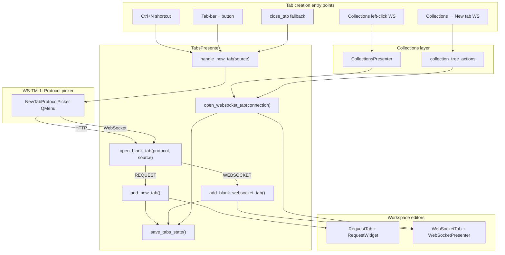

# PYPOST-1156: Research and decompose WebSocket tab mode UX — architecture

Step 2 artifact for PYPOST-1156. Turns the approved requirements in
[`10-requirements.md`](10-requirements.md) into a high-level architecture, UX decision,
component interaction model, child-story breakdown for Epic [PYPOST-1155](https://pypost.atlassian.net/browse/PYPOST-1155),
and a failing-repro plan for Step 3.

**Scope note:** PYPOST-1156 is a **research task** — it ships documents and Jira decomposition only.
Implementation belongs to the child stories under PYPOST-1155; each runs its own Top-Down cycle.

## Research

### R-1 Competitive UX patterns

| Product | Blank-tab / new-session entry | Implication for PyPost |
| --- | --- | --- |
| **Postman** | **New → WebSocket** (sidebar) or **Ctrl+N** opens a creation flow that includes WebSocket as an explicit type ([Postman docs](https://learning.postman.com/docs/sending-requests/websocket/create-a-websocket-request/)) | Protocol is chosen **before** the editor loads; not inferred from URL scheme alone |
| **Insomnia** | Request **type dropdown** (HTTP, WebSocket, gRPC, …) when creating a request ([Insomnia docs](https://developer.konghq.com/insomnia/requests/)) | Type selector is inline and persistent in the chrome, but still chosen at creation time |

Both products treat WebSocket as a **first-class protocol choice at creation**, not a post-hoc mode
switch on an HTTP editor. PyPost's `doc/user/websocket.md` step 1 ("open a new tab and select
**WebSocket** mode") aligns with this industry pattern.

### R-2 Current codebase constraints (repo facts)

| Area | Current state | Architectural impact |
| --- | --- | --- |
| `TabsPresenter.add_new_tab()` | Always builds `RequestTab` via `_create_request_tab()` | Needs a protocol-aware factory |
| `TabsPresenter.open_websocket_tab(conn)` | Requires persisted `WebSocketConnection` with id; deduplicates by id | Draft tabs need a **separate** path that skips dedup and session-restore persistence |
| `TabsPresenter.handle_new_tab(source)` | Calls `add_new_tab()` directly; tracks `track_gui_new_tab_action(source)` only | Must insert protocol selection and extend metrics with `protocol` label |
| `TabsPresenter.close_tab()` | When count → 0, calls `add_new_tab(save_state=False)` (HTTP only) | Must route through the same protocol picker (WS-TM-3) |
| `TabsPresenter.save_tabs_state()` | Persists tab ids for both `RequestTab` and `WebSocketTab` when `connection_data.id` exists | Draft WS tabs must have **no persisted id** in open-tabs state (FR-2.5) |
| `RequestTabHeader` | Trailing `+` emits `new_tab_requested`; tooltip "New Tab (Ctrl+N)" | Picker can be triggered from presenter; optional tooltip update in WS-TM-7 |
| `collection_tree_actions._resolve_item_target()` | Resolves `RequestData` and collection `str` only — not `WebSocketConnection` | Blocks rename/delete/New tab for WS items (WS-TM-4) |
| `main_window_signals.py` | No `connection_saved` wiring for WebSocket | Save orchestration gap (WS-TM-5) |
| `hotkeys.py` `SECTION_ORDER` | General, Tabs, Request Editor only | WebSocket Session section missing (WS-TM-6) |
| `TabsPresenter._current_tab()` | Returns `RequestTab \| None` only | Global shortcuts silently no-op on WebSocket tabs |
| Module size | `tabs_presenter.py` already large (PYPOST-1123 caps) | Extract picker + blank-tab routing to dedicated modules |

### R-3 Metrics extension

`track_gui_new_tab_action(source)` today normalizes `source` only (`plus_button`, `shortcut`,
`collections_context`, `unknown`). FR-1.1 / NFR-5 require protocol attribution. Recommended:
add a `protocol` label (`http` \| `websocket`) to the existing counter (or a sibling counter) in
`MetricsRegistry` / `MetricsProtocol`, with tests in `tests/test_metrics_manager.py`.

## Implementation Plan

### High-level approach

Introduce a **protocol-aware blank-tab entry API** in `TabsPresenter` that all creation paths
call, backed by a small **protocol picker** UI component. HTTP remains the default (FR-1.4).
WebSocket drafts are created via a new `add_blank_websocket_tab()` that builds a fresh
`WebSocketConnection` (auto-generated id, empty URL) and reuses the existing
`WebSocketPresenter` + `WebSocketTab` stack from WS-4.

Collections-opened profiles continue through `open_websocket_tab(connection)` unchanged (FR-3.2).
Save, shortcuts, and collection menu parity are layered in subsequent stories.

### Suggested implementation order

```
WS-TM-1 (picker + routing API)
    └── WS-TM-2 (blank WS draft tab)
            ├── WS-TM-3 (entry-point parity)
            ├── WS-TM-5 (save flow)  ─┐
            ├── WS-TM-6 (hotkeys)     ├── can parallel after WS-TM-2
            └── WS-TM-4 (collections) ┘
                    └── WS-TM-7 (user docs — last)
```

### Mandatory — Failing Repro (Step 3 for PYPOST-1156)

**N/A — no behavioral change in PYPOST-1156.**

PYPOST-1156 is a research and decomposition task. Step 3 (failing repro) does not apply to this
issue. Red tests belong in the **child implementation stories** under PYPOST-1155, written at
the start of each story's own Top-Down Step 3:

| Child story | Proposed red test (written in that story's Step 3, not here) |
| --- | --- |
| WS-TM-1 | `tests/test_tabs_presenter.py::test_handle_new_tab_shows_protocol_picker` — `handle_new_tab("shortcut")` opens picker; choosing WebSocket does not create `RequestTab` |
| WS-TM-2 | `tests/test_tabs_presenter.py::test_add_blank_websocket_tab_creates_draft` — tab is `WebSocketTab`, default name "New WebSocket", empty URL, not in `save_tabs_state` ids |
| WS-TM-3 | `tests/test_tabs_presenter.py::test_close_last_tab_uses_protocol_picker` — closing sole tab triggers same picker path as `Ctrl+N` |
| WS-TM-4 | `tests/test_collection_tree_actions.py::test_websocket_context_menu_new_tab` — right-click WS profile offers New tab; rename/delete resolve `WebSocketConnection` |
| WS-TM-5 | `tests/test_websocket_save_orchestrator.py::test_save_draft_to_collection` — draft saved, tree updated, tab identity aligned |
| WS-TM-6 | `tests/test_main_window_hotkeys.py::test_websocket_tab_ctrl_s_dispatches_save` — with WS tab focused, `Ctrl+S` reaches presenter save handler |
| WS-TM-7 | Doc lint / link check only (no runtime red test) |

## Architecture

### UX options for blank-tab protocol selection

#### Option A — Popup menu on new-tab action (recommended)

`Ctrl+N` and tab-bar `+` open a small `QMenu` anchored near the cursor / `+` button with two
items: **HTTP Request** (default, first) and **WebSocket**. Enter on `Ctrl+N` could open HTTP
directly (first item) for keyboard parity with today's behavior.

| Pros | Cons |
| --- | --- |
| Matches Postman/Insomnia "choose type at creation" pattern | Adds one explicit click when user wants WebSocket |
| Non-modal; fast dismiss with Esc | Slightly less discoverable than a labeled dialog |
| Minimal chrome change to `RequestTabHeader` | Requires keyboard-accessible menu (mnemonics / arrow keys) |
| HTTP default is one click (top item or Enter) | — |
| Easy to extend metrics (`source` + `protocol`) | — |

#### Option B — Split `+` button (primary HTTP + chevron menu)

The trailing `+` becomes a split control: left click → HTTP blank tab (today's behavior);
chevron → menu with WebSocket (and future protocols). `Ctrl+N` opens the same menu.

| Pros | Cons |
| --- | --- |
| Zero extra click for HTTP-heavy users | WebSocket is hidden behind chevron — weak discoverability |
| Preserves muscle memory for HTTP default | Split-button UX is harder to implement cleanly on `QTabBar` |
| — | `Ctrl+N` still needs a menu or always-HTTP shortcut conflicts with docs |
| — | Tooltip "New Tab" undersells WebSocket path |

#### Option C — Modal protocol dialog

Blocking `QDialog` with radio buttons (HTTP / WebSocket) and OK/Cancel on every new tab.

| Pros | Cons |
| --- | --- |
| Maximum clarity for first-time users | Interrupts flow; feels heavy for frequent HTTP users |
| Accessible by default (standard dialog) | Extra click + focus trap on every tab creation |
| — | Overkill compared to peer tools |

### Recommended approach

**Option A — popup `QMenu` protocol picker**, with **HTTP Request** as the first/default item.

**Rationale:**

1. Satisfies FR-1.1 (explicit choice) and FR-1.4 (HTTP default) without an extra click for the
   common HTTP case (first menu item / Enter).
2. Aligns with Postman (**New → WebSocket**) and Insomnia (type list) — protocol chosen before
   editor load.
3. Non-modal menu fits PyPost's lightweight tab strip; no new persistent chrome on
   `RequestTabHeader` until a future story wants protocol badges.
4. Centralizes in `TabsPresenter.handle_new_tab` so WS-TM-3 entry points share one code path.
5. v1 out-of-scope protocol switching (FR-1.3) is naturally enforced — choice is at creation only.

### System modules and responsibilities

| Module | Responsibility |
| --- | --- |
| `pypost/ui/widgets/new_tab_protocol_picker.py` (new) | Show protocol menu; return `TabProtocol` enum; keyboard-safe |
| `pypost/models/tab_protocol.py` (new, optional) | `TabProtocol` enum: `REQUEST`, `WEBSOCKET` — or colocate in picker module |
| `TabsPresenter` | `handle_new_tab` → picker → `open_blank_tab(protocol, source)`; `add_blank_websocket_tab()`; extend `save_tabs_state` to skip unsaved WS drafts |
| `RequestTabHeader` | Unchanged signal (`new_tab_requested`); presenter owns picker |
| `WebSocketPresenter` / `WebSocketTab` | Reused as-is for draft tabs; draft = fresh `WebSocketConnection()` |
| `WebSocketSaveOrchestrator` (new, WS-TM-5) | Mirror `RequestSaveOrchestrator` for WS save/save-as/collection picker |
| `collection_tree_actions` | Resolve `WebSocketConnection`; New tab / rename / delete parity (WS-TM-4) |
| `main_window_signals` | Wire `connection_saved` → collections refresh (WS-TM-5) |
| `main_window` + `hotkeys.py` | Context-aware dispatch via `TabsPresenter` tab-kind routing (WS-TM-6) |
| `MetricsRegistry` | `track_gui_new_tab_action(source, protocol)` (WS-TM-1) |

### Main interfaces / APIs

```python
# pypost/ui/widgets/new_tab_protocol_picker.py
class TabProtocol(Enum):
    REQUEST = "request"
    WEBSOCKET = "websocket"

def prompt_new_tab_protocol(parent: QWidget, *, anchor: QPoint | None = None) -> TabProtocol | None:
    """Return chosen protocol, or None if cancelled."""

# pypost/ui/presenters/tabs_presenter.py
def open_blank_tab(self, protocol: TabProtocol, *, source: str, save_state: bool = True) -> None: ...
def add_blank_websocket_tab(self, *, save_state: bool = True) -> WebSocketTab: ...
def active_tab_kind(self) -> TabProtocol | None: ...  # for hotkey routing (WS-TM-6)
```

`open_websocket_tab(connection)` signature unchanged for Collections and session restore.

### Component interaction diagram



### Architectural patterns

| Pattern | Application |
| --- | --- |
| **Presenter coordination** | `TabsPresenter` remains the single owner of `QTabWidget` lifecycle (existing WS-4 pattern) |
| **Factory methods** | `_create_request_tab` / new `add_blank_websocket_tab` encapsulate widget construction |
| **Peer editors** | HTTP and WebSocket stay separate tab widget types — no unified "mode switch" editor (FR constraints) |
| **Orchestrator** | `WebSocketSaveOrchestrator` parallels `RequestSaveOrchestrator` (WS-TM-5) |
| **Signal wiring** | `main_window_signals.wire_presenter_signals` connects cross-presenter events |
| **Draft vs persisted identity** | Draft WS tabs: `WebSocketConnection` with ephemeral id excluded from `save_tabs_state` until first save |

### Session restore behavior (unchanged semantics, explicit draft rule)

| Tab kind | In `save_tabs_state`? | Restored on startup? |
| --- | --- | --- |
| Saved HTTP request (`request_data.id` set) | Yes | Yes |
| Blank HTTP draft (no id) | No | No — blank HTTP opened if nothing saved |
| Saved WebSocket profile | Yes | Yes |
| Blank WebSocket draft | **No** (WS-TM-2) | **No** |

### Child story breakdown (Jira-ready)

Provisional IDs mapped to Jira keys after creation. Story points use Fibonacci scale.

| ID | Jira key | Summary | SP | Depends on | Acceptance criteria (summary) |
| --- | --- | --- | ---: | --- | --- |
| WS-TM-1 | [PYPOST-1157](https://pypost.atlassian.net/browse/PYPOST-1157) | Blank-tab protocol selector UX | 3 | — | `Ctrl+N` and `+` show picker; HTTP default; protocol in metrics |
| WS-TM-2 | [PYPOST-1158](https://pypost.atlassian.net/browse/PYPOST-1158) | Blank WebSocket draft tab | 5 | WS-TM-1 | Full WS editor on draft; MCP preview works; draft excluded from session restore |
| WS-TM-3 | [PYPOST-1159](https://pypost.atlassian.net/browse/PYPOST-1159) | Tab entry-point parity | 2 | WS-TM-1, WS-TM-2 | Close-last-tab uses picker; session restore regression-free |
| WS-TM-4 | [PYPOST-1160](https://pypost.atlassian.net/browse/PYPOST-1160) | Collections WebSocket menu parity | 3 | WS-TM-2 | New tab / rename / delete for WS items; tabs close on profile delete |
| WS-TM-5 | [PYPOST-1161](https://pypost.atlassian.net/browse/PYPOST-1161) | WebSocket save-to-collection flow | 5 | WS-TM-2 | Save/Save As; tree update; tab identity after save; signal wiring |
| WS-TM-6 | [PYPOST-1162](https://pypost.atlassian.net/browse/PYPOST-1162) | Context-aware WebSocket shortcuts | 3 | WS-TM-2 | WS hotkeys dispatch when WS tab focused; Help → Hotkeys section |
| WS-TM-7 | [PYPOST-1163](https://pypost.atlassian.net/browse/PYPOST-1163) | User documentation alignment | 2 | WS-TM-1…6 | `websocket.md`, `interface.md`, `hotkeys.md`, `collections.md` accurate |

**Total:** 23 story points across 7 stories.

#### WS-TM-1: Blank-tab protocol selector UX (3 SP)

**Goal:** Users choose HTTP Request vs WebSocket when opening a blank tab.

**Acceptance criteria:**

- [ ] `Ctrl+N` and tab-bar `+` invoke `NewTabProtocolPicker` before editor creation.
- [ ] HTTP Request is the default (first menu item; optional Enter shortcut opens HTTP).
- [ ] Cancelling the picker does not create a tab.
- [ ] `track_gui_new_tab_action` records `source` and `protocol` (`http` / `websocket`).
- [ ] `TabsPresenter.open_blank_tab(protocol, source)` is the single routing API for WS-TM-3.

**Touches:** `new_tab_protocol_picker.py`, `tabs_presenter.py`, `metrics_registry.py`, tests.

#### WS-TM-2: Blank WebSocket draft tab (5 SP)

**Goal:** Unsaved WebSocket profile in a workspace tab without a collection item.

**Acceptance criteria:**

- [ ] `add_blank_websocket_tab()` creates `WebSocketTab` titled "New WebSocket" with empty `ws://` URL.
- [ ] Connect, stream, composer, presets, and MCP preview sub-tab work on the draft.
- [ ] Draft tab id is **not** written to `StateManager` open-tabs until first save (FR-2.5).
- [ ] No deduplication with other tabs (draft id is unique per tab).

**Touches:** `tabs_presenter.py`, `save_tabs_state`, existing `WebSocketTab`/`WebSocketPresenter`.

#### WS-TM-3: Tab entry-point parity (2 SP)

**Goal:** All automatic new-tab paths respect protocol selection.

**Acceptance criteria:**

- [ ] `close_tab` empty-workspace fallback calls `handle_new_tab` (picker), not `add_new_tab` directly.
- [ ] `restore_tabs` behavior unchanged for saved HTTP/WS profiles.
- [ ] Regression tests for mixed-workspace session restore.

#### WS-TM-4: Collections WebSocket menu parity (3 SP)

**Goal:** Sidebar context menu works for WebSocket items.

**Acceptance criteria:**

- [ ] `_resolve_item_target` returns `("websocket", id, label, WebSocketConnection)`.
- [ ] **New tab** opens isolated WS copy (deep copy, no shared live session).
- [ ] **Rename** / **Delete** work for WebSocket collection items.
- [ ] Deleting a WS profile closes or prompts on open tabs (`close_tabs_for_websocket_ids`).

#### WS-TM-5: WebSocket save-to-collection flow (5 SP)

**Goal:** Save / Save As for WebSocket drafts matches HTTP expectations.

**Acceptance criteria:**

- [ ] `WebSocketSaveOrchestrator` handles save, save-as, overwrite prompts, collection picker.
- [ ] `connection_saved` wired in `main_window_signals` → tree refresh / MCP tools refresh.
- [ ] After save, tab title and `connection_data.id` align with persisted profile.
- [ ] `Ctrl+S` / `Ctrl+Shift+S` reachable from WS tab (may coordinate with WS-TM-6).

#### WS-TM-6: Context-aware WebSocket shortcuts (3 SP)

**Goal:** Documented WebSocket hotkeys work when a WebSocket tab is focused.

**Acceptance criteria:**

- [ ] `TabsPresenter` exposes tab-kind-aware handlers (connect, send, save, focus URL, …).
- [ ] `main_window._setup_shortcuts` registers **WebSocket Session** section per `doc/user/hotkeys.md`.
- [ ] `hotkeys.py` `SECTION_ORDER` includes WebSocket Session.
- [ ] Global request-editor shortcuts no-op or defer when WS tab is active (no silent wrong-target).

#### WS-TM-7: User documentation alignment (2 SP)

**Goal:** User docs match shipped behavior.

**Acceptance criteria:**

- [ ] `doc/user/websocket.md` step 1 describes real entry path (picker on new tab).
- [ ] `doc/user/interface.md` documents protocol choice on `Ctrl+N` / `+`.
- [ ] `doc/user/hotkeys.md` matches registered WebSocket shortcuts.
- [ ] `doc/user/collections.md` documents WebSocket **New tab** support.

## Q&A

| Question | Answer |
| --- | --- |
| Why not a persistent protocol toggle on the tab strip? | Out of scope for v1 (FR-1.3); adds chrome complexity; picker at creation matches peer tools |
| Should `Ctrl+N` skip the picker for HTTP power users? | Optional enhancement: first menu item + Enter = HTTP in one action; full skip is a future preference story |
| Does blank WS draft need a new model type? | No — `WebSocketConnection()` with defaults suffices; distinguish draft by absence from session-restore ids |
| Epic unified tab open API? | `open_blank_tab(protocol)` + existing `open_websocket_tab(conn)` covers v1; full unification deferred |
| Module size pressure on `tabs_presenter.py`? | Extract picker and blank-tab factories to new modules in WS-TM-1/2 |

## References

- [`10-requirements.md`](10-requirements.md) — functional requirements and audit
- [`ai-tasks/PYPOST-1124/20-architecture.md`](../PYPOST-1124/20-architecture.md) — WS-4 interaction model
- [Postman WebSocket docs](https://learning.postman.com/docs/sending-requests/websocket/create-a-websocket-request/)
- [PYPOST-1155](https://pypost.atlassian.net/browse/PYPOST-1155) — implementation epic
- `pypost/ui/presenters/tabs_presenter.py`, `pypost/ui/widgets/tab_header.py`
- `pypost/ui/main_window_signals.py`, `pypost/ui/presenters/collection_tree_actions.py`
