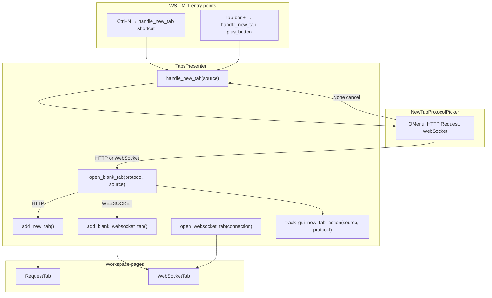
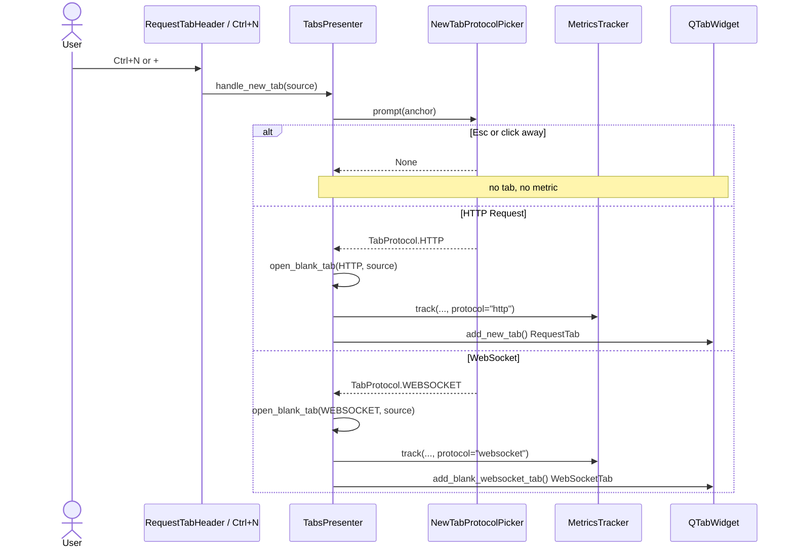

# PYPOST-1157: Blank-tab protocol selector UX

Step 2 artifact for PYPOST-1157 (WS-TM-1). Turns the approved requirements in
[`10-requirements.md`](10-requirements.md) into a high-level architecture for the
protocol picker and blank-tab routing API. UX choice is **Option A** from parent
research [`ai-tasks/PYPOST-1156/20-architecture.md`](../PYPOST-1156/20-architecture.md):
a popup `QMenu` shown **before** any editor is created.

**Scope:** `Ctrl+N` and tab-bar **+** only. HTTP Request is the default first item.
Cancel creates no tab. Confirming HTTP opens a blank HTTP `RequestTab`. Confirming
WebSocket opens a **WebSocket** blank tab (existing `WebSocketTab` is an acceptable
placeholder; full draft-editor semantics are
[PYPOST-1158](https://pypost.atlassian.net/browse/PYPOST-1158)). MCP Client picker
items are out of scope ([PYPOST-1165](https://pypost.atlassian.net/browse/PYPOST-1165)).

## Research

### R-1 Competitive UX (updated)

| Product | Blank-tab / new-session entry | Implication |
| --- | --- | --- |
| **Postman** | **New → WebSocket** (or **Ctrl+N** / **⌘+N** in the desktop app) opens a creation flow that includes WebSocket as an explicit type ([Postman docs](https://learning.postman.com/docs/sending-requests/websocket/create-a-websocket-request/)) | Protocol is chosen **before** the editor loads |
| **Insomnia** | Sidebar **+** dropdown: select HTTP, WebSocket, gRPC, … at creation ([Insomnia docs](https://developer.konghq.com/insomnia/requests/)) | Same choose-then-open pattern; hidden **+** is a known discoverability risk |

Option A (popup menu on the new-tab action) matches both products and the parent
epic recommendation. Option B (split **+**) and Option C (modal dialog) stay rejected
for this story.

### R-2 Qt menu behavior (keyboard default and cancel)

`QMenu.exec()` is synchronous: it returns the chosen `QAction`, or `None` when the
user presses **Esc** or clicks outside ([Qt `QMenu::exec` notes](https://runebook.dev/en/docs/qt/qmenu/exec-2)).
That maps directly to FR-3 (cancel creates no tab).

`exec()` does **not** highlight the first item by default, so **Enter** would
otherwise require an extra keypress ([Qt forum: highlight first action](https://forum.qt.io/topic/122873/highlight-focus-first-action-in-qmenu-on-show)).
WS-TM-1 must call `setActiveAction(http_action)` **before** `exec()`, and pass that
action as `exec(anchor, http_action)`, so **HTTP Request** is the keyboard default
(NFR-1, NFR-3).

Repo precedent: `collection_tree_actions.py` already uses `menu.exec(...)` and
treats a non-matching / `None` result as cancel. Presenter tests should **not** call
real `exec()` (it blocks the Qt event loop); inject a picker callable instead.

### R-3 Current codebase constraints (repo facts)

| Area | Current state | Architectural impact |
| --- | --- | --- |
| `TabsPresenter.handle_new_tab(source)` | Logs, `track_gui_new_tab_action(source)`, then `add_new_tab()` (`tabs_presenter.py` L387–391) | Must prompt **before** tab creation; metrics only after a completed choice |
| `RequestTabHeader` | **+** click and plus-tab `tabBarClicked` emit `new_tab_requested` → `handle_new_tab("plus_button")` | Header stays signal-only; presenter owns the picker |
| `main_window.py` | `Ctrl+N` → `handle_new_tab("shortcut")` | Unchanged wiring; picker is inside `handle_new_tab` |
| `TabsPresenter.add_new_tab()` | Always `_create_request_tab()` | HTTP confirm continues to call this |
| `TabsPresenter.open_websocket_tab(conn)` | Deduplicates by `connection.id`; used by Collections and session restore | **Must not** be the blank-tab path (FR-5.3) |
| `WebSocketConnection()` | Defaults: unique UUID `id`, `name="New WebSocket"`, `url=""` | Fresh connection is enough for a WS blank placeholder |
| `save_tabs_state()` | Persists any `WebSocketTab` whose `connection_data.id` is set | Draft-id exclusion is PYPOST-1158; WS-TM-1 does not change restore rules |
| `close_tab` empty fallback | `add_new_tab(save_state=False)` when `_request_tab_count() == 0` | Unchanged here (PYPOST-1159) |
| `_request_tab_count()` | Counts `RequestTab` **or** `WebSocketTab` | Using `WebSocketTab` as the WS blank page keeps close-last-tab counting correct |
| `track_gui_new_tab_action(source)` | Label `source` only (`plus_button`, `shortcut`, `collections_context`, `unknown`) | Add `protocol` (`http` / `websocket`); omit increment on cancel |
| `tabs_presenter.py` size | **714** LOC vs cap **785** (`scripts/audit_baseline_metrics.py`) | Extract picker to a new module; keep presenter routing thin |
| Collections **New tab** | `track_gui_new_tab_action("collections_context")` then isolated HTTP copy | Unchanged; optional `protocol` defaults to `unknown` |

### R-4 Metrics label change

`gui_new_tab_actions_total` today has a single label `source`
(`metrics_registry.py` L56–61; `doc/prometheus_monitoring.md`). Adding `protocol`
is a scrape-text change: existing tests that match
`gui_new_tab_actions_total{source="plus_button"}` must expect both labels
(Prometheus serializes labels alphabetically:
`{protocol="http",source="plus_button"}`).

Callers that are not a blank-tab picker (Collections context menu) keep compiling
via `protocol: str = "unknown"`. Allowed protocol values in WS-TM-1: `http`,
`websocket`, `unknown`. `mcp_client` is reserved for PYPOST-1165.

Do **not** emit payload fields (URL, headers, body) — FR-6.3; there is no URL yet.

## Implementation Plan

### High-level approach

1. Add `TabProtocol` (`http` / `websocket`) and `NewTabProtocolPicker` (Option A
   `QMenu`) in a new widget module.
2. Change `handle_new_tab(source)` to show the picker **first**. `None` → return
   with no tab and no metric. A choice → `open_blank_tab(protocol, source)`.
3. `open_blank_tab` is the **single routing API**: record metrics, then HTTP →
   `add_new_tab()`, WebSocket → `add_blank_websocket_tab()` (new, no saved-profile
   dedup).
4. Extend `track_gui_new_tab_action(source, protocol="unknown")` across Protocol,
   registry, OTel, NullMetrics, and the Qt mixin.

### Suggested implementation order (Step 4)

1. `TabProtocol` + `NewTabProtocolPicker` (menu construction separate from `exec`).
2. Metrics `protocol` label (registry, OTel, protocol, mixin, existing metric tests).
3. `TabsPresenter.open_blank_tab` + `add_blank_websocket_tab` + injectable picker
   on `handle_new_tab`.
4. Update existing plus-click / `handle_new_tab` tests to inject an HTTP-confirming
   picker so they do not hang on `QMenu.exec()`.

`close_tab` fallback, Collections open, history replay, and user docs stay out of
this story.

### Mandatory — Failing Repro (next Step 3)

Write the automated red tests **before** any production fix. No new production
modules, no presenter routing change, and no metrics signature change in Step 3.

**Primary module / class:** `tests/test_tabs_presenter.py` ::
`TestHandleNewTabProtocolPicker` (new `unittest.TestCase` in that file; module
already has `pytestmark = pytest.mark.timeout(60)` and `qapp`).

Import `TabProtocol` / picker helpers **inside each test method** so a missing
production module fails those tests with `ImportError` without breaking collection
of the rest of `test_tabs_presenter.py`. Inject a fake picker via an optional
`protocol_picker` argument on `TabsPresenter` (or patch the symbol
`handle_new_tab` will use). Do **not** call live `QMenu.exec()`. No network.

| Test | Asserts (desired behavior — red on today's code) |
| --- | --- |
| `test_handle_new_tab_shows_protocol_picker` | `handle_new_tab("shortcut")` and `handle_new_tab("plus_button")` invoke the picker **before** any new editor widget is added |
| `test_handle_new_tab_http_is_default_first_item` | Picker menu actions are exactly **HTTP Request** then **WebSocket**; the default / active action is the first item |
| `test_handle_new_tab_cancel_does_not_create_tab` | Picker returns `None` (Esc / dismiss) → tab count, current widget, and metrics unchanged (no `RequestTab` / `WebSocketTab` added; `track_gui_new_tab_action` not called) |
| `test_handle_new_tab_websocket_confirm_opens_ws_blank_not_request_tab` | Picker returns WebSocket → current page is **not** `RequestTab` and **is** a WebSocket blank tab (`WebSocketTab`); `open_websocket_tab` is not used (no saved-profile dedup path) |
| `test_handle_new_tab_http_confirm_opens_request_tab` | Picker returns HTTP → blank `RequestTab` titled like today's draft (`New Request`) |
| `test_open_blank_tab_records_source_and_protocol` | After a completed choice, `track_gui_new_tab_action` is called with `source` (`shortcut` / `plus_button`) and `protocol` (`http` / `websocket`) |

**Companion (picker chrome, no presenter):**
`tests/test_new_tab_protocol_picker.py` :: `TestNewTabProtocolPicker` —
`test_build_menu_http_request_is_first_default` asserts labels, order, active
action, and **no MCP Client** item. Same timeout marker. Construction-only (no
`exec()`).

**Sequencing:** research (this document) → Step 3 red tests (fail) → Step 4
production until green. Existing `test_handle_new_tab_opens_tab` and plus-click
tests stay as they are in Step 3; they are updated in Step 4 when `handle_new_tab`
grows a picker.

## Architecture

### Jira acceptance criteria → design

| AC | Architecture |
| --- | --- |
| `Ctrl+N` and **+** invoke `NewTabProtocolPicker` before editor creation | Both entry points already call `handle_new_tab`; that method prompts first, then routes |
| HTTP Request is the default (first menu item) | First `QAction`; `setActiveAction` so Enter confirms HTTP |
| Cancelling picker does not create a tab | `prompt` returns `None` → `handle_new_tab` returns; no metric |
| Metrics record source and protocol (`http` / `websocket`) | `track_gui_new_tab_action(source, protocol)` from `open_blank_tab` only |
| `TabsPresenter.open_blank_tab(protocol, source)` is the single routing API | `handle_new_tab` and later PYPOST-1159 call this after a choice; factories are private to it for blank tabs |

### System modules and responsibilities

| Module | Responsibility |
| --- | --- |
| `pypost/ui/widgets/new_tab_protocol_picker.py` (**new**) | `TabProtocol` enum; `NewTabProtocolPicker.build_menu` / `prompt`; labels **HTTP Request** / **WebSocket** only |
| `TabsPresenter` | `handle_new_tab` → picker → `open_blank_tab`; `add_blank_websocket_tab`; keep `add_new_tab` / `open_websocket_tab` for non-picker paths |
| `RequestTabHeader` | Unchanged (`new_tab_requested`) |
| `WebSocketTab` / `WebSocketPresenter` | Reused as the WS blank page (placeholder OK) |
| `MetricsTrackerProtocol` + `MetricsRegistry` + `OtelMetricsTracker` + `NullMetrics` + `MetricsTrackingMixin` | `protocol` label on new-tab counter |
| `collection_tree_actions` | Unchanged |

### Main interfaces / APIs

```python
# pypost/ui/widgets/new_tab_protocol_picker.py
class TabProtocol(str, Enum):
    HTTP = "http"
    WEBSOCKET = "websocket"

class NewTabProtocolPicker:
    """Option A QMenu: HTTP Request first (default), then WebSocket."""

    def build_menu(self, parent: QWidget | None = None) -> QMenu: ...
    def prompt(
        self,
        parent: QWidget | None = None,
        *,
        anchor: QPoint | None = None,
    ) -> TabProtocol | None:
        """Return chosen protocol, or None if cancelled."""

# pypost/ui/presenters/tabs_presenter.py
def handle_new_tab(self, source: str = "unknown") -> None: ...
def open_blank_tab(self, protocol: TabProtocol, source: str) -> None: ...
def add_blank_websocket_tab(self, *, save_state: bool = True) -> WebSocketTab: ...

# metrics (all implementations)
def track_gui_new_tab_action(self, source: str, protocol: str = "unknown") -> None: ...
```

Enum values are `http` / `websocket` (Jira / FR-6), not parent-research
`REQUEST = "request"`, so routing and metrics share one vocabulary. PYPOST-1165
adds `MCP_CLIENT = "mcp_client"` later without forking a second picker.

`open_websocket_tab(connection)` stays the Collections / restore API.

### Component interaction





### Routing and factory rules

| Path | API | Tab kind | Metrics |
| --- | --- | --- | --- |
| `Ctrl+N` / **+**, choose HTTP | `open_blank_tab(HTTP, source)` | Blank `RequestTab` | `source` + `protocol=http` |
| `Ctrl+N` / **+**, choose WebSocket | `open_blank_tab(WEBSOCKET, source)` | Blank `WebSocketTab` (placeholder) | `source` + `protocol=websocket` |
| `Ctrl+N` / **+**, cancel | `handle_new_tab` returns | Unchanged | None |
| Collections left-click / restore WS | `open_websocket_tab(conn)` | Saved `WebSocketTab` | Unchanged (not this story) |
| Collections **New tab** HTTP | `add_new_tab(copy)` | Isolated `RequestTab` | Existing `collections_context` |
| Close last tab | `add_new_tab(save_state=False)` | HTTP blank | Unchanged (PYPOST-1159) |
| History replay | `load_request_from_history` → `add_new_tab` | HTTP | Unchanged |

`add_blank_websocket_tab` builds `WebSocketConnection()` + `WebSocketPresenter` +
`WebSocketTab` and inserts before the plus tab (same insert rules as
`add_new_tab`). It must **not** call `open_websocket_tab` (id dedup would collapse
two blanks that somehow shared an id, and it is the saved-profile path).

PYPOST-1158 replaces placeholder-quality draft rules (session-restore exclusion,
MCP preview on draft). WS-TM-1 only needs a visible WebSocket workspace tab.

### Picker UX details (Option A)

- Menu items, in order: **HTTP Request**, **WebSocket**. No MCP Client.
- Default: first action active so Enter confirms HTTP (NFR-3).
- Cancel: Esc or click outside → `None` (FR-3).
- Anchor: **+** → global position under `PLUS_TAB_BUTTON`; `Ctrl+N` → the same
  plus control when attached, else `QCursor.pos()`.
- Automation id: `pypost_new_tab_protocol_menu` via `set_widget_id`.
- Keyboard: native `QMenu` arrows / Enter / Esc (NFR-1). Optional mnemonics
  (`&HTTP Request`, `&WebSocket`) are allowed; labels must remain those strings
  (NFR-4).

### Testability (Python / Qt)

Inject `protocol_picker: Callable[..., TabProtocol | None] | None = None` on
`TabsPresenter.__init__` (dependency injection, lsr-python). Default is
`NewTabProtocolPicker().prompt`. Unit tests pass a lambda and never show a menu.
`build_menu()` stays unit-testable without `exec()`.

### Architectural patterns

| Pattern | Application |
| --- | --- |
| **Presenter coordination** | `TabsPresenter` remains the only owner of `QTabWidget` lifecycle |
| **Factory methods** | `add_new_tab` / `add_blank_websocket_tab` construct pages; `open_blank_tab` only routes |
| **Peer editors** | HTTP and WebSocket stay separate widget types; choice is at creation only |
| **Dependency injection** | Optional `protocol_picker` for tests; metrics already injected |
| **Enum as shared vocabulary** | `TabProtocol` values equal metrics `protocol` labels |

### Out of scope (do not implement here)

- MCP Client menu item or `TabProtocol.MCP_CLIENT` (PYPOST-1165)
- Close-last-tab picker (PYPOST-1159)
- Draft session-restore exclusion and full draft editor (PYPOST-1158)
- Collections WebSocket **New tab** / rename / delete (PYPOST-1160)
- User-doc rewrite (PYPOST-1163)
- Protocol switch on an already open tab

## Q&A

| Question | Answer |
| --- | --- |
| Why Option A, not a dialog? | Parent research chose it; non-modal, HTTP is one Enter, matches Postman/Insomnia choose-at-creation |
| Why `TabProtocol.HTTP = "http"` instead of `REQUEST = "request"`? | Jira AC and FR-6 name metrics `http` / `websocket`; one enum avoids a mapping layer |
| Why a real `WebSocketTab` instead of a dummy `QLabel` placeholder? | `_request_tab_count` already includes `WebSocketTab`; tests can assert not-`RequestTab` and is-WS-tab; PYPOST-1158 owns draft restore/editor completeness |
| Why not `open_websocket_tab` for blanks? | That API dedups by saved id and is the Collections/restore path (FR-5.3) |
| When are metrics incremented? | Only in `open_blank_tab` after a completed choice. Cancel is silent. Collections keeps its own `collections_context` call |
| Will `QMenu.exec` hang tests? | Yes if unmocked. Injectable `protocol_picker` plus `build_menu()` tests without `exec()` |
| Module size? | Picker lives in a new file so `tabs_presenter.py` stays under 785 LOC |
| Does close-last-tab use the picker? | No. PYPOST-1159 |
| Is MCP Client in the menu? | No. PYPOST-1165 extends this picker later |

## References

- [`10-requirements.md`](10-requirements.md)
- [`ai-tasks/PYPOST-1156/20-architecture.md`](../PYPOST-1156/20-architecture.md) — Option A
- [PYPOST-1157](https://pypost.atlassian.net/browse/PYPOST-1157) — this story
- [Postman: Create a WebSocket Request](https://learning.postman.com/docs/sending-requests/websocket/create-a-websocket-request/)
- [Insomnia: Create requests](https://developer.konghq.com/insomnia/requests/)
- `pypost/ui/presenters/tabs_presenter.py`, `pypost/ui/widgets/tab_header.py`
- `pypost/core/metrics_registry.py`, `pypost/core/metrics_protocol.py`
