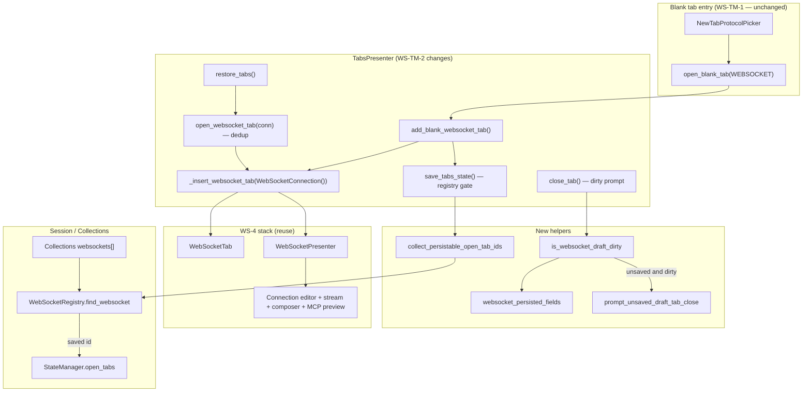
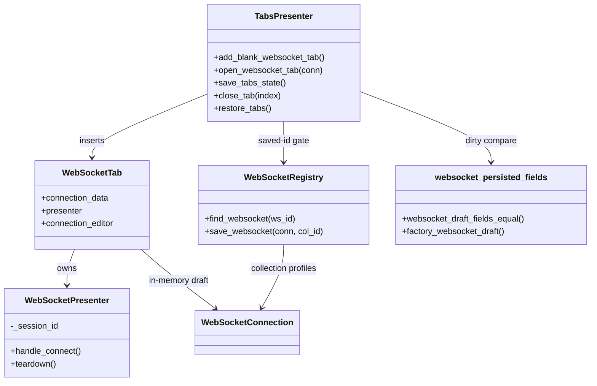

# PYPOST-1158: Blank WebSocket draft tab

Step 2 artifact for [PYPOST-1158](https://pypost.atlassian.net/browse/PYPOST-1158).
Turns the approved requirements in [`10-requirements.md`](10-requirements.md)
into a high-level architecture for WS-TM-2 under epic
[PYPOST-1155](https://pypost.atlassian.net/browse/PYPOST-1155).

**Parent architecture:** Reuse the protocol-aware blank-tab model from
[`ai-tasks/PYPOST-1156/20-architecture.md`](../PYPOST-1156/20-architecture.md).
Do not reinvent picker routing, saved-profile dedup, or child-story
boundaries. WS-TM-1 ([PYPOST-1157](https://pypost.atlassian.net/browse/PYPOST-1157))
already ships `handle_new_tab` → `open_blank_tab(WEBSOCKET)` →
`add_blank_websocket_tab()`.

**Peer pattern:** MCP Client draft omission in
[`ai-tasks/PYPOST-1166/20-architecture.md`](../PYPOST-1166/20-architecture.md)
and [`doc/dev/mcp_client_draft_tab.md`](../../doc/dev/mcp_client_draft_tab.md).
WebSocket cannot copy MCP's "omit every tab of this kind": saved WebSocket
profiles must still restore.

## Research

### R-1 Parent epic decisions (PYPOST-1156 — reuse)

| Decision | Source | WS-TM-2 implication |
| --- | --- | --- |
| Blank WebSocket uses `add_blank_websocket_tab()`, **not** `open_websocket_tab()` | PYPOST-1156 Architecture | Preserves FR-6 (no dedup / focus steal on new drafts) |
| Draft identity = in-memory `WebSocketConnection()` with ephemeral UUID | PYPOST-1156 | Do **not** write draft ids to `StateManager.open_tabs` |
| Saved profiles keep `open_websocket_tab(conn)` dedup + restore | PYPOST-1156 FR-3.2 | Out of scope to change |
| Full editor reuses existing `WebSocketTab` + `WebSocketPresenter` (WS-4) | PYPOST-1156 / PYPOST-1132 | No new editor widget; wire draft **lifecycle** only |
| Save / restore-after-save | PYPOST-1161 (WS-TM-5) | Out of scope |

Jira AC "empty `ws://` URL" is the Step 1 meaning: the URL **field** is
empty (no host, path, or pre-filled scheme). The user types a full
`ws://` or `wss://` address. That matches FR-1.3, not a literal `ws://`
string in the input.

### R-2 Current codebase state (repo facts, verified)

| Area | Current state | Gap for PYPOST-1158 |
| --- | --- | --- |
| `TabsPresenter.add_blank_websocket_tab()` | `_insert_websocket_tab(WebSocketConnection())` — builds `WebSocketPresenter` + `WebSocketTab`, inserts before plus | Factory already exists (WS-TM-1). Lifecycle rules incomplete |
| `TabsPresenter.open_websocket_tab(conn)` | Dedup loop on `tab.connection_data.id == connection.id`; then `_insert_websocket_tab` | Correct for Collections / restore. Blank path must never call this |
| `TabsPresenter.open_blank_tab(WEBSOCKET)` | Routes to `add_blank_websocket_tab()` | Already correct (PYPOST-1157) |
| `WebSocketConnection` defaults | `name="New WebSocket"`, `url=""`, empty `params` / `headers` / `subprotocols`, factory heartbeat / reconnect / MCP (`expose_as_mcp=False`) | Matches FR-1.3 / FR-1.4 |
| `_insert_websocket_tab` tab label | `connection.name` → **New WebSocket** | Matches FR-1.2 |
| URL widget | `load_connection` does `setText(conn.url or "")`. Placeholder is `wss://example.com/stream or ws://localhost:8080/feed` (hint only, not a value) | FR-1.3 is the **text**, not the placeholder |
| `WebSocketTab` | Full WS-4 chrome: connection editor, stream, composer, presets, MCP sub-tab, state badge | Editor parity (FR-1.1, FR-3, FR-4, NFR-3) — reuse as-is |
| `WebSocketConnectionEditor` | `WS_URL_INPUT`, Params / Headers / Subprotocols tables, MCP checkbox + `build_websocket_mcp_preview` | Preview is in-tab (FR-4). Unexposed draft shows the existing "Enable Expose…" placeholder until the user checks the box |
| `WebSocketPresenter.handle_connect` | Reads **editor** URL / handshake; `SessionSlots.acquire(self._session_id)` with unique `sess_…` per presenter | Connect works without a collection item (FR-3.1, FR-7, NFR-5). `_insert_websocket_tab` does not pass `settings=`; that is **pre-existing for saved tabs too** — out of scope |
| `TabsPresenter.save_tabs_state()` | Appends **every** `WebSocketTab.connection_data.id`; skips `McpClientTab` | **Bug vs FR-5:** draft UUIDs are written. Restore then logs `restore_tabs_item_not_found` and does not reopen them |
| `TabsPresenter.restore_tabs()` | Resolves ids via `WebSocketRegistry.find_item`; saved WS through `open_websocket_tab` | Saved restore OK. Draft ids must never appear in `open_tabs` |
| `TabsPresenter.close_tab()` | Duck-typed `presenter.teardown()`; then `removeTab`. Last-tab fallback is `add_new_tab` (HTTP; PYPOST-1159) | **Gap vs FR-8:** no unsaved prompt |
| `tab_dirty.is_tab_dirty` | HTTP `RequestTab` only. Used for **sibling-reload after save**, not close | Blank HTTP tabs have `persisted_baseline is None`, so `is_tab_dirty` is False. HTTP close has **no** discard/keep prompt today ([PYPOST-647](https://pypost.atlassian.net/browse/PYPOST-647)) |
| `collection_item_dialogs.py` | Shared `QMessageBox` helpers; sibling-reload prompts exist; **no** draft-close helper | Add `prompt_unsaved_draft_tab_close` here. Wire **WebSocket drafts only** this story |
| `tests/test_tabs_presenter.py` | Picker confirm opens `WebSocketTab` and does not call `open_websocket_tab`; MCP draft omit tests | **No** `add_blank_websocket_tab` restore-omit or dirty-close tests |
| `tabs_presenter.py` LOC | **779 / 785** cap (`scripts/audit_baseline_metrics.py`) | Extract draft persist + close helpers. Do not grow this file past 785 |

What is **already true** on HEAD (WS-TM-1 placeholder is already a real
`WebSocketTab`, not an HTTP editor):

- FR-1.1 / FR-1.2 / FR-1.3 / FR-1.4 factory defaults
- FR-2 (create does not call `WebSocketRegistry.save_websocket`)
- FR-6 (blank path never enters the dedup loop)
- FR-3 / FR-4 / FR-7 live editor stack (same `_insert_websocket_tab` as saved)

WS-TM-2 is therefore a **lifecycle** story: stop persisting draft ids
(FR-5) and prompt on dirty draft close (FR-8), plus lock tests so the
already-shipped factory / no-merge / saved-dedup behavior cannot regress.

### R-3 Competitive UX (Postman, Insomnia, RFC 6455)

**Postman** — **New → WebSocket** opens a raw request in a new tab. The
user enters a URL that begins with `ws://` or `wss://`, then **Connect**.
Save is a later **Save to collection** step, not part of create
([Postman create][postman-ws-create], [Postman save][postman-ws-save]).
PyPost aligns: empty URL at creation, compose-before-save, Connect on
the draft.

**Insomnia** — request **type** is chosen at creation (HTTP, WebSocket,
gRPC, …) ([Insomnia requests](https://developer.konghq.com/insomnia/requests/)).
Temporary-tab work ([INS-5088](https://github.com/Kong/insomnia/pull/8486))
is about sidebar browsing, not PyPost's "new blank draft" path. Insomnia
keeps WebSocket connections while the tab exists and tears them down on
tab close ([INS-4778](https://github.com/Kong/insomnia/pull/8266)) —
already how `close_tab` → `presenter.teardown()` works.

**RFC 6455** WebSocket URIs are `ws-URI` / `wss-URI` with a required
scheme and host ([RFC 6455 §3](https://www.rfc-editor.org/rfc/rfc6455.html)).
There is no valid empty-scheme default. Leaving the field blank (FR-1.3)
is the correct client UX: the user supplies a full URI before Connect.

### R-4 Draft vs saved identity rule

| Tab kind | Creation API | Dedup on open? | In `save_tabs_state`? | Restored on startup? |
| --- | --- | --- | --- | --- |
| Saved WebSocket profile | `open_websocket_tab(conn)` | Yes (by profile id) | Yes (id in `WebSocketRegistry`) | Yes |
| Blank WebSocket draft | `add_blank_websocket_tab()` | **No** (always new tab) | **No** | **No** |
| Blank HTTP draft | `add_new_tab()` | N/A | No (`RequestTab.request_data` is `None`) | No |
| Blank MCP Client draft | `add_blank_mcp_client_tab()` | No | **No** (`McpClientTab` omitted) | No |

**WS rule (MCP-TM-2 idea, not MCP-TM-2 copy):** append a WebSocket tab id
to `open_tabs` **only** when `WebSocketRegistry.find_websocket(id)`
returns a collection-backed profile. Ephemeral in-tab UUIDs stay out of
session state until PYPOST-1161 save.

Do **not** omit every `WebSocketTab`. That would break FR-5.2 (saved
profiles remain restorable).

### R-5 Dirty-close: HTTP does not already prompt

FR-8 asks for the **same choice set** as the HTTP draft unsaved-close
story: **Discard** (close) or **Keep the tab** — not Save / Save As.

Verified on HEAD:

- `close_tab` never calls `is_tab_dirty`.
- `is_tab_dirty` is sibling-tab reload after persist
  (`_offer_stale_tab_resolution`).
- Blank HTTP tabs do not set `persisted_baseline`.
- Explicit HTTP discard-on-close is still debt
  [PYPOST-647](https://pypost.atlassian.net/browse/PYPOST-647).

This story **introduces** `prompt_unsaved_draft_tab_close` and wires it
for **unsaved WebSocket drafts only**. It does not retrofit HTTP close
(that would change HTTP UX and needs blank-HTTP baselines, outside Jira
AC). PYPOST-1161 must not grow this dialog into a save path.

Dirty for a WS draft = editor-visible fields differ from a **new unsaved
profile's factory defaults** (`WebSocketConnection()` handshake / MCP /
presets / sequences). A live connection with no field edits is **not**
dirty; `teardown()` still runs on close. Saved-profile tabs (id in
registry) close without this prompt.

Do **not** add `WebSocketTab.persisted_baseline` in this story. HTTP
baselines exist to compare against last-saved disk state. Drafts have no
disk state until PYPOST-1161; factory-compare is the baseline. Save can
adopt a snapshot field later.

## Implementation Plan

### High-level approach

1. **Keep the factory thin** — `add_blank_websocket_tab()` still
   delegates to `_insert_websocket_tab(WebSocketConnection())`. No
   Collections write. No `open_websocket_tab` call.
2. **Fix session restore omission (FR-5)** — `save_tabs_state` appends a
   WebSocket id only when `WebSocketRegistry.find_websocket(id)` is not
   `None`. Mirror MCP's "do not write the UUID" outcome, not MCP's
   "omit this widget type".
3. **Dirty-close (FR-8)** — before `close_tab` tears down a WebSocket
   tab, if the id is **not** in the registry and
   `is_websocket_draft_dirty(tab)`, call
   `prompt_unsaved_draft_tab_close`. **False** (Keep tab) returns
   without teardown. **True** (Discard) continues existing teardown +
   `removeTab` + last-tab HTTP fallback (PYPOST-1159 owns that fallback).
4. **Extract helpers** so `tabs_presenter.py` stays ≤ 785 LOC.
5. **Lock saved paths** — `open_websocket_tab` dedup and saved-profile
   persist/restore stay untouched.

### Suggested Step 4 touch order

```
1. websocket_persisted_fields.py (read editor fields, equal, dirty vs factory)
2. collection_item_dialogs.prompt_unsaved_draft_tab_close
3. tabs_presenter_draft.py (collect persistable ids; confirm draft close)
4. tabs_presenter.save_tabs_state + close_tab call the helpers
5. tests → green (Step 3 reds + Step 4 locks)
```

`pypost/core/websocket_persisted_fields.py` is a Qt-free comparison
module (peer of `request_persisted_fields.py`). Reading widgets stays in
the UI helper that builds a `WebSocketConnection` from the tab.

### Mandatory — Failing Repro (Step 3)

**Behavioral change — not N/A.** Sequence: research (this doc) → red
tests → Step 4 fix until green. No live network. Use `TabsPresenter` +
`FakeStateManager` / `FakeRequestManager` like the MCP draft tests.
Module already has `pytestmark = pytest.mark.timeout(60)` and
`@pytest.mark.usefixtures("qapp")`.

HEAD already has a working `WebSocketTab` factory and no-merge blank
path. Step 3 must write tests that are **red on HEAD**, not locks that
already pass.

#### Primary (must be red on HEAD) — `tests/test_tabs_presenter.py`

Put new methods on `TestTabsPresenter` (same `_make_presenter` as MCP
draft tests). Import `WebSocketConnection` inside each new test when
needed (1157 / 1166 pattern).

| Test | Asserts (desired — red today) | Why red on HEAD |
| --- | --- | --- |
| `test_save_tabs_state_omits_unsaved_websocket_draft` | After `add_blank_websocket_tab()`, `tab.connection_data.id` is **not** in `state_manager.get_open_tabs()`. A second presenter `restore_tabs()` with `open_tabs=[draft_id]` creates **no** `WebSocketTab` (blank HTTP fallback only) | `save_tabs_state` appends every WS id |
| `test_close_dirty_websocket_draft_prompts_discard_or_keep` | Patch `prompt_unsaved_draft_tab_close`. Set URL on the draft editor (dirty). `close_tab(index)` → prompt called once. Return **False** → tab remains, `teardown` **not** called. Return **True** → tab removed, `presenter.teardown` called once | `close_tab` never prompts |

The clean-close case (`test_close_clean_websocket_draft_does_not_prompt`)
is already green on HEAD and belongs with the Step 4 locks below, not
this table.

Do **not** require live Connect, stream frames, or MCP probe runtime in
Step 3.

#### Out of Step 3 (already green or Step 4 locks)

Write these in Step 4 (or as follow-on locks after the reds go green).
They must not be the Step 3 failing repro:

- Picker routing
  (`test_handle_new_tab_websocket_confirm_opens_ws_blank_not_request_tab`)
  — green from PYPOST-1157.
- Factory title / empty URL / `WebSocketTab` type — already true via
  `WebSocketConnection()` + `_insert_websocket_tab`.
- `test_two_blank_websocket_tabs_do_not_merge` — already true (blank
  path never dedups). **Mandatory Step 4 lock.**
- `test_open_websocket_tab_still_dedups_saved_profile` — existing
  behavior. **Mandatory Step 4 lock.**
- `test_save_tabs_state_still_persists_saved_websocket_id` — on HEAD
  this passes (all WS ids persist). After a **wrong** "omit every
  `WebSocketTab`" fix it would fail. **Mandatory Step 4 lock** so
  FR-5.2 cannot regress. Setup: `FakeRequestManager.collections` holds
  a `Collection` with a `WebSocketConnection`; `open_websocket_tab(conn)`
  then `save_tabs_state()` includes that id.
- `test_close_clean_websocket_draft_does_not_prompt` — already true
  on HEAD (`close_tab` never prompts; always `teardown()` + remove).
  After FR-8 is wired this locks clean vs dirty draft. **Mandatory
  Step 4 lock.** Not a Step 3 red.
- Full editor chrome (`WS_CONNECT_BUTTON`, `WS_STREAM_VIEW`,
  `WS_COMPOSER_EDIT`, `WS_DETAIL_TABS`) — already constructed by
  `WebSocketTab`. Optional Step 4 lock in
  `tests/test_websocket_client_ui_repro.py` if tabs tests do not reach
  the widgets.
- Save-to-collection (PYPOST-1161), close-last-tab picker
  (PYPOST-1159), e2e loopback Connect (`test_agent_e2e_websocket.py`).

## Architecture

### Recommended approach

**Treat the blank WebSocket tab as a first-class draft** on the existing
WS-4 editor stack, with **registry-gated session persistence** and
**factory-compare dirty-close** in `TabsPresenter`.

**Rationale:**

1. PYPOST-1156 already chose `add_blank_websocket_tab` + reuse
   `WebSocketTab`. WS-TM-2 closes lifecycle gaps (restore, dirty close),
   not a new widget type.
2. MCP Client omit-all is wrong here: saved WebSocket tabs must restore
   (FR-5.2). Registry membership is the saved/draft predicate.
3. WS-4 editor, presenter, MCP preview, and session ceiling already run
   on in-memory `WebSocketConnection` (FR-3, FR-4, FR-7).
4. `open_websocket_tab` remains the Collections / restore path only
   (FR-6.4).
5. Factory-compare dirty detection matches "never saved" (FR-8) without
   copying HTTP `persisted_baseline` before Save exists.

### Options considered

| Option | Summary | Verdict |
| --- | --- | --- |
| **Registry-gated `save_tabs_state` + factory dirty-close + shared Discard/Keep dialog** | Persist WS ids only when in `WebSocketRegistry`; prompt only unsaved dirty drafts | **Chosen** |
| Omit drafts by never assigning UUID | Breaks in-tab identity / presenter logging | Rejected |
| Write draft UUID; rely on restore miss | Pollutes `open_tabs`; warning logs; fails FR-5.1 as specified | Rejected |
| Omit every `WebSocketTab` (copy MCP) | Breaks saved restore (FR-5.2) | Rejected |
| Route blank tabs through `open_websocket_tab` | Dedup breaks FR-6 | Rejected |
| New `WebSocketDraftTab` widget class | Duplicates WS-4 | Rejected |
| `WebSocketTab.persisted_baseline` this story | Needed after first save (PYPOST-1161), not for unsaved factory-compare | Rejected for WS-TM-2 |
| Wire the new prompt into HTTP `close_tab` too | HTTP has no close prompt today; blank HTTP has no baseline; extra product change | Rejected (PYPOST-647 / not Jira AC) |

### System modules and responsibilities

| Module | Responsibility this story |
| --- | --- |
| `pypost/ui/presenters/tabs_presenter.py` | Keep `add_blank_websocket_tab` / `_insert_websocket_tab` / `open_websocket_tab` / `restore_tabs`. Delegate persist-id collection and draft-close confirm. Stay ≤ 785 LOC |
| `pypost/ui/presenters/tabs_presenter_draft.py` (new) | `collect_persistable_open_tab_ids(...)`; `confirm_close_websocket_draft(...)` → bool (True = proceed with close) |
| `pypost/core/websocket_registry.py` | `find_websocket(ws_id)` — **read-only** "is this id saved?" gate. No `save_websocket` from this story |
| `pypost/core/websocket_persisted_fields.py` (new) | Factory-default comparison for draft dirty detection (url, params, headers, subprotocols, MCP flags/text, presets, sequences, name). Ignore ephemeral `id` |
| `pypost/ui/presenters/tab_dirty.py` | Add `is_websocket_draft_dirty(tab) -> bool` using editor read + `websocket_persisted_fields` |
| `pypost/ui/collection_item_dialogs.py` | `prompt_unsaved_draft_tab_close(parent, tab_title) -> bool` — True = Discard and close; False = Keep the tab |
| `pypost/models/websocket.py` | Unchanged defaults |
| `pypost/ui/widgets/websocket/websocket_tab.py` | Unchanged chrome; source for editor fields |
| `pypost/ui/presenters/websocket_presenter.py` | Unchanged session / connect / stream / MCP preview |
| `pypost/ui/widgets/websocket/connection_editor.py` | Unchanged; live draft fields + MCP preview |
| `pypost/ui/widgets/new_tab_protocol_picker.py` | Unchanged (WS-TM-1) |
| `WebSocketSaveOrchestrator` | Out of scope (PYPOST-1161) |

### Main interfaces / APIs

```python
# pypost/core/websocket_persisted_fields.py (new)
def websocket_draft_fields_equal(
    a: WebSocketConnection, b: WebSocketConnection
) -> bool: ...

def factory_websocket_draft() -> WebSocketConnection:
    """WebSocketConnection() with a stable dummy id for comparisons."""

# pypost/ui/presenters/tab_dirty.py
def is_websocket_draft_dirty(tab: WebSocketTab) -> bool:
    """True when editor-visible fields differ from new-profile factory defaults."""

# pypost/ui/collection_item_dialogs.py
def prompt_unsaved_draft_tab_close(parent: QWidget, tab_title: str) -> bool:
    """Return True to discard changes and close; False to keep the tab open."""

# pypost/ui/presenters/tabs_presenter_draft.py (new)
def collect_persistable_open_tab_ids(
    tabs: QTabWidget,
    *,
    websocket_id_is_saved: Callable[[str], bool],
) -> list[str]: ...

def confirm_close_websocket_draft(
    parent: QWidget,
    tab: WebSocketTab,
    *,
    websocket_id_is_saved: Callable[[str], bool],
) -> bool:
    """Return True if close_tab should proceed (not dirty, saved, or user discarded)."""

# pypost/ui/presenters/tabs_presenter.py (signatures unchanged)
def add_blank_websocket_tab(self, *, save_state: bool = True) -> WebSocketTab: ...
def open_websocket_tab(
    self, connection: WebSocketConnection, save_state: bool = True
) -> WebSocketTab: ...
def save_tabs_state(self) -> None:
    # RequestTab: existing id rule (request_data.id)
    # WebSocketTab: append id only if find_websocket(id) is not None
    # McpClientTab: still omitted
```

`open_websocket_tab(connection)` signature and dedup loop **unchanged**.

### Component interaction diagram



### Session restore and tab close

```mermaid
sequenceDiagram
    participant User
    participant TP as TabsPresenter
    participant Reg as WebSocketRegistry
    participant SM as StateManager

    Note over User,SM: Create blank draft
    User->>TP: picker → WebSocket
    TP->>TP: add_blank_websocket_tab()
    TP->>Reg: find_websocket(draft_id)
    Reg-->>TP: None
    TP->>SM: set_open_tabs (draft id omitted)

    Note over User,SM: Dirty close
    User->>TP: close dirty draft
    TP->>TP: is_websocket_draft_dirty True
    TP->>User: Discard / Keep the tab
    alt Keep the tab
        User-->>TP: False
        Note over TP: no teardown, tab remains
    else Discard
        User-->>TP: True
        TP->>TP: presenter.teardown(); removeTab
    end

    Note over User,SM: Open saved profile twice
    User->>TP: open_websocket_tab(saved_conn)
    TP->>TP: focus existing tab if id matches
    TP->>Reg: find_websocket(saved_id)
    Reg-->>TP: profile
    TP->>SM: set_open_tabs includes saved_id

    Note over User,SM: Restart
    TP->>SM: get_open_tabs()
    SM-->>TP: [saved_id only]
    TP->>TP: restore_tabs → open_websocket_tab(saved)
```

### Class / module relationships



`WebSocketRegistry.save_websocket` is shown for boundary clarity only —
this story never calls it (FR-2).

### Architectural patterns

| Pattern | Application |
| --- | --- |
| **Presenter coordination** | `TabsPresenter` owns tab lifecycle; WS-TM-2 adds draft persist/close rules only |
| **Factory method** | `add_blank_websocket_tab` / `_insert_websocket_tab` encapsulate widget construction |
| **Peer editors** | Same `WebSocketTab` for draft and saved; distinguish by registry membership |
| **Pure field comparison** | `websocket_persisted_fields` mirrors HTTP `request_persisted_fields` without a disk baseline |
| **Registry as source of truth** | "Saved" = present in `WebSocketRegistry`; everything else is draft for restore and dirty-close |
| **Shared dialog helper** | One Discard / Keep `QMessageBox` living with other tab dialogs; HTTP may adopt later (PYPOST-647) |

### FR and Definition of Done mapping

| Requirement / DoD | Architecture answer |
| --- | --- |
| FR-1.1 / DoD 1 Full WebSocket editor | Reuse `WebSocketTab` from `_insert_websocket_tab` (already on HEAD) |
| FR-1.2 / DoD 2 Title **New WebSocket** | `WebSocketConnection.name` default + insert label |
| FR-1.3 / DoD 3 Empty URL, no pre-filled scheme | `url=""`; widget `setText("")`; placeholder is hint only |
| FR-1.4 Handshake factory defaults | Empty params / headers / subprotocols from `WebSocketConnection()`; not copied from another tab |
| FR-2 / DoD 4 Not a collection item | No `save_websocket` on create; in-tab edits only |
| FR-3.1–3.4 / DoD 5 Connect, stream, composer, presets | Existing `WebSocketPresenter` + WS-4 widgets; Connect reads the editor, not disk |
| FR-3.5 / NFR-3 State without color alone | Existing `WebSocketStateBadge` (glyph + text) |
| FR-4 / DoD 5 MCP preview | Existing MCP sub-tab + `build_websocket_mcp_preview` on in-tab fields; no Collections item; does not register live agent tools (`expose_as_mcp` default False) |
| FR-5 / DoD 7 Exclude unsaved from restore | Registry-gated `save_tabs_state`; `restore_tabs` unchanged |
| FR-5.2 / DoD 9 Saved restore + dedup | `open_websocket_tab` unchanged; saved ids still written |
| FR-6 / DoD 8 No merge of blank tabs | `add_blank_websocket_tab` never calls `open_websocket_tab` |
| FR-6.4 Saved focus-if-open | Dedup loop preserved |
| FR-7 / DoD 6 Session ceiling | Same `handle_connect` → `SessionSlots` as saved tabs; unique `_session_id` per presenter (NFR-5) |
| FR-8 / DoD 10 Dirty draft close | Discard / Keep prompt; no Save path; saved tabs and clean drafts do not prompt |
| NFR-1 Consistency | HTTP-like compose-before-save; WS-4 live chrome |
| NFR-2 Discoverability | Picker already lands on `WebSocketTab` (WS-TM-1) |
| NFR-4 Session limits | `ws_max_concurrent_sessions` via existing slot acquire |
| DoD 5 MCP preview on draft | GUI contract only; probe runtime unchanged (out of scope) |

### Out of scope (unchanged from requirements)

PYPOST-1157 picker, PYPOST-1159 close-last-tab picker, PYPOST-1160
Collections menus, PYPOST-1161 Save, PYPOST-1162 hotkeys, PYPOST-1163
user docs, MCP probe **runtime**, protocol switch on an open tab,
HTTP discard-on-close retrofit, `WebSocketPresenter(settings=)` injection
(pre-existing shared gap).

## Q&A

| Question | Answer |
| --- | --- |
| Why not a new draft model type? | `WebSocketConnection()` suffices; draft = not in registry / not in `open_tabs` |
| Why registry gate instead of omitting all `WebSocketTab` ids? | Saved WebSocket tabs must still restore; MCP has no saved-tab restore path yet |
| Does the editor need work for "placeholder" tabs? | No — WS-4 `WebSocketTab` is complete. WS-TM-1 already constructs it |
| Two blank tabs same title / empty URL — merge? | No — each `add_blank_websocket_tab` inserts a new tab (FR-6.2). Already true; lock in Step 4 |
| Why not `persisted_baseline` on `WebSocketTab`? | Drafts have no disk snapshot. Factory-compare implements FR-8 until PYPOST-1161 save |
| HTTP blank draft close — in scope? | No. HTTP `close_tab` has no prompt today. This story adds Discard / Keep for **WS drafts** only. Shared dialog may be reused later (PYPOST-647) |
| `tabs_presenter.py` LOC? | 779 / 785 — extract persist + close helpers before adding the registry gate and prompt |
| Step 3 live Connect test? | No — presenter tests for omit + dirty close. Editor Connect is already covered for saved tabs |
| Is the factory test the Step 3 red? | Not by itself — it would pass on HEAD. Pair lifecycle asserts (omit + dirty close) as the reds. Clean-close already passes on HEAD; lock it in Step 4 |
| Does MCP preview require Expose checked? | Preview widget is always there (FR-4). Contract text appears when `expose_as_mcp` is on, same as saved tabs. Checking the box does not persist a collection item |
| Empty URL vs RFC 6455? | The field starts empty; Connect still requires a full `ws://` / `wss://` URI. No fake default host |

## References

- [`10-requirements.md`](10-requirements.md) — FR-1…FR-8, DoD
- [`ai-tasks/PYPOST-1156/20-architecture.md`](../PYPOST-1156/20-architecture.md)
  — epic decomposition
- [`ai-tasks/PYPOST-1157/20-architecture.md`](../PYPOST-1157/20-architecture.md)
  — picker already routes to `add_blank_websocket_tab`
- [`doc/dev/new_tab_protocol_picker.md`](../../doc/dev/new_tab_protocol_picker.md)
  — routing APIs
- [`doc/dev/websocket_ui_client.md`](../../doc/dev/websocket_ui_client.md)
  — WS-4 component map
- [`doc/dev/mcp_client_draft_tab.md`](../../doc/dev/mcp_client_draft_tab.md)
  — draft restore omission pattern
- [`doc/dev/state_manager.md`](../../doc/dev/state_manager.md)
  — `open_tabs` semantics
- `pypost/ui/presenters/tabs_presenter.py` — `add_blank_websocket_tab`,
  `open_websocket_tab`, `save_tabs_state`, `close_tab`
- `pypost/core/websocket_registry.py` — `find_websocket`, `find_item`
- `pypost/models/websocket.py` — connection defaults
- [Postman — Create a WebSocket Request][postman-ws-create]
- [Postman — Save WebSocket requests][postman-ws-save]
- [RFC 6455 §3 WebSocket URIs](https://www.rfc-editor.org/rfc/rfc6455.html)
- [Insomnia request types](https://developer.konghq.com/insomnia/requests/)

[postman-ws-create]: https://learning.postman.com/docs/sending-requests/websocket/create-a-websocket-request/
[postman-ws-save]: https://learning.postman.com/docs/use/send-requests/protocols/websocket/save-websocket-requests.md
