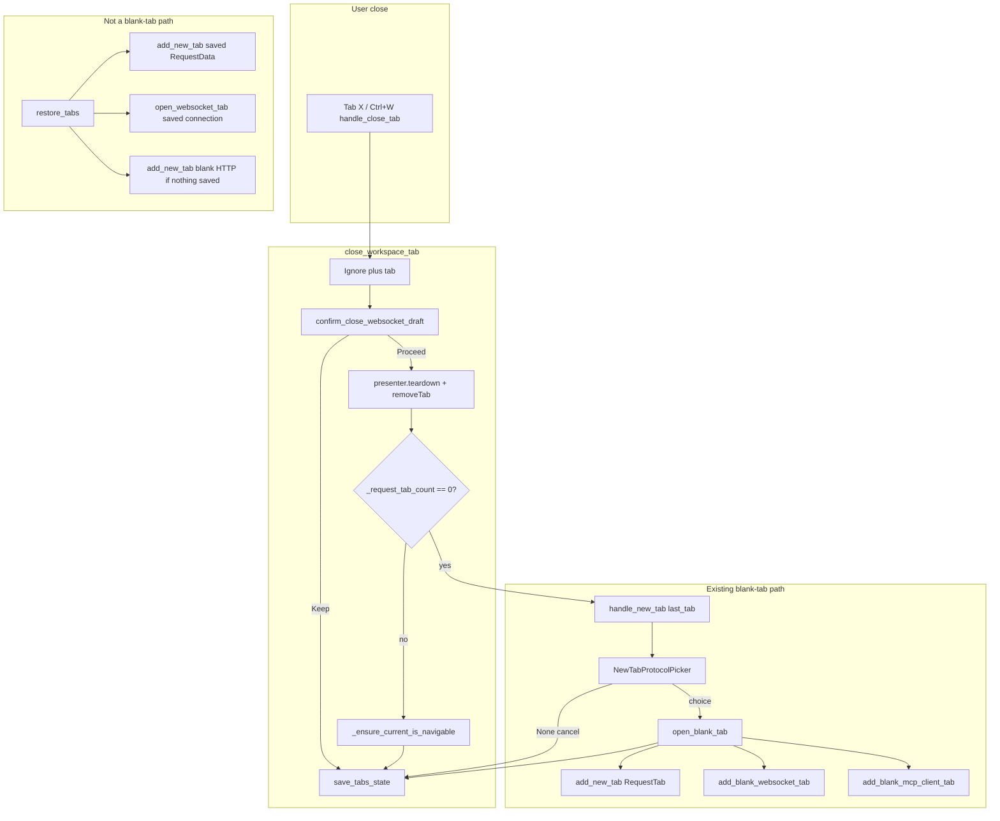
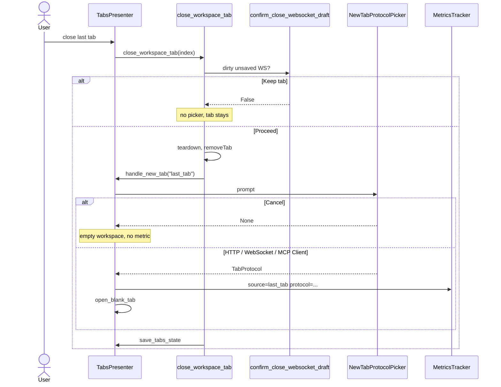

# PYPOST-1159: Tab entry-point parity

Step 2 artifact for [PYPOST-1159](https://pypost.atlassian.net/browse/PYPOST-1159)
(WS-TM-3, 2 SP). Turns the approved requirements in
[`10-requirements.md`](10-requirements.md) into a high-level architecture
for last-tab / empty-workspace replacement.

**Parent architecture:** Reuse the protocol-aware blank-tab model from
[`ai-tasks/PYPOST-1156/20-architecture.md`](../PYPOST-1156/20-architecture.md).
Do not invent a second picker or a second blank-tab factory.

**Shipped dependencies:**

- WS-TM-1 ([PYPOST-1157](https://pypost.atlassian.net/browse/PYPOST-1157)):
  `handle_new_tab(source)` → picker → `open_blank_tab(protocol, source)`.
- WS-TM-2 ([PYPOST-1158](https://pypost.atlassian.net/browse/PYPOST-1158)):
  `add_blank_websocket_tab()` draft editor; dirty-draft close prompt;
  unsaved WS ids omitted from restore.

**Hard constraint:** `pypost/ui/presenters/tabs_presenter.py` is **785 / 785**
LOC (`scripts/audit_baseline_metrics.py` cap 785). Any `close_tab` change
**must extract first**. Existing Debt
[PYPOST-1184](https://pypost.atlassian.net/browse/PYPOST-1184). Do not raise
the cap.

## Research

### R-1 Competitive UX (last-tab / empty workspace)

| Product | Last-tab / empty workspace | Implication for PyPost |
| --- | --- | --- |
| **Postman** | New WebSocket is an explicit create-time choice (**New → WebSocket**, or **Ctrl+N** / **⌘+N** on desktop) ([Postman docs](https://learning.postman.com/docs/sending-requests/websocket/create-a-websocket-request/)). Close All is allowed; unsaved close can prompt. Postman does not silently convert a just-closed WebSocket session into an HTTP editor. | Last-tab replacement must ask protocol the same way `Ctrl+N` does, not auto-open HTTP. |
| **Insomnia** | Request **type** is chosen at creation ([Insomnia docs](https://developer.konghq.com/insomnia/requests/)). Users have asked that closing the last Scratch Pad tab **not** end the session ([Kong/insomnia#8433](https://github.com/Kong/insomnia/issues/8433)). | Empty workspace after cancel is a valid session, not an app quit. |
| **Hoppscotch** | Closing the last REST/GraphQL tab lands on an empty workspace with **New Request** / **Import** CTAs; zero-tab state can persist ([hoppscotch#6286](https://github.com/hoppscotch/hoppscotch/pull/6286)). | Cancel-after-last-close may leave the strip empty (plus chrome only). |
| **RESTK** | Closing the last tab shows an empty / welcome screen; the app stays open ([RESTK tabs](https://restk.ai/docs/features/tabs)). | Same: empty is honest, not a forced HTTP draft. |

Industry pattern: **choose protocol at creation**; **empty after last close is OK**.
PyPost already matches the first for `Ctrl+N` / **+**. This story applies it to
the leftover HTTP-only fallback.

Empty-state UX guidance ([uxpatterns.dev](https://uxpatterns.dev/patterns/user-feedback/empty-states))
favours one primary next action. PyPost already has that: the trailing **+**
and `Ctrl+N`. This story does **not** add a new empty-state widget.

### R-2 Qt picker reuse (keyboard last-tab close)

`NewTabProtocolPicker.prompt` is a synchronous `QMenu.exec(pos, http_action)`
([Qt 6 `QMenu::exec`](https://doc.qt.io/qt-6/qmenu.html#exec)). Esc / click
away returns `None`. `setActiveAction` + the `exec(pos, action)` overload
keeps **HTTP Request** as the keyboard default (NFR-2, NFR-4).

Last-tab close is often a keyboard action (`handle_close_tab` → `close_tab`).
There is no mouse click on **+**. The shipped picker already anchors to the
plus button via `findChild(QPushButton, PLUS_TAB_BUTTON)` or `QCursor.pos()`
(`new_tab_protocol_picker.py`). Reusing `handle_new_tab` inherits that
anchor. Do not add a second menu.

Presenter tests must **not** call live `exec()` (blocks the Qt event loop).
Inject `protocol_picker=` as PYPOST-1157 already does.

### R-3 Current codebase (repo facts, verified on HEAD)

| Area | Current state | Gap for PYPOST-1159 |
| --- | --- | --- |
| `TabsPresenter.close_tab` | Dirty WS draft confirm → teardown → `removeTab`. If `_request_tab_count() == 0`: **`add_new_tab(save_state=False)`** (HTTP). Else navigable reselect. Then `save_tabs_state()`. | **Bug vs FR-1 / FR-2:** silent HTTP. Must call `handle_new_tab`, not `add_new_tab`. |
| `TabsPresenter.handle_new_tab(source)` | Logs, injectable picker, cancel returns, else `open_blank_tab`. | **The** blank-tab entry. Last-tab must pass a source that is **not** `shortcut` / `plus_button`. |
| `TabsPresenter.open_blank_tab` | Metrics then HTTP / WebSocket / MCP factories. | Unchanged. Last-tab confirm reuses this. |
| `add_blank_websocket_tab` | Shipped WS draft (PYPOST-1158). | Last-tab WebSocket confirm must use this, not `open_websocket_tab`. |
| `restore_tabs` | Resolves ids via `WebSocketRegistry.find_item`; saved HTTP + saved WS; if nothing restored, **`add_new_tab(save_state=False)`** (HTTP, no picker). | **Leave unchanged** (FR-4, FR-5). Restore is not a blank-tab path. |
| `save_tabs_state` | HTTP ids + **saved** WS ids only; omits WS drafts and MCP drafts. | Unchanged. Cancel-after-last-close then `save_tabs_state()` persists empty `open_tabs`. |
| `confirm_close_websocket_draft` | Runs **before** teardown in `close_tab` (PYPOST-1158). | Unchanged order (FR-3). Picker only after Discard on the last tab. |
| `close_tabs_for_request_ids` | Collections delete; empty strip still `add_new_tab(save_state=False)`. | **Out of scope.** Not a user last-tab close. |
| `_request_tab_count` | Counts `RequestTab`, `WebSocketTab`, `McpClientTab`. | Last MCP tab close also hits the empty fallback. Reusing `handle_new_tab` is correct. |
| Picker menu | HTTP Request, WebSocket, MCP Client (PYPOST-1165). | Last-tab uses the **same** menu. Do not strip MCP. |
| Metrics `_NEW_TAB_ACTION_SOURCES` | `plus_button`, `shortcut`, `unknown`, `collections_context`. Unknown strings become `unknown`. | Must add a distinct last-tab source or FR-6.1 records `unknown`. |
| `tabs_presenter.py` LOC | **785 / 785** | Extract **before** any `close_tab` edit. [PYPOST-1184](https://pypost.atlassian.net/browse/PYPOST-1184). |
| Existing last-close tests | `test_close_tab_ensures_at_least_one_tab`, `test_close_last_request_tab_focuses_replacement_not_plus` assume silent HTTP replacement. `_make_presenter` injects HTTP picker. | Step 3 reds spy on the picker. Step 4 keeps HTTP-confirm tests green via that injectable picker. |
| Mixed restore test | **Missing.** HTTP restore and WS-idle restore exist separately. | Step 3 **lock** (green on HEAD): mixed saved HTTP+WS restore. |

Verified last-tab line (`tabs_presenter.py`):

```python
if self._request_tab_count() == 0:
    self.add_new_tab(save_state=False)
```

Jira AC: this must become `handle_new_tab(<last-tab source>)`.

### R-4 Metrics source for the fallback

`gui_new_tab_actions_total` already has labels `source` and `protocol`
(`doc/prometheus_monitoring.md`). Cancel does not increment (PYPOST-1157).

Recommended source value: **`last_tab`**.

| Candidate | Verdict |
| --- | --- |
| `last_tab` | Short, parallel to `plus_button` / `shortcut`, distinct, not restore |
| `empty_workspace` | Accurate but longer; could be confused with restore-when-empty |
| Reuse `unknown` | Fails FR-6.1 (not attributable) |
| Reuse `shortcut` | Last-tab close is not `Ctrl+N` |

Add `last_tab` to `_NEW_TAB_ACTION_SOURCES` in `metrics_registry.py` (and
keep OTel / Null / mixin signatures unchanged). Protocol values stay
`http` / `websocket` / `mcp_client`. No URL, headers, or body (FR-6.4).

### R-5 LOC budget (785 / 785)

A one-line swap inside `close_tab` still touches a file at the cap.
PYPOST-1158 already used the last headroom. **Do not add a line first.**

**Mandatory Step 4 order:** extract until `tabs_presenter.py` is below
785, **then** change the empty-workspace fallback.

| Extract | Effect | Relation to PYPOST-1184 |
| --- | --- | --- |
| **Chosen:** move `close_tab` body to `pypost/ui/presenters/tabs_presenter_close.py` | Presenter `close_tab` becomes a thin delegate (~few LOC). Fallback change lives in the new module, not in the cap file. Mirrors `tabs_presenter_draft.py`. | Story-local extract required to change close. Does **not** close PYPOST-1184 (that ticket is insert-before-plus). |
| Optional extra: shared insert-before-plus helper | Shrinks the three factories (`add_new_tab`, `_insert_websocket_tab`, `add_blank_mcp_client_tab`). | **Would** land [PYPOST-1184](https://pypost.atlassian.net/browse/PYPOST-1184). Not required if close extract is enough. Do not raise the cap either way. |

Do **not** close PYPOST-1184 unless the insert-before-plus helper actually
ships.

## Implementation Plan

### High-level approach

1. **Extract first** — `close_tab` orchestration out of
   `tabs_presenter.py` so the cap file shrinks.
2. **Route empty-workspace replacement through `handle_new_tab("last_tab")`**
   after the tab is actually removed and `_request_tab_count() == 0`.
3. **Reuse** picker, `open_blank_tab`, HTTP / WS / MCP factories, dirty-draft
   prompt order, and `restore_tabs`.
4. **Allow empty** when the picker returns `None`. Plus-tab chrome stays.
   Then `save_tabs_state()` as today.
5. **Register** metrics source `last_tab`. Cancel still skips the counter.

`Ctrl+N` and **+** stay on `handle_new_tab("shortcut")` /
`handle_new_tab("plus_button")`. Restore never calls the picker.

### Suggested Step 4 touch order

```
1. Extract close_tab body → tabs_presenter_close.py
   (presenter method delegates; file drops below 785)
2. In the extracted helper: empty strip → handle_new_tab("last_tab")
3. Add last_tab to _NEW_TAB_ACTION_SOURCES + prometheus doc line
4. Green the Step 3 reds; keep restore locks green
5. Adjust last-close tests that assumed silent HTTP only where cancel
   vs confirm must be explicit (HTTP-confirm cases stay via injected picker)
```

No live network. No `QMenu.exec()` in tests. No `restore_tabs` picker.
No change to `open_websocket_tab` / Collections / history replay.

### Mandatory — Failing Repro (next Step 3)

**Behavioral change — not N/A.** Sequence: this document → Step 3 red
tests (fail on HEAD) → Step 4 extract + fallback until those reds are
green. Restore tests are **locks**: they must be **green on HEAD**.

**Primary module:** `tests/test_tabs_presenter.py` (already
`pytestmark = pytest.mark.timeout(60)` and `qapp`). New class
`TestCloseLastTabProtocolPicker`. Construct presenters with an injectable
`protocol_picker` spy. Do **not** call live `exec()`. No production
edits in Step 3.

HEAD today calls `add_new_tab(save_state=False)` when the strip is empty.
That never invokes the picker. Spying on `protocol_picker` (or asserting
`handle_new_tab` ran) is therefore **red**.

| Test | Role | Asserts (desired behavior) | On HEAD |
| --- | --- | --- | --- |
| `test_close_last_tab_uses_protocol_picker` | **Red** | Closing the sole workspace tab invokes the picker (`handle_new_tab` path) **before** any replacement tab is created. Must not be a direct `add_new_tab` empty fallback. | Fail: picker never called; HTTP `RequestTab` appears |
| `test_close_last_tab_http_confirm_opens_request_tab` | **Red** | Picker returns HTTP → blank `RequestTab` ("New Request"); metric `source=last_tab`, `protocol=http` | Fail: tab appears but picker not used / source is not `last_tab` |
| `test_close_last_tab_websocket_confirm_opens_ws_draft` | **Red** | Picker returns WebSocket → current page is `WebSocketTab` (PYPOST-1158 draft), **not** `RequestTab`; `open_websocket_tab` not used | Fail: replacement is HTTP `RequestTab` |
| `test_close_last_tab_cancel_creates_no_replacement` | **Red** | Picker returns `None` → `_request_tab_count() == 0`; no new-tab metric | Fail: silent HTTP tab; count stays 1 |
| `test_close_non_last_tab_does_not_show_picker` | **Lock** | Two workspace tabs; close one → picker **not** called; no replacement | Pass (HEAD never shows picker) |
| `test_close_dirty_last_websocket_draft_keep_skips_picker` | **Lock** | Dirty unsaved WS draft; Keep → tab remains; picker not called | Pass (HEAD never shows picker; prompt already wired) |
| `test_close_dirty_last_websocket_draft_discard_then_picker` | **Red** | Dirty last WS draft; Discard → tab gone **then** picker runs | Fail: Discard then `add_new_tab` HTTP, no picker |
| `test_restore_saved_http_tab_unchanged` | **Lock** | Existing `test_restore_tabs_opens_saved_tabs` (or equivalent assert) stays green; restore does not call picker | Pass |
| `test_restore_saved_websocket_profile_unchanged` | **Lock** | Saved WS id in `open_tabs` + collection → `WebSocketTab` via `open_websocket_tab`; no picker; idle (no auto-connect). May reuse `test_tabs_presenter_restore_tabs_idle_safe` rather than duplicate. | Pass |
| `test_restore_mixed_saved_http_and_websocket_workspace` | **Lock (new)** | `open_tabs=[http_id, ws_id]`; collection has both; restore yields **both** `RequestTab` and `WebSocketTab`; identities preserved; picker not called | Pass if written against current `restore_tabs` |
| `test_restore_does_not_reopen_unsaved_websocket_draft` | **Lock** | Existing `test_save_tabs_state_omits_unsaved_websocket_draft` stays green | Pass |

**Metrics companion (red):**
`tests/test_metrics_manager.py` — `track_gui_new_tab_action("last_tab", protocol="http")`
serializes `source="last_tab"` (not `unknown`). On HEAD the allowed-source
set lacks `last_tab`, so this is **red**.

**Out of Step 3 reds:** `Ctrl+N` / **+** picker tests already green.
`close_tabs_for_request_ids` empty fallback. Restore-when-no-saved-tabs
HTTP blank (`test_restore_tabs_opens_new_tab_when_no_saved`) — lock, not
a picker red.

**Sequencing:** research (this document) → Step 3 reds fail + restore
locks pass → Step 4 extract then fix until reds are green and locks stay
green.

## Architecture

### Jira acceptance criteria → design

| AC | Architecture |
| --- | --- |
| `close_tab` empty-workspace fallback uses `handle_new_tab` (picker), not `add_new_tab` directly | After `removeTab`, if `_request_tab_count() == 0`, call `handle_new_tab("last_tab")`. Confirm goes through `open_blank_tab`. |
| `restore_tabs` unchanged for saved HTTP / WS | No picker in `restore_tabs`. Saved HTTP still `add_new_tab(copy, save_state=False)`. Saved WS still `open_websocket_tab(conn, save_state=False)`. Empty restore still silent HTTP blank. |
| Mixed-workspace restore regression tests | Step 3 lock: both kinds restore together; no protocol rewrite. |

### Options considered

| Option | Summary | Verdict |
| --- | --- | --- |
| **`handle_new_tab("last_tab")` after last close** | One blank-tab path; same picker, cancel, factories, metrics | **Chosen** |
| Call picker then `open_blank_tab` from `close_tab` without `handle_new_tab` | Duplicates cancel / log / metric rules; Jira AC names `handle_new_tab` | Rejected |
| Keep `add_new_tab` but show picker only for WebSocket last-tab | HTTP last-close stays a trap; fails FR-1.3 | Rejected |
| Force HTTP on last-tab (status quo) | Fails the story | Rejected |
| Show picker during `restore_tabs` | Violates FR-4.3 | Rejected |
| New empty-state widget instead of picker | Extra chrome; **+** / `Ctrl+N` already recover; out of scope | Rejected |
| Edit `close_tab` in place at 785 / 785 | Fails audit cap | Rejected |

### System modules and responsibilities

| Module | Responsibility this story |
| --- | --- |
| `pypost/ui/presenters/tabs_presenter.py` | Thin `close_tab` delegate. `handle_new_tab` / `open_blank_tab` / `restore_tabs` unchanged except the empty fallback moves out. Stay **≤ 785** LOC. |
| `pypost/ui/presenters/tabs_presenter_close.py` (**new**) | Plus-tab guard, dirty-WS confirm, teardown, `removeTab`, empty → `handle_new_tab("last_tab")`, else navigable reselect, `save_tabs_state`. |
| `pypost/ui/widgets/new_tab_protocol_picker.py` | Unchanged. Same menu for last-tab. |
| `pypost/ui/presenters/tabs_presenter_draft.py` | Unchanged dirty-close helper; still runs **before** replacement. |
| `pypost/core/metrics_registry.py` | Add `last_tab` to `_NEW_TAB_ACTION_SOURCES`. |
| `pypost/core/metrics_otel.py` / protocol / Null / mixin | No signature change; unknown source must not swallow `last_tab`. |
| `doc/prometheus_monitoring.md` | Document `last_tab` on `gui_new_tab_actions_total`. |
| `restore_tabs` / `open_websocket_tab` / `WebSocketRegistry` | Unchanged. |
| `close_tabs_for_request_ids` | Unchanged (out of scope). |
| `RequestTabHeader` / `MainWindow` `Ctrl+N` | Unchanged. |

### Main interfaces / APIs

```python
# pypost/ui/presenters/tabs_presenter.py
def close_tab(self, index: int) -> None: ...
def handle_new_tab(self, source: str = "unknown") -> None: ...
def open_blank_tab(self, protocol: TabProtocol, source: str) -> None: ...
def restore_tabs(self) -> None: ...  # unchanged

# pypost/ui/presenters/tabs_presenter_close.py
def close_workspace_tab(presenter: TabsPresenter, index: int) -> None:
    """Close one workspace tab; last-tab empty strip uses handle_new_tab('last_tab')."""

# metrics
def track_gui_new_tab_action(self, source: str, protocol: str = "unknown") -> None: ...
# source allowed: plus_button | shortcut | collections_context | last_tab | unknown
```

`handle_new_tab` signature stays one `source` argument. Last-tab is a
source value, not a new method.

### Component interaction





### Close vs restore vs collections-delete

| Path | Picker? | Replacement |
| --- | --- | --- |
| Last workspace tab closed (`close_tab`) | **Yes** (`handle_new_tab("last_tab")`) | HTTP / WS / MCP draft, or **none** on cancel |
| Non-last `close_tab` | No | None |
| Dirty WS draft Keep | No | Tab stays |
| `restore_tabs` saved HTTP / WS / mixed | No | Same saved tabs |
| `restore_tabs` nothing saved | No | Blank HTTP (existing) |
| `restore_tabs` unsaved WS draft id | No | Not reopened (PYPOST-1158) |
| `close_tabs_for_request_ids` empties strip | No (out of scope) | Blank HTTP (existing) |

### Architectural patterns

| Pattern | Application |
| --- | --- |
| **Single blank-tab entry** | All new blanks go through `handle_new_tab` → picker → `open_blank_tab` |
| **Extracted close helper** | Cap file stays thin; close policy lives beside `tabs_presenter_draft.py` |
| **Peer editors** | HTTP / WebSocket / MCP remain separate widgets; last-tab does not switch protocol on an existing tab |
| **Draft vs persisted identity** | Restore still uses registry-gated ids; last-tab confirm creates drafts the same way `Ctrl+N` does |
| **Dependency injection** | `protocol_picker` for tests; no live `QMenu.exec()` |

### Observability (design only; Step 6 writes `50-observability.md`)

- Reuse log events: `new_tab_action_triggered`, `new_tab_action_cancelled`,
  `new_tab_action_completed` with `source=last_tab`.
- Metric: `gui_new_tab_actions_total{source="last_tab",protocol="http|websocket|mcp_client"}`.
- No payload fields in logs or labels.

### Out of scope (do not touch)

- Picker labels / order / MCP item (already shipped).
- `Ctrl+N` / **+** wiring except that last-tab shares outcomes.
- `restore_tabs` semantics, including empty-restore HTTP blank.
- Collections New tab / Save (PYPOST-1160 / 1161).
- User docs (PYPOST-1163).
- Raising the 785 LOC cap.
- Closing PYPOST-1184 unless insert-before-plus is extracted in this story.

## Q&A

| Question | Answer |
| --- | --- |
| Why call `handle_new_tab` instead of inlining the picker in `close_tab`? | Jira AC and parent epic: one blank-tab path. Cancel, logs, metrics, and factories stay in one place. |
| Why source `last_tab` not `empty_workspace`? | Distinct from restore-when-empty (which is not a picker path). Short Prometheus label next to `plus_button` / `shortcut`. |
| May the workspace be empty? | Yes, if the user dismisses the picker (FR-2.3). Plus chrome remains. |
| Does restore show the picker? | No (FR-4.3). Saved HTTP and saved WS still come back. Mixed workspaces still restore both. |
| Are unsaved WS drafts restored? | No. PYPOST-1158 rule; this story must not regress it. |
| Dirty last WS draft? | Discard-or-keep **first**. Keep: no picker. Discard on last tab: then picker. |
| MCP Client on last-tab picker? | Yes — same shipped menu as `Ctrl+N` / **+**. This story does not remove MCP. |
| `close_tabs_for_request_ids` empty strip? | Out of scope. Still silent HTTP. |
| Can we edit `close_tab` at 785 / 785? | No. Extract first. Do not raise the cap. |
| Does this close PYPOST-1184? | Only if Step 4 also extracts insert-before-plus. Close-tab extract alone leaves 1184 open. |
| Existing `test_close_tab_ensures_at_least_one_tab`? | Stays a **HTTP-confirm** case via `_make_presenter`'s HTTP picker after Step 4. Empty-on-cancel is a **new** red test. |

## References

- [`10-requirements.md`](10-requirements.md)
- [`ai-tasks/PYPOST-1156/20-architecture.md`](../PYPOST-1156/20-architecture.md) — epic; WS-TM-3 = this story
- [`ai-tasks/PYPOST-1157/20-architecture.md`](../PYPOST-1157/20-architecture.md) — picker + `open_blank_tab`
- [`ai-tasks/PYPOST-1158/20-architecture.md`](../PYPOST-1158/20-architecture.md) — WS draft persist / dirty close
- [`doc/dev/new_tab_protocol_picker.md`](../../doc/dev/new_tab_protocol_picker.md)
- [`doc/dev/websocket_draft_tab.md`](../../doc/dev/websocket_draft_tab.md)
- [PYPOST-1159](https://pypost.atlassian.net/browse/PYPOST-1159)
- [PYPOST-1184](https://pypost.atlassian.net/browse/PYPOST-1184) — presenter LOC extract
- [Postman: create a WebSocket request](https://learning.postman.com/docs/sending-requests/websocket/create-a-websocket-request/)
- [Qt 6 `QMenu::exec`](https://doc.qt.io/qt-6/qmenu.html#exec)
- `pypost/ui/presenters/tabs_presenter.py` (`close_tab`, `handle_new_tab`, `restore_tabs`)
- `pypost/core/metrics_registry.py` (`_NEW_TAB_ACTION_SOURCES`)
