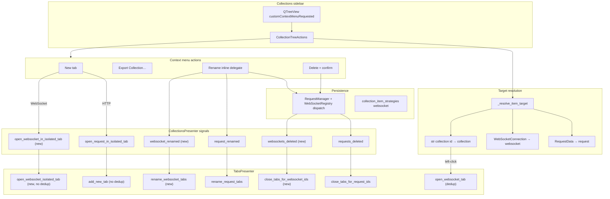
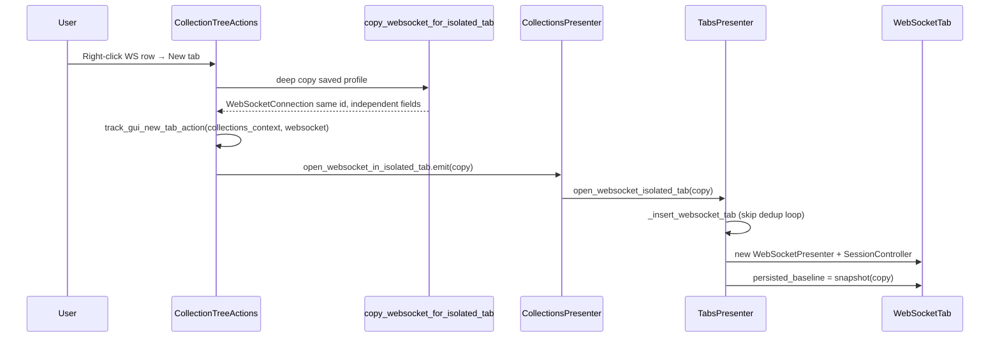
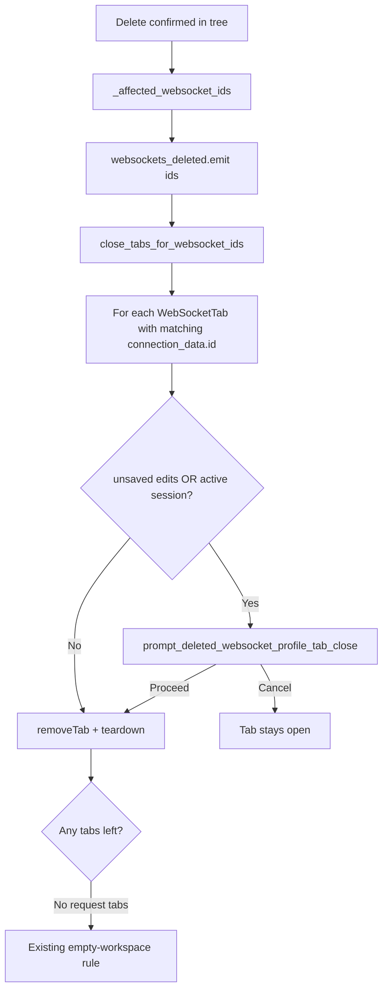

# PYPOST-1160: Collections WebSocket menu parity

Step 2 artifact for [PYPOST-1160](https://pypost.atlassian.net/browse/PYPOST-1160).
Turns the approved requirements in [`10-requirements.md`](10-requirements.md)
into a high-level architecture for WS-TM-4 under epic
[PYPOST-1155](https://pypost.atlassian.net/browse/PYPOST-1155).

**Parent architecture:** Reuse the collections menu and tab-isolation model from
[`ai-tasks/PYPOST-1156/20-architecture.md`](../PYPOST-1156/20-architecture.md).
WS-TM-2 ([PYPOST-1158](https://pypost.atlassian.net/browse/PYPOST-1158)) must
already ship blank WebSocket tabs, draft close prompts, and
`open_websocket_tab()` dedup for left-click / restore.

## Research

### R-1 HTTP collections context menu (reference implementation)

The sidebar context menu is owned by `CollectionTreeActions`
(`pypost/ui/presenters/collection_tree_actions.py`), wired from
`CollectionsPresenter` via `customContextMenuRequested`.

| Step | HTTP request today | Code path |
| --- | --- | --- |
| Resolve target | `_resolve_item_target()` returns `("request", id, label, RequestData)` | Lines 307–313 |
| Build menu | **New tab** (request only), **Export Collection…**, **Rename**, **Delete** | Lines 78–93 |
| **New tab** | `copy_request_for_isolated_tab(data)` → `emit_open_isolated_tab` | Lines 96–104 |
| Metrics | `track_gui_new_tab_action("collections_context")` — **no protocol label today** | Line 102 |
| **Rename** | Inline delegate → `request_manager.rename_collection_item` → `emit_request_renamed` | Lines 119–127, 209–267 |
| **Delete** | Confirm → `handle_delete` → persistence → `emit_requests_deleted` → tree remove | Lines 130–150, 269–305 |
| Tab wiring | `open_request_in_isolated_tab` → `TabsPresenter.add_new_tab` (always new tab) | `main_window_signals.py` L16 |
| Rename tabs | `request_renamed` → `TabsPresenter.rename_request_tabs` | `main_window_signals.py` L22 |
| Close tabs | `requests_deleted` → `TabsPresenter.close_tabs_for_request_ids` (silent close) | `main_window_signals.py` L23 |

WebSocket rows are already rendered (`CollectionsPresenter._make_websocket_item` →
`ws {name}` with `WebSocketConnection` in `Qt.UserRole`) and left-click opens via
`open_websocket_in_tab` → `TabsPresenter.open_websocket_tab()` (dedup by profile id).
The **context-menu gap** is entirely in `_resolve_item_target`: it returns
`(None, None, …)` for `WebSocketConnection`, so `show_context_menu` exits before
building a menu (lines 75–76).

Rename/delete **persistence strategies already exist** for `item_type="websocket"`
in `collection_item_strategies.py`, but `RequestManager.rename_collection_item` /
`delete_collection_item` build `ItemDispatchContext(request_manager=self)` **without**
`websocket_registry`, so websocket dispatch returns `False` in production today
(verified in `request_manager.py` L178, L237 vs
`tests/test_websocket_models_and_persistence.py` which passes registry explicitly).

Collection delete tab closure today only collects HTTP request ids:
`_affected_request_ids()` ignores `col.websockets` (lines 371–378).

### R-2 WebSocket tab lifecycle (existing, reuse)

| API | Behavior | PYPOST-1160 use |
| --- | --- | --- |
| `open_websocket_tab(conn)` | Dedup on `connection.id`; focus existing tab | **Left-click only** (FR-6 — unchanged) |
| `_insert_websocket_tab(conn)` | New `WebSocketPresenter` + `WebSocketSessionController` per tab | Isolated live sessions (FR-2.3) |
| `add_blank_websocket_tab()` | Fresh `WebSocketConnection()` UUID | Out of scope |
| `copy_request_for_isolated_tab()` | Deep copy, same request id | **Pattern to mirror** for WebSocket |
| `close_tabs_for_request_ids()` | Silent remove; HTTP blank fallback if empty | **Extend** for WebSocket + prompt (FR-5) |
| `is_websocket_draft_dirty()` | Compare editor vs factory defaults | Draft tabs only (PYPOST-1158); **not** saved-profile dirty |
| `WebSocketPresenter.state` | `SessionState` enum | Detect active connection for delete prompt (FR-5.3) |

Active session states for prompt purposes:
`CONNECTING`, `RECONNECTING`, `OPEN`, `CLOSING` (see
`websocket_presenter.py` L182, L428).

### R-3 Metrics (existing families)

| Event | Counter | WebSocket gap |
| --- | --- | --- |
| Collections **New tab** | `gui_new_tab_actions_total{source, protocol}` | HTTP menu calls `track_gui_new_tab_action("collections_context")` without `protocol=` → records `unknown`. FR-2.5 / NFR-3 require `protocol="websocket"`. |
| Rename | `gui_collection_rename_actions_total{item_type, status}` | Already parameterized by `item_type`; `"websocket"` works once menu resolves WS rows. |
| Delete | `gui_collection_delete_actions_total{item_type, status}` | Same as rename. |

### R-4 Rename tree label sync gap

`_sync_rename_tree_item` and `_canonical_item_label` handle `"request"` and
`"collection"` but not `"websocket"`. After rename, websocket rows must show
`ws {new_name}` (FR-3.2). `_find_collection_item` and incremental tree refresh
already support `item_type == "websocket"`.

### R-5 User documentation expectation

`doc/user/collections.md` documents **New tab** for requests and WebSocket
profiles. Fixing menu resolution makes that claim true (full doc pass remains
PYPOST-1163).

## Implementation Plan

### High-level approach

Extend the existing HTTP collections menu pipeline so WebSocket profiles follow
the same four-action menu, with three WebSocket-specific additions:

1. **Target resolution** — recognize `WebSocketConnection` in
   `_resolve_item_target`.
2. **Isolated tab open** — new copy helper + presenter API that **never dedups**
   (parallel to HTTP `open_request_in_isolated_tab`).
3. **Delete tab lifecycle** — close or prompt on tabs bound to deleted profile
   ids; extend collection-delete id collection to include websockets; wire new
   signals in `main_window_signals.py`.
4. **Persistence dispatch fix** — pass `WebSocketRegistry` into
   `ItemDispatchContext` so rename/delete actually persist.
5. **Saved-profile dirty baseline** — minimal baseline on `WebSocketTab` so
   FR-5.3 can distinguish unsaved editor edits from the collection copy (distinct
   from PYPOST-1158 draft-dirty vs factory defaults).

Left-click continues through `open_websocket_tab` (dedup). **New tab** always
uses the isolated path (FR-2.1 vs FR-6).

### Suggested file touch list

| File | Change |
| --- | --- |
| `pypost/core/websocket_persisted_fields.py` | Add `copy_websocket_for_isolated_tab`, `snapshot_websocket_persisted_fields`, `persisted_websocket_fields_equal` |
| `pypost/ui/presenters/collection_tree_actions.py` | Resolve websocket; menu **New tab** branch; websocket rename label sync; `_affected_websocket_ids`; fix metrics protocol |
| `pypost/core/request_manager.py` | Include `WebSocketRegistry` in dispatch context (lazy property or helper) |
| `pypost/ui/presenters/collections_presenter.py` | Signals: `open_websocket_in_isolated_tab`, `websocket_renamed`, `websockets_deleted` |
| `pypost/ui/main_window_signals.py` | Wire new signals to `TabsPresenter` |
| `pypost/ui/presenters/tabs_presenter.py` | `open_websocket_isolated_tab`, `rename_websocket_tabs`, `close_tabs_for_websocket_ids` |
| `pypost/ui/presenters/tab_dirty.py` | `is_websocket_saved_tab_dirty` (baseline-based) |
| `pypost/ui/collection_item_dialogs.py` | `prompt_deleted_websocket_profile_tab_close` (FR-5.3 wording) |
| `tests/test_collection_tree_actions.py` | Menu parity, new tab emit, rename/delete websocket |
| `tests/test_tabs_presenter.py` | Isolated open, close-with-prompt, rename tab titles |
| `tests/test_delete_open_tabs_integration.py` | Collection delete closes/prompts WS tabs |

Extract `close_tabs_for_websocket_ids` prompt logic to
`tabs_presenter_ws_close.py` if `tabs_presenter.py` approaches the PYPOST-1123
LOC cap (same pattern as PYPOST-1158 draft helpers).

### Mandatory — Failing Repro (Step 3)

Write these **red tests first** (sequencing: research → red → green in Step 4).
All use existing harness patterns (`tests/helpers/collections_tree.py`,
`build_isolated_tree_actions` extended with websocket fixtures).

| # | Test (proposed path) | Asserts (desired behavior) | Force failure without live deps |
| --- | --- | --- | --- |
| 1 | `tests/test_collection_tree_actions.py::test_websocket_menu_offers_new_tab_export_rename_delete` | Right-click WS row builds menu `["New tab", Export…, "Rename", "Delete"]` | `_resolve_item_target` returns `None` today → menu never shown |
| 2 | `tests/test_collection_tree_actions.py::test_websocket_new_tab_emits_isolated_open_with_protocol_metric` | Choosing **New tab** calls `copy_websocket_for_isolated_tab`, emits isolated signal, `track_gui_new_tab_action("collections_context", protocol="websocket")` | Mock metrics + emit callback |
| 3 | `tests/test_tabs_presenter.py::test_open_websocket_isolated_tab_always_inserts_second_tab` | Tab A open via `open_websocket_tab(conn)`; `open_websocket_isolated_tab(copy)` yields tab B ≠ A; both share `conn.id` | In-memory presenter + `WebSocketConnection(id="ws-1")` |
| 4 | `tests/test_tabs_presenter.py::test_open_websocket_isolated_tabs_have_independent_presenters` | Two isolated tabs from same profile id have distinct `presenter._session_id` / session controllers | No network; inspect presenter ids |
| 5 | `tests/test_tabs_presenter.py::test_rename_websocket_tabs_updates_labels` | After `rename_websocket_tabs("ws-1", "Renamed")`, all matching `WebSocketTab` header labels reflect new name | Insert tabs in presenter |
| 6 | `tests/test_tabs_presenter.py::test_close_tabs_for_websocket_ids_silent_when_clean_idle` | Idle, non-dirty saved tab closes without dialog | Patch confirm helper; assert not called |
| 7 | `tests/test_tabs_presenter.py::test_close_tabs_for_websocket_ids_prompts_when_connected` | Tab with `presenter.state == SessionState.OPEN` triggers delete prompt; cancel keeps tab | Mock `SessionState` on presenter |
| 8 | `tests/test_collection_tree_actions.py::test_delete_websocket_emits_websockets_deleted` | Confirmed delete emits websocket id list for tab closure | Fake request manager + ws registry in harness |
| 9 | `tests/test_collection_tree_actions.py::test_delete_collection_emits_all_websocket_ids` | Deleting collection with WS children emits all contained profile ids | Collection fixture with `websockets=[…]` |

Test 1 is the primary menu-parity repro (matches PYPOST-1156 Step 3 proposal for
WS-TM-4). Tests 6–7 cover the WebSocket-only delete safety requirement (FR-5.3).

## Architecture

### System module diagram



### Module responsibilities

| Module | Responsibility |
| --- | --- |
| `CollectionTreeActions` | Build parity menu for websocket rows; dispatch actions; collect affected websocket ids on delete; emit rename/delete/new-tab signals |
| `CollectionsPresenter` | Own tree model items (`ws {name}`); expose new signals; unchanged left-click dedup path |
| `websocket_persisted_fields` | Deep-copy policy for isolated WebSocket tabs (mirror `request_persisted_fields`) |
| `TabsPresenter` | Isolated WS tab factory; rename tab titles; close/prompt on deleted profile ids |
| `tab_dirty` | Saved-profile dirty detection via `persisted_baseline` (separate from draft-dirty) |
| `collection_item_dialogs` | Delete-profile tab-close confirmation copy (unsaved edits and/or live session) |
| `RequestManager` | Supply `WebSocketRegistry` to item dispatch so websocket rename/delete succeed |
| `main_window_signals` | Wire collections ↔ tabs cross-presenter events |
| `MetricsRegistry` | Record `protocol="websocket"` on collections-context new-tab |

### Main interfaces / APIs

```python
# pypost/core/websocket_persisted_fields.py
def copy_websocket_for_isolated_tab(data: WebSocketConnection) -> WebSocketConnection:
    """Deep copy for tab isolation; preserves saved profile id for tab binding."""

def snapshot_websocket_persisted_fields(data: WebSocketConnection) -> WebSocketConnection:
    """Baseline snapshot for saved-profile dirty detection."""

def persisted_websocket_fields_equal(a: WebSocketConnection, b: WebSocketConnection) -> bool: ...

# pypost/ui/presenters/tabs_presenter.py
def open_websocket_isolated_tab(
    self, connection: WebSocketConnection, *, save_state: bool = True
) -> WebSocketTab:
    """Always insert a new tab; never focus-dedup by profile id."""

def rename_websocket_tabs(self, ws_id: str, new_name: str) -> None: ...

def close_tabs_for_websocket_ids(
    self, ws_ids: list[str], *, prompt: PromptCloseFn | None = None
) -> None: ...

# pypost/ui/presenters/collection_tree_actions.py — extended resolve
def _resolve_item_target(self, item) -> tuple[str | None, str | None, str, object | None]:
    # ("websocket", ws.id, f"ws {ws.name}", ws) for WebSocketConnection

# pypost/ui/presenters/collections_presenter.py — new signals
open_websocket_in_isolated_tab = Signal(object)  # WebSocketConnection deep copy
websocket_renamed = Signal(str, str)             # (ws_id, new_name)
websockets_deleted = Signal(list)               # ws ids whose tabs should close

# pypost/ui/collection_item_dialogs.py
def prompt_deleted_websocket_profile_tab_close(
    parent: QWidget,
    tab_title: str,
    *,
    has_unsaved_edits: bool,
    has_active_connection: bool,
) -> bool:
    """Return True to proceed (close tab / end session); False to keep tab."""
```

`open_websocket_tab(connection)` signature and dedup semantics stay unchanged for
left-click and session restore (FR-6).

### New tab — isolated copy flow



Each `_insert_websocket_tab` call constructs a fresh `WebSocketPresenter` with its
own `WebSocketSessionController` and unique `sess_*` id, satisfying FR-2.3 without
shared connection state across tabs.

### Delete — tab close / prompt flow



**Unsaved edits:** `is_websocket_saved_tab_dirty(tab)` — editor snapshot differs
from `tab.persisted_baseline` using `persisted_websocket_fields_equal`.

**Active session:** `tab.presenter.state in {CONNECTING, RECONNECTING, OPEN, CLOSING}`.

HTTP delete continues silent close via `close_tabs_for_request_ids` (out of scope
to add WS-style prompts for HTTP).

### Rename flow

1. User chooses **Rename** → existing inline delegate (already type-agnostic).
2. `handle_rename_committed` → `rename_collection_item(..., "websocket", ...)`
   with fixed dispatch context.
3. On success: emit `websocket_renamed(ws_id, new_name)` (parallel to HTTP).
4. Tree sync: `_sync_rename_tree_item` sets `ws {new_name}` for websocket type;
   refresh `Qt.UserRole` data from registry.
5. `TabsPresenter.rename_websocket_tabs` updates `connection_data.name` and tab
   labels for all tabs sharing `ws_id` (including multiple isolated copies).

### Architectural patterns

| Pattern | Application |
| --- | --- |
| **Parallel signal pairs** | HTTP vs WebSocket isolated open and tab lifecycle signals keep types explicit without overloading `requests_deleted` |
| **Copy policy module** | `websocket_persisted_fields` mirrors `request_persisted_fields` — single place for isolation semantics |
| **Strategy dispatch** | Existing `collection_item_strategies["websocket"]`; fix context wiring only |
| **Presenter coordination** | `TabsPresenter` owns tab insert/close; `CollectionTreeActions` owns menu + persistence orchestration |
| **Dedup vs isolate entry points** | `open_websocket_tab` (focus) vs `open_websocket_isolated_tab` (always new) — same split as HTTP left-click vs **New tab** |

### Out of scope (unchanged)

- Save / Save As ([PYPOST-1161](https://pypost.atlassian.net/browse/PYPOST-1161))
- HTTP delete tab behavior (no session prompt)
- Left-click dedup (`open_websocket_tab`)
- Blank draft tab creation ([PYPOST-1158](https://pypost.atlassian.net/browse/PYPOST-1158))
- User documentation ([PYPOST-1163](https://pypost.atlassian.net/browse/PYPOST-1163))

## Q&A

| Question | Answer |
| --- | --- |
| Why new signals instead of renaming `requests_deleted`? | Minimize regression risk; HTTP wiring stays intact. Parallel `websockets_deleted` / `websocket_renamed` mirrors the existing HTTP pair. |
| Does isolated copy get a new profile id? | No. Same saved `id` for tab binding and open-tabs persistence; deep-copied **fields** and **session** are independent (FR-2.2, FR-2.3). |
| Why fix `RequestManager` dispatch context? | Websocket strategies require `WebSocketRegistry`; without it rename/delete return `False` even after menu resolution. |
| How is dirty detected for saved profiles vs drafts? | Drafts: `is_websocket_draft_dirty` vs factory (PYPOST-1158). Saved profiles: new baseline on tab open + `is_websocket_saved_tab_dirty` for delete prompt (FR-5.3). |
| Does **Export Collection…** need new logic? | No. Once `_resolve_item_target` returns a valid target, existing export branch passes `index` to `export_collection` — same as request rows (FR-1.2). |
| Module size pressure? | Extract websocket delete-close helpers if `tabs_presenter.py` nears cap; keep menu changes in `collection_tree_actions.py`. |

## References

- [`10-requirements.md`](10-requirements.md) — FR-1…FR-6, NFR-1…NFR-4
- [`ai-tasks/PYPOST-1156/20-architecture.md`](../PYPOST-1156/20-architecture.md) — WS-TM-4 notes, child-story breakdown
- [`ai-tasks/PYPOST-1158/20-architecture.md`](../PYPOST-1158/20-architecture.md) — draft tab lifecycle, dedup vs blank
- `pypost/ui/presenters/collection_tree_actions.py` — HTTP menu reference
- `pypost/ui/presenters/tabs_presenter.py` — tab open/close/rename
- `pypost/core/websocket_persisted_fields.py`, `pypost/core/request_persisted_fields.py`
- `doc/user/collections.md` — user expectation for WebSocket **New tab**
