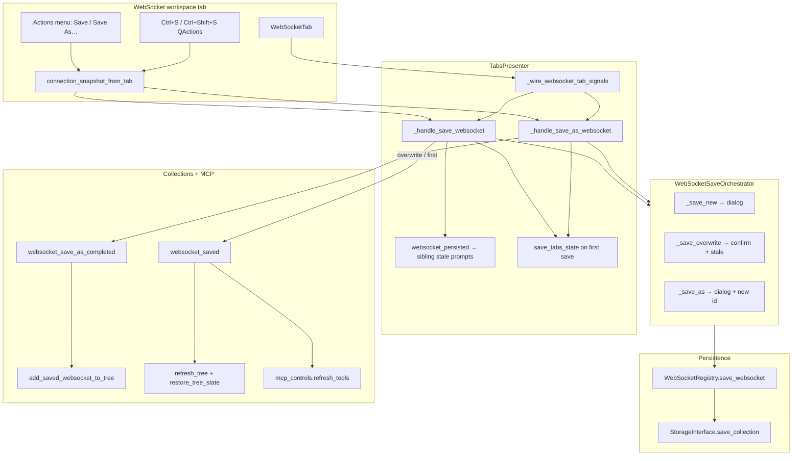
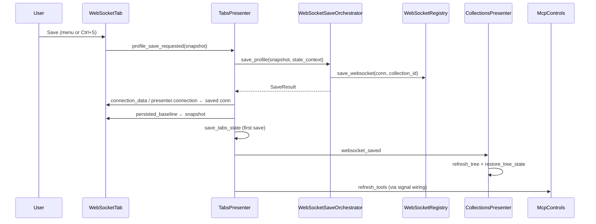

# PYPOST-1161: WebSocket save-to-collection flow

Step 2 artifact for [PYPOST-1161](https://pypost.atlassian.net/browse/PYPOST-1161) (WS-TM-5).
Turns the approved requirements in [`10-requirements.md`](10-requirements.md) into a
high-level architecture for save / save-as parity with HTTP under epic
[PYPOST-1155](https://pypost.atlassian.net/browse/PYPOST-1155).

**Parent architecture:** Epic decomposition and `WebSocketSaveOrchestrator` pattern in
[`ai-tasks/PYPOST-1156/20-architecture.md`](../PYPOST-1156/20-architecture.md).
**Dependencies:** WS-TM-2 ([PYPOST-1158](https://pypost.atlassian.net/browse/PYPOST-1158))
blank draft tabs and open-tabs filtering; WS-TM-4
([PYPOST-1160](https://pypost.atlassian.net/browse/PYPOST-1160)) isolated tab copies
and `websocket_persisted_fields` baselines.

## Research

### R-1 HTTP save flow (authoritative reference)

HTTP save is a three-layer pipeline: **editor entry points** → **TabsPresenter
handlers** → **RequestSaveOrchestrator** → **RequestManager** persistence, with
**CollectionsPresenter** tree updates via signals.

| Layer | HTTP today | Key code |
| --- | --- | --- |
| **Actions menu + shortcuts** | `RequestWidget` **Actions** popup: Save, Save As…, Copy cURL; `Ctrl+S` / `Ctrl+Shift+S` as widget `QAction`s | `pypost/ui/widgets/request_editor.py` L109–123, L413–457 |
| **Tab signals** | `save_requested` / `save_as_requested` → `TabsPresenter._wire_tab_signals` | `tabs_presenter.py` L556–560 |
| **Save orchestration** | `RequestSaveOrchestrator.save_request` / `save_as_request` — dialog, overwrite confirm, stale check, metrics | `pypost/ui/request_save_orchestrator.py` |
| **Persistence** | `RequestManager.save_request` + `find_request` for overwrite path | `pypost/core/request_manager.py` |
| **Save dialog** | `SaveRequestDialog` — profile name, collection picker, new collection | `pypost/ui/dialogs/save_dialog.py` |
| **Overwrite prompts** | `confirm_overwrite_request` when `settings.confirm_overwrite_request`; `confirm_overwrite_newer_saved_version` for stale disk | `collection_item_dialogs.py`; orchestrator L129–148, L206–218 |
| **Stale sibling tabs** | `request_persisted` → `_offer_stale_tab_resolution` on other tabs sharing id | `tabs_presenter.py` L667–705 |
| **Post-save tab state** | `persisted_baseline`, `stale_persisted=False`, tab title sync | `tabs_presenter.py` L715–751 |
| **Tree update** | Overwrite / first save: `request_saved` → `refresh_tree` + `restore_tree_state` + MCP refresh; Save As: `request_save_as_completed` → `add_saved_request_to_tree` (incremental) | `main_window_signals.py` L38–42 |
| **Session restore** | First save calls `save_tabs_state()` so id enters `StateManager` open tabs | `tabs_presenter.py` L750–751 |
| **Telemetry** | `track_gui_save_action(source)` / `track_gui_save_as_action(source)` on editor; orchestrator adds `overwrite` / `new` on overwrite/first-save paths | `metrics_registry.py` L295–299 |

WebSocket persistence **already exists** at the storage layer:
`WebSocketRegistry.save_websocket(conn, collection_id)` updates collection
`websockets`, persists via storage, and maintains the O(1) index
(`pypost/core/websocket_registry.py` L51–73). Rename/delete and sidebar display
(`ws {name}`) were delivered in PYPOST-1160. The gap is exclusively the
**editor-to-registry save path** and the **signal wiring** that HTTP already has.

### R-2 WebSocket tab state today

| Area | Current state | Architectural impact |
| --- | --- | --- |
| `WebSocketTab` chrome | Connect button + state badge only — **no Actions menu**, no save signals | Add Save / Save As entry points (FR-1) |
| `WebSocketPresenter.connection_saved` | Emitted from composer / presets panel for **in-tab preset** saves | **Do not** wire to profile save — different semantic (requirements Q&A) |
| `persisted_baseline` on `WebSocketTab` | Set when opening collection-backed tabs (`_insert_websocket_tab` L239–240) | Reuse for stale overwrite + sibling tab detection |
| `stale_persisted` | Only on `RequestTab` today | Add to `WebSocketTab` for stale-version protection (FR-3.4) |
| `tab_dirty._connection_from_websocket_tab` | Builds editor snapshot; presets/sequences from `connection_data` / presenter | Centralize as `connection_snapshot_from_tab` for save + dirty (must read live `presenter.connection` presets) |
| `websocket_id_is_saved` | `WebSocketRegistry.find_websocket` | Orchestrator “already in collection?” check mirrors `find_request` |
| `collect_persistable_open_tab_ids` | Omits draft WS ids until saved | First save must call `save_tabs_state()` (FR-5.5) |
| `main_window_signals` | No WebSocket save signals | Wire `websocket_saved` / `websocket_save_as_completed` (epic R-2 gap) |
| `CollectionsPresenter` | `add_saved_request_to_tree` only | Add `add_saved_websocket_to_tree` (mirror `_make_websocket_item`) |
| `TabsPresenter` size | Already large; PYPOST-1158 extracted draft helpers | Extract WS save handlers to `tabs_presenter_ws_save.py` if LOC cap bites |

### R-3 Save dialog reuse

`SaveRequestDialog` is HTTP-labeled (“Save Request”, “Request Name:”) but functionally
generic: name field + collection combo + new-collection branch + validation helpers
(`show_save_request_name_required`, `show_save_collection_name_required`). Parameterizing
labels (or a thin `SaveCollectionItemDialog` wrapper) avoids duplicating validation
logic while matching WebSocket UX copy in requirements (profile name, same flow as HTTP).

### R-4 Metrics and hotkeys scope boundary

Save metrics use `gui_save_actions_total{source=…}` and
`gui_save_as_actions_total{source=…}` with **no protocol label** (unlike
`gui_new_tab_actions_total{source, protocol}`). NFR-4 requires the **same families**
with source attribution (`menu`, `shortcut`, `overwrite`, `new`) — no new counter
required.

Requirements place **Save** / **Save As** shortcuts in PYPOST-1161; PYPOST-1162
covers Connect, Send, Focus URL, and Help → Hotkeys section registration. Implement
shortcuts as `QAction`s on `WebSocketTab` (same pattern as `RequestWidget`) with
`tag_action(section="WebSocket Session", …)` so hotkey help is accurate even before
WS-TM-6 polish.

### R-5 Coordination with PYPOST-1162

Both stories may touch WebSocket Session hotkeys. **Recommended split:** PYPOST-1161
owns Save / Save As actions, signals, and orchestration; PYPOST-1162 owns remaining
session shortcuts and Help registration. Widget-level `QAction`s on the focused
`WebSocketTab` satisfy FR-1.2 without waiting for global `MainWindow` dispatch.

## Implementation Plan

### High-level approach

Mirror the HTTP save pipeline with a **WebSocketSaveOrchestrator** and parallel
**TabsPresenter** handlers. Do not route WebSocket profile save through
`RequestSaveOrchestrator` or `RequestManager.save_request` — WebSocket profiles live
under `Collection.websockets` and are indexed by `WebSocketRegistry`.

```
WebSocketTab (Actions + Ctrl+S)
    → TabsPresenter._handle_save_websocket
    → WebSocketSaveOrchestrator
    → WebSocketRegistry.save_websocket
    → TabsPresenter signals
    → CollectionsPresenter tree + MCP refresh + save_tabs_state
```

### Suggested implementation order

1. **`connection_snapshot_from_tab`** — shared snapshot helper (extend
   `websocket_persisted_fields` or `tab_dirty`).
2. **`WebSocketSaveOrchestrator`** — unit-tested without full GUI.
3. **`WebSocketTab` entry points** — Actions menu, signals, shortcuts, metrics.
4. **`TabsPresenter` wiring** — handlers, `websocket_persisted` sibling flow,
   `stale_persisted` on `WebSocketTab`.
5. **`CollectionsPresenter.add_saved_websocket_to_tree`** + signal wiring in
   `main_window_signals.py`.
6. **Integration tests** — menu/shortcut → tree row + tab identity (HTTP
   `test_save_flow_integration.py` pattern).

### Suggested file touch list

| File | Change |
| --- | --- |
| `pypost/ui/websocket_save_orchestrator.py` (new) | Save / save-as / overwrite / stale logic via `WebSocketRegistry` |
| `pypost/core/websocket_persisted_fields.py` | `connection_snapshot_from_tab(tab)` (or adjacent module) |
| `pypost/ui/widgets/websocket/websocket_tab.py` | Actions menu, save signals, shortcuts, hotkey tags |
| `pypost/ui/presenters/tabs_presenter.py` | Wire WS tab signals; emit `websocket_saved`, `websocket_save_as_completed`, `websocket_persisted` |
| `pypost/ui/presenters/tabs_presenter_ws_save.py` (new, if needed) | Handler bodies extracted for LOC cap |
| `pypost/ui/presenters/collections_presenter.py` | `add_saved_websocket_to_tree` |
| `pypost/ui/main_window_signals.py` | Wire WS save signals → tree / MCP (mirror HTTP L38–42) |
| `pypost/ui/dialogs/save_dialog.py` | Optional label parameterization for WebSocket copy |
| `pypost/ui/presenters/tab_dirty.py` | Delegate snapshot helper to shared function |
| `tests/test_websocket_save_orchestrator.py` (new) | Orchestrator unit tests |
| `tests/test_tabs_presenter.py` | WS save / save-as handler tests |
| `tests/test_save_flow_integration.py` or `test_websocket_save_flow_integration.py` | End-to-end menu/shortcut wiring |

**Out of scope (unchanged):** HTTP save paths, preset-level `connection_saved` in
composer, user doc files (PYPOST-1163).

### Mandatory — Failing Repro (Step 3)

Write these **red tests first** (sequencing: research → red → green in Step 4).
Use existing harness patterns (`FakeRequestManager` extended for websockets,
`WebSocketRegistry` in fake storage, `_mock_save_dialog` from
`tests/test_request_save_orchestrator.py`).

| # | Test (proposed path) | Asserts (desired behavior) | Force failure without live deps |
| --- | --- | --- | --- |
| 1 | `tests/test_websocket_save_orchestrator.py::test_save_draft_to_collection` | Draft `WebSocketConnection` not in registry → dialog → `save_websocket` called; returns `CREATED_NEW` with name + collection_id | Mock `SaveRequestDialog`; fake registry |
| 2 | `tests/test_websocket_save_orchestrator.py::test_save_overwrite_existing_profile` | Saved id → overwrite path; `confirm_overwrite_request` when setting enabled; `SaveAction.OVERWRITE` | Pre-index profile in fake registry |
| 3 | `tests/test_websocket_save_orchestrator.py::test_save_stale_cancelled` | `StaleCheckContext` with `stale_persisted=True` and divergent disk → stale prompt; cancel → no persistence | Mock `confirm_overwrite_newer_saved_version` |
| 4 | `tests/test_websocket_save_orchestrator.py::test_save_as_assigns_new_id` | Save As → new uuid, new name, original unchanged in registry | Mirror `test_save_as_assigns_new_request_id` |
| 5 | `tests/test_tabs_presenter.py::test_websocket_save_emits_websocket_saved` | Handler completes → `websocket_saved` emitted, `save_tabs_state` called on first save | Patch orchestrator |
| 6 | `tests/test_tabs_presenter.py::test_websocket_save_as_emits_save_as_completed` | Save As → `websocket_save_as_completed(conn, collection_id)` not full refresh-only path | Signal capture |
| 7 | `tests/test_websocket_save_flow_integration.py::test_websocket_save_menu_updates_tab_identity` | Blank draft tab → Actions Save → tab `connection_data.id` matches persisted profile, title updated | Real `WebSocketTab` + mocked dialog |
| 8 | `tests/test_websocket_save_flow_integration.py::test_websocket_ctrl_s_triggers_save` | `Ctrl+S` on focused WS tab reaches save handler (FR-1.2) | `QTest.keySequence` or action trigger |
| 9 | `tests/test_collections_presenter.py` or tree helper | `add_saved_websocket_to_tree` appends `ws {name}` under target collection | In-memory model |

Test 1 is the primary repro (matches PYPOST-1156 Step 3 proposal for WS-TM-5).
Tests 7–8 cover the user-visible gap: documented shortcuts and Actions menu today
do not persist profiles.

## Architecture

### System module diagram



### Module responsibilities

| Module | Responsibility |
| --- | --- |
| `WebSocketTab` | Actions menu with Save / Save As…; emit `profile_save_requested` / `profile_save_as_requested` with live snapshot; widget-level shortcuts and hotkey tags |
| `connection_snapshot_from_tab` | Single source for editor-visible persisted fields (URL, handshake, presets, sequences, MCP fields) at save time (FR-1.3) |
| `WebSocketSaveOrchestrator` | Dialog flow, overwrite + stale prompts, `WebSocketRegistry` persistence, collection expansion, save metrics |
| `TabsPresenter` | Route tab signals to orchestrator; apply save results to tab + presenter; emit cross-presenter signals; sibling stale-tab handling |
| `WebSocketRegistry` | `find_websocket` / `save_websocket` (existing — no schema change) |
| `CollectionsPresenter` | Incremental `add_saved_websocket_to_tree`; existing `refresh_tree` for overwrite/first-save path |
| `main_window_signals` | Wire WebSocket save signals parallel to HTTP L38–42 |
| `SaveRequestDialog` (parameterized) | Shared name + collection picker for first save and Save As |

### Main interfaces / APIs

```python
# pypost/core/websocket_persisted_fields.py (or tab_dirty delegate)
def connection_snapshot_from_tab(tab: WebSocketTab) -> WebSocketConnection:
    """Editor-visible persisted fields at save time; reads presenter.connection for presets/sequences."""

# pypost/ui/websocket_save_orchestrator.py (new)
class WebSocketSaveOrchestrator:
    def save_profile(
        self,
        connection: WebSocketConnection,
        parent: QWidget,
        *,
        stale_context: StaleCheckContext | None = None,
    ) -> SaveResult: ...

    def save_as_profile(
        self, connection: WebSocketConnection, parent: QWidget
    ) -> SaveResult: ...

# Reuse from request_save_orchestrator.py:
# SaveAction, SaveResult, StaleCheckContext

# pypost/ui/widgets/websocket/websocket_tab.py
class WebSocketTab(QWidget):
    profile_save_requested = Signal(object)      # WebSocketConnection snapshot
    profile_save_as_requested = Signal(object)
    persisted_baseline: WebSocketConnection | None
    stale_persisted: bool  # new field

# pypost/ui/presenters/tabs_presenter.py — new signals
websocket_saved = Signal()
websocket_save_as_completed = Signal(object, str)  # WebSocketConnection, collection_id
websocket_persisted = Signal(str, object, object)  # ws_id, snapshot, source_tab

# pypost/ui/presenters/collections_presenter.py
def add_saved_websocket_to_tree(
    self, connection: WebSocketConnection, collection_id: str
) -> bool: ...
```

**Naming note:** Use `profile_save_*` signals on `WebSocketTab` to avoid collision
with `WebSocketPresenter.connection_saved` (preset-level, already emitted from
composer / presets panel).

### Save vs Save As — behavioral contract

| User action | Tab state | Orchestrator path | Tab identity after success | Tree update |
| --- | --- | --- | --- | --- |
| **Save** | Draft (not in registry) | `_save_new` + dialog | Same id (draft uuid) becomes collection-backed; name from dialog | `websocket_saved` → refresh |
| **Save** | Saved profile (in registry) | `_save_overwrite` + optional confirms | Same id; fields + title synced | `websocket_saved` → refresh |
| **Save** | Isolated copy (PYPOST-1160) | `_save_overwrite` on backing id | Same id as collection item (FR-7.1) | `websocket_saved` → refresh |
| **Save As…** | Any | `_save_as` + dialog + **new uuid** | Tab adopts **new** id + name (FR-4.3) | `websocket_save_as_completed` → incremental row |
| **Cancel** | Any | `SaveAction.CANCELLED` | No change | No signal |

Overwrite confirmation reuses `AppSettings.confirm_overwrite_request` (single user
preference per requirements). Stale-version protection reuses
`confirm_overwrite_newer_saved_version` and `StaleCheckContext` semantics from HTTP.

### Post-save alignment sequence



Save As omits full `refresh_tree` on the happy path — incremental
`add_saved_websocket_to_tree` only (HTTP parity, NFR-5).

### Architectural patterns

| Pattern | Application |
| --- | --- |
| **Orchestrator** | `WebSocketSaveOrchestrator` parallels `RequestSaveOrchestrator` — dialogs + policy in one place |
| **Presenter coordination** | `TabsPresenter` owns tab identity, baselines, and cross-tab stale prompts |
| **Registry / index** | `WebSocketRegistry` is the persistence and lookup API (already used by collections CRUD) |
| **Signal bus** | `main_window_signals.wire_presenter_signals` connects save outcomes to tree + MCP |
| **Snapshot baseline** | `persisted_baseline` + `snapshot_websocket_persisted_fields` for dirty and stale detection |
| **Incremental tree update** | Save As uses `add_saved_websocket_to_tree`; overwrite uses existing incremental refresh if possible, else `refresh_tree` (match HTTP) |

### HTTP regression guard

All changes are additive on the WebSocket path. `RequestSaveOrchestrator`,
`RequestWidget` save handlers, and HTTP signal wiring remain untouched (DoD #14).

## Q&A

- **Why a separate orchestrator instead of generalizing `RequestSaveOrchestrator`?**
  Persistence APIs differ (`RequestManager.save_request` vs
  `WebSocketRegistry.save_websocket`), field models differ (`RequestData` vs
  `WebSocketConnection`), and stale equality uses
  `persisted_websocket_fields_equal`. Shared pieces: `SaveAction`, `SaveResult`,
  `StaleCheckContext`, dialog, confirm helpers, metrics families.

- **Does preset `connection_saved` on `WebSocketPresenter` participate in profile save?**
  No. That signal means “in-tab preset/sequence mutated.” Profile save uses new
  `profile_save_*` tab signals and must not subscribe to `connection_saved`.

- **How is profile name chosen on first save?**
  Same as HTTP: user enters name in save dialog. Tab title updates from saved
  `connection.name` after success (FR-5.1). Draft default “New WebSocket” is not
  persisted until the user confirms.

- **Does Save on an isolated New tab copy create a new collection item?**
  No — **Save** overwrites the backing profile (same id). **Save As…** creates a
  new item (FR-7.1–7.2).

- **What triggers MCP tool refresh?**
  `websocket_saved` and collection change signals wired to
  `mcp_controls.refresh_tools` — same practical outcome as HTTP `request_saved`
  (FR-6.1).

- **Overlap with PYPOST-1162 hotkeys?**
  PYPOST-1161 delivers Save / Save As shortcuts and Actions entries. PYPOST-1162
  delivers the rest of the WebSocket Session hotkey section and Help registration.
  Widget `QAction`s on `WebSocketTab` are sufficient for Save in this story.
