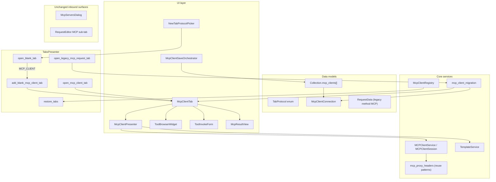
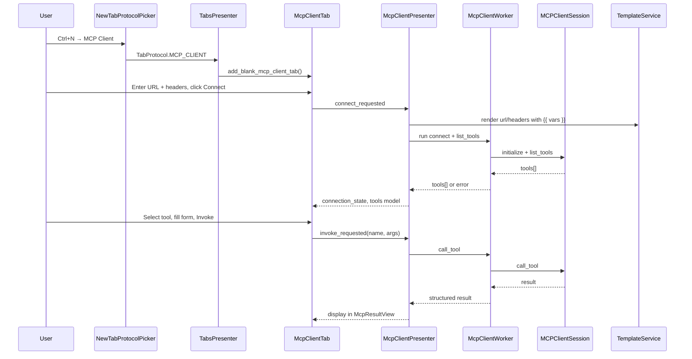

# PYPOST-1164: Research and decompose MCP client tab mode UX — architecture

Step 2 artifact for PYPOST-1164. Turns the approved requirements in
[`10-requirements.md`](10-requirements.md) into a high-level architecture, UX decision,
component interaction model, child-story breakdown for Epic [PYPOST-1155](https://pypost.atlassian.net/browse/PYPOST-1155),
and a failing-repro plan for Step 3.

**Scope note:** PYPOST-1164 is a **research task** — it ships documents and Jira decomposition only.
Implementation belongs to the child stories (MCP-TM-1 … MCP-TM-8); each runs its own Top-Down cycle.

## Research

### R-1 Competitive MCP client UX patterns

| Product | Entry / creation | Connect → discover → invoke | Relevance to PyPost |
| --- | --- | --- | --- |
| **Postman MCP request** | **New → MCP** alongside HTTP, WebSocket, GraphQL ([create docs](https://learning.postman.com/docs/use/send-requests/protocols/mcp-requests/create/)); not an HTTP method variant | Transport picker (STDIO / HTTP); **Load Capabilities** connects; **Tools / Resources / Prompts** tabs; schema-generated JSON for invoke; **Run** sends; save/share like any request type ([interact docs](https://learning.postman.com/docs/use/send-requests/protocols/mcp-requests/interact.md)) | Closest product analog — dedicated editor, explicit connect, capability tabs, collections parity |
| **MCP Inspector** (official) | `npx @modelcontextprotocol/inspector` — web UI (default), CLI, TUI ([inspector docs](https://modelcontextprotocol.io/docs/tools/inspector)) | Per-server connect; **Tools** tab with schema-rendered forms; **Resources** read/subscribe; **Prompts** preview; **Protocol** transcript for raw JSON-RPC ([web UI docs](https://modelcontextprotocol.io/docs/draft/tools/inspector/web)) | Gold standard for tool invoke loop and power-user protocol trace (stretch MCP-TM-11) |
| **MCP Workbench** | CLI + browser inspector | Protocol log, contract testing | Reinforces trace/logging as expected for debugging (stretch) |
| **ProtoMCP** | Browser Postman-style | Multi-server, schema forms, live trace | Validates schema-driven forms + trace as baseline expectations |

**Common patterns to adopt (v1 minimum):**

1. **Dedicated request/editor type** — not an HTTP method dropdown entry.
2. **Explicit Connect** — user action triggers initialize + capability discovery; visible connected/disconnected state.
3. **Tool browser** — `list_tools` results browsable by name/description before invoke.
4. **Schema-guided argument UI** — input schema drives form fields; raw JSON fallback for edge schemas.
5. **Separate panes** — connection bar, tool list, invocation form, structured result (protocol trace deferred).
6. **Environment-resolved outbound headers** — auth parity with HTTP and MCP proxy upstream headers.
7. **Clear labeling** — "MCP Client" (outbound) vs "MCP Servers" (inbound admin) vs "Expose as MCP Tool" (inbound authoring).

**v1 out of scope (competitive parity gaps):** STDIO transport (Postman), prompts/resources panes (Postman, Inspector), protocol transcript (Inspector), SSE upstream client (Postman auto-negotiates HTTP variants; PyPost proxy supports SSE upstream but `MCPClientService` does not).

### R-2 Current codebase constraints (repo facts)

| Area | Current state | Architectural impact |
| --- | --- | --- |
| `RequestEditor` method combo | Includes **MCP** alongside GET/POST/… (`request_editor.py` L97); body placeholder encodes list/call JSON convention (L256–259) | Must be **removed** (MCP-TM-6); outbound path moves to dedicated editor |
| `RequestEditor` **MCP** sub-tab + **MCP Tool** checkbox | Inbound tool exposure (`expose_as_mcp`, `mcp_params`) — unrelated to outbound client | Stays on HTTP editor; naming collision resolved by retiring method **MCP**, not merging sub-tabs |
| `RequestService._execute_mcp` | Renders URL, headers, body from templates but passes **only URL** to `MCPClientService.run` (`request_service.py` L102–134) | **Critical auth gap** — headers must flow to client service (MCP-TM-5); entire path retired after migration |
| `MCPClientService` | Streamable HTTP only; new session per `run()`; no `headers` param; 25s total timeout (`mcp_client_service.py`) | Extend with headers + optional session holder; SSE upstream is follow-up (MCP-TM-9) |
| `MCPProxyServerImpl._connect_upstream` | Resolves templated headers via `resolve_proxy_headers`; supports streamable HTTP **and** SSE (`mcp_proxy_server_impl.py`) | Reuse header resolution/sanitization patterns for outbound client; do not couple UI to proxy runtime |
| `TabsPresenter.handle_new_tab` | Always `add_new_tab()` → HTTP `RequestTab`; metrics `track_gui_new_tab_action(source)` only (`tabs_presenter.py` L387–391) | Depends on WS-TM-1 picker; add `MCP_CLIENT` to `TabProtocol` and `open_blank_tab` routing |
| `TabsPresenter.open_websocket_tab` | Deduplicates by `connection.id`; no blank-draft equivalent today | Model `add_blank_mcp_client_tab()` after WS-TM-2 pattern; draft excluded from `save_tabs_state` |
| `TabsPresenter.restore_tabs` | Resolves `websocket` and `request` via `WebSocketRegistry.find_item` | Extend registry/index for `mcp_client` profiles; `method: "MCP"` requests open via migration adapter (MCP-TM-6) |
| `TabsPresenter._current_tab` | Returns `RequestTab \| None` only | Hotkey routing must gain tab-kind awareness (coordinate with WS-TM-6 / MCP follow-up) |
| `Collection.websockets` | `WebSocketConnection` peer items in collection JSON (`models.py` L96) | Add `mcp_clients: List[McpClientConnection]` (or equivalent) for saved profiles (MCP-TM-7) |
| `collection_tree_actions._resolve_item_target` | Resolves `RequestData` and collection `str` only (L307–313) | Blocks MCP Client New tab / rename / delete (MCP-TM-7) |
| `McpServersDialog` | Inbound server lifecycle; **Tools…** shows local inbound catalog only | Unchanged; docs must disambiguate from outbound client tab |
| `McpToolsOverviewDialog` | Lists tools PyPost **exposes**, not remote server tools | Do not reuse for outbound tool browser — new remote-tool list widget |
| `examples/collections/mcp.json` | `method: "MCP"` request "List Tools" at `http://127.0.0.1:1080/mcp` | Migration target for MCP-TM-6 convert-on-open |
| `TabProtocol` / protocol picker | **Not in repo yet** — planned by [PYPOST-1157](https://pypost.atlassian.net/browse/PYPOST-1157) (WS-TM-1) | MCP-TM-1 extends picker; must not fork a second creation path |

### R-3 Metrics extension

`track_gui_new_tab_action(source)` today records `source` only (`metrics_registry.py` L276–278). WS-TM-1 adds `protocol` label (`http` \| `websocket`). MCP-TM-1 extends with `mcp_client`. Outbound operations should use **new** counters (e.g. `mcp_client_connect_total`, `mcp_client_list_tools_total`, `mcp_client_call_tool_total`) — distinct from inbound `mcp_requests_received_total` (NFR-5).

## Implementation Plan

### High-level approach

Introduce **MCP Client** as a third workspace editor peer to HTTP `RequestTab` and `WebSocketTab`, routed through the **same blank-tab protocol picker** delivered by WS-TM-1 (PYPOST-1157). A new `McpClientConnection` model, `McpClientTab`, and `McpClientPresenter` own outbound connect → list_tools → call_tool UX. Extend `MCPClientService` (or a thin `MCPClientSession` wrapper) to accept environment-resolved headers and optionally hold a tab-scoped session across Connect/Invoke. Retire HTTP method **MCP** and convert legacy collection items on open.

Inbound surfaces (**MCP Servers…**, **MCP Tool** checkbox, HTTP/WS **MCP** sub-tabs) remain unchanged.

### Suggested implementation order

```
WS-TM-1 (PYPOST-1157) — protocol picker + open_blank_tab API  [hard dependency]
    └── MCP-TM-1 (third picker item + metrics)
            └── MCP-TM-2 (blank MCP Client draft shell)
                    ├── MCP-TM-5 (headers + service extension)  ─┐
                    ├── MCP-TM-3 (list_tools browser)              ├── MCP-TM-5 before MCP-TM-3
                    │       └── MCP-TM-4 (call_tool + response)  ┘
                    ├── MCP-TM-6 (migrate/remove HTTP method MCP)
                    └── MCP-TM-7 (collections save/open + context menu)
                            └── MCP-TM-8 (user docs — last)
```

MCP-TM-5 can land in parallel with MCP-TM-3 once MCP-TM-2 exists; Connect in MCP-TM-3 should use header-aware service from MCP-TM-5.

### Mandatory — Failing Repro (Step 3 for PYPOST-1164)

**N/A — no behavioral change in PYPOST-1164.**

PYPOST-1164 is a research and decomposition task. Step 3 (failing repro) does not apply to this
issue. Red tests belong in the **child implementation stories**, written at the start of each
story's own Top-Down Step 3 (see table below).

## Architecture

### UX options for blank-tab protocol selection (HTTP | WebSocket | MCP Client)

Requirements recommend **Option A** — extend the WS-TM-1 popup menu. Step 2 confirms and details.

#### Option A — Extend `NewTabProtocolPicker` popup menu (recommended)

`Ctrl+N`, tab-bar `+`, and close-last-tab fallback open the existing `QMenu` with **three** items:

1. **HTTP Request** (default, first)
2. **WebSocket**
3. **MCP Client**

| Pros | Cons |
| --- | --- |
| Single entry point; matches Postman "New → type" pattern | Three-item menu slightly denser than two |
| Reuses WS-TM-1 infrastructure — no second picker | MCP-TM-1 blocked until WS-TM-1 ships |
| HTTP default preserved (first item / Enter) | Keyboard mnemonics need review for third item |
| One metrics path (`source` + `protocol`) | — |
| Natural extension point for future protocols | — |

#### Option B — Dedicated menu bar item (File → New → MCP Client Tab)

| Pros | Cons |
| --- | --- |
| High discoverability in menu bar | Splits tab creation; `Ctrl+N` still needs picker for parity |
| — | Fails FR-4.1 unless duplicated |

#### Option C — Collections only (no blank MCP Client tab)

| Pros | Cons |
| --- | --- |
| Smaller scope | Fails ad-hoc testing goal (FR-1.1); inconsistent with HTTP/WS epic |
| — | Explicitly rejected in requirements |

#### Option D — Keep HTTP method **MCP** (improve in place)

| Pros | Cons |
| --- | --- |
| No migration | Rejected by user mandate; naming collision with inbound **MCP** sub-tab remains |
| — | Cannot deliver tool browser or schema forms in HTTP editor chrome |

### Recommended approach

**Option A — extend WS-TM-1 `NewTabProtocolPicker`** with **MCP Client** as the third menu item.

**Rationale:**

1. Satisfies FR-1.1 and FR-1.3 without forking tab-creation paths.
2. Aligns with Postman (**New → MCP**) and PYPOST-1156 WebSocket research (protocol chosen at creation).
3. MCP Client is a **separate editor** (FR-1.2) — picker only selects which widget tree to instantiate.
4. v1 protocol switching after creation remains out of scope (FR-1.4), same as HTTP/WebSocket.

**Recommended menu labels:** `HTTP Request` | `WebSocket` | `MCP Client` (NFR-6 naming).

### Relationship to PYPOST-1157 … PYPOST-1163 (TabProtocol)

| Story | Scope | MCP Client relationship |
| --- | --- | --- |
| **PYPOST-1157** (WS-TM-1) | `TabProtocol` enum, `NewTabProtocolPicker`, `open_blank_tab(protocol, source)` | **Hard dependency.** MCP-TM-1 adds `TabProtocol.MCP_CLIENT = "mcp_client"` and a third menu action — do not implement a parallel picker. |
| **PYPOST-1158** (WS-TM-2) | Blank WebSocket draft tab | **Pattern template** for MCP-TM-2 (`add_blank_mcp_client_tab`, draft session-restore exclusion). |
| **PYPOST-1159** (WS-TM-3) | Entry-point parity (close-last-tab) | MCP-TM-1 inherits automatically once picker has three items; verify in MCP-TM-1 acceptance tests. |
| **PYPOST-1160** (WS-TM-4) | Collections WebSocket menu parity | **Pattern template** for MCP-TM-7 (`_resolve_item_target` for `McpClientConnection`). |
| **PYPOST-1161** (WS-TM-5) | WebSocket save orchestrator | **Pattern template** for `McpClientSaveOrchestrator` in MCP-TM-7. |
| **PYPOST-1162** (WS-TM-6) | Context-aware WebSocket hotkeys | MCP Client hotkeys (Connect, Invoke) are **post-v1** unless bundled — document in MCP-TM-8; `active_tab_kind()` should include `mcp_client` when WS-TM-6 lands. |
| **PYPOST-1163** (WS-TM-7) | WebSocket user docs | MCP-TM-8 updates parallel user docs for MCP Client. |

**Sequencing rule:** MCP-TM-1 … MCP-TM-8 start **after** WS-TM-1 merges. MCP-TM-2+ can proceed in parallel with WS-TM-2…7 once WS-TM-1 is on `main`.

**Epic placement:** Child stories live under PYPOST-1155 (blank-tab protocol selector) or a renamed "Tab protocol modes" epic — either works; architecture assumes shared `TabsPresenter` routing.

### System modules and responsibilities

| Module | Responsibility |
| --- | --- |
| `pypost/models/tab_protocol.py` (WS-TM-1) | `TabProtocol` enum: `REQUEST`, `WEBSOCKET`, **`MCP_CLIENT`** |
| `pypost/ui/widgets/new_tab_protocol_picker.py` (WS-TM-1) | Third menu item **MCP Client** (MCP-TM-1) |
| `pypost/models/mcp_client.py` (new) | `McpClientConnection` — saved profile model (peer of `WebSocketConnection`) |
| `pypost/core/mcp_client_service.py` | Extend: optional `headers` dict; optional tab-scoped `MCPClientSession` for persistent Connect |
| `pypost/core/mcp_client_session.py` (new, optional split) | Async session holder: initialize, `list_tools`, `call_tool`, disconnect — invoked from Qt worker |
| `pypost/core/mcp_client_migration.py` (new) | `request_data_to_mcp_client(RequestData) -> McpClientConnection` for `method: "MCP"` convert-on-open |
| `pypost/ui/widgets/mcp_client/` (new package) | `McpClientTab`, connection bar, tool browser, schema form, result pane |
| `pypost/ui/presenters/mcp_client_presenter.py` (new) | Connect/disconnect, tool selection, invoke, env var injection, signals to tab chrome |
| `pypost/ui/mcp_client_save_orchestrator.py` (new, MCP-TM-7) | Save / Save As for MCP Client drafts (mirror `WebSocketSaveOrchestrator`) |
| `pypost/core/mcp_client_registry.py` (new) | Index `McpClientConnection` in collections for restore/open-by-id (mirror `WebSocketRegistry`) |
| `TabsPresenter` | `add_blank_mcp_client_tab()`, `open_mcp_client_tab(conn)`, extend `open_blank_tab` / `restore_tabs` / `save_tabs_state` |
| `collection_tree_actions` | Resolve `McpClientConnection`; New tab / rename / delete (MCP-TM-7) |
| `CollectionsPresenter` | Tree item type `mcp_client`; open signal wiring |
| `RequestEditor` | Remove **MCP** from method combo (MCP-TM-6) |
| `RequestService` | Remove `_execute_mcp` dispatch (MCP-TM-6) |
| `MetricsRegistry` | `protocol=mcp_client` on new-tab counter; outbound client operation counters (MCP-TM-1, MCP-TM-3/4) |

### Main interfaces / APIs

```python
# pypost/models/tab_protocol.py (extended by MCP-TM-1)
class TabProtocol(Enum):
    REQUEST = "request"
    WEBSOCKET = "websocket"
    MCP_CLIENT = "mcp_client"


# pypost/models/mcp_client.py (new)
class McpClientConnection(BaseModel):
    """Saved, reusable outbound MCP server profile. Peer of WebSocketConnection."""
    id: str = Field(default_factory=lambda: str(uuid.uuid4()))
    name: str = "New MCP Client"
    url: str = ""  # e.g. http://127.0.0.1:1080/mcp; may contain {{ vars }}
    headers: dict[str, str] = Field(default_factory=dict)
    last_tool_name: str | None = None
    last_tool_arguments: dict[str, Any] = Field(default_factory=dict)


# pypost/core/mcp_client_service.py (extended)
class MCPClientService:
    def run(
        self,
        url: str,
        operation: str,
        call_params: dict[str, Any] | None = None,
        headers: dict[str, str] | None = None,
    ) -> ResponseData: ...


# pypost/ui/presenters/tabs_presenter.py (new methods)
def open_blank_tab(self, protocol: TabProtocol, *, source: str, save_state: bool = True) -> None: ...
def add_blank_mcp_client_tab(self, *, save_state: bool = True) -> McpClientTab: ...
def open_mcp_client_tab(self, connection: McpClientConnection, *, save_state: bool = True) -> McpClientTab: ...
def open_legacy_mcp_request_tab(self, request: RequestData, *, save_state: bool = True) -> McpClientTab: ...


# pypost/core/mcp_client_migration.py (new)
def request_data_to_mcp_client(request: RequestData) -> McpClientConnection:
    """Map method=MCP RequestData to McpClientConnection (body → last_tool_*)."""
```

`open_websocket_tab(connection)` and `add_new_tab(request_data)` signatures remain unchanged for backward compatibility.

### Module diagram



### Component interaction model



**Threading:** Follow existing `RequestWorker` / `WebSocketPresenter` pattern — MCP SDK is async; `McpClientWorker` (QThread or `anyio` bridge) keeps Qt main thread responsive. Connect holds session open until Disconnect or tab close (`teardown()` on `close_tab`).

**Session restore:**

| Tab kind | In `save_tabs_state`? | Restored on startup? |
| --- | --- | --- |
| Saved HTTP request | Yes | Yes |
| Blank HTTP draft | No | No |
| Saved WebSocket profile | Yes | Yes |
| Blank WebSocket draft | No | No |
| Saved MCP Client profile | Yes (MCP-TM-7) | Yes |
| Blank MCP Client draft | **No** (MCP-TM-2) | **No** |
| Legacy `method: "MCP"` collection item | Opens via `open_legacy_mcp_request_tab` → MCP Client tab | Yes (as MCP Client tab after convert-on-open) |

### Migration strategy (HTTP method MCP → MCP Client tab)

**Decision: convert-on-open** (no bulk collection file rewrite on upgrade).

| Legacy `RequestData` field | `McpClientConnection` mapping |
| --- | --- |
| `url` | `url` |
| `headers` | `headers` |
| `name` | `name` |
| `body` empty | `last_tool_name = None` (Connect runs `list_tools`) |
| `body` JSON `{"name","arguments"}` | `last_tool_name`, `last_tool_arguments` pre-selected in invoke form |
| `method: "MCP"` | Not stored on `McpClientConnection` — item type discriminates |

On **Save** after editing a converted legacy item, MCP-TM-7 writes a new `mcp_clients[]` entry and optionally removes the legacy `requests[]` row (prompt if same collection). Import/export accepts both shapes during transition; exporter writes `mcp_clients` for saved profiles.

### Architectural patterns

| Pattern | Application |
| --- | --- |
| **Peer editors** | `McpClientTab` alongside `RequestTab` / `WebSocketTab` — no unified mode-switch editor |
| **Presenter coordination** | `McpClientPresenter` owns connection lifecycle and worker, mirrors `WebSocketPresenter` |
| **Orchestrator** | `McpClientSaveOrchestrator` parallels `WebSocketSaveOrchestrator` / `RequestSaveOrchestrator` |
| **Registry** | `McpClientRegistry` indexes collection items for restore and sidebar open |
| **Adapter** | `mcp_client_migration.request_data_to_mcp_client` isolates legacy `method: "MCP"` mapping |
| **Header policy reuse** | `resolve_proxy_headers` / `sanitize_proxy_headers` patterns for outbound auth (not proxy runtime coupling) |
| **Draft vs persisted identity** | Draft tabs: ephemeral id excluded from `save_tabs_state` until first save |

### Child story breakdown (Jira-ready)

Provisional IDs mapped to Jira keys after creation. Story points use Fibonacci scale.

| ID | Summary | SP | Depends on | Acceptance criteria (summary) |
| --- | --- | ---: | --- | --- |
| **MCP-TM-1** | Extend protocol picker with **MCP Client** | 2 | WS-TM-1 (PYPOST-1157) | Third menu item; `mcp_client` in new-tab metrics; HTTP default unchanged |
| **MCP-TM-2** | Blank MCP Client draft tab shell | 5 | MCP-TM-1 | URL bar, Connect/Disconnect, state badge, empty tool browser; draft excluded from session restore |
| **MCP-TM-3** | Tool discovery (`list_tools`) and browser UI | 5 | MCP-TM-2, MCP-TM-5 | Tool list name/description; refresh; connect error states |
| **MCP-TM-4** | Interactive `call_tool` + response pane | 8 | MCP-TM-3 | Schema-guided form + JSON fallback; structured result; timing |
| **MCP-TM-5** | Outbound headers + environment templating | 3 | MCP-TM-2 | Headers table; `{{ var }}` resolution; `MCPClientService` accepts headers |
| **MCP-TM-6** | Migrate/remove HTTP method **MCP** | 5 | MCP-TM-4 | Method removed from combo; `method: "MCP"` opens MCP Client tab; fixtures valid |
| **MCP-TM-7** | Collections save/open + context menu parity | 5 | MCP-TM-2 | `mcp_clients[]` in collection; Save/Save As; New tab / Rename / Delete |
| **MCP-TM-8** | User documentation alignment | 2 | MCP-TM-1…7 | `requests.md`, `interface.md`, `mcp-tools.md`; inbound/outbound disambiguated |

**Total:** 35 story points across 8 stories.

#### MCP-TM-1: Extend protocol picker with MCP Client (2 SP)

**Goal:** Third blank-tab protocol choice.

**Acceptance criteria:**

- [ ] `NewTabProtocolPicker` shows **MCP Client** as third item after WebSocket.
- [ ] `TabProtocol.MCP_CLIENT` routes through `open_blank_tab` to `add_blank_mcp_client_tab`.
- [ ] `track_gui_new_tab_action(source, protocol)` records `mcp_client`.
- [ ] Cancelling picker creates no tab; HTTP remains first/default item.

**Touches:** `tab_protocol.py`, `new_tab_protocol_picker.py`, `tabs_presenter.py`, `metrics_registry.py`, tests.

#### MCP-TM-2: Blank MCP Client draft tab shell (5 SP)

**Goal:** Unsaved MCP Client session in a workspace tab.

**Acceptance criteria:**

- [ ] `add_blank_mcp_client_tab()` creates `McpClientTab` titled "New MCP Client" with empty URL.
- [ ] Connect / Disconnect controls and connection state indicator present (invoke may no-op until MCP-TM-3).
- [ ] Draft tab id **not** written to `StateManager` open-tabs until first save.
- [ ] `close_tab` calls `presenter.teardown()` to release MCP session.

**Touches:** `mcp_client.py` model, `mcp_client_tab.py`, `mcp_client_presenter.py`, `tabs_presenter.py`.

#### MCP-TM-3: Tool discovery and browser UI (5 SP)

**Goal:** Interactive `list_tools` after Connect.

**Acceptance criteria:**

- [ ] Connect performs initialize + `list_tools`; tools appear in browser with name and description.
- [ ] Refresh re-runs `list_tools` on active session.
- [ ] Connect failures show actionable error in tab (network, timeout, protocol error).
- [ ] Metrics: `mcp_client_connect_total`, `mcp_client_list_tools_total` (or equivalent).

**Touches:** `mcp_client_presenter.py`, `tool_browser_widget.py`, `mcp_client_service.py`, tests with `mcp_test_fixtures`.

#### MCP-TM-4: Interactive `call_tool` + response pane (8 SP)

**Goal:** Schema-guided invoke and structured result display.

**Acceptance criteria:**

- [ ] Selecting a tool shows input schema-driven form; unknown schemas fall back to raw JSON editor.
- [ ] Invoke runs `call_tool`; result pane shows content blocks, errors, elapsed time.
- [ ] Pre-selected tool/args from migration adapter populate the form.
- [ ] Hidden env keys masked in displayed headers/results (NFR-3).

**Touches:** `tool_invoke_form.py`, `mcp_result_view.py`, `mcp_client_presenter.py`, tests.

#### MCP-TM-5: Outbound headers + environment templating (3 SP)

**Goal:** Auth headers reach the MCP HTTP client.

**Acceptance criteria:**

- [ ] Headers table on MCP Client tab (mirror HTTP Headers tab UX).
- [ ] On Connect/Invoke, URL and headers rendered via `TemplateService` with active environment.
- [ ] `MCPClientService.run(..., headers=resolved_headers)` passes headers to `create_mcp_http_client`.
- [ ] Regression test proves header forwarding (fixes `_execute_mcp` gap).

**Touches:** `mcp_client_service.py`, `mcp_client_presenter.py`, `connection_editor` widget, tests.

#### MCP-TM-6: Migrate/remove HTTP method MCP (5 SP)

**Goal:** Retire overloaded HTTP method path.

**Acceptance criteria:**

- [ ] **MCP** removed from `RequestEditor` method combo.
- [ ] `RequestService` no longer dispatches `_execute_mcp`.
- [ ] Opening `method: "MCP"` collection item calls `open_legacy_mcp_request_tab`.
- [ ] `examples/collections/mcp.json` workflow works via MCP Client tab.
- [ ] `tests/test_request_service.py` MCP tests removed or relocated to MCP client tests.

**Touches:** `request_editor.py`, `request_service.py`, `mcp_client_migration.py`, `tabs_presenter.py`, `collections_presenter.py`, tests.

#### MCP-TM-7: Collections save/open + context menu parity (5 SP)

**Goal:** Persisted MCP Client profiles in Collections.

**Acceptance criteria:**

- [ ] `Collection.mcp_clients: List[McpClientConnection]` serialized in import/export.
- [ ] Save / Save As via `McpClientSaveOrchestrator`; tree shows MCP Client items.
- [ ] `_resolve_item_target` returns `("mcp_client", id, label, McpClientConnection)`.
- [ ] Context menu: New tab (isolated copy), Rename, Delete; delete closes open tabs.
- [ ] `restore_tabs` opens saved MCP Client profiles by id.

**Touches:** `models.py`, `mcp_client_registry.py`, `mcp_client_save_orchestrator.py`, `collection_tree_actions.py`, `collections_presenter.py`, `main_window_signals.py`.

#### MCP-TM-8: User documentation alignment (2 SP)

**Goal:** User docs match shipped behavior.

**Acceptance criteria:**

- [ ] `doc/user/requests.md` — method **MCP** removed; pointer to MCP Client tab doc.
- [ ] New or updated page for MCP Client workflow (connect, list, invoke).
- [ ] `doc/user/interface.md` — MCP Client as workspace editor type; three-item protocol picker.
- [ ] `doc/user/mcp-tools.md` — inbound vs outbound disambiguation.

**Touches:** `doc/user/*.md` — doc lint only for Step 3 red test.

### Proposed red tests per child story (Step 3 — not PYPOST-1164)

| Child story | Proposed red test (written in that story's Step 3) |
| --- | --- |
| MCP-TM-1 | `tests/test_tabs_presenter.py::test_handle_new_tab_picker_mcp_client` — picker shows three items; choosing MCP Client creates `McpClientTab`, not `RequestTab`; metrics record `protocol=mcp_client` |
| MCP-TM-2 | `tests/test_tabs_presenter.py::test_add_blank_mcp_client_tab_creates_draft` — tab is `McpClientTab`, title "New MCP Client", empty URL, id absent from `save_tabs_state` |
| MCP-TM-3 | `tests/test_mcp_client_presenter.py::test_connect_lists_tools` — mock MCP server returns tools; browser model populated; connect error surfaces message |
| MCP-TM-4 | `tests/test_mcp_client_presenter.py::test_invoke_call_tool_displays_result` — schema form args passed to `call_tool`; result pane shows structured JSON |
| MCP-TM-5 | `tests/test_mcp_client_service.py::test_run_forwards_headers` — resolved `Authorization` header reaches HTTP client; `tests/test_mcp_client_presenter.py::test_headers_template_resolution` |
| MCP-TM-6 | `tests/test_mcp_client_migration.py::test_legacy_mcp_request_opens_client_tab` — `method: "MCP"` item opens `McpClientTab` with URL/body mapping; `tests/test_request_editor.py::test_method_combo_excludes_mcp` |
| MCP-TM-7 | `tests/test_collection_tree_actions.py::test_mcp_client_context_menu_new_tab` — resolve `McpClientConnection`; `tests/test_mcp_client_save_orchestrator.py::test_save_draft_to_collection` |
| MCP-TM-8 | Doc lint / link check only (no runtime red test) |

## Q&A

| Question | Answer |
| --- | --- |
| Why not reuse `McpToolsOverviewDialog` for remote tools? | That dialog lists tools PyPost **exposes** inbound — opposite data flow. Remote tool browser is new UI. |
| Persistent MCP session vs per-invoke? | UI shows Connect/Disconnect (FR-2.1). v1 implementation should hold `ClientSession` for tab lifetime after Connect; Invoke reuses it. Fallback: reconnect per invoke only if session holder proves unstable — document in MCP-TM-3. |
| New collection field vs keep `method: "MCP"`? | **Both during transition:** convert-on-open for legacy requests; Save writes `mcp_clients[]`. Exporter prefers new shape. |
| Does MCP Client share code with MCP Proxy? | **Header templating/sanitization only** — proxy runtime (`MCPProxyServerImpl`) stays inbound bridge; client tab calls upstream directly (requirements boundary). |
| SSE upstream transport? | **MCP-TM-9 stretch** — reuse `sse_client` pattern from proxy; not v1. |
| stdio MCP from desktop GUI? | **MCP-TM-12 stretch** — Postman supports STDIO; PyPost has no stdio client path today. |
| Hotkeys for MCP Client tab? | **Post-v1** unless bundled with WS-TM-6 tab-kind routing; MCP-TM-8 documents Connect/Invoke buttons. |
| Epic rename (PYPOST-1155 "WebSocket")? | Planning decision — architecture places MCP stories in same `TabsPresenter` routing epic. |

## References

- [`10-requirements.md`](10-requirements.md) — functional requirements, MCP UX audit, child story table
- [`ai-tasks/PYPOST-1156/20-architecture.md`](../PYPOST-1156/20-architecture.md) — WebSocket tab mode architecture template
- [PYPOST-1155](https://pypost.atlassian.net/browse/PYPOST-1155) — parent epic (blank-tab protocol selector)
- [PYPOST-1157](https://pypost.atlassian.net/browse/PYPOST-1157) … [PYPOST-1163](https://pypost.atlassian.net/browse/PYPOST-1163) — TabProtocol / WS-TM stories
- [Postman MCP requests](https://learning.postman.com/docs/use/send-requests/protocols/mcp-requests/create/) — competitive reference
- [MCP Inspector](https://modelcontextprotocol.io/docs/tools/inspector) — competitive reference
- `pypost/ui/widgets/request_editor.py`, `pypost/core/mcp_client_service.py`, `pypost/core/request_service.py`
- `pypost/ui/presenters/tabs_presenter.py`, `pypost/ui/dialogs/mcp_servers_dialog.py`
- `doc/dev/mcp_integration.md`, `doc/dev/mcp_proxy.md`
- `examples/collections/mcp.json`
