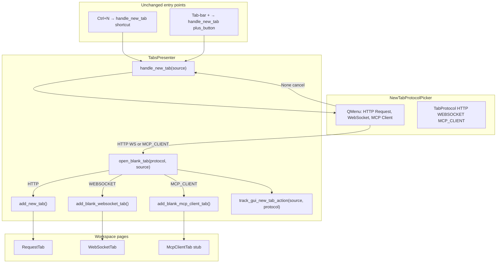
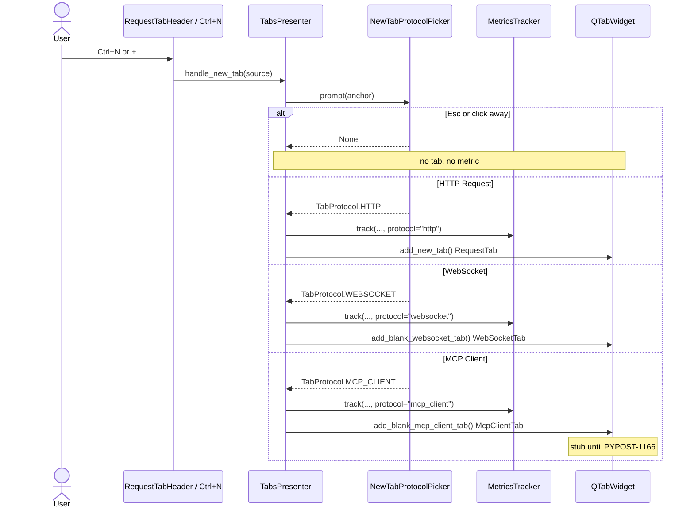

# PYPOST-1165: Extend protocol picker with MCP Client

Step 2 artifact for PYPOST-1165 (MCP-TM-1). Turns the approved requirements in
[`10-requirements.md`](10-requirements.md) into a high-level architecture for
the third blank-tab protocol choice. Parent research
[`ai-tasks/PYPOST-1164/20-architecture.md`](../PYPOST-1164/20-architecture.md)
chose Option A (extend `NewTabProtocolPicker`). Shipped baseline is
[PYPOST-1157](https://pypost.atlassian.net/browse/PYPOST-1157): two-item
picker, `TabProtocol.HTTP` / `WEBSOCKET`, `open_blank_tab`, WebSocket
placeholder via existing `WebSocketTab`.

**Scope:** add **MCP Client** as the third `QMenu` item; keep **HTTP Request**
first with `setActiveAction`; add `TabProtocol.MCP_CLIENT = "mcp_client"`;
route confirm to a non-HTTP placeholder tab; record `protocol=mcp_client`.
The dedicated MCP Client draft shell remains
[PYPOST-1166](https://pypost.atlassian.net/browse/PYPOST-1166).

## Research

### R-1 Competitive MCP creation (updated)

| Product | Blank-tab / new-request entry | Implication |
| --- | --- | --- |
| **Postman MCP request** | Sidebar **MCP** (or New → MCP) opens a dedicated MCP request tab, not an HTTP method ([create docs](https://learning.postman.com/docs/use/send-requests/protocols/mcp-requests/create/)) | Protocol is chosen **before** the editor loads; MCP is a peer of HTTP / WebSocket |
| **MCP Inspector** | Separate app (`npx @modelcontextprotocol/inspector`), not a method inside an HTTP client ([inspector docs](https://modelcontextprotocol.io/docs/tools/inspector)) | Outbound MCP is its own surface |
| **PyPost today** | `NewTabProtocolPicker` offers **HTTP Request** then **WebSocket** only; outbound MCP is still HTTP method **MCP** | Matches the PYPOST-1164 gap this story closes |

This story ships **choice at creation** only. Connect / `list_tools` / `call_tool`
chrome stays in PYPOST-1166+, same split PYPOST-1157 / PYPOST-1158 used for
WebSocket.

### R-2 Qt menu default with a third item

PYPOST-1157 already uses the robust default path: `setActiveAction(http_action)`
and `menu.exec(pos, http_action)` so Enter confirms **HTTP Request**. Qt's
`QMenu.exec(QPoint, QAction *at)` highlights the given action regardless of
how many items follow it
([Qt 6 `QMenu::exec`](https://doc.qt.io/qt-6/qmenu.html#exec-1);
[setActiveAction vs exec-at](https://runebook.dev/en/docs/qt/qmenu/setActiveAction)).

Adding **MCP Client** as a third `addAction` does **not** change the default,
as long as:

1. **HTTP Request** remains `actions()[0]`.
2. `setActiveAction` still targets that first action.
3. `exec(pos, http_action)` still passes the HTTP action, not the new one.

Do **not** switch the default to the new item. Do **not** rely on
`setDefaultAction` (bold style; not the 1157 pattern). Keyboard arrows /
Enter / Esc stay native `QMenu` behavior (NFR-1, NFR-3).

`prompt()` today maps only HTTP and WebSocket action data; anything else
returns `None` (treated as cancel). A third item whose `data()` is
`TabProtocol.MCP_CLIENT` **must** be mapped, or confirming MCP Client is
indistinguishable from Esc.

### R-3 Current codebase constraints (repo facts)

| Area | Current state | Architectural impact |
| --- | --- | --- |
| `TabProtocol` | `HTTP = "http"`, `WEBSOCKET = "websocket"` in `new_tab_protocol_picker.py` (L14–18) | Add `MCP_CLIENT = "mcp_client"` here — do not fork a second enum or picker |
| `NewTabProtocolPicker.build_menu` | Two actions; `setActiveAction(http_action)` (L35–40) | Third `addAction("MCP Client")` **after** WebSocket; HTTP stays first + active |
| `NewTabProtocolPicker.prompt` | Maps HTTP / WEBSOCKET; else `None` (L56–60) | Must map `MCP_CLIENT` or confirm looks like cancel |
| `TabsPresenter.open_blank_tab` | `if WEBSOCKET: add_blank_websocket_tab(); return` else `add_new_tab()` (L420–423) | **Else-HTTP trap** (1157 tech debt). MCP Client **must not** fall through to HTTP |
| `handle_new_tab` | Picker then `open_blank_tab`; cancel is a no-op (L404–411) | Unchanged sequence; third protocol rides the same path |
| `add_blank_websocket_tab` | Fresh `WebSocketConnection()` + `WebSocketTab`; not `open_websocket_tab` | Pattern for MCP placeholder factory: new type, no saved-profile dedup |
| `_request_tab_count` | Counts `RequestTab` **or** `WebSocketTab` (L609–614) | Placeholder type **must** be included, or close-last-tab treats an MCP-only strip as empty and auto-opens HTTP |
| `save_tabs_state` | Persists `RequestTab` ids and `WebSocketTab.connection_data.id` (L279–288) | A stub without those fields is omitted — acceptable; draft restore rules are PYPOST-1166 |
| `track_gui_new_tab_action` | `_NEW_TAB_PROTOCOLS = {"http", "websocket", "unknown"}` (`metrics_registry.py` L13); other strings become `unknown` | 1157 **reserved** `mcp_client` in docs only. Must add it to the allow-list or FR-5.3 fails (collapsed to `unknown`) |
| OTel tracker | Imports `_normalize_new_tab_protocol` from the registry | One allow-list change covers Prometheus and OTel |
| Picker tests | `labels == ["HTTP Request", "WebSocket"]` and **no MCP** (`test_new_tab_protocol_picker.py` L26–32; presenter duplicate L1138) | Step 3 adds three-item assertions (red). Step 4 updates these two-item tests |
| `tabs_presenter.py` size | **746** LOC vs cap **785** (`scripts/audit_baseline_metrics.py`) | ~39 lines of headroom. Keep routing thin; put stub widget in a new module |
| HTTP method **MCP** | Still on `RequestEditor` / `RequestService._execute_mcp` | Unchanged (MCP-TM-6) |

### R-4 Metrics label `mcp_client`

`gui_new_tab_actions_total` already has labels `source` and `protocol`.
PYPOST-1157 documented `mcp_client` as reserved for this story
(`ai-tasks/PYPOST-1157/20-architecture.md` R-4;
`ai-tasks/PYPOST-1157/60-tech-debt.md` item 7). The **code** allow-list does
not include it yet.

| Input `protocol` today | Recorded label |
| --- | --- |
| `http` / `websocket` / `unknown` | itself |
| `mcp_client` | **`unknown`** (normalization drop) |

Step 4 must add `"mcp_client"` to `_NEW_TAB_PROTOCOLS`. Collections
`track_gui_new_tab_action("collections_context")` keeps default
`protocol=unknown`. Cancel still does not increment. No URL / headers / body
on this counter (FR-5.4).

Prometheus serializes labels alphabetically:

```text
gui_new_tab_actions_total{protocol="mcp_client",source="plus_button"}
```

Do **not** add outbound operation counters (`mcp_client_connect_total`, …)
here — those belong with editor stories (PYPOST-1164 NFR-5 / MCP-TM-3/4).

### R-5 WebSocket placeholder pattern (what to copy)

PYPOST-1157 did **not** invent a dummy `QLabel` tab. It reused the existing
peer editor type `WebSocketTab` so:

- tests can assert `not RequestTab` and `is WebSocketTab`;
- `_request_tab_count` already counted that type;
- PYPOST-1158 could replace placeholder-quality *behavior* without renaming
  the class.

MCP Client has **no** tab class today. This story therefore **creates**
`McpClientTab` as a thin peer stub. PYPOST-1166 fills in URL bar, Connect /
Disconnect, state, and empty tool browser **on that same class** — it does
not invent the picker item or the tab kind.

## Implementation Plan

### High-level approach

1. Extend `TabProtocol` and `NewTabProtocolPicker` in the existing picker
   module (third item **MCP Client**; HTTP stays first + `setActiveAction` +
   `exec(..., http_action)`).
2. Map the third action in `prompt()` to `TabProtocol.MCP_CLIENT`.
3. Add a dedicated stub widget `McpClientTab` in a **new** module (not in
   `tabs_presenter.py`).
4. Give `open_blank_tab` an **explicit** `MCP_CLIENT` branch before the HTTP
   fallback. Call `add_blank_mcp_client_tab()` — never `add_new_tab()`.
5. Count `McpClientTab` in `_request_tab_count`.
6. Add `"mcp_client"` to `_NEW_TAB_PROTOCOLS` so confirm records
   `protocol=mcp_client`, not `unknown`.

`Ctrl+N` and **+** already share `handle_new_tab` → picker →
`open_blank_tab`. No second creation path.

### Suggested implementation order (Step 4)

1. `TabProtocol.MCP_CLIENT` + picker menu item + `prompt()` mapping.
2. `McpClientTab` stub module + widget id.
3. Metrics allow-list `"mcp_client"` (registry; OTel reuses the helper).
4. `open_blank_tab` explicit branch + thin `add_blank_mcp_client_tab` +
   `_request_tab_count` tuple update.
5. Update two-item picker tests that currently forbid MCP.

Keep `tabs_presenter.py` under **785** LOC (budget in Architecture).

### Mandatory — Failing Repro (next Step 3)

Write the automated red tests **before** any production fix. No new
production modules, no picker third item, no `open_blank_tab` branch, and no
metrics allow-list change in Step 3.

**Sequencing:** this document → Step 3 red tests (fail on today's code) →
Step 4 production until green.

No live MCP server, no `QMenu.exec()` without a mock, no network. Existing
modules already declare `pytestmark = pytest.mark.timeout(60)` (picker /
tabs presenter) or `timeout(30)` (metrics). New tests inherit those markers
or add an explicit `@pytest.mark.timeout(...)` (do-testing).

#### Why these tests fail today

| Desired behavior | Today's code |
| --- | --- |
| Menu has **MCP Client** as third item | Labels are `["HTTP Request", "WebSocket"]`; tests even assert no `"mcp"` |
| `TabProtocol.MCP_CLIENT == "mcp_client"` | Enum has only HTTP / WEBSOCKET (`AttributeError`) |
| Confirm MCP Client opens a non-HTTP tab | `open_blank_tab` **else** calls `add_new_tab()` → `RequestTab` (1157 trap) |
| `prompt()` returns `MCP_CLIENT` | Unmapped action data returns `None` (looks like cancel) |
| Metrics `protocol=mcp_client` | `_normalize_new_tab_protocol("mcp_client")` → `"unknown"` |

A naive Step 4 that adds only the enum + menu item is **not** enough: confirm
still opens HTTP, and/or `prompt()` still returns `None`, and/or scrape text
still shows `protocol="unknown"`. Red tests must cover all three traps.

#### Primary — picker chrome

**Module / class:** `tests/test_new_tab_protocol_picker.py` ::
`TestNewTabProtocolPicker` (extend the existing class; `qapp` + timeout
already present). Construction-only; do **not** call live `exec()`.

| Test | Asserts (desired — red today) |
| --- | --- |
| `test_build_menu_includes_mcp_client_as_third_item` | Labels are exactly **HTTP Request**, **WebSocket**, **MCP Client**. `activeAction()` is still `actions()[0]` (HTTP). Third action `data()` is `TabProtocol.MCP_CLIENT` |
| `test_prompt_maps_mcp_client_action` | Patch `QMenu.exec` to return `menu.actions()[2]`. `prompt()` returns `TabProtocol.MCP_CLIENT`, not `None` |

Keep `test_build_menu_http_request_is_first_default` unchanged in Step 3
(it still expects two items). Step 4 updates it to the three-item list and
drops the "no mcp" assertions.

#### Primary — presenter routing (else-HTTP trap)

**Module / class:** `tests/test_tabs_presenter.py` ::
`TestHandleNewTabProtocolPicker` (same `_make_presenter` / `_editor_tabs`
helpers; inject `protocol_picker`; never show a menu).

Import `TabProtocol.MCP_CLIENT` and `McpClientTab` **inside each new test
method** so a missing symbol fails that test without breaking collection of
the rest of the file (same 1157 pattern).

| Test | Asserts (desired — red today) |
| --- | --- |
| `test_handle_new_tab_mcp_client_confirm_opens_mcp_tab_not_http` | Inject picker returning `TabProtocol.MCP_CLIENT` for `"shortcut"` and `"plus_button"`. Current page is **not** `RequestTab`, **not** `WebSocketTab`, **is** `McpClientTab`. `add_new_tab` / `open_websocket_tab` are not used for this confirm |
| `test_open_blank_tab_mcp_client_does_not_fall_through_to_http` | Call `open_blank_tab(TabProtocol.MCP_CLIENT, "shortcut")` directly. Same tab-kind assertions as above. Proves the trap even if `handle_new_tab` is bypassed |
| `test_open_blank_tab_records_mcp_client_protocol` | After MCP Client confirm, `track_gui_new_tab_action` is called with `source` (`shortcut` / `plus_button`) and `protocol` `"mcp_client"` — not `"http"` or `"unknown"` |
| `test_handle_new_tab_http_is_still_first_default` (new or extend) | Three-item menu; first action still HTTP; `activeAction` is first. Step 3 may add this alongside the existing two-item test |

Existing HTTP confirm, WebSocket confirm, and cancel tests stay as
regression coverage. Do not change them in Step 3.

#### Companion — metrics allow-list

**Module:** `tests/test_metrics_manager.py` (existing
`test_track_gui_new_tab_action_records_protocol` covers `http` /
`websocket` only).

| Test | Asserts (desired — red today) |
| --- | --- |
| `test_track_gui_new_tab_action_records_mcp_client_protocol` | `track_gui_new_tab_action("shortcut", protocol="mcp_client")` scrape contains `gui_new_tab_actions_total{protocol="mcp_client",source="shortcut"}` and does **not** increment `protocol="unknown"` for that call |

Optional OTel sibling in `tests/test_metrics_otel.py`: same label pair via
`_counter_value` — red for the same allow-list helper.

#### Out of Step 3

- Live `QMenu.exec()` without a mock (blocks the Qt event loop).
- MCP SDK / remote server.
- PYPOST-1166 chrome (URL, Connect, tools).
- Changing Collections or HTTP method **MCP** tests.

## Architecture

### Jira acceptance criteria → design

| AC | Architecture |
| --- | --- |
| Third menu item **MCP Client** | `build_menu` adds it after WebSocket |
| `TabProtocol.MCP_CLIENT` enum | Same `str, Enum` in the picker module; value `mcp_client` |
| Metrics `protocol=mcp_client` | Allow-list + `open_blank_tab` already passes `protocol.value` |
| HTTP Request remains default (first item) | Unchanged first action + `setActiveAction` + `exec(..., http_action)` |
| Confirm is not HTTP | Explicit `MCP_CLIENT` branch → `McpClientTab` stub |

### System modules and responsibilities

| Module | Responsibility this story |
| --- | --- |
| `pypost/ui/widgets/new_tab_protocol_picker.py` | Add `TabProtocol.MCP_CLIENT`; third menu item; `prompt()` mapping |
| `pypost/ui/widgets/mcp_client/mcp_client_tab.py` (**new**) | Stub `McpClientTab(QWidget)` — see placeholder rules below |
| `pypost/ui/widget_ids.py` | `MCP_CLIENT_TAB_PAGE = "pypost_mcp_client_tab_page"` (stub page id only) |
| `TabsPresenter` | Explicit `open_blank_tab` branch; thin `add_blank_mcp_client_tab`; count stub in `_request_tab_count` |
| `metrics_registry._NEW_TAB_PROTOCOLS` | Add `"mcp_client"`; OTel imports the same helper |
| `RequestTabHeader` / `MainWindow` | Unchanged (`new_tab_requested` / `Ctrl+N` still call `handle_new_tab`) |
| `collection_tree_actions` | Unchanged |

Do **not** add `McpClientPresenter`, `McpClientConnection`, collections
fields, or `MCPClientService` session UI in this story.

### Placeholder tab (mandatory specification)

Confirming **MCP Client** must open a workspace page that is recognizably
not HTTP (FR-4.2 / FR-4.4). Until PYPOST-1166, that page is a **stub**.

| Rule | Specification |
| --- | --- |
| **Required class** | `McpClientTab` — a dedicated `QWidget` subclass, peer of `RequestTab` and `WebSocketTab` |
| **Module** | New file `pypost/ui/widgets/mcp_client/mcp_client_tab.py` (package `__init__.py` re-exporting `McpClientTab` is OK). Not inlined in `tabs_presenter.py` (LOC cap) |
| **Acceptable chrome** | Empty layout plus an inner `QLabel` (for example `"MCP Client"`) and `set_widget_id(self, MCP_CLIENT_TAB_PAGE)`. Tab strip title `"New MCP Client"` |
| **Acceptable constructor** | `McpClientTab(parent: QWidget | None = None)` — no presenter, no `McpClientConnection`, no MCP SDK |
| **Must include in** | `_request_tab_count` (`isinstance(..., (RequestTab, WebSocketTab, McpClientTab))`) so close-last-tab does not auto-open HTTP while an MCP stub is open |
| **Need not include in** | `save_tabs_state` / `restore_tabs` / env propagation / `_current_tab()` — stub has no persisted id or editor; PYPOST-1166 owns those |

| Rejected stub | Why |
| --- | --- |
| Fall through to `add_new_tab()` / `RequestTab` | FR-4.4; the 1157 else-HTTP trap |
| Reuse `WebSocketTab` | FR-4.2 — must not be a WebSocket tab; metrics would still say `mcp_client` while UI looks like WS |
| Bare `QLabel` (or other unnamed `QWidget`) as the tab page | Cannot `isinstance`-assert a named kind; `_request_tab_count` would miss it |
| Full draft shell (URL bar, Connect / Disconnect, state badge, tool browser) | PYPOST-1166 |
| HTTP method **MCP** `RequestTab` | Naming collision; not a protocol identity |

PYPOST-1166 **replaces stub contents inside `McpClientTab`**, the same way
PYPOST-1158 replaced placeholder-quality WebSocket draft rules without
renaming `WebSocketTab`.

### Main interfaces / APIs

```python
# pypost/ui/widgets/new_tab_protocol_picker.py
class TabProtocol(str, Enum):
    HTTP = "http"
    WEBSOCKET = "websocket"
    MCP_CLIENT = "mcp_client"


class NewTabProtocolPicker:
    def build_menu(self, parent: QWidget | None = None) -> QMenu: ...
    def prompt(
        self,
        parent: QWidget | None = None,
        *,
        anchor: QPoint | None = None,
    ) -> TabProtocol | None:
        """Return chosen protocol, or None if cancelled."""


# pypost/ui/widgets/mcp_client/mcp_client_tab.py
class McpClientTab(QWidget):
    """Blank MCP Client workspace page (placeholder until PYPOST-1166)."""

    def __init__(self, parent: QWidget | None = None) -> None: ...


# pypost/ui/presenters/tabs_presenter.py
def handle_new_tab(self, source: str = "unknown") -> None: ...
def open_blank_tab(self, protocol: TabProtocol, source: str) -> None: ...
def add_blank_mcp_client_tab(self, *, save_state: bool = True) -> McpClientTab: ...


# pypost/core/metrics_registry.py
_NEW_TAB_PROTOCOLS = frozenset({"http", "websocket", "mcp_client", "unknown"})
```

`open_websocket_tab(connection)` and `add_new_tab(request_data)` stay the
Collections / HTTP factories. Injectable `protocol_picker` is unchanged
(`Callable[..., TabProtocol | None]`). Tests inject
`lambda *_a, **_k: TabProtocol.MCP_CLIENT`.

### `open_blank_tab` routing (else-HTTP trap)

Today:

```python
if protocol == TabProtocol.WEBSOCKET:
    self.add_blank_websocket_tab()
    return
self.add_new_tab()
```

Required:

```python
if protocol == TabProtocol.WEBSOCKET:
    self.add_blank_websocket_tab()
    return
if protocol == TabProtocol.MCP_CLIENT:
    self.add_blank_mcp_client_tab()
    return
self.add_new_tab()
```

HTTP remains the final fallback for `TabProtocol.HTTP` (and only that
known HTTP value). MCP Client must be an **explicit** branch **before**
`add_new_tab()`. Do not use a single `else` that treats every non-WebSocket
as HTTP.

`add_blank_mcp_client_tab` inserts `McpClientTab()` before the plus tab
(same insert / `setCurrentWidget` / optional `save_tabs_state` sequence as
`add_new_tab`). It must **not** call `add_new_tab` or `open_websocket_tab`.

### LOC budget (`tabs_presenter.py` 746 / 785)

| Change | Approx. lines |
| --- | --- |
| Import `McpClientTab` | 1 |
| `open_blank_tab` MCP branch | 3–4 |
| `add_blank_mcp_client_tab` (thin insert only) | ~12–15 |
| `_request_tab_count` add type to tuple | 0–1 |

Projected **~765 / 785**. If the factory would exceed the cap, extract a
shared insert-before-plus helper used by HTTP / WS / MCP — do **not** grow
past 785. Do **not** put `McpClientTab` UI in this file.

### Module diagram



### Component interaction



### Routing table

| Path | API | Tab kind | Metrics |
| --- | --- | --- | --- |
| `Ctrl+N` / **+**, choose HTTP | `open_blank_tab(HTTP, source)` | Blank `RequestTab` | `source` + `protocol=http` |
| `Ctrl+N` / **+**, choose WebSocket | `open_blank_tab(WEBSOCKET, source)` | Blank `WebSocketTab` | `source` + `protocol=websocket` |
| `Ctrl+N` / **+**, choose MCP Client | `open_blank_tab(MCP_CLIENT, source)` | Stub `McpClientTab` | `source` + `protocol=mcp_client` |
| `Ctrl+N` / **+**, cancel | `handle_new_tab` returns | Unchanged | None |
| Collections / restore WS | `open_websocket_tab(conn)` | Saved `WebSocketTab` | Unchanged |
| Collections **New tab** HTTP | `add_new_tab(copy)` | Isolated `RequestTab` | `collections_context` + `unknown` |
| Close last tab | `add_new_tab(save_state=False)` | HTTP blank | Unchanged (PYPOST-1159) |
| HTTP method **MCP** Send | `RequestService._execute_mcp` | Existing HTTP editor | Unchanged (MCP-TM-6) |

### Picker UX details

- Menu items, in order: **HTTP Request**, **WebSocket**, **MCP Client**.
- Default: first action active so Enter confirms HTTP (NFR-3).
- Label **MCP Client**, not unqualified **MCP** (NFR-4; outbound vs inbound).
- Cancel: Esc or click outside → `None` (FR-3.1).
- Anchor, widget id `NEW_TAB_PROTOCOL_MENU`, and injectable picker stay as
  in PYPOST-1157.
- Optional mnemonics (`&HTTP Request`, …) are allowed if visible labels
  remain those three strings.

### Architectural patterns

| Pattern | Application |
| --- | --- |
| **Extend, do not fork** | Same `NewTabProtocolPicker` / `open_blank_tab` / `handle_new_tab` |
| **Peer editors** | `McpClientTab` alongside `RequestTab` / `WebSocketTab`; choice at creation only |
| **Factory methods** | `add_blank_mcp_client_tab` constructs the page; `open_blank_tab` only routes |
| **Placeholder then shell** | Same split as WS-TM-1 / WS-TM-2 (`WebSocketTab` then draft completeness) |
| **Enum as shared vocabulary** | `TabProtocol.MCP_CLIENT.value == "mcp_client"` for routing and metrics |
| **Dependency injection** | Existing `protocol_picker` lambda for tests |
| **Allow-list metrics** | Explicit `mcp_client` in `_NEW_TAB_PROTOCOLS` so it is not `unknown` |

### Out of scope (do not implement here)

- URL bar, Connect / Disconnect, connection state, tool browser
  (PYPOST-1166).
- Close-last-tab picker (PYPOST-1159) — but `_request_tab_count` must
  still count the stub so that fallback does not misfire.
- Collections save/open, `McpClientConnection`, HTTP method **MCP**
  migration.
- User-doc rewrite (PYPOST-1168).
- Protocol switch on an already open tab.
- Outbound `connect` / `list_tools` / `call_tool` counters.

## Q&A

| Question | Answer |
| --- | --- |
| Why not a File → New MCP Client menu? | PYPOST-1164 Option A: one `Ctrl+N` / **+** path. A second entry hides MCP Client from the documented new-tab habit (FR-1.3) |
| Why keep HTTP first after adding a third item? | NFR-3 / FR-2. Qt `exec(pos, http_action)` still highlights the first action when more items exist |
| Why is the else-HTTP branch a bug for MCP Client? | Today any non-WebSocket confirm, including a future `MCP_CLIENT` value, calls `add_new_tab()`. Users who chose MCP Client would land on the HTTP editor (FR-4.4). 1157 recorded this as tech debt for this story |
| What if `prompt()` is not updated? | Third action `data()` would fall through to `return None` — confirm looks like cancel. Map `MCP_CLIENT` explicitly |
| Why a named `McpClientTab` instead of `QLabel`? | 1157 used `WebSocketTab` so tests and `_request_tab_count` share one type. A bare `QLabel` would be missed by the count (auto HTTP after last HTTP close) and is not a stable tab kind for PYPOST-1166 |
| Why not ship the real editor now? | Requirements split: this story is choice + identity + metrics + distinguishable confirm. Editor chrome is PYPOST-1166 |
| Will `mcp_client` show in Prometheus without an allow-list change? | No. `_normalize_new_tab_protocol` rewrites it to `unknown` today |
| Does close-last-tab use the three-item picker? | No. PYPOST-1159. This story only makes the stub count as a real tab |
| Is HTTP method **MCP** removed? | No. MCP-TM-6 |
| Module size? | Stub widget in a new file; presenter routing stays thin so 746 stays under 785 |

## References

- [`10-requirements.md`](10-requirements.md)
- [`ai-tasks/PYPOST-1164/20-architecture.md`](../PYPOST-1164/20-architecture.md) — Option A, MCP-TM-1
- [`ai-tasks/PYPOST-1157/20-architecture.md`](../PYPOST-1157/20-architecture.md) — shipped picker
- [`ai-tasks/PYPOST-1157/60-tech-debt.md`](../PYPOST-1157/60-tech-debt.md) — else-HTTP trap, LOC cap, reserved `mcp_client`
- [PYPOST-1165](https://pypost.atlassian.net/browse/PYPOST-1165) — this story
- [PYPOST-1157](https://pypost.atlassian.net/browse/PYPOST-1157) — WS-TM-1 picker (Done)
- [PYPOST-1166](https://pypost.atlassian.net/browse/PYPOST-1166) — MCP Client draft shell
- [Postman: Create an MCP request](https://learning.postman.com/docs/use/send-requests/protocols/mcp-requests/create/)
- [Qt 6 `QMenu::exec`](https://doc.qt.io/qt-6/qmenu.html#exec-1)
- `pypost/ui/widgets/new_tab_protocol_picker.py`
- `pypost/ui/presenters/tabs_presenter.py`
- `pypost/core/metrics_registry.py`
- `doc/dev/new_tab_protocol_picker.md`
