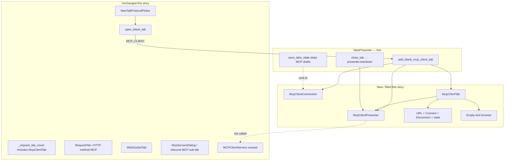

# PYPOST-1166: Blank MCP Client draft tab shell

Step 2 artifact for PYPOST-1166 (MCP-TM-2). Turns the approved requirements in
[`10-requirements.md`](10-requirements.md) into a high-level architecture for
the unsaved MCP Client **draft editor** that replaces the PYPOST-1165
placeholder **inside the same tab kind**.

Parent research:
[`ai-tasks/PYPOST-1164/20-architecture.md`](../PYPOST-1164/20-architecture.md).
Shipped stub:
[`ai-tasks/PYPOST-1165/20-architecture.md`](../PYPOST-1165/20-architecture.md).
Pattern analog: WebSocket blank draft (WS-TM-2) — named new tab, empty
address, omit from session restore until first save, teardown on close.

**Scope:** fill `McpClientTab` with draft-shell chrome (empty URL bar,
Connect / Disconnect, connection state, empty tool-browser placeholder);
exclude the unsaved draft from `save_tabs_state` / restore; call
`presenter.teardown()` on `close_tab`. Picker, identity, new-tab counting,
HTTP / WebSocket paths, and HTTP method **MCP** stay as shipped.

**Not this story:** live `list_tools` / invoke, headers / `{{ vars }}`,
Collections save/open, `Collection.mcp_clients[]`, outbound metrics
counters, picker changes.

## Research

### R-1 Competitive draft chrome (updated)

| Product | Blank MCP / client tab | Implication for this shell |
| --- | --- | --- |
| **Postman MCP request** | Sidebar **MCP** / New → MCP opens a dedicated tab. User enters URL (HTTP) or command (STDIO), then **Load Capabilities** to connect. After connect, **Connect** / **Disconnect** sit in the request header (typically next to **Run**). Tools live on a dedicated **Tools** tab ([create](https://learning.postman.com/docs/use/send-requests/protocols/mcp-requests/create/), [interact](https://learning.postman.com/docs/use/send-requests/protocols/mcp-requests/interact.md)) | Chrome is **URL + explicit connect** before tools appear. Disconnect is a first-class control. Save is optional and later |
| **Official MCP Inspector** | Separate app. Server URL + transport, then connect. **Tools** tab appears once the server advertises `tools` ([Inspector web UI](https://modelcontextprotocol.io/docs/2026-07-28/tools/inspector/web)) | Tool area is reserved even when empty; connect is not an HTTP Send |
| **mcp-use Inspector** | Connect panel: transport + URL, then **Connect**. Connected servers show a status indicator and **Disconnect** ([mcp-use inspector](https://github.com/mcp-use/inspector/)) | Status badge + Disconnect are part of the first screen, not a later story |
| **PyPost today** | Confirming **MCP Client** opens stub `McpClientTab` (`QLabel("MCP Client")`). URL / Connect / tools are missing | This story replaces stub contents; it does not add a second tab type |

**Adopt for v1 shell (this story):** dedicated editor (already shipped), empty
URL field, **Connect** and **Disconnect** as separate controls (not a single
toggle copying WebSocket's one **Connect** button), visible disconnected /
idle state, empty tool list area.

**Defer:** Postman **Load Capabilities** / live initialize (MCP-TM-3), **Run**
invoke (MCP-TM-4), Authorization / headers (MCP-TM-5), STDIO transport
(stretch), prompts / resources tabs (out of v1).

**Session hygiene lesson:** Postman has an open bug where HTTP MCP
**Disconnect** does not release a dead session and a restart is required
([postman-app-support#14021](https://github.com/postmanlabs/postman-app-support/issues/14021)).
PyPost must call `presenter.teardown()` on every MCP Client tab close
(FR-4.2 / Jira AC), even when Connect is still a local no-network stub.

### R-2 Current codebase (repo facts)

| Area | Current state | Architectural impact |
| --- | --- | --- |
| `McpClientTab` | Stub `QWidget`: `QLabel("MCP Client")`, id `MCP_CLIENT_TAB_PAGE`, ctor `(parent=None)` only (`mcp_client_tab.py`) | **Replace layout inside this class.** Keep class name, package, and widget id. Do not invent `McpClientDraftTab` |
| `TabsPresenter.add_blank_mcp_client_tab` | `McpClientTab()` + insert-before-plus + title `"New MCP Client"` + optional `save_tabs_state` (`tabs_presenter.py` L183–194) | Stay a **thin factory**. Wire `McpClientConnection` + `McpClientPresenter` here (~3 extra lines). Do **not** build URL/Connect widgets in the presenter |
| `tabs_presenter.py` size | **~765** LOC vs cap **785** (`scripts/audit_baseline_metrics.py`) | **~20 lines** headroom. URL / Connect / tools live in `pypost/ui/widgets/mcp_client/` and `mcp_client_presenter.py`. If restore/teardown wiring cannot fit, extract shared insert-before-plus first — do not blow the cap |
| `open_blank_tab` | Explicit `MCP_CLIENT` → `add_blank_mcp_client_tab()` (L437–439) | Unchanged routing. Confirm still opens the **same** kind |
| `_request_tab_count` | Counts `RequestTab`, `WebSocketTab`, `McpClientTab` (L626–632) | Unchanged. An MCP-only strip is already a real workspace (FR-4.3) |
| `save_tabs_state` | Writes `RequestTab.request_data.id` and `WebSocketTab.connection_data.id` only (L293–302) | Stub MCP tabs are **already omitted**. Keep that for drafts. **Do not** copy the WebSocket pattern of writing a fresh UUID then hoping restore misses the collection item |
| `restore_tabs` | Resolves `websocket` / `request` via `WebSocketRegistry` / `find_request` (L254–291) | **No MCP branch this story.** Saved-profile restore is MCP-TM-7. Empty `open_tabs` after only MCP drafts still opens blank HTTP (same as 1165) |
| `close_tab` | Tears down **only** `WebSocketTab.presenter` (L244–245) | Must also teardown MCP Client presenter (Jira AC / FR-4.2). Prefer duck-type `getattr(tab, "presenter")` so the branch does not grow |
| WebSocket draft persist | `WebSocketConnection()` always has a UUID; `save_tabs_state` **writes** it; restore skips ids not in collections | Weaker than the MCP-TM-2 AC. MCP drafts must **not** appear in `StateManager.open_tabs` until first save |
| `Collection` | `requests` + `websockets` only (`models.py` L92–96). No `mcp_clients` | Do **not** add collection persistence here (MCP-TM-7) |
| `MCPClientService` | Streamable HTTP `run(url, operation, ...)`; already accepts `headers` | **Do not call** from this story. Live initialize is MCP-TM-3 |
| Inbound MCP UI | `McpServersDialog`, HTTP/WS **MCP** sub-tabs, **MCP Tool** checkbox | Unchanged. Do not reuse `McpToolsOverviewDialog` for the remote tool placeholder |
| HTTP method **MCP** | Still on `RequestEditor` / `RequestService._execute_mcp` | Unchanged (MCP-TM-6) |
| Picker / metrics | Three-item menu; `protocol=mcp_client` allow-listed | Unchanged (MCP-TM-1) |
| Widget ids | `MCP_CLIENT_TAB_PAGE` only | Add ids for URL, Connect, Disconnect, state, tool browser (mirror `WS_URL_INPUT` / `WS_CONNECT_BUTTON` / `WS_STATE_BADGE`) |
| Existing tests | `test_handle_new_tab_mcp_client_confirm_opens_mcp_tab_not_http` already asserts `McpClientTab` not `RequestTab` | Stay green. New red tests cover chrome, restore omission, teardown |

### R-3 Draft vs saved identity

Until MCP-TM-7, **every** blank MCP Client tab is a draft. There is no
collection-backed profile to restore.

| Mechanism | WebSocket today | MCP Client this story |
| --- | --- | --- |
| In-memory model | `WebSocketConnection` with default UUID | `McpClientConnection` with default UUID (needed for URL/name) |
| Written to `open_tabs` | Yes (UUID always present) | **No** — skip `McpClientTab` in `save_tabs_state` |
| Restored | Only if registry finds a saved item | Nothing to restore; no `restore_tabs` MCP branch |
| First save | WS save orchestrator | MCP-TM-7; then persist **saved** ids only |

Naive Step 4 that attaches `connection_data.id` and appends it in
`save_tabs_state` (copy-paste from WebSocket) **fails FR-3**. The red test
must assert the draft id is absent from `set_open_tabs`.

### R-4 Connect chrome without live MCP

Requirements: controls must be **visible and usable**; live initialize and
tool listing are MCP-TM-3; a new draft starts **disconnected**.

| Option | Behavior | Verdict |
| --- | --- | --- |
| **A — Local session state, no `MCPClientService`** | Connect / Disconnect are real `QPushButton`s wired to presenter methods that update an in-tab state enum. `_session` stays `None`. Tool list stays empty | **Recommended.** Chrome is usable; close/teardown still has a presenter to call; TM-3 replaces the connect body |
| B — Dead buttons (no slots) | Visible but not usable | Fails FR-2 / “usable as chrome” |
| C — Call `MCPClientService.run` on Connect | Needs a live server or heavy mocks; tool listing belongs in TM-3; connect-failure messaging is out of scope | Rejected for this story |
| D — Reuse WebSocket Connect toggle only | Requirements ask for **Connect and Disconnect** as distinct controls | Rejected |

Option A may toggle local **Connected** without talking to a server. That is
acceptable for this story. TM-3 replaces that path with initialize +
`list_tools` and real error surfaces. Teardown must remain idempotent when
no session exists.

### R-5 Presenter LOC budget

Do **not** grow `tabs_presenter.py` with URL field, Connect / Disconnect, or
tool-browser construction.

Allowed presenter edits (keep file **≤ 785** LOC):

1. `add_blank_mcp_client_tab`: construct `McpClientConnection()` +
   `McpClientPresenter(...)` + `McpClientTab(connection, presenter)` instead
   of `McpClientTab()`.
2. `close_tab`: teardown any tab that exposes `presenter.teardown()` (covers
   WebSocket and MCP Client).
3. Optional: extract insert-before-plus **only if** (1)+(2) would exceed
   785.

Forbidden in `tabs_presenter.py`: `QLineEdit`, Connect/Disconnect widgets,
tool list models, `MCPClientService`, `restore_tabs` MCP saved-profile
branch, `Collection.mcp_clients`.

## Implementation Plan

### High-level approach

Keep the PYPOST-1165 **tab kind** (`McpClientTab` via
`add_blank_mcp_client_tab`). Replace the stub body with a peer of
`WebSocketTab`'s header row: URL + Connect + Disconnect + state, plus an
empty tool-browser placeholder. Own lifecycle in a new
`McpClientPresenter` (mirror `WebSocketPresenter.teardown`). Keep drafts
out of `StateManager.open_tabs`. Leave picker, metrics, HTTP, WebSocket,
and inbound MCP alone.

### Suggested implementation order (Step 4)

1. `McpClientConnection` in-memory model (`name="New MCP Client"`, `url=""`).
2. `McpClientPresenter` with local connect/disconnect/teardown; no
   `MCPClientService`.
3. Draft chrome inside `McpClientTab` (and small child widgets in the same
   package). Widget ids for tests.
4. Thin factory wiring in `add_blank_mcp_client_tab`.
5. Duck-typed `close_tab` teardown.
6. Confirm `save_tabs_state` still skips MCP Client tabs.

### Mandatory — Failing Repro (next Step 3)

Write the automated red tests **before** any production fix. No new
production modules, no chrome inside `McpClientTab`, no presenter, no
`save_tabs_state` change, no teardown branch in Step 3.

**Sequencing:** this document → Step 3 red tests (fail on today's stub) →
Step 4 production until green.

No live MCP server, no network, no `QMenu.exec()`. Existing
`tests/test_tabs_presenter.py` already has `pytestmark = pytest.mark.timeout(60)`
and `qapp`. New widget-test modules must declare
`@pytest.mark.timeout(...)` or module `pytestmark` (do-testing).

#### Why these tests fail today

| Desired behavior | Today's code |
| --- | --- |
| `add_blank_mcp_client_tab()` yields `McpClientTab` not `RequestTab` | **Already true** (PYPOST-1165). Keep as a regression assert; it is not the red core |
| Title **New MCP Client**, empty URL bar | Title already `"New MCP Client"`; **no URL widget** |
| Connect / Disconnect / disconnected state / empty tool browser | Only `QLabel("MCP Client")` |
| Draft id absent from `save_tabs_state` | Already omitted (no `connection_data`). Red assert is `tab.connection_data.id not in open_tabs` → **AttributeError** until the model exists; after a naive WS-copy persist it fails the membership check |
| `close_tab` calls `presenter.teardown()` | `close_tab` only tears down `WebSocketTab` |

A naive Step 4 that only adds labels, or that persists `connection.id` like
WebSocket, must still fail until chrome + omission + teardown are all
correct.

#### Primary — factory + restore exclusion + teardown

**Module / class:** `tests/test_tabs_presenter.py` :: `TestTabsPresenter`
(same `_make_presenter`; `qapp` + timeout already present).

Import `McpClientConnection` / presenter **inside each new test method**
when the symbol may be missing, so collection of the rest of the file
survives (same 1157/1165 pattern).

| Test | Asserts (desired — red today) |
| --- | --- |
| `test_add_blank_mcp_client_tab_creates_draft` | Current widget is `McpClientTab`, not `RequestTab` / `WebSocketTab`. Tab text is **New MCP Client**. `tab.connection_data.url == ""`. `tab.connection_data.name == "New MCP Client"` |
| `test_save_tabs_state_omits_unsaved_mcp_client_draft` | After `add_blank_mcp_client_tab()`, `tab.connection_data.id` is **not** in `state_manager.get_open_tabs()`. `restore_tabs()` on a presenter whose saved ids are only that draft id does **not** create an `McpClientTab` |
| `test_close_tab_calls_mcp_client_presenter_teardown` | Patch `tab.presenter.teardown` (or construct with a mock presenter). `close_tab(index)` invokes `teardown` once |

Do **not** require live initialize or a populated tool list.

#### Primary — draft-shell chrome

**Module:** `tests/test_mcp_client_tab.py` (new). Construction-only with
`qapp`. Timeout 30s or 60s.

Build `McpClientTab` with a real or fake presenter (no network).

| Test | Asserts (desired — red today) |
| --- | --- |
| `test_draft_shell_has_url_connect_disconnect_state_and_empty_tools` | URL field exists, text empty, widget id `pypost_mcp_client_url_input` (or the id chosen in Architecture). **Connect** and **Disconnect** buttons present with those labels. State indicator shows disconnected / idle (not connected). Tool browser present with **zero** items. Page is not `METHOD_COMBO` / HTTP editor. Widget id `MCP_CLIENT_TAB_PAGE` still set |

Optional: click Connect updates local state without calling
`MCPClientService` (patch the service and assert `run` is not called).

#### Out of Step 3

- Picker three-item tests (already green from PYPOST-1165).
- HTTP / WebSocket confirm tests (regression only if Step 4 touches them).
- Live `list_tools`, invoke, headers, collections save.

## Architecture

### Recommended approach

**Fill the existing `McpClientTab` (same class PYPOST-1165 created)** with
draft-shell chrome and a dedicated presenter. Keep `TabsPresenter` as a
thin factory + close/teardown router.

**Rationale:**

1. Jira AC and FR-1 require `add_blank_mcp_client_tab()` → `McpClientTab`,
   not `RequestTab`. The class already exists; renaming would break 1165
   tests and counting.
2. PYPOST-1165 architecture already reserved chrome for this story
   (“replaces stub contents inside `McpClientTab`”).
3. WebSocket already shows that header-row Connect + state belongs on the
   tab widget, not in `TabsPresenter`.
4. Strict draft omission (do not write ids) is simpler and matches FR-3
   better than the WebSocket write-then-miss-on-restore behavior.
5. Local Connect state avoids MCP-TM-3 scope while still making chrome
   clickable and teardown meaningful.

### Options considered

| Option | Summary | Verdict |
| --- | --- | --- |
| **Fill `McpClientTab` + `McpClientPresenter`** | Peer of `WebSocketTab` / `WebSocketPresenter` | **Chosen** |
| New tab class (`McpClientDraftTab`) | Second confirm outcome | Rejected (FR-1.3 / shell rule) |
| Chrome in `tabs_presenter.py` | Fast but blows 785 LOC cap | Rejected |
| Persist draft UUID like WebSocket | Restore “works” by not finding the id | Rejected (FR-3 / Jira: excluded until first save) |
| Call `MCPClientService` on Connect | Live protocol | Rejected (MCP-TM-3) |

### System modules and responsibilities

| Module | Responsibility this story |
| --- | --- |
| `pypost/models/mcp_client.py` (new) | In-memory `McpClientConnection`: `id`, `name="New MCP Client"`, `url=""`. No `headers` table UI (MCP-TM-5). Not added to `Collection` |
| `pypost/ui/presenters/mcp_client_presenter.py` (new) | Local connection state; slots for Connect / Disconnect; `teardown()` releases any holder and returns to disconnected. **No** `MCPClientService`, worker, or metrics counters |
| `pypost/ui/widgets/mcp_client/mcp_client_tab.py` | Replace stub layout. Host connection bar + empty tool browser. Keep `MCP_CLIENT_TAB_PAGE`. Expose `connection_data` and `presenter` like `WebSocketTab` |
| `pypost/ui/widgets/mcp_client/connection_bar.py` (new, optional split) | URL `QLineEdit`, **Connect**, **Disconnect**, state indicator. Keep `mcp_client_tab.py` readable; split if the tab file would mix too much layout |
| `pypost/ui/widgets/mcp_client/tool_browser.py` (new, lightweight) | Empty list / placeholder labeled for remote tools (not inbound catalog). MCP-TM-3 fills this widget rather than inventing a new region |
| `pypost/ui/widget_ids.py` | Add `MCP_CLIENT_URL_INPUT`, `MCP_CLIENT_CONNECT_BUTTON`, `MCP_CLIENT_DISCONNECT_BUTTON`, `MCP_CLIENT_STATE_BADGE`, `MCP_CLIENT_TOOL_BROWSER` |
| `TabsPresenter` | Thin factory + teardown duck-type. **No** chrome. **No** MCP ids in `save_tabs_state` |
| `NewTabProtocolPicker` / `TabProtocol` / metrics | Unchanged |
| `MCPClientService` | Unchanged; unused by the shell |
| `RequestEditor` / inbound MCP dialogs | Unchanged |

### Main interfaces / APIs

```python
# pypost/models/mcp_client.py (new)
class McpClientConnection(BaseModel):
    """In-memory outbound MCP Client draft (peer of WebSocketConnection).

    Not persisted on Collection in PYPOST-1166. MCP-TM-7 adds save/open.
    """
    id: str = Field(default_factory=lambda: str(uuid.uuid4()))
    name: str = "New MCP Client"
    url: str = ""  # streamable HTTP, e.g. http://127.0.0.1:1080/mcp


class McpClientSessionState(str, Enum):
    DISCONNECTED = "disconnected"  # idle; initial
    CONNECTING = "connecting"      # reserved for MCP-TM-3
    CONNECTED = "connected"        # local chrome only this story


# pypost/ui/presenters/mcp_client_presenter.py (new)
class McpClientPresenter:
    def __init__(self, connection: McpClientConnection) -> None: ...
    def set_tab(self, tab: McpClientTab) -> None: ...
    def connect_requested(self) -> None:
        """Update local state. Do not call MCPClientService (MCP-TM-3)."""
    def disconnect_requested(self) -> None: ...
    def teardown(self) -> None:
        """Release outbound session holder (no-op if none). Idempotent."""


# pypost/ui/widgets/mcp_client/mcp_client_tab.py
class McpClientTab(QWidget):
    def __init__(
        self,
        connection: McpClientConnection,
        presenter: McpClientPresenter,
        parent: QWidget | None = None,
    ) -> None: ...
    connection_data: McpClientConnection
    presenter: McpClientPresenter


# pypost/ui/presenters/tabs_presenter.py (factory stays thin)
def add_blank_mcp_client_tab(self, *, save_state: bool = True) -> McpClientTab: ...
def close_tab(self, index: int) -> None:
    # Duck-type: presenter = getattr(tab, "presenter", None); teardown if present
    ...
def save_tabs_state(self) -> None:
    # RequestTab + WebSocketTab ids only. Do not append McpClientTab draft ids.
    ...
```

`open_blank_tab`, `handle_new_tab`, `add_new_tab`, `add_blank_websocket_tab`,
and `open_websocket_tab` signatures stay unchanged.

User-visible copy (NFR-3): **MCP Client**, **New MCP Client**, **Connect**,
**Disconnect**. State text: **Disconnected** (or **Idle**) on a new draft —
not **Connected**.

### Module diagram



### Component interaction

```mermaid
sequenceDiagram
    participant User
    participant Picker as NewTabProtocolPicker
    participant TP as TabsPresenter
    participant Tab as McpClientTab
    participant Pres as McpClientPresenter
    participant SM as StateManager

    User->>Picker: Ctrl+N / plus → MCP Client
    Picker->>TP: TabProtocol.MCP_CLIENT
    TP->>Tab: add_blank_mcp_client_tab()
    Note over Tab: title New MCP Client, empty URL, Disconnected
    TP->>SM: save_tabs_state without draft id
    User->>Tab: type URL, Connect / Disconnect
    Tab->>Pres: connect_requested / disconnect_requested
    Note over Pres: local state only; no MCPClientService
    User->>TP: close tab
    TP->>Pres: teardown()
    Note over Pres: release holder if any; idempotent
```

**Threading:** none this story. No QThread / `anyio` worker until MCP-TM-3
talks to a server.

**Session restore:**

| Tab kind | In `save_tabs_state`? | Restored on startup? |
| --- | --- | --- |
| Saved HTTP request | Yes | Yes |
| Blank HTTP draft | Yes if it has an id; restore only if `find_request` hits | Unchanged |
| Saved WebSocket profile | Yes | Yes |
| Blank WebSocket draft | Yes (UUID written); restore misses collection | Unchanged (not this story) |
| Blank MCP Client draft | **No** | **No** |
| Saved MCP Client profile | MCP-TM-7 | MCP-TM-7 |

Restart with only unsaved MCP Client drafts: `open_tabs` does not contain
those drafts; `restore_tabs` follows the empty-workspace path and opens
blank HTTP (FR-3.2). That is the same product rule as “do not resurrect
unsaved drafts,” not a new empty-workspace picker (PYPOST-1159).

### Architectural patterns

| Pattern | Application |
| --- | --- |
| **Peer editors** | `McpClientTab` beside `RequestTab` / `WebSocketTab` — no mode switch on an open tab |
| **Presenter** | `McpClientPresenter` owns session lifecycle and teardown, mirrors `WebSocketPresenter` |
| **Factory** | `add_blank_mcp_client_tab` constructs draft + presenter + tab; `open_blank_tab` only routes |
| **Draft vs persisted identity** | In-memory UUID exists; **not** written to `open_tabs` until MCP-TM-7 save |
| **Duck-typed teardown** | `close_tab` calls `presenter.teardown()` when present — one path for WS and MCP |
| **Placeholder region** | Empty tool browser is a stable surface for MCP-TM-3, not a new tab kind |

Python notes (lsr-python): type
hints on new public APIs; Google-style docstrings; no `MCPClientService`
stub-with-`NotImplementedError` in the tab — omit the call instead.

### Boundary map (FR coverage)

| FR / Jira AC | Design |
| --- | --- |
| FR-1 / `add_blank_mcp_client_tab` → `McpClientTab` not `RequestTab` | Existing factory; ctor gains connection + presenter |
| FR-1.4 title **New MCP Client** | Existing `insertTab` title; `connection.name` default matches |
| FR-2 chrome | Built in `McpClientTab` / connection bar / empty tool browser |
| FR-3 draft not restored | Omit MCP Client from `save_tabs_state`; no restore branch |
| FR-4.2 / `close_tab` → `presenter.teardown()` | Duck-typed teardown |
| FR-4.3 counting | Already includes `McpClientTab` |
| FR-5 HTTP / WS / cancel / Collections HTTP-WS / method MCP | Untouched |

### Explicit non-goals (do not “helpfully” add)

- `Collection.mcp_clients`, `McpClientRegistry`, `McpClientSaveOrchestrator`
- `open_mcp_client_tab`, `open_legacy_mcp_request_tab`, migration adapter
- Headers table, `TemplateService` on Connect, env push into the tab
- `mcp_client_connect_total` / `list_tools` / `call_tool` counters
- Changing `_current_tab()` hotkey routing (later / PYPOST-1162 analog)
- Close-last-tab picker (PYPOST-1159)

## Q&A

| Question | Answer |
| --- | --- |
| Why not persist the draft UUID like WebSocket? | Jira AC and PYPOST-1164 MCP-TM-2 require the draft id **not** written until first save. WS write-then-miss is weaker and would look like a restore bug in logs (`restore_tabs_item_not_found`) |
| Why a presenter if Connect does not talk to MCP? | Close must call `teardown()` (AC). Local Connect/Disconnect need a slot owner. TM-3 fills the same presenter |
| Why not reuse `WebSocketStateBadge`? | WS states include heartbeat / reconnect. MCP needs a small disconnected / connecting / connected set and distinct widget ids |
| Why not reuse `McpToolsOverviewDialog`? | That lists tools PyPost **exposes** inbound. The placeholder is for **remote** tools (PYPOST-1164 Q&A) |
| Does Connect with an empty URL error? | No connect-failure UI this story. Presenter may keep **Disconnected** or apply local **Connected**; tool list stays empty. TM-3 adds validation and errors |
| Can `McpClientTab()` remain a one-arg ctor? | No — tests and factory pass `connection` and `presenter`, matching `WebSocketTab`. 1165 tests that only `isinstance` the current widget stay valid |
| Will `tabs_presenter.py` stay under 785? | Yes: factory + duck-typed teardown only. Chrome lives in the widget package |
| Are new global hotkeys in scope? | No (NFR-5). URL and buttons must be tab-focusable widgets |

## References

- [`10-requirements.md`](10-requirements.md)
- [`ai-tasks/PYPOST-1164/20-architecture.md`](../PYPOST-1164/20-architecture.md) — MCP-TM-2 acceptance
- [`ai-tasks/PYPOST-1165/20-architecture.md`](../PYPOST-1165/20-architecture.md) — stub kind this story fills
- [`ai-tasks/PYPOST-1165/60-tech-debt.md`](../PYPOST-1165/60-tech-debt.md) — 765/785 LOC; chrome not in presenter
- [PYPOST-1166](https://pypost.atlassian.net/browse/PYPOST-1166) — this story
- [PYPOST-1165](https://pypost.atlassian.net/browse/PYPOST-1165) — MCP-TM-1 stub (Done)
- [Postman create MCP request](https://learning.postman.com/docs/use/send-requests/protocols/mcp-requests/create/)
- [Postman interact / Connect-Disconnect](https://learning.postman.com/docs/use/send-requests/protocols/mcp-requests/interact.md)
- [MCP Inspector web UI](https://modelcontextprotocol.io/docs/2026-07-28/tools/inspector/web)
- [Postman disconnect leak #14021](https://github.com/postmanlabs/postman-app-support/issues/14021)
- `pypost/ui/widgets/mcp_client/mcp_client_tab.py`
- `pypost/ui/presenters/tabs_presenter.py`
- `pypost/ui/widgets/websocket/websocket_tab.py`
- `pypost/ui/presenters/websocket_presenter.py` (`teardown`)
