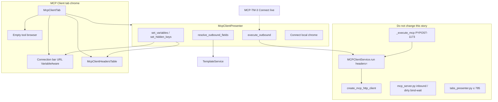
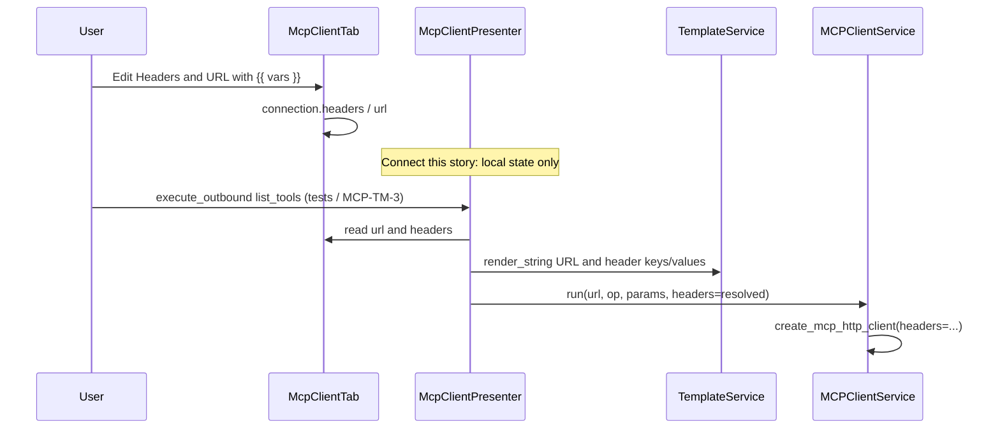

# PYPOST-1167: Outbound headers + environment templating

Step 2 artifact for PYPOST-1167 (MCP-TM-5). Turns the approved requirements in
[`10-requirements.md`](10-requirements.md) into a high-level architecture for
headers on the **existing MCP Client draft**, environment resolution, and
forwarding those resolved headers on outbound MCP calls.

Parent research:
[`ai-tasks/PYPOST-1164/20-architecture.md`](../PYPOST-1164/20-architecture.md).
Shipped shell:
[`ai-tasks/PYPOST-1166/20-architecture.md`](../PYPOST-1166/20-architecture.md).
Shipped method-MCP wire path:
[`ai-tasks/PYPOST-1173/20-architecture.md`](../PYPOST-1173/20-architecture.md).

**Scope:** headers table on `McpClientTab`; `{{ variable }}` resolution for
header names/values and the MCP Client URL; pass resolved headers into the
already header-aware `MCPClientService.run`. HTTP method **MCP** forwarding
is a **regression gate** (PYPOST-1173), not a second implementation.

**Not this story:** live `list_tools` UI (MCP-TM-3), invoke form (MCP-TM-4),
Collections persist (MCP-TM-7), retiring method **MCP** (MCP-TM-6), inbound
proxy / **MCP Servers…**, growing `tabs_presenter.py` past 785 LOC.

## Research

### R-1 Competitive and SDK header placement

- **Postman MCP request:** connection-level Authorization / headers on the
  MCP editor, not an HTTP method quirk
  ([create](https://learning.postman.com/docs/use/send-requests/protocols/mcp-requests/create/)).
  Headers belong on MCP Client chrome.
- **MCP Inspector:** URL + headers/env at connect
  ([Inspector](https://modelcontextprotocol.io/docs/tools/inspector)).
  Headers are part of Connect, not Send-only.
- **MCP Python SDK:** custom headers live on the HTTP client passed into
  `streamable_http_client`; **no** `headers=` on the transport
  ([client transports](https://py.sdk.modelcontextprotocol.io/client/transports/)).
  Keep the PYPOST-1173 factory pattern.
- **python-sdk #998:** operators already send `Authorization: Bearer` on
  Streamable HTTP. Bearer-in-headers is the v1 auth model.

SDK warning (current docs): `streamable_http_client()` no longer takes
`headers=`. PyPost already does the correct thing:
`create_mcp_http_client(headers=..., timeout=...)` then
`streamable_http_client(url, http_client=http_client)`.

Newer SDK samples use `httpx2.AsyncClient`. This story does **not** migrate
the HTTP stack; it reuses the shipped factory.

### R-2 Current codebase (repo facts)

- **`McpClientConnection`:** `id`, `name`, `url` only. Add in-memory
  `headers: dict[str, str]` (MCP-TM-7 persists).
- **`McpClientTab` / connection bar:** URL `QLineEdit`, Connect /
  Disconnect, state, empty tools. Add Headers table in tab chrome.
  Switch URL to `VariableAwareLineEdit`.
- **`McpClientPresenter`:** local chrome; **does not** call
  `MCPClientService`. Own resolve + `execute_outbound`. Connect stays
  local (MCP-TM-3).
- **`MCPClientService.run`:** optional `headers`; forwards to
  `create_mcp_http_client`. **No API change.** Presenter must pass
  `headers=`.
- **`RequestService._execute_mcp`:** renders URL/headers/body; calls
  `run(..., headers=resolved_headers)`. **FR-4 already shipped
  (PYPOST-1173).** Keep tests green.
- **`tabs_presenter.py`:** **771 / 785** LOC
  (`scripts/audit_baseline_metrics.py`). Thin factory + duck-typed env
  fan-out only. **No** headers UI.
- **Env fan-out:** `on_env_variables_changed` / hidden keys cover
  `RequestTab` and `WebSocketTab` only. Duck-type
  `presenter.set_variables` / `set_hidden_keys` so MCP drafts get the
  active environment without a third `isinstance`.
- **`KeyValueTable`:** nested in `request_editor.py`. Do not import the
  HTTP editor. New MCP table widget (same interaction).
- **`WebSocketKeyValueTable`:** same empty-row UX. Copy the pattern; do
  not couple MCP Client to the WebSocket package.
- **`resolve_proxy_headers`:** fail-fast missing vars. **Do not use.**
  HTTP / method MCP leave unresolved `{{ }}` text
  ([templating.md](../../doc/user/templating.md)).
- **`handle_switch_to_headers_global`:** assumes
  `RequestTab.request_editor`. NFR-5: Ctrl+H not required on MCP Client.
  Do not grow this handler.
- **Connect INFO test:**
  `test_presenter_logs_connect_disconnect_teardown` asserts `"headers"`
  is absent. Connect INFO must not mention header values.

### R-3 PYPOST-1173 vs this story vs dirty `mcp_server.py`

**PYPOST-1173 (shipped):** method **MCP** Send already forwards
environment-resolved headers through `MCPClientService.run` →
`create_mcp_http_client`. Tests:

- `tests/test_mcp_client_service.py` —
  `test_run_passes_headers_to_create_mcp_http_client`
- `tests/test_request_service.py` —
  `test_execute_mcp_forwards_resolved_headers_to_mcp_client`
- `tests/test_request_service.py` —
  `test_execute_mcp_forwards_empty_headers_to_mcp_client`

This story **must not re-implement** that wiring. FR-4 is “still true after
MCP Client chrome lands.”

**Dirty `pypost/core/qt/mcp_server.py` vs HEAD:** working-tree diff is
`_wait_until_port_bindable()` after inbound server restart (socket bind
retry). That file’s `start_proxy_server(..., headers=)` is **inbound proxy
upstream**, not outbound MCP Client. **Do not include, depend on, or
“complete” that dirty change in PYPOST-1167.** Unrelated work stays out of
this design and out of this story’s Step 4.

### R-4 Env preview and masking

HTTP Headers and WebSocket handshake headers use
`VariableAwareTableWidget` + `VariableHoverResolver`: hover shows the
resolved value; hidden environment keys stay masked (`********`). MCP
Client Headers and URL must use the same widgets so FR-2.4 / NFR-3 need
no new masking policy.

## Implementation Plan

### High-level approach

1. Store connection headers on the in-memory `McpClientConnection`.
2. Add a Headers table on `McpClientTab` chrome (peer of the connection
   bar), not in `TabsPresenter`.
3. Push the active environment into `McpClientPresenter` the same way
   WebSocket already does (`set_variables` / `set_hidden_keys`).
4. Resolve URL and headers with `TemplateService.render_string` (HTTP
   parity) immediately before any outbound `MCPClientService.run`.
5. Leave Connect as local chrome. MCP-TM-3 must call
   `execute_outbound("list_tools")` so live initialize cannot drop
   headers.
6. Treat method **MCP** as already correct; keep PYPOST-1173 tests green.
7. Do not edit `pypost/core/qt/mcp_server.py`.

### Sequencing (Step 4)

```
Model headers field
  → Headers table + URL VariableAwareLineEdit in mcp_client widgets
      → Presenter env snapshot + resolve_outbound_fields + execute_outbound
          → TabsPresenter: ctor env kwargs + duck-typed env fan-out
              → Keep PYPOST-1173 tests green
```

No production code in this step.

### Mandatory — Failing Repro (next Step 3)

This story has runtime UI and presenter behavior. Step 3 writes **red**
automated tests **before** any production fix.

**Primary red test A — headers table on the MCP Client editor (FR-1)**

- **Where:** `tests/test_mcp_client_tab.py`
  `test_mcp_client_tab_has_headers_table` (name may vary).
- **Asserts:** after `_build_draft_tab()`, a table with widget id
  `pypost_mcp_client_headers_table` (`MCP_CLIENT_HEADERS_TABLE`) is
  present. User-visible **Headers** label. Filling the last name/value
  row adds a new empty row. Clearing / removing a named row drops it
  from `get_data()`. Page is still `McpClientTab` (no `METHOD_COMBO`).
  Tool browser stays empty.
- **Force failure without live MCP:** construct the tab with `qapp` only.
  Today the draft has no headers table → `findChild` is `None`.
- **Timeout:** module `pytestmark = pytest.mark.timeout(30)` already on
  the file.

**Primary red test B — resolve + forward (FR-2, FR-3)**

- **Where:** new `tests/test_mcp_client_presenter.py`
  `test_execute_outbound_forwards_resolved_url_and_headers`.
- **Asserts:** draft URL `http://{{host}}/mcp` and header
  `Authorization: Bearer {{token}}` with env
  `{host: "127.0.0.1:1080", token: "secret"}`.
  `execute_outbound("list_tools")` calls `MCPClientService.run` with
  resolved URL
  `http://127.0.0.1:1080/mcp` and
  `headers={"Authorization": "Bearer secret"}` (keyword). Empty headers
  still call `run` with `{}`. Hidden-key hover stays a separate widget
  assertion if needed (`VariableAwareTableWidget` + `set_hidden_keys`).
- **Force failure without live MCP:** patch `MCPClientService.run` (or
  inject a mock client on the presenter). Do not start uvicorn / SDK.
- **Why red today:** presenter has no `execute_outbound`, no env snapshot,
  and `McpClientConnection` has no `headers`.
- **Timeout:** module `pytestmark = pytest.mark.timeout(10)` (no GUI
  needed if the presenter reads connection + optional tab stubs). If the
  test builds `McpClientTab`, use 30s like other GUI tests.
- **caplog:** if asserting logs, match `do-testing` (ERROR paths need
  expected log text). Do not log header values. Keep existing Connect
  INFO test: no `headers` substring.

**FR-4 / PYPOST-1173 (not a new red test)**

- Existing `test_execute_mcp_forwards_resolved_headers_to_mcp_client`
  must stay green. Do not rewrite `_execute_mcp` unless a regression
  appears. Do not add a live header-gated MCP server in Step 3.

**Sequencing:** research (this file) → Step 3 red tests → Step 4 until
green. Do not implement the table or `execute_outbound` in Step 3.

## Architecture

### Recommended approach

**MCP Client tab/chrome owns Headers UI. Presenter owns resolve +
forward. `MCPClientService` stays as PYPOST-1173 left it.
`TabsPresenter` stays a thin factory (≤ 785 LOC).**

**Rationale:**

1. Requirements: headers are part of the MCP Client workspace, not HTTP
   method chrome and not `tabs_presenter.py`.
2. Parent MCP-TM-5: table + `TemplateService` + `run(..., headers=)`.
3. 771 / 785 LOC: ~14 lines of headroom. A headers table in the presenter
   file would fail the audit cap.
4. PYPOST-1173 already closed the method-MCP wire gap. Duplicating it
   (or touching inbound `mcp_server.py`) mixes unrelated work.
5. Connect remains local so MCP-TM-3 still owns `list_tools` UI; FR-3 is
   the `execute_outbound` contract those stories must call.

### Options considered

- **Chosen:** Headers table in `mcp_client` widgets + presenter resolve
  (parity with the WebSocket connection editor).
- **Reuse `RequestEditor.KeyValueTable`:** couples outbound MCP to the
  HTTP editor. Rejected.
- **Import `WebSocketKeyValueTable`:** wrong package; inbound MCP
  sub-tab lives there. Rejected.
- **Extract a shared table this story:** extra refactor; not required
  for FR-1. Rejected (debt later).
- **`resolve_proxy_headers` for the client:** fail-fast is not HTTP
  templating. Rejected.
- **Re-wire `_execute_mcp` / `mcp_server.py`:** unrelated or already
  done. Rejected.
- **Headers UI in `tabs_presenter.py`:** blows the 785 LOC cap.
  Rejected.
- **Call `MCPClientService` from Connect now:** live `list_tools` is
  MCP-TM-3. Rejected for Connect chrome; allowed via `execute_outbound`
  tests.

### LOC budget (`tabs_presenter.py` 771 / 785)

Allowed presenter edits:

1. Pass `env_vars=self._current_variables` and
   `hidden_keys=self._current_hidden_keys` into `McpClientPresenter`
   (optional kwargs so existing `McpClientPresenter(connection)` tests
   still construct).
2. Replace WebSocket-only env branches with duck-typed
   `presenter.set_variables` / `set_hidden_keys` so MCP drafts get
   updates **without** a new `isinstance(McpClientTab)` block.

Forbidden: table widgets, template loops, header dicts, Ctrl+H routing
for MCP Client.

If kwargs cannot fit, extract nothing new in this file: set env on the
presenter immediately after `McpClientTab(...)` using existing
`set_variables` (two calls). Projected **≤ 780 / 785**. If a change would
exceed 785, extract a helper **out** of `tabs_presenter.py` first — do
not raise the cap.

### System modules and responsibilities

- **`pypost/models/mcp_client.py`:** add
  `headers: dict[str, str] = Field(default_factory=dict)`. Still not on
  `Collection`.
- **`headers_table.py` (new):** `McpClientHeadersTable` subclass of
  `VariableAwareTableWidget`. Key/Value, extra empty row, `get_data` /
  `set_data`.
- **`mcp_client_tab.py`:** host Headers table under the connection bar,
  above the tool browser. Sync `connection_data.headers` on edit.
- **`connection_bar.py`:** URL becomes `VariableAwareLineEdit`;
  `set_variables` / `set_hidden_keys` on URL + table.
- **`mcp_client_presenter.py`:** env snapshot;
  `resolve_outbound_fields`; `execute_outbound` →
  `MCPClientService.run`. Connect / Disconnect / teardown stay local.
- **`widget_ids.py`:** `MCP_CLIENT_HEADERS_TABLE`
  (`pypost_mcp_client_headers_table`).
- **`TabsPresenter`:** factory env kwargs + duck-typed env fan-out. No
  chrome.
- **`MCPClientService`:** unchanged.
- **`RequestService._execute_mcp`:** unchanged (PYPOST-1173).
- **`pypost/core/qt/mcp_server.py`:** **out of scope** (dirty bind-wait
  is not this story).
- **HTTP / WebSocket header tables:** unchanged.

### Main interfaces / APIs

```python
# pypost/models/mcp_client.py
class McpClientConnection(BaseModel):
    id: str = Field(default_factory=lambda: str(uuid.uuid4()))
    name: str = "New MCP Client"
    url: str = ""
    headers: dict[str, str] = Field(default_factory=dict)


# pypost/ui/presenters/mcp_client_presenter.py
class McpClientPresenter:
    def __init__(
        self,
        connection: McpClientConnection,
        env_vars: dict[str, str] | None = None,
        hidden_keys: set[str] | None = None,
        template_service: TemplateService | None = None,
        mcp_client: MCPClientService | None = None,
    ) -> None: ...

    def set_variables(self, variables: dict[str, str]) -> None: ...
    def set_hidden_keys(self, hidden_keys: set[str]) -> None: ...

    def resolve_outbound_fields(self) -> tuple[str, dict[str, str]]:
        """Render URL and header names/values from the active environment."""

    def execute_outbound(
        self,
        operation: str,
        call_params: dict[str, Any] | None = None,
    ) -> ResponseData:
        """run(url, operation, call_params, headers=resolved)."""

    def connect_requested(self) -> None:
        """Local chrome only (MCP-TM-3). Must not skip header-aware path later."""
```

Resolution (HTTP / method-MCP parity, not proxy fail-fast):

```python
resolved_headers = {
    self._template_service.render_string(k, self._env_vars): (
        self._template_service.render_string(v, self._env_vars)
    )
    for k, v in raw_headers.items()
}
resolved_url = self._template_service.render_string(raw_url, self._env_vars)
self._mcp_client.run(
    resolved_url, operation, call_params, headers=resolved_headers
)
```

Empty `raw_headers` → `headers={}`. Missing env vars: leave the original
placeholder text (same as HTTP).

### Module diagram



### Component interaction



**Threading:** `MCPClientService.run` already bridges async via `anyio`.
This story does not add `McpClientWorker`. MCP-TM-3 may add a worker;
it must still call `execute_outbound` (or equivalent) so headers cannot
be dropped.

**Logging:** reuse service DEBUG `header_count` only. Presenter INFO
Connect/Disconnect/teardown stay connection_id-only (existing test).

### Architectural patterns

- **Peer editor chrome:** headers live on `McpClientTab`, like WS
  `connection_editor`.
- **Presenter coordination:** resolve + outbound call on
  `McpClientPresenter`.
- **Pass-through of resolved fields:** presenter resolves; service
  transports (same split as `_execute_mcp`).
- **Factory + injected HTTP client:** headers on `httpx.AsyncClient`,
  not `streamable_http_client(headers=)`.
- **Duck-typed env fan-out:** avoid a third tab `isinstance` in
  `TabsPresenter`.
- **Regression-not-rewrite:** FR-4 = PYPOST-1173 tests remain the
  method-MCP contract.

### Boundary with later stories

- **MCP-TM-3 (PYPOST-1169):** live Connect / `list_tools` **must** call
  `execute_outbound`.
- **MCP-TM-4 (PYPOST-1170):** `call_tool` **must** use the same
  header-aware path.
- **MCP-TM-6 (PYPOST-1171):** retires method **MCP**; this story does
  not remove it.
- **MCP-TM-7 (PYPOST-1172):** persists `connection.headers` on
  `mcp_clients[]`.

## Q&A

- **Is FR-4 still work for 1167?** Product AC stays. Implementation is
  PYPOST-1173. This story keeps those tests green and does not re-wire
  `_execute_mcp`.
- **Does dirty `mcp_server.py` forward client headers?** No. The dirty
  diff is inbound port bind-wait. Outbound client headers never go
  through that manager. Leave the file alone.
- **Why not call the SDK on Connect here?** MCP-TM-3 owns tool listing
  and connect errors. This story ships the header-aware
  `execute_outbound` those steps must use.
- **Why copy a table instead of sharing `KeyValueTable`?** Nested HTTP
  widget; extracting it is out of scope. Copy the empty-row interaction
  into `mcp_client`.
- **Why not `resolve_proxy_headers`?** Proxy raises on missing vars.
  HTTP leaves `{{ }}` in place. Requirements: same rule as HTTP.
- **Will `tabs_presenter.py` stay under 785?** Yes: factory kwargs +
  duck-typed env only. Headers UI is tab chrome.
- **Ctrl+H on MCP Client?** Not in v1 (NFR-5). Do not extend
  `handle_switch_to_headers_global`.
- **Are header rows saved?** In-memory on the draft only. MCP-TM-7
  persists.

## References

- [`10-requirements.md`](10-requirements.md)
- [`ai-tasks/PYPOST-1164/20-architecture.md`](../PYPOST-1164/20-architecture.md)
  (MCP-TM-5)
- [`ai-tasks/PYPOST-1166/20-architecture.md`](../PYPOST-1166/20-architecture.md)
- [`ai-tasks/PYPOST-1173/20-architecture.md`](../PYPOST-1173/20-architecture.md)
- [MCP Python SDK client transports](https://py.sdk.modelcontextprotocol.io/client/transports/)
- `pypost/core/mcp_client_service.py`, `pypost/core/request_service.py`
- `pypost/ui/widgets/mcp_client/`, `pypost/ui/presenters/mcp_client_presenter.py`
- `pypost/ui/presenters/tabs_presenter.py` (771 / 785)
- `doc/user/templating.md`, `doc/dev/mcp_client_draft_tab.md`
