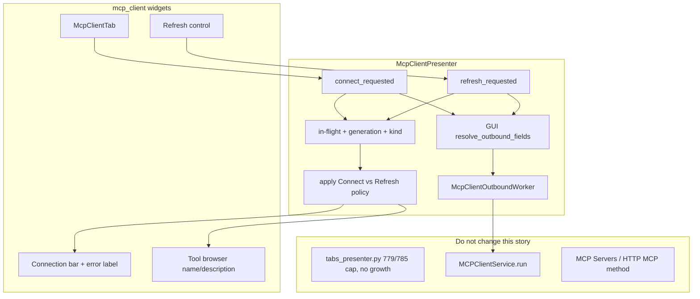

# PYPOST-1169: Tool discovery and browser UI after Connect

Step 2 artifact for PYPOST-1169 (MCP-TM-3). Turns the approved requirements in
[`10-requirements.md`](10-requirements.md) into a high-level architecture for
**live Connect** on the existing MCP Client tab: GUI-thread resolve of
URL/headers, `list_tools` via worker `MCPClientService.run` (not the
current `execute_outbound` body), fill the shipped tool browser with name
and description, surface Connect vs Refresh errors (Refresh stays
connected), and keep `tabs_presenter.py` at or under 785 LOC with no
growth.

Parent research:
[`ai-tasks/PYPOST-1164/20-architecture.md`](../PYPOST-1164/20-architecture.md).
Shipped shell:
[`ai-tasks/PYPOST-1166/20-architecture.md`](../PYPOST-1166/20-architecture.md).
Shipped headers / `execute_outbound`:
[`ai-tasks/PYPOST-1167/20-architecture.md`](../PYPOST-1167/20-architecture.md).

**Scope:** replace local Connect chrome with initialize + `list_tools`
against the remote Streamable HTTP server; populate
`McpClientToolBrowser`; Connect failures leave the session not connected;
Refresh re-lists while connected; a failed Refresh stays connected with
last-known (stale) tools and an in-tab error. Reuse resolved URL and
headers from PYPOST-1167.

**Not this story:** invoke / schema forms / result pane (MCP-TM-4),
Collections save (MCP-TM-7), retiring HTTP method **MCP** (MCP-TM-6),
inbound **MCP Servers…**, prompts / resources / protocol trace, SSE /
stdio, growing `tabs_presenter.py` for Connect/list/error/refresh.

## Research

### R-1 Competitive Connect → list tools → refresh

| Product | Connect / discover | Refresh / failure | Relevance |
| --- | --- | --- | --- |
| **Postman MCP request** | **Load Capabilities** connects and loads tools / resources / prompts. Header **Connect** / **Disconnect** sit next to **Run**. Tools live on a **Tools** tab ([interact](https://learning.postman.com/docs/use/send-requests/protocols/mcp-requests/interact.md)) | Disconnect is first-class. Reconnect is Connect after Disconnect. Load Capabilities is the discovery action | PyPost already has Connect / Disconnect chrome. This story makes Connect the Load Capabilities equivalent (`list_tools` only) |
| **MCP Inspector (web)** | Per-server Connect; **Tools** tab when the server advertises `tools`. List is name, description, schema ([Inspector web](https://modelcontextprotocol.io/docs/2026-07-28/tools/inspector/web)) | **Refresh** on the Tools tab re-fetches `tools/list`. Default is manual pull; auto-refresh on `list_changed` is opt-in ([inspector#1443](https://github.com/modelcontextprotocol/inspector/issues/1443)) | Adopt explicit **Refresh**, not notification-driven auto-refresh. v1 shows name and description only (schema is MCP-TM-4) |
| **MCP spec `tools/list`** | Result is `{ "tools": [ { "name", "description?", "inputSchema", ... } ], "nextCursor?" }` ([tools](https://modelcontextprotocol.io/specification/2026-07-28/server/tools)) | Pagination via `nextCursor`. Caching / `list_changed` exist in later spec revisions | Parse `tools[].name` and `tools[].description`. First page only: `MCPClientService` already has no cursor loop. Do not add pagination this story |
| **PyPost today** | Connect sets local `CONNECTED` and `_session = object()`. Never calls `MCPClientService`. Tool browser is an empty `QListWidget` | No Refresh control. Empty URL still “connects.” No in-tab error label | This is the defect: chrome lies about the remote catalog |

**Adopt for v1:** Connect = resolve URL/headers **on the GUI thread**, then
`MCPClientService.run(..., "list_tools", headers=)` on a worker. Success
fills the existing browser. Empty `tools` is success. Refresh is a
second `list_tools` on an already connected tab (session stays
`CONNECTED`). Failed Refresh does not mirror failed Connect.

**Defer:** Inspector auto-refresh / `notifications/tools/list_changed`,
pagination aggregation, schema-rendered forms, protocol transcript.

### R-2 Current codebase (repo facts)

| Area | Current state | Architectural impact |
| --- | --- | --- |
| `McpClientPresenter.connect_requested` | Logs `mcp_client_connect_initiated`, syncs URL/headers from the tab, `_session = object()`, `CONNECTED`. **Does not** call `run` | **Replace this body.** GUI thread: `resolve_outbound_fields` then start worker. Worker: `run(..., headers=resolved)` — **not** the current `execute_outbound` body |
| `execute_outbound` / `resolve_outbound_fields` | Shipped PYPOST-1167. `resolve_outbound_fields` calls `_sync_fields_from_tab()` (Qt widgets) then templates. `execute_outbound` always resolves then `run` | **Split for live Connect/Refresh.** Resolve stays on the GUI thread. Worker must **not** call `execute_outbound` (Qt-unsafe). Pass already-resolved url/headers into `run`. Keep `execute_outbound` as the sync PYPOST-1167 API for tests / later invoke |
| `MCPClientService.run` | New Streamable HTTP session per call: `initialize` + `list_tools` or `call_tool`, then close. Body JSON `{"tools": [...]}`. Raises `ExecutionError` (NETWORK / TIMEOUT / UNKNOWN). 25s total timeout | **No API change.** Connect/Refresh are one-shot `list_tools` calls. “Connected” is chrome after a successful discovery, not a held `ClientSession` |
| `McpClientToolBrowser` | Wrapper + empty `QListWidget`. Id `MCP_CLIENT_TOOL_BROWSER` is on the **inner list** (not the wrapper) | Add `set_tools` / `clear_tools`. Keep the id on the inner list so existing `findChild` tests stay valid |
| `McpClientConnectionBar` | URL, Connect, Disconnect, state badge. Labels: Disconnected / Connecting / Connected. `CONNECTING` is unused | Use `CONNECTING` **only while Connect is in flight**. Add **Failed** for failed Connect. Add in-tab error/status text. Add **Refresh** here or on the tool browser — not in `TabsPresenter`. Refresh in-flight keeps the **Connected** badge and uses a separate progress cue |
| `McpClientSessionState` | `DISCONNECTED`, `CONNECTING`, `CONNECTED` | Add `FAILED` for failed Connect (not connected, empty tools). Failed Refresh **and** in-flight Refresh stay `CONNECTED` (plus error or progress). Do not map Refresh busy to `CONNECTING` or `FAILED` |
| `tabs_presenter.py` | **779 / 785** LOC (`wc -l`; cap in `scripts/audit_baseline_metrics.py`). Factory already constructs `McpClientPresenter` + env kwargs | **Do not grow this file for MCP-TM-3.** Session, `list_tools`, errors, and Refresh live in `McpClientPresenter` and `mcp_client` widgets. [PYPOST-1184](https://pypost.atlassian.net/browse/PYPOST-1184) is the extract-insert-before-plus follow-up **if** a later story cannot fit factory lines. This story needs **zero** factory changes |
| `TabsPresenter.worker` / `RequestWorker` | HTTP / method **MCP** Send path | **Do not reuse.** MCP Client Connect must not steal the HTTP send worker or add handlers in `tabs_presenter_worker.py` |
| Env fan-out | Duck-typed `presenter.set_variables` / `set_hidden_keys` already covers MCP drafts | Unchanged |
| `save_tabs_state` / picker / headers table | Draft omitted; picker three items; headers table shipped | Unchanged |
| Metrics | `mcp_requests_received_total` is **inbound**. No outbound connect / list_tools counters | Add outbound counters distinct from inbound (NFR-7, parent MCP-TM-3 AC) |
| Existing tests | `test_execute_outbound_*` already mock `run`. `test_presenter_logs_connect_disconnect_teardown` clicks local Connect and forbids `"headers"` in INFO | Keep execute_outbound tests green. Connect INFO tests must still avoid URL, secrets, and the substring `headers` |

### R-3 Persistent SDK session vs per-call `execute_outbound`

Parent PYPOST-1164 preferred holding `ClientSession` for the tab lifetime
so MCP-TM-4 invoke can reuse it. Shipped `MCPClientService.run` always
opens and closes a session.

| Option | Behavior | Verdict |
| --- | --- | --- |
| **A — GUI resolve + worker `run` with resolved fields** | Each action: GUI `resolve_outbound_fields` → worker `run(url, "list_tools", headers=)` → initialize + list + close. Chrome `CONNECTED` means last successful discovery | **Recommended.** Same header contract as `execute_outbound`, but Qt-safe. Failed Refresh cannot drop a live socket that is not held |
| B — New `MCPClientSession` holder in the service | Connect keeps streams open; Refresh calls `list_tools` on the same session | Better for TM-4, but duplicates transport and is a larger change than MCP-TM-3 needs |
| C — Call `MCPClientService.run` from Connect **without** resolving | Easy to drop resolved headers | **Rejected.** PYPOST-1167: live Connect/Refresh **must** resolve URL/headers on the GUI thread and pass `headers=` into `run` |
| D — Call current `execute_outbound` on the `QThread` | Worker would hit `_sync_fields_from_tab()` / Qt widgets | **Rejected.** Qt widgets are GUI-thread only |

MCP-TM-4 may introduce a session holder later. It must still send the same
resolved headers. This story does not add `mcp_client_session.py`.

### R-4 Threading (NFR-5)

`MCPClientService.run` uses `anyio.run` on the **calling** thread and can
block up to `MCP_TOTAL_TIMEOUT` (25s). Calling it from
`connect_requested` on the Qt main thread would freeze the window.

| Option | Verdict |
| --- | --- |
| **A — Small `QThread` owned by `McpClientPresenter`** | **Recommended.** GUI thread: `resolve_outbound_fields` (Qt-safe). Worker: **only** `MCPClientService.run(resolved_url, "list_tools", call_params, headers=resolved_headers)`. Apply results on the GUI thread via signals. **Do not** call the current `execute_outbound` body on the worker |
| B — Reuse `TabsPresenter` / `RequestWorker` | Grows `tabs_presenter.py` and couples MCP Client to HTTP Send. **Rejected** |
| C — Sync `run` / `execute_outbound` on the GUI thread | Fails NFR-5. **Rejected** |
| D — Worker calls `execute_outbound` | Fails Qt thread affinity (`resolve_outbound_fields` → `_sync_fields_from_tab`). **Rejected** |

Worker module lives next to the presenter (for example
`pypost/ui/presenters/mcp_client_worker.py`), not in `tabs_presenter.py`.
Constructor (or `run` args) takes **already-resolved** `url` and
`headers`, plus `operation` (always `list_tools` this story). It does
not hold a presenter or tab pointer.

### R-5 Failed Connect vs failed Refresh chrome

Requirements (FR-3.2 vs FR-4.3):

| Outcome | Session | Tool list | Badge / error |
| --- | --- | --- | --- |
| Connect success (including zero tools) | Connected | New list (may be empty) | Connected; clear error |
| Connect failure (empty URL, network, timeout, auth, protocol) | **Not** connected | **Empty** | Failed (or Disconnected) **with error**. Must not look Connected |
| Refresh success | Connected | New list | Connected; clear error |
| Refresh failure | **Stays connected** | **Keep last-known (stale, not cleared)** | **Connected with error** — must not match failed Connect |
| Disconnect / teardown | Disconnected | Empty | Disconnected; clear error |

Do not reuse a single “error ⇒ disconnect and clear tools” handler for
Refresh.

**In-flight vs session state (mandatory):** session enum is **not** the
in-flight flag.

| Action in flight | Session enum | Progress chrome | Buttons |
| --- | --- | --- | --- |
| Connect | `CONNECTING` | Connecting badge (existing) | Disable Connect and Refresh; Disconnect may cancel |
| Refresh | **`CONNECTED`** | In-tab cue (for example “Refreshing tools…” on the status/error line, or busy on Refresh). **Not** Failed-Connect chrome, **not** `CONNECTING`/`FAILED` | Disable Refresh (and Connect) while any list is running |
| Idle after success | `CONNECTED` | Clear progress cue | Refresh enabled |
| Idle after failed Connect | `FAILED` | Connect error | Refresh disabled |

Use a separate `_list_in_flight` (or generation + kind) on the
presenter. Late worker results apply **Connect** vs **Refresh** error
policy from the **kind stamped when the worker started**, not from the
current badge. Stale generation (Disconnect, teardown, superseded) is
ignored.

### R-6 LOC budget (`tabs_presenter.py` 779 / 785)

Allowed this story: **no edits** to `tabs_presenter.py`.

Forbidden in that file: Connect/Refresh slots, tool models, error labels,
`MCPClientService`, workers, extra `isinstance(McpClientTab)` branches.

If Step 4 somehow needs a factory line, **stop** and land PYPOST-1184
(extract insert-before-plus) first. Do not raise the 785 cap.

## Implementation Plan

### High-level approach

Keep the PYPOST-1166 tab kind and PYPOST-1167 header path. Change
`McpClientPresenter.connect_requested` so Connect is a real outbound
`list_tools`. Parse `ResponseData.body` JSON `tools` and push name /
description into `McpClientToolBrowser`. Add Refresh on the existing
workspace. Resolve URL/headers on the GUI thread; run
`MCPClientService.run` on a presenter-owned `QThread` with those
resolved values (never the current `execute_outbound` body). Show
Connect vs Refresh errors with distinct apply paths. Refresh in-flight
stays `CONNECTED` with a separate flag and an in-tab progress cue.
Leave `TabsPresenter`, HTTP, WebSocket, and inbound MCP alone.

### Sequencing (Step 4)

```
Presenter GUI: resolve_outbound_fields + empty-URL reject
  → Connect: CONNECTING + worker.run(resolved url/headers, list_tools)
    → Apply Connect success: CONNECTED + set_tools; Connect failure: FAILED + empty tools
      → Tool browser: name + description; Refresh control
        → Refresh: stay CONNECTED, set in-flight flag, same worker.run; disable Refresh
          → Apply Refresh success/fail using Refresh policy (stale list on error)
            → Disconnect/teardown: bump generation, empty tools, DISCONNECTED
              → Outbound metrics (not inbound mcp_requests_received)
```

No production code in this step.

### Mandatory — Failing Repro (next Step 3)

This story has runtime GUI and presenter behavior. Step 3 writes **red**
automated tests **before** any production fix. No live MCP server, no
uvicorn, no `QMenu.exec()`. Inject a mock `MCPClientService` (same
pattern as `test_execute_outbound_forwards_resolved_url_and_headers`).
Module `pytestmark = pytest.mark.timeout(30)` or `60` for GUI files
(do-testing: GUI tests must not use `timeout(method="thread")`). Bound
any `processEvents` / wait loop.

**Sequencing:** this document → Step 3 red tests (fail on today’s local
Connect) → Step 4 until green. Do not implement worker, `set_tools`, or
Refresh in Step 3.

#### Why these tests fail today

| Desired behavior | Today’s code |
| --- | --- |
| Connect calls `run(..., "list_tools", ..., headers=)` | `connect_requested` never calls the service |
| Tool browser shows name and description after success | List stays empty |
| Connect error leaves not-connected + empty tools | Empty URL or a raising `run` still flips `CONNECTED` |
| Refresh after connect | No Refresh control / `refresh_requested` |
| Failed Refresh keeps connected + previous rows | N/A (no Refresh); a naive shared error handler would disconnect and clear |

#### Primary A — Connect calls the service and fills the browser (FR-1, FR-2)

- **Where:** `tests/test_mcp_client_tab.py` (GUI, `qapp`)
  `test_connect_lists_tools_in_browser` (name may vary).
- **Setup:** `_build_draft_tab()` but inject `mcp_client=MagicMock()`.
  `run.return_value` is `ResponseData` with JSON body
  `{"tools": [{"name": "echo", "description": "Echo tool"}]}`.
  Set URL to a non-empty value (for example `http://127.0.0.1:1080/mcp`).
- **Act:** click Connect (`MCP_CLIENT_CONNECT_BUTTON`) or call
  `presenter.connect_requested()`, then drain Qt events if a worker is
  specified in Architecture (bounded wait until badge is Connected or
  timeout).
- **Assert:** `run` was called with operation `"list_tools"` and keyword
  `headers=` (dict, including `{}` when the table is empty). Tool browser
  (`MCP_CLIENT_TOOL_BROWSER`) item count is 1. Visible item text (or
  tooltip / item data) contains **echo** and **Echo tool**. State badge
  is connected, not failed. Page is still `McpClientTab` (no
  `METHOD_COMBO`).
- **Force failure without live MCP:** mock `run` only. Today Connect
  never calls `run` and the list count stays 0.

#### Primary B — Connect error (FR-1.4, FR-3)

- **Where:** same GUI module
  `test_connect_error_leaves_disconnected_and_empty_tools`.
- **Setup:** mock `run.side_effect = ExecutionError(category=NETWORK,
  message="Could not connect to MCP server. Is it running?")` **or**
  empty URL with no `run` call required for the empty-URL case. Prefer
  **two asserts in one test or two tests:** (1) empty URL does not call
  `run` / does not end Connected; (2) `ExecutionError` from `run` shows
  in-tab error, state not connected, tool count 0.
- **Assert:** state badge is not Connected. Tool count 0. Error text is
  visible on the tab (widget id to be added, for example
  `MCP_CLIENT_ERROR_LABEL`). Hidden env values must not appear if the
  fixture uses a secret in `detail` (sanitize). `caplog`: if production
  ERROR is expected, match `do-testing` (expected log fragment).
- **Force failure:** today Connect with empty URL still becomes
  Connected.

#### Primary C — Refresh failure keeps connected + stale list (FR-4.3)

- **Where:** same GUI module
  `test_refresh_failure_keeps_connected_and_stale_tools`.
- **Setup:** first `run` returns two tools (or one named `echo`). Complete
  Connect until the browser has those rows. Then set
  `run.side_effect = ExecutionError(...)` (timeout or network).
- **Act:** click **Refresh** (new control, user-visible label **Refresh**).
  Drain until the error is visible or timeout. During and after the wait,
  badge must stay Connected (not Connecting / Failed). Refresh control
  is disabled while the list is running.
- **Assert:** state remains **Connected** (not Failed / Disconnected).
  Tool count and names remain the pre-refresh list (not cleared). Error
  is visible. Chrome must not match Primary B (not connected + empty
  list).
- **Force failure:** today there is no Refresh button (`findChild` is
  `None`) and Connect never populated tools.

#### Supporting (same Step 3 batch if cheap)

- Headers on Connect: URL `http://{{host}}/mcp` and header
  `Authorization: Bearer {{token}}` with env from PYPOST-1167; after
  Connect, `run` received resolved URL and headers. Red today because
  Connect does not call `run`. Can live in
  `tests/test_mcp_client_presenter.py` with `timeout(10)` if the test
  does not need widgets; if it builds `McpClientTab`, use 30s.
- Disconnect after a successful mocked Connect clears the list (FR-2.4 /
  FR-4.4). Red until Connect fills then Disconnect clears.

#### Out of Step 3

- Live Streamable HTTP server (`live_mcp_server`) — optional later
  integration; not required to prove the presenter wiring.
- Invoke / schema / result pane.
- `tabs_presenter.py` tests — factory already exists; do not add Connect
  logic there.
- Raising the 785 LOC cap.

## Architecture

### Recommended approach

**`McpClientPresenter` owns Connect / Refresh / error / worker.
`mcp_client` widgets own the tool list, Refresh control, and error
label. Live list calls: GUI `resolve_outbound_fields` then worker
`MCPClientService.run` with already-resolved url/headers.
`tabs_presenter.py` is untouched (785 LOC cap; no growth).**

**Rationale:**

1. Requirements: Connect must actually `list_tools` and fill the
   **existing** browser — not a second tab kind.
2. PYPOST-1167: live Connect/Refresh must resolve URL/headers and pass
   `headers=` into `run`. That resolve reads Qt widgets, so it stays
   on the GUI thread. The worker must not run the current
   `execute_outbound` body.
3. 779 / 785 LOC: any Connect/list/error code in `TabsPresenter` fails
   the audit cap. Do not raise the cap. PYPOST-1184 is the extract if
   factory lines are needed later — not this story’s job.
4. One-shot `run` already initialize+lists; holding `ClientSession` is
   MCP-TM-4 scope.
5. Failed Refresh must share **no** “clear tools and disconnect”
   handler with failed Connect.
6. Refresh in-flight must not reuse `CONNECTING`/`FAILED` (Failed-Connect
   chrome). Use a separate in-flight/generation flag.

### Options considered

- **Chosen:** Presenter + worker + fill `McpClientToolBrowser`; Refresh
  on MCP Client chrome.
- **Persistent `ClientSession` this story:** rejected (R-3).
- **Reuse `McpToolsOverviewDialog`:** inbound catalog. Rejected (parent).
- **Reuse HTTP `RequestWorker`:** rejected (R-4).
- **Sync `execute_outbound` / `run` on the GUI thread:** rejected (NFR-5).
- **Worker calls current `execute_outbound`:** rejected (Qt widgets).
- **Treat Refresh failure like Connect failure:** rejected (FR-4.3).
- **Put Refresh in-flight into `CONNECTING` or `FAILED`:** rejected
  (FR-4.3 / NFR-1).
- **Show `inputSchema` in the list:** out of scope (MCP-TM-4).
- **Aggregate `nextCursor` pages:** out of scope; first page from
  existing service.

### System modules and responsibilities

| Module | Responsibility this story |
| --- | --- |
| `mcp_client_presenter.py` | Connect / Disconnect / Refresh / teardown. GUI-thread `resolve_outbound_fields` + empty-URL check. Connect in-flight → `CONNECTING`. Refresh in-flight → stay `CONNECTED` + in-flight/generation flag. Start worker with **resolved** url/headers (not `execute_outbound`). Two apply paths: Connect-fail vs Refresh-fail. Sanitize error text. Metrics increments |
| `mcp_client_worker.py` (new, small) | One-shot `QThread`: call `MCPClientService.run(url, operation, call_params, headers=)` with values captured on the GUI thread. Emit success `ResponseData` or `ExecutionError`. No tab/widget access. Not owned by `TabsPresenter` |
| `tool_browser.py` | `set_tools(list[{name, description}])`, `clear_tools()`, keep inner-list widget id. Optional Refresh button **or** host it on the connection bar |
| `connection_bar.py` | Badge labels including Failed; disable Connect and Refresh while a list is in flight; Refresh in-flight progress on the in-tab status line (not Failed badge); error label **or** tab-level error/status label |
| `mcp_client_tab.py` | Forward `set_tools` / `set_error` / `set_session_state`. Wire Refresh to `presenter.refresh_requested`. No `TabsPresenter` types |
| `models/mcp_client.py` | Add `McpClientSessionState.FAILED`. No collection persistence |
| `widget_ids.py` | `MCP_CLIENT_ERROR_LABEL`, `MCP_CLIENT_REFRESH_BUTTON` (names may match implementation) |
| `MCPClientService` | **Unchanged** |
| `tabs_presenter.py` | **Unchanged** |
| `metrics_registry.py` (+ protocol / otel / qt tracking) | `mcp_client_connect_total`, `mcp_client_list_tools_total` (or equivalent labels: result=success\|error, operation=connect\|refresh). Distinct from `mcp_requests_received_total` |
| HTTP / WebSocket / inbound MCP | Unchanged |

### Main interfaces / APIs

```python
class McpClientSessionState(str, Enum):
    DISCONNECTED = "disconnected"
    CONNECTING = "connecting"
    CONNECTED = "connected"
    FAILED = "failed"  # failed Connect only


class McpClientPresenter:
    def connect_requested(self) -> None:
        """GUI: resolve_outbound_fields, empty URL, CONNECTING, start worker."""

    def refresh_requested(self) -> None:
        """If CONNECTED and not in-flight: resolve on GUI, stay CONNECTED,
        stamp kind=refresh, start worker; on error keep tools."""

    def disconnect_requested(self) -> None:
        """DISCONNECTED, clear tools and error, bump generation / drop worker."""

    def execute_outbound(
        self,
        operation: str,
        call_params: dict[str, Any] | None = None,
    ) -> ResponseData:
        """Unchanged PYPOST-1167 sync contract (resolves then run).
        Connect/Refresh must not invoke this on a QThread."""


class McpClientOutboundWorker:
    def __init__(
        self,
        client: MCPClientService,
        url: str,
        headers: dict[str, str],
        operation: str,
        call_params: dict[str, Any] | None,
        generation: int,
        kind: str,  # "connect" | "refresh"
    ) -> None:
        """Worker thread: client.run(url, operation, call_params, headers=headers).
        No resolve, no Qt widgets, no execute_outbound."""


class McpClientToolBrowser:
    def set_tools(self, tools: list[tuple[str, str]]) -> None:
        """Replace rows. Each row shows name and description. Empty list is OK."""

    def clear_tools(self) -> None:
        """Zero items (disconnected / failed Connect)."""
```

**Connect success parse:** `json.loads(response.body)` → `tools` list.
Each element: `name = str(item.get("name") or "")`,
`description = str(item.get("description") or "")`. Skip entries with
empty name. Ignore `inputSchema` in the UI (may stash on
`Qt.UserRole` for TM-4; not required). Missing `tools` key → treat as
Connect/Refresh failure (protocol), not as empty success.

**Empty / unusable URL:** after resolve, `resolved_url.strip() == ""` →
do not call `run`. Failed Connect chrome. Message like “Enter a server
URL.” (product copy may vary).

**Error text:** `ExecutionError.message` (and category if useful). Pass
through `sanitize_text(..., env_vars=self._env_vars,
hidden_keys=self._hidden_keys)` so hidden values stay masked (NFR-4).
Do not log header values or secrets (keep existing INFO contract: no
`headers` substring).

**Connect vs Refresh start (GUI thread only):**

1. If `_list_in_flight`, ignore a second Connect/Refresh (Refresh is
   also disabled in chrome).
2. `resolved_url, resolved_headers = resolve_outbound_fields()`.
3. Empty / unusable URL → do not start the worker; Connect-fail chrome
   (Refresh with empty URL is still a Refresh failure: stay
   `CONNECTED`, keep tools, show error).
4. Increment `_outbound_generation`. Stamp `kind` (`connect` or
   `refresh`) and set `_list_in_flight = True`.
5. Connect: set session `CONNECTING`. Refresh: **leave session
   `CONNECTED`**; set in-tab progress cue (not Failed-Connect).
6. Start `McpClientOutboundWorker` with the **resolved** url/headers,
   `operation="list_tools"`, generation, and kind.

**Late results (GUI thread slot):** if `generation != current`, ignore.
Else clear `_list_in_flight` and the Refresh progress cue. Apply
**Connect** policy or **Refresh** policy from the stamped `kind`, not
from current widget state. Disconnect/teardown bumps generation so
late success cannot fill tools on a disconnected tab.

**Button gating:** Connect enabled when not `_list_in_flight` and not
already `CONNECTED` (reconnect from `FAILED`/`DISCONNECTED` is OK).
Disconnect enabled when `CONNECTED`, `CONNECTING`, or Refresh
in-flight. Refresh enabled only when `CONNECTED` **and not**
`_list_in_flight`.

### Module diagram



### Component interaction

```mermaid
sequenceDiagram
    participant User
    participant Tab as McpClientTab
    participant Pres as McpClientPresenter
    participant Worker as McpClientOutboundWorker
    participant Svc as MCPClientService

    User->>Tab: Connect
    Tab->>Pres: connect_requested
    Pres->>Pres: resolve_outbound_fields on GUI thread
    Pres->>Tab: CONNECTING
    Pres->>Worker: start with resolved url/headers kind=connect
    Worker->>Svc: run(url, list_tools, headers=)
    alt success
        Svc-->>Worker: ResponseData tools JSON
        Worker-->>Pres: finished generation+kind
        Pres->>Tab: CONNECTED, set_tools, clear error
    else Connect failure
        Worker-->>Pres: ExecutionError
        Pres->>Tab: FAILED, clear tools, show error
    end

    User->>Tab: Refresh
    Tab->>Pres: refresh_requested
    Pres->>Pres: resolve on GUI; stay CONNECTED; in-tab refreshing cue
    Pres->>Worker: start with resolved url/headers kind=refresh
    Worker->>Svc: run(url, list_tools, headers=)
    alt success and generation current
        Pres->>Tab: replace tools, clear cue/error, stay CONNECTED
    else Refresh failure and generation current
        Pres->>Tab: stay CONNECTED, keep tools, show error not Failed
    end
```

**Dummy `_session = object()`:** replace with “discovery succeeded”
(`CONNECTED`) plus optional in-flight worker handle. Teardown still
idempotent when never connected.

### Architectural patterns

- **Presenter coordination:** same as WebSocket — chrome events hit the
  presenter; widgets stay dumb.
- **Pass-through outbound:** presenter resolves on the GUI thread;
  worker calls `run` with captured url/headers (PYPOST-1167 contract
  without Qt on the worker).
- **Command + result on a worker thread:** one-shot `QThread` per
  Connect/Refresh (mirror `RequestWorker` lifecycle, different owner).
  Payload is resolved fields, not `execute_outbound`.
- **Distinct error policies:** Connect-fail vs Refresh-fail as two
  apply methods, not one `on_error`. Late results use stamped `kind`.
- **In-flight orthogonal to session enum:** `_list_in_flight` /
  generation; Refresh busy is not `CONNECTING` or `FAILED`.
- **Peer editor isolation:** no `TabsPresenter` growth; PYPOST-1184
  remains the insert-before-plus extract.

### Boundary with later stories

- **MCP-TM-4 (PYPOST-1170):** invoke selected tool; may add session
  holder; must keep header-aware outbound.
- **MCP-TM-6:** HTTP method **MCP** still works this story.
- **MCP-TM-7:** still no `Collection.mcp_clients`.
- **PYPOST-1184:** extract insert-before-plus **before** any future
  factory growth. Not required to implement here if the file is
  untouched.

## Q&A

- **Must Connect use `execute_outbound`?**
  The **header contract** of `execute_outbound` is required: resolve
  URL/headers and pass `headers=` into `run`. The **current method
  body** must not run on the worker because `resolve_outbound_fields`
  reads Qt widgets. Live Connect/Refresh: resolve on the GUI thread,
  then worker `run(...)`. Sync `execute_outbound` stays for tests /
  later invoke.
- **May Refresh set `CONNECTING` while listing?**
  No. Session stays `CONNECTED`. Use `_list_in_flight` / generation.
  Disable Refresh while any list is running. Progress is an in-tab
  cue, not Failed-Connect chrome. Late results use the stamped kind.
- **Is a held SDK session in scope?**
  No. One-shot `run` is enough for discovery. Documented for TM-4.
- **Does empty tools mean Connect failed?**
  No. `{"tools": []}` is success and an empty browser (FR-2.3).
- **Does failed Refresh disconnect?**
  No. Stay connected, keep stale list, show error (FR-4.3).
- **May `tabs_presenter.py` gain Connect wiring?**
  No. Stay at or under 785; this story makes **no** edits and does not
  raise the cap. PYPOST-1184 if factory lines are ever required.
- **Where does Refresh live?**
  MCP Client chrome (`tool_browser` or `connection_bar`), label
  **Refresh**, not a global menu.
- **Pagination?**
  First page only; matches current `MCPClientService`.
- **Schema in the list?**
  Not required. Name and description are the AC.
- **Existing Connect INFO test?**
  Keep `mcp_client_connect_initiated` + `connection_id`. Still no URL,
  secrets, or `headers` in INFO. ERROR-path tests must satisfy
  `do-testing` caplog rules.

## References

- [`10-requirements.md`](10-requirements.md)
- [`ai-tasks/PYPOST-1164/20-architecture.md`](../PYPOST-1164/20-architecture.md)
  (MCP-TM-3 acceptance)
- [`ai-tasks/PYPOST-1166/20-architecture.md`](../PYPOST-1166/20-architecture.md)
- [`ai-tasks/PYPOST-1167/20-architecture.md`](../PYPOST-1167/20-architecture.md)
- [PYPOST-1169](https://pypost.atlassian.net/browse/PYPOST-1169)
- [PYPOST-1184](https://pypost.atlassian.net/browse/PYPOST-1184) —
  insert-before-plus extract (not this story unless factory must grow)
- [Postman MCP interact](https://learning.postman.com/docs/use/send-requests/protocols/mcp-requests/interact.md)
- [MCP Inspector web](https://modelcontextprotocol.io/docs/2026-07-28/tools/inspector/web)
- [MCP tools/list](https://modelcontextprotocol.io/specification/2026-07-28/server/tools)
- `pypost/ui/presenters/mcp_client_presenter.py`
- `pypost/ui/widgets/mcp_client/`
- `pypost/core/mcp_client_service.py`
- `pypost/ui/presenters/tabs_presenter.py` (779 / 785)
- `doc/dev/mcp_client_draft_tab.md`
