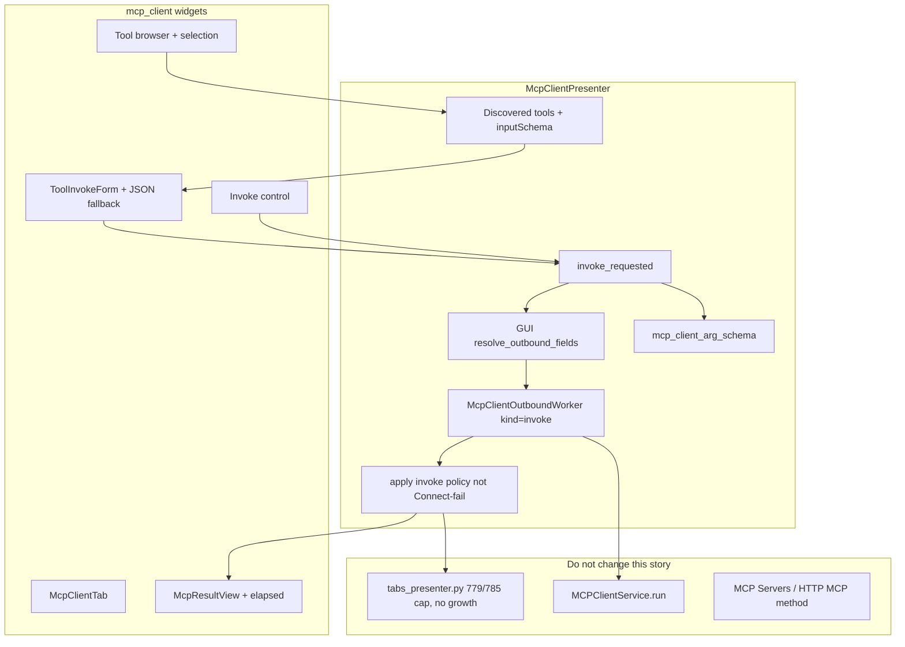

# PYPOST-1170: Interactive call_tool and response pane

Step 2 artifact for PYPOST-1170 (MCP-TM-4). Turns the approved
requirements in [`10-requirements.md`](10-requirements.md) into a
high-level architecture for **select → fill → invoke → inspect** on the
existing MCP Client tab.

Parent research:
[`ai-tasks/PYPOST-1164/20-architecture.md`](../PYPOST-1164/20-architecture.md).
Shipped discovery (MCP-TM-3):
[`ai-tasks/PYPOST-1169/20-architecture.md`](../PYPOST-1169/20-architecture.md).

**Scope:** while connected with a discovered catalog, the user selects a
remote tool, fills a schema-guided argument form (or JSON fallback),
runs `call_tool` on the same resolved URL/headers as Connect, and
inspects a structured result with elapsed time. Failed invoke stays
connected and keeps tools. Invoke UI lives in `McpClientPresenter` and
`mcp_client` widgets. `tabs_presenter.py` stays at or under 785 LOC
with **no growth**.

**Not this story:** new picker paths, Connect/`list_tools`/Refresh
behavior, headers table, HTTP method **MCP**, Collections save of last
tool/args, inbound MCP, prompts/resources/protocol trace, persistent
SDK `ClientSession` holder, growing `tabs_presenter.py`.

## Research

### R-1 Competitive invoke loop

**Postman MCP request** (interact docs):

<https://learning.postman.com/docs/use/send-requests/protocols/mcp-requests/interact.md>

- After **Load Capabilities**, pick a tool; Postman builds JSON from the
  schema.
- **Run** sits next to Connect/Disconnect. **Response** is a separate
  pane. Connection chrome does not follow Run.
- Closest analog: Connect stays; Run is a distinct action.

**MCP Inspector (web)**
([docs](https://modelcontextprotocol.io/docs/2026-07-28/tools/inspector/web),
[JSON fallback](https://github.com/modelcontextprotocol/inspector/pull/284)):

- Tools tab: pick a tool; `inputSchema` renders as a form.
- Nested/union/unknown types fall back to a JSON editor.
- Result shows content blocks, errors, and structured content.
- Gold standard for form + JSON fallback + structured result.

**MCP spec `tools/call`**
([tools](https://modelcontextprotocol.io/specification/2025-11-25/server/tools)):

- Params `{ "name", "arguments" }` (`arguments` is a JSON object).
- Result: `content[]`, optional `structuredContent`, optional `isError`.
- Tool execution errors use `isError: true` in the **result**, not a
  dropped session. UI must treat `isError` as a failed **call**, not a
  failed Connect.

**PyPost today:**

- Browser is name/description only; `_parse_tools` drops `inputSchema`.
- `MCPClientService.run(..., "call_tool", {"name", "arguments"})` already
  works for HTTP method **MCP**. The MCP Client tab never starts it.
- Gap: the catalog cannot be exercised from the dedicated tab.

**Adopt for v1:**

1. Select from the **existing** browser (not a second catalog).
2. Flat object schemas → field form (required vs optional visible).
3. Missing, empty-of-fields, nested, or union schemas → JSON object
   editor; empty-argument tools invoke with `{}` and no dummy fields.
4. **Invoke** is a distinct control from Connect/Refresh.
5. Result pane shows content vs errors plus elapsed time from
   `ResponseData.elapsed_time`.
6. Failed invoke chrome is **connected with an error in the result
   area**, never Failed-Connect (not connected, empty tools).

**Defer:** Inspector protocol transcript, prompts/resources, elicitation,
MCP Apps preview, outputSchema validation of `structuredContent`,
image/audio content widgets (show a typed placeholder + JSON).

### R-2 Current codebase (repo facts)

- **`McpClientPresenter`:** GUI `resolve_outbound_fields`; Connect/Refresh
  start the worker with `operation="list_tools"`; `_parse_tools` keeps
  only `(name, description)`. **Impact:** add `select_tool` /
  `invoke_requested`; keep schema in an in-memory catalog; Invoke is a
  new worker **kind**, not a `list_tools` apply path.
- **`McpClientOutboundWorker`:** already takes `operation`,
  `call_params`, `generation`, `kind`. **Impact: reuse as-is.** Invoke:
  `operation="call_tool"`, `call_params={"name", "arguments"}`,
  `kind="invoke"`. Do not call `execute_outbound` on the worker.
- **`execute_outbound`:** sync resolve-then-run (PYPOST-1167). **Impact:**
  keep for unit tests. Live Invoke must not run this body on a `QThread`.
- **`MCPClientService.run`:** one-shot initialize + `list_tools` or
  `call_tool`, then close. `elapsed_time` already set. **Impact: no API
  change.** Chrome `CONNECTED` remains last successful discovery, not a
  held SDK session.
- **`McpClientToolBrowser`:** inner id `MCP_CLIENT_TOOL_BROWSER`; no
  selection-to-presenter signal. **Impact:** emit selection; stash tool
  **name** on `UserRole`. Do not put invoke chrome in `TabsPresenter`.
- **`McpClientTab`:** bar, error label, headers, browser. **Impact:**
  add invoke column (form/JSON + Invoke + result) beside or below the
  browser. Wire Invoke to the presenter.
- **`McpClientSessionState`:** `DISCONNECTED` / `CONNECTING` /
  `CONNECTED` / `FAILED`. **Unchanged.** Invoke in-flight and failed
  invoke stay `CONNECTED`. Do not reuse `FAILED` or `CONNECTING`.
- **`tabs_presenter.py`:** 779 / 785 LOC (audit cap 785). Factory already
  builds `McpClientPresenter`. **Do not grow this file.** No invoke
  slots, widgets, or extra `isinstance` branches.
  [PYPOST-1184](https://pypost.atlassian.net/browse/PYPOST-1184) only if
  a later story cannot fit factory lines.
- **Env / sanitizer:** `sanitize_text` on Connect/Refresh errors.
  **Impact:** same sanitizer on invoke errors, status, and result text
  (NFR-4).
- **Metrics:** `mcp_client_connect_total`, `mcp_client_list_tools_total`.
  **Impact:** add `mcp_client_call_tool_total` (not inbound
  `mcp_requests_received_total`).
- **HTTP method MCP:** still encodes list/call in the HTTP editor.
  Unchanged (MCP-TM-6).

### R-3 Session model for Invoke (one-shot vs held `ClientSession`)

Parent PYPOST-1164 preferred a tab-lifetime `ClientSession` so Invoke
reuses initialize. MCP-TM-3 shipped one-shot `run` and defined
`CONNECTED` as last successful **discovery**, not a live socket.

- **A — Reuse worker `run(..., "call_tool")` (recommended):** GUI resolve
  then worker initialize + `call_tool` + close with the same resolved
  URL/headers as Connect. Matches TM-3, FR-3.2, and failed-invoke
  must not drop a socket that is not held.
- **B — New `MCPClientSession` holder this story:** Connect keeps
  streams; Invoke reuses them. Better for stateful session IDs, but
  duplicates transport and is larger than TM-4 needs given TM-3 chrome.
- **C — Sync `execute_outbound("call_tool")` on the GUI thread:** blocks
  up to 25s. **Rejected** (NFR-5).
- **D — Worker calls current `execute_outbound`:** hits
  `_sync_fields_from_tab` off the GUI thread. **Rejected** (Qt affinity).

FR-3.2 “already connected session” maps to TM-3 chrome: `CONNECTED`,
same resolved URL/headers, already discovered catalog. Invoke does
**not** re-list. Refresh remains the way to re-list.

A later story may add a session holder; it must still pass
`headers=` and must not move invoke into `tabs_presenter.py`.

### R-4 Schema form vs JSON fallback

Inspector’s form only covers simple property types; unions and nested
objects use JSON
([inspector#284](https://github.com/modelcontextprotocol/inspector/pull/284)).
Requirements: not every schema becomes a full form (FR-2.3 / Q&A).

- **Missing `inputSchema`, or not a JSON object:** JSON editor (default
  `{}`). Payload is a parsed object, or `{}` if empty **and** the tool
  has no fields.
- **`type: object` with no / empty `properties`:** no dummy fields; JSON
  optional. Payload `{}` without dummy JSON.
- **Flat object properties only** (`string`, `number`, `integer`,
  `boolean`, or string `enum`; no `$ref` / `oneOf` / `anyOf` / `allOf` /
  nested object / array): schema form **and** a JSON fallback control.
  Form → object; JSON mode → parsed object.
- **Nested object, array, composition keywords, unknown types:** JSON
  editor only. Payload is a parsed JSON object.

**Simple form field rules:**

- Required (`schema.required`) vs optional is visible on the field.
- Invoke from the **form** is blocked when a required field is empty
  (no `run` call).
- Invoke from **JSON** is blocked when the text is not a JSON object
  (array/primitive/invalid JSON). Empty JSON for a no-arg tool is `{}`.
- Switching the selected tool **replaces** the argument area (FR-2.5).
  Do not submit the previous tool’s values under the new name.

Put the classifier in a **Qt-free** module so Step 3/4 can unit-test
form vs JSON without `qapp` (for example
`pypost/core/mcp_client_arg_schema.py`).

Do not add `react-jsonschema-form` or a web view. Qt widgets only.

### R-5 Failed invoke vs Connect / Refresh (mandatory chrome)

- **Invoke success:** session `CONNECTED`; tools kept; result pane shows
  content (and `structuredContent` if present) plus elapsed.
- **Tool `isError: true`:** session `CONNECTED`; tools kept; result pane
  marked **error** plus elapsed; not Failed-Connect.
- **Invoke `ExecutionError`:** session `CONNECTED`; tools kept; error in
  the result / invoke area. Connect error label is not Failed-Connect
  chrome.
- **Client validation** (required empty, bad JSON, no selection,
  disconnected): session unchanged; visible error; **no** `run`.
- **Failed Connect (TM-3):** `FAILED`; empty tools;
  `MCP_CLIENT_ERROR_LABEL`.
- **Failed Refresh (TM-3):** `CONNECTED`; stale list;
  `MCP_CLIENT_ERROR_LABEL`.
- **Disconnect / teardown:** `DISCONNECTED`; empty tools; no leftover
  selection, args, or last result; clear the result pane.

Do **not** route invoke errors through `_apply_connect_failure`.

**In-flight:** `_invoke_in_flight` is orthogonal to `_list_in_flight`
and to the session enum. Invoke busy is **not** `CONNECTING`.

- **Invoke in flight:** session `CONNECTED`. Result pane shows
  “Invoking…” (or equivalent); previous result is not current. Disable
  Invoke; ignore a second Invoke (FR-3.5). Disable Refresh/Connect so
  the catalog cannot swap mid-call. Disconnect is allowed (bump
  generation).
- **Connect / Refresh in flight:** TM-3 session and cues. Disable Invoke
  while a list is running.

Late invoke results: if `generation != current`, ignore (Disconnect,
teardown, superseded). Apply **invoke** policy from stamped
`kind="invoke"`, never from the Connect/Refresh apply methods.

### R-6 LOC budget (`tabs_presenter.py` 779 / 785)

Allowed this story: **no edits** to `tabs_presenter.py`.

Forbidden in that file: Invoke slots, argument widgets, result pane,
`call_tool` workers, extra `McpClientTab` branches.

If Step 4 somehow needs a factory line, **stop** and land PYPOST-1184
first. Do not raise the 785 cap.

## Implementation Plan

### High-level approach

Keep the PYPOST-1169 Connect/Refresh worker. Extend the presenter
catalog to retain `inputSchema`. Selecting a browser row rebuilds an
invoke column (simple form and/or JSON). Invoke resolves URL/headers
on the GUI thread, then starts the **existing**
`McpClientOutboundWorker` with `operation="call_tool"` and
`kind="invoke"`. The result pane renders `CallToolResult` JSON plus
`elapsed_time`. Failed invoke stays `CONNECTED` with tools kept.
Widgets and presenter own all new chrome. `MCPClientService` and
`TabsPresenter` stay unchanged.

### Sequencing (Step 4)

```
Keep inputSchema in presenter catalog + browser selection
  → Arg schema classifier (simple form vs JSON vs no-arg)
    → Invoke column widgets (form, JSON, Invoke, result pane)
      → Presenter invoke_requested: validate, GUI resolve, worker call_tool
        → Apply invoke success / isError / ExecutionError (stay CONNECTED)
          → Disconnect/Refresh selection rules; clear result on disconnect
            → Outbound mcp_client_call_tool_total (not inbound)
```

No production code in this step.

### Mandatory — Failing Repro (next Step 3)

This story has runtime GUI and presenter behavior. Step 3 writes **red**
automated tests **before** any production fix. No live MCP server, no
uvicorn, no `QMenu.exec()`. Inject a mock `MCPClientService` (same
pattern as `test_connect_lists_tools_in_browser`). Module
`pytestmark = pytest.mark.timeout(30)` or `60` for GUI files
(do-testing: GUI tests must not use `timeout(method="thread")`). Bound
any `processEvents` / wait loop (`wait_until`).

**Sequencing:** this document → Step 3 red tests (fail on today’s
discover-only tab) → Step 4 until green. Do not implement Invoke,
schema form, or result pane in Step 3.

#### Why these tests fail today

- Select a listed tool and show a schema form: browser has no
  selection-to-invoke path; schema is dropped.
- Invoke calls `run` with `"call_tool"`, `{"name", "arguments"}`, and
  `headers=`: worker kinds are only connect/refresh with `list_tools`.
- Result pane shows structured content and elapsed time: no result pane.
- Failed invoke stays connected with tools kept: N/A (no Invoke); a
  shared Connect-fail handler would empty tools.
- JSON fallback / no-arg invoke / required-field block: no argument UI.

#### Primary A — Invoke `call_tool` and show result (FR-1, FR-2, FR-3, FR-4)

- **Where:** `tests/test_mcp_client_tab.py` (GUI, `qapp`)
  `test_invoke_call_tool_displays_structured_result` (name may vary).
- **Setup:** `_build_draft_tab()` with `mcp_client=MagicMock()`. First
  `run` return is `ResponseData` with JSON
  `{"tools": [{"name": "echo", "description": "Echo tool",
  "inputSchema": {"type": "object", "properties": {"text":
  {"type": "string"}}, "required": ["text"]}}]}`. Second `run` return
  is `ResponseData` with body
  `{"content": [{"type": "text", "text": "hello"}]}` and
  `elapsed_time=0.12`. URL non-empty.
- **Act:** Connect and wait until the browser has `echo`. Select that
  row. Fill the `text` field (or JSON `{"text": "hello"}` if the form
  is not yet distinct in the red test). Click **Invoke**
  (`MCP_CLIENT_INVOKE_BUTTON`). Drain until the result pane has text
  or timeout.
- **Assert:** a `run` call used operation `"call_tool"` and
  `call_params` with `name=="echo"` and arguments containing `text`.
  Keyword `headers=` is a dict. Result pane
  (`MCP_CLIENT_RESULT_PANE`) shows **hello** as readable content (not
  only an undifferentiated blob). Elapsed time is visible. Badge
  stays **Connected**. Page is still `McpClientTab` (no
  `METHOD_COMBO`).
- **Force failure without live MCP:** mock `run` only. Today there is
  no Invoke button (`findChild` is `None`) and Connect never stores
  schema.

#### Primary B — Failed invoke is not failed Connect (FR-5)

- **Where:** same GUI module
  `test_invoke_error_keeps_connected_and_tools`.
- **Setup:** Connect with one tool as in Primary A. Then set
  `run.side_effect = ExecutionError(category=NETWORK, message="...")`
  **or** return a successful `ResponseData` for list and error only
  when `operation=="call_tool"` (prefer a side_effect that inspects
  args).
- **Act:** select the tool, Invoke, drain until the invoke error is
  visible.
- **Assert:** badge remains **Connected** (not Failed / Disconnected).
  Tool count stays 1. Result / invoke area shows the error (sanitized
  if the fixture includes a hidden env value). Chrome must **not**
  match TM-3 failed Connect (not connected, empty browser).
- **Force failure:** no Invoke path today; the test cannot find the
  control.

#### Primary C — Schema form vs JSON vs validation (FR-2)

Prefer **one GUI test plus one Qt-free unit test** in Step 3 if both
are cheap; otherwise the GUI test is the red gate.

- **GUI — JSON fallback / no-arg:** Connect with a tool whose schema
  is missing or nested (`properties.payload.type == "object"`). Assert
  JSON editor (`MCP_CLIENT_ARG_JSON`) is available. Paste
  `{"payload": {"k": 1}}` (or leave empty for a no-properties tool)
  and Invoke; `arguments` is a dict. A no-arg tool Invokes without
  dummy fields.
- **Qt-free — classifier:** `tests/test_mcp_client_arg_schema.py`
  (`timeout(10)`): flat required string is simple; nested object is
  not; empty properties is no-arg. **Red today** because the module
  does not exist (`ImportError`) — that is an acceptable Step 3
  failure mode if the test imports the planned module.
- **Validation (same GUI file or a sibling):** required form field
  empty → visible error, `run` not called for `call_tool`. Invalid
  JSON (`[` or `{`) → visible error, no `call_tool`.

#### Supporting (same Step 3 batch if cheap)

- Switching tools replaces the argument area (FR-2.5): select tool A,
  fill a field, select tool B, Invoke; `name` is B and A’s value is
  not in `arguments`.
- Disconnect after a successful mocked invoke clears the result pane
  and selection (FR-4.5 / FR-1.2).
- Headers on Invoke: after Connect with `{{token}}` header, Invoke’s
  `run` received resolved headers (FR-3.2). Can live in
  `tests/test_mcp_client_presenter.py` with `timeout(10)` if widgets
  are not required; GUI file if they are.
- Second Invoke while in flight does not start another `call_tool`
  (FR-3.5): mock `run` that blocks until a flag; two clicks → one
  in-flight call. Only if a bounded wait stays simple; otherwise
  defer to Step 4 tests.

#### Out of Step 3

- Live Streamable HTTP server (`live_mcp_server`).
- `tabs_presenter.py` tests — factory already exists; do not add
  invoke logic there.
- Raising the 785 LOC cap.
- Persistent `ClientSession`.
- Pre-fill from HTTP method **MCP** body (MCP-TM-6).
- Collections save of last tool/args (MCP-TM-7).

## Architecture

### Recommended approach

**`McpClientPresenter` owns selection, argument binding, Invoke, and
result apply. New `mcp_client` widgets own the form, JSON editor,
Invoke control, and result pane. Live call: GUI
`resolve_outbound_fields` then existing `McpClientOutboundWorker` with
`call_tool`. `tabs_presenter.py` is untouched (785 LOC cap; no
growth). `MCPClientService` is unchanged.**

**Rationale:**

1. Requirements: exercise the **existing** browser and session chrome;
   do not invent a second tab kind.
2. TM-3 already solved Qt-safe outbound: resolve on GUI, worker
   `run(...)`. Invoke is the same pipe with a different operation.
3. 779 / 785 LOC: any invoke code in `TabsPresenter` fails the audit
   cap. Do not raise the cap.
4. Failed invoke must share **no** “clear tools and disconnect”
   handler with failed Connect (FR-5.2).
5. Simple JSON Schema subset + JSON fallback matches Inspector without
   a web form toolkit.

### Options considered

- **Chosen:** Presenter + reused worker + invoke column widgets.
- **Persistent `ClientSession` this story:** rejected (R-3); TM-3
  chrome model is one-shot `run`.
- **Put Invoke on `TabsPresenter` / HTTP Send:** rejected (LOC +
  wrong worker).
- **Sync `execute_outbound("call_tool")` on the GUI thread:** rejected
  (NFR-5).
- **Worker calls current `execute_outbound`:** rejected (Qt widgets).
- **Treat invoke `ExecutionError` like failed Connect:** rejected
  (FR-5.2).
- **Full nested JSON Schema form:** rejected for v1 (FR-2.3); JSON
  fallback.
- **Reuse `McpToolsOverviewDialog`:** inbound catalog. Rejected
  (parent).
- **Reuse HTTP response viewer as-is:** optional copy of formatting
  ideas only; MCP result is `CallToolResult`, not HTTP status/body
  tabs. New `McpResultView` in `mcp_client/`.

### System modules and responsibilities

- **`mcp_client_presenter.py`:** selection; catalog with `inputSchema`;
  `invoke_requested`; GUI resolve; start worker `kind=invoke`; apply
  invoke success / `isError` / `ExecutionError` without Connect-fail;
  clear selection/args/result on Disconnect; sanitize;
  `track_mcp_client_call_tool`.
- **`mcp_client_worker.py`:** unchanged contract. Invoke reuses it
  (`operation="call_tool"`, `call_params`, `kind="invoke"`).
- **`mcp_client_arg_schema.py` (new, Qt-free):** classify schema: simple
  fields vs JSON-only vs no-arg; list field specs.
- **`tool_browser.py`:** emit selection (current row → tool name). Keep
  name/description display. Optional `UserRole` name.
- **`tool_invoke_form.py` (new):** schema-guided fields + JSON fallback
  + **Invoke**. Expose collected arguments or a validation error.
- **`mcp_result_view.py` (new):** content blocks vs error, optional
  `structuredContent` JSON, elapsed time, in-progress placeholder.
- **`mcp_client_tab.py`:** splitter: existing browser + invoke column.
  Forward `set_invoke_model` / `set_result`. Wire Invoke and selection
  to the presenter. No `TabsPresenter` types.
- **`widget_ids.py`:** `MCP_CLIENT_INVOKE_BUTTON`, `MCP_CLIENT_ARG_FORM`,
  `MCP_CLIENT_ARG_JSON`, `MCP_CLIENT_RESULT_PANE`,
  `MCP_CLIENT_ELAPSED_LABEL` (names may match implementation).
- **`models/mcp_client.py`:** optional in-memory `McpRemoteTool`. Do not
  persist `last_tool_*` (MCP-TM-7).
- **`MCPClientService`:** unchanged.
- **`tabs_presenter.py`:** unchanged.
- **Metrics modules:** `mcp_client_call_tool_total{result=success|error}`.
  Distinct from list_tools and inbound `mcp_requests_received_total`.
- **HTTP / WebSocket / inbound MCP:** unchanged.

### Main interfaces / APIs

```python
class McpRemoteTool:
    name: str
    description: str
    input_schema: dict[str, Any] | None


class McpClientPresenter:
    def select_tool(self, name: str | None) -> None:
        """Bind argument UI to this catalog entry. None clears args."""

    def invoke_requested(self) -> None:
        """Validate args; GUI resolve; start worker call_tool kind=invoke."""


class McpClientOutboundWorker:
    # Existing. Invoke:
    #   operation="call_tool"
    #   call_params={"name": str, "arguments": dict}
    #   kind="invoke"
    #   url/headers already resolved on the GUI thread
    ...


def classify_arg_schema(schema: dict | None) -> ArgSchemaKind:
    """simple_form | json_only | no_args"""


class McpClientToolInvokeForm:
    def bind_tool(self, tool: McpRemoteTool | None) -> None: ...
    def collect_arguments(self) -> dict[str, Any]: ...
    # Raises / returns a user-visible validation error; does not call run.


class McpResultView:
    def set_in_progress(self) -> None: ...
    def set_result(self, payload: dict, elapsed_s: float, *,
                   is_error: bool) -> None: ...
    def set_error(self, message: str, elapsed_s: float | None) -> None: ...
    def clear(self) -> None: ...
```

**Parse tools (extend TM-3):** `json.loads(response.body)` → `tools`.
Keep `inputSchema` when it is a dict. Skip empty names. Missing
`tools` key remains a list failure (TM-3). Presenter holds
`list[McpRemoteTool]`; the browser still shows name + description.

**Invoke start (GUI thread only):**

1. If `_invoke_in_flight` or `_list_in_flight`, ignore.
2. If session is not `CONNECTED`, show invoke error; do not look
   connected; do not call `run`.
3. If no selected tool, show invoke error; no `run`.
4. Collect arguments from form or JSON (FR-2.6). On validation
   failure, show error; no `run`.
5. `resolved_url, resolved_headers = resolve_outbound_fields()`.
6. Increment `_outbound_generation`. Set `_invoke_in_flight`. Clear
   stale result (in-progress chrome, FR-4.4).
7. Start `McpClientOutboundWorker` with resolved fields,
   `operation="call_tool"`,
   `call_params={"name": selected, "arguments": args}`,
   `kind="invoke"`.

**Late invoke results:** if generation mismatch, ignore. Else clear
`_invoke_in_flight`. Success: parse JSON body; if `isError` is true,
show as error content still in the result pane; else show content /
`structuredContent`. Always show `elapsed_time`. `ExecutionError`:
sanitize `message`; stay `CONNECTED`; keep tools and selection.

**Refresh vs selection (FR-1.3 / FR-1.4):** if the selected name is
still in the new list, keep selection and the bound argument area. If
Refresh removed it, clear selection, args, and result; stay
`CONNECTED`.

**Disconnect / teardown:** bump generation; drop worker; clear tools,
selection, argument area, and result pane (FR-4.5).

**Logging:** `mcp_client_call_tool_initiated` / `_succeeded` /
`_failed` / `_ignored` with `connection_id` and `kind`. Do not log
URL, header values, or argument payloads. No `headers` substring on
INFO (keep TM-3 contract). ERROR-path tests must satisfy do-testing
caplog rules.

**Metrics:** increment `mcp_client_call_tool_total` only when a worker
`call_tool` settles (success `ResponseData`, including `isError`
tool results; error `ExecutionError`). Client-side validation does
not increment.

### Module diagram



### Component interaction

```mermaid
sequenceDiagram
    participant User
    participant Tab as McpClientTab
    participant Pres as McpClientPresenter
    participant Worker as McpClientOutboundWorker
    participant Svc as MCPClientService

    Note over User,Svc: Connect/Refresh unchanged from PYPOST-1169
    User->>Tab: Select tool
    Tab->>Pres: select_tool(name)
    Pres->>Tab: bind form or JSON from inputSchema

    User->>Tab: Fill args, Invoke
    Tab->>Pres: invoke_requested
    Pres->>Pres: validate; resolve_outbound_fields on GUI
    Pres->>Tab: result in-progress; stay CONNECTED
    Pres->>Worker: call_tool name+arguments kind=invoke
    Worker->>Svc: run(url, call_tool, headers=)
    alt transport success
        Svc-->>Worker: ResponseData body + elapsed_time
        Worker-->>Pres: finished generation+kind
        Pres->>Tab: structured result or isError; elapsed
    else ExecutionError
        Worker-->>Pres: ExecutionError
        Pres->>Tab: invoke error; stay CONNECTED; keep tools
    end
```

### Architectural patterns

- **Presenter coordination:** chrome events hit `McpClientPresenter`;
  widgets stay dumb (Python MVP, same as WebSocket / TM-3).
- **Pass-through outbound:** GUI resolve + worker `run` (PYPOST-1167 /
  PYPOST-1169). Invoke does not invent a second HTTP client.
- **Command + result on a worker thread:** one-shot `QThread` per
  Invoke; same class as list_tools; stamped `kind` selects the apply
  policy.
- **Distinct error policies:** Connect-fail, Refresh-fail, and
  Invoke-fail are three apply paths.
- **Strategy for arguments:** `mcp_client_arg_schema` chooses simple
  form vs JSON vs no-arg.
- **Peer editor isolation:** no `TabsPresenter` growth; PYPOST-1184
  remains the insert-before-plus extract.
- **Dependency injection:** tests inject `mcp_client=MagicMock()` as
  in TM-3.

### Boundary with later stories

- **MCP-TM-6 (PYPOST-1171):** convert-on-open may pre-select
  `last_tool_*`. This story does not read HTTP method **MCP** bodies.
- **MCP-TM-7 (PYPOST-1172):** persist last-selected tool and
  arguments on `McpClientConnection`. This story keeps selection in
  presenter memory only.
- **MCP-TM-8:** user-doc rewrite of the invoke loop.
- **PYPOST-1184:** extract insert-before-plus **before** any future
  factory growth. Not required here if the file is untouched.
- **Session holder:** optional follow-up if stateful Streamable HTTP
  session IDs prove necessary; not required to meet FR given TM-3.

## Q&A

- **Must Invoke list tools again?**
  No. Use the connected chrome and the already discovered catalog.
  Refresh remains the re-list action.
- **Must Invoke hold a live SDK session?**
  No for this story. One-shot `run("call_tool")` with the same
  resolved URL/headers as Connect. `CONNECTED` is TM-3 discovery
  chrome.
- **May invoke errors set `FAILED`?**
  No. `FAILED` is failed Connect only. Invoke stays `CONNECTED`.
- **May `tabs_presenter.py` gain Invoke wiring?**
  No. Stay at or under 785; this story makes **no** edits and does
  not raise the cap.
- **Is JSON only for errors?**
  No. Fallback for unfriendly schemas and a paste path for a full
  argument object (FR-2.3).
- **Does `isError: true` disconnect?**
  No. It is a tool execution error in the result pane (spec). Session
  and tools stay.
- **Does Disconnect keep the last result?**
  No. Clear selection, args, and result so a disconnected tab does
  not look live (FR-4.5).
- **Does this pre-fill from HTTP method MCP?**
  No. MCP-TM-6.
- **Does this save last tool/args?**
  No. MCP-TM-7.
- **Parent 1164 listed migration pre-select on MCP-TM-4. Which wins?**
  This story’s requirements: convert-on-open is out of scope. Parent
  AC moves to MCP-TM-6.

## References

- [`10-requirements.md`](10-requirements.md)
- [`ai-tasks/PYPOST-1164/20-architecture.md`](../PYPOST-1164/20-architecture.md)
- [`ai-tasks/PYPOST-1169/20-architecture.md`](../PYPOST-1169/20-architecture.md)
- [PYPOST-1170](https://pypost.atlassian.net/browse/PYPOST-1170)
- [PYPOST-1184](https://pypost.atlassian.net/browse/PYPOST-1184)
- Postman MCP interact:
  <https://learning.postman.com/docs/use/send-requests/protocols/mcp-requests/interact.md>
- [MCP Inspector web](https://modelcontextprotocol.io/docs/2026-07-28/tools/inspector/web)
- [MCP tools/call](https://modelcontextprotocol.io/specification/2025-11-25/server/tools)
- [Inspector JSON fallback](https://github.com/modelcontextprotocol/inspector/pull/284)
- `pypost/ui/presenters/mcp_client_presenter.py`
- `pypost/ui/presenters/mcp_client_worker.py`
- `pypost/ui/widgets/mcp_client/`
- `pypost/core/mcp_client_service.py`
- `pypost/ui/presenters/tabs_presenter.py` (779 / 785)
