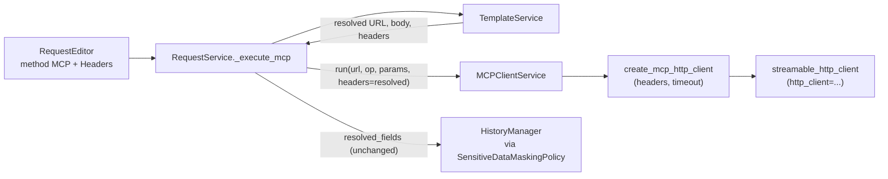

# PYPOST-1173: Forward resolved MCP request headers to the HTTP client

## Research

### Defect (confirmed in source)

`RequestService._execute_mcp` already treats headers as first-class request fields.
It renders URL, body, **and** headers through `TemplateService.render_string`, stores
them on `ResolvedRequestFields`, then drops the headers on the outbound call:

```134:134:pypost/core/request_service.py
        response = self.mcp_client.run(url, operation, call_params)
```

`MCPClientService.run` has no `headers` parameter. `_run_async` constructs the
Streamable HTTP client with timeout only:

```151:153:pypost/core/mcp_client_service.py
        async with create_mcp_http_client(timeout=timeout) as http_client:
            async with streamable_http_client(
                url, http_client=http_client
```

History still receives `resolved_fields` (including headers) via
`_build_history_entry` → `SensitiveDataMaskingPolicy.build_history_safe_fields`.
That is why Send looks complete while a header-gated MCP server never sees auth
(FR-3 is a consequence of FR-1, not a separate History feature).

Sole production caller of `MCPClientService.run` is `_execute_mcp`. Integration
tests call `service.run(url, "list_tools", None)` without headers
(`tests/test_mcp_server_integration.py`).

### Proven in-repo pattern (copy this, do not invent a new one)

`MCPProxyServerImpl._connect_upstream` already authenticates to upstream MCP
servers over Streamable HTTP:

1. Resolve templated headers (`_resolve_headers` / `resolve_proxy_headers`).
2. `create_mcp_http_client(headers=headers_dict, timeout=timeout)`.
3. `streamable_http_client(upstream_url, http_client=http_client)` — no
   `headers=` on the transport.

```128:133:pypost/core/mcp_proxy_server_impl.py
            timeout = httpx.Timeout(self.timeout)
            async with create_mcp_http_client(headers=headers_dict, timeout=timeout) as http_client:
                async with streamable_http_client(
                    self.upstream_url,
                    http_client=http_client,
                ) as (read_stream, write_stream, _get_session_id):
```

**Do not** reuse `resolve_proxy_headers` on the method-MCP path. Proxy fail-fast
raises `McpUnresolvedVariableError` when a placeholder is missing. Method MCP
(and HTTP) use `TemplateService.render_string`, which does not abort the send
for missing env vars. Header **resolution** stays in `_execute_mcp`; this ticket
only **forwards** the already-resolved map.

### mcp Python SDK 1.29.0 (installed + upstream)

Pinned in `requirements.txt` as `mcp==1.29.0` (`pyproject.toml`: `mcp>=1.27,<2`).
Inspected `.venv/lib/python3.13/site-packages/mcp/shared/_httpx_utils.py` and
`mcp/client/streamable_http.py`. Confirmed against
[v1.29.0 `_httpx_utils.py`](https://raw.githubusercontent.com/modelcontextprotocol/python-sdk/v1.29.0/src/mcp/shared/_httpx_utils.py)
and current
[client transports docs](https://py.sdk.modelcontextprotocol.io/client/transports/):

- `create_mcp_http_client(headers: dict[str, str] | None = None, timeout=..., auth=...)`
  copies `headers` onto `httpx.AsyncClient` when `headers is not None` (empty
  `{}` is not `None` and is valid).
- `streamable_http_client(url, *, http_client=..., terminate_on_close=...)` has
  **no** `headers=` argument. Passing one raises
  `TypeError: streamable_http_client() got an unexpected keyword argument 'headers'`.
- `StreamableHTTPTransport._prepare_headers` merges MCP protocol headers
  (`Accept`, `Content-Type`, session id) with the `httpx.AsyncClient` default
  headers; user `Authorization` / API-key headers on the client are preserved.

### Current tests (why the drop is invisible)

| File | What it covers | Gap |
| --- | --- | --- |
| `tests/test_mcp_client_service.py` | `run()` success/error mapping with `_run_async` mocked | Never reaches `create_mcp_http_client`; cannot prove headers |
| `tests/test_request_service.py` `TestRequestServiceMCP` | `execute` delegates to `mcp_client.run` and skips HTTP | Does not assert `run` call args; no header fixture |
| `tests/test_request_service.py` history tests | Masking on **HTTP** resolved fields | No MCP history case; masking policy already shared |
| `tests/test_mcp_server_integration.py` | Live `run(url, "list_tools", None)` | No outbound headers; must stay valid after optional param |

`pytestmark = pytest.mark.timeout(60)` is already on both unit modules
(do-testing skill: module-scope timeout).

### Out of scope (requirements)

- New masking rules (`SensitiveDataMaskingPolicy` already masks `resolved_fields`).
- MCP Client tab UI (PYPOST-1165 … PYPOST-1172 / MCP-TM-5).
- HTTP `HTTPClient.send_request` header path.
- SSE upstream on `MCPClientService` (proxy-only today).

### Language / architecture notes (Python)

- Type-hint the new parameter (`dict[str, str] | None = None`); keep Google-style
  docstring Args in sync.
- Thread the value through `anyio.run` as a positional argument into
  `_run_with_timeout` → `_run_async` (same pattern as `call_params`).
- Default `None` so existing `run(url, operation, call_params)` call sites stay
  valid.

## Implementation Plan

1. **Failing repro (Step 3, tests only)** — see below. No production edits.
2. **`MCPClientService.run`** — add optional `headers: dict[str, str] | None = None`.
   Document it. Pass `dict(headers or {})` into `_run_with_timeout` via `anyio.run`.
3. **`_run_with_timeout` / `_run_async`** — accept the same map. In `_run_async`,
   copy the proxy call:
   `create_mcp_http_client(headers=headers_dict, timeout=timeout)` then
   `streamable_http_client(url, http_client=http_client)`. Do not add `headers=`
   to `streamable_http_client`.
4. **`RequestService._execute_mcp`** — change the call to
   `self.mcp_client.run(url, operation, call_params, headers=resolved_headers)`.
   Keep existing template rendering; do not re-resolve headers.
5. **Empty / absent headers** — `request.headers` defaults to `{}`; pass that
   through. `create_mcp_http_client(headers={})` is not an error (FR-2).
6. **History / masking** — no code change. `resolved` already includes headers;
   once they are transmitted, History matches the wire (FR-3, NFR-1).
7. **HTTP path** — untouched (FR-5).
8. **Observability (Step 6)** — optional debug of header **keys** / count, never
   values (same as proxy `header_keys=%s`). No new metrics required for this debt
   ticket unless Step 6 finds a gap.
9. **Dev docs (Step 8)** — `doc/dev/mcp_integration.md` still says MCP-TM-5 will
   fix the drop; update to this ticket. `doc/dev/request_execution.md` should
   note that MCP renders headers in `_execute_mcp` and forwards them to
   `MCPClientService`.

**Mandatory — Failing Repro (next Step 3):**

This is a runtime behavioral change. Step 3 writes automated red tests **before**
any production fix. Sequencing: research (this file) → red tests → Step 4 until
green.

**Primary — `tests/test_mcp_client_service.py`**

- New test (name suggestion:
  `test_run_passes_headers_to_create_mcp_http_client`).
- **Asserts (desired behavior):** `MCPClientService.run(..., headers={...})`
  invokes `create_mcp_http_client` with that same mapping (and existing
  timeout). Protocol headers from `_prepare_headers` are not the assertion
  target — user outbound headers on the factory are.
- **How to force without live MCP:** do **not** patch `_run_async` (that is why
  the gap is invisible today). Patch
  `pypost.core.mcp_client_service.create_mcp_http_client`,
  `streamable_http_client`, and `ClientSession` as async context managers;
  stub `list_tools` / `model_dump` so `run()` returns 200 with no network.
- **Why it is red today:** `run()` rejects `headers=`
  (`TypeError: ... unexpected keyword argument 'headers'`), or, if the
  signature is added without wiring, `create_mcp_http_client` is still called
  without `headers=`.
- Keep module `pytestmark = pytest.mark.timeout(60)`. Existing `_run_async`
  tests stay as they are.

**Secondary — `tests/test_request_service.py` (`TestRequestServiceMCP`)**

- New test (name suggestion:
  `test_execute_mcp_forwards_resolved_headers_to_mcp_client`).
- **Asserts:** `execute` of method MCP with
  `headers={"Authorization": "Bearer {{token}}"}` and
  `variables={"token": "secret"}` calls
  `mcp_client.run(..., headers={"Authorization": "Bearer secret"})` (keyword
  or inspect `call_args`).
- **How to force without live MCP:** keep `self.svc.mcp_client = MagicMock()`
  as the class already does; assert on `run.call_args`.
- **Why it is red today:** `run` is called with three arguments only.
- Also assert the empty-header path: no headers configured → `run` still
  called, `headers={}` (or equivalent empty mapping), no exception (FR-2).

Do not add a live server test in Step 3. Do not change production modules.

## Architecture

### Module diagram (change is a wiring gap, not a new layer)



HTTP Send remains `RequestService` → `HTTPClient.send_request` and is not on
this diagram.

### Components and responsibilities

| Module | Responsibility | Change |
| --- | --- | --- |
| `pypost/core/request_service.py` `_execute_mcp` | Resolve templates; dispatch MCP; return `ResolvedRequestFields` | Pass `headers=resolved_headers` into `mcp_client.run` |
| `pypost/core/mcp_client_service.py` | Sync wrapper around Streamable HTTP MCP session | Accept `headers`; forward to `create_mcp_http_client` |
| `mcp.shared._httpx_utils.create_mcp_http_client` | Build `httpx.AsyncClient` with MCP defaults | **No change** — already accepts `headers` |
| `mcp.client.streamable_http.streamable_http_client` | MCP transport over pre-configured client | **No change** — consumes `http_client` |
| `pypost/core/mcp_proxy_server_impl.py` | Upstream proxy auth pattern | **Reference only** — do not couple method MCP to proxy |
| `pypost/core/mcp_proxy_headers.py` | Proxy fail-fast resolve + sanitize | **Not used** on this path |
| `pypost/core/sensitive_data_masking_policy.py` | History-safe fields | **No change** |
| `pypost/core/template_service.py` | `{{ variable }}` substitution | **No change** — already used in `_execute_mcp` |
| UI / MCP Client tab | Future editor | **Out of scope** |

### Patterns

- **Pass-through of already-resolved fields** — `_execute_mcp` owns resolution;
  `MCPClientService` owns transport. Same split as URL/body today.
- **Factory + injected HTTP client** — headers live on `httpx.AsyncClient`, not
  on the MCP transport (SDK contract).
- **Copy existing proxy Streamable HTTP wiring** — one known-good call shape.
- **Dependency injection** — `RequestService(mcp_client=...)` remains the test
  seam for the request-service red test; client-service tests patch the SDK
  factory instead of `_run_async` for the header assertion.

### Public interface

```python
class MCPClientService:
    def run(
        self,
        url: str,
        operation: str,
        call_params: dict[str, Any] | None = None,
        headers: dict[str, str] | None = None,
    ) -> ResponseData: ...
```

Internal (same module only):

```python
async def _run_with_timeout(
    self,
    url: str,
    operation: str,
    call_params: dict[str, Any],
    headers: dict[str, str],
) -> str | dict: ...

async def _run_async(
    self,
    url: str,
    operation: str,
    call_params: dict[str, Any],
    headers: dict[str, str],
) -> str | dict: ...
```

Call site:

```python
self.mcp_client.run(url, operation, call_params, headers=resolved_headers)
```

`headers=None` and `headers={}` are both valid. Normalize with
`dict(headers or {})` before `anyio.run` so `_run_async` always receives a
`dict[str, str]`.

### Data flow (Send)

1. User configures Headers on method MCP (Bearer / API key / `{{ var }}`).
2. `RequestService.execute` branches on `request.method == "MCP"`.
3. `_execute_mcp` renders URL, body, and header keys/values from `variables`.
4. `MCPClientService.run` opens a Streamable HTTP session whose `httpx.AsyncClient`
   carries those resolved headers.
5. `resolved_fields` (including headers) is recorded in History and masked by
   existing policy.

### Non-goals of this architecture

- Persistent MCP session across Sends (still one `run()` / one handshake).
- SSE client path on `MCPClientService`.
- Changing proxy header resolution or sanitization.
- New UI chrome.

## Q&A

**Q: Why not wait for PYPOST-1167 (MCP-TM-5)?**

A: That story is a new editor behind unstarted work. Auth is already broken on
the shipped method-MCP path. See
[PYPOST-1173](https://pypost.atlassian.net/browse/PYPOST-1173) and
[PYPOST-1164](https://pypost.atlassian.net/browse/PYPOST-1164) tech debt.

**Q: Why not pass `headers=` to `streamable_http_client`?**

A: mcp 1.29.0 removed that argument. Headers belong on the `httpx.AsyncClient`
from `create_mcp_http_client`. Official docs:
[Client transports](https://py.sdk.modelcontextprotocol.io/client/transports/).

**Q: Why not call `resolve_proxy_headers`?**

A: Proxy aborts on unresolved `{{ VAR }}`. HTTP/MCP request Send uses
`TemplateService.render_string` and still sends. Mixing the two would change
method-MCP error semantics (out of scope).

**Q: Does History need a separate product change?**

A: No. `_build_history_entry` already records `resolved.headers`. Once those
headers are transmitted, the record matches the wire. Existing masking stays.

**Q: What if the user configured no headers?**

A: `resolved_headers` is `{}`. `run(..., headers={})` must succeed (FR-2).

**Q: Will existing `run(url, operation, call_params)` callers break?**

A: No. `headers` is optional with default `None`. Live integration
`test_mcp_client_service_list_tools_over_live_streamable_http` stays valid.

**Q: Should we log Authorization values for debugging?**

A: No. Follow the proxy pattern: log header **keys** only (Step 6). Secrets
stay masked in History via `SensitiveDataMaskingPolicy`.

**Q: Is SSE in scope because the proxy supports it?**

A: No. `MCPClientService` is Streamable HTTP only. SSE remains proxy-only.

## References

- [PYPOST-1173](https://pypost.atlassian.net/browse/PYPOST-1173)
- Approved requirements: `ai-tasks/PYPOST-1173/10-requirements.md`
- Proxy pattern: `pypost/core/mcp_proxy_server_impl.py`
- SDK helper (installed 1.29.0): `mcp.shared._httpx_utils.create_mcp_http_client`
- [create_mcp_http_client source v1.29.0](https://raw.githubusercontent.com/modelcontextprotocol/python-sdk/v1.29.0/src/mcp/shared/_httpx_utils.py)
- [MCP Python SDK client transports](https://py.sdk.modelcontextprotocol.io/client/transports/)
