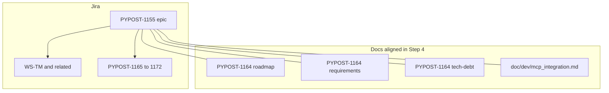

# PYPOST-1174: Epic placement architecture (option a)

## Research

This task is Jira process plus four markdown files. There is no runtime module graph
in `pypost/`. Architecture is how planning surfaces stay consistent: one epic, honest
title and labels, matching docs.

Jira treats an epic as a parent container. Board filters and reports use **summary**
(and **Epic Name** where the project still has that field) plus **labels**. If those
tokens name only WebSocket while MCP Client stories sit under the same parent, people
who trust the epic under-count MCP work. Atlassian guidance: epic names stay clear and
descriptive; labels (or extra fields) carry extra grouping, not a second parent. See
[Epic Name vs Epic Link](https://support.atlassian.com/jira/kb/epic-name-vs-epic-link/)
and naming notes that keep the name stable and put volatile grouping in labels.

Sprint 1610 already shipped MCP-TM stories as children of PYPOST-1155. Option **(b)**
(new sibling epic and reparent) would rewrite that history. Option **(a)** keeps the
parent and makes title and labels match the children.

PYPOST-1164 left rename vs sibling open (`20-architecture.md` “either works”). This
ticket closes that as **(a)** only.

## Implementation Plan

1. Orchestrator updates Jira **PYPOST-1155** with the field values in
   **Orchestrator Jira apply (PYPOST-1155)** below. This execution agent does not call
   Jira MCP.
2. Keep **PYPOST-1165 … PYPOST-1172** parented to PYPOST-1155. Do not create a sibling
   MCP epic. Do not reparent WebSocket, research, later MCP-TM, or related-debt
   children.
3. Align four artifacts so they name the renamed epic and option **(a)** (Step 4):
   - `ai-tasks/PYPOST-1164/00-roadmap.md`
   - `ai-tasks/PYPOST-1164/10-requirements.md`
   - `ai-tasks/PYPOST-1164/60-tech-debt.md`
   - `doc/dev/mcp_integration.md`
4. Historical PYPOST-1164 text that deferred the choice stays as history, then points
   at PYPOST-1174 option **(a)**. Do not pretend the deferral never happened.

**Mandatory — Failing Repro (next Step 3):** N/A — no behavioral change. This ticket
does not change PyPost runtime, UI, or tests. There is no red test that can fail today
and pass after a product fix. Step 3 records N/A only.

## Architecture



| Module | Responsibility |
| --- | --- |
| Epic PYPOST-1155 | Single parent for blank-tab protocol-mode work (HTTP, WS, MCP) |
| Child issues | Stay linked; MCP-TM keys 1165–1172 stay under this epic |
| Labels | Must not read as websocket-only; cover protocol families parented |
| PYPOST-1164 artifacts | State option (a); stop saying “either works” |
| `mcp_integration.md` | Cite the renamed epic as the shared protocol-mode parent |

**Patterns:** one planning parent (no sibling epic); honest naming; docs follow Jira.

**Interfaces:** Jira REST/MCP `update issue` on PYPOST-1155 (summary, labels, Epic Name
if present). Markdown edits are documentation only. No `pypost/` APIs.

### Orchestrator Jira apply (PYPOST-1155)

This agent cannot call Jira MCP. The orchestrator applies **exactly** these values.

**Issue:** `PYPOST-1155`

| Field | Exact value |
| --- | --- |
| `summary` | `Tab protocol modes — blank-tab protocol selector` |
| Epic Name (same string if that field is on the screen) | same as `summary` |

**Labels (not websocket-only):** keep existing labels that still apply, including
`websocket` if already set (WS-TM children remain). **Add** these if missing:

- `mcp`
- `ux`
- `documentation`

Do **not** remove `websocket` solely to “fix” scope; adding `mcp` (and `ux`,
`documentation`) is what stops a websocket-only filter from describing the epic.

**Do not change:** issue type, parent of PYPOST-1155, sprint of any issue, description
body unless the orchestrator needs one sentence that the epic covers HTTP, WebSocket,
and MCP Client blank-tab modes. **Do not** create a new epic. **Do not** reparent
PYPOST-1165 … PYPOST-1172 (or other current children).

**Suggested `jira_update_issue` fields object:**

```json
{
  "summary": "Tab protocol modes — blank-tab protocol selector",
  "labels": ["websocket", "mcp", "ux", "documentation"]
}
```

If the live issue already has other labels, **union** them with `mcp`, `ux`, and
`documentation`. Do not drop unrelated labels. If Epic Name is a separate required
field, set it to the same string as `summary`.

**Children:** no `parent` / Epic Link updates. Confirm PYPOST-1165 … PYPOST-1172 still
list PYPOST-1155 as parent after the rename.

**This ticket (PYPOST-1174):** stays **outside** PYPOST-1155 (planning fix, not MCP
tab delivery). Do not parent 1174 under 1155 as part of this apply.

## Q&A

- **Q:** Why not a sibling MCP epic?
  **A:** Requirements rejected (b). Stories already live under 1155; sprint 1610
  shipped them there.

- **Q:** Why keep the `websocket` label?
  **A:** WS-TM work is still in the epic. Honesty is “not websocket-only”, not
  “websocket disappeared”. Adding `mcp` (plus `ux` and `documentation`) is enough.

- **Q:** Why no red test?
  **A:** Docs and Jira fields only. No application behavior to assert.

- **Q:** Who writes Jira?
  **A:** Orchestrator. Values above are the contract.
