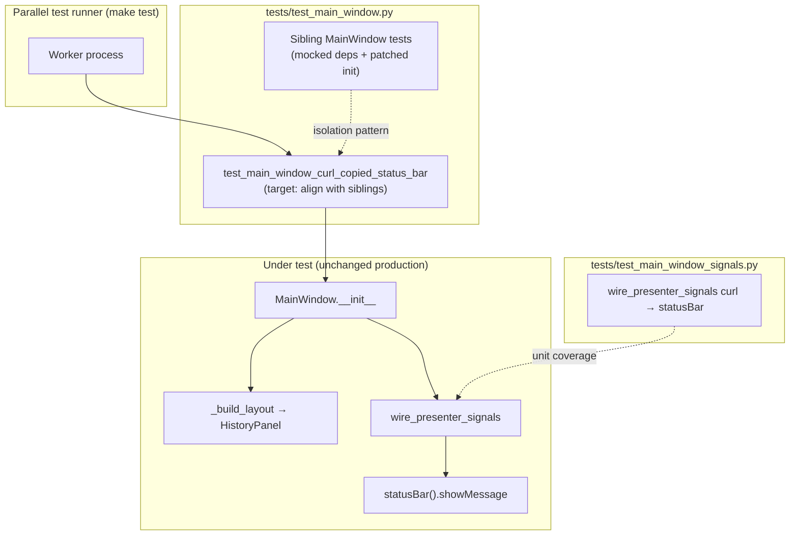

# PYPOST-1177: Fix parallel Qt crash in test_main_window_curl_copied_status_bar

## Research

- **Failure mode:** `tests/test_main_window.py::TestMainWindow::test_main_window_curl_copied_status_bar` passes in isolation but crashes the parallel worker under `make test` (Bus error −7 / segfault −11). Jira and `10-requirements.md` document background history loading on a worker thread colliding with Qt offscreen UI init during unpatched `MainWindow` construction.
- **Sibling pattern:** Other `TestMainWindow` cases that construct `MainWindow` inject `history_manager=MagicMock()`, patch `StateManager` / storage / request managers, stub presenter widgets, and patch heavy init (`apply_settings`, `_create_menu_bar`, `_setup_shortcuts`). The curl status-bar test is the outlier — it only patches three presenters and runs full constructor side effects.
- **Coverage split:** `tests/test_main_window_signals.py::test_wire_presenter_signals_connects_curl_copied_status_bar` already locks `wire_presenter_signals` curl → status-bar wiring at unit level. The integration test must keep emitting `history_panel.curl_copied` on a real `HistoryPanel` after `wire_presenter_signals` runs, without re-running real async history I/O.
- **Production code:** No MainWindow or HistoryPanel behavior change expected; scope is test harness isolation only.

## Implementation Plan

1. **Align `test_main_window_curl_copied_status_bar`** with the module’s established `MainWindow` fixture boundaries:
   - Inject `history_manager=MagicMock()` so `wire_presenter_signals` does not trigger real `load_async`.
   - Patch `StateManager`, `StorageManager`, `ConfigManager`, `RequestManager`, `MCPServerManager`, and presenter return values (same as `test_build_layout_sidebar_is_qtabwidget` / `test_constructor_stores_injected_dependencies`).
   - Patch `apply_settings`, `_create_menu_bar`, `_setup_shortcuts`, and `resolve_encryption_enabled`.
   - **Do not** patch `wire_presenter_signals` or `_build_layout` — preserve integration assertion: emit `curl_copied` → status bar `"Copied to clipboard"` for 3000 ms.
2. **Verify** with `make test` (parallel runner) and confirm `tests/test_main_window_signals.py` still passes.
3. No production module edits unless verification proves otherwise (not expected).

**Mandatory — Failing Repro (next Step 3):** **N/A — failure already documented.** The defect is an infrastructure crash under the parallel runner, not missing product behavior. Requirements and Jira record reproduction (`make test` fails; isolated pytest passes). Step 4 applies the test-only isolation fix; no new red test is required before the fix.

## Architecture

| Module / component | Responsibility | Change |
| --- | --- | --- |
| `test_main_window_curl_copied_status_bar` | Integration: real layout + wiring, assert status-bar message on `curl_copied` | Apply sibling isolation patches |
| `test_main_window_signals.py` | Unit: `wire_presenter_signals` connects curl to status bar | None |
| `MainWindow` / `HistoryPanel` / `wire_presenter_signals` | Production curl-copy UX | None |

**Pattern:** Test isolation via dependency injection and targeted `unittest.mock.patch` on heavy constructor paths — consistent with existing `TestMainWindow` conventions and `do-testing` GUI timeout rules (`pytestmark = pytest.mark.timeout(60)` already on the class).

**Interfaces under test (unchanged):** `HistoryPanel.curl_copied` → `MainWindow.statusBar().showMessage("Copied to clipboard", 3000)` via `wire_presenter_signals`.

## Q&A

| Question | Answer |
| --- | --- |
| Why no new Step 3 red test? | Crash is already reproducible under `make test`; task is test stabilization, not new behavior. |
| Why keep integration test if signals are unit-tested? | Requirements FR-2: preserve full-construction path assertion; unit test does not exercise real `HistoryPanel` + `statusBar()` after `_build_layout`. |
| Production changes? | Not expected; mock boundaries prevent real history async load during parallel workers. |
