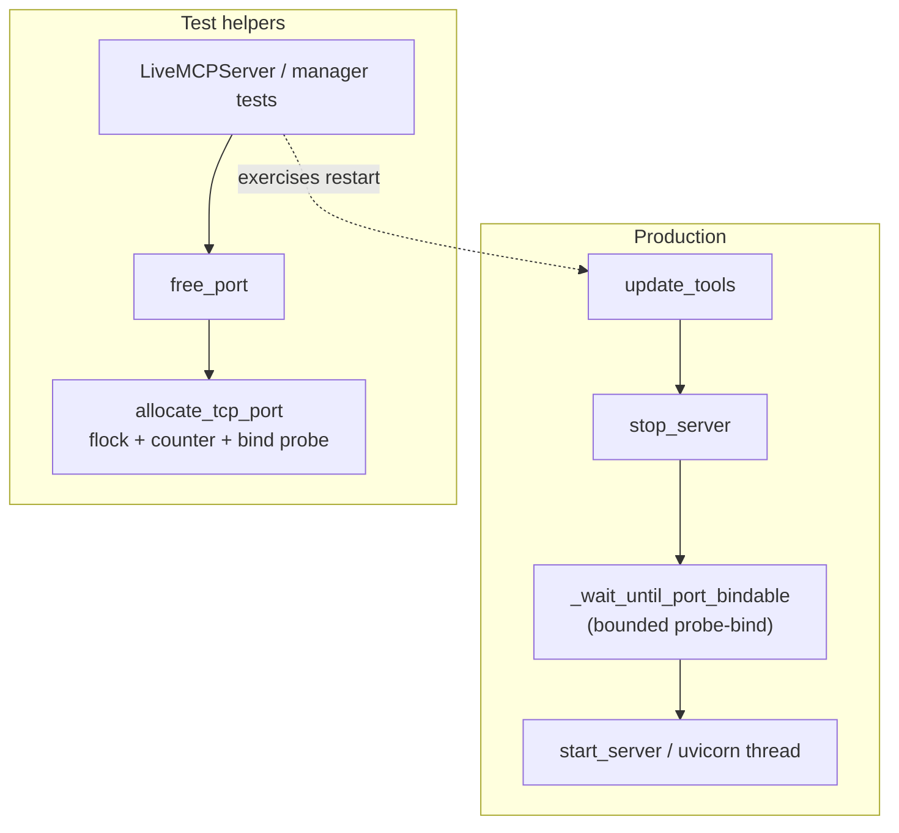

# PYPOST-1178: Stabilize flaky MCP server-manager restart test (EADDRINUSE)

## Research

### Problem evidence

- Jira [PYPOST-1178](https://pypost.atlassian.net/browse/PYPOST-1178): 
  `tests/test_mcp_server_manager.py::test_update_tools_restarts_when_exposed_set_changes`
  intermittently fails with EADDRINUSE / port-still-busy after a tool-set-driven
  restart.
- Origin: NON-BLOCKER follow-up 1 in `ai-tasks/PYPOST-1173/60-tech-debt.md` —
  observed once under full `make test` during PYPOST-1173 Step 6; passed on
  immediate re-run. Base commit at filing:
  `df4148191b9227bb51d22619d451a2d0299c95ae`. Unrelated to header-forwarding.
- Sibling [PYPOST-1113](https://pypost.atlassian.net/browse/PYPOST-1113) (Done)
  fixed a *different* flake (signal-order wait in
  `test_port_busy_emits_start_failed`). Out of scope here except as related
  MCP port-test reliability context.

### Root cause (production restart path)

`MCPServerManager.update_tools` already stops then starts on the same
`(_current_host, _current_port)` when the exposed-tool signature changes:

```text
signature changed + is_running
  → stop_server()
  → start_server(same host/port, new tools)
```

`stop_server` sets `should_exit`, joins the uvicorn thread with a **2.0s
timeout**, then clears `_server_thread` / `_server_instance` and emits stopped
status. Clearing the thread reference makes `is_running()` false even if the
join timed out or the listening socket has not yet fully released.

Industry and library context:

- Linux keeps a just-closed TCP binding unavailable until the prior socket
  finishes teardown / leaves limbo; rapid rebind yields
  `OSError: [Errno 98] Address already in use`
  ([Superuser: address already in use](https://superuser.com/questions/1475140/how-does-the-os-tell-whether-an-address-is-already-in-use)).
- Programmatic uvicorn shutdown is cooperative (`should_exit` + thread join);
  bind races on same-port restart are a known operational hazard
  ([uvicorn discussion #1103](https://github.com/encode/uvicorn/discussions/1103);
  [Latchkey: uvicorn EADDRINUSE in CI](https://latchkey.dev/learn/python/py-uvicorn-address-already-in-use-ci)).
- asyncio `create_server(..., reuse_address=True)` documents that
  `SO_REUSEADDR` reuses a local socket in `TIME_WAIT` on Unix
  ([Python asyncio event loop](https://docs.python.org/3/library/asyncio-eventloop.html)),
  but a socket that is still **actively listening** (prior thread not fully
  gone) still fails bind — reuse does not steal a live listener.

So the flake is a **stop→start timing gap on the same port**, not incorrect
business meaning of tool-set restart.

### In-scope WIP (land this; do not rewrite)

Working tree already contains the intended fix shape (+23 / helpers):

| Path | Role |
| --- | --- |
| `pypost/core/qt/mcp_server.py` | After `stop_server()` in `update_tools`, call `_wait_until_port_bindable()` before `start_server`. Bounded poll (default 5.0s, 50ms sleep): wait until thread not running, then probe-bind with `SO_REUSEADDR`; on success return; on deadline log `mcp_port_still_busy` and proceed (failure remains visible via start_failed / test waits). |
| `tests/helpers/port_allocation.py` | New: cross-process ephemeral TCP port allocator (`fcntl.flock` + counter file under `PYPOST_TEST_PORT_LOCK` / `/tmp/pypost-test-port.lock`, base 35000, span 25000, bind probe, fallback to port 0). |
| `tests/helpers/mcp_live_server.py` | `free_port()` now delegates to `allocate_tcp_port("127.0.0.1")` instead of ad-hoc `bind(..., 0)`. |

Constraint from requirements: **retain and complete this WIP**; do not invent a
rewrite (e.g. changing ports on every restart, unbounded sleep, or redesigning
PYPOST-1113 waits).

### Test-side isolation (secondary)

Ephemeral `bind(0)` alone can collide under parallel workers (TOCTOU between
probe and listen). Cross-process locking + sequential counter reduces that
class of flake
([Yelp ephemeral-port-reserve](https://github.com/yelp/ephemeral-port-reserve);
[executor claimPorts retry](https://github.com/UsefulSoftwareCo/executor/blob/fd4fb02f/e2e/src/ports.ts)).

Caveat from recent practice: probes that set `SO_REUSEADDR` can falsely report
a port free on some platforms while another process holds a different bind
tuple
([flare: drop SO_REUSEADDR from port probe](https://github.com/Tencent/flare/commit/81386ff6329335ca03e2c68ba938f732e548d822)).
This task’s primary flake is same-process restart after stop on Linux; land
WIP as-is. If probe false-negatives/positives appear later, treat as follow-up
debt — do not expand scope here.

### Patterns selected

- **Bounded readiness gate** between stop and start (poll + deadline + visible
  timeout outcome) — aligns with suite rules (no unbounded waits;
  `pytest.mark.timeout` on module).
- **Probe-bind as readiness signal** — same criterion the next `start_server`
  needs (port acceptably bindable).
- **Cross-process lock for test ports** — isolation for live MCP / manager
  tests sharing `free_port()`.
- **Land WIP, minimal surface** — only restart readiness + named helpers;
  no broader MCP manager refactor.

## Implementation Plan

1. **Land production WIP** in `MCPServerManager.update_tools`: keep
   `_wait_until_port_bindable()` between `stop_server()` and
   `start_server(...)`. Preserve signature-change / not-running early returns.
   Do not change tool-set fingerprint semantics.
2. **Land test WIP**: keep `tests/helpers/port_allocation.py` and
   `free_port()` → `allocate_tcp_port` wiring in
   `tests/helpers/mcp_live_server.py`.
3. **Harden only if Step 3/4 prove gaps** (still within WIP intent): e.g.
   slightly tighten logging, ensure timeout stays bounded, optional small unit
   coverage for `allocate_tcp_port` / wait helper — no rewrite.
4. **Leave alone**: PYPOST-1113 compound wait; unrelated dirty-tree files;
   PYPOST-1173 header-forwarding behavior.
5. **Validate** via Makefile only (`make test` focused node id; full
   `make check` / `make test` as gate requires).

**Mandatory — Failing Repro (next Step 3):**

| Item | Plan |
| --- | --- |
| Desired behavior | After a tool-set change that requires restart, the manager becomes ready again on the configured host/port within bounded waits — no EADDRINUSE from a still-busy prior binding. Concretely: `_wait_until_port_bindable` blocks until a probe bind succeeds (or hits its deadline); `update_tools` then starts successfully when the port frees in time. |
| Where | Prefer a **deterministic** unit/integration case in `tests/test_mcp_server_manager.py` (or a thin helper-focused test in the same module) that exercises `_wait_until_port_bindable` / restart readiness. Keep the existing node `test_update_tools_restarts_when_exposed_set_changes` as the regression that must stay green under suite load. |
| Crisp observable (WIP contract) | `_wait_until_port_bindable(...) -> None` always returns `None`. Success = early return after a successful probe-bind (no warning). Deadline while still busy = `logger.warning("mcp_port_still_busy host=%s port=%d", ...)` then return `None` and let a following `start_server` surface failure via existing `start_failed` / test waits. **Step 3 asserts this warning in `caplog`** (message substring `mcp_port_still_busy`) when a holder keeps the port busy for a short timeout — do not invent a return-value contract. |
| Force failure without rare flake (test-only) | Do **not** rely only on “run full suite until EADDRINUSE.” Do **not** edit production / strip WIP from `update_tools`. Deterministic red (test harness only): (1) allocate a port; (2) hold it with a real listening socket (no SO_REUSEADDR steal); (3) set manager `_current_host` / `_current_port` to that endpoint; (4) with the holder still open, call `_wait_until_port_bindable(timeout=small)` and assert `caplog` records warning `mcp_port_still_busy`; and/or drive `update_tools` / `start_server` while **`monkeypatch`ing `_wait_until_port_bindable` to a no-op** so stop→start races the held port and assert bind/`start_failed` / never-running — WIP production call site stays intact; (5) for the green path (Step 4), drop the no-op monkeypatch (or release the holder before/during a non-zero wait) and assert restart reaches running without `mcp_port_still_busy` when the port frees in time. Prefer held-socket + caplog / monkeypatch-no-op over load-only stress. |
| Live deps | None required beyond local TCP bind (same as existing manager tests). No external MCP upstream. |
| Sequencing | Research → write red that fails under held port + short wait (`mcp_port_still_busy` in caplog) and/or under monkeypatched no-op wait + held port across restart → land/confirm WIP wait + port allocator → green by removing the no-op monkeypatch / asserting real wait behavior and on `test_update_tools_restarts_when_exposed_set_changes` → optional stress under `make test`. |
| Timeouts | New tests must declare `@pytest.mark.timeout(...)` or inherit module `pytestmark` (already 60s). Wait helpers stay time-bounded. |

## Architecture

### Scope decision

| Layer | Change? |
| --- | --- |
| `MCPServerManager.update_tools` + `_wait_until_port_bindable` | Yes — land WIP readiness gate |
| `tests/helpers/port_allocation.py` | Yes — new allocator (land WIP) |
| `tests/helpers/mcp_live_server.free_port` | Yes — delegate to allocator |
| `test_update_tools_restarts_when_exposed_set_changes` | Keep / possibly add companion red coverage in Step 3 |
| PYPOST-1113 / `test_port_busy_emits_start_failed` wait | No |
| Unrelated MCP features / header forwarding | No |

### Module diagram



### Module responsibilities

| Module | Responsibility |
| --- | --- |
| `MCPServerManager` | Qt-facing lifecycle: start/stop/restart on exposed-tool signature change; emit status / start_failed; **new**: do not rebind until port is probe-bindable or wait deadline expires. |
| `_wait_until_port_bindable` | Single readiness gate: monotonic deadline, skip while `is_running()`, probe `socket.bind` with `SO_REUSEADDR`, sleep 50ms on `OSError`, warn `mcp_port_still_busy` if still busy. |
| `allocate_tcp_port` | Cross-process exclusive lock; advance counter; return a host/port that currently binds; fallback to OS ephemeral port. |
| `free_port` / `mcp_live_server` | Stable entry point for live MCP and manager tests; isolation via allocator. |
| Restart regression test | Asserts tool-set change → restart → manager running again without port-busy flake. |

### Interaction scheme

1. Exposed tool set changes → `mcp_tools_signature` differs → `update_tools` returns True path.
2. `stop_server` requests uvicorn exit and joins (≤2s), clears thread refs, emits stopped.
3. `_wait_until_port_bindable` polls until bind succeeds or 5s deadline.
4. `start_server` reuses same host/port and new tools; `_notify_started` / tests’ `wait_until` / `wait_for_port` observe readiness.
5. Tests obtain ports via `free_port()` → `allocate_tcp_port` so parallel workers are less likely to collide.

### Main interfaces

```text
MCPServerManager.update_tools(tools: List[RequestData]) -> bool
  # True iff signature changed and a restart was attempted

MCPServerManager._wait_until_port_bindable(timeout: float = 5.0) -> None
  # Always None. Success: early return after probe-bind.
  # Deadline still busy: logger.warning("mcp_port_still_busy host=%s port=%d", ...)
  # then return; subsequent start_server may emit start_failed.

allocate_tcp_port(host: str = "127.0.0.1") -> int
free_port() -> int  # thin wrapper
```

No new public Qt signals. Existing `status_changed` / `start_failed` remain the
operator-facing failure channel if the port never frees before start. Step 3’s
primary wait-deadline observable is the `mcp_port_still_busy` warning in
`caplog`, matching WIP behavior.

### Out of scope (explicit)

- Redesigning PYPOST-1113 signal-order waits.
- Changing which tool-set deltas trigger restart.
- Unbounded sleeps or “retry forever” bind loops.
- Rewriting the WIP into a different architecture (port migration on restart,
  SO_REUSEPORT-only strategies, etc.).

## Q&A

**Why wait after stop instead of lengthening join only?**
Join timeout alone does not prove the OS has released the listening socket.
Probe-bind matches the next `start_server` requirement and stays bounded.

**Why land WIP rather than redesign?**
Requirements mandate retaining the existing uncommitted restart-readiness and
port-allocation work; inventing a rewrite discards validated in-scope progress.

**How is this different from PYPOST-1113?**
1113 fixed *observation* of already-correct busy-port *start failure* signals.
1178 fixes *same-port restart readiness* after a successful stop when the prior
binding is slow to release.

**Can Step 3 rely on reproducing the rare full-suite flake?**
No as the primary red. Use a held listening socket and assert
`mcp_port_still_busy` in `caplog` after a short `_wait_until_port_bindable`
deadline, and/or monkeypatch `_wait_until_port_bindable` to a no-op so
`update_tools` races the held port (test-only; do not strip the call from
production). Step 4 greens by removing the no-op monkeypatch / asserting the
real wait.

**What does `_wait_until_port_bindable` return on timeout?**
Nothing useful to assert: signature is `-> None`. On deadline it only logs
`mcp_port_still_busy` and returns; assert that warning (and/or a following
`start_failed`), not a return value.

**References**

- [Python asyncio event loop — reuse_address](https://docs.python.org/3/library/asyncio-eventloop.html)
- [uvicorn programmatic shutdown #1103](https://github.com/encode/uvicorn/discussions/1103)
- [Address already in use / TIME_WAIT](https://superuser.com/questions/1475140/how-does-the-os-tell-whether-an-address-is-already-in-use)
- [Yelp ephemeral-port-reserve](https://github.com/yelp/ephemeral-port-reserve)
- [flare SO_REUSEADDR probe caveat](https://github.com/Tencent/flare/commit/81386ff6329335ca03e2c68ba938f732e548d822)
- Related Done: [PYPOST-1113](https://pypost.atlassian.net/browse/PYPOST-1113)
