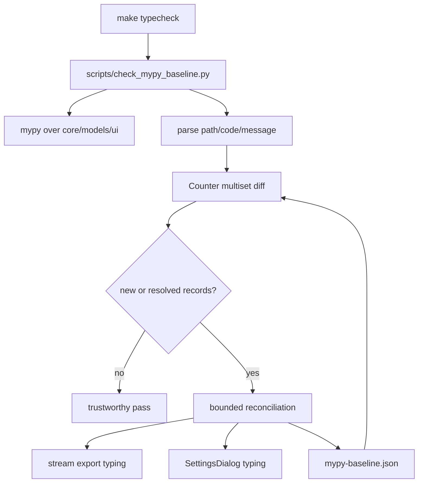

# PYPOST-1179: Refresh the mypy baseline for known type-checking drift

## Research

The repository runs mypy through `scripts/check_mypy_baseline.py`, invoked by
the `make typecheck` target. The checked scope is the ordered set
`pypost/core`, `pypost/models`, and `pypost/ui`. Diagnostics are compared as a
multiset of `(path, code, message)` records; source line numbers are retained
only for display. Therefore a baseline refresh must be based on one complete
run and must preserve duplicate diagnostic counts.

The current baseline is version 2 with 189 records. The named files were
checked directly in `mypy-baseline.json`:

- `pypost/core/websocket_stream_export.py` and
  `pypost/core/qt/websocket_stream_export_worker.py` have no current baseline
  records. `StreamExportSnapshot` is an immutable, Qt-free value object with
  `__len__`, `snapshot() -> tuple[StreamEntry, ...]`, and `dropped -> dict[str,
  int]`, matching the read interface used by the `MessageStream | StreamExportSnapshot`
  export union.
- `pypost/ui/dialogs/settings_dialog.py` has four records: assignment of
  `AppSettings` into an attribute inferred as `None`, missing stub attributes
  for `QDialogButtonBox.Cancel` and `.Save`, and returning `None` where
  `AppSettings` is declared. These are confined to static typing; the dialog
  currently constructs the same tab pages and form layouts in
  `SettingsDialog.__init__`, and `get_settings()` returns the post-accept
  value.

Relevant existing coverage is in `tests/test_mypy_baseline.py`,
`tests/test_mypy_baseline_live.py`, `tests/test_settings_dialog.py`, and
`tests/test_settings_dialog_tabbed_layout.py`. The settings tests verify
widget identity, tab/form ownership, and persistence through `accept()`.
The stream export tests and worker implementation use the snapshot through
the core formatter/writer interfaces without importing Qt into the core
formatter module.

Observed verification at architecture time:

```text
make typecheck
mypy baseline OK (189 known errors in pypost/core, pypost/models, pypost/ui)
```

## Implementation Plan

1. Run the repository's normal baseline checker and capture the complete
   parsed diagnostic inventory, including path, error code, message, and
   multiplicity. Do not update the JSON from a partial or hand-selected run.
2. Reconcile only the two named areas. For stream export, confirm that the
   immutable snapshot and the live stream expose the same formatter-facing
   protocol and retire only records proven resolved. For the Settings dialog,
   decide per diagnostic whether a narrow annotation/stub-compatible contract
   is needed or whether the record remains accepted debt; preserve the
   existing dialog construction, tab ownership, and save/cancel behavior.
3. Compare the resulting baseline with the full current run using the existing
   Counter-based comparison. Any diagnostic outside the named files is kept
   separate and is not absorbed into this task.
4. Verify the final result through `make typecheck`, `make lint`,
   `make verify-ai-tasks`, and the existing focused tests for baseline behavior
   and Settings dialog behavior.

**Mandatory — Failing Repro (next Step 3):** This task has no intended
user-visible runtime behavior change, so Step 3 is primarily a static-gate
reproduction. Before any Step 4 contract or baseline change, add a focused
test in the existing baseline test module (or a dedicated
`tests/test_pypost_1179_mypy_baseline.py`) that supplies deterministic mypy
output for the two named paths to `_parse_errors()` and `_diff_errors()`. The
test must assert that a stale stream record is reported as resolved, a new
Settings-dialog record is reported as new, and an unrelated path remains
outside the scoped reconciliation. Use these exact deterministic fixtures:

- Pre-change baseline fixture: one accepted
  `pypost/core/websocket_stream_export.py` `union-attr` record with message
  `Item MessageStream has no attribute snapshot`, plus the four existing
  SettingsDialog records and no unrelated record.
- Pre-change mypy output fixture: omit that stream record, retain the four
  SettingsDialog records, add a SettingsDialog `assignment` record with
  message `AppSettings is incompatible with None`, and add an unrelated
  `pypost/models/app_settings.py` `return-value` record with message
  `unrelated fixture diagnostic`.
- Post-change fixture: remove the stale stream record from the baseline (or
  retain it only if a complete live run still emits it), add the new
  SettingsDialog record only if the live run emits it, and leave the
  unrelated model record outside scoped reconciliation. The expected scoped
  diff is exactly one fixed stream key and one new SettingsDialog key.

The test is red before Step 4 because the stale baseline and pre-change
output produce that non-empty diff. It is green after Step 4 when the narrow
type contract/baseline update makes the post-change scoped diff empty while
the unrelated model key remains separately reported. If complete evidence
confirms there is no stale or new record to correct, record `N/A — no
behavioral change and the live baseline is already exact` in the Step 3
artifact instead of manufacturing a production failure. No live network, Qt
event loop, or production behavior is required.

## Architecture



### Components and responsibilities

| Component | Responsibility | Dependency boundary |
| --- | --- | --- |
| `check_mypy_baseline.py` | Execute mypy, parse diagnostics, and compare current records with the committed baseline. | Uses subprocess and JSON; no application/UI imports. |
| `mypy-baseline.json` | Store the versioned accepted multiset and its checked-path scope. | Data-only artifact consumed by the checker. |
| Stream export contracts | Keep `MessageStream` and immutable `StreamExportSnapshot` structurally compatible with formatter/writer inputs. | Core-only; worker depends on the snapshot and export functions, not vice versa. |
| `SettingsDialog` | Retain the existing QDialog composition and expose a statically truthful settings result/layout contract. | Depends on section widgets, `AppSettings`, and PySide6 stubs; no baseline-specific runtime branch. |
| Baseline and Settings tests | Pin multiset semantics and existing tab/form/save behavior while the typing outcome is reconciled. | Test-only; deterministic fixtures for mypy output, existing Qt fixture for dialog behavior. |

### Interfaces and data flow

- `_run_mypy() -> tuple[int, str]` remains the sole live diagnostic source;
  `_parse_errors(output: str) -> list[MypyError]` normalizes compiler output.
- `_error_key(entry) -> tuple[str, str, str]` and `_diff_errors(current,
  baseline) -> (new_keys, fixed_keys)` remain the acceptance interface for
  baseline truthfulness. The implementation must not change from multiset
  comparison to set comparison or add line numbers to identity.
- `StreamExportSnapshot(entries: Iterable[StreamEntry], dropped:
  Mapping[str, int])` owns an immutable tuple and copied drop counters. Its
  formatter-facing protocol is `__len__`, `snapshot`, and `dropped`; any
  contract adjustment must preserve those operations and the worker's
  off-thread snapshot boundary.
- `SettingsDialog` owns `_tab_pages` and `_tab_form_layouts` as paired tuples;
  `tab_form_layout(page: QWidget) -> QFormLayout` maps a page to its form, and
  `form_layout_index_of(widget: QWidget) -> int` searches the existing forms.
  `accept()` builds `AppSettings` after validation, while `get_settings()` is
  the read interface used after acceptance. Any annotation must express the
  actual pre-accept optional state without changing that lifecycle.

### SettingsDialog diagnostic resolution

The four current SettingsDialog records are evaluated independently during
the complete `make typecheck` run:

| Diagnostic | Resolution criterion | Expected final baseline outcome |
| --- | --- | --- |
| `_settings` assignment: `AppSettings` assigned to an attribute inferred as `None` | Annotate the attribute with its actual accepted-state type, including `None` before `accept()`, without changing construction or validation. | Remove exactly one matching record if the live diagnostic disappears. |
| `QDialogButtonBox.Cancel` missing stub attribute | Use the narrow PySide6-compatible enum/member spelling supported by the installed stubs, preserving Cancel behavior. | Remove exactly one matching record if the expression type-checks. |
| `QDialogButtonBox.Save` missing stub attribute | Apply the same narrow enum/member compatibility correction for Save; do not alter button wiring or labels. | Remove exactly one matching record if the expression type-checks. |
| `get_settings()` returns `None` where `AppSettings` is declared | Reflect the pre-accept optional lifecycle in the return annotation, or establish the existing post-accept invariant at this narrow boundary; preserve callers and `accept()`. | Remove exactly one matching record if all return paths type-check; otherwise retain the exact record as accepted baseline debt. |

No other SettingsDialog diagnostics may change as a side effect. A complete
live run determines each row: an absent record is removed, while a present
record remains with its exact `(path, code, message)` and multiplicity. An
unchanged row is an evidence-backed N/A outcome, not a reason to invent a
code change.

### Patterns and rationale

- **Single source of truth:** the live mypy run is compared against one
  committed JSON artifact, preventing hand-curated scope drift.
- **Multiset reconciliation:** `Counter` preserves duplicate diagnostics and
  makes partial resolution visible.
- **Immutable snapshot/value object:** stream export crosses the worker thread
  through copied data, preserving the existing concurrency boundary.
- **Narrow contract correction:** if Settings typing is changed, use explicit
  Python annotations or a small local compatibility boundary rather than
  broad `ignore` directives, casts that conceal diagnostics, or UI refactoring.

## Acceptance mapping

| Requirement | Architectural evidence |
| --- | --- |
| FR-1 / FR-2 | Full checker inventory and per-path reconciliation of the stream and Settings records. |
| FR-3 | Existing `(path, code, message)` Counter diff remains unchanged. |
| FR-4 | Unrelated paths are reported separately and are never added to the scoped update. |
| FR-5 / NFR-2 | Preserve snapshot immutability, worker boundary, dialog lifecycle, tab layout, and existing focused tests. |
| NFR-1 / NFR-3 | Deterministic parser/diff repro plus `make typecheck` evidence. |
| NFR-4 / NFR-5 | This artifact records scope and rationale; all quality commands use Make targets. |

## Q&A

**Q: Should the whole baseline be regenerated?**

A: No. A complete run is required for evidence, but only records in the two
named areas may be reconciled. Unrelated new or resolved records remain
visible and require separate work.

**Q: Is a stream-export production change expected?**

A: No. The current snapshot already presents the required structural read
interface and has no baseline records in the named files. The next step should
record the verified no-change outcome unless a reproducible diagnostic appears.

**Q: Does fixing the Settings diagnostics permit UI redesign?**

A: No. Any fix is limited to making the existing lifecycle and PySide6-facing
types truthful; widget composition and behavior remain the compatibility
boundary.

## References

- [PYPOST-1179](https://pypost.atlassian.net/browse/PYPOST-1179)
- [Static type checking developer guide](../../doc/dev/static_type_checking.md)
- `scripts/check_mypy_baseline.py`
- `pypost/core/websocket_stream_export.py`
- `pypost/core/qt/websocket_stream_export_worker.py`
- `pypost/ui/dialogs/settings_dialog.py`
