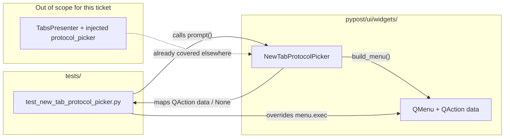

# PYPOST-1180: Prove blank-tab protocol picker outcomes in CI

Step 2 artifact for PYPOST-1180. Turns the approved requirements in
[`10-requirements.md`](10-requirements.md) into a high-level architecture for
hermetic unit tests of `NewTabProtocolPicker.prompt` outcome mapping (HTTP,
WebSocket, dismiss → no choice). Product UX and presenter routing stay as
shipped in [PYPOST-1157](https://pypost.atlassian.net/browse/PYPOST-1157);
this debt item closes follow-up 7 in
`ai-tasks/PYPOST-1157/60-tech-debt.md`.

**Scope:** Automated proof of the production picker’s confirm/dismiss →
`TabProtocol | None` path without a live blocking `QMenu.exec()`. MCP Client
outcome coverage already exists and must remain untouched. Presenter injection
paths stay as-is.

## Research

### R-1 Gap vs existing coverage (repo facts)

| Layer | What is covered today | What PYPOST-1180 adds |
| --- | --- | --- |
| Menu construction | `tests/test_new_tab_protocol_picker.py`: labels order HTTP → WebSocket → MCP Client; HTTP is `activeAction` | Unchanged |
| `prompt()` action-data mapping | Only MCP Client: `test_prompt_maps_mcp_client_action` mocks `menu.exec` to return `actions()[2]` | HTTP (`actions()[0]`), WebSocket (`actions()[1]`), dismiss (`None`) |
| Presenter / plus-tab / golden | Injected `protocol_picker` stubs — prove routing *given* a protocol | Out of scope (FR / NFR isolation); must stay green |

Source of the debt: PYPOST-1157 shortcut #1 and follow-up 7 — construction and
injected stubs do not lock the production picker’s confirm/dismiss mapping for
the two primary protocols and cancel.

Production mapping under test (`pypost/ui/widgets/new_tab_protocol_picker.py`):

```text
build_menu → menu.exec(pos, http_action) → chosen QAction | None
  → None / data is None / TabProtocol(data) ValueError → None
  → else TabProtocol enum (HTTP | WEBSOCKET | MCP_CLIENT)
```

### R-2 Hermetic Qt menu testing (external + project precedent)

Live `QMenu.exec()` is synchronous and returns the triggered `QAction`, or
`None` on Esc / click-away
([Qt for Python `QMenu.exec`](https://doc.qt.io/qtforpython-6/PySide6/QtWidgets/QMenu.html)).
A real call blocks the Qt event loop and can hang CI — the same constraint
documented for PYPOST-1157 and in `doc/dev/new_tab_protocol_picker.md`.

Community guidance for modal Qt surfaces in pytest:

- Prefer **mocking** the blocking API rather than driving a live popup
  ([pytest-qt #18](https://github.com/pytest-dev/pytest-qt/issues/18) —
  patch modal helpers; avoid open-ended `exec` waits).
- Menu interaction via real clicks is fragile; keep `QAction` references and
  avoid simulating popup event loops
  ([pytest-qt #195](https://github.com/pytest-dev/pytest-qt/issues/195)).
- `unittest.mock.patch` / `patch.object` can replace `QMenu.exec` with a
  controlled return value (`None` for cancel, or a chosen action)
  ([Python `unittest.mock`](https://docs.python.org/3.11/library/unittest.mock.html)).

**Chosen repo pattern (already green for MCP):** do **not** patch
`QMenu.exec` at the class level. Instead wrap `build_menu` so the concrete
menu instance gets `menu.exec = fake_exec`, and `fake_exec` returns
`menu.actions()[i]` or `None`. That preserves real action `data()` for
`TabProtocol(data)` while never entering the blocking popup. Matches
`test_prompt_maps_mcp_client_action` in `tests/test_new_tab_protocol_picker.py`.

Class-level `patch.object(QMenu, "exec", return_value=...)` is a weaker fit
here: the return must be an action that belongs to the menu just built so
`data()` maps correctly; instance assignment after `build_menu` is clearer
and already proven in-tree.

### R-3 Production change expectation

Requirements state the HTTP / WebSocket / cancel outcomes are already correct
for users; this is **verification debt**, not a UX feature. Default plan:
**no production module change**. If a new proof fails against current
`prompt()`, treat it as a real mapping defect (FR-5.2) and restore the
PYPOST-1157 contract only — no new options, defaults, or cancel semantics.

### R-4 Test harness constraints (lsr-python / do-testing)

- File: `tests/test_new_tab_protocol_picker.py` (existing
  `TestNewTabProtocolPicker`, `pytestmark = pytest.mark.timeout(60)`,
  `@pytest.mark.usefixtures("qapp")`).
- Keep module docstring intent: no live `QMenu.exec()` in CI.
- Prefer a small shared helper inside the test module (or parametrized
  cases) so HTTP / WebSocket / dismiss share one mock-`exec` setup and do
  not duplicate the MCP wrapper three more times without structure.
- Do not re-prove presenter tab insertion (NFR-3).

## Implementation Plan

### High-level approach

1. Extend `tests/test_new_tab_protocol_picker.py` with hermetic `prompt()`
   outcome tests for HTTP confirm, WebSocket confirm, and dismiss.
2. Reuse the existing MCP mock-`exec` technique (instance `menu.exec`
   override after real `build_menu`).
3. Leave `NewTabProtocolPicker` production code unchanged unless a proof
   exposes a mapping bug.
4. Leave presenter / plus-tab / golden injected-picker tests unchanged;
   confirm they stay green under `make test`.

### Suggested implementation order (Steps 3–4)

1. **Step 3 — automated proofs:** add the three outcome tests (and optional
   shared helper / parametrization) in
   `tests/test_new_tab_protocol_picker.py`. No production edits in Step 3.
2. **Step 4 — green / restore:** expected path is already-green tests (lock
   only). If any assertion fails against current `prompt()`, fix mapping in
   `new_tab_protocol_picker.py` only as needed for FR-1..3; do not expand
   product scope.
3. Run focused suite via Makefile (`make test` with
   `PYTEST_ARGS` targeting the picker module and existing
   `HandleNewTabProtocolPicker` / plus-tab filters as a regression smoke).

### Mandatory — Failing Repro (next Step 3)

**Runtime product change:** `N/A — no behavioral change` expected. This ticket
is verification debt; the PYPOST-1157 outcome contract is already the product
behavior. Do **not** break production solely to force a red→green cycle.

**Automated proofs to author in Step 3** (before any production edit):

| Test (suggested names) | Asserts (desired behavior) | Force hermetic failure path |
| --- | --- | --- |
| `test_prompt_maps_http_request_action` | `prompt()` → `TabProtocol.HTTP` | Mock `menu.exec` → `menu.actions()[0]` |
| `test_prompt_maps_websocket_action` | `prompt()` → `TabProtocol.WEBSOCKET` | Mock `menu.exec` → `menu.actions()[1]` |
| `test_prompt_dismiss_returns_none` | `prompt()` → `None` | Mock `menu.exec` → `None` |

- **Where:** `tests/test_new_tab_protocol_picker.py` ::
  `TestNewTabProtocolPicker` (same timeout / `qapp` as today).
- **No live deps:** no real popup, no network, no presenter wiring.
- **Existing MCP test:** keep `test_prompt_maps_mcp_client_action`; do not
  weaken or remove it.
- **Expected first run:** green if mapping is intact. If red, that *is* the
  failing repro for Step 4 (restore FR-1..3). Sequencing: research (this
  document) → Step 3 proofs → Step 4 only if production must change → keep
  construction + injected-picker coverage green.

Optional shared helper (test-local, not a production API):

```python
def _prompt_with_exec_result(picker, result_factory):
    """Install fake menu.exec; result_factory(menu) -> QAction | None."""
    ...
```

## Architecture

### Requirements → design

| Requirement | Architecture |
| --- | --- |
| FR-1 HTTP confirm | Hermetic `prompt()` test returns `TabProtocol.HTTP` when mocked `exec` yields first action |
| FR-2 WebSocket confirm | Same pattern; second action → `TabProtocol.WEBSOCKET` |
| FR-3 Dismiss | Mocked `exec` returns `None` → `prompt()` returns `None` |
| FR-4 Hermetic CI | Instance `menu.exec` override; never call live `QMenu.exec()` |
| FR-5 No product expansion | Default: tests-only change; production fix only to restore existing mapping |
| NFR-1..4 | Module `timeout(60)`, deterministic mocks, picker-only assertions |

### System modules and responsibilities



| Module | Responsibility in this task |
| --- | --- |
| `tests/test_new_tab_protocol_picker.py` | Own FR-1..3 proofs; hermetic mock-`exec`; keep construction + MCP mapping tests |
| `pypost/ui/widgets/new_tab_protocol_picker.py` | Unchanged unless a proof reveals mapping defect; remains the single production mapper |
| `TabsPresenter` / metrics / draft editors | No design change; regression smoke only |

### Module interaction scheme

1. Test constructs `NewTabProtocolPicker`.
2. Test replaces `build_menu` (or equivalent helper) so the returned `QMenu`
   has a non-blocking `exec` that returns a chosen `QAction` or `None`.
3. Test calls real `prompt()` (production mapping path).
4. Assert `TabProtocol.HTTP`, `TabProtocol.WEBSOCKET`, or `None`.
5. Presenter continues to use injectable `protocol_picker` in its own tests;
   those stubs do not substitute for this mapping lock.

### Selected architectural patterns

| Pattern | Justification |
| --- | --- |
| **Test double on blocking boundary** | Mock only `QMenu.exec`; exercise real `build_menu` + `TabProtocol(data)` mapping (lsr-python mock/stub guidance; pytest-qt hermetic practice). |
| **Seam already present** | `build_menu` vs `prompt` split from PYPOST-1157 enables construction tests and outcome tests without opening a popup. |
| **No DI change for production** | Presenter already injects `protocol_picker` for routing tests; this ticket targets the default production callable’s internals, not a new injectable. |
| **Verification-only delta** | Prefer additive tests over refactors; avoid drive-by production cleanup (scope discipline). |

### Main interfaces / APIs

No new public production APIs. Contract under test (existing):

```python
class NewTabProtocolPicker:
    def build_menu(self, parent: QWidget | None = None) -> QMenu: ...
    def prompt(
        self,
        parent: QWidget | None = None,
        *,
        anchor: QPoint | None = None,
    ) -> TabProtocol | None: ...
```

Test-local helper (optional, not exported from `pypost`):

```python
def _install_fake_exec(
    picker: NewTabProtocolPicker,
    chosen: Callable[[QMenu], QAction | None],
) -> None: ...
```

Outcome matrix locked by this architecture:

| Mocked `exec` return | `prompt()` result |
| --- | --- |
| `menu.actions()[0]` (HTTP Request) | `TabProtocol.HTTP` |
| `menu.actions()[1]` (WebSocket) | `TabProtocol.WEBSOCKET` |
| `None` (dismiss) | `None` |
| `menu.actions()[2]` (MCP Client) | `TabProtocol.MCP_CLIENT` (already tested; preserve) |

## Q&A

- **Why not inject a fake picker on `TabsPresenter` for these cases?**
  Injected stubs prove routing given a protocol; they do not prove the
  production `prompt()` mapper. See requirements Q&A and PYPOST-1157
  follow-up 7.

- **Why not drive a live popup with `QTimer` / pytest-qt?**
  Live `exec()` can hang the suite (FR-4, NFR-1, NFR-4). Intentional
  non-goal, same as PYPOST-1157.

- **Why instance `menu.exec` override instead of `patch.object(QMenu, "exec")`?**
  Outcome mapping needs the real menu’s `QAction.data()`. The MCP test
  already uses instance override successfully; keep one technique in the
  file.

- **Is MCP Client in scope?**
  No new MCP cases. Keep `test_prompt_maps_mcp_client_action`. Product MCP
  work remains [PYPOST-1165](https://pypost.atlassian.net/browse/PYPOST-1165).

- **What if Step 3 tests are green on first run?**
  Expected for verification debt. Step 3 still lands the proofs; Step 4 is
  a no-op for production (or a minimal mapping fix if unexpectedly red).

- **References**
  - [PYPOST-1180](https://pypost.atlassian.net/browse/PYPOST-1180)
  - [PYPOST-1157](https://pypost.atlassian.net/browse/PYPOST-1157) /
    `ai-tasks/PYPOST-1157/60-tech-debt.md` follow-up 7
  - `doc/dev/new_tab_protocol_picker.md`
  - [Qt `QMenu.exec`](https://doc.qt.io/qtforpython-6/PySide6/QtWidgets/QMenu.html)
  - [pytest-qt #18](https://github.com/pytest-dev/pytest-qt/issues/18) —
    mock blocking modals
  - [pytest-qt #195](https://github.com/pytest-dev/pytest-qt/issues/195) —
    avoid live menu click loops
