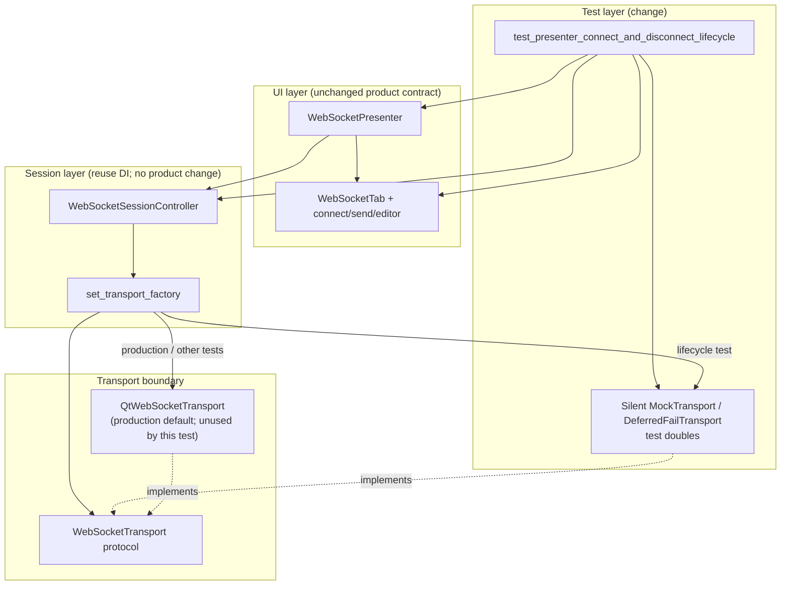

# PYPOST-1181: Stabilize flaky WebSocket connect/disconnect UI lifecycle test

## Research

### Problem evidence

- Jira [PYPOST-1181](https://pypost.atlassian.net/browse/PYPOST-1181) (Debt, 3 SP,
  Suite Failures Cleanup): node
  `tests/test_websocket_client_ui_repro.py::test_presenter_connect_and_disconnect_lifecycle`
  intermittently fails with `assert 'Connect' == 'Disconnect'` after a simulated
  open, accompanied by:
  - `websocket_transport_socket_error category=HostNotFoundError message=Host not found`
  - `websocket_handshake_failed` / session failure for the same category
- Origin: NON-BLOCKER follow-up 1 in `ai-tasks/PYPOST-1157/60-tech-debt.md`.
  Base `1cc642b2…`: isolated PASS. Observed intermittent fail under parallel
  full `make test`; isolated runs typically green.
- Hang note (Jira comment from PYPOST-1192 Step 4): the same file can stall
  mid-suite (>7 minutes at one base); worker timeout surfaces `TIMED_OUT`.
  Treated as the same lifecycle instability (live handshake / Qt socket work
  under load), not a separate product feature.

### Current test flow (broken isolation)

```372:416:tests/test_websocket_client_ui_repro.py
def test_presenter_connect_and_disconnect_lifecycle(qapp: QApplication):
    ...
    controller = WebSocketSessionController()
    presenter = WebSocketPresenter(...)
    ...
    presenter.handle_connect()
    qapp.processEvents()
    # asserts CONNECTING / Cancel / editor locked
    controller.state_changed.emit(SessionState.OPEN.value, StateDetail(...))
    qapp.processEvents()
    assert connect_btn.text() == "Disconnect"  # flakes here
```

`handle_connect()` builds a real `HandshakeTarget` for
`wss://echo.example.com/v1/feed` and calls `WebSocketSessionController.open()`,
which defaults the transport factory to `QtWebSocketTransport` and starts a
live async handshake (`QWebSocket.open`). The test then **synthetically** emits
`state_changed(OPEN)` so the presenter shows Disconnect. A later
`processEvents()` can deliver the real DNS/`HostNotFoundError` path:

1. `QtWebSocketTransport._on_error_occurred` → `listener.on_failed(...)`
2. `WebSocketSessionController.on_failed` → `_transition_to(FAILED)` +
   `session_failed`
3. Presenter `_sync_ui_state(FAILED)` → Connect label, send disabled

Product UI behavior on real handshake failure is correct. The defect is the
test asserting a simulated Open while a live failure is still in flight.

### Existing isolation machinery (reuse, do not reinvent)

| Piece | Role |
| ----- | ---- |
| `WebSocketTransport` / `WebSocketTransportListener` protocols (`pypost/core/websocket_transport_protocol.py`) | Qt-free transport boundary |
| `WebSocketSessionController.set_transport_factory` | DI hook for tests |
| Default factory | `lambda: QtWebSocketTransport(parent=self)` |
| Documented `MockTransport` pattern | `doc/dev/websocket_session_engine.md` §5 |
| Prior art in suite | `tests/test_websocket_session_engine_repro.py`, `tests/test_websocket_session_controller.py` (`DummyTransport`) |

Quarantine rule unchanged: only `pypost/core/qt/websocket_transport.py` may
import `PySide6.QtWebSockets`. UI lifecycle tests must not open real sockets
to prove button labels.

### Industry / library guidance

- Qt WebSocket client tests should avoid depending on live DNS/network; use a
  local server **or** a mock/fake transport, and treat `processEvents` as a
  pump that can deliver **any** queued socket events ([Qt event-loop unit
  testing](https://stackoverflow.com/questions/21606125/qt-event-loop-and-unit-testing),
  Qt WebSocket testing guides preferring hermetic servers/mocks).
- Controllable socket/transport factories are the standard cure for handshake
  and reconnect flakes: inject a fake that never hits the network, then drive
  open/fail/close from the test ([QASkills — WebSocket testing without flaky
  sleeps](https://qaskills.sh/blog/websocket-testing-reconnect-backoff);
  in-memory `MockTransport` patterns in client libraries).
- pytest guidance: fix incomplete sync / shared async effects, not “sleep
  longer” ([pytest flaky tests](https://docs.pytest.org/en/stable/explanation/flaky.html)).
- In-repo precedent: PYPOST-1113 stabilized a Qt `processEvents` race by
  making the wait hermetic to the intended signals — same class of flake,
  different surface. Here the fix is **transport isolation**, not a longer wait.

### Scope decision

- **In scope**: test-only (and optionally tiny shared test-helper) changes so
  the named lifecycle check never constructs `QtWebSocketTransport` / never
  resolves `echo.example.com`.
- **Out of scope**: product Connect/Disconnect semantics, blank-tab picker,
  collections import hang, MCP flakes, broad WebSocket refactors.
- **Production code**: no change expected. `set_transport_factory` already
  exists. Touch production only if Step 4 discovers a true teardown leak that
  isolation alone cannot bound (unlikely).

## Implementation Plan

1. **Isolate the lifecycle test** in
   `tests/test_websocket_client_ui_repro.py::test_presenter_connect_and_disconnect_lifecycle`:
   - Before `presenter.handle_connect()`, call
     `controller.set_transport_factory(...)` with a silent test double that
     implements the `WebSocketTransport` methods (open records target / no-ops;
     close/abort no-op or notify listener only when the test asks).
   - Prefer capturing `set_listener` so Open/Close can be driven via
     `listener.on_opened` / `listener.on_closed` (keeps `controller.state`
     consistent with UI). Synthetic `state_changed.emit` remains acceptable if
     the transport never emits late failures; listener-driven transitions are
     preferred for consistency with engine repros.
   - After Open assertions, pump `processEvents` again (bounded) to prove no
     HostNotFound overwrite.
   - Keep existing Idle → Connecting → Open → Idle label/enablement asserts;
     do not skip/xfail/delete.
2. **Hang mitigation**: silent mock eliminates async DNS, SSL, and reconnect
   timers from `QtWebSocketTransport` / live `open()`. Ensure `finally` still
   `deleteLater()`s tab/presenter/controller. No open-ended waits.
3. **Sibling tests in the same file** that call `handle_connect()` without
   isolation: out of scope unless Step 4 proves they contribute to the file
   hang; prefer minimal change to the named node first.
4. **Optional helper** (`tests/helpers/…`): extract a shared silent
   `MockTransport` only if duplication with engine repros becomes painful;
   default is an inline double in the UI repro file (matches existing style).
5. **Verification**: isolated node + full `make test` / `make check` per
   workflow; module already has `pytestmark = pytest.mark.timeout(30)`.

**Mandatory — Failing Repro (next Step 3):**

- **Where**: `tests/test_websocket_client_ui_repro.py` (same module as the
  flaky node; name TBD, e.g.
  `test_presenter_lifecycle_open_overwritten_by_deferred_transport_failure`).
- **What it asserts (desired after isolation is the green path)**: after
  Connect → Connecting UI, a simulated Open must leave the connect control on
  **Disconnect** even after further `processEvents` pumping.
- **How to force failure without live DNS**: inject a
  `DeferredFailTransport` via `set_transport_factory` whose `open()` stores the
  listener and schedules `listener.on_failed("HostNotFoundError", "Host not found", …)`
  with `QTimer.singleShot(0, …)` (or equivalent queued callback). Sequence:
  `handle_connect` → assert Cancel → emit/drive Open → `processEvents` until
  failure delivered → assert Disconnect. **Red today** under that harness
  because failure correctly drives FAILED → Connect, proving the race class
  that live DNS triggers nondeterministically.
- **Sequencing**: research (done) → Step 3 red deterministic race harness →
  Step 4 replace deferred-fail (or remove it) with **silent** MockTransport on
  the production lifecycle test so Open survives `processEvents` → green;
  keep the lifecycle contract asserts; drop or narrow the deferred-fail harness
  once the isolated lifecycle test is the regression guard (do not leave a
  permanently red “document the race” test in CI).
- Alternative acceptable Step 3: treat the existing flaky node as the red
  signal and land the silent-mock change as the first green-making edit,
  documenting the race in the Step 3 artifact — still must not skip/xfail.

## Architecture

### Module diagram



### Module responsibilities

| Module | Responsibility | Change? |
| ------ | -------------- | ------- |
| Lifecycle regression test | Prove Idle→Connecting→Open→Idle UI labels/enablement under hermetic transport | **Yes** — inject factory; optional deferred-fail red harness then silent mock |
| Silent `MockTransport` | Satisfy `WebSocketTransport`; no network; optional listener capture | **Yes** — test-local (or helper) |
| `WebSocketSessionController` | Session state machine; already supports factory override | No |
| `WebSocketPresenter` / `WebSocketTab` | Connect/Disconnect UI sync from `state_changed` | No (contract unchanged) |
| `QtWebSocketTransport` | Real `QWebSocket` adapter | No — must not run in this test |

### Interaction scheme (target)

1. Test constructs `WebSocketSessionController` + presenter + tab.
2. Test registers silent MockTransport factory **before** `handle_connect()`.
3. `handle_connect` → `controller.open` → factory yields mock → `mock.open(target)`
   (no DNS). Controller transitions to CONNECTING; presenter shows Cancel /
   editor locked.
4. Test drives Open (`listener.on_opened("")` preferred, or synthetic
   `state_changed(OPEN)`). Presenter shows Disconnect; send enabled.
5. Extra `processEvents`: nothing from mock → asserts stay green.
6. `handle_disconnect` + closed/idle transition → Connect; send disabled;
   editor writable. Teardown `deleteLater`.

### Selected patterns

| Pattern | Justification |
| ------- | ------------- |
| **Dependency Injection** via `set_transport_factory` | Already first-class on the controller; documented for headless tests |
| **Factory** | Swaps production `QtWebSocketTransport` for a test double per open |
| **Test double / Mock** implementing `WebSocketTransport` | Removes HostNotFound race and live-socket hang risk without changing product code |
| **Protocol / port** (`WebSocketTransport`) | Keeps doubles duck-typed; preserves QtWebSockets quarantine |
| **Deterministic race harness** (Step 3) | Replaces nondeterministic DNS flake with queued `on_failed` for a red→green story |

### Main interfaces

```text
WebSocketSessionController.set_transport_factory(
    factory: Callable[[], WebSocketTransport]
) -> None

WebSocketTransport (Protocol):
    open(target: HandshakeTarget) -> None
    set_listener(listener: WebSocketTransportListener) -> None
    send_text / send_binary / ping / close / abort / negotiated_subprotocol

WebSocketTransportListener (Protocol):
    on_opened / on_failed / on_closed / ...
```

Silent mock contract for this task:

- `open`: store `target`; do **not** call `on_failed`; do **not** auto-open
  unless the test explicitly wants auto-open (lifecycle test should remain in
  CONNECTING until it drives Open).
- `set_listener`: retain reference for optional `on_opened` / `on_closed`.
- `close` / `abort`: no network; may no-op (test emits Idle) or call
  `on_closed` if driving controller state through the listener.

### Non-goals / anti-patterns

- Do not skip, xfail, or delete the lifecycle test.
- Do not “fix” by lengthening sleeps or catching HostNotFound in the test.
- Do not patch DNS globally or allow `QtWebSocketTransport` for this node.
- Do not change end-user Connect/Disconnect product behavior.

## Q&A

**Why not keep synthetic `state_changed.emit(OPEN)` without a mock?**
Because `handle_connect` still starts a live handshake; `processEvents` can
apply FAILED afterward. Isolation must happen at the transport factory.

**Why not a local `QWebSocketServer` loopback?**
Heavier than needed for UI label assertions; engine/controller tests already
cover real Qt sockets. Mock transport is the documented DI path and matches
Jira’s suspected fix.

**Is product wrong when the button returns to Connect after HostNotFound?**
No. FAILED/CLOSED/IDLE correctly show Connect. The test must not mix simulated
Open with a live failure.

**Will isolation fix the mid-suite hang?**
It removes the primary hang suspects (async DNS/TLS/socket + reconnect timers
from a real open under suite load). Step 4 should confirm the file finishes
within the module timeout under `make test`.

**Links**

- [PYPOST-1181](https://pypost.atlassian.net/browse/PYPOST-1181)
- `doc/dev/websocket_session_engine.md` (Dependency Injection for Headless Testing)
- `ai-tasks/PYPOST-1157/60-tech-debt.md` Follow-up 1
- [pytest flaky tests](https://docs.pytest.org/en/stable/explanation/flaky.html)
- [QASkills — WebSocket testing reconnect/backoff](https://qaskills.sh/blog/websocket-testing-reconnect-backoff)
