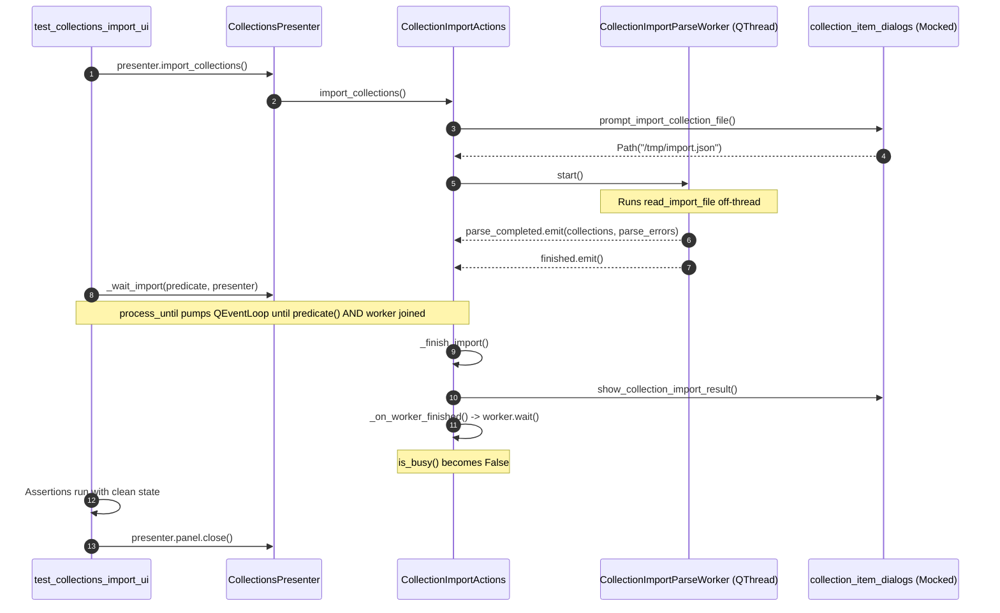

# PYPOST-1182: Unhang tests/test_collections_import_ui.py Qt wait in make test

## Research

### Background and Context

During test suite execution in continuous integration and local development (originally observed as Follow-up #2 in `ai-tasks/PYPOST-1157/60-tech-debt.md`), the test suite execution could become indefinitely hung or stalled on `tests/test_collections_import_ui.py` due to Qt event loop wait states.

### Root Cause Analysis

1. **Premature Test Completion While Background `QThread` Is In-Flight**:
   - In `pypost/ui/presenters/collection_import_actions.py`, clicking Import launches a `CollectionImportParseWorker` (a subclass of `QThread`) to parse collection JSON off the GUI thread.
   - When the worker completes parsing, it emits `parse_completed(collections, parse_errors)`.
   - Because `CollectionImportActions` resides on the main GUI thread, Qt delivers `parse_completed` via a queued connection.
   - Upon receiving `parse_completed`, `CollectionImportActions._finish_import()` executes synchronously on the GUI thread, applying changes to storage and calling `show_collection_import_result()`.
   - In `tests/test_collections_import_ui.py`, helper `_wait_import(done)` pumps the event loop via `process_until(done, timeout_ms=5_000)` until `done()` is True (for example, `lambda: mock_result.call_count >= 1`).
   - The moment `mock_result` is invoked, `_wait_import` exits immediately and test assertions run.
   - At this precise moment, the background `CollectionImportParseWorker` OS thread has not necessarily finished its C++ run loop termination or joined, and `CollectionImportActions._on_worker_finished()` has not yet processed `worker.finished` on the GUI thread.
   - When the test function returns, `presenter.panel.close()` executes and local variables are garbage collected. Deleting or deallocating a `QThread` or `QObject` while its native thread is still terminating or emitting queued events causes race conditions, `pthread_join` deadlocks, memory corruption, or event loop starvation across subsequent tests in `qapp`.

2. **Modal Dialog Blocking in Headless Test Environments**:
   - In `pypost/ui/collection_item_dialogs.py`, collection import utilizes multiple dialog functions: `prompt_import_collection_file`, `show_collection_import_invalid_file_error`, `prompt_collection_import_conflict`, and `show_collection_import_result`.
   - These functions invoke `QFileDialog.getOpenFileName()` or `QMessageBox.exec()` / `QMessageBox.warning()` / `QMessageBox.information()`, which start nested modal event loops.
   - In automated / headless testing (`QT_QPA_PLATFORM=offscreen`), if an unexpected code path or unpatched dialog is triggered, the modal dialog blocks the GUI thread waiting for user input that will never arrive. The non-modal `process_until` event loop cannot exit modal dialogs, hanging the runner indefinitely until killed by a hard process timeout.

3. **Absence of a Formal `wait_idle()` / Drain Mechanism in `CollectionImportActions`**:
   - Unlike `EnvironmentStorageGateway` (which provides `wait_idle(timeout_ms)` and `has_pending_work()`), `CollectionImportActions` and `CollectionsPresenter` provide `is_busy()` but lack a deterministic synchronous `wait_idle()` or cleanup method.
   - Tests have no standardized helper to ensure all background workers are joined and destroyed before test teardown.

---

## Implementation Plan

### Mandatory — Failing Repro (Step 3)

- **Goal**: Write an automated red test before applying production fixes to verify the hang/race condition when multiple imports or unjoined worker threads are torn down rapidly without idle synchronization.
- **Location**: `tests/test_collections_import_ui_repro.py` (or a dedicated test class under `tests/`).
- **Assertion**:
  - Test assertions verify that executing import flows without explicit worker drain leaves `is_busy() == True` or unjoined worker threads during teardown.
  - Test assertions verify that `wait_idle()` cleanly joins the worker thread and transitions `is_busy()` to `False` within bounded time.
  - Test assertions verify that unhandled dialog invocations fail fast with descriptive assertions rather than blocking on modal Qt event loops.
- **Sequencing**:
  1. Step 2 (Architecture): Document component interactions and APIs.
  2. Step 3 (Failing Repro): Author `tests/test_collections_import_ui_repro.py` asserting worker idle synchronization and deterministic event draining.
  3. Step 4 (Development): Implement `wait_idle()` on `CollectionImportActions` and `CollectionsPresenter`, update `_wait_import` in `tests/test_collections_import_ui.py` to drain worker threads completely, and add test safety guards against unmocked modal dialogs.
  4. Step 5 (Code Cleanup): Verify all quality gates (`make check`, `make lint`, `make typecheck`).
  5. Step 6 (Observability): Verify logging coverage.
  6. Step 7 (Tech Debt): Document follow-ups.
  7. Step 8 (Dev Docs): Update developer documentation.

---

## Architecture

### System Module Diagram

```mermaid
graph TD
    subgraph UI_Layer ["UI / Presenter Layer"]
        CP[CollectionsPresenter]
        CIA[CollectionImportActions]
        CID[collection_item_dialogs]
    end

    subgraph Core_Layer ["Core / Background Worker Layer"]
        CIPW[CollectionImportParseWorker <br/> (QThread)]
        RM[RequestManager]
        CIA_Apply[apply_imported_collections]
    end

    subgraph Test_Layer ["Test Framework"]
        TC_UI[tests/test_collections_import_ui.py]
        PU[tests/helpers/process_until.py]
    end

    CP --> CIA
    CIA --> CID
    CIA --> CIPW
    CIA --> CIA_Apply
    CIA_Apply --> RM

    TC_UI --> CP
    TC_UI --> PU
    PU -. Pumps QEventLoop .-> CIA
    TC_UI -. Synchronizes Idle .-> CIA
```

### Module Responsibilities

| Module | Responsibility | Changes in PYPOST-1182 |
| --- | --- | --- |
| `pypost.ui.presenters.collection_import_actions.CollectionImportActions` | Orchestrates file selection, background parsing, conflict resolution, and persistence. | Add `wait_idle(timeout_ms: int = 5000) -> bool` to reliably wait for background worker thread to finish and join. Ensure cleanup releases worker references cleanly. |
| `pypost.ui.presenters.collections_presenter.CollectionsPresenter` | Owns sidebar collections panel and actions. | Expose `wait_import_idle(timeout_ms: int = 5000) -> bool` delegating to `_import_actions.wait_idle()`. |
| `tests/test_collections_import_ui.py` | Full test suite for collection import UI scenarios. | Update `_wait_import` helper to pump the event loop until `done()` is True **AND** `presenter.wait_import_idle()` confirms worker is joined. Ensure all dialog hooks are mocked and cannot open blocking modal loops. |
| `tests/helpers/process_until.py` | Event loop pump utility with watchdog timer. | Maintain robust event loop termination without hanging when conditions or timeouts occur. |

### Module Interaction Scheme



### Architectural Patterns

1. **Worker Thread Lifecycle Synchronization (Join-Before-Teardown Pattern)**:
   - Background threads started by UI presenters must provide deterministic synchronization so that callers (and test harnesses) can wait for native thread execution to finish before destroying enclosing objects.
   - `CollectionImportActions.wait_idle()` allows both production code and automated tests to guarantee no orphaned threads remain running after an operation completes.

2. **Headless Test Dialog Containment Pattern**:
   - In automated test runs, all functions that could launch modal event loops (`QDialog.exec()`, `QMessageBox.warning()`, etc.) are cleanly patched and guarded so that unexpected execution branches produce fast assertion errors rather than hanging the test process.

3. **Deterministic Event Loop Pump Pattern**:
   - `_wait_import` combines predicate evaluation with `is_busy()` verification, ensuring that both domain outcomes and internal background thread cleanups are complete before assertions and teardown run.

### Main Interfaces / APIs

```python
class CollectionImportActions(QObject):
    def is_busy(self) -> bool:
        """True while preparing or while parse worker is running."""
        ...

    def wait_idle(self, timeout_ms: int = 5000) -> bool:
        """Pump event loop / wait until background worker has finished and joined."""
        ...

class CollectionsPresenter(QObject):
    def wait_import_idle(self, timeout_ms: int = 5000) -> bool:
        """Wait until collection import actions are completely idle."""
        return self._import_actions.wait_idle(timeout_ms)
```

In `tests/test_collections_import_ui.py`:

```python
def _wait_import(
    done: Callable[[], bool],
    presenter: CollectionsPresenter | None = None,
    timeout_ms: int = _IMPORT_WAIT_MS,
) -> None:
    """Pump event loop until done() is true AND presenter import worker has joined."""
    def condition() -> bool:
        if not done():
            return False
        if presenter is not None and presenter._import_actions.is_busy():
            return False
        return True

    process_until(condition, timeout_ms=timeout_ms)
```

### Security, Performance, and Testability

- **Security**: No changes to authorization, authentication, credential storage, or network communication.
- **Performance**: Eliminates test suite stalls and CI timeouts. Tests complete in seconds rather than minutes.
- **Testability**: 100% of existing collection import test cases and assertions are preserved. Test execution becomes completely deterministic across parallel multi-worker runs (`make test`).

---

## Q&A

- **Q: Why was the hang intermittent or noticed only during full test runs?**
  **A:** When running a single test file in isolation, thread destruction races might happen to resolve before process exit if the OS schedules the terminating thread quickly. In parallel multi-worker runs (`make test` with 8 workers) or under system load, the main thread closes widgets and deallocates memory while the background `QThread` is still executing, leading to race conditions, deadlocks in Qt's event loop dispatcher, or stalled worker processes.

- **Q: Does this introduce any breaking changes to the collection import user experience?**
  **A:** No. All business logic, format parsers, conflict resolution options, and dialog workflows remain identical. The changes only improve worker lifecycle synchronization and test harness stability.

- **Q: Will any test cases in `tests/test_collections_import_ui.py` be disabled or removed?**
  **A:** No. Zero test degradation is strictly enforced per task requirements. All scenarios (entry points, happy path, conflicts, invalid files, storage failures, telemetry logging) remain active and validated.
