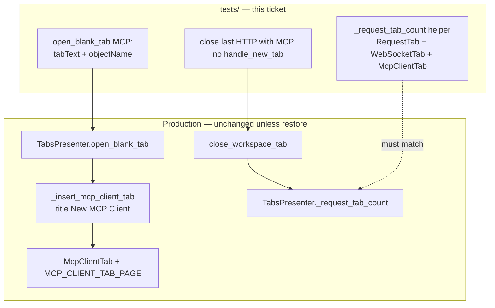

# PYPOST-1183: Prove MCP Client stub title, identity, and last-tab count

Step 2 artifact for PYPOST-1183. Turns the approved requirements in
[`10-requirements.md`](10-requirements.md) into a high-level architecture for
hermetic automated proof of the shipped MCP Client blank-tab contract from
[PYPOST-1165](https://pypost.atlassian.net/browse/PYPOST-1165): tab strip
title **New MCP Client**, widget identity `pypost_mcp_client_tab_page`, and
last-HTTP-close-with-MCP-remaining counting. Product UX stays as shipped;
this debt item closes follow-up 2 in
`ai-tasks/PYPOST-1165/60-tech-debt.md`.

**Scope:** Presenter / suite proofs that lock title, identity, and
non-empty workspace count alignment. No MCP draft shell, picker reuse, or
session restore work. Optional construction-only checks remain optional if
FR-1..FR-4 are met.

## Research

### R-1 Gap vs existing coverage (repo facts)

| Product edge | Covered today | Gap this ticket closes |
| --- | --- | --- |
| Picker → `McpClientTab` (not HTTP / WS) | `TestHandleNewTabProtocolPicker` in `tests/test_tabs_presenter.py` | Unchanged; keep green |
| Metrics `protocol=mcp_client` | Same class + metrics allow-list tests | Unchanged |
| Tab title **New MCP Client** | `test_add_blank_mcp_client_tab_creates_draft` asserts `tabText` after **factory** `add_blank_mcp_client_tab` | No assert after **`open_blank_tab(MCP_CLIENT)`** / picker confirm — routing→title contract unlocked |
| Widget id `pypost_mcp_client_tab_page` | `tests/test_mcp_client_tab.py` asserts `tab.objectName() == MCP_CLIENT_TAB_PAGE` on draft construction | Presenter path after blank open does **not** assert identity |
| Last HTTP close with MCP remaining | Production `_request_tab_count` includes `McpClientTab`; `close_workspace_tab` only calls `handle_new_tab("last_tab")` when count is 0 | **No** test closes the last HTTP while an MCP tab remains and proves no new blank HTTP / no last-tab picker |
| Suite “non-empty” helper | Module helper `_request_tab_count` in `test_tabs_presenter.py` counts **`RequestTab` only** | Helper can ignore WS / MCP while production counts all three — regression drop of MCP from production count can hide |

Source of the debt: PYPOST-1165 follow-up 2 (Missing Tests / Code Quality —
HTTP-only test helper). Draft shell (PYPOST-1166+) replaced stub chrome
inside the same `McpClientTab` class and kept
`set_widget_id(..., MCP_CLIENT_TAB_PAGE)` and title `"New MCP Client"`;
verification of those edges from the **blank-open / close-count** path is
still missing.

### R-2 Production contracts under test

**Title** (`TabsPresenter._insert_mcp_client_tab`):

```text
name = connection.name if connection.name else "New MCP Client"
# inserted as QTabWidget tab text
```

Blank open uses `McpClientConnection()` whose default `name` is
`"New MCP Client"` (`pypost/models/mcp_client.py`).

**Identity** (`McpClientTab.__init__` → `set_widget_id`):

```text
MCP_CLIENT_TAB_PAGE = "pypost_mcp_client_tab_page"
set_widget_id(self, MCP_CLIENT_TAB_PAGE)
# → objectName + accessibleIdentifier mirror (widget_ids.set_widget_id)
```

Qt / tooling practice: stable `objectName` (and mirrored
`accessibleIdentifier`) is the reliable finder for automated tests; do not
key off transient layout text
([Qt `QObject.setObjectName`](https://doc.qt.io/qtforpython-6/PySide6/QtCore/QObject.html);
[pytest-qt prefers widget APIs over click simulation](https://pytest-qt.readthedocs.io/en/stable/reference.html);
community guidance to assert `objectName` for finders
([Stack Overflow / findChild by name](https://stackoverflow.com/questions/76574722/pytest-qt-to-test-menu-functionality))).

**Non-empty count** (`TabsPresenter._request_tab_count`):

```python
isinstance(self._tabs.widget(i), (RequestTab, WebSocketTab, McpClientTab))
```

**Empty-strip path** (`tabs_presenter_close.close_workspace_tab`,
PYPOST-1159):

```text
removeTab → if _request_tab_count() == 0: handle_new_tab("last_tab")
            else: _ensure_current_is_navigable(...)
```

So “auto-create blank HTTP while MCP remains” means the close path
incorrectly treating the strip as empty (count 0) and entering
`handle_new_tab("last_tab")`, which may open HTTP via the picker. Proof
must show: after closing the last HTTP with an MCP tab still open,
`handle_new_tab` is **not** called, no new `RequestTab` appears, and
production count stays ≥ 1.

### R-3 Hermetic Qt tab assertions (external + project precedent)

- Prefer **direct presenter APIs** (`open_blank_tab`, `close_tab`,
  `tabText`, `objectName` / `widget_ids.MCP_CLIENT_TAB_PAGE`) over mouse
  simulation on the tab bar
  ([pytest-qt tutorial](https://github.com/pytest-dev/pytest-qt/blob/4.3.1/docs/tutorial.rst)).
- Assert strip labels via `QTabWidget.tabText(index)`
  ([Qt for Python `QTabWidget.tabText`](https://doc.qt.io/qtforpython-6.10/PySide6/QtWidgets/QTabWidget.html)).
- Inject `protocol_picker` (or call `open_blank_tab` directly) — same
  pattern as `TestHandleNewTabProtocolPicker` / PYPOST-1180. No live
  `QMenu.exec()`, no MCP SDK, no network.
- Wrap `handle_new_tab` / `add_new_tab` with mocks when proving the
  last-HTTP-close path does not enter the empty-strip branch (same style
  as `TestCloseLastTabProtocolPicker`).

### R-4 Production change expectation

Requirements state title, identity, and count behavior are already correct
for users; this is **verification debt**, not a UX feature. Default plan:

- **Widen the suite helper** `_request_tab_count` in
  `tests/test_tabs_presenter.py` to match production
  `(RequestTab, WebSocketTab, McpClientTab)` — test-only change (FR-4).
- **Add presenter proofs** for title + identity after blank MCP open, and
  for last-HTTP-close-with-MCP-remaining.
- **No production module change** unless a new proof fails against the
  documented PYPOST-1165 contract (FR-6.2) — then restore title / id /
  count only; no feature expansion.

`tests/test_delete_open_tabs_integration.py` also has an HTTP-only
`_request_tab_count`; it is out of scope for this ticket (delete-open-tabs
HTTP path). Do not broaden that file unless a Step 4 review finds a
concrete FR-4 dependency.

### R-5 Test harness constraints (lsr-python / do-testing)

- Primary file: `tests/test_tabs_presenter.py` — already
  `pytestmark = pytest.mark.timeout(60)` and `@pytest.mark.usefixtures("qapp")`.
- Prefer extending existing classes:
  - `TestHandleNewTabProtocolPicker` (or adjacent methods on
    `TestTabsPresenter`) for title / identity after blank MCP open.
  - `TestCloseLastTabProtocolPicker` (or a focused sibling class) for
    last-HTTP-close-with-MCP-remaining.
- Optional FR-5: construction-only in `tests/test_mcp_client_tab.py`
  (already has `objectName` asserts and module timeouts). Only add if
  Step 3/4 still need a dedicated minimal constructor check; do not pull
  MCP SDK.
- Do not re-prove picker menu construction or metrics allow-list (NFR-3).

## Implementation Plan

### High-level approach

1. Align `tests/test_tabs_presenter.py` `_request_tab_count` with
   production `(RequestTab, WebSocketTab, McpClientTab)`.
2. Add hermetic presenter proofs:
   - After `open_blank_tab(TabProtocol.MCP_CLIENT, ...)` (and/or MCP
     picker confirm), strip text is **New MCP Client** and page
     `objectName` is `pypost_mcp_client_tab_page` (or
     `widget_ids.MCP_CLIENT_TAB_PAGE`).
   - With HTTP + MCP open, closing the HTTP tab does **not** call
     `handle_new_tab` / create a new blank `RequestTab`; MCP remains.
3. Leave production routing / chrome unchanged unless a proof exposes a
   real defect against the PYPOST-1165 contract.
4. Keep existing PYPOST-1165 picker / routing / metrics tests green.

### Suggested implementation order (Steps 3–4)

1. **Step 3 — automated proofs:** add red (or lock) tests for title,
   identity, last-HTTP-close-with-MCP, and helper alignment. Prefer
   writing assertions first; helper widen may land with the count /
   close tests so they can observe MCP tabs. No production edits in
   Step 3.
2. **Step 4 — green / restore:** expected path is already-green product
   + test-only helper + new asserts. If any assertion fails against
   current product, restore title / `set_widget_id` / `_request_tab_count`
   tuple only.
3. Run focused suite via Makefile, e.g.
   `make test PYTEST_ARGS="tests/test_tabs_presenter.py -k 'mcp_client or CloseLastTab or request_tab_count' -v"`,
   then broader regression smoke for picker / metrics as needed.

### Mandatory — Failing Repro (next Step 3)

**Runtime product change:** `N/A — no behavioral change` expected. This
ticket is verification debt; the PYPOST-1165 title / identity / count
contract is already product behavior. Do **not** break production solely
to force a red→green cycle.

**Automated proofs to author in Step 3** (before any production edit):

| Test (suggested names) | Asserts (desired behavior) | How to force / stay hermetic |
| --- | --- | --- |
| `test_open_blank_tab_mcp_client_sets_title_new_mcp_client` | After `open_blank_tab(MCP_CLIENT, ...)`, `tabText(indexOf(current)) == "New MCP Client"` | Direct `open_blank_tab`; no picker UI |
| `test_open_blank_tab_mcp_client_sets_widget_id` | Current page `objectName() == MCP_CLIENT_TAB_PAGE` (`pypost_mcp_client_tab_page`) | Same; import constant from `widget_ids` |
| `test_close_last_http_with_mcp_remaining_does_not_auto_open_http` | HTTP + MCP open → `close_tab` on HTTP index → no `handle_new_tab`, remaining page is `McpClientTab`, no new blank `"New Request"` | Wrap `handle_new_tab`; assert call count 0 |
| Helper alignment (same change or dedicated assert) | Module `_request_tab_count` counts MCP (and WS) like production | After `add_blank_mcp_client_tab`, helper count ≥ 1; after HTTP+MCP with HTTP closed, helper still ≥ 1 |

- **Where:** `tests/test_tabs_presenter.py` (module `timeout(60)`, `qapp`).
- **No live deps:** no MCP SDK, no live `QMenu.exec()`, no network.
- **Expected first run:** product asserts likely **green**; helper-based
  close / count asserts may be **red** until the HTTP-only helper is
  widened (that red is intentional verification of FR-4). Sequencing:
  research (this document) → Step 3 proofs → Step 4 helper align + any
  restore → keep PYPOST-1165 coverage green.

Optional (FR-5): only if Step 3 finds no adequate construction signal —
a minimal `McpClientTab` / factory identity assert already exists in
`test_mcp_client_tab.py`; do not duplicate without need.

## Architecture

### Requirements → design

| Requirement | Architecture |
| --- | --- |
| FR-1 Stub title | Presenter test after `open_blank_tab(MCP_CLIENT)` asserts strip **New MCP Client** (factory title assert may remain as secondary) |
| FR-2 Widget identity | Same path asserts `objectName` / `MCP_CLIENT_TAB_PAGE` |
| FR-3 Last-HTTP close with MCP remaining | Close-path test: MCP remains; `handle_new_tab` not entered; no new blank HTTP |
| FR-4 Suite count aligned | Widen `test_tabs_presenter._request_tab_count` to `(RequestTab, WebSocketTab, McpClientTab)` |
| FR-5 Optional construction | Prefer existing `test_mcp_client_tab.py` identity coverage; add only if still needed |
| FR-6 No product expansion | Default tests-only; production fix only to restore PYPOST-1165 edges |
| NFR-1..5 | Module timeouts, hermetic mocks, deterministic, no MCP SDK |

### System modules and responsibilities

| Module | Role this ticket |
| --- | --- |
| `tests/test_tabs_presenter.py` | **Primary:** new proofs + helper alignment |
| `TabsPresenter` / `tabs_presenter_close.close_workspace_tab` | **Under test** (no change expected) |
| `McpClientTab` + `widget_ids.MCP_CLIENT_TAB_PAGE` | Identity source under test |
| `tests/test_mcp_client_tab.py` | Optional FR-5 only |
| Picker / metrics modules | Out of scope; must stay green |



### Module interaction (close-last-HTTP with MCP remaining)

```mermaid
sequenceDiagram
  participant T as test_tabs_presenter
  participant P as TabsPresenter
  participant C as close_workspace_tab
  participant Q as QTabWidget

  T->>P: add_new_tab() + add_blank_mcp_client_tab()
  T->>P: close_tab(http_index)
  P->>C: close_workspace_tab(...)
  C->>Q: removeTab(http)
  C->>P: _request_tab_count()
  Note over P: MCP still counted → count >= 1
  C-->>P: skip handle_new_tab("last_tab")
  T->>T: assert no handle_new_tab; current is McpClientTab
```

### Main interfaces / APIs (test surface)

```python
# Production (read-only for this ticket unless restore)
TabsPresenter.open_blank_tab(protocol: TabProtocol, source: str) -> None
TabsPresenter.add_blank_mcp_client_tab(*, save_state: bool = True) -> McpClientTab
TabsPresenter.close_tab(index: int) -> None
TabsPresenter._request_tab_count() -> int  # RequestTab | WebSocketTab | McpClientTab

# widget_ids
MCP_CLIENT_TAB_PAGE = "pypost_mcp_client_tab_page"

# Suite helper (change in this ticket)
def _request_tab_count(presenter: TabsPresenter) -> int:
    return sum(
        1
        for i in range(presenter.widget.count())
        if isinstance(
            presenter.widget.widget(i),
            (RequestTab, WebSocketTab, McpClientTab),
        )
    )
```

Existing HTTP-only callers of the module helper remain valid: HTTP counts
are unchanged; WS/MCP now contribute when present. Review any assertion
that assumed “helper == HTTP-only” after multi-protocol setups (none of
the current HTTP-focused cases open MCP).

### Architectural patterns

| Pattern | Application |
| --- | --- |
| **Verification debt / lock tests** | Prove shipped contract; no new UX (same as PYPOST-1180) |
| **Presenter integration over chrome duplication** | Title/identity after `open_blank_tab`, not only draft-shell construction |
| **Mirror production types in test helpers** | Suite count tuple matches `_request_tab_count` |
| **Dependency injection** | Injected `protocol_picker` / wrap `handle_new_tab` for hermetic close proofs |
| **Fail-soft product edits** | Production touch only to restore documented edges |

### Out of scope (do not implement here)

- MCP draft shell / outbound SDK (PYPOST-1166+).
- Close-last-tab picker product policy beyond “MCP counts as non-empty”
  (PYPOST-1159).
- Session persist / restore of MCP tabs.
- Picker HTTP / WebSocket / dismiss mapping (PYPOST-1180).
- User docs (PYPOST-1168).
- Widening `_request_tab_count` in
  `tests/test_delete_open_tabs_integration.py` (unless FR-4 review
  requires it).

## Q&A

| Question | Answer |
| --- | --- |
| Why assert title again if `add_blank_mcp_client_tab_creates_draft` already checks `tabText`? | That locks the **factory**. This ticket also locks the **`open_blank_tab` / blank-open** path so a routing change that opens MCP without the title cannot hide behind isinstance-only routing tests (PYPOST-1165 follow-up 2 wording). |
| Why assert identity in the presenter suite if `test_mcp_client_tab.py` already checks `objectName`? | Construction proves the page class. Presenter path proves the **inserted** blank tab keeps that id after workspace insert — the locator later draft work and tooling use. |
| Does FR-3 mean “close the MCP stub as last tab”? | No. Requirements: close the **last HTTP** while MCP **remains**. Closing the sole MCP tab is the empty-strip / last_tab picker case (PYPOST-1159), out of scope except that MCP must count when present. |
| Will widening the helper break existing tests? | Unlikely: existing cases mostly use HTTP-only strips. After widen, HTTP counts stay the same; MCP/WS-inclusive scenarios become visible — required for FR-4. |
| Is a production bug fix in scope if a proof fails? | Yes, only to restore the PYPOST-1165 title / identity / count contract (FR-6.2). |
| Must FR-5 construction tests be added? | No, if FR-1..FR-4 are met. Prefer not duplicating existing `test_mcp_client_tab.py` identity asserts. |

## References

- [`10-requirements.md`](10-requirements.md)
- [`ai-tasks/PYPOST-1165/60-tech-debt.md`](../PYPOST-1165/60-tech-debt.md) — follow-up 2 (source)
- [`ai-tasks/PYPOST-1165/20-architecture.md`](../PYPOST-1165/20-architecture.md) — stub / count design
- [`ai-tasks/PYPOST-1180/20-architecture.md`](../PYPOST-1180/20-architecture.md) — verification-debt pattern
- [PYPOST-1183](https://pypost.atlassian.net/browse/PYPOST-1183)
- [PYPOST-1165](https://pypost.atlassian.net/browse/PYPOST-1165)
- [PYPOST-1159](https://pypost.atlassian.net/browse/PYPOST-1159) — last-tab → `handle_new_tab`
- `pypost/ui/presenters/tabs_presenter.py`
- `pypost/ui/presenters/tabs_presenter_close.py`
- `pypost/ui/widgets/mcp_client/mcp_client_tab.py`
- `pypost/ui/widget_ids.py`
- `tests/test_tabs_presenter.py`
- `doc/dev/new_tab_protocol_picker.md`
- [Qt for Python `QTabWidget`](https://doc.qt.io/qtforpython-6.10/PySide6/QtWidgets/QTabWidget.html)
- [pytest-qt tutorial](https://github.com/pytest-dev/pytest-qt/blob/4.3.1/docs/tutorial.rst)
