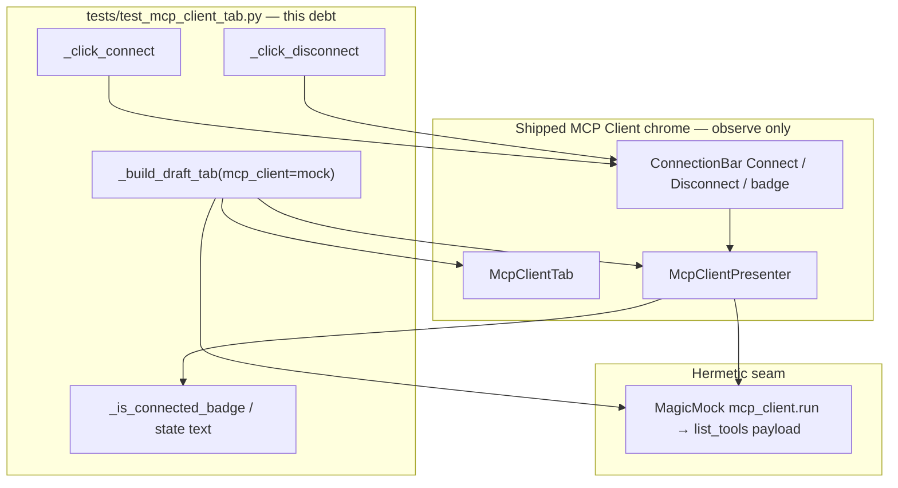
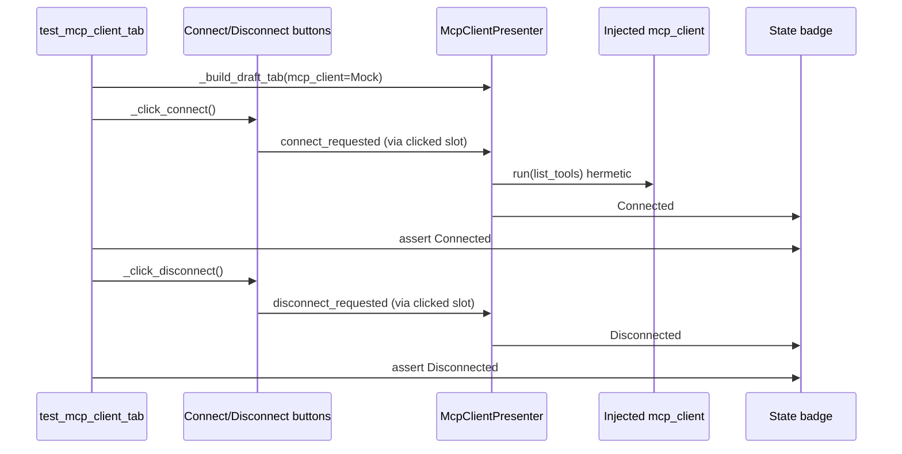

# PYPOST-1185: Prove Connect / Disconnect button paths update connection state hermetically

Step 2 artifact for
[PYPOST-1185](https://pypost.atlassian.net/browse/PYPOST-1185). Turns the
approved requirements in [`10-requirements.md`](10-requirements.md) into a
high-level architecture for **hermetic GUI proof** that the MCP Client
**Connect** / **Disconnect** controls drive the connection-state badge —
without opening a real network session in CI.

Parent / source:
[`ai-tasks/PYPOST-1166/60-tech-debt.md`](../PYPOST-1166/60-tech-debt.md)
follow-up 7; draft-shell architecture
[`ai-tasks/PYPOST-1166/20-architecture.md`](../PYPOST-1166/20-architecture.md).
Live Connect / list_tools already lives in `tests/test_mcp_client_tab.py`
(PYPOST-1169+).

**Scope:** automated button-path → badge regression signal (FR-1–FR-4);
isolate the outbound MCP client (FR-2); keep product chrome unchanged
(FR-5).

**Not this story:** empty-URL policy, CONNECTING UX, connect-error copy,
headers / invoke polish, tool-browser expansion, user docs, sibling suite
flakes.

## Research

### R-1 Ticket vs durable contract

| Source | Wording | Architectural reading |
| --- | --- | --- |
| Jira summary / description | “click Connect … patch `MCPClientService.run` and assert it is **not** called; Disconnect returns Disconnected” | Draft-shell era (PYPOST-1166 Option A: local Connect, no outbound client) |
| `10-requirements.md` FR-2.3 | “assert … not called” meant **no live network in CI**; after live Connect, success may use an **isolated** outbound client | **Adopt FR-2.3.** Hermetic `mcp_client=` injection (or equivalent) satisfies the business need; do not freeze “never invoke client on success” as a product rule |
| Debt item 7 | Optional GUI check in `tests/test_mcp_client_tab.py` | Keep the suite; extend it rather than inventing a new module |

### R-2 Current codebase (repo facts)

| Area | Current state | Architectural impact |
| --- | --- | --- |
| `McpClientTab` | Wires `connect_btn.clicked` → `presenter.connect_requested`, `disconnect_btn.clicked` → `presenter.disconnect_requested` (`mcp_client_tab.py`) | Product button path **exists**. This debt proves it stays wired |
| `McpClientConnectionBar` | Widget ids `MCP_CLIENT_CONNECT_BUTTON`, `MCP_CLIENT_DISCONNECT_BUTTON`, `MCP_CLIENT_STATE_BADGE`; labels Connected / Disconnected / …; Disconnect enabled only when Connected or Connecting | Tests must Connect first (hermetic success) before Disconnect click is effective |
| `McpClientPresenter` | Live Connect starts `list_tools` via worker + `MCPClientService` (or injected `mcp_client`); Disconnect releases session and syncs UI | Inject `MagicMock` / fake client via `_build_draft_tab(mcp_client=…)` — same pattern as live Connect tests |
| `tests/test_mcp_client_tab.py` | Module `pytestmark = timeout(30)`; helpers `_build_draft_tab`, `_click_connect`, `_is_connected_badge`, `_wait_connect_settled`; presenter logging calls `connect_requested` / `disconnect_requested` **directly** | Gap: no `_click_disconnect`; no focused Connect→Disconnect **button** cycle that only cares about badge chrome |
| Live Connect tests | Already `_click_connect` + assert Connected (and tools / `run`) under mock client | FR-1 partially covered as a side effect of list_tools tests; FR-3 (Disconnect **control**) is **not** covered |
| Logging test | `test_presenter_logs_connect_disconnect_teardown` bypasses buttons | Confirms why this debt exists (FR-1.1 / FR-3.1) |

### R-3 GUI click patterns (external + project)

| Guidance | Source | Adopt |
| --- | --- | --- |
| Prefer widget methods (`QPushButton.click()`) over `qtbot.mouseClick` for normal interactions — more reliable, no extra event-loop pass | [pytest-qt tutorial](https://pytest-qt.readthedocs.io/en/4.4.0/tutorial.html) | Keep existing `_click_connect` style; add `_click_disconnect` the same way |
| Bound async GUI settlement with `wait_until` (no open-ended waits) | `doc/dev/testing.md`, `tests/helpers/qt_wait.py`, do-testing | Reuse `_CONNECT_SETTLE_S` / `wait_until` for Connected after Connect; Disconnect sync path may settle immediately but still allow a short bound if needed |
| Explicit `pytest.mark.timeout` on every test | do-testing / lsr-python | Module already has `timeout(30)` — new tests inherit it |
| Hermetic MCP outbound isolation | MCP SDK in-memory / mock-session patterns; PyPost already injects `mcp_client` into the presenter | Prefer **injected mock client returning a successful `list_tools` payload** over patching the service class globally; never hit a live server |

### R-4 Options for this debt

| Option | Behavior | Verdict |
| --- | --- | --- |
| **A — Focused chrome-cycle tests in `test_mcp_client_tab.py`** | Click Connect → Connected; hermetic client; click Disconnect → Disconnected; reuse helpers | **Chosen.** Matches Jira location, FR scope, and existing harness |
| B — Assert `MCPClientService.run` is never called on successful Connect | Freezes draft-shell rule; conflicts with live Connect + FR-2.3 | Rejected as product assert; isolation replaces it |
| C — New test module only for button paths | Extra file for thin assertions | Rejected; keep suite cohesion |
| D — Production refactor of wiring | Not required unless Step 3 proves a broken slot | Out of scope unless red |

### R-5 Verification-debt red/green reality

Product Connect / Disconnect slots are already wired. Step 3 writes the
**desired** button-path assertions. Outcomes:

- **Red:** a real chrome regression (broken slot, badge not updated) → Step 4
  restores the shipped contract only.
- **Green on first run:** coverage gap closed without a production defect →
  Step 4 is harness-only (land / polish tests); **no product feature work**
  (FR-5).

Do not weaken asserts with `xfail` / `skip`. Do not break production on
purpose to force red.

## Implementation Plan

### High-level approach

Treat PYPOST-1185 as **test-suite architecture**, not a new UI feature.
Extend `tests/test_mcp_client_tab.py` with a focused hermetic Connect →
Connected → Disconnect → Disconnected path that activates the **buttons**,
not the presenter entry points. Reuse `_build_draft_tab(mcp_client=…)`,
badge helpers, and bounded `wait_until`. Leave presenter, connection bar,
and tab production modules untouched unless a proof exposes a real wiring
defect.

### Suggested implementation order

1. Step 3: add `_click_disconnect` + focused test(s) asserting FR-1–FR-3 under
   injected mock client; run targeted suite; record red vs green.
2. Step 4: if red, fix only the button → presenter → badge path needed to
   restore the contract; if green, keep tests as the permanent regression
   signal (no chrome feature work).
3. Confirm existing MCP Client coverage stays green (`make test` / targeted
   `PYTEST_ARGS`).

### Mandatory — Failing Repro (next Step 3)

Write automated checks **before** any production change. No new chrome
features, no Connect policy changes, no live MCP server.

**Sequencing:** this document → Step 3 focused tests in
`tests/test_mcp_client_tab.py` → run them (expect red only if wiring is
broken; green closes coverage) → Step 4 only if production must change.

#### Primary — button-path badge cycle (hermetic)

**Module:** `tests/test_mcp_client_tab.py` (existing `pytestmark =
pytest.mark.timeout(30)`, `qapp`).

**Helpers to add / reuse:**

- Reuse `_build_draft_tab`, `_set_url`, `_click_connect`, `_is_connected_badge`,
  `_tools_response`, `_wait_connect_settled` (or a badge-only settle that still
  requires hermetic success).
- Add `_click_disconnect(tab)` mirroring `_click_connect` via
  `MCP_CLIENT_DISCONNECT_BUTTON` + `button.click()`.

| Test (suggested name) | Asserts (desired) |
| --- | --- |
| `test_click_connect_updates_badge_to_connected_hermetic` | Build tab with `mcp_client=MagicMock` returning successful `_tools_response()`; set URL; **`_click_connect`** (not `presenter.connect_requested`); wait until Connected; assert `_is_connected_badge`; assert mock `run` was used only through the injected client (no real sockets — client is the mock) |
| `test_click_disconnect_returns_badge_to_disconnected` | After hermetic Connected as above; **`_click_disconnect`**; assert badge shows Disconnected / idle (not Connected) |

Optional combine into one cycle test if clearer; keep both FR-1 and FR-3
visible in asserts.

**Hermetic isolation (FR-2):** always pass `mcp_client=` into the presenter
ctor via `_build_draft_tab`. Do **not** require a live MCP server. Do **not**
assert “`run` never called” on successful Connect (FR-2.3).

**Out of Step 3:** tool listing content, invoke, headers, metrics, empty-URL
policy, CONNECTING copy, Collections, user docs.

## Architecture

### Recommended approach

**Extend the existing MCP Client tab GUI suite** with hermetic
control-click proofs of Connected / Disconnected. Rely on the shipped
Presenter + ConnectionBar + Tab wiring; inject a fake outbound client so CI
never opens network.

**Rationale:**

1. Requirements are verification debt, not a new UX story (FR-5).
2. Widget ids and `_click_connect` already exist; the missing piece is
   Disconnect-click coverage and a chrome-focused Connect assert that is not
   only a side effect of list_tools tests.
3. Presenter already accepts `mcp_client=` — the project’s established
   hermetic seam (lsr-python: dependency injection for tests).
4. `QPushButton.click()` matches pytest-qt guidance and the suite’s current
   style.
5. Jira’s “run not called” wording is superseded by FR-2.3 for post-1169
   live Connect.

### System modules and responsibilities

| Module | Responsibility this story |
| --- | --- |
| `tests/test_mcp_client_tab.py` | **Primary change surface.** Add Disconnect click helper + focused hermetic Connect / Disconnect badge proofs; keep module timeout |
| `tests/helpers/qt_wait.py` | Unchanged; reuse `wait_until` for Connected settle |
| `pypost/ui/widgets/mcp_client/mcp_client_tab.py` | Unchanged unless Step 3 proves a broken `clicked` slot |
| `pypost/ui/widgets/mcp_client/connection_bar.py` | Unchanged unless badge / enable gating blocks the proven path |
| `pypost/ui/presenters/mcp_client_presenter.py` | Unchanged unless disconnect / connect UI sync is defective under button activation |
| `MCPClientService` / network | Not used for real I/O in these checks; substituted via injected mock |
| `TabsPresenter` / picker / Collections | Out of scope |

### Main interfaces / APIs (test harness)

```python
# tests/test_mcp_client_tab.py — extend existing helpers

def _click_connect(tab: McpClientTab) -> None:
    """Activate Connect via the Connect control (already present)."""
    ...

def _click_disconnect(tab: McpClientTab) -> None:
    """Activate Disconnect via the Disconnect control (add)."""
    button = tab.findChild(QPushButton, widget_ids.MCP_CLIENT_DISCONNECT_BUTTON)
    assert button is not None
    button.click()

def _build_draft_tab(*, mcp_client: Any | None = None, url: str = "", ...) -> McpClientTab:
    """Existing factory — pass mcp_client for hermetic Connect."""
    ...
```

Production public APIs of `McpClientPresenter.connect_requested` /
`disconnect_requested` and connection-bar `set_session_state` stay as shipped.

### Module diagram



### Component interaction



**Threading:** Connect still uses the presenter worker for list_tools; tests
already bound that with `wait_until`. Disconnect remains a GUI-thread sync
path after Connected. No new threads or network.

### Architectural patterns

| Pattern | Application |
| --- | --- |
| **Presenter + View** | Unchanged; tests exercise View controls → Presenter → View badge |
| **Dependency injection** | Inject outbound `mcp_client` for hermetic CI (lsr-python) |
| **Widget-id find + click** | Stable ids; `QPushButton.click()` per pytest-qt |
| **Bounded wait** | `wait_until` + module timeout; no open-ended sleeps |
| **Narrow regression signal** | Assert badge chrome only; do not re-prove tools / invoke / metrics (NFR-4) |

### Boundary map (FR coverage)

| FR / NFR | Design |
| --- | --- |
| FR-1 Connect control → Connected | `_click_connect` + Connected badge assert under hermetic success |
| FR-2 no live network | Injected mock `mcp_client`; no live server |
| FR-2.3 isolation vs “never call run” | Mock may be called; real sockets must not |
| FR-3 Disconnect control → Disconnected | `_click_disconnect` after Connected |
| FR-4 timeout / no open waits | Module `timeout(30)` + `wait_until` |
| FR-5 no product expansion | Production touch only to restore broken contract |
| NFR-2 / NFR-3 / NFR-5 | Focused hermetic deterministic GUI checks |

### Explicit non-goals

- Freezing “Connect must not call `MCPClientService.run`” as a product rule
- Empty-URL / CONNECTING / error-copy product changes
- Headers, invoke, tool-browser, Collections, user-doc rewrite
- Replacing `_click_connect` with `qtbot.mouseClick` for this debt
- Growing `tabs_presenter.py` or moving chrome into the presenter

## Q&A

| Question | Answer |
| --- | --- |
| Why not assert `run` is never called? | FR-2.3: post-1169 successful Connect intentionally uses the outbound client; hermetic injection is the durable CI contract |
| Why add tests if Connect is already clicked in list_tools tests? | Those tests optimize for tools / `run` kwargs. This debt proves **Disconnect via the button** and a chrome-focused Connect path that cannot hide behind presenter-only logging |
| Will Step 3 be red? | Only if wiring/badge sync is broken. Verification debt may go green immediately; that still closes the coverage gap without `xfail` |
| Prefer patch of `MCPClientService` vs ctor inject? | Prefer ctor `mcp_client=` (existing `_build_draft_tab`); clearer and matches live suite |
| Is production code required? | No by default (FR-5). Step 4 only if Step 3 fails for a real chrome defect |

## References

- [`10-requirements.md`](10-requirements.md)
- [`ai-tasks/PYPOST-1166/20-architecture.md`](../PYPOST-1166/20-architecture.md)
- [`ai-tasks/PYPOST-1166/60-tech-debt.md`](../PYPOST-1166/60-tech-debt.md) — follow-up 7
- [PYPOST-1185](https://pypost.atlassian.net/browse/PYPOST-1185)
- [PYPOST-1166](https://pypost.atlassian.net/browse/PYPOST-1166)
- [pytest-qt tutorial — prefer widget methods over mouseClick](https://pytest-qt.readthedocs.io/en/4.4.0/tutorial.html)
- `tests/test_mcp_client_tab.py`
- `pypost/ui/widgets/mcp_client/mcp_client_tab.py`
- `pypost/ui/widgets/mcp_client/connection_bar.py`
- `pypost/ui/presenters/mcp_client_presenter.py`
