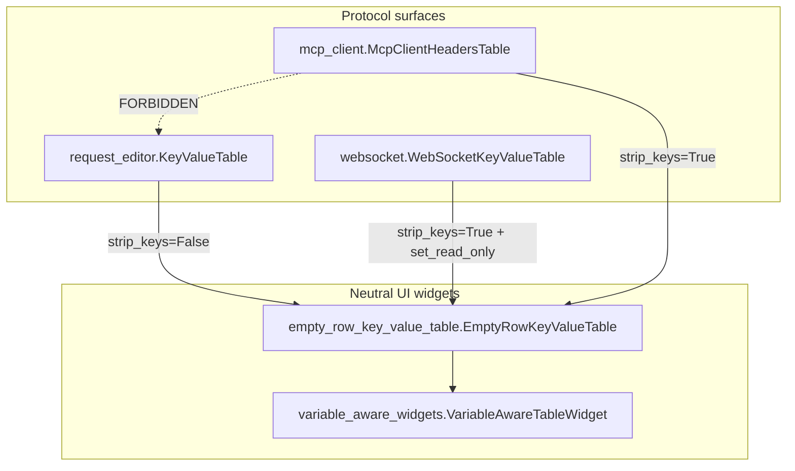

# PYPOST-1186: Shared empty-row Key/Value table for HTTP, WS, MCP headers

Step 2 artifact for PYPOST-1186. Turns the approved requirements in
[`10-requirements.md`](10-requirements.md) into a high-level architecture for
extracting one shared empty-row Key/Value `VariableAwareTableWidget` used by
HTTP request Params/Headers, WebSocket handshake Params/Headers, and MCP Client
Headers — without coupling `mcp_client` to `request_editor`.

Origin: NON-BLOCKER follow-up 4 in
[`ai-tasks/PYPOST-1167/60-tech-debt.md`](../PYPOST-1167/60-tech-debt.md).
Parent story architecture:
[`ai-tasks/PYPOST-1167/20-architecture.md`](../PYPOST-1167/20-architecture.md).

**Scope:** one shared empty-row Key/Value editor; preserve each consumer’s
current get/set / empty-row / env-aware / WS lock contracts; MCP imports the
shared module only.

**Not this story:** unifying strip semantics across protocols as a new product
rule; Ctrl+H for MCP; Collections persist; live Connect / invoke; tabs_presenter
LOC extract ([PYPOST-1184](https://pypost.atlassian.net/browse/PYPOST-1184));
optional GUI hover proofs ([PYPOST-1187](https://pypost.atlassian.net/browse/PYPOST-1187)).

## Research

### R-1 Qt empty-row Key/Value pattern

Industry and Qt docs agree on the interaction this app already uses:

- Start with one blank row; on `itemChanged` for the last row when the cell has
  text, `setRowCount(rowCount() + 1)` so a new trailing blank appears
  ([QTableWidget](https://doc.qt.io/qtforpython-6/PySide6/QtWidgets/QTableWidget.html)).
- Bulk `setItem` loops should suppress `itemChanged` via
  `blockSignals(True/False)` (or `QSignalBlocker`) so populate does not
  recursively grow rows
  ([Qt interest / forum practice](https://interest.qt-project.narkive.com/oRI3kxDO/qtablewidget-cellchanged-signal-called-while-populating-table);
  [SO: turn off signals while editing table](https://stackoverflow.com/questions/13771694/turn-off-pyqt-event-loop-while-editing-table)).
- Env hover stays on the existing `VariableAwareTableWidget` base (already
  shared); this debt only consolidates the empty-row Key/Value *behavior*
  layered on top.

No third-party widget library is required; keep the in-house subclass.

### R-2 Current codebase (three copies)

| Surface | Class | Module |
| ------- | ----- | ------ |
| HTTP Params / Headers | `KeyValueTable` | `pypost/ui/widgets/request_editor.py` (nested) |
| WS Params / Headers | `WebSocketKeyValueTable` | `pypost/ui/widgets/websocket/connection_editor.py` |
| MCP Client Headers | `McpClientHeadersTable` | `pypost/ui/widgets/mcp_client/headers_table.py` |

All three subclass `VariableAwareTableWidget`, use Key/Value headers, Stretch
resize, and grow a trailing empty row on last-row `itemChanged` when the edited
cell has text. Env fan-out (`set_variables` / `set_hidden_keys`) already works
through the shared base.

Call sites today:

- HTTP: `RequestWidget` constructs two `KeyValueTable()` instances.
- WS: `WebSocketConnectionEditor` constructs two `WebSocketKeyValueTable(self)`.
- MCP: `McpClientTab` constructs one `McpClientHeadersTable(self)` (objectName
  `pypost_mcp_client_headers_table`).

MCP deliberately does **not** import `request_editor` (PYPOST-1167 constraint;
FR-5).

### R-3 Documented divergences (must preserve)

These are the product-visible (or wire-visible) differences requirements
mandate keeping unless a later ticket unifies them.

#### D-1: Key normalization on `get_data` (strip)

| Consumer | Key acceptance | Stored key |
| -------- | -------------- | ---------- |
| HTTP `KeyValueTable` | `key_item.text()` truthy (no strip) | raw `key_item.text()` |
| WS `WebSocketKeyValueTable` | `key_item.text().strip()` truthy | `key_item.text().strip()` |
| MCP `McpClientHeadersTable` | stripped key non-empty | stripped key |

Whitespace-only HTTP keys can still enter the map; WS/MCP drop them and store
stripped names. **Do not unify strip vs non-strip in this debt** (FR-2 / FR-3 /
FR-4; requirements Q&A).

#### D-2: `blockSignals` on `set_data`

| Consumer | Bulk populate |
| -------- | ------------- |
| HTTP | No `blockSignals`; `setRowCount` + `setItem` for pairs only (trailing row
  exists via count `len(data)+1`, last cells often unset) |
| WS | `blockSignals(True)` / `try`/`finally` `False`; fills pairs **and**
  explicitly empties last-row Key/Value items |
| MCP | Same as WS (`blockSignals` + empty last-row items) |

Qt guidance favors blocking during bulk populate so `itemChanged` does not fire
mid-loop. Making HTTP also block is an internal safety improvement that should
not change the user-visible contract if the final row count and cell texts match
today. Architecture: shared `set_data` **always** uses `blockSignals` (or
`QSignalBlocker`) and seeds empty last-row items; Step 3/4 must prove HTTP
populate / read-back still matches FR-2. If a red test shows HTTP relied on
signal side effects during `set_data`, keep a `block_signals_on_set: bool`
policy defaulting True for WS/MCP and False only if required for HTTP parity.

#### D-3: `set_read_only` (WebSocket only)

Only `WebSocketKeyValueTable` exposes `set_read_only(read_only: bool)`, toggling
`QAbstractItemView` edit triggers between `NoEditTriggers` and the standard
editable set. `WebSocketConnectionEditor.set_read_only` forwards to params and
headers tables while connected (FR-3.3). HTTP and MCP have no table-level lock
API today and must not gain a new product lock feature — but the shared class
**may** implement `set_read_only` so WS keeps calling it; HTTP/MCP simply never
invoke it (FR-6).

#### D-4: Minor construction differences (non-contract)

- HTTP table `__init__` takes no parent; WS/MCP take optional `parent`.
- Handler naming: `on_item_changed` vs `_on_item_changed` — private naming in
  the shared class is fine.
- HTTP lives nested inside a large editor module; MCP already has a dedicated
  `headers_table.py` file.

### R-4 Package placement (decoupling)

Shared code must live in a **neutral** UI widgets module that:

- Depends on `VariableAwareTableWidget` / Qt only.
- Is importable from `request_editor`, `websocket.connection_editor`, and
  `mcp_client.headers_table`.
- Is **not** defined inside `request_editor.py` (that would force MCP → HTTP
  editor coupling — rejected by FR-5 and PYPOST-1167).

Chosen path: `pypost/ui/widgets/empty_row_key_value_table.py` (sibling of
`variable_aware_widgets.py`).

Rejected alternatives:

- Re-export `KeyValueTable` from `request_editor` for MCP — violates FR-5.
- Put shared class under `mcp_client/` or `websocket/` — wrong ownership; HTTP
  would depend on a protocol package.
- Move env-aware base itself — out of scope; already shared.

### R-5 Existing automated coverage to keep green

- MCP: `tests/test_mcp_client_tab.py::test_mcp_client_tab_has_headers_table`
  (empty-row add, `get_data`, clear key).
- WS: connection editor / env masking repros (`test_websocket_client_ui_repro`,
  `test_websocket_environments_and_masking_repro`) including
  `set_read_only` on the editor.
- HTTP: request editor paths that populate/read Params/Headers (plus MCP
  *tool* params table is a **different** five-column widget — out of scope).

New Step 3 tests own the shared-base / decoupling assertions; existing files
stay green or update imports only without weakening contracts (FR-6.2).

## Implementation Plan

### High-level approach

1. Add a neutral shared widget module under `pypost/ui/widgets/`.
2. Implement one `EmptyRowKeyValueTable(VariableAwareTableWidget)` with
   Key/Value columns, trailing empty-row growth, `get_data` / `set_data`, and
   `set_read_only`.
3. Encode **documented divergences as explicit policies** (not silent drift):
   - `strip_keys: bool` — `False` for HTTP, `True` for WS and MCP.
   - Shared `set_data` uses signal blocking + empty trailing row (prefer one
     path; fall back to a `block_signals_on_set` flag only if HTTP parity
     requires it).
   - `set_read_only` implemented once; only WS call sites use it.
4. Thin wrappers / aliases keep stable names at call sites:
   - `KeyValueTable` → subclass or alias with `strip_keys=False`.
   - `WebSocketKeyValueTable` → `strip_keys=True` (+ inherits `set_read_only`).
   - `McpClientHeadersTable` → `strip_keys=True` in `headers_table.py`,
     importing the **shared** module only (never `request_editor`).
5. Leave objectNames, labels, env fan-out, and presenter wiring unchanged.
6. Keep or lightly adapt existing tests; add structural decoupling + shared-type
   checks in Step 3.

### Sequencing (Step 4)

```
Shared EmptyRowKeyValueTable module (policies: strip_keys, set_read_only)
  → Point HTTP KeyValueTable at shared (strip_keys=False)
      → Point WebSocketKeyValueTable at shared (strip_keys=True)
          → Point McpClientHeadersTable at shared (strip_keys=True; no request_editor import)
              → Green existing HTTP / WS / MCP table tests
```

No production code in this step.

### Mandatory — Failing Repro (next Step 3)

This debt has a **structural** runtime/import contract plus preserved
per-consumer behavior. Step 3 writes **red** automated tests **before** any
production extract.

**What to assert (desired after Step 4):**

1. **Shared editor type** — HTTP `KeyValueTable`, `WebSocketKeyValueTable`, and
   `McpClientHeadersTable` are the same shared class or subclasses of one
   shared `EmptyRowKeyValueTable` defined in
   `pypost.ui.widgets.empty_row_key_value_table` (not three independent
   `VariableAwareTableWidget` copies).
2. **Decoupling (FR-5)** — `pypost.ui.widgets.mcp_client.headers_table` (and
   `mcp_client_tab`) do not import `pypost.ui.widgets.request_editor`. Assert
   via module `__dict__` / `sys.modules` after import, or by importing the
   shared symbol from the neutral module only.
3. **Divergence preservation** — dedicated cases (no live network):
   - HTTP `get_data`: key `"  x"` (leading spaces, non-empty raw) remains
     keyed as today (no strip) when that is the current contract.
   - MCP/WS `get_data`: whitespace-only key omitted; `"  Auth  "` stored
     stripped.
   - WS `set_read_only(True)` disables edit triggers; `False` restores them.
   - Empty-row: typing in the last row Key cell increases `rowCount` by one
     on the shared type (can reuse MCP-style cell `setItem` pattern).

**Where:** prefer a focused new module, e.g.
`tests/test_empty_row_key_value_table.py`, with
`pytestmark = pytest.mark.timeout(30)` (or per-test timeouts). Optionally
extend `test_mcp_client_tab.py` only if objectName / import assertions fit
naturally — do not weaken existing AC tests.

**How to force red without live deps:** import the three table classes and the
(yet-missing) shared module; assert shared ancestry / import graph. Before the
extract, `EmptyRowKeyValueTable` is missing or the three classes do not share
it → fail. No MCP server, no HTTP send, no WebSocket socket.

**Sequencing:** research (done) → red structural + strip/`set_read_only`
tests → implement shared module and thin wrappers until green → keep existing
HTTP/WS/MCP table tests green.

## Architecture

### Module diagram



### Module responsibilities

| Module | Responsibility |
| ------ | -------------- |
| `pypost/ui/widgets/empty_row_key_value_table.py` | Single empty-row Key/Value editor: columns, trailing row growth, `get_data` / `set_data`, optional `set_read_only`, `strip_keys` policy. |
| `pypost/ui/widgets/variable_aware_widgets.py` | Unchanged env hover / variables / hidden keys on table cells. |
| `pypost/ui/widgets/request_editor.py` | HTTP Params/Headers keep using `KeyValueTable` name; implementation becomes thin wrapper (`strip_keys=False`). No export required for MCP. |
| `pypost/ui/widgets/websocket/connection_editor.py` | WS Params/Headers thin wrapper (`strip_keys=True`); editor still calls `set_read_only` while connected. |
| `pypost/ui/widgets/mcp_client/headers_table.py` | MCP Headers thin wrapper importing **only** the neutral shared module (+ Qt). |
| Presenters / tabs | Unchanged ownership of when to `set_data` / `get_data` / lock WS. |

### Interaction scheme

1. User edits a Key/Value cell → `itemChanged` → if last row and non-empty
   text → append row (shared).
2. Presenter/editor calls `set_data(dict)` → shared populate with signal block
   and trailing empty row.
3. Presenter/editor calls `get_data()` → shared collect with consumer
   `strip_keys` policy; duplicate keys last-wins (`dict`).
4. WS connect path → `connection_editor.set_read_only(True)` → shared table
   edit triggers off; disconnect restores.
5. Env presenter fan-out → `set_variables` / `set_hidden_keys` on
   `VariableAwareTableWidget` base (unchanged path).

### Selected patterns and justification

| Pattern | Why |
| ------- | --- |
| **Extract shared subclass** of existing `VariableAwareTableWidget` | Matches Zen of Python / DRY; keeps env-aware behavior; minimal surface. |
| **Policy constructor (`strip_keys`)** over forced unification | Requirements: preserve each consumer’s current collect contract (D-1). |
| **Thin named wrappers** at HTTP / WS / MCP | Stable imports, objectNames, and readable call sites without MCP→HTTP coupling. |
| **Neutral package placement** | FR-5 / NFR-3: MCP must not depend on `request_editor`. |
| **Optional `set_read_only` on shared class** | WS needs it (FR-3.3); HTTP/MCP ignore it (no product expansion). |
| **Reject importing HTTP nested table from MCP** | Explicitly rejected in PYPOST-1167 and FR-5. |

### Main interfaces / APIs

```python
class EmptyRowKeyValueTable(VariableAwareTableWidget):
    def __init__(
        self,
        parent: QWidget | None = None,
        *,
        strip_keys: bool = True,
    ) -> None: ...

    def get_data(self) -> dict[str, str]: ...
    def set_data(self, data: dict[str, str]) -> None: ...
    def set_read_only(self, read_only: bool) -> None: ...
```

Consumer wiring (illustrative):

```python
# HTTP
class KeyValueTable(EmptyRowKeyValueTable):
    def __init__(self, parent=None):
        super().__init__(parent, strip_keys=False)

# WS / MCP
class WebSocketKeyValueTable(EmptyRowKeyValueTable):
    def __init__(self, parent=None):
        super().__init__(parent, strip_keys=True)

class McpClientHeadersTable(EmptyRowKeyValueTable):
    def __init__(self, parent=None):
        super().__init__(parent, strip_keys=True)
```

**Import rule:** `mcp_client.headers_table` →
`pypost.ui.widgets.empty_row_key_value_table` only. Never
`pypost.ui.widgets.request_editor`.

### Out-of-scope boundaries (architecture)

- Do not change Collections persistence of MCP headers.
- Do not wire Ctrl+H to MCP Headers.
- Do not extract `tabs_presenter` insert-before-plus (PYPOST-1184).
- Do not add hover GUI proofs beyond what existing env tests already cover
  (PYPOST-1187).
- Do not redefine HTTP vs MCP key strip as a single global product rule.

## Q&A

- **Where does the shared class live?**
  `pypost/ui/widgets/empty_row_key_value_table.py`, beside
  `variable_aware_widgets.py`, not inside `request_editor` or a protocol
  package.
- **Can MCP import `KeyValueTable` from `request_editor`?**
  No. That reintroduces the coupling PYPOST-1167 and FR-5 forbid.
- **Do we unify key stripping?**
  No in this debt. Use `strip_keys` so HTTP keeps non-strip collect; WS/MCP keep
  strip (D-1).
- **Should HTTP gain `blockSignals` on `set_data`?**
  Prefer yes in the shared implementation (Qt best practice). Verify with HTTP
  populate/read-back tests; add a policy flag only if parity breaks.
- **Does HTTP/MCP need `set_read_only`?**
  Not as a product feature. Shared class may expose it for WS; unused callers
  stay as today.
- **Is `McpToolParamsTable` in scope?**
  No. Five-column Name/Type/Description/Required/Default table is unrelated.
- **Related research links**
  - [PySide6 QTableWidget](https://doc.qt.io/qtforpython-6/PySide6/QtWidgets/QTableWidget.html)
  - [blockSignals during table edits](https://stackoverflow.com/questions/13771694/turn-off-pyqt-event-loop-while-editing-table)
  - [PYPOST-1186](https://pypost.atlassian.net/browse/PYPOST-1186)
  - [PYPOST-1167](https://pypost.atlassian.net/browse/PYPOST-1167)
