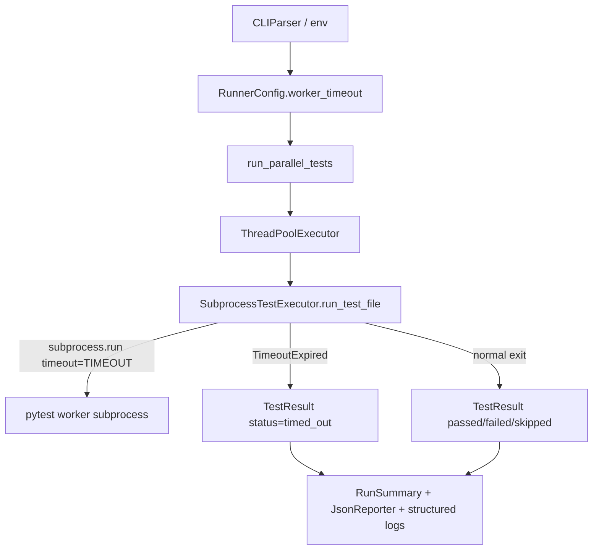

# PYPOST-1192: Orchestrator waits for workers at most TIMEOUT seconds

## Research

### Current hang surface

The parallel orchestrator (`scripts/run_parallel_tests.py`, PYPOST-1149) waits
without a wall-clock bound in two places:

1. **`SubprocessTestExecutor.run_test_file`** — `subprocess.run(...)` has no
   `timeout=` argument, so a hung pytest child blocks the pool thread forever.
2. **`run_parallel_tests` collection loop** — `future.result()` is called with
   no timeout after `as_completed` yields a completed future. That alone is
   fine once the subprocess ends; the unbounded wait is inside the executor
   thread, not in `future.result()`.

Related debt: PYPOST-1149 deferred per-file orchestrator wall-clock timeout;
PYPOST-1153 tracks it; this story delivers only that item. PYPOST-1149
architecture already named a runner `--timeout` flag that was never shipped
(`ai-tasks/PYPOST-1149/60-tech-debt.md`).

### Why `Future.result(timeout=...)` is insufficient

Industry and stdlib behavior:

- `concurrent.futures.Future.result(timeout=N)` stops only the **caller** from
  waiting. The pool thread keeps running the submitted callable
  ([pythontutorials: futures timeouts](https://www.pythontutorials.net/blog/how-to-use-concurrent-futures-with-timeouts/);
  [SO: ThreadPoolExecutor timeout](https://stackoverflow.com/questions/78460097/why-cant-threadpoolexecutor-timeout-a-long-running-expression)).
- Threads cannot be forcibly killed. `ThreadPoolExecutor` shutdown still waits
  for in-flight work, so a hung `subprocess.run` still stalls the overall run
  ([SuperFastPython: stopping ThreadPoolExecutor tasks](https://superfastpython.com/threadpoolexecutor-stop-tasks/)).

Therefore TIMEOUT must be enforced **inside** the worker callable on the OS
subprocess, not only on `future.result()`.

### Correct bound: `subprocess.run(..., timeout=TIMEOUT)`

Python’s `subprocess.run` documents that when `timeout` expires, the child is
killed and waited for, then `TimeoutExpired` is re-raised
([subprocess docs](https://docs.python.org/3/library/subprocess.html)). That
frees the pool thread so `as_completed` can continue and the run can finish.

Caveat (out of scope hardening): killing the direct child does not always kill
grandchildren (extra process groups). Typical worker shape here is one Python
pytest process; `subprocess.run` timeout is sufficient for the product
requirement. Process-group kill (`start_new_session` + `killpg`) can be tech
debt if orphans appear later.

### CLI name collision with pytest-timeout

pytest-timeout registers pytest CLI `--timeout`. The hand-rolled `CLIParser`
forwards unknown `-` flags into every worker. Claiming bare `--timeout` as an
orchestrator-only flag would steal that passthrough. Prefer a distinct
orchestrator flag (see Interfaces below).

### Operational note on default 30s

Product default TIMEOUT = 30 is mandatory. Some files may legitimately exceed
30s wall clock (module `pytest.mark.timeout` values are often 10–60s per test).
Operators of slow suites must raise TIMEOUT via the documented override; this
task does not churn per-module markers.

## Implementation Plan

1. Add `worker_timeout: float` (seconds) to `RunnerConfig`; default **30**.
2. Add `get_worker_timeout(cli_timeout: float | None)` with precedence:
   CLI → env → default 30 (mirror `get_worker_count`).
3. Extend `CLIParser` to accept `--worker-timeout` / `--worker-timeout=N`.
4. In `SubprocessTestExecutor.run_test_file`, pass `timeout=self.config.worker_timeout`
   to `subprocess.run`; on `subprocess.TimeoutExpired`, build a timed-out
   `TestResult`, emit structured log, return (do not re-raise).
5. Ensure timed-out results count as failures for `RunSummary.is_success`,
   FAILURES section, progress line, and JSON `status`.
6. Update `doc/dev/parallel_test_runner.md` (Step 8) with default, override
   names, and timeout behavior.
7. No Makefile change required for env override (`WORKER_TIMEOUT=120 make test`
   inherits into the recipe). Optional Make variable later is out of scope
   unless needed for discoverability.

**Mandatory — Failing Repro (next Step 3):**

- **Where**: `tests/test_run_parallel_tests.py` (existing orchestrator suite;
  module `pytestmark = pytest.mark.timeout(60)`).
- **What it asserts** (desired behavior; red until Step 4):
  - With a short configured TIMEOUT (e.g. `1.0`), a worker that does not finish
    in time yields `TestStatus.TIMED_OUT` (failed/timed-out, not success).
  - Structured log/event identifies timeout for that file (e.g.
    `worker_timeout file=... timeout_seconds=...`).
  - `run_parallel_tests` / `main` returns without hanging; overall run is
    unsuccessful (`is_success` false / exit code 1).
- **How to force failure without live multi-minute hang**: Prefer a controlled
  hang under a **1-second** TIMEOUT — e.g. patch `subprocess.run` to sleep then
  raise `TimeoutExpired`, or run a tiny fixture script that `time.sleep`s
  longer than TIMEOUT. Do not wait on a real 30s default in CI.
- **Sequencing**: Research (this doc) → write red test(s) in Step 3 → implement
  timeout path in Step 4 until green → docs in Step 8.

## Architecture

### Module diagram



Unchanged modules: `TestDiscovery`, `CoverageManager` (post-run combine still
runs after all futures finish, including timed-out ones).

### Module responsibilities (delta only)

| Module | Change |
| --- | --- |
| `RunnerConfig` | New field `worker_timeout: float` (default 30). |
| `get_worker_timeout()` | New helper; precedence CLI → `WORKER_TIMEOUT` → 30. |
| `CLIParser` | Parse `--worker-timeout` / `--worker-timeout=N`; do not steal pytest `--timeout`. |
| `SubprocessTestExecutor` | Bound `subprocess.run` with `timeout=config.worker_timeout`; map `TimeoutExpired` → timed-out `TestResult`. |
| `TestStatus` | Add `TIMED_OUT = "timed_out"`. |
| `run_parallel_tests` | Treat `TIMED_OUT` like failure for counts, FAILURES section, progress (`TIMED_OUT`), and structured completion/timeout logs. No change to pool topology. |
| `JsonReporter` | Emit `status: "timed_out"` for timed-out files (minimal schema extension). |
| `doc/dev/parallel_test_runner.md` | Document default, flags/env, timeout outcome (Step 8). |

### Selected patterns

- **Fail-fast bounded wait**: Hard upper bound per worker subprocess (stdlib
  `subprocess` timeout), not cooperative thread cancellation.
- **Config precedence mirror**: Same layered override style as `WORKERS` /
  `get_worker_count` for operator familiarity.
- **Explicit outcome enum**: Distinct `timed_out` status so operators can tell
  timeout apart from ordinary pytest failure without parsing free-form text.
- **Minimal surface**: No redesign of discovery, concurrency, coverage combine,
  or argparse migration (those remain PYPOST-1153 / other debt).

### Interfaces / APIs

#### Configuration

| Source | Name | Notes |
| --- | --- | --- |
| Default | `30` | Product-mandated. |
| Environment | `WORKER_TIMEOUT` | Positive number (seconds); invalid/empty → ignore and fall through. |
| CLI | `--worker-timeout N`, `--worker-timeout=N` | Highest precedence. |

Precedence: CLI → `WORKER_TIMEOUT` → `30`.

Rationale for names: parallel to `WORKERS`; avoids clashing with pytest-timeout
`--timeout` passthrough.

#### Data model delta

```python
class TestStatus(str, Enum):
    PASSED = "passed"
    FAILED = "failed"
    SKIPPED = "skipped"
    TIMED_OUT = "timed_out"  # NEW — counts as failure for is_success

@dataclass
class RunnerConfig:
    ...
    worker_timeout: float  # NEW — seconds; default 30.0
```

On timeout, `TestResult` fields:

- `status=TestStatus.TIMED_OUT`
- `exit_code`: sentinel (e.g. `-9` after kill, or `-1` if unavailable) —
  implementation picks one consistent int; document in code
- `duration_seconds`: elapsed until timeout (≥ TIMEOUT, wall measured)
- `stdout` / `stderr`: any captured output from `TimeoutExpired` plus a short
  timeout note in stderr if useful for the FAILURES section

#### Structured observability (operator-visible)

On timeout, emit a dedicated structured log line consistent with existing
`key=value` style, for example:

```text
WARNING worker_timeout file=tests/test_foo.py timeout_seconds=30.0
```

Progress line uses `TIMED_OUT` instead of `PASSED`/`FAILED`. Existing
`test_file_completed` may still fire with `status=timed_out`, or timeout may
replace it — Step 6/`50-observability.md` will finalize; architecture requires
at least one clear structured timeout signal.

#### Interaction scheme

```text
for each test file (via ThreadPoolExecutor):
    pool thread: subprocess.run(..., timeout=worker_timeout)
        ├─ completes → PASSED | FAILED | SKIPPED
        └─ TimeoutExpired → kill child → TIMED_OUT TestResult + worker_timeout log
as_completed yields results → progress + summary
any TIMED_OUT ⇒ failed_files += 1 ⇒ is_success False ⇒ process exit 1
```

## Q&A

**Why not only `future.result(timeout=30)`?**
It does not stop the hung subprocess or free the pool thread; the orchestrator
can still hang on executor shutdown. See Research.

**Why `--worker-timeout` instead of `--timeout`?**
pytest-timeout already uses `--timeout` as a pytest CLI option. Orchestrator
must not consume that flag so workers can still receive it via passthrough.

**Does TIMED_OUT fail the overall run?**
Yes. It increments failure counts and makes `is_success` false, same class of
outcome as a failed file for CI purposes, but distinguishable by status/log.

**Must the Makefile learn `WORKER_TIMEOUT`?**
Not required for correctness: the script reads the environment. Document
`WORKER_TIMEOUT=… make test` in runner docs. Optional Make wiring is follow-up
debt if desired.

**Is process-group kill in scope?**
No. Rely on `subprocess.run`’s kill-on-timeout for the direct worker process.
Escalate to process-group teardown only if tech-debt evidence appears.

**References**

- [Python subprocess — timeout / TimeoutExpired](https://docs.python.org/3/library/subprocess.html)
- [Futures timeouts do not stop tasks](https://www.pythontutorials.net/blog/how-to-use-concurrent-futures-with-timeouts/)
- [ThreadPoolExecutor cannot kill running work](https://stackoverflow.com/questions/78460097/why-cant-threadpoolexecutor-timeout-a-long-running-expression)
- `doc/dev/parallel_test_runner.md` — current operator contract
- `ai-tasks/PYPOST-1149/60-tech-debt.md` — deferred `--timeout` / wall-clock item
- [PYPOST-1153](https://pypost.atlassian.net/browse/PYPOST-1153) — maintainability epic (timeout item only)
