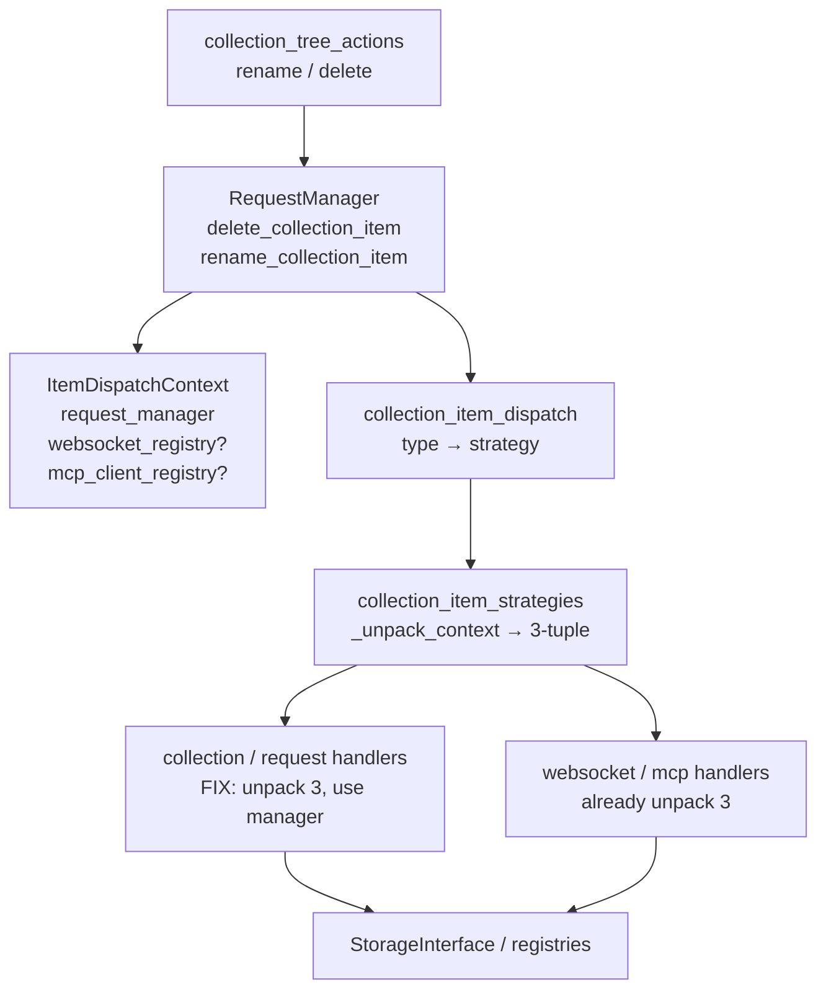

# PYPOST-1193: Fix collection item delete/rename strategy unpack failures

## Research

### R-1 Confirmed failure mode

Delete and rename of collection/request items route through:

1. `RequestManager.delete_collection_item` / `rename_collection_item`
2. `ItemDispatchContext` via `_item_dispatch_context()`
3. `collection_item_dispatch.delete_collection_item` / `rename_collection_item`
4. Built-in handlers in `collection_item_strategies.py`

`_unpack_context` returns a **3-tuple**:

`(RequestManager, WebSocketRegistry | None, McpClientRegistry | None)`

WebSocket and MCP handlers unpack three values correctly
(`_, ws_registry, _` / `_, _, mcp_registry`). Collection and request handlers
still unpack two:

```python
manager, _ = _unpack_context(ctx)  # ValueError: too many values to unpack (expected 2)
```

That arity mismatch raises before any persistence call, so type-based delete
and rename abort for `"collection"` and `"request"`.

Evidence: `pypost/core/collection_item_strategies.py` L25–57 vs L61–86;
triage notes in `ai-tasks/PYPOST-1192/60-tech-debt.md` (pre-existing at
`18a4d9d1`).

### R-2 Why the arity drifted

Item dispatch was extended for `"websocket"` and `"mcp_client"` by growing
`_unpack_context` and `ItemDispatchContext` with optional registries. Newer
handlers were written for the 3-tuple; older `"collection"` / `"request"`
handlers were left on the prior 2-tuple pattern. This is a classic Python
unpack/arity contract break: left-side targets must match iterable length
([tuple unpacking / `ValueError: too many values to unpack`](https://algomaster.io/learn/python/tuple-unpacking);
callers must match return arity or use `_` / `*_` placeholders
([FixDevs unpack guidance](https://fixdevs.com/blog/python-valueerror-too-many-values-to-unpack/))).

### R-3 Module roles (unchanged shape)

| Module | Responsibility |
| --- | --- |
| `pypost/core/request_manager.py` | Domain API for delete/rename; builds `ItemDispatchContext`; owns collection/request persistence |
| `pypost/core/collection_item_dispatch.py` | Type → strategy lookup; observability (`*_started` / `*_finished` / `*_unsupported_type`) |
| `pypost/core/collection_item_strategies.py` | Built-in strategy registry; `_unpack_context` + per-type handlers |
| `pypost/core/websocket_registry.py` / `mcp_client_registry.py` | Registry-backed delete/rename (already 3-tuple correct) |
| UI `collection_tree_actions.py` | Presenter calls manager APIs only (out of fix surface) |

### R-4 Existing contracts (restore, do not redesign)

Named regressions already encode the intended contracts:

- Strategy delegation for built-in `"request"` / `"collection"`
- Delete routes by type (including `"collection"`)
- Rename collection-type with valid name
- Empty/whitespace rename rejected via underlying `rename_request` /
  `rename_collection` empty-name checks

Repro (from requirements):

`make test PYTEST_ARGS="tests/test_collection_item_strategies.py tests/test_request_manager_delete.py"`

### R-5 Architectural pattern

Keep the existing **Strategy + Dispatch Context** pattern (PYPOST-48 /
PYPOST-1128). Prefer a **minimal arity alignment** over replacing
`_unpack_context` with attribute-only access, unless a later debt item
explicitly refactors context unpacking.

## Implementation Plan

1. **Align unpack arity** in
   `_collection_delete` / `_collection_rename` /
   `_request_delete` / `_request_rename` to the 3-tuple from
   `_unpack_context` (e.g. `manager, _, _ = _unpack_context(ctx)`), matching
   websocket/MCP handlers.
2. **Do not** change dispatch signatures, strategy registry keys, empty-name
   validation semantics, or UI callers.
3. **Do not** skip/xfail/delete the five named regression tests.
4. Optionally harden types/docs so future registry fields cannot leave callers
   on stale unpack patterns (only if needed for clarity; not a product change).

**Mandatory — Failing Repro (next Step 3):** The five named tests already
exist and fail red today on the unpack bug. Step 3 should **confirm** they
fail under the documented `make test` repro **before** the production fix
(no new test file required unless confirmation shows a coverage gap). Desired
behavior they assert:

- Built-in strategies complete delete/rename via request-manager methods
  without `ValueError`
- Delete routes `"request"` / `"collection"` correctly
- Rename `"collection"` with a valid name succeeds
- Empty/whitespace rename via `rename_collection_item` returns `False` and
  leaves the name unchanged

Sequencing: research (this step) → Step 3 red confirmation of existing tests →
Step 4 unpack fix until green. External/live deps: none (`FakeStorageManager`
in-process).

## Architecture

### System module diagram



### Dependencies

- UI → `RequestManager` only (no direct strategy unpack).
- `RequestManager` → dispatch + strategies map + storage.
- Dispatch → strategies; strategies → manager methods or registries via
  unpacked context.
- Fix surface is **strategies unpack only**; dispatch and manager APIs stay
  stable.

### Selected patterns

| Pattern | Use | Justification |
| --- | --- | --- |
| Strategy registry | Per-`item_type` delete/rename | Existing extensibility (collection, request, websocket, mcp_client) |
| Dispatch context DTO | Carry manager + optional registries | Avoids growing every handler signature |
| Thin arity fix | Match 3-tuple at call sites | Restores contracts with minimal blast radius; lsr-python: simple and explicit |

### Main interfaces (unchanged)

```text
RequestManager.delete_collection_item(item_id, item_type) -> bool
RequestManager.rename_collection_item(item_id, item_type, new_name) -> bool

ItemDispatchContext(request_manager, websocket_registry=None, mcp_client_registry=None)

delete_collection_item(context, item_id, item_type, strategies=None) -> bool
rename_collection_item(context, item_id, item_type, new_name, strategies=None) -> bool

_unpack_context(ctx) -> tuple[RequestManager, WebSocketRegistry | None, McpClientRegistry | None]
```

**Contract change:** all built-in handlers that call `_unpack_context` must
unpack **three** values. Collection/request handlers ignore registry slots.

### Out of scope (architecture)

- New item types, UI redesign, sibling suite-failure debt (FILE_CAPS,
  WebsocketDraft asserts, MCP port-busy flake, WebSocket UI hang).
- Broad refactor of `_unpack_context` to attribute-only access (optional
  follow-up debt, not required for DoD).

## Q&A

**Q: Is the bug in RequestManager or strategies?**
A: Strategies. Manager builds a valid 3-field context; collection/request
handlers unpack it as two values.

**Q: Why not change `_unpack_context` back to a 2-tuple?**
A: Websocket and MCP handlers require the third (and second) slots. Shrinking
the return would break those paths.

**Q: Will empty-name rejection still work after the fix?**
A: Yes. Once unpack succeeds, rename still reaches `rename_request` /
`rename_collection`, which reject blank/whitespace names.

**Q: New automated tests in Step 3?**
A: Prefer confirming the five existing named tests as the red suite. Add a new
test only if confirmation shows a gap not covered by those nodes.

**Q: References**
A: [Python tuple unpacking](https://algomaster.io/learn/python/tuple-unpacking);
[ValueError too many values to unpack](https://fixdevs.com/blog/python-valueerror-too-many-values-to-unpack/);
prior debt [PYPOST-1193](https://pypost.atlassian.net/browse/PYPOST-1193);
requirements `ai-tasks/PYPOST-1193/10-requirements.md`.
