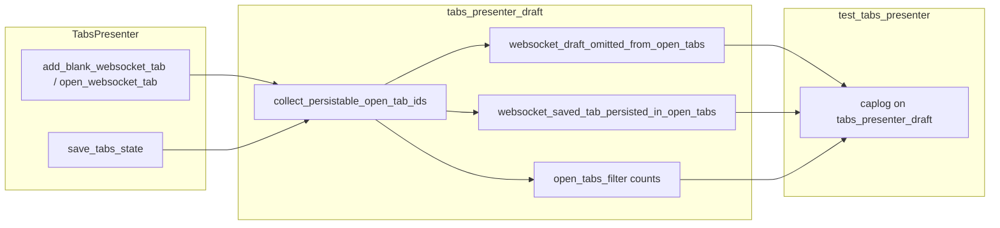

# PYPOST-1195: Fix WebsocketDraftObservability caplog assertions

## Research

### Failure mode

Targeted suite on current tree:

```text
make test PYTEST_ARGS="tests/test_tabs_presenter.py -k WebsocketDraftObservability"
```

Two cases fail with `assert any(...) is False`:

- `test_save_tabs_state_logs_omitted_websocket_draft_id`
- `test_save_tabs_state_logs_persisted_saved_websocket_id`

Per-id events already match production:

- `websocket_draft_omitted_from_open_tabs connection_id=…`
- `websocket_saved_tab_persisted_in_open_tabs connection_id=…`

Aggregate filter assertions look for the stale prefix
`websocket_open_tabs_filter …`. Production
(`pypost/ui/presenters/tabs_presenter_draft.py` →
`collect_persistable_open_tab_ids`) emits:

```text
open_tabs_filter omitted_draft_count=%d persisted_ws_count=%d
persisted_mcp_count=%d
```

`doc/dev/logging.md` still catalogs `websocket_open_tabs_filter` and omits
`persisted_mcp_count`, so the developer event table is also drifted.

### Logger binding

Tests use `caplog.at_level(..., logger="pypost.ui.presenters.tabs_presenter_draft")`,
which matches `logging.getLogger(__name__)` in the draft helper module. Logger
selection is correct; only event-name / field substring expectations are wrong.

### Sibling scope

Do not touch PYPOST-1194 (FILE_CAPS), PYPOST-1196 (port-busy), or reopen
PYPOST-1181/1193 work. Dirty-close WebsocketDraftObservability cases that
already pass stay unchanged unless this edit breaks them.

### Pattern

Prefer aligning **tests + catalog** to production emit names rather than
renaming production events: triage already called this assertion drift, and
MCP Client draft helpers share the same `open_tabs_filter` summary line.

## Implementation Plan

1. **Step 3 (Failing Repro)** — Keep the two existing red node ids as the
   automated repro. Optionally tighten a temporary assert comment/note in the
   roadmap only; do **not** change production code. Confirm they fail on the
   stale `websocket_open_tabs_filter` substring (intended defect), not fixture
   breakage.
2. **Step 4 (Development)** — Update the two tests’ filter-summary
   substrings to `open_tabs_filter` and require `persisted_mcp_count=0` (or
   presence of that field) consistent with the emit format. Leave per-id omit /
   persist asserts and URL/header negative checks intact. Re-run the targeted
   `make test` until green.
3. **Docs (Step 8 / as needed)** — Update `doc/dev/logging.md` row for the
   filter event to `open_tabs_filter` and document
   `omitted_draft_count`, `persisted_ws_count`, `persisted_mcp_count`.
4. **Cleanup / observability / debt** — No production logging change expected;
   document N/A or “docs/tests only” in Steps 5–7 as appropriate.

**Mandatory — Failing Repro (next Step 3):**

| Item | Plan |
| ---- | ---- |
| What | Existing red tests already assert desired omit/persist observability; they fail today because filter event name is stale. Step 3 confirms failure mode and records node ids — no new product behavior, no production fix. |
| Where | `tests/test_tabs_presenter.py::TestWebsocketDraftObservability::{test_save_tabs_state_logs_omitted_websocket_draft_id,test_save_tabs_state_logs_persisted_saved_websocket_id}` |
| How | `make test PYTEST_ARGS="tests/test_tabs_presenter.py -k 'test_save_tabs_state_logs_omitted_websocket_draft_id or test_save_tabs_state_logs_persisted_saved_websocket_id'"` — in-process Qt/fakes, no external services. |
| Sequencing | Confirm red (Step 3) → align assert substrings (+ logging catalog) (Step 4) → green. |

## Architecture



### Modules

| Module | Responsibility |
| ------ | -------------- |
| `tabs_presenter_draft.collect_persistable_open_tab_ids` | Source of truth for omit/persist INFO events and aggregate `open_tabs_filter` summary. **Unchanged** unless a real behavioral bug appears. |
| `TestWebsocketDraftObservability` | Caplog contract for draft-omit and saved-persist paths. **Update** filter substrings to match emit. |
| `doc/dev/logging.md` | Event catalog for operators/devs. **Update** filter event name + fields. |

### Interfaces (contract under test)

| Event | Level | Fields | Module logger |
| ----- | ----- | ------ | ------------- |
| `websocket_draft_omitted_from_open_tabs` | INFO | `connection_id` | `pypost.ui.presenters.tabs_presenter_draft` |
| `websocket_saved_tab_persisted_in_open_tabs` | INFO | `connection_id` | same |
| `open_tabs_filter` | INFO | `omitted_draft_count`, `persisted_ws_count`, `persisted_mcp_count` | same |

### Patterns

- **Test–observability contract alignment** — assertions track emitted event
  vocabulary, not historical names.
- **Minimal surface** — tests + catalog; no presenter control-flow change.
- **Privacy** — retain negative asserts against `url=` / raw `wss://` leakage.

## Q&A

| Question | Answer |
| -------- | ------ |
| Rename production back to `websocket_open_tabs_filter`? | No — MCP Client path shares `open_tabs_filter`; renaming would churn more callers and contradict triage. |
| Must Step 3 invent a new test file? | No — existing red node ids are the failing repro; Step 3 validates failure mode only. |
| Does Step 4 change `collect_persistable_open_tab_ids`? | Not planned; only if green tests reveal a real omit/persist bug. |
