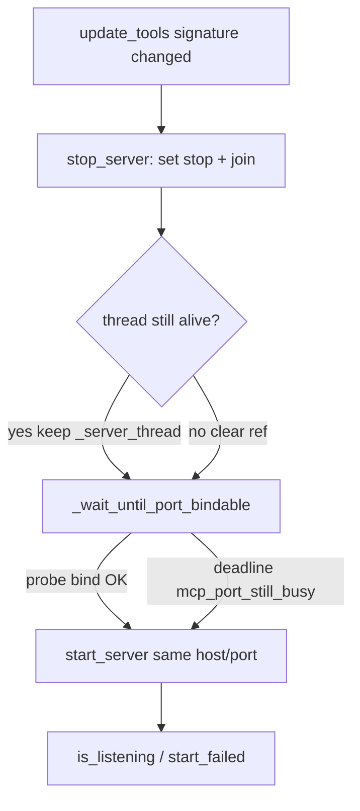

# PYPOST-1196: Stabilize flaky MCP tool-update restart (port-busy race)

## Research

### Failure mode

Filed from PYPOST-1192 parallel suite triage at base `18a4d9d1` (post
PYPOST-1178):

- Node:
  `tests/test_mcp_server_manager.py::test_update_tools_restarts_when_exposed_set_changes`
- Symptom: `UiWaitTimeoutError: MCP server did not restart after tool update
  (timeout_s=10.0)`
- Logs: `mcp_port_still_busy` then bind `EADDRINUSE` on restart
- Isolated / re-run usually green; intermittent under full `make test`

Targeted module run on current tree is green — confirms load-dependent residual
race, not permanent broken assertion.

### Root cause (residual after PYPOST-1178)

PYPOST-1178 correctly inserted `_wait_until_port_bindable()` between
`stop_server()` and `start_server()` in `update_tools`. Two gaps remain:

1. **`stop_server` clears `_server_thread` after a 2.0s join even if the thread
   is still alive.** `is_running()` then returns False while the OS listener may
   still be held by the orphaned thread. `_wait_until_port_bindable` only skips
   probing while `is_running()` is True, so it burns its budget on bind probes
   against a still-held port, logs `mcp_port_still_busy`, and proceeds to
   `start_server` → EADDRINUSE.

2. **Flaky test waits on `manager.is_running()`**, which becomes True as soon as
   the new worker thread starts — before bind/`_notify_started`. Under bind
   failure the thread dies quickly; the wait either times out (flake) or can
   miss a listening guarantee. PYPOST-1178’s companion
   `test_update_tools_restart_waits_until_port_bindable` already waits on
   `is_listening` + `start_failed` — the original node should match that
   readiness contract.

### Related work (out of scope)

| Ticket | Status | Relation |
| ------ | ------ | -------- |
| PYPOST-1178 | Done | Landed wait gate; residual flake owned here |
| PYPOST-1113 | Done | Different flake (`test_port_busy_emits_start_failed` signal order) |
| PYPOST-1194 | Open | FILE_CAPS — do not touch |

### External notes

Same-process restart after stop is a known uvicorn/CI pain point when the prior
socket release races the next bind (see PYPOST-1178 research /
[latchkey uvicorn EADDRINUSE](https://latchkey.dev/learn/python/py-uvicorn-address-already-in-use-ci)).
Keeping a live thread reference until join actually completes is the missing
control for the residual path.

## Implementation Plan

1. **Step 3 (Failing Repro)** — Add a deterministic red test that simulates
   `stop_server` join returning while the worker is still alive / port still
   held, then asserts `update_tools` reaches `is_listening` without
   `start_failed`. Force via monkeypatch of `Thread.join` to no-op (timeout
   simulation) plus a held listener or delayed shutdown so current code fails
   with `mcp_port_still_busy` / EADDRINUSE / never-listening. **No production
   fix in Step 3.**
2. **Step 4 (Development)** — Production: do not clear `_server_thread` until
   the thread is not alive after join; let `_wait_until_port_bindable` keep
   waiting while `is_running()` is True. Optionally bump the wait default
   slightly if needed under load. Tests: harden
   `test_update_tools_restarts_when_exposed_set_changes` to wait on
   `is_listening` (and no `start_failed`), matching the 1178 companion. Make
   Step 3 red green.
3. **Cleanup / observability / debt / docs** — Document join-alive behavior and
   any wait-budget tweak; no new log event names expected beyond existing
   `mcp_port_still_busy`.

**Mandatory — Failing Repro (next Step 3):**

| Item | Plan |
| ---- | ---- |
| Desired behavior | After exposed-set change, `update_tools` leaves the manager `is_listening` on the same host/port with no `start_failed`, even when `stop_server`’s join returns before the prior worker has fully exited. |
| Where | `tests/test_mcp_server_manager.py` — new node e.g. `test_update_tools_restarts_when_stop_join_times_out` (keep original flake node; harden in Step 4). |
| How to force without rare load | Monkeypatch `threading.Thread.join` to return immediately (simulate join timeout). Optionally hold the allocated port briefly or rely on real uvicorn teardown lag so current “clear thread then probe” path fails. Assert `is_listening` and empty `start_failed` list within a bounded `wait_until`. |
| Sequencing | Research → red (Step 3) → keep-alive thread ref (+ test harden) (Step 4) → green on red node + original flake node. |

## Architecture

### Modules

| Module | Responsibility |
| ------ | -------------- |
| `MCPServerManager.stop_server` | Signal stop, join with timeout; **only clear `_server_thread` when not alive** so `is_running()` remains truthful during residual teardown. |
| `MCPServerManager._wait_until_port_bindable` | Bounded probe-bind readiness (unchanged contract: warn `mcp_port_still_busy` on deadline). Benefits from truthful `is_running()`. |
| `MCPServerManager.update_tools` | stop → wait → start (call site unchanged). |
| `tests/test_mcp_server_manager.py` | Red join-timeout regression; harden original exposed-set restart assert to `is_listening`. |

### Interfaces

| Symbol | Contract |
| ------ | -------- |
| `stop_server()` | After join timeout, if thread still alive, retain `_server_thread` until dead (or until a later successful stop/wait clears it). Still emit `status_changed(False)` as today. |
| `_wait_until_port_bindable(timeout=5.0) -> None` | Unchanged return/warn contract from PYPOST-1178. |
| `is_listening` | Preferred readiness for restart tests (startup notified). |

### Patterns

- **Truthful running state** — do not claim stopped while the worker thread still holds the listener.
- **Bounded wait + visible failure** — keep deadline + `mcp_port_still_busy`; do not unbounded-block.
- **Test–lifecycle contract** — assert listening, not mere thread spawn.

## Q&A

| Question | Answer |
| -------- | ------ |
| Increase wait to 10s only? | Insufficient alone if `is_running()` is false while the orphaned thread holds the port — probe budget is wasted. Keep thread ref first; bump wait only if still needed. |
| Drop SO_REUSEADDR on probe? | Deferred by PYPOST-1178; failure logs show genuine busy (`mcp_port_still_busy`), not false-free. Out of scope unless new evidence. |
| Touch PYPOST-1194? | No. |
