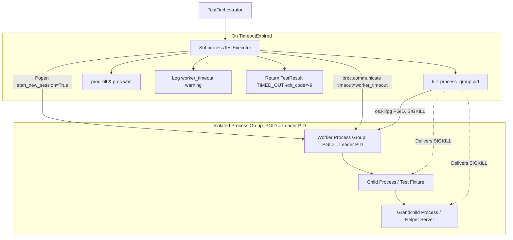

# PYPOST-1197: Harden worker timeout with process-group kill

## Research

### Background & Context

In `PYPOST-1192`, wall-clock timeout enforcement was added to the parallel test runner orchestrator (`scripts/run_parallel_tests.py`), terminating worker processes that exceed `--worker-timeout`. The current implementation in `SubprocessTestExecutor.run_test_file` executes workers using `subprocess.run(..., timeout=self.config.worker_timeout)`.

When a subprocess invocation times out on POSIX systems, standard Python stdlib (`subprocess.py:run`) catches `TimeoutExpired`, invokes `proc.kill()`, then `proc.wait()`, and re-raises `TimeoutExpired`. In POSIX systems, `proc.kill()` invokes `os.kill(self.pid, signal.SIGKILL)`.

Crucially, this signal is directed exclusively to the primary worker process (`self.pid`). If the test worker spawned any child processes (e.g., helper subprocesses, mock servers, headless display agents, or external binaries), those descendant processes remain untouched. Upon the demise of their parent worker process, POSIX kernels reparent surviving children to PID 1 (or the nearest `PR_SET_CHILD_SUBREAPER`). As detached orphan processes, they continue executing indefinitely in CI agents or local workstations, holding TCP/UDP ports, consuming CPU/memory, locking SQLite databases, and causing mysterious port collisions or flakiness in subsequent test runs.

### Process Group Isolation & POSIX Semantics

Under POSIX operating systems:
1. **Process Sessions and Process Groups**:
   Every process belongs to a process group, identified by a Process Group ID (PGID). When a process calls `os.setsid()` (or when `subprocess.Popen` is launched with `start_new_session=True`), the new child process becomes both the session leader and the process group leader of a new process group. Consequently, its PGID is equal to its PID (`pgid == proc.pid`).
2. **Inheritance**:
   Any child or grandchild process spawned by the worker automatically inherits the worker's PGID, unless that descendant explicitly calls `setsid()` or `setpgid()`.
3. **Group Signaling via `os.killpg`**:
   The POSIX system call `killpg(pgrp, sig)` (exposed in Python as `os.killpg(pgid, signal.SIGKILL)`) sends the signal to every process residing within that process group. Calling `os.killpg(proc.pid, signal.SIGKILL)` ensures that both the worker and all its spawned descendants receive `SIGKILL` simultaneously, terminating the entire tree and freeing all held resources (ports, file descriptors, memory).

### Edge Cases and Platform Safety

1. **Premature Leader Exit & Surviving Descendants**:
   If the worker process exits right before or during timeout handling, `os.getpgid(proc.pid)` might fail with `ProcessLookupError` (ESRCH) if the leader PID has already been reaped. However, because `start_new_session=True` was used at creation, the PGID was defined as `proc.pid`. The process group continues to exist in the kernel as long as at least one descendant process is still running. Therefore, our helper will attempt `os.getpgid(pid)` and fall back to `pid` if lookup fails, ensuring `os.killpg(pgid, signal.SIGKILL)` is dispatched to any lingering descendants.
2. **Idempotence & ProcessLookupError**:
   If all processes in the process group have already exited by the time `killpg` is called, `os.killpg` raises `ProcessLookupError`. The teardown helper must catch and suppress `(ProcessLookupError, PermissionError, OSError)` to prevent orchestrator crashes.
3. **Reaping / Zombie Avoidance**:
   After delivering `SIGKILL` to the process group, calling `proc.kill()` and `proc.wait()` (or `proc.communicate(timeout=2.0)`) cleanly reaps the direct child process and avoids leaving defunct/zombie entries in the process table.
4. **Platform Compatibility (POSIX vs. Windows)**:
   - On POSIX (`os.name == "posix"`), `start_new_session=True` and `os.killpg` are fully supported.
   - On Windows (`os.name == "nt"`), `os.killpg` and `os.getpgid` do not exist. On Windows, `proc.kill()` sends `TerminateProcess`. The teardown helper will detect platform capabilities via `hasattr(os, "killpg")` and gracefully fall back to `proc.kill()`, ensuring cross-platform safety.

---

## Architecture

### System Module Diagram



### Module Responsibilities

1. **`scripts.run_parallel_tests.kill_process_group(pid: int) -> None`**:
   - Standalone utility function responsible for safely terminating an entire process group given its leader PID.
   - Obtains `pgid` via `os.getpgid(pid)`, falling back to `pid` if the leader process has already exited.
   - Dispatches `signal.SIGKILL` via `os.killpg(pgid, signal.SIGKILL)` when supported.
   - Falls back to `os.kill(pid, signal.SIGKILL)` on non-POSIX systems or when `os.killpg` is unavailable.
   - Catches and suppresses `ProcessLookupError`, `PermissionError`, and `OSError`.

2. **`scripts.run_parallel_tests.SubprocessTestExecutor.run_test_file(...) -> TestResult`**:
   - Manages subprocess worker lifecycle for a single test target.
   - Sets `start_new_session=True` on POSIX when spawning `subprocess.Popen`.
   - Uses `proc.communicate(timeout=self.config.worker_timeout)` to capture stdout/stderr under wall-clock timeout bounds.
   - On `subprocess.TimeoutExpired`:
     - Invokes `kill_process_group(proc.pid)`.
     - Invokes `proc.kill()` and reaps `proc` via `proc.communicate(timeout=2.0)`.
     - Records elapsed duration, decodes any captured stdout/stderr, appends timeout notice to stderr.
     - Logs structured warning: `logger.warning("worker_timeout file=%s timeout_seconds=%s", rel_file, self.config.worker_timeout)`.
     - Returns `TestResult` with `TestStatus.TIMED_OUT` and `exit_code=-9`.

3. **`tests.test_run_parallel_tests`**:
   - Contains unit and integration tests verifying:
     - Worker processes are spawned in isolated process groups.
     - `kill_process_group` correctly invokes `os.killpg` with `signal.SIGKILL`.
     - Both worker and spawned grandchild processes are terminated when a worker times out (repro test).

---

### Main Interfaces & Contracts

#### 1. Process Group Termination Helper

```python
def kill_process_group(pid: int) -> None:
    """Terminate the process group headed by pid on POSIX platforms.

    Falls back to terminating the individual pid if killpg is unavailable or if
    the process group lookup fails. Suppresses lookup and permission errors so
    calling this function is guaranteed safe and idempotent.

    Args:
        pid: The process ID of the process group leader.
    """
    try:
        if hasattr(os, "killpg"):
            try:
                pgid = os.getpgid(pid) if hasattr(os, "getpgid") else pid
            except (ProcessLookupError, OSError):
                pgid = pid
            os.killpg(pgid, signal.SIGKILL)
        elif hasattr(os, "kill"):
            os.kill(pid, signal.SIGKILL)
    except (ProcessLookupError, PermissionError, OSError):
        pass
```

#### 2. Subprocess Execution Contract

In `SubprocessTestExecutor.run_test_file`:
```python
is_posix = os.name == "posix"
proc = subprocess.Popen(
    cmd,
    cwd=str(self.config.repo_root),
    env=env,
    stdout=subprocess.PIPE,
    stderr=subprocess.PIPE,
    text=True,
    start_new_session=is_posix,
)
try:
    stdout, stderr = proc.communicate(timeout=self.config.worker_timeout)
except subprocess.TimeoutExpired as exc:
    duration = time.perf_counter() - start_time
    kill_process_group(proc.pid)
    try:
        proc.kill()
    except (ProcessLookupError, PermissionError, OSError):
        pass
    try:
        reaped_out, reaped_err = proc.communicate(timeout=2.0)
        stdout = reaped_out or ""
        stderr = reaped_err or ""
    except (subprocess.TimeoutExpired, Exception):
        stdout = (
            exc.stdout.decode("utf-8", errors="replace")
            if isinstance(exc.stdout, bytes)
            else (exc.stdout or "")
        )
        stderr = (
            exc.stderr.decode("utf-8", errors="replace")
            if isinstance(exc.stderr, bytes)
            else (exc.stderr or "")
        )
```

---

## Implementation Plan

### Mandatory — Failing Repro (Step 3)

The failing repro automated test will live in `tests/test_run_parallel_tests.py` and implement the following:

1. **Repro Scenario (Grandchild Process Termination)**:
   - Create a test file in a temporary directory (`tmp_path / "tests" / "test_grandchild_hang.py"`).
   - In `test_grandchild_hang.py`, launch a detached background grandchild process (e.g. `python -c "import time; time.sleep(60)"`), writing the grandchild's PID to a marker file (`tmp_path / "grandchild.pid"`).
   - The test function then sleeps or hangs (`time.sleep(60)`), ensuring the worker will exceed its timeout.
   - Run `SubprocessTestExecutor.run_test_file` (or `run_parallel_tests`) with `worker_timeout=1.0`.
   - After the executor returns `TestStatus.TIMED_OUT`:
     - Read `grandchild.pid`.
     - Check if `grandchild.pid` is still alive using `os.kill(grandchild_pid, 0)`.
     - **Desired assertion**: `grandchild.pid` has been terminated (i.e. `os.kill(grandchild_pid, 0)` raises `ProcessLookupError`).
     - **Before the fix**: Because `subprocess.run` only kills the direct worker PID, the grandchild process remains alive in the operating system. The test will fail (red).
     - **After the fix**: With `start_new_session=True` and `kill_process_group`, `os.killpg` terminates the entire process group, so the grandchild is dead. The test passes (green).

2. **Unit Repro (Process Group Signaling Mock Test)**:
   - Test that `SubprocessTestExecutor` launches workers with `start_new_session=True` on POSIX.
   - Test that when `TimeoutExpired` occurs, `kill_process_group` is invoked with `proc.pid`.

### Step 4 (Development)

1. Add `kill_process_group(pid: int) -> None` in `scripts/run_parallel_tests.py`.
2. Refactor `SubprocessTestExecutor.run_test_file` to use `subprocess.Popen(..., start_new_session=True)` and call `kill_process_group(proc.pid)` on timeout.
3. Ensure existing tests in `tests/test_run_parallel_tests.py` (e.g., `test_hung_worker_under_timeout_yields_timed_out`) pass or are adapted to verify both `Popen` and timeout teardown.

### Step 5 (Code Cleanup)

- Verify flake8, mypy, and type annotations for all new/modified functions.
- Ensure strict adherence to PEP 8, docstrings, and error handling standards.

### Step 6 (Observability)

- Verify structured warning log `worker_timeout file=%s timeout_seconds=%s` is emitted with the exact expected fields.
- Verify `TestResult.status == TestStatus.TIMED_OUT` and `TestResult.exit_code == -9`.

### Step 7 (Technical Debt Analysis)

- Document edge cases (e.g., processes that explicitly invoke `setsid()` to detach into a new session cannot be reached by parent PGID signals without OS-level cgroups/containers).
- Record in `60-tech-debt.md`.

### Step 8 (Dev Docs)

- Update `doc/dev/parallel_test_runner.md` to document session isolation and process-group SIGKILL behavior on timeout.

---

## Q&A

**Q: Why use `start_new_session=True` instead of `preexec_fn=os.setsid`?**
**A**: `preexec_fn` is not thread-safe and can cause deadlocks in multi-threaded Python runtimes when calling `fork()`. Python 3.2+ introduced `start_new_session=True` in `subprocess.Popen` specifically as the safe, standardized, and optimized replacement for `preexec_fn=os.setsid`.

**Q: Can `os.killpg` accidentally terminate other parallel test workers?**
**A**: No. Because each worker is launched with `start_new_session=True`, each worker process creates a distinct, isolated process group where `PGID == worker.pid`. Sibling workers and the test orchestrator have separate process groups. Calling `os.killpg(worker.pid, signal.SIGKILL)` targets only that worker and its descendants.

**Q: What happens if a grandchild process exits before the timeout?**
**A**: `kill_process_group` catches `ProcessLookupError`, `PermissionError`, and `OSError`. Missing or already-exited processes in the group are ignored without error.

**Q: How does this affect Windows platforms?**
**A**: Windows does not have POSIX process groups or `os.killpg`. The implementation detects capability via `hasattr(os, "killpg")` and falls back to `proc.kill()`, preserving normal functionality without crashes.
