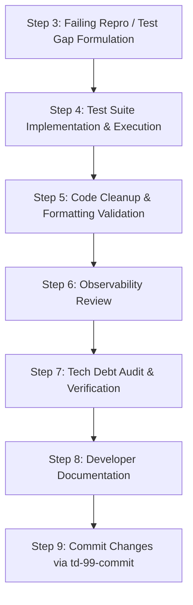
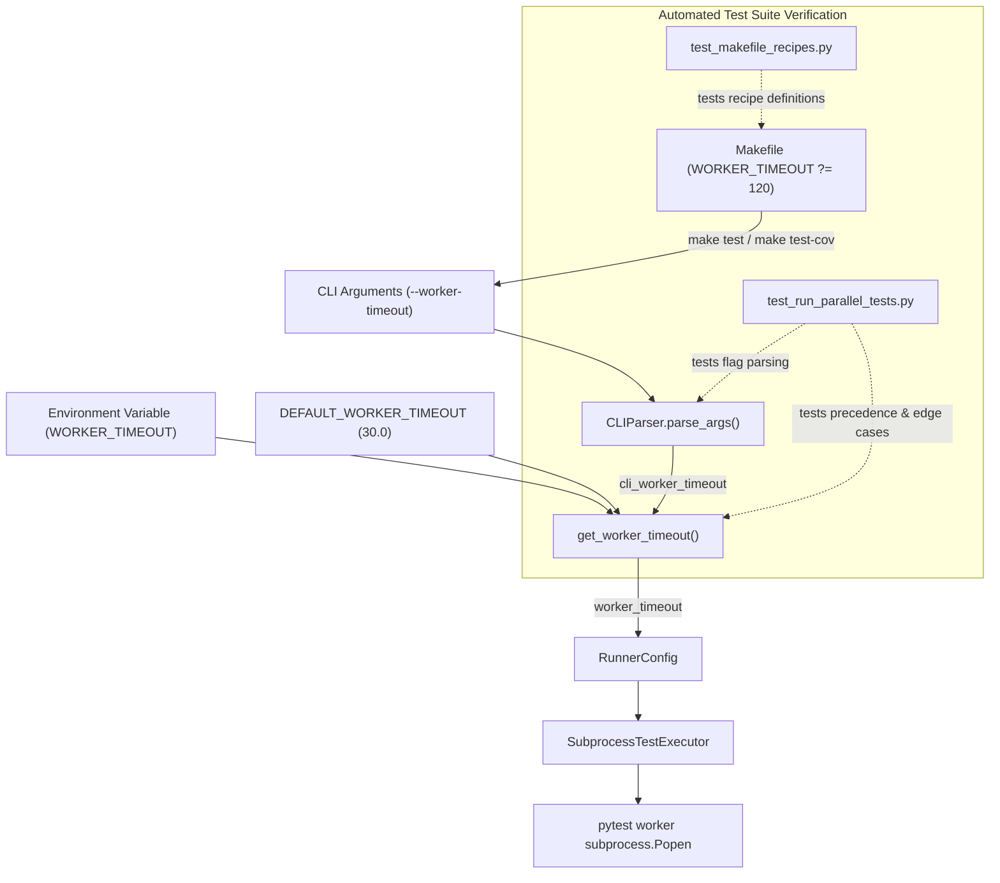

# PYPOST-1199: Unit tests for get_worker_timeout precedence

## Research

### Codebase Analysis

Investigation of the test orchestrator in [scripts/run_parallel_tests.py](file:///home/src/scripts/run_parallel_tests.py) and the build automation in [Makefile](file:///home/src/Makefile) reveals the current architecture and existing implementation details:

1. **Timeout Resolution Logic (`get_worker_timeout`)**:
   - Located at [scripts/run_parallel_tests.py:125-148](file:///home/src/scripts/run_parallel_tests.py#L125-L148).
   - Baseline constant: `DEFAULT_WORKER_TIMEOUT = 30.0`.
   - Resolution algorithm:
     - If `cli_timeout is not None and cli_timeout > 0`: return `cli_timeout`.
     - Else inspect `os.environ.get("WORKER_TIMEOUT")`. If present:
       - Strip whitespace and parse as `float(timeout_env.strip())`.
       - If `val > 0`: return `val`.
       - Catch `ValueError` and fall through.
     - Fall through to return `DEFAULT_WORKER_TIMEOUT` (`30.0`).

2. **CLI Parser (`CLIParser.parse_args`)**:
   - Located at [scripts/run_parallel_tests.py:151-253](file:///home/src/scripts/run_parallel_tests.py#L151-L253).
   - Supports two invocation styles:
     - Space-separated: `elif arg == "--worker-timeout": if i + 1 < len(args): cli_worker_timeout = float(args[i + 1]); i += 2`.
     - Equals-separated: `elif arg.startswith("--worker-timeout="): cli_worker_timeout = float(arg.split("=", 1)[1]); i += 1`.
   - Passes the parsed `cli_worker_timeout` into `get_worker_timeout(cli_worker_timeout)` to construct `RunnerConfig(..., worker_timeout=worker_timeout)`.

3. **Makefile Contract**:
   - Located at [Makefile:21-22](file:///home/src/Makefile#L21-L22) and [Makefile:159-195](file:///home/src/Makefile#L159-L195).
   - Sets variable default: `WORKER_TIMEOUT ?= 120`.
   - `test` recipe passes `--worker-timeout $(WORKER_TIMEOUT)`.
   - `test-cov` recipe passes `--worker-timeout $(WORKER_TIMEOUT)`.

4. **Existing Test Coverage Gaps**:
   - [tests/test_run_parallel_tests.py](file:///home/src/tests/test_run_parallel_tests.py) has robust test cases for worker count resolution (`test_default_worker_count_io_tuned_policy`, `test_default_worker_count_policy_table`, `test_worker_count_precedence` in lines 124–160), and worker timeout termination behavior (`test_hung_worker_under_timeout_yields_timed_out` in lines 589–655).
   - However, there are **no unit tests** verifying `get_worker_timeout` resolution precedence, fallback to default, or resilience against invalid inputs (e.g. negative numbers, zero, non-numeric strings, empty strings, whitespace).
   - Furthermore, [tests/test_makefile_recipes.py](file:///home/src/tests/test_makefile_recipes.py) has recipe contract tests for workers (`test_makefile_parallel_runner_passes_workers`), but no contract tests verifying `WORKER_TIMEOUT ?= 120` or `--worker-timeout $(WORKER_TIMEOUT)` in `test` and `test-cov`.

## Implementation Plan

### High-Level Execution Sequence (Steps 3–8)



- **Step 3 (Failing Repro / Test Debt Verification)**:
  - Formulate the red test specification for `get_worker_timeout` resolution precedence, edge-case fallthrough, CLI parsing, and Makefile recipe forwarding.
  - Per requirements (Branch B: No behavioral change / test coverage gap), the production implementation is already present. In Step 3, we define the missing test assertions that lock down the contract and verify that they specifically guard against regressions.
- **Step 4 (Development & Test Verification)**:
  - Add comprehensive parameterized unit tests to `tests/test_run_parallel_tests.py`:
    - `test_worker_timeout_precedence` (CLI > Env > Default).
    - `test_worker_timeout_invalid_cli_fallthrough` (0.0, -10.0, None fall back to Env or Default).
    - `test_worker_timeout_invalid_env_fallthrough` ("", "   ", "abc", "0", "-5" fall back to Default).
    - `test_cli_parser_worker_timeout_flags` (verify `--worker-timeout <val>` and `--worker-timeout=<val>` update `RunnerConfig.worker_timeout`).
  - Add Makefile contract tests to `tests/test_makefile_recipes.py`:
    - `test_makefile_defines_worker_timeout_default`: assert `WORKER_TIMEOUT ?= 120`.
    - `test_makefile_parallel_runner_passes_worker_timeout`: assert `--worker-timeout $(WORKER_TIMEOUT)` in `test` and `test-cov` recipes.
  - Run `make check` (`make lint`, `make test`, `make verify-ai-tasks`).
- **Step 5 (Code Cleanup)**:
  - Verify static analysis with `make lint` (flake8 compliance, no unused imports, strict type annotations).
  - Document cleanup in `ai-tasks/PYPOST-1199/40-code-cleanup.md`.
- **Step 6 (Observability)**:
  - Document in `ai-tasks/PYPOST-1199/50-observability.md` how timeout configuration is surfaced in startup logs (`INFO parallel_test_run_started ... worker_timeout=...`) and structured warning events on worker timeout (`WARNING worker_timeout file=... timeout_seconds=...`).
- **Step 7 (Technical Debt Analysis)**:
  - Document in `ai-tasks/PYPOST-1199/60-tech-debt.md` the closure of PYPOST-1192 technical debt item #4 ("Unit tests for get_worker_timeout CLI → env → 30 fallthrough and invalid values; optional makefile --worker-timeout contract").
- **Step 8 (Developer Documentation)**:
  - Update or append developer guide documentation in `doc/dev/` describing worker timeout configuration hierarchy and verification contracts.

### Mandatory — Failing Repro (next Step 3)

**Strategy: Branch B (No Behavioral Change / Test Coverage Gap)**.
- **Context**: The runtime production logic in `get_worker_timeout` and the Makefile wiring already exist from PYPOST-1192, but exist without test safety nets.
- **Assertion Design**:
  - Assert that `get_worker_timeout(cli_timeout=45.0)` returns `45.0` even when `WORKER_TIMEOUT="60.0"`.
  - Assert that `get_worker_timeout(cli_timeout=None)` returns `60.0` when `WORKER_TIMEOUT="60.0"`.
  - Assert that `get_worker_timeout(cli_timeout=None)` returns `30.0` when `WORKER_TIMEOUT` is unset.
  - Assert that non-positive CLI values (e.g., `0.0`, `-15.0`) fall through to environment or default `30.0`.
  - Assert that malformed environment values (e.g., `""`, `"   "`, `"invalid"`, `"0"`, `"-5.0"`) fall through to default `30.0`.
  - Assert that `CLIParser().parse_args(["--worker-timeout", "42"])` and `["--worker-timeout=42"]` produce `RunnerConfig.worker_timeout == 42.0`.
  - Assert that `Makefile` defines `WORKER_TIMEOUT ?= 120` and passes `--worker-timeout $(WORKER_TIMEOUT)` in both `test` and `test-cov`.
- **Isolation**: All environment variable testing will utilize pytest's `monkeypatch` fixture to guarantee zero state leakage across test boundaries.

## Architecture

### System Component Diagram



### Module Responsibilities

1. **`get_worker_timeout` ([scripts/run_parallel_tests.py](file:///home/src/scripts/run_parallel_tests.py))**:
   - **Responsibility**: Pure functional resolver for timeout determination.
   - **Contract**: Evaluates `cli_timeout`, `os.environ["WORKER_TIMEOUT"]`, and `DEFAULT_WORKER_TIMEOUT` in strict order of priority. Enforces positive float validation, discarding non-positive or unparseable inputs.

2. **`CLIParser` ([scripts/run_parallel_tests.py](file:///home/src/scripts/run_parallel_tests.py))**:
   - **Responsibility**: Tokenizes CLI arguments, extracting orchestrator-specific flags while preserving pytest passthrough arguments.
   - **Contract**: Accepts `--worker-timeout <float>` and `--worker-timeout=<float>`.

3. **`Makefile` ([Makefile](file:///home/src/Makefile))**:
   - **Responsibility**: Build automation entry points for local developers and CI.
   - **Contract**: Defines suite-level override `WORKER_TIMEOUT ?= 120` to accommodate slow integration/smoke test suites while defaulting standalone CLI runs to 30.0s. Forwards `--worker-timeout $(WORKER_TIMEOUT)` in `test` and `test-cov` targets.

4. **`tests/test_run_parallel_tests.py` ([tests/test_run_parallel_tests.py](file:///home/src/tests/test_run_parallel_tests.py))**:
   - **Responsibility**: Unit and integration test coverage for runner orchestration.
   - **Contract**: Parameterized test matrices validating resolver precedence, negative/zero fallthrough, unparseable environment values, and CLI parsing variations.

5. **`tests/test_makefile_recipes.py` ([tests/test_makefile_recipes.py](file:///home/src/tests/test_makefile_recipes.py))**:
   - **Responsibility**: Contract verification for Makefile targets, flags, and recipes.
   - **Contract**: Validates variable presence and flag passing for `test` and `test-cov`.

### Architectural Patterns

1. **Tiered Fallback Chain (Precedence Resolution)**:
   - Configuration cascades cleanly: `Explicit CLI Argument` → `Environment Variable` → `Built-in Default`.
   - Each tier is evaluated strictly; if a tier is absent or invalid (<= 0 or unparseable), execution proceeds seamlessly to the next tier.

2. **Defensive Value Parsing & Fail-Safe Defaults**:
   - No unexpected environment variable string or CLI value can crash the runner or disable timeouts (which could lead to indefinite hangs).
   - If an operator accidentally provides `WORKER_TIMEOUT=""` or `WORKER_TIMEOUT="bad"`, the system falls back to `DEFAULT_WORKER_TIMEOUT = 30.0` safely.

3. **Table-Driven Parameterized Testing**:
   - Comprehensive test matrices test multiple combinations of inputs concisely via `@pytest.mark.parametrize`.
   - Enables exhaustive boundary testing without test bloat.

4. **Static AST / Recipe Contract Testing**:
   - Tests inspect Makefile recipes without executing expensive subprocess build commands, ensuring instant feedback and preventing regression of build contracts.

### Test Architecture: Parameterization Matrix

#### Matrix 1: Configuration Precedence (`test_worker_timeout_precedence`)

| Scenario | CLI Argument (`cli_timeout`) | Env Var (`WORKER_TIMEOUT`) | Expected Result | Rationale |
| :--- | :--- | :--- | :--- | :--- |
| CLI overrides Env & Default | `45.0` | `"60.0"` | `45.0` | CLI has highest priority |
| CLI overrides Default | `15.0` | `None` (unset) | `15.0` | CLI overrides baseline |
| Env overrides Default | `None` | `"60.0"` | `60.0` | Env takes priority when CLI unset |
| Default Fallback | `None` | `None` (unset) | `30.0` | Baseline default applies |

#### Matrix 2: Invalid CLI Values Fallthrough (`test_worker_timeout_invalid_cli_fallthrough`)

| CLI Argument (`cli_timeout`) | Env Var (`WORKER_TIMEOUT`) | Expected Result | Rationale |
| :--- | :--- | :--- | :--- |
| `0.0` | `"50.0"` | `50.0` | Zero CLI value falls through to Env |
| `-10.0` | `"50.0"` | `50.0` | Negative CLI value falls through to Env |
| `0.0` | `None` | `30.0` | Zero CLI value falls through to Default |
| `-1.0` | `None` | `30.0` | Negative CLI value falls through to Default |

#### Matrix 3: Invalid Env Values Fallthrough (`test_worker_timeout_invalid_env_fallthrough`)

| CLI Argument (`cli_timeout`) | Env Var (`WORKER_TIMEOUT`) | Expected Result | Rationale |
| :--- | :--- | :--- | :--- |
| `None` | `""` (empty string) | `30.0` | Empty string falls through to Default |
| `None` | `"   "` (whitespace) | `30.0` | Whitespace string falls through to Default |
| `None` | `"0"` | `30.0` | Zero falls through to Default |
| `None` | `"-10.0"` | `30.0` | Negative float falls through to Default |
| `None` | `"invalid"` | `30.0` | Non-numeric string falls through to Default |
| `None` | `"abc"` | `30.0` | Arbitrary string falls through to Default |

#### Matrix 4: CLI Parser Flag Handling (`test_cli_parser_worker_timeout_flags`)

| Input Arguments | Expected `config.worker_timeout` |
| :--- | :--- |
| `["--worker-timeout", "42"]` | `42.0` |
| `["--worker-timeout=42"]` | `42.0` |
| `["--worker-timeout", "12.5", "-v"]` | `12.5` |
| `["--worker-timeout=99.5", "tests/test_alpha.py"]` | `99.5` |

#### Matrix 5: Makefile Recipe Contracts (`test_makefile_recipes.py`)

| Target / Variable | Expected Pattern | Assertion Purpose |
| :--- | :--- | :--- |
| `WORKER_TIMEOUT ?=` | `WORKER_TIMEOUT ?= 120` | Ensure Makefile default is 120s |
| `test` recipe | `--worker-timeout $(WORKER_TIMEOUT)` | Ensure `test` forwards timeout |
| `test-cov` recipe | `--worker-timeout $(WORKER_TIMEOUT)` | Ensure `test-cov` forwards timeout |

### Main Interfaces & Contracts

```python
# scripts/run_parallel_tests.py

DEFAULT_WORKER_TIMEOUT: float = 30.0

def get_worker_timeout(cli_timeout: float | None = None) -> float:
    """Determine effective per-worker timeout following precedence rules.

    Precedence:
    1. Explicit CLI argument (--worker-timeout)
    2. WORKER_TIMEOUT environment variable
    3. DEFAULT_WORKER_TIMEOUT (30 seconds)

    Args:
        cli_timeout: Optional float timeout passed via CLI flag. Must be > 0 to take effect.

    Returns:
        Effective timeout in seconds as a float.
    """

class CLIParser:
    def parse_args(
        self,
        args: Sequence[str] | None = None,
        repo_root: Path | None = None,
    ) -> RunnerConfig:
        """Parse CLI arguments into RunnerConfig, separating orchestrator options and pytest passthrough."""
```

## Q&A

**Q: Where should the new tests be added?**
**A**:
- The timeout resolver and CLI parser unit tests belong in [tests/test_run_parallel_tests.py](file:///home/src/tests/test_run_parallel_tests.py), right alongside the existing `get_worker_count` precedence tests.
- The Makefile contract assertions belong in [tests/test_makefile_recipes.py](file:///home/src/tests/test_makefile_recipes.py) inside `TestFastTestTargetRecipe`.

**Q: How does this test suite remain fast and isolated?**
**A**:
- `get_worker_timeout` is a pure function. Tests execute in microseconds without spawning any subprocesses.
- Environment manipulation uses pytest's `monkeypatch` fixture, ensuring that `WORKER_TIMEOUT` mutations are completely rolled back after each test.
- Makefile tests use existing static text inspection helpers (`makefile_target_recipe_body`) which parse the Makefile in memory in milliseconds without running sub-makes.

**Q: Does any production code in `scripts/run_parallel_tests.py` need modification?**
**A**:
- Only if the edge-case tests uncover a latent bug. Inspection shows that `get_worker_timeout` already implements positive checks (`> 0`) and exception handling (`try: float(...) except ValueError: pass`). The tests will rigorously verify this existing behavior.
