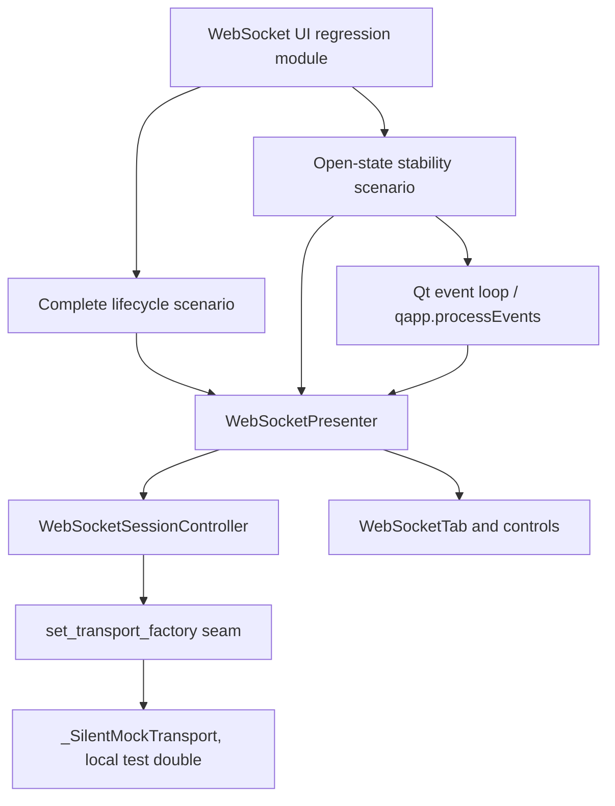

# PYPOST-1200: Clarify redundant WebSocket UI lifecycle regression coverage

## Research

### Inputs

- Jira [PYPOST-1200](https://pypost.atlassian.net/browse/PYPOST-1200): rename
  the misleading green check or merge it into the complete lifecycle check.
- [10-requirements.md](10-requirements.md): preserve active, deterministic
  Connect → Open → Disconnect → Idle coverage without production changes.
- [tests/test_websocket_client_ui_repro.py](../../tests/test_websocket_client_ui_repro.py):
  the relevant tests and their hermetic transport seam.
- [pytest test-discovery guidance][pytest-docs]:
  module-level functions remain discoverable when their names begin with
  `test_`.

### Repository evidence

The module currently contains two green lifecycle scenarios:

1. `test_presenter_connect_and_disconnect_lifecycle` is the broad user-flow
   contract. It checks the initial idle controls, connecting state, read-only
   editor, opened state, enabled send control, disconnect, and return to idle.
2. `test_presenter_lifecycle_open_overwritten_by_deferred_transport_failure`
   repeats the connection setup but uses a factory-backed `_SilentMockTransport`,
   records the opened handshake target, and repeatedly pumps the Qt event loop
   for a bounded interval while asserting that Open and its controls remain
   stable.

The second scenario does not create or deliver a deferred transport failure.
Its current implementation therefore proves opened-state stability during
event processing, not recovery from a deferred failure. The setup is similar,
but the second scenario has a distinct race-regression observation that is
not represented by the broad lifecycle assertions alone.

## Implementation Plan

Make the smallest test-structure change in
`tests/test_websocket_client_ui_repro.py`:

1. Keep `test_presenter_connect_and_disconnect_lifecycle` as the canonical
   end-to-end UI lifecycle check.
2. Rename the narrower function to
   `test_presenter_open_state_survives_bounded_event_processing`.
3. Replace its misleading docstring and comments with language describing
   the silent transport, opened-state stability, and bounded event pump.
4. Preserve its existing setup, assertions, cleanup, and active pytest
   collection. Do not introduce a shared fixture or move the transport mock.

The preferred design is rename-and-clarify rather than merge. Merging would
remove the explicit repeated-event stability loop, the transport-factory
instance observation, or both. Retaining that scenario gives the suite a
focused race guard while the broad test remains responsible for the complete
user-visible progression. The small duplicated setup is intentional scenario
isolation and does not justify new shared test infrastructure.

**Mandatory — Failing Repro (next Step 3):** `N/A — no behavioral change`.
This task changes only a test name and explanatory text. The existing green
tests already exercise the required behavior, and creating a red runtime
reproduction would misrepresent a documentation/coverage-clarity change.
Step 3 should record this N/A decision and must not edit production code or
add a redundant failing test.

## Architecture

### Component diagram



### Module and ownership boundaries

| Component | Responsibility | Ownership boundary |
| --- | --- | --- |
| Regression module | Defines lifecycle scenarios and assertions. | Test-only; no production edits. |
| Broad lifecycle test | Verifies Connect → Open → Disconnect → Idle. | Owns the full lifecycle contract. |
| Open-state stability test | Verifies Open during bounded event processing. | Owns the event-processing race guard. |
| `_SilentMockTransport` | Provides deterministic, callback-silent transport. | Private to the regression module. |
| `WebSocketPresenter` | Maps controller state to tab controls. | System under test; unchanged. |
| `WebSocketSessionController` | Owns state and factory injection. | System under test; unchanged. |
| `WebSocketTab` | Exposes the editor and action controls. | System under test; unchanged. |
| Qt event loop | Delivers queued UI work. | Test runtime; observation is bounded. |

### Interaction scheme

#### Broad lifecycle scenario

```text
test setup
  -> inject _SilentMockTransport through set_transport_factory
  -> presenter.handle_connect()
  -> assert CONNECTING, Cancel, and read-only editor
  -> controller.on_opened("")
  -> assert OPEN, Disconnect, and enabled send control
  -> presenter.handle_disconnect()
  -> assert IDLE, Connect, disabled send control, and editable editor
```

#### Open-state stability scenario

```text
test setup
  -> create transport through the factory and observe opened_target
  -> presenter.handle_connect()
  -> assert CONNECTING, Cancel, read-only editor, and opened target
  -> controller.on_opened("")
  -> assert OPEN, Disconnect, and enabled send control
  -> process Qt events until a monotonic deadline
  -> assert OPEN, Disconnect, and enabled send control on every iteration
```

The scenarios share the same production seams but have separate assertions.
No new runtime interface, fixture, dependency, or state transition is
introduced. The renamed test remains a module-level `test_` function so its
pytest discoverability is unchanged.

### Selected patterns and justification

- **Scenario-oriented contract tests:** each test has one readable purpose and
  asserts the public UI effects rather than private implementation details.
- **Test-only dependency injection:** `set_transport_factory` supplies the
  silent transport without live DNS, handshake, or network dependencies.
- **Bounded asynchronous observation:** the stability test uses its existing
  monotonic deadline and event-loop pump; it must not become an unbounded wait.
- **Local test-double ownership:** `_SilentMockTransport` remains in the
  module because this task has one qualifying consumer and its behavior is
  tailored to this UI scenario.

### Compatibility and discoverability

- No production WebSocket code, UI state transition, public API, or transport
  protocol changes.
- The test count and active enforcement remain unchanged; no test is skipped,
  disabled, or weakened.
- The broad test name remains stable for maintainers looking for the complete
  lifecycle contract.
- The renamed test advertises the actual Open-state/event-processing behavior,
  and its `test_` prefix preserves normal collection and focused invocation.
- Existing assertion messages and cleanup remain intact unless a later
  implementation step identifies a strictly necessary wording correction.

### Requirements-to-acceptance traceability

| Requirement outcome | Architectural decision and acceptance evidence |
| --- | --- |
| Unambiguous purpose | Broad test: full lifecycle; renamed test: Open stability. |
| Accurate descriptions | Name the bounded event-processing observation. |
| Connect/Open/Disconnect/Idle signal | Preserve all broad state and control assertions. |
| Open stability signal | Preserve target, state, control, and pump assertions. |
| Deterministic CI | Keep the local silent transport; use no network. |
| Boundedness | Keep the monotonic deadline and bounded event processing. |
| Scope discipline | Change only the test identity and explanatory text. |

## Validation Plan

Step 4 should validate the renamed test and the complete lifecycle test through
the repository Make workflow. For this architecture step, the permitted
validation is limited to:

- `make lint`
- `make verify-ai-tasks`

No test or production source is changed in Step 2.

## Q&A

**Why rename instead of merge?**

The tests have overlapping setup but different signals. The broad scenario
proves the complete user journey; the narrower scenario repeatedly proves
that an already-open UI remains open while events are processed. Renaming
preserves both signals with the least change.

**Why not extract `_SilentMockTransport`?**

The helper is local to this regression module and there is no qualifying
second consumer in the task scope. A shared fixture would enlarge the change
without improving discoverability.

**What is intentionally unchanged?**

Production WebSocket behavior, transport semantics, UI controls, event-loop
handling, assertions, cleanup, test count, and enforcement remain unchanged.

**What is the Step 2 gate?**

This artifact is complete when the two scenario boundaries, preserved
assertions, interfaces, compatibility constraints, validation, and
requirements traceability are reviewable. The architecture artifact was
accepted; PYPOST-1200 is at commit/final-gate review.

[pytest-docs]: https://docs.pytest.org/en/stable/explanation/goodpractices.html
