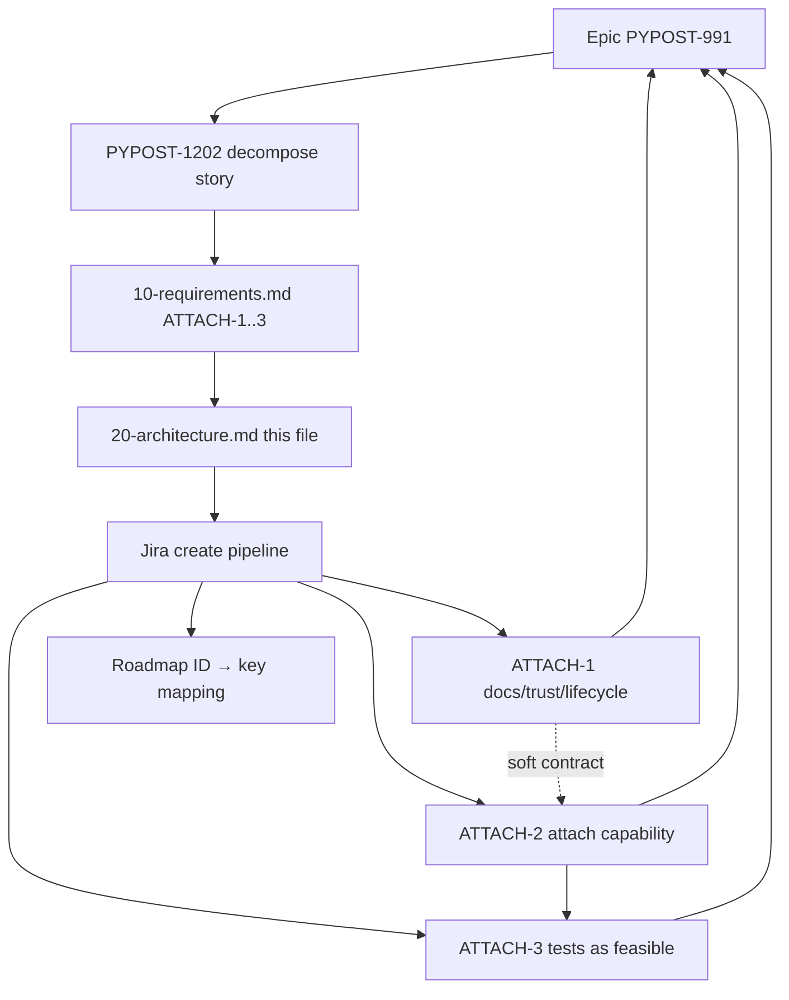

# PYPOST-1202: Decompose epic — attach sidecar architecture (workflow)

Step 2 artifact for PYPOST-1202. Turns approved requirements in
[`10-requirements.md`](10-requirements.md) into a **decomposition workflow**
architecture: how child issues map under epic
[PYPOST-991](https://pypost.atlassian.net/browse/PYPOST-991), sizing,
dependencies, create-time interfaces, and artifact ownership.

**Scope note:** This task ships planning Markdown and (in later steps) Jira
children only. It does **not** design attach IPC, transport, or desktop
session binding — those belong to child Top-Down cycles under PYPOST-991.

## Research

### R-1 Epic and decompose story (Jira facts)

- **[PYPOST-991](https://pypost.atlassian.net/browse/PYPOST-991)** — Epic;
  parent for attach work; labels `agent`, `mcp`, `tech-debt`; SP cleared on
  promote.
- **[PYPOST-1202](https://pypost.atlassian.net/browse/PYPOST-1202)** — Story;
  this decompose / planning ticket; label `decompose`; SP 3.

- Epic acceptance (covered by the **set** of children): documented attach path;
  trust/lifecycle defined; tests as feasible.
- Under parent (after Step 4 create): PYPOST-1202 plus implementation
  children PYPOST-1206 / PYPOST-1207 / PYPOST-1208 (ATTACH-1..3).
- Project is next-gen (`simplified: true`) — link children with `parent`
  (via `jira_link_issue_parent` / create-time `parent`), not classic Epic Link.
- Sprint goal ("Decompose Oversized Epics") covers PYPOST-1202–1205 for four
  SP>6 epics; this architecture applies only to PYPOST-991.

### R-2 Industry epic-split practices

Sources:

- [Atlassian Fibonacci story points](https://www.atlassian.com/agile/project-management/fibonacci-story-points)
- [Epic breakdown guidance](https://agiletoolhub.com/guides/epic-breakdown-best-practices)
- [Sprint-ready story splits](https://kollabe.com/posts/break-down-epics-into-sprint-ready-stories)

| Practice | Application to ATTACH-1..3 |
| --- | --- |
| Vertical / outcome slices | Docs/contract → capability → verification |
| Prefer ≤5 SP (avoid recreating 8) | Preferred 2 / 5 / 3 |
| Clear AC; one primary outcome | Matches FR1–FR4 |
| Soft dependency chain | ATTACH-1 soft-prereq; refine after ATTACH-2 |
| Estimate children, not the epic | Epic unpointed; children get SP on create |

### R-3 Repo create / estimate interfaces

| Interface | Responsibility |
| --- | --- |
| `jira-create-issue` skill | Estimate via read-only Fibonacci subagent, then create |
| `_shared/story-points.md` | Scale 1/2/3/5/8/13; Top-Down effort estimate |
| `jira_create_issue` MCP | Persist Story under PYPOST with SP field |
| `jira_link_issue_parent` MCP | Ensure `parent = PYPOST-991` if not set at create |
| Roadmap Task Metadata / Step notes | Record ATTACH-N → PYPOST-N mapping (NFR-3) |

Preferred SP in requirements are **planning guidance**. Create step must still
run the estimation subagent; if estimate returns 8+, split further before
create — do not recreate an oversized child.

### R-4 Sibling exclusions (keep out of PYPOST-991)

| Ticket | Why not a child of this epic |
| --- | --- |
| PYPOST-990 | HTTP transport for agent-UI MCP |
| PYPOST-992 | Spawn-session `call_tool` tests |
| PYPOST-993 | Seed/collection injection for owned session |

### R-5 Product surfaces children will later touch (context only)

Not designed here; listed so create descriptions stay outcome-focused and
point implementers at existing docs:

- `doc/dev/agent_ui_actions_mcp.md` — attach currently unsupported
- `doc/dev/agent_lifecycle.md` — `AgentAppSession` launch/ready/shutdown
- `doc/dev/mcp_trust_model.md` — product inbound MCP trust
- `doc/dev/ui_actions.md` — UI-action packaging (UI tools off product MCP)
- Sidecar entry / tests: `pypost-agent-ui-mcp`,
  `tests/test_agent_ui_actions_mcp.py`

## Implementation Plan

### High-level approach (this task)

1. **Freeze slice model** — three provisional children ATTACH-1..3 from Step 1
   (no merge of ATTACH-2+ATTACH-3; no micro-split unless create-time estimate
   forces it).
2. **Architecture (this step)** — document workflow modules, dependency graph,
   Jira field contract, and per-child artifact ownership.
3. **Step 4 (done)** — created three Stories under PYPOST-991 with AC from
   requirements; mapped provisional IDs → keys in this task's roadmap;
   left product code unchanged.
4. **After PYPOST-1202 closes** — each child runs its own Top-Down Steps 1–8
   (Python implementation language per child metadata).

### Create sequence (executed in Step 4)

```text
For each of ATTACH-1, ATTACH-2, ATTACH-3 (in that order):
  1. Draft summary, description (AC + epic coverage + non-goals), labels, parent
  2. Estimation subagent (jira-create-issue / story-points) → Fibonacci SP
  3. If SP > 5: re-slice and re-estimate (do not create)
  4. jira_create_issue (Story, parent PYPOST-991, SP set)
  5. Verify via jira_get_issue; record ATTACH-N → key in 00-roadmap.md
  6. Worklog estimation tokens on the new key
```

Preferred planning SP (guidance only): ATTACH-1 = 2, ATTACH-2 = 5,
ATTACH-3 = 3 (total 10; slightly above former 8 SP debt to keep each ≤5).

### Mandatory — Failing Repro (next Step 3)

**N/A — no behavioral change.**

PYPOST-1202 does not change product runtime. Step 3 for this task records N/A
in the roadmap. Red tests belong to **child** stories (especially ATTACH-3,
and any ATTACH-2 Step 3 that proves attach capability).

| Child | Suggested Step 3 ownership (child cycle, not here) |
| --- | --- |
| ATTACH-1 | Doc/lint or docs-verifiable checks only (or N/A if pure prose) |
| ATTACH-2 | Red test for attach (or largest feasible subset) before green fix |
| ATTACH-3 | Expand/harden attach verification; document CI vs manual gaps |

## Architecture

### Decomposition system modules



| Module | Responsibility |
| --- | --- |
| Epic PYPOST-991 | Acceptance umbrella; no SP; holds children |
| PYPOST-1202 | Inventory, slice design, create children, close when mapped |
| Requirements artifact | Slice summaries, preferred SP, AC, exclusions |
| Architecture artifact | Workflow structure, interfaces, ownership (this file) |
| Jira create pipeline | Estimate → create Story → parent link → verify → map |
| Child Top-Down cycles | Own `ai-tasks/<child-key>/` and product/docs/tests |

### Selected patterns

| Pattern | Why |
| --- | --- |
| Contract → capability → verify | Keeps docs, attach, and tests each ≤5 SP |
| Soft prerequisite | ATTACH-1 first; ATTACH-2 may refine docs |
| Outcome-oriented Stories | One primary DoD per child; Top-Down-friendly |
| Trust-surface separation | UI tools stay off product `MCPServerImpl` |
| Traceability table | Provisional IDs map to keys after create |

### Child issue field contract (create-time interface)

| Field | Value |
| --- | --- |
| Project | `PYPOST` |
| Issue type | **Story** (docs/implementation outcomes; not Epic) |
| Parent | `PYPOST-991` |
| Priority | Medium (match epic unless create step overrides) |
| Labels | `agent`, `mcp`; add `attach-sidecar` for filters |
| Summary prefix | Prefer `[PYPOST-991] …` for scannability |
| Story points | Estimation result; reject create if >5 |
| Issue links | Optional blocks links among children after keys |

Description must include: goal; Step 1 AC; epic coverage; non-goals
(990/992/993); note that IPC design is in-child architecture.

Do **not** put `decompose` on implementation children (that label marks
PYPOST-1202). Do **not** require `tech-debt` on children unless create step
reclassifies a slice as Debt (default remains Story).

### Dependency and delivery order

```text
ATTACH-1 (docs/trust/lifecycle)     preferred SP 2
    │  soft prerequisite (contract may iterate)
    ▼
ATTACH-2 (attach capability)        preferred SP 5
    │  hard prerequisite for verification of real attach
    ▼
ATTACH-3 (tests as feasible)        preferred SP 3
```

Epic PYPOST-991 is **Done** only when all three children meet their AC and the
set covers epic acceptance. PYPOST-1202 is **Done** when children exist under
the epic with AC, sizing, and roadmap mapping — not when attach ships.

### Per-child artifact ownership

**ATTACH-1** — Documented attach path, trust, and lifecycle.

- Owns: `doc/dev/` updates (at least `agent_ui_actions_mcp.md`; trust /
  lifecycle cross-links as needed); child `ai-tasks/<key>/`.

**ATTACH-2** — Bind agent-UI MCP to running desktop; keep spawn-session.

- Owns: Python attach surfaces chosen in **that** story's architecture;
  packaging separation preserved; child `ai-tasks/<key>/`.

**ATTACH-3** — Automated proof plus documented gaps.

- Owns: tests under `tests/` (agent-UI MCP / e2e as feasible); doc agreement
  with ATTACH-1/2; child `ai-tasks/<key>/`.

PYPOST-1202 owns only `ai-tasks/PYPOST-1202/*` and the Jira create/mapping
act. It must not land attach protocol code.

### Traceability (filled after create)

Recorded in `ai-tasks/PYPOST-1202/00-roadmap.md` and below:

| Provisional ID | Jira key | Preferred SP | Estimated SP at create | Browse |
| --- | --- | ---: | ---: | --- |
| ATTACH-1 | [PYPOST-1206](https://pypost.atlassian.net/browse/PYPOST-1206) | 2 | 2 | https://pypost.atlassian.net/browse/PYPOST-1206 |
| ATTACH-2 | [PYPOST-1207](https://pypost.atlassian.net/browse/PYPOST-1207) | 5 | 5 | https://pypost.atlassian.net/browse/PYPOST-1207 |
| ATTACH-3 | [PYPOST-1208](https://pypost.atlassian.net/browse/PYPOST-1208) | 3 | 3 | https://pypost.atlassian.net/browse/PYPOST-1208 |

**Estimation note:** Task nesting unavailable in Step 4 execution subagent;
self-estimated per `_shared/story-points.md` (Fibonacci Top-Down effort).
All estimates matched preferred SP and were ≤5 (no re-slice).

### Explicit non-architecture (deferred to children)

- IPC mechanism, discovery, auth, and process identity for attach
- Whether desktop gains an attach listener vs sidecar-initiated join
- Exact pytest layout beyond “tests as feasible”
- Changes to product HTTP MCP catalog (forbidden by NFR-4)

## Q&A

| Question | Answer |
| --- | --- |
| Design attach IPC here? | No — child ATTACH-2 architecture. |
| Create Jira children in Step 2? | No — deferred to Step 4 (done). |
| Issue type for children? | Story under PYPOST-991. |
| Labels? | `agent`, `mcp`, `attach-sidecar`; not `decompose`. |
| Preferred vs estimated SP? | Preferred guides drafts; create estimates; >5 re-slice. |
| ATTACH-1 hard block? | Soft — prefer contract first; ATTACH-2 may refine docs. |
| Step 3 red test for 1202? | N/A — no behavioral change. |
| Close epic when 1202 closes? | No — epic closes when ATTACH-1..3 acceptances are met. |
| Include 990/992/993? | No — separate tickets. |
