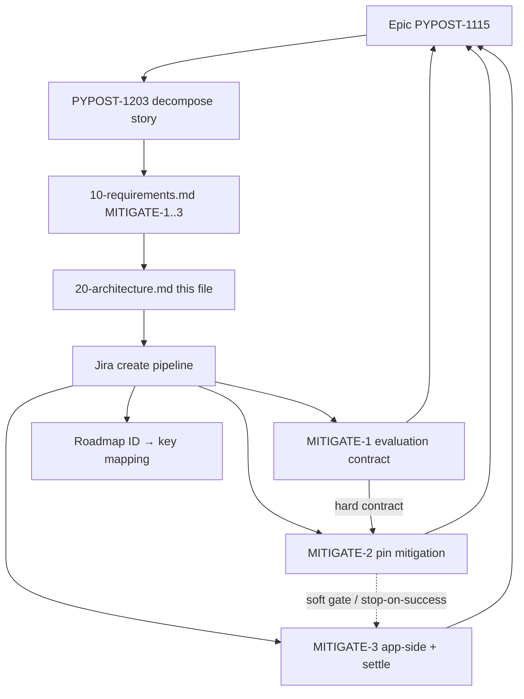

# PYPOST-1203: Decompose epic — mitigate QWidgetItem GC-teardown crash (workflow)

Step 2 artifact for PYPOST-1203. Turns approved requirements in
[`10-requirements.md`](10-requirements.md) into a **decomposition workflow**
architecture: how child issues map under epic
[PYPOST-1115](https://pypost.atlassian.net/browse/PYPOST-1115), sizing,
dependencies, create-time interfaces, and artifact ownership.

**Scope note:** This task ships planning Markdown and Jira children only
(created in Step 4: PYPOST-1209 / PYPOST-1210 / PYPOST-1211). It does
**not** design pin-selection criteria, cycle-break technique, or deliberate
`gc.collect` placement — those belong to child Top-Down cycles under
PYPOST-1115.

## Research

### R-1 Epic and decompose story (Jira facts)

- **[PYPOST-1115](https://pypost.atlassian.net/browse/PYPOST-1115)** — Epic;
  parent for mitigation work; label `tech-debt`; SP cleared on promote from
  Debt (former 8 SP).
- **[PYPOST-1203](https://pypost.atlassian.net/browse/PYPOST-1203)** — Story;
  this decompose / planning ticket; labels `decompose`, `tech-debt`; SP 2.

- Epic acceptance (covered by the **set** of children): stress harness
  (`N=25`) shows materially reduced crash rate; no regression to settle e2e
  assertions; candidates remain available until success or exhaustion.
- Under parent (after Step 4 create): PYPOST-1203 plus implementation
  children PYPOST-1209 / PYPOST-1210 / PYPOST-1211 (MITIGATE-1..3).
- Project is next-gen (`simplified: true`) — link children with `parent`
  (via `jira_link_issue_parent` / create-time `parent`), not classic Epic Link.
- Sprint goal ("Decompose Oversized Epics") covers PYPOST-1202–1205 for four
  SP>6 epics; this architecture applies only to PYPOST-1115.

### R-2 Industry epic-split practices

Sources:

- [Atlassian Fibonacci story points](https://www.atlassian.com/agile/project-management/fibonacci-story-points)
- [Epic breakdown techniques](https://docs.gitscrum.com/en/best-practices/epic-breakdown-techniques)
- [Humanizing Work story splitting](https://www.humanizingwork.com/the-humanizing-work-guide-to-splitting-user-stories/)

| Practice | Application to MITIGATE-1..3 |
| --- | --- |
| Vertical / outcome slices | Contract → pin attempt → app-side + settlement |
| Prefer ≤5 SP (avoid recreating 8) | Preferred 2 / 3 / 5 |
| Clear AC; one primary outcome | Matches FR1–FR4 |
| Soft / stop-on-success chain | MITIGATE-1 hard contract; MITIGATE-3 soft-gated by pin **with settlement ownership transferred to M2** |
| Estimate children, not the epic | Epic unpointed; children get SP on create |

### R-3 Repo create / estimate interfaces

| Interface | Responsibility |
| --- | --- |
| `jira-create-issue` skill | Estimate via read-only Fibonacci subagent, then create |
| `_shared/story-points.md` | Scale 1/2/3/5/8/13; Top-Down effort estimate |
| `jira_create_issue` MCP | Persist Story under PYPOST with SP field |
| `jira_link_issue_parent` MCP | Ensure `parent = PYPOST-1115` if not set at create |
| Roadmap Task Metadata / Step notes | Record MITIGATE-N → PYPOST-N mapping (NFR-3) |

Preferred SP in requirements are **planning guidance**. Create step must still
run the estimation subagent; if estimate returns 8+, split further before
create — do not recreate an oversized child.

### R-4 Sibling exclusions (keep out of PYPOST-1115)

| Ticket | Why not a child of this epic |
| --- | --- |
| PYPOST-1040 | Diagnosis complete; this epic is mitigation only |
| PYPOST-1116 | Duration-report xfail/XPASS labeling (separate debt) |
| PYPOST-1070 batch GUI notes | Related class, not same confirmed root cause; separate |

### R-5 Product surfaces children will later touch (context only)

Not designed here; listed so create descriptions stay outcome-focused and
point implementers at existing diagnosis and proof surfaces:

- `doc/dev/agent_dialog_settle.md` — teardown stress detector docs
- `tests/test_agent_dialog_settle_teardown_stress.py` — stress harness
  (`STRESS_ITERATIONS = 25`, `xfail(strict=False)`, `slow`)
- `tests/test_agent_dialog_settle_e2e.py` — settle e2e assertions (no
  regression)
- `pyproject.toml` — `PySide6==6.11.1` pin (MITIGATE-2 experiment surface)
- `pypost/agent/lifecycle.py` — `AgentAppSession.shutdown` (optional
  post-shutdown collection candidate for MITIGATE-3)
- Settings dialog nested-layout subtree — trigger surface (cycle-break
  candidate for MITIGATE-3)
- `ai-tasks/PYPOST-1040/20-architecture.md` — root-cause evidence
- `ai-tasks/PYPOST-1040/60-tech-debt.md` — mitigation candidates source

## Implementation Plan

### High-level approach (this task)

1. **Freeze slice model** — three provisional children MITIGATE-1..3 from
   Step 1 (no merge of MITIGATE-2+MITIGATE-3; no micro-split of app-side
   candidates unless create-time estimate forces it).
2. **Architecture (this step)** — document workflow modules, dependency
   graph, Jira field contract, and per-child artifact ownership.
3. **Step 3** — N/A for this decompose story (no product behavioral change).
4. **Step 4 (done)** — created three Stories under PYPOST-1115 with AC from
   requirements; mapped provisional IDs → keys in this task's roadmap;
   left product code unchanged.
5. **After PYPOST-1203 closes** — each child runs its own Top-Down Steps 1–8
   (Python implementation language per child metadata).

### Create sequence (executed in Step 4)

```text
For each of MITIGATE-1, MITIGATE-2, MITIGATE-3 (in that order):
  1. Draft summary, description (AC + epic coverage + non-goals), labels, parent
  2. Estimation subagent (jira-create-issue / story-points) → Fibonacci SP
  3. If SP > 5: re-slice and re-estimate (do not create)
  4. jira_create_issue (Story, parent PYPOST-1115, SP set)
  5. Verify via jira_get_issue; record MITIGATE-N → key in 00-roadmap.md
  6. Worklog estimation tokens on the new key
```

Preferred planning SP (guidance only): MITIGATE-1 = 2, MITIGATE-2 = 3,
MITIGATE-3 = 5 (total 10; slightly above former 8 SP debt to keep each ≤5).

### Mandatory — Failing Repro (Step 3)

**N/A — no behavioral change.**

PYPOST-1203 does not change product runtime. Step 3 for this task recorded
N/A in the roadmap. Red tests / stress re-measurement belong to **child**
stories (especially MITIGATE-2 / PYPOST-1210 and MITIGATE-3 / PYPOST-1211).

| Child | Suggested Step 3 ownership (child cycle, not here) |
| --- | --- |
| MITIGATE-1 | Doc/lint or docs-verifiable checks only (or N/A if pure prose) |
| MITIGATE-2 | Stress-detector measurement vs baseline for evaluated pin; e2e green; marker/docs settlement when M3 soft-skipped |
| MITIGATE-3 | Stress + e2e for chosen app-side attempt(s); marker/docs settlement when this child runs |

## Architecture

### Decomposition system modules



| Module | Responsibility |
| --- | --- |
| Epic PYPOST-1115 | Acceptance umbrella; no SP; holds children |
| PYPOST-1203 | Inventory, slice design, create children, close when mapped |
| Requirements artifact | Slice summaries, preferred SP, AC, exclusions |
| Architecture artifact | Workflow structure, interfaces, ownership (this file) |
| Jira create pipeline | Estimate → create Story → parent link → verify → map |
| Child Top-Down cycles | Own `ai-tasks/<child-key>/` and product/docs/tests |

### Selected patterns

| Pattern | Why |
| --- | --- |
| Contract → pin → app-side+settle | Keeps eval, dependency, and app risk each ≤5 SP |
| Hard then soft dependency | MITIGATE-1 first; MITIGATE-3 soft-skippable if pin succeeds **and** settlement ownership is transferred (see create-time rule) |
| Stop-on-success (NFR-4) | Avoid wasted work once epic success is met; settlement still has an owner |
| Settlement ownership | Marker/docs always owned by a non-skipped child (default M3; M2 if M3 soft-skipped) |
| Outcome-oriented Stories | One primary DoD per child; Top-Down-friendly |
| Shared measurement surface | Stress `N=25` + settle e2e named in MITIGATE-1 |
| Traceability table | Provisional IDs map to keys after create |

### Child issue field contract (create-time interface)

| Field | Value |
| --- | --- |
| Project | `PYPOST` |
| Issue type | **Story** (docs/implementation outcomes; not Epic) |
| Parent | `PYPOST-1115` |
| Priority | Medium (match epic unless create step overrides) |
| Labels | `tech-debt`; add `qwitem-gc-mitigate` for filters |
| Summary prefix | Prefer `[PYPOST-1115] …` for scannability |
| Story points | Estimation result; reject create if >5 |
| Issue links | Optional blocks links among children after keys |

Description must include: goal; Step 1 AC; epic coverage; non-goals
(1040/1116/1070); note that pin choice and app-side technique are in-child
architecture; reference MITIGATE-1 contract for “materially reduced” and
stop rules; and the settlement-ownership clause below when soft-skip applies.

Do **not** put `decompose` on implementation children (that label marks
PYPOST-1203). Default remains Story; create step may reclassify a slice as
Debt only with explicit justification.

### Create-time rule — settlement ownership (mandatory)

Detector marker/docs settlement (stress `xfail` / docs outcome) must **always**
have exactly one owning child among the created Stories. Soft-skip of
MITIGATE-3 must not orphan settlement.

| Path | Settlement owner | Create-time AC requirement |
| --- | --- | --- |
| MITIGATE-3 will run (pin inconclusive / insufficient) | **MITIGATE-3** | MITIGATE-3 AC includes marker/docs settlement (default). MITIGATE-2 AC need not duplicate settlement. |
| MITIGATE-3 may be soft-skipped because pin already meets epic success | **MITIGATE-2** | MITIGATE-2 created AC **must** include detector marker/docs settlement for the pin-success path. Soft-skip of MITIGATE-3 is allowed only when this AC is present (or settlement is otherwise assigned to a child that is not skipped). |

**Forbidden:** Soft-skip MITIGATE-3 for stop-on-success while leaving marker/docs
settlement only on MITIGATE-3 (no owner for the success path).

Step 4 create drafts must apply this rule when writing summaries/AC; MITIGATE-1
stop rules must name which child settles markers/docs when later work is
skipped.

### Dependency and delivery order

```text
MITIGATE-1 (evaluation contract / baseline)   preferred SP 2
    │  hard prerequisite (defines success + stop rules;
    │  names settlement owner for skip path)
    ▼
MITIGATE-2 (PySide6/shiboken6 pin attempt)    preferred SP 3
    │  soft gate — if epic success already met, skip MITIGATE-3
    │  with recorded evidence per MITIGATE-1 stop rules
    │  ONLY IF MITIGATE-2 AC owns marker/docs settlement
    ▼
MITIGATE-3 (app-side attempt(s) + settlement) preferred SP 5
    │  default settlement owner when this child runs
```

Epic PYPOST-1115 is **Done** only when the set of children meets epic
acceptance (material crash-rate drop + intact e2e + settled markers/docs),
whether via pin alone, app-side work, or exhausted candidates with evidence.
PYPOST-1203 is **Done** when children exist under the epic with AC, sizing,
and roadmap mapping — not when mitigation ships.

### Per-child artifact ownership

**MITIGATE-1** — Document mitigation evaluation contract and baseline.

- Owns: dev-facing notes (baseline rate/env, “materially reduced” threshold,
  candidate order, stop-on-success); names stress (`N=25`) and settle e2e as
  proof surfaces; names which later child owns marker/docs settlement when
  stop-on-success skips MITIGATE-3; child `ai-tasks/<key>/`.

**MITIGATE-2** — Attempt PySide6/shiboken6 pin mitigation.

- Owns: pin change or documented no-change decision; stress outcome vs
  baseline; settle e2e green for the evaluated pin; child `ai-tasks/<key>/`.
  **Also owns detector marker/docs settlement when MITIGATE-3 is soft-skipped
  for pin success** (required AC at create time — see rule above). Exact
  patch selection is **that** story's architecture.

**MITIGATE-3** — Attempt application-side mitigations and settle outcome.

- Owns: at least one epic app-side candidate (cycle break and/or deliberate
  post-shutdown collection) unless MITIGATE-2 already met success; stress +
  e2e recording; **detector marker/docs settlement when this child runs**
  (default owner); child `ai-tasks/<key>/`. Technique details are **that**
  story's architecture. Soft-skip does not transfer settlement unless
  MITIGATE-2 AC already includes it.

PYPOST-1203 owns only `ai-tasks/PYPOST-1203/*` and the Jira create/mapping
act. It must not land pin or lifecycle mitigation code.

### Traceability (filled after create)

Recorded in `ai-tasks/PYPOST-1203/00-roadmap.md` and below:

| Provisional ID | Jira key | Preferred SP | Estimated SP at create | Browse |
| --- | --- | ---: | ---: | --- |
| MITIGATE-1 | [PYPOST-1209](https://pypost.atlassian.net/browse/PYPOST-1209) | 2 | 2 | https://pypost.atlassian.net/browse/PYPOST-1209 |
| MITIGATE-2 | [PYPOST-1210](https://pypost.atlassian.net/browse/PYPOST-1210) | 3 | 3 | https://pypost.atlassian.net/browse/PYPOST-1210 |
| MITIGATE-3 | [PYPOST-1211](https://pypost.atlassian.net/browse/PYPOST-1211) | 5 | 5 | https://pypost.atlassian.net/browse/PYPOST-1211 |

**Estimation note:** Task nesting unavailable in Step 4 execution subagent;
self-estimated per `_shared/story-points.md` (Fibonacci Top-Down effort).
All estimates matched preferred SP and were ≤5 (no re-slice).
MITIGATE-2 create AC includes settlement ownership for pin-success soft-skip.

### Explicit non-architecture (deferred to children)

- Which PySide6/shiboken6 patch to try, or criteria for refusing a pin change
- Exact reference-cycle break technique on SettingsDialog / layout items
- Whether / how to call `gc.collect` after `AgentAppSession.shutdown`
- Exact numeric definition of “materially reduced” (MITIGATE-1 owns it)
- Marker policy for stress `xfail` removal vs retain-with-XPASS (child AC;
  ownership assigned by create-time settlement rule)

## Q&A

| Question | Answer |
| --- | --- |
| Design pin or cycle-break here? | No — child MITIGATE-2 / MITIGATE-3 architecture. |
| Create Jira children in Step 2? | No — deferred to Step 4 (done). |
| Issue type for children? | Story under PYPOST-1115. |
| Labels? | `tech-debt`, `qwitem-gc-mitigate`; not `decompose`. |
| Preferred vs estimated SP? | Preferred guides drafts; create estimates; >5 re-slice. |
| Must all candidates run? | No — stop-on-success per MITIGATE-1 / NFR-4. |
| MITIGATE-3 hard block on MITIGATE-2? | Soft — skip with evidence if pin already succeeds, **only if** MITIGATE-2 AC owns marker/docs settlement. |
| Who settles markers/docs if M3 is skipped? | MITIGATE-2 (mandatory create-time AC). Default owner is MITIGATE-3 when it runs. |
| Step 3 red test for 1203? | N/A — no behavioral change. |
| Close epic when 1203 closes? | No — epic closes when mitigation acceptance is met by children. |
| Include 1040 / 1116 / 1070? | No — separate tickets. |
