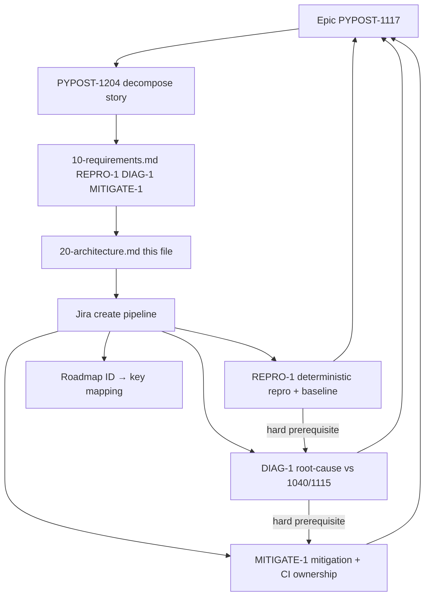

# PYPOST-1204: Decompose epic — Diagnose large-batch Qt/PySide6 GUI test segfault (workflow)

Step 2 artifact for PYPOST-1204. Turns approved requirements in
[`10-requirements.md`](10-requirements.md) into a **decomposition workflow**
architecture: how child issues map under epic
[PYPOST-1117](https://pypost.atlassian.net/browse/PYPOST-1117), sizing,
dependencies, create-time interfaces, and artifact ownership.

**Scope note:** This task ships planning Markdown and Jira children only
(created in Step 4: PYPOST-1212 / PYPOST-1213 / PYPOST-1214). It does
**not** design repro harness layout, root-cause technique (lifetime vs
QStyle/QPalette), or batching/isolation mechanism — those belong to child
Top-Down cycles under PYPOST-1117.

## Research

### R-1 Epic and decompose story (Jira facts)

- **[PYPOST-1117](https://pypost.atlassian.net/browse/PYPOST-1117)** — Epic;
  parent for large-batch `apply_theme` diagnosis/mitigation; labels
  `failing-test`, `tech-debt`; SP cleared on promote from Debt (former
  13 SP).
- **[PYPOST-1204](https://pypost.atlassian.net/browse/PYPOST-1204)** — Story;
  this decompose / planning ticket; labels `decompose`, `failing-test`,
  `tech-debt`; SP 2.

- Epic acceptance (covered by the **set** of children): deterministic
  subprocess-level repro + evidence baseline; root-cause determination
  (shared lifetime vs distinct QStyle/QPalette; distinguish from
  PYPOST-1040/1115); safe mitigation (bounded batches and/or process
  isolation); CI/test-infrastructure ownership and tradeoffs documented.
- Under parent (after Step 4 create): PYPOST-1204 plus implementation
  children PYPOST-1212 / PYPOST-1213 / PYPOST-1214 (REPRO-1 / DIAG-1 /
  MITIGATE-1).
- Project is next-gen (`simplified: true`) — link children with `parent`
  (via `jira_link_issue_parent` / create-time `parent`), not classic Epic
  Link.
- Sprint goal ("Decompose Oversized Epics") covers PYPOST-1202–1205 for
  four SP>6 epics; this architecture applies only to PYPOST-1117.

### R-2 Industry epic-split practices

Sources:

- [Atlassian Fibonacci story points](https://www.atlassian.com/agile/project-management/fibonacci-story-points)
- [Epic breakdown techniques](https://docs.gitscrum.com/en/best-practices/epic-breakdown-techniques)
- [Sprint-ready story splits](https://kollabe.com/posts/break-down-epics-into-sprint-ready-stories)
- [SPIDR story splitting](https://www.mountaingoatsoftware.com/agile/five-simple-but-powerful-ways-to-split-user-stories)

| Practice | Application to REPRO-1 / DIAG-1 / MITIGATE-1 |
| --- | --- |
| Vertical / outcome slices | Repro baseline → diagnosis → mitigation+CI docs |
| Prefer ≤5 SP (avoid recreating 13) | Preferred 3 / 5 / 5 |
| Clear AC; one primary outcome | Matches FR1–FR4 |
| Hard dependency chain | REPRO-1 → DIAG-1 → MITIGATE-1 |
| Spike then build | REPRO/DIAG produce evidence; MITIGATE acts on it |
| Estimate children, not the epic | Epic unpointed; children get SP on create |

### R-3 Repo create / estimate interfaces

| Interface | Responsibility |
| --- | --- |
| `jira-create-issue` skill | Estimate via read-only Fibonacci subagent, then create |
| `_shared/story-points.md` | Scale 1/2/3/5/8/13; Top-Down effort estimate |
| `jira_create_issue` MCP | Persist Story under PYPOST with SP field |
| `jira_link_issue_parent` MCP | Ensure `parent = PYPOST-1117` if not set at create |
| Roadmap Task Metadata / Step notes | Record REPRO-1 / DIAG-1 / MITIGATE-1 → PYPOST-1212 / 1213 / 1214 mapping (NFR-3) |

Preferred SP in requirements are **planning guidance**. Create step must still
run the estimation subagent; if estimate returns 8+, split further before
create — do not recreate an oversized child. Reject create if SP > 5.

### R-4 Sibling exclusions (keep out of PYPOST-1117)

| Ticket | Why not a child of this epic |
| --- | --- |
| PYPOST-1040 | Distinct SettingsDialog/QWidgetItem GC diagnosis (prior art only) |
| PYPOST-1115 | Mitigation for that distinct teardown crash (separate epic) |
| PYPOST-1070 | Import-order / E402 work that discovered but did not own this crash |
| PYPOST-1110 / PYPOST-1111 | Pre-existing unrelated suite failures from PYPOST-1070 notes |

### R-5 Product surfaces children will later touch (context only)

Not designed here; listed so create descriptions stay outcome-focused and
point implementers at existing crash/docs surfaces:

- `pypost/ui/styles/style_manager.py` — `apply_theme` crash surface
  (epic cites ~line 102 / `setStyle` / `QStyleFactory.create("Fusion")`;
  children verify current line mapping under repro)
- `doc/dev/gui_testing.md` — offscreen Qt / `qapp` GUI test patterns
- `doc/dev/testing.md` — suite commands, offscreen CI conventions
- `tests/conftest.py` — module-scoped `qapp`, offscreen platform
- `ai-tasks/PYPOST-1070/60-tech-debt.md` — discovery source (~110-module
  full batch vs eight bounded batches / ~1,384 tests)
- `ai-tasks/PYPOST-1040/20-architecture.md` — related prior-art diagnosis
  (distinct site/trigger; methodology reusable)
- PYPOST-1115 children / docs — related mitigation epic (do not merge)

## Implementation Plan

### High-level approach (this task)

1. **Freeze slice model** — three provisional children REPRO-1, DIAG-1,
   MITIGATE-1 from Step 1 (no merge of DIAG-1+MITIGATE-1; no fourth
   CI-only child; no micro-split unless create-time estimate forces it).
2. **Architecture (this step)** — document workflow modules, dependency
   graph, Jira field contract, and per-child artifact ownership.
3. **Step 3** — N/A for this decompose story (no product behavioral
   change); red tests belong to child cycles.
4. **Step 4** — created three Stories under PYPOST-1117 with AC from
   requirements; mapped provisional IDs → keys in this task's roadmap;
   left product code unchanged.
5. **After PYPOST-1204 closes** — each child runs its own Top-Down Steps
   1–8 (Python implementation language per child metadata).

### Create sequence (completed in Step 4)

```text
For each of REPRO-1, DIAG-1, MITIGATE-1 (in that order):
  1. Draft summary, description (AC + epic coverage + non-goals), labels, parent
  2. Estimation subagent (jira-create-issue / story-points) → Fibonacci SP
  3. If SP > 5: re-slice and re-estimate (do not create)
  4. jira_create_issue (Story, parent PYPOST-1117, SP set)
  5. Verify via jira_get_issue; record provisional ID → key in 00-roadmap.md
  6. Worklog estimation tokens on the new key
```

Preferred planning SP (guidance only): REPRO-1 = 3, DIAG-1 = 5,
MITIGATE-1 = 5 (total 13; matches former debt estimate while keeping each
≤5). Create-time estimates matched preferred (3 / 5 / 5).

### Mandatory — Failing Repro (Step 3)

**N/A — no behavioral change.**

PYPOST-1204 does not change product runtime. Step 3 for this task recorded
N/A in the roadmap. Red tests / deterministic crash reproduction belong to
**child** stories (especially REPRO-1 / PYPOST-1212).

| Child | Suggested Step 3 ownership (child cycle, not here) |
| --- | --- |
| REPRO-1 / PYPOST-1212 | Automated or scripted red path that surfaces the large-batch native crash (or justified equivalent) against the evidence baseline |
| DIAG-1 / PYPOST-1213 | Evidence-gated checks or docs-verifiable diagnosis deliverable; may rely on REPRO-1 procedure rather than a new red product test |
| MITIGATE-1 / PYPOST-1214 | Red-then-green against REPRO-1: crash avoided under chosen mitigation, plus docs-verifiable CI ownership |

## Architecture

### Decomposition system modules



| Module | Responsibility |
| --- | --- |
| Epic PYPOST-1117 | Acceptance umbrella; no SP; holds children |
| PYPOST-1204 | Inventory, slice design, create children, close when mapped |
| Requirements artifact | Slice summaries, preferred SP, AC, exclusions |
| Architecture artifact | Workflow structure, interfaces, ownership (this file) |
| Jira create pipeline | Estimate → create Story → parent link → verify → map |
| Child Top-Down cycles | Own `ai-tasks/<child-key>/` and product/docs/tests/CI |

### Selected patterns

| Pattern | Why |
| --- | --- |
| Repro → diagnose → mitigate | Keeps evidence, class decision, and fix each ≤5 SP |
| Hard dependency chain | DIAG needs stable baseline; MITIGATE needs class decision |
| Outcome-oriented Stories | One primary DoD per child; Top-Down-friendly |
| Fold CI docs into MITIGATE-1 | Avoids a fourth micro-slice; ownership inseparable from mitigation choice |
| Distinguish prior art | NFR-4: 1040/1115 related until DIAG proves otherwise |
| Traceability table | Provisional IDs map to keys after create |

### Child issue field contract (create-time interface)

| Field | Value |
| --- | --- |
| Project | `PYPOST` |
| Issue type | **Story** (docs/implementation outcomes; not Epic) |
| Parent | `PYPOST-1117` |
| Priority | Medium (match epic unless create step overrides) |
| Labels | `tech-debt`, `failing-test`; add `gui-batch-segfault` for filters |
| Summary prefix | Prefer `[PYPOST-1117] …` for scannability |
| Story points | Estimation result; **reject create if >5** |
| Issue links | Optional blocks links among children after keys (REPRO → DIAG → MITIGATE) |

Description must include: goal; Step 1 AC; epic coverage; non-goals
(1040/1115/1070/1110/1111); note that repro harness, diagnosis technique,
and batching/isolation design are in-child architecture; cross-link
PYPOST-1040/1115 as related prior art only.

Do **not** put `decompose` on implementation children (that label marks
PYPOST-1204). Default remains Story; create step may reclassify a slice as
Debt only with explicit justification.

### Dependency and delivery order

```text
REPRO-1 (deterministic repro + evidence baseline)   preferred SP 3
    │  hard prerequisite (stable procedure + baseline contrast)
    ▼
DIAG-1 (root-cause vs PYPOST-1040/1115)             preferred SP 5
    │  hard prerequisite (class decision informs “safe” mitigation)
    ▼
MITIGATE-1 (bounded batches / isolation + CI docs)  preferred SP 5
```

Epic PYPOST-1117 is **Done** only when all three children meet their AC and
the set covers epic acceptance. PYPOST-1204 is **Done** when children exist
under the epic with AC, sizing, and roadmap mapping — not when diagnosis or
mitigation ships.

### Per-child artifact ownership

**REPRO-1** — Deterministic repro and evidence baseline.

- Owns: documented, repeatable subprocess-level procedure; environment /
  command / pass-fail contrast (full batch vs bounded batches /
  individual modules); crash observation tied to `apply_theme` /
  style-factory site (or evidence-updated site); child `ai-tasks/<key>/`.

**DIAG-1** — Root-cause diagnosis (lifetime vs QStyle/QPalette).

- Owns: written diagnosis concluding shared Shiboken/Qt lifetime vs
  distinct QStyle/QPalette accumulation (or other justified class);
  explicit distinction from SettingsDialog/QWidgetItem GC-teardown;
  evidence sufficient for MITIGATE-1; dev-facing notes; child
  `ai-tasks/<key>/`. Technique details are **that** story's architecture.

**MITIGATE-1** — Safe mitigation and CI ownership docs.

- Owns: evaluate and, if safe, implement at least one epic-named path
  (bounded GUI-test batches and/or process isolation, or justified
  equivalent); proof against REPRO-1; CI/test-infra ownership and
  tradeoffs docs; no silent merge into PYPOST-1115; child
  `ai-tasks/<key>/`. Exact isolation/batching design is **that** story's
  architecture.

PYPOST-1204 owns only `ai-tasks/PYPOST-1204/*` and the Jira create/mapping
act. It must not land repro harness, diagnosis code, or CI mitigation.

### Traceability (filled in Step 4)

Recorded in `ai-tasks/PYPOST-1204/00-roadmap.md` and below:

| Provisional ID | Jira key | Preferred SP | Estimated SP at create | Browse |
| --- | --- | ---: | ---: | --- |
| REPRO-1 | [PYPOST-1212](https://pypost.atlassian.net/browse/PYPOST-1212) | 3 | 3 | https://pypost.atlassian.net/browse/PYPOST-1212 |
| DIAG-1 | [PYPOST-1213](https://pypost.atlassian.net/browse/PYPOST-1213) | 5 | 5 | https://pypost.atlassian.net/browse/PYPOST-1213 |
| MITIGATE-1 | [PYPOST-1214](https://pypost.atlassian.net/browse/PYPOST-1214) | 5 | 5 | https://pypost.atlassian.net/browse/PYPOST-1214 |

**Estimation note:** Step 4 ran the estimation subagent per
`_shared/story-points.md`. Preferred SP matched estimated SP (3 / 5 / 5);
no child exceeded 5. Estimation worklogs logged on PYPOST-1212 / 1213;
MITIGATE-1 (PYPOST-1214) estimate `tokens_used` was 0.

### Explicit non-architecture (deferred to children)

- Exact repro harness / subprocess procedure design
- Lifetime vs QStyle/QPalette investigation technique and tooling
- Whether / how to use `pytest-forked`, worker pools, or Makefile batch
  targets
- Whether production `apply_theme` must change vs test-infra-only mitigation
- Exact numeric CI batch bounds or isolation granularity
- Marker/xfail policy for residual risk (if any)

## Q&A

| Question | Answer |
| --- | --- |
| Design repro harness or isolation here? | No — child REPRO-1 / MITIGATE-1 architecture. |
| Create Jira children in Step 2? | No — deferred to Step 4 (done: PYPOST-1212 / 1213 / 1214). |
| Issue type for children? | Story under PYPOST-1117. |
| Labels? | `tech-debt`, `failing-test`, `gui-batch-segfault`; not `decompose`. |
| Preferred vs estimated SP? | Preferred guides drafts; create estimates; >5 re-slice / reject. |
| DIAG soft on REPRO? | No — hard prerequisite for stable baseline. |
| MITIGATE soft on DIAG? | No — hard prerequisite so mitigation is class-informed. |
| Step 3 red test for 1204? | N/A — no behavioral change. |
| Close epic when 1204 closes? | No — epic closes when REPRO/DIAG/MITIGATE acceptances are met. |
| Include 1040 / 1115 / 1070 / 1110 / 1111? | No — separate tickets / exclusions. |
| Separate CI-docs child? | No — folded into MITIGATE-1 per requirements. |
