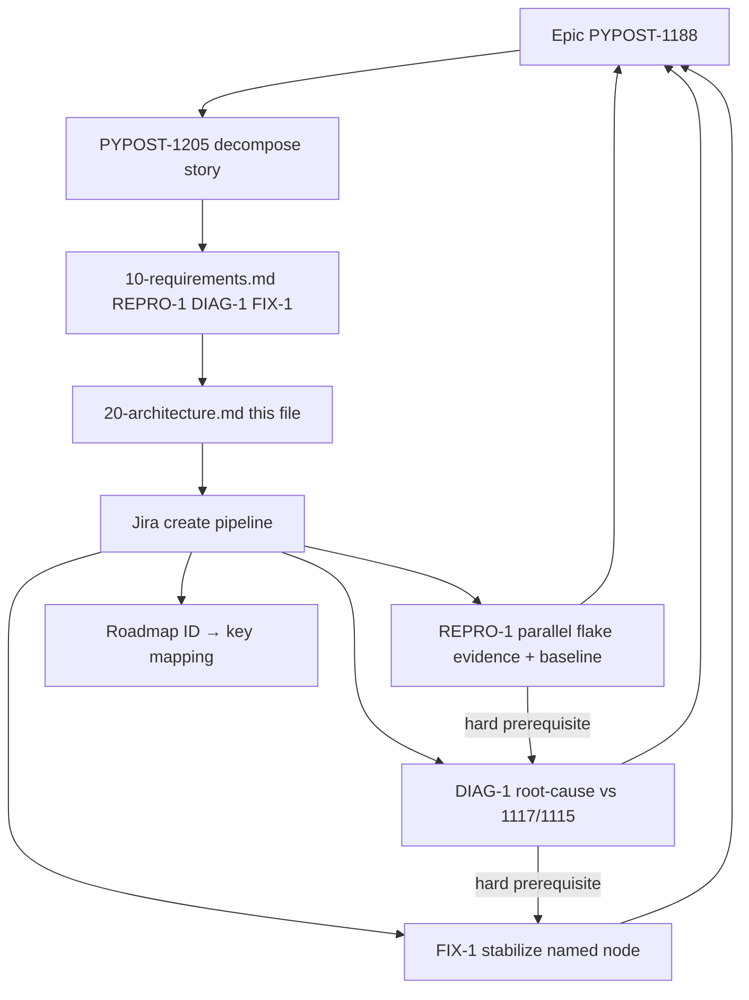

# PYPOST-1205: Decompose epic — Stabilize test_live_collection_tree_missing_option_raises (workflow)

Step 2 artifact for PYPOST-1205. Turns approved requirements in
[`10-requirements.md`](10-requirements.md) into a **decomposition workflow**
architecture: how child issues map under epic
[PYPOST-1188](https://pypost.atlassian.net/browse/PYPOST-1188), sizing,
dependencies, create-time interfaces, and artifact ownership.

**Scope note:** This task ships planning Markdown and Jira children only
(created in Step 4: PYPOST-1215 / PYPOST-1216 / PYPOST-1217). It does
**not** design the parallel flake repro harness, root-cause
instrumentation (confirm/refute `apply_theme` vs uvicorn import race), or
stabilization mechanism (test isolation/ordering vs product-side) — those
belong to child Top-Down cycles under PYPOST-1188.

## Research

### R-1 Epic and decompose story (Jira facts)

- **[PYPOST-1188](https://pypost.atlassian.net/browse/PYPOST-1188)** — Epic;
  parent for stabilizing
  `tests/test_ui_actions.py::test_live_collection_tree_missing_option_raises`
  under parallel `make test`; labels `failing-test`, `tech-debt`; SP
  cleared on promote from Debt (former 8 SP).
- **[PYPOST-1205](https://pypost.atlassian.net/browse/PYPOST-1205)** — Story;
  this decompose / planning ticket; labels `decompose`, `failing-test`,
  `tech-debt`; SP 2; parent PYPOST-1188; sprint "Decompose Oversized
  Epics".

- Epic acceptance (covered by the **set** of children): owned
  parallel-vs-isolated flake evidence/baseline; root-cause determination
  (confirm/refute Qt `apply_theme` vs uvicorn import race, or justified
  alternative; distinguish from PYPOST-1117 / PYPOST-1115); stabilization
  so the named node is reliable under parallel `make test` without losing
  the intended negative assertion (`option not found`).
- Under parent (after Step 4 create): PYPOST-1205 plus implementation
  children PYPOST-1215 / PYPOST-1216 / PYPOST-1217 (REPRO-1 / DIAG-1 /
  FIX-1).
- Project is next-gen (`simplified: true`) — link children with `parent`
  (via `jira_link_issue_parent` / create-time `parent`), not classic Epic
  Link.
- Sprint goal ("Decompose Oversized Epics") covers PYPOST-1202–1205 for
  four SP>6 epics; this architecture applies only to PYPOST-1188.

### R-2 Industry epic-split practices

Sources:

- [Atlassian Fibonacci story points](https://www.atlassian.com/agile/project-management/fibonacci-story-points)
- [Epic breakdown techniques](https://docs.gitscrum.com/en/best-practices/epic-breakdown-techniques)
- [Sprint-ready story splits](https://kollabe.com/posts/break-down-epics-into-sprint-ready-stories)
- [SPIDR story splitting](https://www.mountaingoatsoftware.com/agile/five-simple-but-powerful-ways-to-split-user-stories)

| Practice | Application to REPRO-1 / DIAG-1 / FIX-1 |
| --- | --- |
| Vertical / outcome slices | Repro baseline → diagnosis → stabilize |
| Prefer ≤5 SP (avoid recreating 8) | Preferred 2 / 3 / 3 |
| Clear AC; one primary outcome | Matches FR1–FR4 |
| Hard dependency chain | REPRO-1 → DIAG-1 → FIX-1 |
| Spike then build | REPRO/DIAG produce evidence; FIX acts on it |
| Estimate children, not the epic | Epic unpointed; children get SP on create |

### R-3 Repo create / estimate interfaces

| Interface | Responsibility |
| --- | --- |
| `jira-create-issue` skill | Estimate via read-only Fibonacci subagent, then create |
| `_shared/story-points.md` | Scale 1/2/3/5/8/13; Top-Down effort estimate |
| `jira_create_issue` MCP | Persist Story under PYPOST with SP field |
| `jira_link_issue_parent` MCP | Ensure `parent = PYPOST-1188` if not set at create |
| Roadmap Task Metadata / Step notes | Record REPRO-1 / DIAG-1 / FIX-1 → PYPOST-1215 / 1216 / 1217 mapping (NFR-3) |

Preferred SP in requirements are **planning guidance**. Create step must still
run the estimation subagent; if estimate returns 8+, split further before
create — do not recreate an oversized child. Reject create if SP > 5.

### R-4 Sibling exclusions (keep out of PYPOST-1188)

| Ticket | Why not a child of this epic |
| --- | --- |
| PYPOST-1117 | Large-batch `apply_theme` segfault (related surface; separate epic) |
| PYPOST-1115 / PYPOST-1040 | SettingsDialog/QWidgetItem GC teardown (distinct site/trigger) |
| PYPOST-1167 MCP headers | Discovery context only; headers work is unrelated |
| PYPOST-1169 / PYPOST-1170 / … | MCP-TM follow-ups; not this flake |
| `test_live_collection_tree_index_out_of_range_raises` | Sibling live negative; include only if same root cause proven |

### R-5 Product surfaces children will later touch (context only)

Not designed here; listed so create descriptions stay outcome-focused and
point implementers at existing flake/docs surfaces:

- `tests/test_ui_actions.py` — named node
  `test_live_collection_tree_missing_option_raises` and sibling live
  negatives
- Live `COLLECTION_TREE` missing-option path — intended
  `UiTargetNotInteractableError` / `"option not found"` lock (PYPOST-975)
- Suspected race class — Qt `apply_theme` vs uvicorn import under parallel
  `make test` (unconfirmed; DIAG-1 owns confirmation/refutation)
- Base commit `353370cdbd19c7a3338e2ed05c292b0a404d7b90` — HEAD before
  PYPOST-1167 edits (bisect / contrast baseline)
- `doc/dev/testing.md` — live COLLECTION_TREE negative documentation /
  suite conventions
- `doc/dev/gui_testing.md` — offscreen Qt / GUI test patterns; related
  large-batch `apply_theme` epic pointers
- `pypost/ui/styles/style_manager.py` — `apply_theme` surface (related
  class via PYPOST-1117; not assumed same root cause here)
- `ai-tasks/PYPOST-1167/60-tech-debt.md` — discovery source (item 6)
- `ai-tasks/PYPOST-1204/20-architecture.md` — closest decompose workflow
  pattern (REPRO / DIAG / stabilize)

## Implementation Plan

### High-level approach (this task)

1. **Freeze slice model** — three provisional children REPRO-1, DIAG-1,
   FIX-1 from Step 1 (no merge of DIAG-1+FIX-1; no fourth docs-only
   child; no micro-split unless create-time estimate forces it).
2. **Architecture (this step)** — document workflow modules, dependency
   graph, Jira field contract, and per-child artifact ownership.
3. **Step 3** — N/A for this decompose story (no product behavioral
   change); red tests belong to child cycles.
4. **Step 4** — created three Stories under PYPOST-1188 with AC from
   requirements; mapped provisional IDs → keys in this task's roadmap;
   left product code unchanged.
5. **After PYPOST-1205 closes** — each child runs its own Top-Down Steps
   1–8 (Python implementation language per child metadata).

### Create sequence (completed in Step 4)

```text
For each of REPRO-1, DIAG-1, FIX-1 (in that order):
  1. Draft summary, description (AC + epic coverage + non-goals), labels, parent
  2. Estimation subagent (jira-create-issue / story-points) → Fibonacci SP
  3. If SP > 5: re-slice and re-estimate (do not create)
  4. jira_create_issue (Story, parent PYPOST-1188, SP set)
  5. Verify via jira_get_issue; record provisional ID → key in 00-roadmap.md
  6. Worklog estimation tokens on the new key
```

Preferred planning SP (guidance only): REPRO-1 = 2, DIAG-1 = 3,
FIX-1 = 3 (total 8; matches former debt estimate while keeping each ≤5).
Create-time estimates matched preferred (2 / 3 / 3).

### Mandatory — Failing Repro (Step 3)

**N/A — no behavioral change.**

PYPOST-1205 does not change product runtime. Step 3 for this task recorded
N/A in the roadmap. Red tests / owned flake reproduction belong to
**child** stories (especially REPRO-1 / PYPOST-1215).

| Child | Suggested Step 3 ownership (child cycle, not here) |
| --- | --- |
| REPRO-1 / PYPOST-1215 | Automated or scripted red path that surfaces the parallel flake (or justified equivalent) against the parallel-vs-isolated evidence baseline |
| DIAG-1 / PYPOST-1216 | Evidence-gated checks or docs-verifiable diagnosis deliverable; may rely on REPRO-1 procedure rather than a new red product test |
| FIX-1 / PYPOST-1217 | Red-then-green against REPRO-1: named node reliable under parallel `make test`, intended negative assertion preserved |

## Architecture

### Decomposition system modules



| Module | Responsibility |
| --- | --- |
| Epic PYPOST-1188 | Acceptance umbrella; no SP; holds children |
| PYPOST-1205 | Inventory, slice design, create children, close when mapped |
| Requirements artifact | Slice summaries, preferred SP, AC, exclusions |
| Architecture artifact | Workflow structure, interfaces, ownership (this file) |
| Jira create pipeline | Estimate → create Story → parent link → verify → map |
| Child Top-Down cycles | Own `ai-tasks/<child-key>/` and product/docs/tests |

### Selected patterns

| Pattern | Why |
| --- | --- |
| Repro → diagnose → fix | Keeps evidence, class decision, and stabilize each ≤5 SP |
| Hard dependency chain | DIAG needs stable baseline; FIX needs class decision |
| Outcome-oriented Stories | One primary DoD per child; Top-Down-friendly |
| Fold diagnosis notes into DIAG-1 / FIX-1 | Avoids a fourth docs-only micro-slice |
| Distinguish prior art | NFR-4: 1117/1115 related until DIAG proves otherwise |
| Traceability table | Provisional IDs map to keys after create |

### Child issue field contract (create-time interface)

| Field | Value |
| --- | --- |
| Project | `PYPOST` |
| Issue type | **Story** (docs/implementation outcomes; not Epic) |
| Parent | `PYPOST-1188` |
| Priority | Medium (match epic unless create step overrides) |
| Labels | `tech-debt`, `failing-test`; add `qt-uvicorn-race` for filters |
| Summary prefix | Prefer `[PYPOST-1188] …` for scannability |
| Story points | Estimation result; **reject create if >5** |
| Issue links | Optional blocks links among children after keys (REPRO → DIAG → FIX) |

Description must include: goal; Step 1 AC; epic coverage; non-goals
(1117/1115/1040/1167 MCP headers/MCP-TM follow-ups; sibling
`index_out_of_range` unless same cause proven); note that repro harness,
diagnosis technique, and stabilization design are in-child architecture;
cross-link PYPOST-1117/1115 as related prior art only.

Do **not** put `decompose` on implementation children (that label marks
PYPOST-1205). Default remains Story; create step may reclassify a slice as
Debt only with explicit justification.

### Dependency and delivery order

```text
REPRO-1 (owned parallel flake evidence + baseline)   preferred SP 2
    │  hard prerequisite (stable procedure + parallel-vs-isolated contrast)
    ▼
DIAG-1 (root-cause vs PYPOST-1117/1115)              preferred SP 3
    │  hard prerequisite (class decision informs “safe” stabilize)
    ▼
FIX-1 (stabilize named node under parallel make test) preferred SP 3
```

Epic PYPOST-1188 is **Done** only when all three children meet their AC and
the set covers epic acceptance. PYPOST-1205 is **Done** when children exist
under the epic with AC, sizing, and roadmap mapping — not when diagnosis or
stabilization ships.

### Per-child artifact ownership

**REPRO-1** — Owned parallel flake evidence and baseline.

- Owns: documented, repeatable procedure that reproduces the intermittent
  failure of the named node under parallel `make test` load (or justified
  equivalent matching the epic’s failure class); contrast with
  isolated-file (or isolated-node) pass; environment / command shape /
  base commit (`353370cd…`) / observed failure mode; child
  `ai-tasks/<key>/`. Exact harness design is **that** story's
  architecture.

**DIAG-1** — Root-cause diagnosis (race class vs alternatives).

- Owns: written diagnosis confirming, refuting, or replacing the
  suspected Qt `apply_theme` vs uvicorn import race with an
  evidence-backed class; explicit distinction from PYPOST-1117
  (large-batch `apply_theme` segfault) and PYPOST-1115/1040 (QWidgetItem
  GC teardown); evidence sufficient for FIX-1; dev-facing notes; child
  `ai-tasks/<key>/`. Technique details are **that** story's architecture.

**FIX-1** — Stabilize named node under parallel `make test`.

- Owns: make the named node reliable under parallel `make test` (flake
  eliminated or residual risk documented with owner and follow-up);
  preserve intended negative assertion unless explicit reviewed AC
  change; proof against REPRO-1 procedure (or updated equivalent);
  no silent merge into PYPOST-1117 / PYPOST-1115; child
  `ai-tasks/<key>/`. Exact isolation/ordering/product fix design is
  **that** story's architecture.

PYPOST-1205 owns only `ai-tasks/PYPOST-1205/*` and the Jira create/mapping
act. It must not land repro harness, diagnosis code, or stabilization.

### Traceability (filled in Step 4)

Recorded in `ai-tasks/PYPOST-1205/00-roadmap.md` and below:

| Provisional ID | Jira key | Preferred SP | Estimated SP at create | Browse |
| --- | --- | ---: | ---: | --- |
| REPRO-1 | [PYPOST-1215](https://pypost.atlassian.net/browse/PYPOST-1215) | 2 | 2 | https://pypost.atlassian.net/browse/PYPOST-1215 |
| DIAG-1 | [PYPOST-1216](https://pypost.atlassian.net/browse/PYPOST-1216) | 3 | 3 | https://pypost.atlassian.net/browse/PYPOST-1216 |
| FIX-1 | [PYPOST-1217](https://pypost.atlassian.net/browse/PYPOST-1217) | 3 | 3 | https://pypost.atlassian.net/browse/PYPOST-1217 |

**Estimation note:** Step 4 ran the estimation subagent per
`_shared/story-points.md`. Preferred SP matched estimated SP (2 / 3 / 3);
no child exceeded 5.

### Explicit non-architecture (deferred to children)

- Exact parallel flake repro harness / procedure design
- Instrumentation to confirm/refute `apply_theme` vs uvicorn race
- Whether / how to use pytest isolation, ordering, import/lifecycle
  guards, or product-side changes
- Whether production `apply_theme` or uvicorn usage must change vs
  test-side-only stabilization
- Whether sibling `test_live_collection_tree_index_out_of_range_raises`
  shares the same root cause (only if DIAG-1 proves it)
- Marker/xfail policy for residual risk (if any)

## Q&A

| Question | Answer |
| --- | --- |
| Design repro harness or fix here? | No — child REPRO-1 / FIX-1 architecture. |
| Create Jira children in Step 2? | No — deferred to Step 4 (done: PYPOST-1215 / 1216 / 1217). |
| Issue type for children? | Story under PYPOST-1188. |
| Labels? | `tech-debt`, `failing-test`, `qt-uvicorn-race`; not `decompose`. |
| Preferred vs estimated SP? | Preferred guides drafts; create estimates; >5 re-slice / reject. |
| DIAG soft on REPRO? | No — hard prerequisite for stable baseline. |
| FIX soft on DIAG? | No — hard prerequisite so stabilize is class-informed. |
| Step 3 red test for 1205? | N/A — no behavioral change. |
| Close epic when 1205 closes? | No — epic closes when REPRO/DIAG/FIX acceptances are met. |
| Include 1117 / 1115 / 1040 / MCP-TM? | No — separate tickets / exclusions. |
| Separate docs-only child? | No — diagnosis notes fold into DIAG-1 / FIX-1. |
