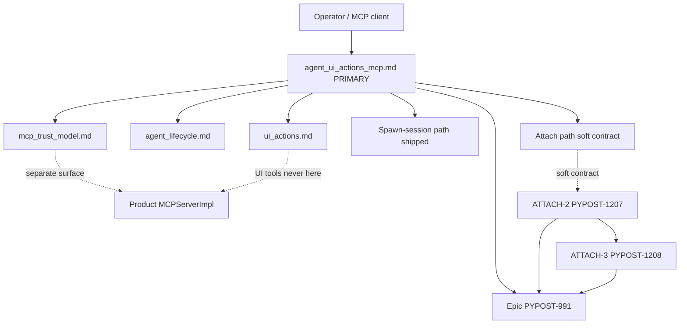

# PYPOST-1206: Document attach path, trust boundary, and lifecycle

Step 2 artifact for PYPOST-1206 (ATTACH-1). Turns approved requirements in
[`10-requirements.md`](10-requirements.md) into a **documentation-surface**
architecture: which `doc/dev` pages own attach vs spawn-session, trust, and
lifecycle outcomes, how they cross-link, and what soft-contract language
ATTACH-2 may later refine.

**Scope note:** This task is **docs-only**. It does **not** design or implement
attach IPC, transport, discovery, or desktop session binding — those belong to
[PYPOST-1207](https://pypost.atlassian.net/browse/PYPOST-1207) (ATTACH-2).
Verification belongs to
[PYPOST-1208](https://pypost.atlassian.net/browse/PYPOST-1208) (ATTACH-3).

## Research

### R-1 Requirements freeze (Step 1)

- **Story:** [PYPOST-1206](https://pypost.atlassian.net/browse/PYPOST-1206) —
  ATTACH-1 under epic [PYPOST-991](https://pypost.atlassian.net/browse/PYPOST-991).
- **Language:** English Markdown for `doc/dev` + Top-Down artifacts; product
  Python is context only (unchanged).
- **DoD:** FR1–FR12 — attach vs spawn narrative; trust vs product MCP and
  local-host posture; lifecycle success / fail / detach / host exit / sidecar
  exit; update spawn-session limitation wording; soft note if capability not
  yet shipped.
- **Non-goals:** Attach implementation, attach tests, PYPOST-990/992/993,
  product MCP catalog / IPC changes, `doc/user/` unless a later step adds a
  pointer.

### R-2 Current `doc/dev` inventory (gaps)

| Surface | Today | ATTACH-1 gap |
| --- | --- | --- |
| [`agent_ui_actions_mcp.md`](../../doc/dev/agent_ui_actions_mcp.md) | Spawn-session entry points; Limitations say attach unsupported + ticket pointers | Primary home for attach-vs-spawn, operator procedure, lifecycle outcomes, revised limitations |
| [`mcp_trust_model.md`](../../doc/dev/mcp_trust_model.md) | Product inbound MCP local-trust; agent-UI called out as separate boundary | Attach-specific operator trust vs product MCP + local-host posture |
| [`agent_lifecycle.md`](../../doc/dev/agent_lifecycle.md) | Sidecar/harness `AgentAppSession` launch → ready → shutdown | Attach bind/unbind and host/sidecar exit outcomes for a live desktop |
| [`ui_actions.md`](../../doc/dev/ui_actions.md) | UI tools off product `MCPServerImpl`; points at sidecar | Keep packaging; cross-link attach stays on agent-UI surface |

Mirror pattern from [PYPOST-1202 `20-architecture.md`](../PYPOST-1202/20-architecture.md):
ATTACH-1 owns `doc/dev/` contract text; capability and tests stay in sibling
stories.

### R-3 Industry / MCP trust alignment

Sources:

- [MCP security best practices — local MCP server compromise](https://modelcontextprotocol.io/docs/2025-11-25/tutorials/security/security_best_practices)
- [MCP community security — stdio trust boundary](https://modelcontextprotocol.io/community/security)
- [MCP Security: Threat Model & Hardening Guide (2026)](https://dev.to/prabhu_kalyansamal_f743d/-mcp-security-threat-model-hardening-guide-2026--3enn)

| Practice | Application to ATTACH-1 docs |
| --- | --- |
| Local MCP inherits client/user privilege | Document attach as same-machine UI drive privilege, not a weaker remote API |
| Stdio peers are mutually trusting; stdio is not a sandbox | Align with existing product MCP “local trust” spirit without merging surfaces |
| Keep tool blast radius separated | Reaffirm UI tools never appear on product `MCPServerImpl` |
| Prefer outcome language over speculative mechanism | Soft contract: success/fail/detach/exits; no IPC design in ATTACH-1 |

### R-4 Sibling ownership (do not absorb)

| Ticket | Owns | This story must not |
| --- | --- | --- |
| PYPOST-1207 (ATTACH-2) | Attach capability | Implement bind / choose IPC |
| PYPOST-1208 (ATTACH-3) | Attach verification | Add attach pytest suite |
| PYPOST-990 / 992 / 993 | HTTP transport, spawn `call_tool` tests, seed injection | Expand into those scopes |

### R-5 Soft-contract outcome vocabulary (product-level)

Stable operator meanings for Step 4/8 prose (mechanism deferred):

| Outcome | Operator-visible meaning |
| --- | --- |
| **Attach success** | Binding established; agent-UI MCP UI tools apply to the already-running desktop |
| **Attach fail** | Not bound; live desktop is not driven via attach; failure is operator-visible at product level |
| **Detach** | Binding ends deliberately; desktop and/or sidecar continue per documented rules (neither path implies forced kill of the other by default wording) |
| **Host exit** | Desktop PyPost ends while sidecar/client may still be present; attach binding ends |
| **Sidecar exit** | Sidecar ends while desktop may still be present; operator’s desktop session is not implied destroyed solely by sidecar exit |

Prefer this vocabulary over protocol diagrams or CLI dumps (NFR-4).

## Implementation Plan

### High-level approach (this task)

1. **Architecture (this step)** — freeze doc-module ownership, cross-links,
   soft-contract outcomes, and Step 3 N/A.
2. **Step 3** — record **N/A** (no behavioral red test); see below.
3. **Step 4 / Step 8** — edit `doc/dev` per the surface plan below; keep
   packaging separation; note runtime attach lands in ATTACH-2 if not shipped
   (FR12) without omitting FR1–FR11 contract content.
4. **Do not** change `pypost/`, attach tests, or product MCP catalog.

### Doc edit sequence (Step 4 / 8 — not this step)

```text
1. agent_ui_actions_mcp.md  — primary: paths, procedure, lifecycle, limitations
2. mcp_trust_model.md       — attach / agent-UI trust vs product MCP + local-host
3. agent_lifecycle.md       — attach bind/unbind + host/sidecar exit cross-links
4. ui_actions.md            — packaging reminder + pointer to attach contract
5. make lint / doc norms    — NFR-5
```

Secondary pages get short sections or linked subsections — not duplicate full
narratives (NFR-1, NFR-2).

### Mandatory — Failing Repro (next Step 3)

**N/A — no behavioral change.**

PYPOST-1206 is **docs-only**: English Markdown in `doc/dev` and Top-Down
artifacts. It does not change product runtime, UI, IPC, MCP catalogs, or
attach capability. There is no red behavioral pytest that can fail today and
pass after a production fix attributable to this story.

| Item | Decision |
| --- | --- |
| Red product test? | **No** — no runtime behavior change |
| Doc/lint-only “red” gate? | **Not required** for Step 3; NFR-5 lint runs when docs land (Step 4/8) via `make` |
| Roadmap Step 3 | Record `N/A — no behavioral change` with this justification |
| Attach capability / attach tests | Owned by PYPOST-1207 / PYPOST-1208 Step 3 cycles |

**Confirm docs-only:** Requirements Programming Language, Scope, Out of scope,
and DoD item 5 all forbid attach implementation and attach test suites in this
story. Step 3 therefore stays N/A.

## Architecture

### Documentation system modules



| Module | Responsibility |
| --- | --- |
| `agent_ui_actions_mcp.md` | Primary operator narrative: spawn vs attach, when to choose each, high-level attach procedure, lifecycle outcomes, updated Limitations, FR12 capability note, epic/sibling links |
| `mcp_trust_model.md` | Trust relative to product request-tool MCP; local-host posture for attach/sidecar without merging blast radii |
| `agent_lifecycle.md` | Extend or cross-link for attach bind/unbind and host/sidecar exit vs existing launch → ready → shutdown |
| `ui_actions.md` | Packaging invariant: attach remains on agent-UI MCP; UI tools stay off `MCPServerImpl` |
| Soft contract (ATTACH-1) | Outcome language ATTACH-2 may refine; does not freeze IPC |
| Sibling stories | Capability (1207) and tests (1208) — out of module scope here |

### Selected patterns

| Pattern | Why |
| --- | --- |
| Primary + satellite docs | One scannable operator home; satellites avoid contradiction (NFR-1/2) |
| Soft contract before capability | Epic acceptance docs first; ATTACH-2 may iterate wording (NFR-4) |
| Trust-surface separation | Matches PYPOST-918/952 packaging and existing trust model |
| Outcome vocabulary | Lifecycle table without speculative transport design |
| Traceability links | Epic + PYPOST-1207/1208 where useful (NFR-3) |

### Module interaction / interfaces (doc contracts)

| From → To | Interface content |
| --- | --- |
| Primary → Trust | “Separate surface from product MCP; local-host privilege implications” |
| Primary → Lifecycle | “Attach success/fail/detach/host exit/sidecar exit” |
| Primary → Packaging | “UI tools only on agent-UI MCP; compose two servers if needed” |
| Trust → Primary | Pointer for attach operator detail |
| Lifecycle → Primary | Pointer for attach path vs spawn-owned session |
| Packaging → Primary | Sidecar / attach packaging path |

No new Python APIs. No product MCP HTTP catalog changes.

### Primary page section plan (`agent_ui_actions_mcp.md`)

Proposed structure for Step 4/8 (names may adjust slightly for lint/flow):

1. **Overview** — keep; clarify two valid session paths (spawn-session + attach).
2. **Spawn-session path** — existing runnable entry / offscreen ownership (FR1).
3. **Attach path** — bind to already-running desktop; when to choose attach (FR2–FR3); high-level operator procedure; FR12 note if capability not shipped.
4. **Trust boundary** — short summary + link to `mcp_trust_model.md` (FR4–FR5).
5. **Attach lifecycle** — table for success / fail / detach / host exit / sidecar exit (FR6–FR10).
6. **Limitations** — replace “attach unsupported + tickets only” with ATTACH-1 contract + sibling capability/tests pointers (FR11).
7. **Related / Tests** — keep packaging CI note; do not claim ATTACH-3 coverage here.

### Satellite edit plan

| File | Planned change |
| --- | --- |
| `mcp_trust_model.md` | Expand agent-UI note: attach drives live desktop; local trust / same-machine privilege; still not product request tools |
| `agent_lifecycle.md` | Short attach subsection or Related row: bind/unbind outcomes; contrast with sidecar-owned `AgentAppSession` |
| `ui_actions.md` | One packaging sentence + link: attach stays on agent-UI MCP path |

### Explicit non-architecture (deferred)

- IPC mechanism, discovery, auth, process identity for attach
- Whether desktop listens vs sidecar-initiated join
- CLI flags or wire formats for attach
- Product HTTP MCP catalog changes
- Attach pytest layout (ATTACH-3)

## Q&A

| Question | Answer |
| --- | --- |
| Implement attach in this story? | No — PYPOST-1207. |
| Add attach tests here? | No — PYPOST-1208. |
| Step 3 red test? | **N/A — no behavioral change** (docs-only). |
| Replace spawn-session? | No — both paths remain valid. |
| Put UI tools on product MCP for attach? | No — packaging separation mandatory. |
| Design IPC here? | No — outcome language only. |
| Primary doc surface? | `doc/dev/agent_ui_actions_mcp.md`. |
| Who marks Step 2 `[x]`? | Orchestrator / acceptance gate after review PASS. |
