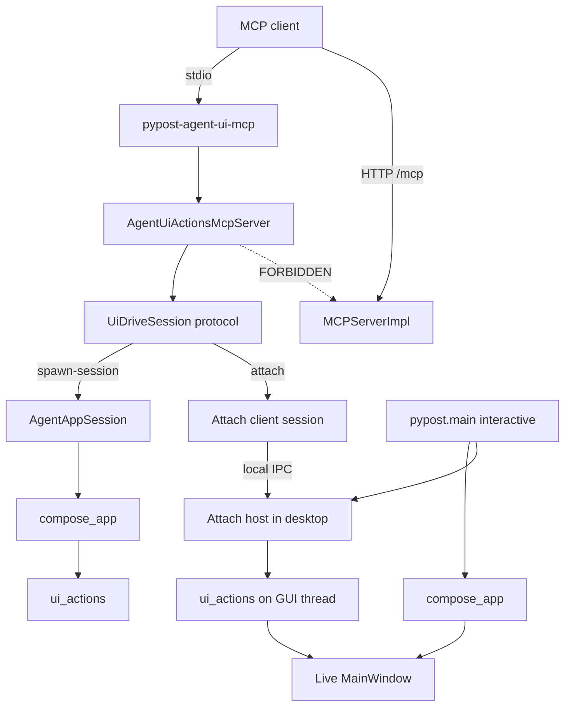

# PYPOST-1207: Attach agent-UI MCP to already-running desktop PyPost

## Research

### R-1 Soft contract and epic facts

- **[PYPOST-1207](https://pypost.atlassian.net/browse/PYPOST-1207)** —
  ATTACH-2 / SP 5; parent epic
  [PYPOST-991](https://pypost.atlassian.net/browse/PYPOST-991).
- Soft contract (Done): `doc/dev/agent_ui_actions_mcp.md` — attach vs
  spawn-session, trust, lifecycle outcomes; capability note points here.
- Satellites: `doc/dev/agent_lifecycle.md`, `doc/dev/mcp_trust_model.md`,
  `doc/dev/ui_actions.md` (UI tools off `MCPServerImpl`).
- Sibling tests suite: PYPOST-1208 (ATTACH-3). This story owns capability
  plus a Step 3 red proof; full CI/manual matrix is out of scope.

### R-2 Current product surfaces (code inventory)

| Surface | Today | Attach gap |
| --- | --- | --- |
| `ui_actions_mcp.py` | Stdio MCP; always spawns session | No attach mode/CLI |
| `AgentUiActionsMcpServer` | Dispatches `ui_*` on a session | Spawn-typed only |
| `AgentAppSession` | Launch → ready → shutdown | Owns a **new** app |
| `pypost/main.py` | `compose_app` + `app.exec()` | No attach host |
| `MCPServerImpl` | Product HTTP request tools | Must stay UI-free |
| Tests | `test_agent_ui_actions_mcp.py` | No attach coverage |

Detail: sidecar calls `AgentAppSession.start()` then serves MCP.
`AgentAppSession` uses `compose_app` and cannot bind a live desktop.
PYPOST-952 tech debt already named this: attach needs IPC to an existing
`QApplication` ([PYPOST-991](https://pypost.atlassian.net/browse/PYPOST-991)).

### R-3 Why stdio alone cannot “attach”

MCP stdio transport: the **client spawns** the server and owns its stdin/
stdout
([MCP architecture](https://modelcontextprotocol.io/docs/2026-07-28/learn/architecture)).
An already-running desktop cannot become that stdio child after the fact.
Therefore attach = **stdio sidecar still spawned by the client**, plus a
**side-channel** into the live desktop’s Qt thread.

### R-4 Industry patterns (attach / proxy)

| Pattern | Fit for PyPost |
| --- | --- |
| Qt proxy + in-app agent (UDS / pipe) | **Best fit** — cooperative, small |
| Process injection (qtPilot, etc.) | Reject — heavy; not ≤100 LOC iterative |
| OS AT-SPI / desktop portals | Reject — not widget-id catalog |
| Embed MCP stdio inside desktop | Reject — fights `app.exec()` + spawn |

Reference cooperative proxy:
[qt-mcp](https://github.com/cristopulos/QT_mcp_server).

### R-5 Packaging / import constraints

- UI tools must never mount on product `MCPServerImpl` (FR10 / NFR-4).
- `doc/dev/ui_actions.md`: **Production UI** (widgets/presenters) must not
  import `pypost.agent`. Attach host may live under `pypost.agent.*` and be
  started from the **composition root** (`main.py`) via a thin call — not
  from `MainWindow` / presenters.
- Prefer iterative ≤100 LOC product changes across Step 4 iterations.

### R-6 Qt threading reminder (from PYPOST-952)

`ui_*` must run on the **QApplication thread**. Spawn path: MCP stdio runs
on that thread after session start. Attach path: host executes actions on
the desktop GUI thread; sidecar is a remote client (no local Qt app when
attached).

## Implementation Plan

### High-level approach

1. Introduce a small **UiDriveSession** protocol (duck-typed): the four
   `ui_*` methods already on `AgentAppSession`.
2. Add an **attach host** in the desktop process (agent package) that listens
   on a **local-only** IPC endpoint and runs `ui_*` against the live
   `MainWindow` on the GUI thread.
3. Add an **attach client session** used by the sidecar when attach mode is
   selected; `AgentUiActionsMcpServer` keeps the same tool catalog and
   dispatches through the protocol.
4. Extend sidecar CLI to choose **spawn-session** (default, current behavior)
   vs **attach** (bind to host). Preserve spawn-session flags.
5. Map ATTACH-1 lifecycle: success / fail / detach / host exit / sidecar
   exit on the IPC binding (no forced kill of the peer by default).
6. Refine docs capability note when attach ships (FR11); full verification
   suite remains PYPOST-1208.

### Selected mechanism (decision)

**Cooperative local IPC: desktop attach host + attach-mode sidecar.**

| Choice | Decision |
| --- | --- |
| MCP transport | Stdio agent-UI sidecar (not product MCP) |
| Bind channel | Local IPC only (`QLocalServer`/`QLocalSocket` or AF_UNIX) |
| Discovery | Well-known per-user endpoint; optional override in Step 4 |
| Host enablement | Interactive `main()` starts host after show |
| Session abstraction | Duck-typed `ui_*` protocol; DI into MCP bridge |
| Detach | Close IPC peer; neither process exits by default |
| Rejected | Injection; product MCP tools; replacing spawn-session |

Daemon and spawn-session paths stay unchanged. Wire format stays minimal
(JSON request/response for the four actions + handshake / detach). Exact
schema is a Step 4 detail; product-visible outcomes must match ATTACH-1.

### Iteration sketch (Step 4, ≤100 LOC when possible)

1. Session protocol + sidecar `--attach` wiring + attach-fail without host.
2. Desktop attach host + client session; one `ui_*` round-trip green.
3. Lifecycle: detach, host-exit, sidecar-exit signals/cleanup.
4. Doc capability note + spawn-session regression check.

### Mandatory — Failing Repro (next Step 3)

**Not N/A** — runtime attach is missing; a red automated test is feasible
without a human desktop or external MCP host.

| Item | Plan |
| --- | --- |
| Primary file | `tests/test_agent_ui_attach.py` (new) |
| Timeout | Module `pytestmark = pytest.mark.timeout(...)` |
| Assert (1) | CLI accepts attach mode (e.g. `--attach`) |
| Assert (2) | Attach mode does **not** call `AgentAppSession.start()` |
| Assert (3) | No host → attach fail (unbound), not silent spawn |
| Force red today | No `--attach`; only spawn path exists |
| Avoid live deps | Argv + monkeypatch; no Cursor/Claude client |
| Out of Step 3 | Full matrix / CI gaps → PYPOST-1208 |
| Sequencing | Red tests → implement until green → lifecycle |

Optional companion (Step 3 if cheap): import/API presence for an
attach-session or host helper — fails until Step 4 creates it.

Do **not** implement production attach code in Step 3.

## Architecture

### System module diagram



### Module responsibilities

| Module | Responsibility |
| --- | --- |
| `ui_actions_mcp.py` | Stdio entry; spawn vs attach; bridge over protocol |
| `AgentUiActionsMcpServer` | Same `ui_*` catalog; session-protocol dispatch |
| `lifecycle.py` | Spawn-session ownership unchanged |
| New attach host (`pypost/agent/`) | Local IPC; `ui_*` on live window |
| New attach client session | Connect/bind; `ui_*` over IPC; attach fail |
| `pypost/main.py` | Start/stop host around `app.exec()` |
| `ui_actions.py` | Shared primitives (both paths) |
| `mcp_server_impl.py` | Unchanged; no UI tools |
| `test_agent_ui_attach.py` | Red → green attach proofs |
| `test_agent_ui_actions_mcp.py` | Keep spawn / packaging gates |
| `agent_ui_actions_mcp.md` | Capability note + bind options when shipped |

### Interaction scheme

```text
Spawn-session (default, shipped):
  Client --stdio--> Sidecar --owns--> AgentAppSession --ui_*--> widgets

Attach (this story):
  Desktop main --starts--> AttachHost --serves--> local IPC
  Client --stdio--> Sidecar(attach) --IPC--> AttachHost --ui_*--> live UI

Detach / exits:
  Detach     → close binding; both processes may continue
  Host exit  → IPC gone; sidecar unbound (may remain)
  Sidecar exit → client gone; desktop continues
```

### Patterns and justification

| Pattern | Why |
| --- | --- |
| Sidecar + cooperative host | MCP stdio spawn model + Qt GUI-thread `ui_*` |
| Protocol / duck typing | Catalog parity; DI for tests |
| Composition-root host start | UI must not import agent; `main` may |
| Local-only IPC | ATTACH-1 local-host trust; not remote API |
| Preserve spawn default | NFR-2 / FR5–FR6 continuity |

### Main interfaces

| Interface | Shape (conceptual) |
| --- | --- |
| `UiDriveSession` | `ui_click` / `ui_fill` / `ui_select` / `ui_send_key` |
| Sidecar CLI | Spawn flags + attach selector (e.g. `--attach`) |
| Attach host API | `start(window)` / `stop()`; GUI-thread dispatch |
| Attach client API | `connect()` → success/fail; `detach()`; `ui_*` |
| MCP tools | Same four `ui_*`; JSON `ok` / `error` bodies |
| Product MCP | No new tools; exclusion tests stay authoritative |

### Explicit non-goals (architecture)

- Streamable HTTP for agent-UI MCP (PYPOST-990).
- Full attach verification suite (PYPOST-1208).
- Seed injection for spawn-session (PYPOST-993).
- Mounting UI tools on `MCPServerImpl`.
- Process injection / AT-SPI desktop drive.

## Q&A

| Question | Answer |
| --- | --- |
| Attach MCP stdio to desktop? | No — clients spawn servers; desktop runs `exec`. |
| Why a host inside desktop? | Live Qt thread + widget tree; inject out of scope. |
| Replace spawn-session? | No — default remains spawn. |
| May MainWindow import agent? | No — host starts from `main.py`. |
| Step 3 N/A? | No — red CLI/bind-fail test is feasible. |
| Who owns fuller tests? | PYPOST-1208; this story’s red/green is capability. |
| Docs? | Refine ATTACH-1 capability note when attach ships. |
