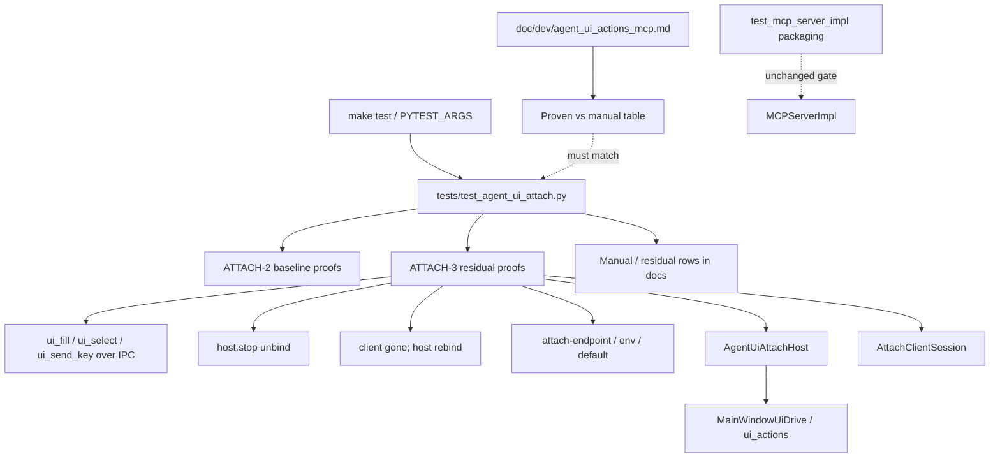

# PYPOST-1208: Verify attach path with tests as feasible

Step 2 artifact for PYPOST-1208 (ATTACH-3). Turns approved requirements in
[`10-requirements.md`](10-requirements.md) into a **verification-surface**
architecture: expand automated attach proofs under project make/test norms,
document non-automatable gaps with manual checks, and align developer docs
with what tests prove.

**Scope note:** This task is **verification + doc agreement**. It does **not**
re-implement attach ([PYPOST-1207](https://pypost.atlassian.net/browse/PYPOST-1207)
Done). Production `attach_ipc` / sidecar wiring stay as shipped unless a true
regression is found; then fix minimally — no capability rewrite.

## Research

### R-1 Requirements freeze (Step 1)

- **Story:** [PYPOST-1208](https://pypost.atlassian.net/browse/PYPOST-1208) —
  ATTACH-3 under epic [PYPOST-991](https://pypost.atlassian.net/browse/PYPOST-991).
- **Language:** Python (tests under `make test`); English Markdown for artifacts
  and doc alignment.
- **DoD:** FR1–FR13 / NFR-1–NFR-6 — largest feasible automated attach subset;
  manual checks for the rest; docs and tests agree; baseline ATTACH-2 proofs
  stay green.
- **Non-goals:** Attach rewrite; primary trust/lifecycle rewrite; PYPOST-990 /
  992 / 993; mounting UI tools on product MCP.

### R-2 Capability already shipped (ATTACH-2)

From [`PYPOST-1207/20-architecture.md`](../PYPOST-1207/20-architecture.md) and
code inventory:

| Surface | Role (unchanged by this story) |
| --- | --- |
| `pypost/agent/attach_ipc.py` | AF_UNIX host + `AttachClientSession`; NDJSON; four `ui_*` |
| `pypost/agent/ui_actions_mcp.py` | `--attach` / `--attach-endpoint`; no silent spawn |
| `pypost/main.py` | Composition-root host start/stop |
| `MCPServerImpl` | UI tools forbidden (packaging gates elsewhere) |

Baseline automated proofs in `tests/test_agent_ui_attach.py` (module
`pytestmark` timeout 30): CLI `--attach`, no `AgentAppSession.start` on
attach, unbound fail, host+client `ui_click`, detach/rebind.

### R-3 Residual matrix (owned here)

From [`PYPOST-1207/60-tech-debt.md`](../PYPOST-1207/60-tech-debt.md)
Missing Tests:

| Residual scenario | Feasibility under `make test` | Plan |
| --- | --- | --- |
| Attach `ui_fill` / `ui_select` / `ui_send_key` | **Automate** — same host+client + fixture widgets as click; primitives already on `AttachClientSession` | Expand `test_agent_ui_attach.py` |
| Host exit → sidecar unbound | **Automate** — call `AgentUiAttachHost.stop()` (product host-exit mechanism); assert client cannot drive / bind again. Do **not** call `QApplication.exit()` ([pytest-qt exit guidance](https://pytest-qt.readthedocs.io/en/stable/qapplication.html)) | Host-stop unbind proof |
| Sidecar exit → host still listening | **Automate** — client close / detach-in-finally path; assert host accepts a new client (extends detach/rebind; cover abrupt socket close if distinct from `detach` op) | Sidecar-exit / peer-gone proof |
| Endpoint override (`--attach-endpoint` / env / default) | **Automate** — argv + `default_attach_endpoint()` / env monkeypatch; no live MCP client | Endpoint matrix |
| Protocol-version reject on mismatch | **Manual / known gap** — handshake version is **advisory** today (PYPOST-1218). FR8: document; do **not** invent reject in this story | Manual check + pointer to 1218 |
| Concurrent clients / stale-socket races | **Largest subset automate**; full race stress **manual** — e.g. stale path unlink on `host.start()` feasible; interleaved multi-client `ui_*` flaky under fast suite → manual | Split auto vs manual |
| Explicit manual / CI gap documentation | **Docs** (Step 4/8) — proven vs manual table in `doc/dev/agent_ui_actions_mcp.md` | FR12 / FR13 |

### R-4 Testing norms (project + agent)

- Run via `make test` / `PYTEST_ARGS` (see `doc/dev/agent_ui_actions_mcp.md`
  Tests section). No parallel unverified runner as sole proof (NFR-1).
- [do-testing](../../../.agents/skills/do-testing/SKILL.md): every test has
  explicit `pytest.mark.timeout` (module mark preferred); GUI loops use
  bounded waits (`_pump_until` pattern already in attach tests); no
  `method="thread"` timeout on GUI event-loop tests.
- Prefer extending `tests/test_agent_ui_attach.py` over a new suite file
  unless size/clarity demands a sibling module.
- Reuse fixture-widget patterns from `tests/test_ui_actions.py` (line edit,
  combo, key send) behind attach host+client, not in-process `ui_*` alone
  (must exercise IPC).

### R-5 Docs gap (agreement)

`doc/dev/agent_ui_actions_mcp.md` still points broader matrix at PYPOST-1208
and lists ATTACH-2 baseline commands only. Missing: explicit **automated vs
manual** coverage table matching the suite. Step 4/8 align that section with
FR12/FR13; do not rewrite ATTACH-1 trust/lifecycle narratives.

### R-6 Industry / Qt test caution (host exit)

Calling `QApplication.exit()` / `quit()` in-process tears down the shared
pytest-qt event loop and breaks later tests. Product “host exit” in CI is
therefore modeled as **`AgentUiAttachHost.stop()`** (documented mechanism in
attach lifecycle table), which unlinks the socket and closes peers — matching
ATTACH-1 “desktop ends → binding ends” without destroying `qapp`.

## Implementation Plan

### High-level approach

1. **Keep** ATTACH-2 baseline proofs green; treat them as part of the
   verification surface.
2. **Expand** automated attach proofs for the feasible residual rows (catalog
   beyond click, host-stop unbind, sidecar-gone host listens, endpoint
   override; optional stale-unlink).
3. **Document** non-automatable / accepted residual rows as manual checks
   (protocol-version reject → PYPOST-1218; concurrent interleaving stress).
4. **Align** `doc/dev/agent_ui_actions_mcp.md` (and thin cross-links if needed)
   so proven vs manual matches tests.
5. **Do not** re-implement attach, change packaging, or enforce protocol
   version reject here.

### Module / artifact ownership

| Module | Change in this story |
| --- | --- |
| `tests/test_agent_ui_attach.py` | Primary: residual automated proofs + keep baseline |
| `tests/test_agent_ui_actions_mcp.py` / packaging tests | Regression only; no rewrite |
| `doc/dev/agent_ui_actions_mcp.md` | Proven vs manual matrix; update Tests section |
| `pypost/agent/attach_ipc.py` etc. | **No rewrite**; minimal bugfix only if a new proof exposes a real defect |
| Top-Down `ai-tasks/PYPOST-1208/*` | Steps 3–8 artifacts |

### Mandatory — Failing Repro (next Step 3)

**Not N/A** — acceptance requires automated proofs of residual attach scenarios
under make/test norms. Production attach already exists, so Step 3 must still
land **red** tests that encode missing verification before Step 4 fleshes them
out (td-25: no production fix in Step 3; no `xfail` / `skip` to hide red).

| Item | Plan |
| --- | --- |
| Primary file | `tests/test_agent_ui_attach.py` (same module; keep `pytestmark = pytest.mark.timeout(30)` or raise tier only if needed) |
| Force red today | Add Step-3 **sentinel** tests that `pytest.fail("PYPOST-1208: … not yet verified")` for each residual row that must become an automated proof (catalog fill/select/send_key; host-stop unbind; sidecar-exit host listens; endpoint override). Failure reason = missing verification, not ImportError / fixture crash |
| Desired assert (Step 4 replaces sentinels) | See Architecture “Interfaces / proof contracts” below |
| Avoid live deps | Host+client + `tmp_path` socket + `qapp` + fixture widgets; monkeypatch for CLI/env; no Cursor/Claude MCP host; no `QApplication.exit()` |
| Out of Step 3 | Real IPC assertions bodies; doc proven/manual table; protocol-version reject enforcement |
| Sequencing | Research → red sentinels (Step 3) → replace with green proofs + manual docs (Step 4) → doc polish (Step 8) |

If a Step-3 author instead writes a full behavioral body and it goes
**green-on-arrival** (ATTACH-2 already satisfies), that still proves the row —
but the preferred Step-3 gate is **intentional red sentinels** so the runner
can confirm fail-before-fix without relying on green-on-arrival.

Do **not** implement production attach changes in Step 3.

## Architecture

### System module diagram (verification focus)



### Module responsibilities

| Module | Responsibility in ATTACH-3 |
| --- | --- |
| `test_agent_ui_attach.py` | Own attach verification matrix automation |
| Shared helpers (inline or small private helpers in test file) | Fixture tree (button / line edit / combo); `_pump_until` reuse |
| `attach_ipc.py` / sidecar | Subject under test only |
| `agent_ui_actions_mcp.md` | State automated vs manual; keep lifecycle meanings |
| Packaging / spawn suites | Continuity gates (FR10 / FR11); not rewritten here |

### Interaction scheme (proof flows)

```text
Catalog over attach (automated):
  qapp + fixture widgets → Host.start(endpoint=tmp)
  → worker thread: Client.connect → ui_fill|select|send_key → detach
  → pump GUI → assert widget state

Host exit (automated approximation):
  Client.connect → Host.stop() → next ui_* or reconnect raises unbound /
  ConnectionError; socket path gone; optional second Host can bind same path

Sidecar exit (automated):
  Client.connect then detach or abrupt close → new Client.connect succeeds
  (host still listening)

Endpoint (automated):
  default_attach_endpoint() honors env; CLI --help / --attach-endpoint wiring
  as feasible without full stdio MCP serve

Manual residual:
  Protocol version mismatch reject (advisory today; PYPOST-1218)
  Concurrent interleaved ui_* stress / multi-desktop stale steal
```

### Patterns and justification

| Pattern | Why |
| --- | --- |
| Extend existing attach suite | Continuity with ATTACH-2; one PYTEST_ARGS target |
| Host+client IPC proofs (not in-process only) | Must exercise attach wire, not just `ui_actions` |
| Sentinel red → real green | Verification story: missing *proofs*, not missing *capability* |
| `host.stop()` for host-exit | Product teardown path; avoids pytest-qt `QApplication.exit` damage |
| Feasibility honesty | Automate largest subset; manual for advisory version + race stress |
| Docs/tests agreement table | FR12 / NFR-3; closes epic “tests as feasible” |

### Main interfaces / proof contracts

| Proof | Assert (desired) |
| --- | --- |
| `ui_fill` over attach | Host+client fill sets fixture `QLineEdit` text |
| `ui_select` over attach | Host+client selects fixture combo option |
| `ui_send_key` over attach | Host+client key changes fixture text (e.g. backspace) |
| Host exit | After `host.stop()`, client cannot complete `ui_*`; endpoint unbound for new connect (or equivalent clear unbound signal) |
| Sidecar exit | After client detach/close, host accepts a new `connect()` |
| Endpoint override | `--attach-endpoint` documented/accepted; env override affects `default_attach_endpoint()` |
| Packaging / spawn | Existing suites remain green (no new product MCP UI tools) |
| Docs | Proven list ↔ test names; manual checks have steps + expected outcome |

### Explicit non-goals (architecture)

- Re-implement or redesign attach IPC / handshake reject (PYPOST-1218 owns
  enforce-version).
- Streamable HTTP agent-UI MCP (PYPOST-990).
- Spawn-session `call_tool` expansion (PYPOST-992).
- Seed injection (PYPOST-993).
- Full interactive multi-process desktop e2e outside make/test norms as the
  only proof.

## Q&A

| Question | Answer |
| --- | --- |
| Is Step 3 N/A? | **No** — red sentinel tests for residual matrix; Step 4 replaces with real proofs + manual docs. |
| Why sentinels if attach already works? | Capability exists; **verification** is missing. Sentinels keep td-25 red-before-green without inventing a product defect. |
| May Step 4 change `attach_ipc.py`? | Only for a real defect exposed by proofs; no rewrite / no version-reject invention. |
| Host exit without killing Qt? | Yes — `AgentUiAttachHost.stop()` is the documented host-exit mechanism for tests. |
| Protocol version mismatch? | Manual / known gap until PYPOST-1218; document check, do not force reject here. |
| Where do docs change? | Primarily `doc/dev/agent_ui_actions_mcp.md` proven vs manual + Tests section. |
| Replace spawn-session proofs? | No — keep both paths; spawn/packaging gates stay. |
