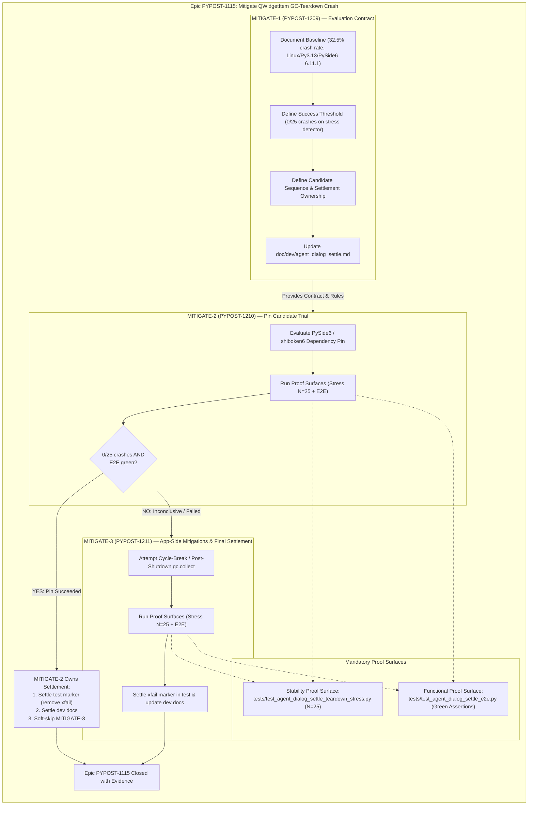
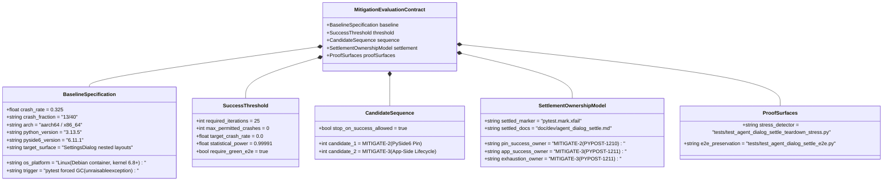
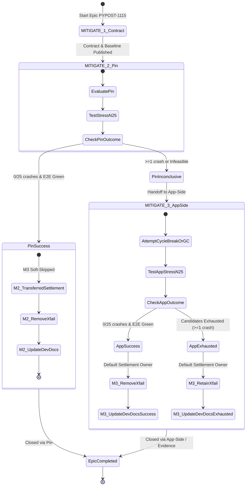

# PYPOST-1209: Document mitigation evaluation contract and baseline

Step 2 artifact for [PYPOST-1209](https://pypost.atlassian.net/browse/PYPOST-1209) (MITIGATE-1 under epic [PYPOST-1115](https://pypost.atlassian.net/browse/PYPOST-1115)). Turns approved requirements in [`10-requirements.md`](10-requirements.md) into a comprehensive **Mitigation Evaluation Contract Architecture**: defining baseline empirical facts, quantitative success criteria, candidate sequence, stop-on-success protocols, deterministic settlement ownership rules, and documentation integration.

## Research

### R-1: Diagnosed Baseline Facts and Environment Boundary

The intermittent post-PASS process crash was investigated in [PYPOST-1040](https://pypost.atlassian.net/browse/PYPOST-1040) ([`ai-tasks/PYPOST-1040/20-architecture.md`](../PYPOST-1040/20-architecture.md)) and confirmed as an upstream PySide6/shiboken6 `QWidgetItem` lifecycle defect.

| Dimension | Baseline Parameter / Empirical Finding |
| --- | --- |
| **Crash Rate** | **32.5%** (13 crashes across 40 fresh, independent single-shot runs of `tests/test_agent_dialog_settle_e2e.py`: 11× SIGSEGV/139, 2× SIGBUS/135) |
| **Reference OS** | Linux (Debian 13 "trixie" container, kernel 6.8.0-1008-azure / Linux 6.8+) |
| **CPU Architecture** | ARM64 (`aarch64`) in sandbox; x86_64 in standard CI matrix runners |
| **Python Version** | Python 3.13.5 (standard CI matrix version) |
| **PySide6 / shiboken6** | `6.11.1` (exact pin in `pyproject.toml`) |
| **QPA Platform** | `QT_QPA_PLATFORM=offscreen` |
| **Proximate Trigger** | Pytest `unraisableexception` plugin executing `gc_collect_harder()` (5 rounds of cyclic `gc.collect()` at pytest session end) |
| **Trigger Surface** | `SettingsDialog`'s nested `QVBoxLayout`/`QFormLayout`/seven-section widget subtree (no crash observed when `AgentAppSession` is run without opening SettingsDialog) |
| **PyPost Code Health** | Zero raw `QLayoutItem`/`QWidgetItem` references held in `pypost/`; `AgentAppSession.shutdown()` completes synchronously and logs `agent_session_shutdown_completed` prior to the fatal signal |

### R-2: Quantitative Success Threshold and Statistical Power Analysis

A mitigation candidate must be evaluated against the existing teardown stress detector: [`tests/test_agent_dialog_settle_teardown_stress.py`](file:///home/src/tests/test_agent_dialog_settle_teardown_stress.py) (`STRESS_ITERATIONS = 25`).

1. **Statistical Power Formulation**:
   - Baseline crash probability per independent run: $p_{\text{baseline}} = 0.325$.
   - Probability of detecting at least one crash in $N=25$ independent child processes if the underlying defect remains unmitigated:
     $$P(\text{crash} \ge 1 \mid N=25, p=0.325) = 1 - (1 - 0.325)^{25} = 1 - (0.675)^{25} \approx 1 - 0.0000914 \approx 99.991\%$$
   - This provides >99.99% detection confidence. If a candidate runs 25 child processes with 0 crashes, the hypothesis that the defect remains at baseline rate is rejected with $p < 0.0001$.

2. **Success Threshold Standards**:
   - **Full Mitigation Success (Epic Success)**: Exactly **0 crashes out of 25 runs** (`0/25`, 0.0% crash rate) on the stress detector, with **zero test regressions or broken assertions** on `tests/test_agent_dialog_settle_e2e.py`.
   - **Partial / Inconclusive Improvement**: Any outcome with $\ge 1$ crash in 25 runs (e.g. 1/25 or 2/25). While this may indicate a reduced frequency, it does not achieve complete process stability and does not qualify for stop-on-success soft-skipping of subsequent candidates.
   - **Failed / No Improvement**: $\ge 3$ crashes out of 25 runs (statistically indistinguishable from or approaching baseline).

### R-3: Candidate Sequence and Stop-on-Success Protocol

Per epic decomposition [PYPOST-1203](https://pypost.atlassian.net/browse/PYPOST-1203) ([`ai-tasks/PYPOST-1203/20-architecture.md`](../PYPOST-1203/20-architecture.md)), mitigation candidates must be evaluated in a strictly defined order:

```text
Candidate 1: Dependency Pin Evaluation (MITIGATE-2 / PYPOST-1210)
  │
  ├─> If Full Success (0/25 crashes + green e2e):
  │     └─> Satisfies Epic PYPOST-1115
  │     └─> Soft-skip Candidate 2 (MITIGATE-3) with recorded empirical evidence
  │     └─> MITIGATE-2 executes test marker (xfail) & dev doc settlement
  │
  └─> If Inconclusive / Partial / Failed:
        └─> Proceed to Candidate 2 (MITIGATE-3 / PYPOST-1211)
              │
              ├─> Attempt App-Side Mitigations (cycle breaking, post-shutdown gc.collect)
              └─> MITIGATE-3 executes test marker (xfail) & dev doc settlement
```

- **Candidate 1 (MITIGATE-2 / PYPOST-1210)**: PySide6/shiboken6 pin update (e.g. evaluating newer patch/minor releases or checking if upstream fixed the `QWidgetItem` lifecycle bug). Least invasive; addresses the upstream root cause directly.
- **Candidate 2 (MITIGATE-3 / PYPOST-1211)**: Application-side lifecycle mitigations:
  - *Option A*: Break reference cycles in `SettingsDialog` / composite sections so widgets are reclaimed via prompt refcounting rather than deferred cyclic GC.
  - *Option B*: Introduce deliberate, controlled `gc.collect()` in `AgentAppSession.shutdown()` while Qt state is well-defined.
- **Stop-on-Success Rule**: If Candidate 1 meets the Full Success threshold, Candidate 2 is soft-skipped to avoid unnecessary codebase complexity and redundant application-side workarounds.

### R-4: Deterministic Settlement Ownership Model (Orphan Prevention)

A critical requirement from PYPOST-1203 and NFR-3 is preventing orphaned test markers (`pytest.mark.xfail`) and developer documentation across branching paths.

| Execution Path | Condition | Settlement Owner | Required Settlement Actions |
| --- | --- | --- | --- |
| **Path A: Pin Success (M3 Soft-Skipped)** | MITIGATE-2 achieves 0/25 crashes + green e2e | **MITIGATE-2 ([PYPOST-1210](https://pypost.atlassian.net/browse/PYPOST-1210))** | 1. Settle detector marker: remove `xfail` from `tests/test_agent_dialog_settle_teardown_stress.py` or update to expected pass.<br>2. Update `doc/dev/agent_dialog_settle.md` with pin resolution facts.<br>3. Record evidence justifying MITIGATE-3 soft-skip. |
| **Path B: App-Side Success** | MITIGATE-2 fails/inconclusive; MITIGATE-3 achieves 0/25 crashes | **MITIGATE-3 ([PYPOST-1211](https://pypost.atlassian.net/browse/PYPOST-1211))** | 1. Settle detector marker: remove `xfail` from `tests/test_agent_dialog_settle_teardown_stress.py`.<br>2. Update `doc/dev/agent_dialog_settle.md` with app-side mitigation details.<br>3. Close epic PYPOST-1115 with green stress detector. |
| **Path C: Exhaustion / Permanent Upstream** | Both MITIGATE-2 and MITIGATE-3 fail to reach 0/25 crashes | **MITIGATE-3 ([PYPOST-1211](https://pypost.atlassian.net/browse/PYPOST-1211))** | 1. Retain `pytest.mark.xfail(strict=False)` with documented mitigation attempt history.<br>2. Update `doc/dev/agent_dialog_settle.md` with findings and ongoing tracking.<br>3. Record residual technical debt under PYPOST-1115. |

**Settlement Invariant**: Exactly one child story owns settlement on any given execution path. Settlement is never left unassigned or unexecuted.

### R-5: Proof Surfaces Specification

Two distinct proof surfaces are established as mandatory validation gates for all mitigation attempts:

1. **Stability / Crash Detection Proof Surface**:
   - File: [`tests/test_agent_dialog_settle_teardown_stress.py`](file:///home/src/tests/test_agent_dialog_settle_teardown_stress.py)
   - Configuration: `STRESS_ITERATIONS = 25`, `CHILD_TIMEOUT_S = 30.0`, `pytest.mark.timeout(150)`, `pytest.mark.slow`.
   - Execution command: `pytest tests/test_agent_dialog_settle_teardown_stress.py -m slow -v` or `make test-slow`.
   - Metric: Count of child process crash signals (SIGSEGV=-11/139, SIGBUS=-7/135) or non-zero exits out of 25. Target = 0.

2. **Functional Integrity Proof Surface**:
   - File: [`tests/test_agent_dialog_settle_e2e.py`](file:///home/src/tests/test_agent_dialog_settle_e2e.py)
   - Coverage:
     - `test_agent_dialog_settle_after_settings_open`: Happy-path modal settle and dismiss via `run_product_dialog_settle`.
     - `test_agent_dialog_settle_timeout_includes_step_and_modal_diag`: Diagnostic rewrapping and DEBUG logging contract (`pypost.agent.ui_wait`, `condition=forced_dialog_settle_timeout`).
   - Execution command: `make test-agent-e2e PYTEST_ARGS="tests/test_agent_dialog_settle_e2e.py -v"`.
   - Metric: All tests pass with zero assertion regressions.

### R-6: Developer Documentation Architecture

The existing developer guide [`doc/dev/agent_dialog_settle.md`](file:///home/src/doc/dev/agent_dialog_settle.md) currently documents the dialog settle architecture, timeout companion, and PYPOST-1040 diagnostic findings. 

Under PYPOST-1209 (MITIGATE-1), this document will be updated to include a dedicated **Mitigation Evaluation Contract (PYPOST-1115 / PYPOST-1209)** section establishing:
- Diagnosed baseline parameters (32.5% crash rate, Linux/Python 3.13/PySide6 6.11.1 offscreen).
- Formal success criteria (0/25 on stress detector + green e2e assertions).
- Candidate evaluation hierarchy and stop-on-success rules.
- Settlement ownership matrix (MITIGATE-2 for pin success, MITIGATE-3 default).
- Direct references to the dual proof surfaces.

---

## Implementation Plan

### High-Level Approach

This task (PYPOST-1209 / MITIGATE-1) is a contract and documentation task that establishes the formal framework for the mitigation epic without altering production or test execution logic.

1. **Step 2 (Architecture - this artifact)**: Formalize the evaluation contract, baseline facts, success threshold, candidate sequence, settlement ownership model, and documentation updates.
2. **Step 3 (Failing Repro)**: Explicitly record `N/A — no behavioral change` (see below).
3. **Step 4 (Development)**: Update [`doc/dev/agent_dialog_settle.md`](file:///home/src/doc/dev/agent_dialog_settle.md) to add the formal Mitigation Evaluation Contract section.
4. **Step 5 (Code Cleanup)**: Verify Markdown formatting, cross-references, and ensure repo linters pass (`make lint`).
5. **Step 6 (Observability)**: Review documentation discoverability and logging clarity across proof surfaces.
6. **Step 7 (Technical Debt)**: Document technical debt disposition and confirm handoff readiness for MITIGATE-2 and MITIGATE-3.
7. **Step 8 (Dev Docs)**: Ensure final dev doc sync and verify artifact integrity (`make verify-ai-tasks`).

### Mandatory — Failing Repro (next Step 3)

**`N/A — no behavioral change.`**

**Rationale:**
- PYPOST-1209 does not introduce, modify, or delete any application code (`pypost/`) or test execution logic (`tests/`).
- The automated stress detector ([`tests/test_agent_dialog_settle_teardown_stress.py`](file:///home/src/tests/test_agent_dialog_settle_teardown_stress.py)) was already authored, verified, and committed under PYPOST-1040.
- Re-measuring baseline crash rates or executing candidate trials is the explicit responsibility of downstream implementation stories:
  - **MITIGATE-2 ([PYPOST-1210](https://pypost.atlassian.net/browse/PYPOST-1210))**: Measures stress detector against candidate dependency pins.
  - **MITIGATE-3 ([PYPOST-1211](https://pypost.atlassian.net/browse/PYPOST-1211))**: Measures stress detector against application-side lifecycle modifications.
- Because this story delivers pure contract specification and developer documentation, no red unit/e2e test is applicable. Step 3 will record `N/A — no behavioral change` with this justification.

---

## Architecture

### System Architecture & Epic Mitigation Workflow

The following Mermaid diagram illustrates the lifecycle of epic PYPOST-1115, detailing how MITIGATE-1 establishes the evaluation contract, how MITIGATE-2 and MITIGATE-3 consume the contract and proof surfaces, and how settlement ownership is transferred:



### Evaluation Contract Structure

The evaluation contract is structured into five core components:



### Candidate Transitions & Settlement Ownership State Machine



### Module Responsibilities

| Component / File | Responsibility in Evaluation Architecture |
| --- | --- |
| `ai-tasks/PYPOST-1209/` | Owns MITIGATE-1 requirements, architecture, and task artifacts. |
| `doc/dev/agent_dialog_settle.md` | Single source of truth for developer documentation on dialog settle, teardown stress detector, baseline facts, and mitigation evaluation contract. |
| `tests/test_agent_dialog_settle_teardown_stress.py` | Statistical stress detector (`N=25`, child process isolation). Target proof surface for crash elimination. |
| `tests/test_agent_dialog_settle_e2e.py` | Functional verification suite. Target proof surface for regression prevention. |
| `PYPOST-1210` (MITIGATE-2) | Consumes contract; executes pin evaluation; settles markers and docs if soft-skipping MITIGATE-3 upon success. |
| `PYPOST-1211` (MITIGATE-3) | Consumes contract; executes app-side lifecycle candidates; default owner for markers and docs settlement. |

---

## Q&A

- **Q: Why is Step 3 (Failing Repro) classified as `N/A — no behavioral change` for PYPOST-1209?**
  - A: PYPOST-1209 is a specification and documentation task (MITIGATE-1). It does not change any application behavior (`pypost/`) or modify test harnesses (`tests/`). The stress detector test [`tests/test_agent_dialog_settle_teardown_stress.py`](file:///home/src/tests/test_agent_dialog_settle_teardown_stress.py) already exists from PYPOST-1040. Red test execution and verification belong to downstream implementation stories MITIGATE-2 and MITIGATE-3.

- **Q: Why is exactly 0/25 crashes required for Full Success rather than a smaller reduction (e.g. 1/25)?**
  - A: The baseline crash rate is 32.5% (~8 crashes in 25 runs). While 1/25 is fewer crashes than 8/25, any non-zero crash rate means the process remains vulnerable to intermittent native segfaults during teardown, which disrupts test suites and developer workflows. Full success for epic PYPOST-1115 requires native teardown stability (0/25).

- **Q: What happens if MITIGATE-2 observes 1 crash in 25 runs?**
  - A: An outcome of 1/25 is classified as partial / inconclusive. MITIGATE-2 records the result against baseline, leaves `pytest.mark.xfail` in place, does not claim epic success, and hands off to MITIGATE-3 to evaluate application-side mitigations.

- **Q: How does the contract prevent orphaned test markers if MITIGATE-3 is soft-skipped?**
  - A: The settlement ownership rule strictly mandates that if MITIGATE-2 soft-skips MITIGATE-3 (due to pin success), MITIGATE-2 inherits the responsibility to update the `xfail` marker in [`tests/test_agent_dialog_settle_teardown_stress.py`](file:///home/src/tests/test_agent_dialog_settle_teardown_stress.py) and update [`doc/dev/agent_dialog_settle.md`](file:///home/src/doc/dev/agent_dialog_settle.md).

- **Q: Why is dependency pin evaluation performed before application-side changes?**
  - A: Because the crash is an upstream Shiboken/PySide6 binding defect, an upstream fix or patch upgrade is the cleanest, least invasive solution. Application-side workarounds (such as manual reference-cycle manipulation or explicit GC calls) add complexity to product code and should only be pursued if dependency pin updates are insufficient.

- **Q: How will the developer documentation in `doc/dev/agent_dialog_settle.md` be updated in Step 4?**
  - A: A dedicated section `## Mitigation Evaluation Contract (PYPOST-1115 / PYPOST-1209)` will be added to [`doc/dev/agent_dialog_settle.md`](file:///home/src/doc/dev/agent_dialog_settle.md). It will formally detail the baseline facts, 0/25 threshold, candidate ordering, stop-on-success protocol, settlement ownership matrix, and proof surface references.
