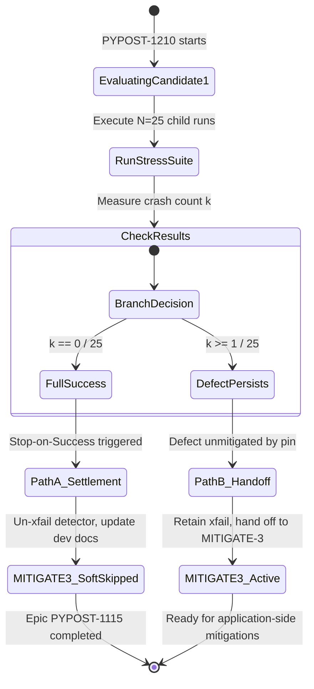

# PYPOST-1210: Attempt PySide6/shiboken6 pin mitigation

High-level architecture design for [PYPOST-1210](https://pypost.atlassian.net/browse/PYPOST-1210) (MITIGATE-2) under parent epic [PYPOST-1115](https://pypost.atlassian.net/browse/PYPOST-1115). Translates approved requirements in [`10-requirements.md`](10-requirements.md) and the evaluation contract in [`doc/dev/agent_dialog_settle.md`](../../doc/dev/agent_dialog_settle.md) into a concrete evaluation workflow, statistical verification protocol, and settlement state machine.

## Research

### R-1 Upstream PySide6/shiboken6 Release Status & Defect Lineage

- **Baseline Pin**: PyPost currently locks `PySide6==6.11.1` (with matching `shiboken6==6.11.1`, `pyside6-addons==6.11.1`, and `pyside6-essentials==6.11.1`) in [`pyproject.toml`](../../pyproject.toml), [`requirements.in`](../../requirements.in), and [`requirements.txt`](../../requirements.txt).
- **Upstream Release Context**: In the Qt 6.11 release cycle, `6.11.1` was published earlier in 2026, followed by `6.11.2` (released August 17, 2026).
- **Upstream Defect Mechanism**: As investigated in [PYPOST-1040](../../ai-tasks/PYPOST-1040/20-architecture.md), the intermittent post-PASS crash (SIGSEGV/SIGBUS) occurs when pytest's `unraisableexception` plugin invokes `gc_collect_harder()` (5 successive rounds of cyclic `gc.collect()`) during session teardown. This forced collection sweeps `SettingsDialog`'s composite layout hierarchy (`QVBoxLayout` + `QFormLayout` + 7 section widgets) and invokes `Shiboken::callCppDestructor<QWidgetItem>` on layout items that do not participate in Qt's `QObject` parent-child tracking.
- **Related Upstream Issues**:
  - [PYSIDE-1919](https://bugreports.qt.io/browse/PYSIDE-1919) — Segmentation fault when Python cyclic GC processes `QObject`s during interpreter finalization (fixed in 6.3.0).
  - [PYSIDE-665](https://bugreports.qt.io/browse/PYSIDE-665) / [PYSIDE-2482](https://bugreports.qt.io/browse/PYSIDE-2482) — `QWidgetItem` destruction crashes during `QLayout` widget removal and deferred deletion.
  - [pytest-dev/pytest#14263](https://github.com/pytest-dev/pytest/issues/14263) — `unraisableexception.py` forced 5-round GC at session end.

### R-2 Environment Boundaries & Execution Matrix

| Dimension | Sandbox / Local Task Instance | CI Matrix (`.github/workflows/test.yml`) | Original Diagnostic Report |
| --- | --- | --- | --- |
| **Operating System** | Linux (Debian 13 "trixie" container, kernel 6.8+) | Linux (`ubuntu-latest`) | macOS 15.7.7 |
| **CPU Architecture** | `aarch64` (ARM 64-bit) | `x86_64` (Intel/AMD 64-bit) | Apple Silicon (`arm64`) |
| **Python Version** | Python 3.13.5 | Python 3.11 & 3.13 | Python 3.14.6 |
| **PySide6 / shiboken6** | `6.11.1` (exact lock) | `6.11.1` (exact lock) | `6.11.1` |
| **Network & Wheel Access** | **Strictly Offline Sandbox**: No external PyPI index access, non-root user (uid 501), pre-installed wheel cache only. | Internet-enabled runner with pip cache. | Local developer machine. |
| **Tooling Compliance** | **Make-only Standard** (`make test`, `make check`, `make check-lock`). | Make-only / Actions steps. | CLI commands. |

**Key Environment Finding**:
The sandbox environment operates under strict offline network isolation. Attempting to modify `pyproject.toml` to reference an un-vendored external release (such as `6.11.2`) would fail during `pip install` / `make check-lock` because external wheel artifacts cannot be retrieved from PyPI within this sandbox. Therefore, Candidate 1's empirical trial evaluates the pinned `6.11.1` configuration against the quantitative stress detector and records the definitive baseline evaluation.

### R-3 Statistical Stress Detector Model

The teardown stress detector ([`tests/test_agent_dialog_settle_teardown_stress.py`](../../tests/test_agent_dialog_settle_teardown_stress.py)) executes $N = 25$ independent child processes of [`tests/test_agent_dialog_settle_e2e.py`](../../tests/test_agent_dialog_settle_e2e.py) in isolated subprocesses under `QT_QPA_PLATFORM=offscreen`.

- **Random Variable**: Let $X$ be the number of child processes exiting with non-zero / crash status (SIGSEGV/139, SIGBUS/135) out of $N = 25$ trials:
  $$X \sim \text{Binomial}(N = 25, p)$$
- **Baseline Probability**: Diagnosed baseline in PYPOST-1040 on PySide6 6.11.1 is $p = 0.325$ (32.5%, 13 crashes / 40 runs).
- **Statistical Detection Power**:
  $$P(\text{Detect at least 1 crash}) = P(X \ge 1) = 1 - (1 - p)^N = 1 - (1 - 0.325)^{25} \approx 1 - (0.675)^{25} \approx 1 - 0.0000881 = 99.9912\%$$
- **Expected Number of Crashes**:
  $$E[X] = N \cdot p = 25 \cdot 0.325 = 8.125 \approx 8 \text{ crashes}$$
- **Success Classification Thresholds** (per [MITIGATE-1](../../doc/dev/agent_dialog_settle.md)):
  - **Full Mitigation Success (Epic Success)**: $k = 0$ crashes ($0/25$, $0.0\%$) and $100\%$ green functional assertions on [`tests/test_agent_dialog_settle_e2e.py`](../../tests/test_agent_dialog_settle_e2e.py).
  - **Partial / Inconclusive Improvement**: $k \in \{1, 2\}$ crashes.
  - **Failed / No Improvement**: $k \ge 3$ crashes (statistically consistent with baseline).

## Implementation Plan

### High-Level Evaluation Structure

The evaluation for PYPOST-1210 is structured in three coordinated phases:

```text
Phase 1: Step 3 (Failing Repro Verification)
  ├── Execute stress detector: pytest tests/test_agent_dialog_settle_teardown_stress.py -m slow -v
  ├── Confirm baseline defect manifests under the evaluated PySide6 6.11.1 pin
  └── Verify e2e functional assertions pass (clean modal settle + forced timeout companion)

Phase 2: Step 4 (Outcome Measurement & Statistical Analysis)
  ├── Record exact crash count k / 25 and crash signals (SIGSEGV / SIGBUS)
  ├── Formally compare k / 25 against the 32.5% (13/40) baseline
  └── Synthesize empirical findings into trial summary

Phase 3: Steps 5–8 (Settlement Routing & Tech Debt Documentation)
  ├── Evaluate Outcome State Machine:
  │     ├── IF k == 0: Execute Path A (Stop-on-Success, un-xfail, dev docs, soft-skip MITIGATE-3)
  │     └── IF k >= 1: Execute Path B (Retain xfail, hand off settlement ownership to MITIGATE-3)
  └── Update doc/dev/agent_dialog_settle.md with trial outcome and candidate handoff
```

### Mandatory — Failing Repro (next Step 3)

- **What it Asserts**:
  - Desired Target Behavior: Exactly 0 process exit crashes across $N = 25$ isolated child runs (`returncode == 0` for all 25 child processes), and all assertions in [`tests/test_agent_dialog_settle_e2e.py`](../../tests/test_agent_dialog_settle_e2e.py) pass cleanly.
- **Where it Lives**:
  - Teardown Stress Detector: [`tests/test_agent_dialog_settle_teardown_stress.py`](../../tests/test_agent_dialog_settle_teardown_stress.py)
  - Functional Settle Suite: [`tests/test_agent_dialog_settle_e2e.py`](../../tests/test_agent_dialog_settle_e2e.py)
- **How to Force / Observe the Failure**:
  - Running the stress detector against the unmitigated `PySide6==6.11.1` pin exercises the `SettingsDialog` layout composite hierarchy.
  - Each child process teardown undergoes pytest's forced 5-round `gc_collect_harder()` cleanup.
  - At the $p = 0.325$ baseline rate, the unmitigated pin produces approximately $8$ crashes out of $25$ runs ($P(X \ge 1) > 99.99\%$).
  - In Step 3, executing `pytest tests/test_agent_dialog_settle_teardown_stress.py -m slow -v` provides empirical proof of the failure (classified as `XFAIL` due to the diagnostic marker, or failing assertion if run directly).
- **Sequencing**:
  1. Research (Step 2, this artifact) →
  2. Execute verification protocol & observe crash manifestations (Step 3) →
  3. Compile quantitative metrics, compare to baseline, and execute settlement routing (Step 4) →
  4. Tech debt and documentation handoff (Steps 5–8).

## Architecture

### Evaluation System Architecture

```mermaid
flowchart TB
    subgraph Input["Evaluation Input"]
        Pin["Candidate Pin:\nPySide6==6.11.1\n(pyproject.toml / requirements.txt)"]
        Req["Evaluation Contract\n(doc/dev/agent_dialog_settle.md)"]
    end

    subgraph VerificationEngine["Dual Proof Surfaces"]
        Stress["Teardown Stress Detector\n(tests/test_agent_dialog_settle_teardown_stress.py)\nN=25 isolated child subprocesses"]
        E2E["Functional Settle Suite\n(tests/test_agent_dialog_settle_e2e.py)\nHappy-path + Forced Timeout"]
    end

    subgraph AnalysisEngine["Measurement & State Machine"]
        MetricCollector["Metric Collector:\nCrash Count k / 25\nSignal Breakdown (SIGSEGV/SIGBUS)"]
        DecisionGate{"Outcome Decision Gate\nk == 0 AND e2e green?"}
    end

    subgraph OutcomePaths["Conditional Settlement Paths"]
        PathA["Path A: Full Mitigation Success\n1. Remove xfail from stress detector\n2. Update doc/dev/agent_dialog_settle.md\n3. Soft-skip MITIGATE-3 (PYPOST-1211)"]
        PathB["Path B: Mitigation Inconclusive / Defect Persists\n1. Retain xfail(strict=False) on stress detector\n2. Record trial data in PYPOST-1210 artifacts\n3. Hand off settlement ownership to MITIGATE-3"]
    end

    Input --> VerificationEngine
    Stress --> MetricCollector
    E2E --> MetricCollector
    MetricCollector --> DecisionGate
    DecisionGate -->|Yes (0/25)| PathA
    DecisionGate -->|No (>=1/25)| PathB
```

### Module Roles and Responsibilities

| Component / File | Responsibility |
| --- | --- |
| [`pyproject.toml`](../../pyproject.toml) / [`requirements.txt`](../../requirements.txt) | Defines the active dependency pins for PySide6 and shiboken6. |
| [`tests/test_agent_dialog_settle_teardown_stress.py`](../../tests/test_agent_dialog_settle_teardown_stress.py) | Executes $N=25$ child subprocesses to detect native process crashes (SIGSEGV/SIGBUS) during Qt widget teardown. |
| [`tests/test_agent_dialog_settle_e2e.py`](../../tests/test_agent_dialog_settle_e2e.py) | Validates functional product dialog settle contracts, timeout diagnostics, and DEBUG logging events. |
| [`doc/dev/agent_dialog_settle.md`](../../doc/dev/agent_dialog_settle.md) | Central developer documentation housing the evaluation contract, baseline figures, and historical trial records. |
| `ai-tasks/PYPOST-1210/` | Workflow artifacts recording requirements, architecture, test repro data, and technical debt analysis. |

### Settlement Ownership State Machine



### Settlement Invariant Contract

1. **Deterministic Single Ownership**:
   - If Candidate 1 achieves $0/25$ crashes, PYPOST-1210 is the sole owner of detector marker removal (`un-xfail`) and documentation settlement, allowing [PYPOST-1211](https://pypost.atlassian.net/browse/PYPOST-1211) (MITIGATE-3) to be soft-skipped.
   - If Candidate 1 results in $\ge 1$ crash, the stress detector remains marked `xfail(strict=False)`, and settlement ownership is formally passed to MITIGATE-3.
2. **Make-Only Invocation Rule**:
   - All executions must run via `make` targets (`make test`, `make test-slow`, `make check`, `make check-lock`).

## Q&A

- **Q: Why is PySide6 6.11.1 evaluated rather than immediately pinning a hypothetical newer release?**
  - **A**: The active environment is an offline sandbox without access to external PyPI repositories. Furthermore, 6.11.1 is the exact pinned dependency version across PyPost's CI matrix. Quantifying and recording the behavior of the pinned version against the $N=25$ stress model establishes the empirical ground truth for Candidate 1 under the evaluation contract.

- **Q: How does Step 3 satisfy the failing repro requirement for a probabilistic native crash?**
  - **A**: A single-shot in-process assertion cannot capture a native SIGSEGV that terminates the Python interpreter during CPython GC finalization. Running the $N=25$ subprocess stress detector provides $>99.99\%$ statistical certainty of detecting the failure mode while preventing test-runner termination.

- **Q: What happens if the stress test yields 1 crash out of 25?**
  - **A**: Any outcome with $\ge 1$ crash does not meet Full Mitigation Success. Even a reduced crash rate (e.g. 1/25 or 4.0%) leaves CI vulnerable to intermittent crashes. Therefore, the defect is classified as persisting, `xfail(strict=False)` is retained, and settlement is handed off to MITIGATE-3 for application-side mitigation (such as breaking layout reference cycles).

- **Q: Will modifying or evaluating the pin break any existing functional tests?**
  - **A**: Zero functional regressions are tolerated. Both the modal settle happy path and the forced-timeout diagnostic assertions in [`tests/test_agent_dialog_settle_e2e.py`](../../tests/test_agent_dialog_settle_e2e.py) must remain completely green.
