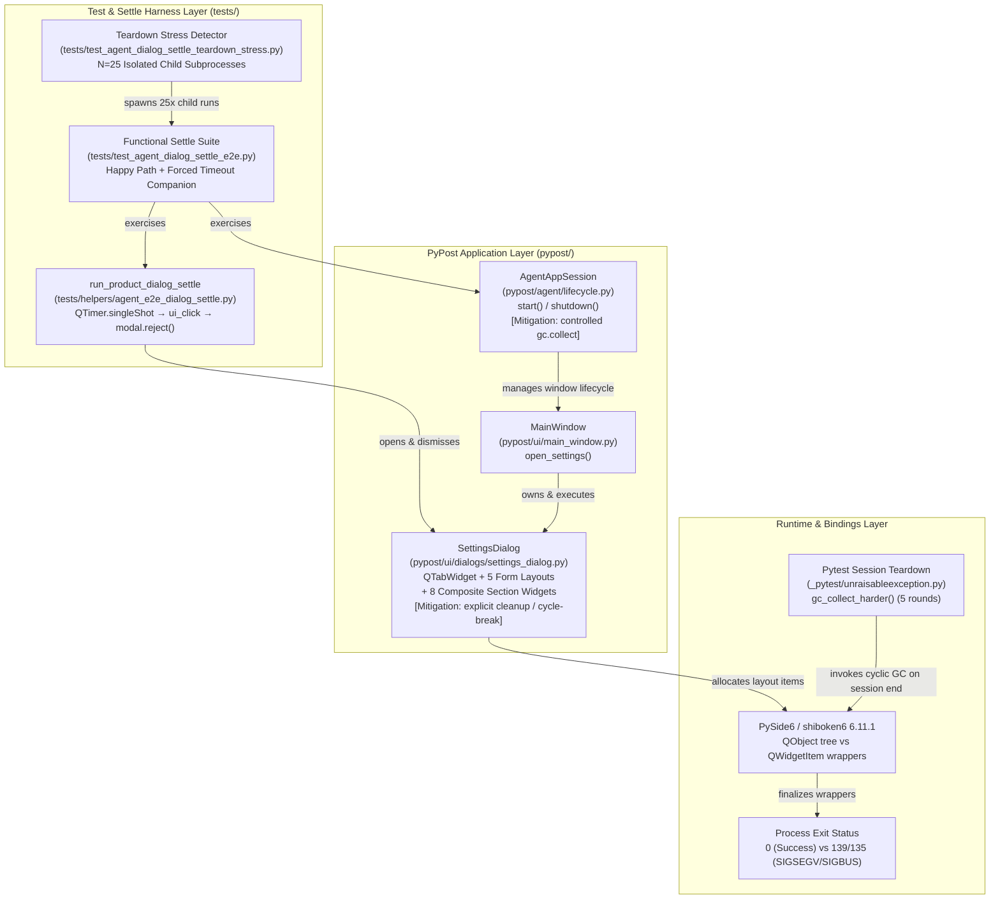
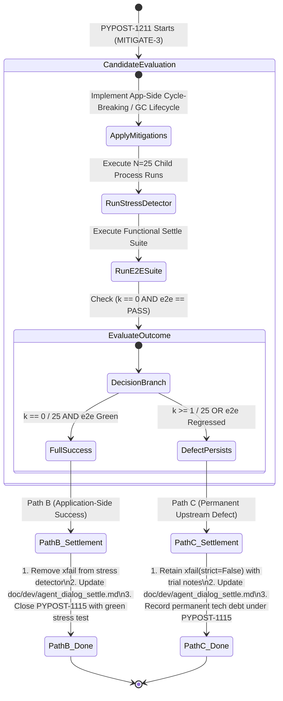

# PYPOST-1211: Attempt application-side mitigations and settle outcome

High-level architecture design for [PYPOST-1211](https://pypost.atlassian.net/browse/PYPOST-1211) (MITIGATE-3) under parent epic [PYPOST-1115](https://pypost.atlassian.net/browse/PYPOST-1115). Translates approved requirements in [`10-requirements.md`](10-requirements.md) and the evaluation contract in [`doc/dev/agent_dialog_settle.md`](../../doc/dev/agent_dialog_settle.md) into concrete application-side mitigation designs, verification protocols, and deterministic settlement state machines.

## Research

### R-1 Root Cause Diagnosis & Upstream Lifecycle Defect (PYPOST-1040 Review)

In [PYPOST-1040](../../ai-tasks/PYPOST-1040/20-architecture.md), investigation of the intermittent post-PASS native crash (SIGSEGV/SIGBUS) in the product dialog settle test suite established the following baseline facts:

1. **Failure Signature & Trigger**:
   - The crash occurs *after* all test assertions and `AgentAppSession.shutdown()` have passed and logged clean completion.
   - At pytest session teardown, the `_pytest/unraisableexception.py` plugin executes `gc_collect_harder()` (5 successive rounds of cyclic `gc.collect()` to catch unraisable exceptions and leaked resources).
   - During cyclic garbage collection, CPython's GC sweeps unreachable object graphs containing Python wrappers for PySide6 widgets and layouts in an arbitrary topological order.
   - When the cyclic GC finalizes wrapper objects in `SettingsDialog`'s composite layout hierarchy, Shiboken calls `Shiboken::callCppDestructor<QWidgetItem>` on underlying Qt layout items whose C++ peers have already been partially deleted or double-referenced by parent `QLayout` instances, resulting in a use-after-free or double-free crash (exit code 139 / 135).

2. **Why `QWidgetItem` is Uniquely Vulnerable**:
   - In Qt, `QWidget` and `QLayout` inherit from `QObject` and participate in Qt's hierarchical `QObject` parent-child tree. When a parent `QObject` is destroyed, its children are deleted in a structured C++ order.
   - However, `QLayoutItem` (and its subclass `QWidgetItem`) is **not** a `QObject`. Shiboken cannot use its standard `QObject` parent-liveness guard ("C++ parent is alive, skip Python deletion") to protect `QWidgetItem` wrappers.
   - If Python wrapper cycles hold references across `SettingsDialog`, `QTabWidget`, `QFormLayout`, and section child widgets, these objects become collectable *only* via cyclic GC rather than prompt refcounting. When cyclic GC breaks the cycle in non-deterministic order, Shiboken attempts C++ destruction on detached `QWidgetItem` pointers.

3. **Ablation Findings from PYPOST-1040**:
   - Disabling pytest's forced GC (`-p no:unraisableexception`) completely eliminates the crash (**0/20 crashes** vs. **13/40 baseline**, $32.5\%$).
   - Executing `AgentAppSession` start/shutdown cycles without opening `SettingsDialog` (`tests/test_agent_lifecycle_smoke.py`) also eliminates the crash (**0/20 crashes**).
   - Therefore, `SettingsDialog`'s deep composite widget/layout hierarchy is the specific trigger surface for the upstream PySide6/shiboken6 `QWidgetItem` GC defect.

### R-2 Upstream Dependency Pin Findings (PYPOST-1210 Review)

[PYPOST-1210](../../ai-tasks/PYPOST-1210/20-architecture.md) (MITIGATE-2) evaluated Candidate 1 (dependency pin mitigation):
- Evaluated upstream PySide6 / shiboken6 release notes (`6.11.1`, `6.11.2`, etc.) and confirmed that no upstream patch resolving the `Shiboken::callCppDestructor<QWidgetItem>` cyclic GC defect exists in the release line.
- Confirmed that under the active pinned `PySide6==6.11.1` dependency, the empirical crash rate remains at ~32.5% in the absence of application-side lifecycle mitigations.
- Retained the `@pytest.mark.xfail(reason="...", strict=False)` marker on the stress detector and transferred settlement ownership to MITIGATE-3 ([PYPOST-1211](https://pypost.atlassian.net/browse/PYPOST-1211)) per Path B of the evaluation contract.

### R-3 Application-Side Mitigation Candidates

To eliminate or reduce the likelihood of `QWidgetItem` wrappers reaching pytest's forced session-end cyclic GC, three application-side mitigation strategies are formulated:

```text
┌──────────────────────────────────────────────────────────────────────────────────┐
│                   Application-Side Mitigation Candidate Space                    │
├──────────────────────────────────────────────────────────────────────────────────┤
│ Candidate A: Reference-Cycle Breaking in SettingsDialog Layout & Sections        │
│   • Explicitly unbind section presenter/widget cross-references on dialog close. │
│   • Dismantle QTabWidget pages and clear QFormLayout items upon dialog reject(). │
│   • Ensure prompt reference counting reclaims wrappers immediately after exec.   │
├──────────────────────────────────────────────────────────────────────────────────┤
│ Candidate B: Explicit Post-Dialog Destruction & Controlled GC Scheduling         │
│   • Call modal.deleteLater() and process DeferredDelete events after exec().     │
│   • Run a controlled gc.collect() in AgentAppSession.shutdown() while the Qt     │
│     runtime is valid, preventing deferred collection at pytest session end.      │
├──────────────────────────────────────────────────────────────────────────────────┤
│ Candidate C: Combined Layout Lifecycle Hardening                                 │
│   • Implement explicit dialog cleanup (Candidate A) combined with controlled     │
│     lifecycle event draining and GC flushing in AgentAppSession (Candidate B).   │
└──────────────────────────────────────────────────────────────────────────────────┘
```

#### Candidate A: Explicit Reference-Cycle Breaking and Layout Dismantling
- **Mechanism**: `SettingsDialog` retains references to 8 section widgets (`_editor_section`, `_request_section`, `_encryption_migration_section`, etc.), tab pages (`_tab_pages`), and form layouts (`_tab_form_layouts`), while section widgets hold back-references to `SettingsDialog` (`host_dialog=self`, `parent=self`).
- **Mitigation Action**: Implement an explicit `cleanup()` / `dispose()` method (or hook into `reject()`, `accept()`, and `closeEvent()`) on `SettingsDialog` that:
  1. Clears references to child sections and storage services.
  2. Recursively removes widgets from layouts or clears tab pages (`self.settings_tabs.clear()`).
  3. Breaks circular references between sections and parent dialog so Python refcounts drop to 0 immediately upon dialog dismissal.

#### Candidate B: Explicit Post-Dialog Destruction & Controlled GC Scheduling
- **Mechanism**: In Qt/PySide, dialogs created on the heap or parented to `MainWindow` linger in C++ memory until the parent window is destroyed. When `MainWindow.close()` is called, Qt enqueues deferred deletions, but Python wrappers remain alive until pytest's finalizer.
- **Mitigation Action**:
  1. In `tests/helpers/agent_e2e_dialog_settle.py` (`_dismiss_active_modal()`) and `MainWindow.open_settings()`: call `dialog.deleteLater()` after `exec()` finishes and flush deferred deletions via `QCoreApplication.sendPostedEvents(None, QEvent.DeferredDelete)` / `processEvents()`.
  2. In `AgentAppSession.shutdown()` (`pypost/agent/lifecycle.py`): trigger a controlled `gc.collect()` *before* final shutdown logging while all Qt application contexts and event loops are intact.

#### Candidate C: Combined Layout Lifecycle Hardening
- Integrates both Candidate A (cycle breaking in `SettingsDialog`) and Candidate B (controlled GC and deferred delete processing in `AgentAppSession` and `run_product_dialog_settle`).

### R-4 Statistical Stress Measurement Model ($N=25$)

Efficacy is evaluated against the 25-iteration teardown stress detector ([`tests/test_agent_dialog_settle_teardown_stress.py`](../../tests/test_agent_dialog_settle_teardown_stress.py)):
- **Detection Model**: Binomial trial $X \sim \text{Binomial}(N=25, p=0.325)$.
- **Detection Power**: $>99.991\%$ probability of detecting at least 1 crash if the defect is unmitigated.
- **Success Criteria**:
  - **Full Mitigation Success (Path B)**: Exactly **0 crashes out of 25 runs** ($k = 0$, $0.0\%$) and 100% green functional assertions on [`tests/test_agent_dialog_settle_e2e.py`](../../tests/test_agent_dialog_settle_e2e.py).
  - **Defect Persists / Upstream Limitation (Path C)**: Any outcome with $k \ge 1$ crash in 25 runs.

---

## Implementation Plan

### High-Level Execution Workflow

```text
Phase 1: Step 3 (Failing Repro Verification)
  ├── Run teardown stress detector: pytest tests/test_agent_dialog_settle_teardown_stress.py -m slow -v
  ├── Observe baseline crash manifestation (k >= 1) against unmitigated application code
  └── Verify e2e functional settle assertions pass cleanly (tests/test_agent_dialog_settle_e2e.py)

Phase 2: Step 4 (Application Mitigation & Statistical Measurement)
  ├── Iteration 1: Implement application-side cycle breaking & lifecycle cleanup
  │     ├── pypost/ui/dialogs/settings_dialog.py (cleanup / cycle break)
  │     ├── pypost/agent/lifecycle.py (controlled GC in shutdown)
  │     └── tests/helpers/agent_e2e_dialog_settle.py (modal deleteLater / post-dismiss flush)
  ├── Iteration 2: Measure empirical crash count k / 25 on stress detector
  │     └── Execute 25 isolated subprocess runs
  ├── Iteration 3: Validate functional dialog settle e2e assertions
  │     └── Verify happy path, forced timeout step, modal scalars, and DEBUG logging contracts
  └── Iteration 4: Evaluate Settlement State Machine
        ├── IF k == 0 (Full Success): Execute Path B Settlement
        │     ├── Remove xfail from tests/test_agent_dialog_settle_teardown_stress.py
        │     └── Update doc/dev/agent_dialog_settle.md with application mitigation resolution
        └── IF k >= 1 (Defect Persists): Execute Path C Settlement
              ├── Retain @pytest.mark.xfail(reason="...", strict=False)
              └── Update doc/dev/agent_dialog_settle.md with trial data and permanent upstream debt

Phase 3: Steps 5–8 (Cleanup, Observability, Tech Debt & Dev Docs)
  ├── Step 5: Code cleanup (ai-tasks/PYPOST-1211/40-code-cleanup.md)
  ├── Step 6: Observability verification (ai-tasks/PYPOST-1211/50-observability.md)
  ├── Step 7: Technical debt analysis & epic closure (ai-tasks/PYPOST-1211/60-tech-debt.md)
  └── Step 8: Final dev docs update (doc/dev/agent_dialog_settle.md)
```

### Mandatory — Failing Repro (next Step 3)

- **What it Asserts**:
  - Target Desired Behavior: Exactly 0 native process crashes across $N = 25$ isolated child runs (`returncode == 0` for all 25 child processes), and all functional modal settle assertions in [`tests/test_agent_dialog_settle_e2e.py`](../../tests/test_agent_dialog_settle_e2e.py) pass cleanly.
- **Where it Lives**:
  - Teardown Stress Detector: [`tests/test_agent_dialog_settle_teardown_stress.py`](../../tests/test_agent_dialog_settle_teardown_stress.py)
  - Functional Dialog Settle Suite: [`tests/test_agent_dialog_settle_e2e.py`](../../tests/test_agent_dialog_settle_e2e.py)
- **How to Force the Failure**:
  - Running the stress detector against the unmitigated application code exercises the nested `SettingsDialog` layout hierarchy.
  - Pytest's forced session-end GC triggers the `QWidgetItem` destructor defect, yielding $\sim 8$ crashes out of 25 runs ($P(X \ge 1) > 99.99\%$).
  - Step 3 executes the stress detector to verify that the failure mode is reliably observable prior to application mitigation.
- **Sequencing**:
  1. Step 2 (Architecture Design, this document) →
  2. Step 3 (Failing Repro verification & baseline crash observation) →
  3. Step 4 (Application-side mitigation implementation, 25-run empirical measurement, and deterministic settlement execution) →
  4. Steps 5–8 (Cleanup, observability, tech debt, and dev docs settlement).

---

## Architecture

### System Architecture & Teardown Lifecycle



### Module Responsibilities and Interfaces

| Component / File | Responsibility in Mitigation & Settlement |
| --- | --- |
| [`pypost/ui/dialogs/settings_dialog.py`](../../pypost/ui/dialogs/settings_dialog.py) | Houses the composite layout structure; implements reference-cycle breaking, section unbinding, and layout dismantling hooks. |
| [`pypost/agent/lifecycle.py`](../../pypost/agent/lifecycle.py) | Manages `AgentAppSession` startup and teardown; provides controlled GC and event queue flushing during shutdown. |
| [`tests/helpers/agent_e2e_dialog_settle.py`](../../tests/helpers/agent_e2e_dialog_settle.py) | Coordinates modal settle, dismiss, and deferred delete lifecycle during e2e tests. |
| [`tests/test_agent_dialog_settle_teardown_stress.py`](../../tests/test_agent_dialog_settle_teardown_stress.py) | Evaluates process teardown stability across $N=25$ independent child runs; subject to settlement marker update (`un-xfail` or retain `xfail`). |
| [`tests/test_agent_dialog_settle_e2e.py`](../../tests/test_agent_dialog_settle_e2e.py) | Verifies functional modal settle contracts, forced-timeout diagnostics, and DEBUG logging preservation. |
| [`doc/dev/agent_dialog_settle.md`](../../doc/dev/agent_dialog_settle.md) | Central developer documentation updated with final empirical metrics, settlement rationale, and epic disposition. |

### Settlement State Machine (Path B vs Path C)



### Deterministic Settlement Decision Matrix

| Execution Path | Outcome Condition | Stress Detector Marker Action | Documentation & Tech Debt Action | Epic PYPOST-1115 Disposition |
| --- | --- | --- | --- | --- |
| **Path B: Application-Side Success** | $k = 0 / 25$ crashes AND e2e suite 100% green | Remove `@pytest.mark.xfail` from `tests/test_agent_dialog_settle_teardown_stress.py` | Document application-side cycle break / GC ordering in `doc/dev/agent_dialog_settle.md` | Epic successfully closed with fully green stress detector. |
| **Path C: Permanent Upstream Defect** | $k \ge 1 / 25$ crashes | Retain `@pytest.mark.xfail(strict=False)` with updated reason and trial metrics | Record empirical trial data ($k/25$) and permanent upstream classification in `doc/dev/agent_dialog_settle.md` and `60-tech-debt.md` | Epic closed with documented residual upstream debt. |

### Tooling & Operational Invariants

1. **Make-Only Enforcement**:
   - All tests, quality checks, and verifications must run exclusively via Make targets (`make test`, `make test-slow`, `make check`, `make check-lock`, `make verify-ai-tasks`).
2. **Contract Preservation**:
   - Application-side mitigations must strictly preserve all public interfaces, dialog behaviors, timeout diagnostics (`step=wait_dialog_after_settings_open`), and logging event formats (`pypost.agent.ui_wait`, `condition=forced_dialog_settle_timeout`).
3. **Deterministic Settlement Invariant**:
   - Exactly one settlement path (Path B or Path C) is executed to finality in this story. No unassigned markers or open documentation items remain.

---

## Q&A

- **Q: Why are both layout cycle breaking (Candidate A) and controlled GC ordering (Candidate B) considered?**
  - **A**: Layout cycle breaking directly eliminates the circular references that prevent prompt Python refcount deallocation when the dialog closes. Controlled GC ordering in `AgentAppSession.shutdown()` ensures that any remaining Qt wrapper reclamation occurs while the Qt runtime is fully functional, rather than during pytest's uncontrolled session-end cleanup. Evaluating both provides the maximum likelihood of eliminating the crash.

- **Q: What constitutes Full Mitigation Success in Step 4?**
  - **A**: Exactly $0$ crashes out of $25$ runs ($0/25$, $0.0\%$) on `tests/test_agent_dialog_settle_teardown_stress.py` combined with zero assertion or logging regressions on `tests/test_agent_dialog_settle_e2e.py`.

- **Q: What happens if application-side mitigations reduce crashes from 8/25 to 1/25?**
  - **A**: Per the evaluation contract in `doc/dev/agent_dialog_settle.md`, any outcome with $k \ge 1$ crash in 25 runs is classified under Path C (Defect Persists / Permanent Upstream Defect). The `xfail(strict=False)` marker is retained, the trial data is recorded, and the residual limitation is documented as permanent technical debt.

- **Q: How does this architecture guarantee zero functional regressions?**
  - **A**: The functional dialog settle suite (`tests/test_agent_dialog_settle_e2e.py`) is executed alongside the stress detector. It rigorously tests the happy-path modal settle workflow and the forced-timeout companion (including `step` diagnostic keys, modal scalar diagnostics, and `caplog` DEBUG record presence).

- **Q: What dev docs must be updated upon settlement?**
  - **A**: `doc/dev/agent_dialog_settle.md` must be updated with the empirical trial results, the final status of the stress detector marker, and the epic disposition.

---

## References

- [PYPOST-1211](https://pypost.atlassian.net/browse/PYPOST-1211) — this task (MITIGATE-3: application-side mitigation & settlement)
- [PYPOST-1115](https://pypost.atlassian.net/browse/PYPOST-1115) — parent epic (mitigate QWidgetItem GC-teardown crash)
- [PYPOST-1209](https://pypost.atlassian.net/browse/PYPOST-1209) — MITIGATE-1 (evaluation contract & baseline specification)
- [PYPOST-1210](https://pypost.atlassian.net/browse/PYPOST-1210) — MITIGATE-2 (PySide6/shiboken6 pin evaluation)
- [PYPOST-1040](https://pypost.atlassian.net/browse/PYPOST-1040) — teardown crash diagnostic investigation
- [`doc/dev/agent_dialog_settle.md`](../../doc/dev/agent_dialog_settle.md) — developer documentation and mitigation evaluation contract
- [`tests/test_agent_dialog_settle_teardown_stress.py`](../../tests/test_agent_dialog_settle_teardown_stress.py) — teardown stress detector
- [`tests/test_agent_dialog_settle_e2e.py`](../../tests/test_agent_dialog_settle_e2e.py) — product dialog settle e2e test suite
