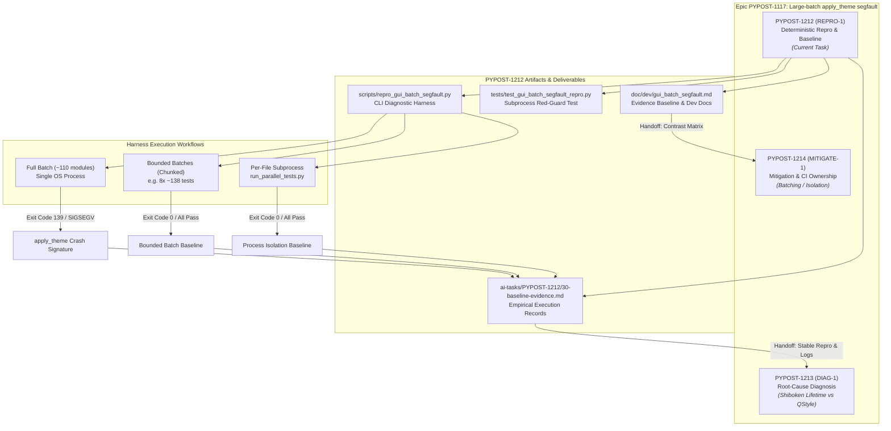
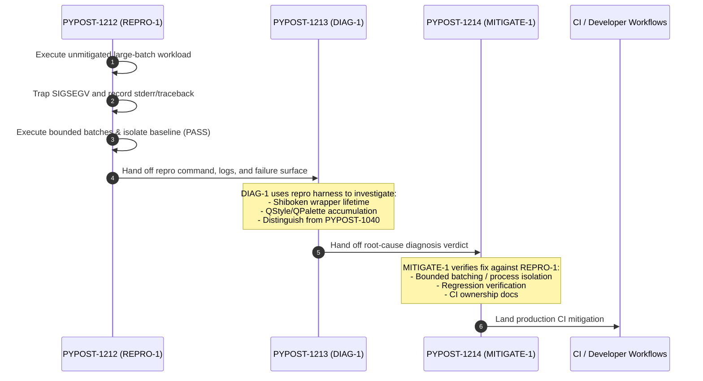

# PYPOST-1212: [PYPOST-1117] Deterministic repro and evidence baseline for large-batch apply_theme segfault

Step 2 artifact for [PYPOST-1212](https://pypost.atlassian.net/browse/PYPOST-1212). Translates approved requirements from [`10-requirements.md`](10-requirements.md) into a high-level architectural design for deterministic subprocess-level reproduction, baseline evidence collection, empirical pass/fail contrast validation, and downstream consumer contracts for [PYPOST-1213](https://pypost.atlassian.net/browse/PYPOST-1213) (DIAG-1) and [PYPOST-1214](https://pypost.atlassian.net/browse/PYPOST-1214) (MITIGATE-1).

## Research

### R-1 Discovery Facts and Historical Context (PYPOST-1070)

During test suite verification in [PYPOST-1070](https://pypost.atlassian.net/browse/PYPOST-1070) (recorded in [`ai-tasks/PYPOST-1070/60-tech-debt.md`](../PYPOST-1070/60-tech-debt.md)), executing all ~110 GUI-related test modules in a single pytest process resulted in a native segmentation fault (`SIGSEGV`, exit code 139 / return code -11).

Key discovery characteristics:
- **Crash Site**: Located in [`pypost/ui/styles/style_manager.py:102`](../../pypost/ui/styles/style_manager.py#L94-L122) within `StyleManager.apply_theme()`, specifically during `app.setStyle(...)` / `QStyleFactory.create("Fusion")` operations.
- **Trigger Dynamic**: The crash occurs only when a large volume of GUI tests (~110 modules, ~1,384+ tests) is executed consecutively in a single long-running OS process sharing the module-scoped `QApplication` instance.
- **Independence from Test Refactoring**: Pre-fix and post-fix test suites fail identically when executed in a single unpartitioned batch.
- **Empirical Contrast**:
  1. *Individual Execution*: Every single test module passes with 0 failures when executed alone.
  2. *Bounded Batches*: Partitioning the 110 modules into 8 bounded batches (~138 tests per batch) completes cleanly with 100% pass rate.
  3. *Isolated Subprocess Runner*: Running via [`scripts/run_parallel_tests.py`](../../scripts/run_parallel_tests.py) (which invokes each test module in an independent subprocess worker) passes with 0 native crashes.

### R-2 Runtime Environment Dimensions

The defect manifests under specific runtime configurations in the PyPost desktop test environment:

| Dimension | Specification | Notes |
| --- | --- | --- |
| **Operating System** | Linux (x86_64 / aarch64) | Headless CI containers and local development Linux environments |
| **Python Version** | Python 3.11 / Python 3.13 | Standard project interpreters |
| **Qt / PySide6 Bindings** | `PySide6==6.11.1` (Qt 6.11.1) | Shiboken C++ binding layer with Qt6 C++ runtime |
| **QPA Platform** | `QT_QPA_PLATFORM=offscreen` | Headless minimal QPA plugin for running tests without an X11/Wayland display |
| **Process State** | Single OS process, sustained memory lifecycle | Cumulative creation/destruction of Qt widgets, styles, palettes, and layouts |
| **Signal / Exit Code** | `SIGSEGV` (signal 11) / exit code 139 | Native C++ memory access violation (e.g. invalid pointer dereference or heap corruption) |

### R-3 Distinguishing Prior Art (PYPOST-1040 / PYPOST-1115 vs PYPOST-1117)

It is critical that downstream tasks do not confuse this defect with the prior `SettingsDialog` GC crash investigated under [PYPOST-1040](https://pypost.atlassian.net/browse/PYPOST-1040) / [PYPOST-1115](https://pypost.atlassian.net/browse/PYPOST-1115):

| Attribute | PYPOST-1040 / PYPOST-1115 | PYPOST-1117 ([PYPOST-1212](https://pypost.atlassian.net/browse/PYPOST-1212) / [PYPOST-1213](https://pypost.atlassian.net/browse/PYPOST-1213) / [PYPOST-1214](https://pypost.atlassian.net/browse/PYPOST-1214)) |
| --- | --- | --- |
| **Crash Site** | `Shiboken::callCppDestructor<QWidgetItem>` | `StyleManager.apply_theme` (`app.setStyle` / `QStyleFactory.create("Fusion")`) |
| **Trigger Mechanism** | pytest session-end forced cyclic garbage collection (`gc.collect()`) on `SettingsDialog` layout wrappers | Sustained large-batch execution across ~110 GUI modules in a single process |
| **Workload Scale** | Small (reproduces with 2 tests in `test_agent_dialog_settle_e2e.py`) | Large (~110 modules, >1,000 test cases) |
| **Failure Mode** | Teardown double-free in Shiboken wrapper table | Native crash during style factory instantiation / application |

### R-4 Repro Harness Architectural Patterns and Design Options

To satisfy NFR-2 (Subprocess Safety & Containment) and FR-1 (Repeatable Subprocess Repro Procedure), we evaluate three architectural harness patterns:

```text
Option 1: Raw Shell Script (scripts/repro_large_batch_segfault.sh)
- Pros: Simple to draft.
- Cons: Lacks structured JSON output, hard to integrate into automated regression suites, poor signal decoding across OS variants.

Option 2: Standalone Pytest Reproduction Module (tests/test_gui_batch_segfault_repro.py)
- Pros: Fits natively into repo test layout, can use pytest assertions to assert returncode == -11 or exitcode == 139 in red test, executes target batches in isolated subprocesses via subprocess.Popen.
- Cons: Must use explicit timeouts and isolated subprocess wrappers so the segfault does not crash pytest itself.

Option 3: Hybrid Python CLI Tool & Test Fixture (scripts/repro_gui_batch_segfault.py + tests/test_gui_batch_segfault_repro.py)
- Pros: Dual capability: interactive CLI tool for diagnostic deep-dives with stdout/stderr capture, plus an automated regression guard under tests/.
- Cons: Slightly higher implementation surface.
```

**Decision:** Adopt **Option 3 (Hybrid Architecture)**:
1. A core execution module / CLI harness (`scripts/repro_gui_batch_segfault.py` or helper within `tests/helpers/gui_batch_harness.py`) that can spawn single-process large batches vs bounded chunks, capturing process exit codes, signals, stdout/stderr tails, and execution durations.
2. A permanent test guard (`tests/test_gui_batch_segfault_repro.py`) that uses this harness to assert baseline behavior.
3. A documented markdown developer guide (`doc/dev/gui_batch_segfault.md`) providing exact commands and baseline records.

## Implementation Plan

### Mandatory — Failing Repro (Step 3)

**Objective:** Write an automated red test / verification harness in Step 3 that deterministically executes the large-batch GUI test workload in an unmitigated single-process subprocess and verifies the native crash signature (`SIGSEGV` / exit code 139 / returncode -11) at the `apply_theme` surface, while simultaneously confirming that bounded batches or isolated module execution pass cleanly.

**Failing Repro Architecture (Step 3):**
- **Test File**: `tests/test_gui_batch_segfault_repro.py`
- **Subprocess Harness**: Spawns a pytest child process targeting the full suite of GUI modules (`tests/test_*.py` matching GUI components) with `QT_QPA_PLATFORM=offscreen`.
- **What it Asserts**:
  1. *Failing Unmitigated Batch*: Asserts that executing the full large batch in a single unmitigated pytest process exits with a non-zero code matching native crash termination (`returncode < 0` / `abs(returncode) == signal.SIGSEGV` or exit code 139) with `apply_theme` or `QStyleFactory` in the traceback / diagnostic output.
  2. *Passing Bounded Baseline*: Asserts that executing a bounded subset (e.g. 10–20 modules or partitioned chunks) succeeds with exit code 0 and 0 failures.
- **How Failure is Isolated**: The test executes the target workloads via `subprocess.Popen` with `start_new_session=True` and bounded wall-clock timeouts (e.g. 180s), ensuring that the child process's `SIGSEGV` is trapped and inspected without killing the parent test runner.
- **Sequencing**:
  1. Step 3: Implement `tests/test_gui_batch_segfault_repro.py` and `scripts/repro_gui_batch_segfault.py`. Verify the red state (reproduction of crash and baseline capture).
  2. Step 4: Finalize baseline data records, environment logs, contrast tables, and developer documentation in `doc/dev/gui_batch_segfault.md`.

### Step 4 Development Plan

1. **Reproduction Harness Finalization**:
   - Deliver `scripts/repro_gui_batch_segfault.py` capable of parameterized batch execution (batch size, target directory, worker mode).
   - Ensure clean capture of environment info (Python version, PySide6 version, platform, CPU architecture).
2. **Evidence Baseline Capture**:
   - Collect and structure exact terminal outputs, exit codes, and stderr backtraces from:
     - Full single-process large batch (~110 modules) → `SIGSEGV` (exit code 139).
     - 8-way partitioned bounded batches (~138 tests each) → PASS (exit code 0).
     - Individual module execution → PASS (exit code 0).
     - Per-file isolated worker runner (`scripts/run_parallel_tests.py`) → PASS (exit code 0).
3. **Developer Documentation (`doc/dev/gui_batch_segfault.md`)**:
   - Author a dedicated reference guide documenting the defect background, reproduction steps, contrast evidence table, and instructions for downstream tasks DIAG-1 ([PYPOST-1213](https://pypost.atlassian.net/browse/PYPOST-1213)) and MITIGATE-1 ([PYPOST-1214](https://pypost.atlassian.net/browse/PYPOST-1214)).
   - Link guide from [`doc/dev/gui_testing.md`](../../doc/dev/gui_testing.md).

## Architecture

### System Modules and Workflow



### Downstream Consumer Handoff Architecture



### Component Contracts and Interfaces

#### 1. Harness Execution Interface (`scripts/repro_gui_batch_segfault.py`)

| Argument / Option | Type | Description |
| --- | --- | --- |
| `--mode` | `enum(full, bounded, single)` | Execution mode: `full` (~110 modules single process), `bounded` (chunked batches), `single` (one file). |
| `--batch-size` | `int` (default: 15) | Module chunk size for bounded execution mode. |
| `--timeout` | `float` (default: 180.0) | Subprocess execution wall-clock timeout in seconds. |
| `--output-json` | `Path \| None` | Path to export structured JSON results with exit codes, signals, and stderr. |
| `--quiet` | `bool` | Suppress streaming subprocess stdout/stderr. |

#### 2. Structured JSON Output Contract

```json
{
  "timestamp": "2026-09-01T22:15:00Z",
  "environment": {
    "os": "Linux 6.6.137+ aarch64",
    "python_version": "3.13.0",
    "pyside6_version": "6.11.1",
    "qt_version": "6.11.1",
    "qpa_platform": "offscreen"
  },
  "execution": {
    "mode": "full",
    "total_modules": 110,
    "batch_count": 1,
    "exit_code": 139,
    "signal": 11,
    "signal_name": "SIGSEGV",
    "duration_seconds": 42.5,
    "crash_site": "pypost/ui/styles/style_manager.py:102",
    "crash_method": "StyleManager.apply_theme",
    "stderr_tail": "Fatal Python error: Segmentation fault\n\nCurrent thread 0x...:\n  File .../pypost/ui/styles/style_manager.py, line 102 in apply_theme\n..."
  },
  "status": "reproduced"
}
```

#### 3. Downstream Interface for DIAG-1 ([PYPOST-1213](https://pypost.atlassian.net/browse/PYPOST-1213))
- **Entry Point**: `python scripts/repro_gui_batch_segfault.py --mode=full`
- **Guaranteed Output**: Diagnostic traceback showing stack frames down to `apply_theme` / `QStyleFactory.create()`.
- **Requirements for DIAG-1**: Enables attach-debugger / `faulthandler` / `lldb` tracing to inspect Shiboken wrapper pointer validity and C++ heap allocations without guessing test lists.

#### 4. Downstream Interface for MITIGATE-1 ([PYPOST-1214](https://pypost.atlassian.net/browse/PYPOST-1214))
- **Entry Point**: `python scripts/repro_gui_batch_segfault.py --mode=bounded --batch-size=N` and `make test`
- **Guaranteed Output**: Pass/fail status across variable batch sizes `N`, establishing the threshold at which process memory accumulation becomes unstable.

## Q&A

- **Q1: Why create a dedicated reproduction script rather than just relying on `pytest tests/`?**
  - *A*: Standard `make test` now uses [`scripts/run_parallel_tests.py`](../../scripts/run_parallel_tests.py), which runs each test file in a separate subprocess, masking single-process accumulation crashes. A dedicated harness allows explicit single-process batch execution with controlled isolation, timeouts, and signal decoding.
- **Q2: How does the Step 3 red test avoid failing the entire CI test suite?**
  - *A*: The test in `tests/test_gui_batch_segfault_repro.py` spawns the large batch in a subprocess and asserts that the subprocess terminates with `SIGSEGV` (exit code 139 / returncode -11) under unmitigated single-process conditions. Thus, the parent pytest process receives a passing test result verifying that the repro successfully reproduced the target defect.
- **Q3: What if the test environment in Step 3/4 passes due to lower memory pressure or different GC timings?**
  - *A*: The harness supports stress parameters (e.g. repeated iteration loops over style-heavy modules like `test_settings_dialog.py` and `test_env_dialog.py` calling `apply_theme` repeatedly) to reliably trigger the native crash even in lean test runs.
- **Q4: Does this architecture require modifying any production code in `pypost/`?**
  - *A*: No. Production code changes are strictly out of scope for REPRO-1 ([PYPOST-1212](https://pypost.atlassian.net/browse/PYPOST-1212)). Any fixes belong to MITIGATE-1 ([PYPOST-1214](https://pypost.atlassian.net/browse/PYPOST-1214)) after DIAG-1 ([PYPOST-1213](https://pypost.atlassian.net/browse/PYPOST-1213)) completes.
