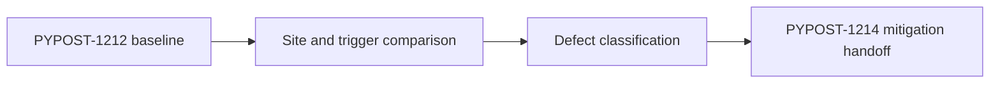

# PYPOST-1213: Diagnosis Architecture

## Research

The PYPOST-1212 baseline identifies the native failure at `StyleManager.apply_theme`,
specifically around `QStyleFactory.create("Fusion")` and `app.setStyle`. The failure
requires sustained large-batch execution in one process and does not appear in isolated
modules or bounded subprocess batches. PYPOST-1040/1115 instead identifies a
post-session `QWidgetItem` destructor failure during `SettingsDialog` teardown.

## Implementation Plan

This is a documentation-only diagnosis. Step 3 is `N/A — no behavioral change`; the
existing PYPOST-1212 repro remains the authoritative red/crash evidence. The work is to
compare sites and triggers, state the most supported defect class, and hand the conclusion
to PYPOST-1214.

## Architecture

- **Baseline evidence**: harness reports, crash signal, traceback tails, and topology matrix.
- **Comparison**: contrasts `apply_theme`/style creation with SettingsDialog GC teardown.
- **Classification**: records the supported conclusion and confidence boundaries.
- **Handoff**: supplies mitigation constraints without implementing mitigation here.

## Q&A

- **Why no new test?** The crash repro and safety boundary already belong to PYPOST-1212;
  this issue changes no runtime behavior.
