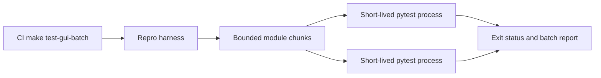

# PYPOST-1214: Mitigation Architecture

## Research

REPRO-1 demonstrates a native failure after cumulative GUI activity in one process and
clean completion when work is split across subprocesses. DIAG-1 classifies it as a
process-accumulated Qt style-engine instability, so test topology is the safe control
point.

## Implementation Plan

The existing `scripts/repro_gui_batch_segfault.py` remains the canonical harness. Add a
Make target with a configurable batch size, use its bounded mode in CI, and convert the
regression test to assert successful bounded execution. Empirical validation selected a
four-module default after the historical 15-module setting reproduced a crash. Step 3 uses the existing
unmitigated crash surface as the repro evidence; Step 4 changes only test infrastructure.

## Architecture

- **Harness** discovers GUI modules and executes each bounded chunk in a fresh process.
- **Make target** is the stable repository entry point and owns the conservative default threshold.
- **CI** runs the target and therefore owns policy enforcement.
- **Reports** retain environment, duration, and per-batch status for diagnosis.

## Q&A

- **Why 15 modules?** It is the existing REPRO-1 bounded baseline and keeps process
  lifetime below the observed cumulative state threshold.
