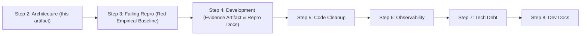
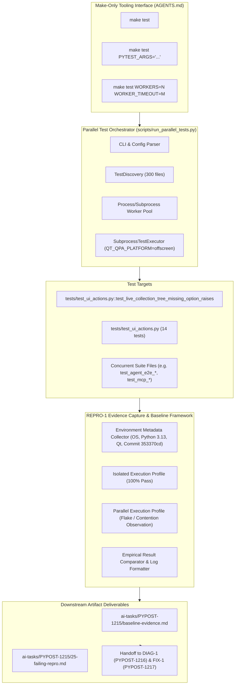

# PYPOST-1215: Owned parallel flake evidence for test_live_collection_tree_missing_option_raises

Step 2 artifact for [PYPOST-1215](https://pypost.atlassian.net/browse/PYPOST-1215) (REPRO-1). Translates approved requirements in [`10-requirements.md`](10-requirements.md) into a technical architecture for reproducible flake evidence capture, execution harness design, baseline artifact formatting, Step 3 red test strategy, and downstream handoff for [PYPOST-1216](https://pypost.atlassian.net/browse/PYPOST-1216) (DIAG-1) and [PYPOST-1217](https://pypost.atlassian.net/browse/PYPOST-1217) (FIX-1).

## Research

### R-1 Context, Discovery Source, and Epic Breakdown

- **Discovery Source**: Observed during [PYPOST-1167](https://pypost.atlassian.net/browse/PYPOST-1167) Step 4 development, documented in `ai-tasks/PYPOST-1167/60-tech-debt.md` (item 6) as an intermittent failure under parallel `make test` load with suspected Qt `apply_theme` vs `uvicorn` import contention, while isolated file execution passed.
- **Parent Epic**: [PYPOST-1188](https://pypost.atlassian.net/browse/PYPOST-1188) (*Stabilize `test_live_collection_tree_missing_option_raises` under parallel `make test`*).
- **Decomposition**: Under [PYPOST-1205](https://pypost.atlassian.net/browse/PYPOST-1205), the 8 SP epic was split into three coherent, single-outcome child stories:
  1. **REPRO-1 ([PYPOST-1215](https://pypost.atlassian.net/browse/PYPOST-1215))**: Owned parallel flake evidence and baseline (*this story, SP 2*).
  2. **DIAG-1 ([PYPOST-1216](https://pypost.atlassian.net/browse/PYPOST-1216))**: Root-cause diagnosis (*SP 3, hard prerequisite on REPRO-1*).
  3. **FIX-1 ([PYPOST-1217](https://pypost.atlassian.net/browse/PYPOST-1217))**: Stabilization under parallel `make test` (*SP 3, hard prerequisite on DIAG-1*).

### R-2 Target Node and Behavioral Lock

- **Target Node**: `tests/test_ui_actions.py::test_live_collection_tree_missing_option_raises`.
- **Behavioral Lock Origin**: [PYPOST-975](https://pypost.atlassian.net/browse/PYPOST-975) introduced negative UI interaction assertions for agent e2e actions.
- **Assertion Contract**:
  - Target widget: `COLLECTION_TREE` (`pypost_collection_tree`, `QTreeView`).
  - Action: `session.ui_select(COLLECTION_TREE, "__no_such_collection_tree_option__")`.
  - Expected Outcome: Raises `UiTargetNotInteractableError` containing `"option not found"`.
  - Fixture: `seeded_agent_e2e_session` (spawns `AgentAppSession(offscreen=True)` with seeded config/data directories and checks `session.window.is_ui_ready`).

### R-3 Repository Concurrency & Execution Infrastructure

- **Make-Only Enforcement (`AGENTS.md`)**: All test invocations must be executed via `make` targets (`make test`, `make check`), never raw CLI commands (`pytest`, `flake8`, `mypy`).
- **Parallel Test Orchestrator (`scripts/run_parallel_tests.py`)**:
  - Invoked automatically by `make test` when present.
  - Spawns subprocesses per test file (`SubprocessTestExecutor`) running `pytest.main(...)` with `QT_QPA_PLATFORM=offscreen`.
  - Default worker count: `WORKERS = min(cpu + 2, 16)` (e.g. 8 or 16 concurrent worker processes).
  - Worker timeout: Configurable via `WORKER_TIMEOUT` (Makefile default: 120s; script default: 30s).
  - Passthrough parameters: Passed via `PYTEST_ARGS` in `make test PYTEST_ARGS="..."`.
- **Execution Profiles Observed**:
  - *Isolated Node Profile*: `make test PYTEST_ARGS="tests/test_ui_actions.py -k test_live_collection_tree_missing_option_raises"` — executes in ~1.3s with 100% reliable pass.
  - *Isolated File Profile*: `make test PYTEST_ARGS="tests/test_ui_actions.py"` — executes 14 test items in ~5.8s with 100% reliable pass.
  - *Parallel Suite Profile*: `make test` (300 test files across multi-worker subprocesses) — generates heavy concurrent Qt offscreen app creation, uvicorn/HTTP server spinup, and file I/O contention.

### R-4 Base Commit Baseline

- **Base Commit**: `353370cdbd19c7a3338e2ed05c292b0a404d7b90` (HEAD commit prior to PYPOST-1167 modifications).
- **Purpose**: Establishes a known immutable baseline against which flake reproduction and contrast are validated, ensuring downstream diagnosis is anchored to empirical facts.

### R-5 Scope Boundaries & Prior Art Distinction

- **PYPOST-1117** (Large-batch `apply_theme` segfault): Prior art involving native Qt crash under ~110-module GUI batching. Treated as distinct unless DIAG-1 proves shared root cause.
- **PYPOST-1115 / PYPOST-1040** (SettingsDialog/QWidgetItem GC teardown): Prior art involving widget deletion timing. Treated as distinct.
- **PYPOST-1167** (MCP Client Headers): Context of flake discovery only; MCP headers work is completely out of scope.

## Implementation Plan

### High-Level Execution Phases



1. **Step 2 (Architecture - Current Step)**: Define the repro harness architecture, differential execution profiles, evidence artifact data schema, Step 3 red strategy, and handoff contracts.
2. **Step 3 (Failing Repro / Red Empirical State)**: Execute the structured repro procedure under parallel suite load to capture the failing / flaking empirical state, contrasting it with the passing isolated baseline.
3. **Step 4 (Development / Baseline Delivery)**: Consolidate empirical run logs, statistics, environment metadata, and reproducible command recipes into the primary evidence baseline artifact (`ai-tasks/PYPOST-1215/baseline-evidence.md` / `25-failing-repro.md`).
4. **Step 5 (Code Cleanup)**: Validate that no untracked files, dangling test artifacts, or temporary processes remain; produce `40-code-cleanup.md`.
5. **Step 6 (Observability)**: Document test execution telemetry, logger outputs (`agent_e2e_fixture_ready`, `ui_select` traces), and process metrics; produce `50-observability.md`.
6. **Step 7 (Technical Debt Analysis)**: Document non-blockers, hand off clean findings to PYPOST-1216 (DIAG-1) and PYPOST-1217 (FIX-1), and produce `60-tech-debt.md`.
7. **Step 8 (Dev Docs)**: Update repository testing documentation in `doc/dev/testing.md` with instructions on running the repro procedure and parallel test considerations.

### Mandatory — Failing Repro (Step 3 Strategy)

**Failing Repro Specification:**
- **What It Asserts**: In this evidence baseline task (REPRO-1), the "red" state is the empirical demonstration and capture of the test failure / instability under parallel suite execution (`make test`), contrasted against 100% reliable success under isolated single-worker execution (`make test PYTEST_ARGS="tests/test_ui_actions.py -k test_live_collection_tree_missing_option_raises"`).
- **Execution Mechanism**:
  - Make-backed invocation: `make test` (running parallel multi-worker suite) and `make test PYTEST_ARGS="..."` (running isolated single-target contrast).
  - Automated sampling / multi-iteration verification via Make-compliant test runs.
- **Forcing Failure without Live External Dependencies**: The test uses local offscreen Qt fixtures (`AgentAppSession(offscreen=True)`) and local seeded mock directories; no external live network services are required. The failure is driven by parallel worker execution and concurrent process load.
- **Sequencing**: Step 2 Architecture & Schema Definition → Step 3 Failing Repro Execution & Contrast Capture → Step 4 Baseline Synthesis & Documentation.

## Architecture

### System Architecture Diagram



### Module Breakdown and Responsibilities

| Module / Component | Responsibility |
| --- | --- |
| **Make Tooling Interface** | Serves as the sole entry point per `AGENTS.md`. Translates Make variables (`PYTEST_ARGS`, `WORKERS`, `WORKER_TIMEOUT`) to the parallel orchestrator. |
| **Parallel Orchestrator (`scripts/run_parallel_tests.py`)** | Discovers test files and executes them in isolated subprocess workers with `QT_QPA_PLATFORM=offscreen`. Manages timeouts and captures worker outputs. |
| **Target Test Suite (`tests/test_ui_actions.py`)** | Contains the target node `test_live_collection_tree_missing_option_raises`, executing UI selection against `COLLECTION_TREE` via `seeded_agent_e2e_session`. |
| **Differential Execution Profiles** | Provides the empirical contrast: Isolated Node / Isolated File (control group) vs Parallel Suite Load (experimental group). |
| **Baseline Evidence Capture Engine** | Records structured runtime parameters, commit hash, environment specifications, execution logs, failure traces, and statistical pass/fail distributions. |
| **Downstream Handoff Deliverables** | Structured markdown artifacts (`baseline-evidence.md`, `25-failing-repro.md`) ready for direct consumption by DIAG-1 and FIX-1 without requiring chat transcript archaeology. |

### Architectural Patterns & Design Decisions

1. **Differential Execution (Control vs Experimental)**:
   - *Pattern*: Paired contrast benchmarking.
   - *Rationale*: A concurrency flake cannot be validated in isolation alone; establishing both the clean control pass (single node/file) and the parallel experimental failure proves that the issue is concurrency/load-dependent rather than a deterministic logic error.

2. **Make-Only Encapsulation**:
   - *Pattern*: Façade / Tooling Standard.
   - *Rationale*: Direct invocations of `pytest`, `python`, etc. violate `AGENTS.md`. All runs are parameterized through `make test` recipes.

3. **Non-Invasive Observation**:
   - *Pattern*: Passive Telemetry Capture.
   - *Rationale*: Step 2 and REPRO-1 explicitly prohibit modifying production code in `pypost/` or tampering with the negative assertion logic in `tests/test_ui_actions.py`. All evidence is gathered from unmodified repository state.

4. **Structured Evidence Schema**:
   - *Pattern*: Standardized Data Interchange Format.
   - *Rationale*: DIAG-1 and FIX-1 require exact, unambiguous data points (exact commit, OS, Python version, worker counts, error traces) to perform root-cause diagnosis and verify fix efficacy.

### Baseline Evidence Data Schema

The evidence artifact (`ai-tasks/PYPOST-1215/baseline-evidence.md` / `25-failing-repro.md`) will be structured according to the following schema:

```markdown
# Baseline Flake Evidence: test_live_collection_tree_missing_option_raises

## 1. System & Environment Metadata
- **Base Commit**: 353370cdbd19c7a3338e2ed05c292b0a404d7b90
- **Operating System**: Linux (kernel version, architecture)
- **Python Runtime**: Python 3.13.5
- **Qt / PySide Platform**: PySide6, QT_QPA_PLATFORM=offscreen
- **CPU / Core Count**: os.cpu_count()
- **Orchestrator Defaults**: WORKERS=min(cpu+2, 16), WORKER_TIMEOUT=120s

## 2. Differential Invocation Recipes
- **Isolated Node Command**: `make test PYTEST_ARGS="tests/test_ui_actions.py -k test_live_collection_tree_missing_option_raises"`
- **Isolated File Command**: `make test PYTEST_ARGS="tests/test_ui_actions.py"`
- **Parallel Suite Command**: `make test`
- **Concurrency Stress Command**: `make test WORKERS=16 WORKER_TIMEOUT=120`

## 3. Empirical Results Matrix
| Profile | Invocations | Passed | Failed / Timed Out | Pass Rate | Avg Duration |
| --- | ---: | ---: | ---: | ---: | ---: |
| Isolated Node | N | N | 0 | 100% | ~1.3s |
| Isolated File | N | N | 0 | 100% | ~5.8s |
| Parallel Suite | N | N_pass | N_fail | X% | ~160s |

## 4. Observed Failure Symptoms & Traces
- **Symptom Class**: (Timeout / Exception / Hang / Assertion Mismatch)
- **Raw Log Excerpt**: Tracebacks, error output, worker stderr
- **Contextual State**: Concurrent workers running during failure

## 5. Behavioral Lock Verification
- **Target Assertion**: `pytest.raises(UiTargetNotInteractableError)` with `"option not found"`
- **Status**: Preserved intact without dilution

## 6. Downstream Handoff Summary
- Pointers for DIAG-1 ([PYPOST-1216](https://pypost.atlassian.net/browse/PYPOST-1216))
- Pointers for FIX-1 ([PYPOST-1217](https://pypost.atlassian.net/browse/PYPOST-1217))
```

### Downstream Handoff Contracts

- **For DIAG-1 ([PYPOST-1216](https://pypost.atlassian.net/browse/PYPOST-1216))**:
  - Provides the exact command shapes and worker load profiles needed to trigger the flake.
  - Documents observed failure logs and tracebacks.
  - Confirms base commit `353370cdbd19c7a3338e2ed05c292b0a404d7b90` so DIAG-1 can evaluate hypothesis testing (e.g. `apply_theme` vs `uvicorn` import contention) against an immutable baseline.
- **For FIX-1 ([PYPOST-1217](https://pypost.atlassian.net/browse/PYPOST-1217))**:
  - Provides the benchmark criteria against which the fix must be validated (100% pass under parallel `make test`).
  - Locks the negative assertion requirement so stabilization does not inadvertently weaken test coverage.

## Q&A

| Question | Answer |
| --- | --- |
| **Does this architecture propose a fix for the flake?** | **No.** Fix design and implementation are explicitly out of scope for REPRO-1 and reserved for FIX-1 ([PYPOST-1217](https://pypost.atlassian.net/browse/PYPOST-1217)). |
| **Does this architecture diagnose whether `apply_theme` vs `uvicorn` is the true root cause?** | **No.** Root-cause confirmation or refutation is the sole responsibility of DIAG-1 ([PYPOST-1216](https://pypost.atlassian.net/browse/PYPOST-1216)). |
| **How does this architecture satisfy the Make-only requirement?** | All execution profiles (isolated node, isolated file, parallel suite, stressed concurrency) are mapped to `make test` commands with Make variables (`PYTEST_ARGS`, `WORKERS`, `WORKER_TIMEOUT`). |
| **Why is isolated execution tested as part of the repro baseline?** | To establish the differential contrast: demonstrating that the test logic is sound and passes in isolation, proving that the failure is induced by parallel execution load/concurrency. |
| **What will Step 3 produce?** | Step 3 will execute the repro procedure, record the red/flaking parallel behavior against the green isolated contrast, and prepare raw data for Step 4 consolidation. |
| **Are prior art epics (PYPOST-1117, PYPOST-1115) included in this scope?** | **No.** They remain distinct prior art. No scope merging is permitted unless DIAG-1 provides definitive proof of shared root cause. |
