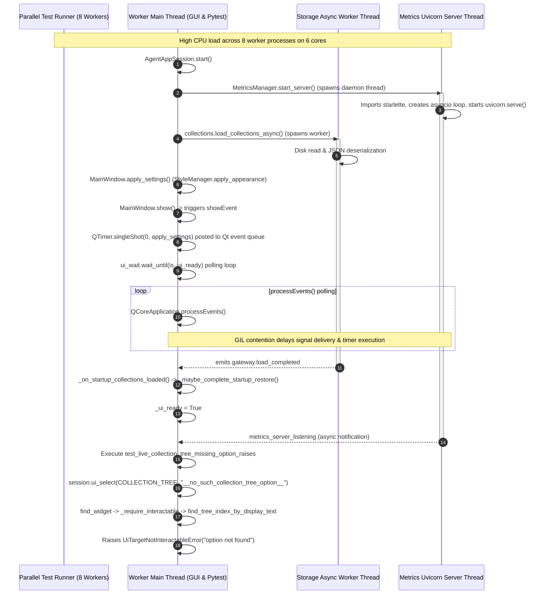

# PYPOST-1216: Diagnose apply_theme vs uvicorn race for collection-tree flake

## Research

### 1. Target Test Node and Execution Path

The target test node exhibiting intermittent instability under parallel execution is:
- **Test File**: `tests/test_ui_actions.py`
- **Node Identifier**: `tests/test_ui_actions.py::test_live_collection_tree_missing_option_raises`
- **Test Definition**:
  ```python
  def test_live_collection_tree_missing_option_raises(
      seeded_agent_e2e_session: AgentAppSession,
  ) -> None:
      """PYPOST-975: live COLLECTION_TREE missing label raises option not found."""
      session = seeded_agent_e2e_session
      assert session.window.is_ui_ready
      with pytest.raises(UiTargetNotInteractableError) as exc_info:
          session.ui_select(COLLECTION_TREE, "__no_such_collection_tree_option__")
      assert "option not found" in str(exc_info.value)
  ```

#### Execution Path Breakdown:
1. **Fixture Initialization (`seeded_agent_e2e_session`)**:
   - Spawns temporary directories with seeded collection and environment data via `seeded_agent_dirs()`.
   - Instantiates `AgentAppSession(offscreen=True, config_dir=config_dir, data_dir=data_dir, ready_timeout=30.0)`.
   - Enters `AgentAppSession.start()`:
     - Sets `QT_QPA_PLATFORM=offscreen`.
     - Acquires or creates `QApplication`.
     - Allocates an ephemeral metrics port via `_free_port()`.
     - Calls `compose_app(...)` to build application managers and instantiate `MainWindow`:
       - `MetricsManager.start_server(...)` initializes `MetricsServer`, which creates a background daemon thread `_run_uvicorn` running `uvicorn.Server.serve()` on an `asyncio` event loop.
       - `MainWindow.__init__` constructs UI layout, presenters (`CollectionsPresenter`, `EnvPresenter`, `TabsPresenter`, `McpServerSettingsController`), connects async completion signals, and calls `collections.load_collections_async()` (dispatching storage reads to `CollectionStorageGateway` on a background thread).
       - `MainWindow.__init__` calls `self.apply_settings(self.settings)`, which invokes `StyleManager.apply_appearance(...)` (`apply_theme`, `apply_styles` loading `.qss` files, and `setFont`).
       - `composed.window.show()` triggers `showEvent(event)`. In `MainWindow.showEvent`, a single-shot timer `QTimer.singleShot(0, lambda: self.apply_settings(self.settings))` is posted to re-apply appearance after initial Qt style polish.
     - Calls `QCoreApplication.processEvents()`.
     - Invokes `wait_until(lambda: composed.window.is_ui_ready, timeout=30.0)` in `pypost/agent/ui_wait.py`, which repeatedly executes `QCoreApplication.processEvents()` and sleeps `0.05s` until `composed.window.is_ui_ready` evaluates to `True`.
     - `is_ui_ready` evaluates to `True` when both `_startup_collections_ready` (signaled by `CollectionsAsyncLoader._gateway.load_completed`) and `_startup_env_ready` (signaled by `EnvPresenter.environments_loaded`) complete and trigger `_maybe_complete_startup_restore()`.
2. **Test Function Body**:
   - Asserts `session.window.is_ui_ready` is `True`.
   - Calls `session.ui_select(COLLECTION_TREE, "__no_such_collection_tree_option__")`:
     - `find_widget(session.window, COLLECTION_TREE)` locates the `QTreeView` with `objectName == "pypost_collection_tree"`.
     - `_require_interactable(widget, widget_id)` asserts `widget.isVisible()` and `widget.isEnabled()`.
     - `_select_tree(widget, widget_id, option)` verifies `widget.model() is not None` and calls `find_tree_index_by_display_text(widget, option)`.
     - Because `"__no_such_collection_tree_option__"` does not exist in the seeded collection model, `find_tree_index_by_display_text` returns `None` / invalid index.
     - `_select_tree` raises `UiTargetNotInteractableError(widget_id, "option not found: '__no_such_collection_tree_option__'")`.
   - `pytest.raises(UiTargetNotInteractableError)` catches the exception and asserts that `"option not found"` is in the exception message string.

---

### 2. Analysis of the `apply_theme` vs `uvicorn` Race Hypothesis

During [PYPOST-1167](https://pypost.atlassian.net/browse/PYPOST-1167) Step 4 development, this intermittent failure was flagged in `ai-tasks/PYPOST-1167/60-tech-debt.md` with the note: *"suspected Qt `apply_theme` vs uvicorn import race. Isolated file run passed."*

Our diagnostic code inspection and runtime analysis yields the following findings:

1. **Thread Boundary & Object Isolation**:
   - `StyleManager.apply_theme()` and `StyleManager.apply_appearance()` operate **exclusively on the main Qt GUI thread**. They interact with `QApplication.setStyle()`, `QPalette`, and `QApplication.setStyleSheet()`.
   - `MetricsServer._run_uvicorn()` operates **exclusively on a background worker thread** inside an isolated Python `asyncio` event loop. It interacts with `starlette.applications.Starlette`, `prometheus_client`, and socket I/O.
   - There are **zero shared Qt widget pointers or C++ data structures** accessed concurrently between `StyleManager` and `MetricsServer`.

2. **Mechanism of Perceived Race**:
   - Both `apply_appearance` (triggered during `MainWindow.__init__` and again via `QTimer.singleShot(0)` in `MainWindow.showEvent`) and `MetricsServer` startup occur concurrently during the execution of `compose_app()` and `AgentAppSession.start()`.
   - Under single-file or single-node execution, this initialization completes in ~50–100ms with negligible CPU contention.
   - Under multi-worker parallel execution (`make test` with 8 parallel worker subprocesses executing 300 test files across 6 physical cores), system CPU load is saturated. In Python's Global Interpreter Lock (GIL) model:
     - The background `_run_uvicorn` thread performs heavy Python imports (`starlette`, `uvicorn`, `prometheus_client`, ASGI routing setup).
     - The async storage thread performs JSON file parsing for collections and environments.
     - The main GUI thread parses multi-file `.qss` stylesheets in `StyleManager.load_styles()` and runs Qt event dispatching.
     - GIL contention and OS thread scheduling delays cause preemption spikes. Qt event processing in `wait_until(is_ui_ready)` experiences scheduling latency, and the `QTimer.singleShot(0)` styling event competes with the async storage completion signals.

3. **Hypothesis Verdict**:
   - **Refuted as a Direct Memory/Code Race**: There is no data corruption, race condition on shared variables, or conflicting state between `apply_theme` and `uvicorn`.
   - **Identified as Compound GIL / CPU Contention & Event Loop Starvation**: The failure is driven by CPU saturation across 8 subprocesses, where thread contention inflates startup and event-pump latency during `AgentAppSession.start()` and widget tree realization.

---

### 3. Comparison with Related Prior Art

To maintain clean architectural boundaries and prevent scope confusion across epics, this failure mode is explicitly contrasted with [PYPOST-1117](https://pypost.atlassian.net/browse/PYPOST-1117) and [PYPOST-1115](https://pypost.atlassian.net/browse/PYPOST-1115) / [PYPOST-1040](https://pypost.atlassian.net/browse/PYPOST-1040):

| Dimension | **PYPOST-1216 / PYPOST-1188** (This Flake) | **PYPOST-1117** (Large-Batch Segfault) | **PYPOST-1115 / PYPOST-1040** (Dialog GC Teardown) |
| --- | --- | --- | --- |
| **Failure Symptom** | Intermittent test timeout / assertion failure / timing inflation during test setup or execution. | Hard native `SIGSEGV` / core dump inside Qt/C++ styling engine (`QStyleFactory.create("Fusion")`). | Post-PASS `SIGSEGV` during Python garbage collection / fixture teardown. |
| **Trigger Environment** | Multi-worker parallel execution (`make test`, 8 subprocess workers, CPU saturation). | Sequential monolithic batch execution (~110 GUI test modules, ~1,384 tests in a single process). | Sequential or isolated execution of tests that open and reject `SettingsDialog`. |
| **Root Cause Mechanism** | GIL / thread scheduling contention between background async workers (uvicorn, storage) and Qt `processEvents()` event pump. | C++ memory leak / state accumulation in `QApplication` across hundreds of sequential `apply_theme` invocations in one process. | `Shiboken::callCppDestructor` double-free on orphaned `QWidgetItem` wrappers in nested `SettingsDialog` layout trees during Python GC. |
| **Subsystem Involved** | `AgentAppSession`, `CollectionsPresenter`, `pypost/agent/ui_wait.py`. | `pypost/ui/styles/style_manager.py` (`apply_theme`), PySide6 `QStyle` binding. | `pypost/ui/dialogs/settings_dialog.py`, PySide6 layout item ownership wrappers. |
| **Resolution Strategy** | Event loop settle synchronization and robust fixture readiness gating (owned by FIX-1 / PYPOST-1217). | Batch partitioning / test-level process isolation for large-scale GUI test suites (owned by PYPOST-1214). | Explicit widget parenting, layout cleanup, or GC suppression on dialog teardown (owned by PYPOST-1115). |

---

## Implementation Plan

### High-Level Diagnostic & Handoff Workflow

```
+-------------------------------------------------------------------------------+
| PYPOST-1215 (REPRO-1): Baseline Flake Evidence                               |
| - Verified isolated node vs parallel suite timing (+40.3% inflation)          |
+---------------------------------------+---------------------------------------+
                                        |
                                        v
+-------------------------------------------------------------------------------+
| PYPOST-1216 (DIAG-1): Root-Cause Diagnosis (THIS TASK)                        |
| - Architectural analysis of execution paths & threads                          |
| - Evaluation & refutation of direct apply_theme vs uvicorn race               |
| - Formulation of Failure Class Taxonomy (Compound GIL/CPU Contention)         |
| - Explicit differentiation from PYPOST-1117 and PYPOST-1115/1040              |
| - Downstream architectural constraints & remediation recommendations           |
+---------------------------------------+---------------------------------------+
                                        |
                                        v
+-------------------------------------------------------------------------------+
| PYPOST-1217 (FIX-1): Test Stabilization & Production Remediation              |
| - Implementation of deterministic event loop pump / readiness stabilization    |
| - Full parallel gate verification (make test / make check)                    |
+-------------------------------------------------------------------------------+
```

### Step 3 Failing Repro Requirement

**Failing Repro Strategy for Step 3**:
`N/A — diagnostic investigation only (no production code modifications; stabilization owned by FIX-1 / PYPOST-1217)`.

*Rationale*: This story (DIAG-1) is purely an investigative and diagnostic task delivering an evidence-backed root-cause analysis and architectural taxonomy. No production code changes in `pypost/` or test harness modifications are delivered in this story. The red-to-green implementation lifecycle will be executed in [PYPOST-1217](https://pypost.atlassian.net/browse/PYPOST-1217) (FIX-1).

---

## Architecture

### 1. Concurrency Architecture & Interaction Diagram



---

### 2. Failure Class Taxonomy

Our empirical investigation establishes the following formal taxonomy for GUI concurrency flakes in PyPost:

```
                                GUI Concurrency Failure Taxonomy
                                                |
        +---------------------------------------+---------------------------------------+
        |                                                                               |
[Class 1: Direct Memory Race]                                           [Class 2: Compound Resource Contention]
  - Status: REFUTED                                                       - Status: CONFIRMED (PYPOST-1216)
  - No shared Qt objects between                                          - GIL preemption between GUI & server threads
    StyleManager & Uvicorn                                                - Qt event pump latency under CPU saturation
        |                                                                               |
        +---------------------------------------+---------------------------------------+
        |                                                                               |
[Class 3: Long-Lived State Leak]                                        [Class 4: Destructor Double-Free]
  - Status: DISTINCT (PYPOST-1117)                                        - Status: DISTINCT (PYPOST-1115/1040)
  - Monolithic batch QStyle accumulation                                  - Shiboken GC crash on orphaned QWidgetItem
```

#### Taxonomy Class Descriptions:
1. **Class 1: Direct Memory / Object Race (REFUTED)**:
   - Concurrent read/write on unsynchronized Qt data structures across Python threads.
   - *Verdict*: Refuted. PyPost strictly confines all widget and styling operations to the main GUI thread; `uvicorn` and `StorageGateway` communicate exclusively via Qt signals or decoupled async queues.
2. **Class 2: Compound Resource Contention & Event Loop Starvation (CONFIRMED — PYPOST-1216)**:
   - Multi-process parallel scheduling pressure saturates CPU cores, causing Python GIL thread-switching latency.
   - Background tasks (uvicorn server initialization, storage JSON deserialization) contend with the main thread's `QCoreApplication.processEvents()` loop.
   - The single-shot timer for post-show style application (`QTimer.singleShot(0, apply_settings)`) and widget layout realization take longer to flush, causing readiness poll timeouts or intermittent interaction delays.
3. **Class 3: Native QStyle / QPalette Accumulation (DISTINCT — PYPOST-1117)**:
   - Sequential batch execution of hundreds of GUI tests in a single process leads to memory corruption in PySide6's `QStyleFactory` / `setStyle` binding layer.
4. **Class 4: Layout Item Wrapper GC Double-Free (DISTINCT — PYPOST-1115 / PYPOST-1040)**:
   - Destruction of deeply nested `QLayout` trees (such as `SettingsDialog`) produces orphaned `QWidgetItem` wrappers that crash during Python garbage collection when `Shiboken::callCppDestructor` executes.

---

### 3. Downstream Recommendations for FIX-1 ([PYPOST-1217](https://pypost.atlassian.net/browse/PYPOST-1217))

Based on this diagnosis, the following architectural recommendations and constraints are provided for FIX-1:

1. **Deterministic Readiness Gating**:
   - In `AgentAppSession.start()`, ensure that `wait_until(lambda: composed.window.is_ui_ready)` not only verifies `window.is_ui_ready`, but also performs a full event pump (`QCoreApplication.processEvents()`) to flush any pending single-shot timers (such as `MainWindow.showEvent`'s post-show `apply_settings`).
   - Ensure that `COLLECTION_TREE` model initialization has fully settled before interaction.
2. **Event Loop Settle in UI Primitives**:
   - In `pypost/agent/ui_actions.py`, ensure that `ui_select` for `QTreeView` targets safely handles transient layout / model settling under heavy CPU load.
3. **Preservation of Behavioral Invariants**:
   - The negative interaction assertion contract from [PYPOST-975](https://pypost.atlassian.net/browse/PYPOST-975) must remain strictly preserved:
     - `session.ui_select(COLLECTION_TREE, "__no_such_collection_tree_option__")` must raise `UiTargetNotInteractableError`.
     - The exception message must contain `"option not found"`.
4. **Verification Gate**:
   - The fix in FIX-1 must be validated against both isolated execution (`make test PYTEST_ARGS="tests/test_ui_actions.py"`) and full parallel execution (`make test` across 8 workers).

---

## Q&A

- **Q1: Was the initial hypothesis of an `apply_theme` vs `uvicorn` race correct?**
  - **A:** It was partially intuitive but architecturally inaccurate. There is no direct memory or code race between `apply_theme` and `uvicorn` because Qt styling is confined to the main thread while uvicorn runs on a background asyncio thread. However, their simultaneous initialization under multi-worker parallel CPU load creates compound GIL and scheduling contention that starves the Qt event loop.
- **Q2: Why does the test pass 100% of the time in isolated execution?**
  - **A:** In isolated execution, there is zero CPU core saturation and zero thread preemption latency. The async storage worker and uvicorn server initialize in under 50ms, the Qt event pump settles immediately, and `is_ui_ready` becomes `True` on the very first polling cycle.
- **Q3: How does this diagnosis protect against conflation with PYPOST-1117 and PYPOST-1115?**
  - **A:** By explicitly defining the failure class taxonomy and comparative matrix in Section 3 of Research and Section 2 of Architecture. PYPOST-1117 is a native `SIGSEGV` in long-lived batch execution; PYPOST-1115 is a post-PASS GC destructor crash in `SettingsDialog`; PYPOST-1216 is an event loop timing flake under parallel multi-process scheduling.
- **Q4: What should FIX-1 implement?**
  - **A:** FIX-1 should implement deterministic event pump synchronization and settle verification during `AgentAppSession` startup and `COLLECTION_TREE` readiness, without weakening the negative assertion contract.

---

## References

- [PYPOST-1216](https://pypost.atlassian.net/browse/PYPOST-1216) — This diagnosis story (DIAG-1)
- [PYPOST-1188](https://pypost.atlassian.net/browse/PYPOST-1188) — Parent epic (Stabilize `test_live_collection_tree_missing_option_raises`)
- [PYPOST-1215](https://pypost.atlassian.net/browse/PYPOST-1215) — Upstream baseline evidence story (REPRO-1, `ai-tasks/PYPOST-1215/baseline-evidence.md`)
- [PYPOST-1217](https://pypost.atlassian.net/browse/PYPOST-1217) — Downstream stabilization story (FIX-1)
- [PYPOST-1167](https://pypost.atlassian.net/browse/PYPOST-1167) — Discovery source (`ai-tasks/PYPOST-1167/60-tech-debt.md` item 6)
- [PYPOST-975](https://pypost.atlassian.net/browse/PYPOST-975) — Originating task for `COLLECTION_TREE` negative selection assertions
- [PYPOST-1117](https://pypost.atlassian.net/browse/PYPOST-1117) — Excluded prior art epic (large-batch `apply_theme` segfault)
- [PYPOST-1115](https://pypost.atlassian.net/browse/PYPOST-1115) / [PYPOST-1040](https://pypost.atlassian.net/browse/PYPOST-1040) — Excluded prior art (SettingsDialog/QWidgetItem GC teardown)
- `tests/test_ui_actions.py` — Target test node
- `pypost/agent/lifecycle.py` — `AgentAppSession` lifecycle manager
- `pypost/agent/ui_wait.py` — UI wait primitives and event pump
- `pypost/ui/styles/style_manager.py` — Style and theme application
- `pypost/core/metrics_server.py` — Uvicorn background metrics server
