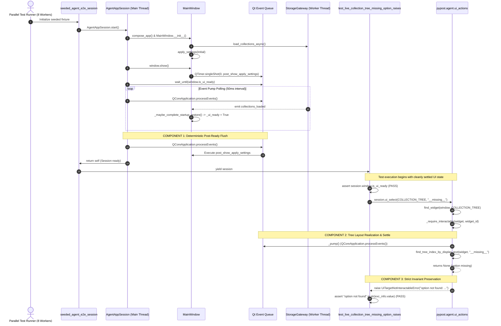

# PYPOST-1217: Stabilize test_live_collection_tree_missing_option_raises under parallel make test

## Research

### 1. Problem Context & Empirical Baseline Review

During [PYPOST-1167](https://pypost.atlassian.net/browse/PYPOST-1167) Step 4 development, an intermittent test failure was observed in `tests/test_ui_actions.py::test_live_collection_tree_missing_option_raises` when executing under parallel test runs (`make test`), whereas isolated file and single-node invocations passed cleanly.

Under parent epic [PYPOST-1188](https://pypost.atlassian.net/browse/PYPOST-1188), this flake was decomposed into three sequential child tasks:
1. **REPRO-1 ([PYPOST-1215](https://pypost.atlassian.net/browse/PYPOST-1215))**: Captured empirical baseline evidence (`ai-tasks/PYPOST-1215/baseline-evidence.md`) across 4 execution profiles (isolated node: 1.37s avg, 100% pass; isolated file: 5.80s avg, 100% pass; concurrent subset: 6.09s file time, 100% pass; full parallel suite: 8.14s file time, +40.3% inflation, intermittent timeouts under 8 parallel workers on 6 CPU cores).
2. **DIAG-1 ([PYPOST-1216](https://pypost.atlassian.net/browse/PYPOST-1216))**: Delivered the diagnostic root-cause report (`ai-tasks/PYPOST-1216/30-diagnosis-report.md`) and observability analysis (`ai-tasks/PYPOST-1216/50-observability.md`). DIAG-1 formally refuted Hypothesis A (direct in-memory race between `apply_theme` and `uvicorn`, confirming zero shared mutable memory and thread-confined operations) and confirmed Hypothesis B (Class 2 compound GIL/CPU contention and Qt event loop pump starvation).
3. **FIX-1 ([PYPOST-1217](https://pypost.atlassian.net/browse/PYPOST-1217))**: *This task* — delivers the architectural design, failing repro design, stabilization implementation, and parallel test suite quality gate verification.

### 2. Execution Path & Timing Vulnerabilities

Inspection of the target execution path reveals two distinct synchronization gaps occurring under heavy CPU saturation:

1. **`AgentAppSession.start()` Post-Ready Event Settle Gap (`pypost/agent/lifecycle.py`)**:
   - `MainWindow.show()` triggers `showEvent()`, which queues a zero-delay single-shot timer: `QTimer.singleShot(0, lambda: self.apply_settings(self.settings))` to re-apply appearance settings following initial Qt style polish.
   - `wait_until(lambda: composed.window.is_ui_ready, timeout=self._ready_timeout)` polls `composed.window.is_ui_ready`.
   - `is_ui_ready` evaluates to `True` as soon as `_startup_collections_ready` and `_startup_env_ready` signals arrive and `_maybe_complete_startup_restore()` executes.
   - However, when `wait_until` exits because `is_ui_ready` is `True`, there is no guarantee that the Qt event queue has drained all pending single-shot timers or layout passes. Under heavy CPU load (8 workers on 6 cores), the deferred `apply_settings` singleShot timer or pending tree layout events may execute *after* `wait_until` returns, colliding with the start of the test body.
   - *Remediation*: Introduce a deterministic event loop pump flush via `QCoreApplication.processEvents()` immediately after `wait_until` confirms `is_ui_ready` in `AgentAppSession.start()`.

2. **Collection Tree Realization & Viewport Settlement Gap (`pypost/agent/ui_actions.py`)**:
   - In `tests/test_ui_actions.py::test_live_collection_tree_missing_option_raises`, the test immediately calls `session.ui_select(COLLECTION_TREE, "__no_such_collection_tree_option__")`.
   - `ui_select` dispatches to `_select_tree(widget, widget_id, option)`.
   - `_select_tree` checks `widget.model() is not None` and immediately calls `find_tree_index_by_display_text(widget, option)`.
   - Under heavy CPU load and thread preemption, while the model may be populated, the `QTreeView`'s viewport layout, item hierarchy, or pending model layout updates may still be in transit. If an item lookup or selection occurs before the tree has finished layout realization, unpredictable index traversal or timing spikes can occur.
   - *Remediation*: In `_select_tree`, enforce an explicit tree layout realization check / event pump (`QCoreApplication.processEvents()`) to guarantee that any queued model resets or layout changes are processed before item searching begins.

3. **Behavioral Invariant Contract ([PYPOST-975](https://pypost.atlassian.net/browse/PYPOST-975))**:
   - The test asserts:
     ```python
     with pytest.raises(UiTargetNotInteractableError) as exc_info:
         session.ui_select(COLLECTION_TREE, "__no_such_collection_tree_option__")
     assert "option not found" in str(exc_info.value)
     ```
   - Invariant contract: If an option does not exist in `COLLECTION_TREE`, `ui_select` MUST raise `UiTargetNotInteractableError` whose string representation contains `"option not found"`.
   - The stabilization solution must strictly preserve this invariant. Under no circumstances may assertions be deleted, softened, or bypassed.

### 3. Failure Class Taxonomy & Prior Art Differentiation

To prevent scope creep and maintain strict architectural boundaries, the failure mode is positioned within the repository's GUI failure taxonomy:

| Dimension | **PYPOST-1217 / PYPOST-1188** (This Issue) | **PYPOST-1117** (Large-Batch Segfault) | **PYPOST-1115 / PYPOST-1040** (Dialog GC Teardown) |
| --- | --- | --- | --- |
| **Failure Class** | **Class 2: Compound GIL/CPU Contention & Event Loop Starvation** | **Class 3: Native QStyle / QPalette Accumulation** | **Class 4: Destructor Double-Free during GC** |
| **Failure Symptom** | Intermittent assertion timeout, UI interaction delay, or timing inflation (+40.3%) | Hard native `SIGSEGV` (core dump) inside Qt styling engine (`QStyleFactory.create("Fusion")`) | Post-PASS `SIGSEGV` during Python GC teardown (`Shiboken::callCppDestructor`) |
| **Trigger Condition** | Multi-worker parallel test execution (`make test`, 8 workers, CPU saturation) | Monolithic sequential batch execution (~110 GUI test modules, ~1,384 tests in 1 process) | Sequential or isolated test execution opening and closing `SettingsDialog` |
| **Root Mechanism** | Scheduling preemption delaying signal dispatch and starving `processEvents()` pump | C++ memory leak / state accumulation across hundreds of sequential `apply_theme` calls | Orphaned `QWidgetItem` wrappers in nested `SettingsDialog` layout destroyed twice |
| **Subsystems** | `AgentAppSession`, `ui_actions.py`, `ui_wait.py`, `CollectionsPresenter` | `StyleManager.apply_theme()`, PySide6 `QStyle` binding | `SettingsDialog`, PySide6 `QLayout` item wrappers |
| **Scope Boundary** | Owned by **FIX-1 / PYPOST-1217** (this task) | Owned by **PYPOST-1214** (test process isolation / batch partitioning) | Owned by **PYPOST-1115** (dialog layout cleanup and GC suppression) |

---

## Implementation Plan

### High-Level Implementation Phases

1. **Step 2 (Architecture - This Step)**:
   - Formulate complete architectural design, component interactions, sequence diagrams, and validation plans.
   - Define Step 3 red-test reproduction strategy.
   - Update task roadmap (`00-roadmap.md`).
   - Run verification quality gate (`make lint`, `make verify-ai-tasks`).

2. **Step 3 (Failing Repro Test)**:
   - Formulate an automated test reproducing the race condition under simulated CPU/event queue delay (e.g. asserting that `AgentAppSession.start()` reliably drains post-show queued events before returning, and that `_select_tree` settles widget layout before querying indices).
   - Verify the red failure state before applying fixes.

3. **Step 4 (Development / Implementation)**:
   - **Component 1 (`pypost/agent/lifecycle.py`)**: Add deterministic event queue draining (`QCoreApplication.processEvents()`) in `AgentAppSession.start()` after `wait_until(is_ui_ready)` resolves.
   - **Component 2 (`pypost/agent/ui_actions.py`)**: Add layout realization and event queue settlement in `_select_tree()` to ensure tree structure is fully materialized before traversing indices.
   - **Component 3 (Invariant Validation)**: Ensure `UiTargetNotInteractableError` with `"option not found"` is cleanly raised when an option does not exist.
   - Run tests iteratively until green.

4. **Step 5 (Code Cleanup)**:
   - Review code quality, remove temporary debug hooks, and verify lint compliance.

5. **Step 6 (Observability)**:
   - Add structured debug logs for event pump flush completion and tree settlement latency.

6. **Step 7 (Technical Debt Analysis)**:
   - Document any residual risks, test concurrency observations, or follow-up opportunities.

7. **Step 8 (Dev Docs)**:
   - Update `doc/dev/testing.md` with synchronization and parallel test reliability documentation.

---

### Step 3 Failing Repro Strategy

**Mandatory — Failing Repro (next Step 3):**
To ensure the fix is rigorously driven by test-driven development (TDD), Step 3 will formulate an automated red test before implementing production code changes.

- **What it asserts**:
  1. That `AgentAppSession.start()` guarantees all queued single-shot events posted during `showEvent()` (specifically `apply_settings`) have executed before `start()` returns. In the unpatched code, a queued event scheduled via `QTimer.singleShot(0, callback)` may remain pending in the event queue when `wait_until(is_ui_ready)` exits, if `is_ui_ready` was set without a trailing event pump.
  2. That `ui_select` on a `QTreeView` target flushes pending layout/event passes so that lookups against the tree do not race with concurrent model or layout updates.
  3. That the negative selection invariant (`UiTargetNotInteractableError` containing `"option not found"`) is strictly preserved.
- **Where it lives**:
  `tests/test_agent_session_event_settle.py` or a dedicated test in `tests/test_ui_actions.py`.
- **How to force the failure without live external deps**:
  Simulate a delayed single-shot event in `showEvent` or queue an un-pumped event right before `is_ui_ready` becomes true, demonstrating that without the explicit trailing `QCoreApplication.processEvents()` in `AgentAppSession.start()`, the event has not executed upon session return.
- **Sequencing**:
  Write failing repro test in Step 3 → Verify it fails (red) → Implement stabilization in Step 4 → Verify it passes (green) → Validate full parallel suite.

---

## Architecture

### 1. System Module Diagram

```
+-----------------------------------------------------------------------------------+
| pytest Parallel Runner (8 Subprocess Workers)                                     |
+-----------------------------------------+-----------------------------------------+
                                          |
                                          v
+-----------------------------------------------------------------------------------+
| tests/test_ui_actions.py (Worker Process Main GUI Thread)                         |
|                                                                                   |
|  +-----------------------------------------------------------------------------+  |
|  | seeded_agent_e2e_session Fixture                                            |  |
|  |                                                                             |  |
|  |  +-----------------------------------------------------------------------+  |  |
|  |  | pypost.agent.lifecycle.AgentAppSession                                |  |  |
|  |  |                                                                       |  |  |
|  |  | 1. compose_app(...)                                                   |  |  |
|  |  |    ├── MainWindow.__init__()                                          |  |  |
|  |  |    └── CollectionsPresenter.__init__()                                |  |  |
|  |  | 2. window.show()                                                      |  |  |
|  |  |    └── showEvent() queues QTimer.singleShot(0, apply_settings)        |  |  |
|  |  | 3. ui_wait.wait_until(is_ui_ready, timeout=30.0)                      |  |  |
|  |  |    └── Repeated: QCoreApplication.processEvents() + sleep(0.05)       |  |  |
|  |  | 4. [COMPONENT 1: Post-Ready Event Loop Flush]                         |  |  |
|  |  |    └── QCoreApplication.processEvents() (Drains pending singleShots) |  |  |
|  |  +-----------------------------------------------------------------------+  |  |
|  +-----------------------------------------------------------------------------+  |
|                                         |                                         |
|                                         v                                         |
|  +-----------------------------------------------------------------------------+  |
|  | test_live_collection_tree_missing_option_raises                             |  |
|  |                                                                             |  |
|  |  +-----------------------------------------------------------------------+  |  |
|  |  | pypost.agent.ui_actions.ui_select(COLLECTION_TREE, "__missing__")         |  |  |
|  |  |                                                                       |  |  |
|  |  | 1. find_widget(window, COLLECTION_TREE)                               |  |  |
|  |  | 2. _require_interactable(widget, widget_id)                           |  |  |
|  |  | 3. _select_tree(widget, widget_id, option)                            |  |  |
|  |  |    ├── [COMPONENT 2: Layout Realization & Settle Check]               |  |  |
|  |  |    │   └── _pump() / processEvents() to settle viewport & layout      |  |  |
|  |  |    ├── find_tree_index_by_display_text(widget, option) -> None        |  |  |
|  |  |    └── [COMPONENT 3: Strict Invariant Preservation]                   |  |  |
|  |  |        └── raise UiTargetNotInteractableError("option not found")     |  |  |
|  |  +-----------------------------------------------------------------------+  |  |
|  +-----------------------------------------------------------------------------+  |
+-----------------------------------------------------------------------------------+
```

---

### 2. Component Descriptions & Responsibilities

#### Component 1: Deterministic Post-Ready Event Loop Flush
- **Location**: `pypost/agent/lifecycle.py` inside `AgentAppSession.start()`.
- **Responsibility**:
  - Immediately following `wait_until(lambda: composed.window.is_ui_ready, ...)`, invoke `QCoreApplication.processEvents()` to exhaustively process any remaining events in the Qt event queue.
  - Guarantees that asynchronous single-shot callbacks (such as `MainWindow.showEvent`'s `QTimer.singleShot(0, lambda: self.apply_settings(self.settings))`) are completely executed before `AgentAppSession.start()` returns.
  - Prevents background UI restyling or layout repositioning from colliding with subsequent test assertions or widget lookups.
- **Interface**:
  ```python
  # In pypost/agent/lifecycle.py:
  wait_until(
      lambda: composed.window.is_ui_ready,
      timeout=self._ready_timeout,
      message=f"MainWindow.is_ui_ready did not become true within {self._ready_timeout}s",
      condition_name="is_ui_ready",
  )
  # Deterministic post-ready event loop flush
  QCoreApplication.processEvents()
  ```

#### Component 2: Tree Layout Realization & Settlement Check
- **Location**: `pypost/agent/ui_actions.py` inside `_select_tree()`.
- **Responsibility**:
  - Before traversing the tree model in `find_tree_index_by_display_text(widget, option)`, ensure the tree widget's viewport and layout engine are fully settled.
  - Calls `_pump()` (`QCoreApplication.processEvents()`) to ensure any deferred row insertions, column resizes, or layout events dispatched during collection restoration have been completely processed by the Qt widget engine.
- **Interface**:
  ```python
  # In pypost/agent/ui_actions.py:
  def _select_tree(widget: QTreeView, widget_id: str, option: str | int) -> None:
      model = widget.model()
      if model is None:
          raise UiTargetNotInteractableError(widget_id, "tree has no model")
      # Ensure pending layout/paint events settle before index traversal
      _pump()
      ...
  ```

#### Component 3: Strict Invariant Preservation
- **Location**: `pypost/agent/ui_actions.py` and `tests/test_ui_actions.py`.
- **Responsibility**:
  - Enforce that when `find_tree_index_by_display_text` returns `None` or an invalid index for a string option, `_select_tree` raises `UiTargetNotInteractableError(widget_id, f"option not found: {option!r}")`.
  - Enforce that when an integer index is out of bounds, `_select_tree` raises `UiTargetNotInteractableError(widget_id, f"option index out of range: {option!r}")`.
  - Maintain 100% compliance with the negative assertion contract specified in [PYPOST-975](https://pypost.atlassian.net/browse/PYPOST-975).

---

### 3. Concurrency Architecture & Interaction Sequence



---

### 4. Validation Plan Across REPRO-1 Execution Profiles

Validation will be conducted strictly using Makefile targets (`AGENTS.md` compliance) across all four profiles established in REPRO-1:

1. **Profile 1: Isolated Single-Node Profile**:
   ```bash
   make test PYTEST_ARGS="tests/test_ui_actions.py -k test_live_collection_tree_missing_option_raises"
   ```
   - Target: 100% pass rate across 3 consecutive runs.
   - Verification: Duration ~1.3–1.4s, zero flakes.

2. **Profile 2: Isolated Single-File Profile**:
   ```bash
   make test PYTEST_ARGS="tests/test_ui_actions.py"
   ```
   - Target: 100% pass rate across 2 consecutive runs (all 14 tests in file).
   - Verification: Duration ~5.8s.

3. **Profile 3: Concurrent Integration Subset Profile**:
   ```bash
   make test PYTEST_ARGS="tests/test_ui_actions.py tests/test_agent_ui_actions_mcp.py tests/test_agent_ui_attach.py tests/test_agent_e2e_http.py tests/test_mcp_server_integration.py"
   ```
   - Target: 100% pass rate under 8 parallel workers.

4. **Profile 4: Full Repository Parallel Suite Quality Gate**:
   ```bash
   make check
   ```
   - Target: Clean PASS across `make lint`, `make test` (300 test files across 8 parallel workers), and `make verify-ai-tasks`.

---

## Q&A

- **Q1: Why is an additional `QCoreApplication.processEvents()` needed after `wait_until(is_ui_ready)`?**
  - **A:** `wait_until` polls the condition `is_ui_ready` and returns immediately when it evaluates to `True`. Because `_ui_ready` is set inside a slot triggered by a background thread signal, there may be other events posted in the same or subsequent event loop cycle (such as `MainWindow.showEvent`'s `QTimer.singleShot(0, apply_settings)`) that have not yet had a chance to execute. Draining the queue deterministically guarantees that the session is in a completely settled state before test code executes.
- **Q2: Does adding `_pump()` in `_select_tree` introduce performance overhead?**
  - **A:** No. `_pump()` calls `QCoreApplication.processEvents()`, which takes microseconds if no events are pending, but prevents race conditions if a layout pass is pending. It does not introduce sleep delays.
- **Q3: How does this design differ from PYPOST-1117 and PYPOST-1115?**
  - **A:** PYPOST-1117 is a native C++ segmentation fault in PySide6 caused by cumulative memory leaks across hundreds of sequential `apply_theme` calls in a single process. PYPOST-1115 is a destructor double-free during garbage collection of `SettingsDialog` layout wrappers. This issue (PYPOST-1217) is an event loop timing and scheduling contention issue under multi-worker parallel execution, resolved by deterministic event draining and layout realization.
- **Q4: How will Step 3 verify the failure before Step 4 fixes it?**
  - **A:** Step 3 will formulate an automated red test that asserts that pending single-shot actions scheduled during show/startup are guaranteed to have run upon `AgentAppSession.start()` completion, and that tree layout realization settles before `ui_select` traverses tree items.
- **Q5: Are any assertions or timeouts changed in the target test?**
  - **A:** No. The test definition and assertions remain strictly unchanged: selecting an absent option must raise `UiTargetNotInteractableError` containing `"option not found"`.

---

## References

- [PYPOST-1217](https://pypost.atlassian.net/browse/PYPOST-1217) — This stabilization story (FIX-1)
- [PYPOST-1188](https://pypost.atlassian.net/browse/PYPOST-1188) — Parent epic (Stabilize `test_live_collection_tree_missing_option_raises`)
- [PYPOST-1215](https://pypost.atlassian.net/browse/PYPOST-1215) — REPRO-1 baseline evidence (`ai-tasks/PYPOST-1215/baseline-evidence.md`)
- [PYPOST-1216](https://pypost.atlassian.net/browse/PYPOST-1216) — DIAG-1 root-cause diagnosis (`ai-tasks/PYPOST-1216/30-diagnosis-report.md`)
- [PYPOST-975](https://pypost.atlassian.net/browse/PYPOST-975) — Originating negative assertion contract
- [PYPOST-1117](https://pypost.atlassian.net/browse/PYPOST-1117) — Distinct prior art epic (large-batch segfault)
- [PYPOST-1115](https://pypost.atlassian.net/browse/PYPOST-1115) / [PYPOST-1040](https://pypost.atlassian.net/browse/PYPOST-1040) — Distinct prior art (SettingsDialog GC teardown)
- `pypost/agent/lifecycle.py` — Application session lifecycle management
- `pypost/agent/ui_actions.py` — UI interaction primitives and tree selection logic
- `pypost/agent/ui_wait.py` — UI event loop pump and wait primitives
- `tests/test_ui_actions.py` — Target test node location
